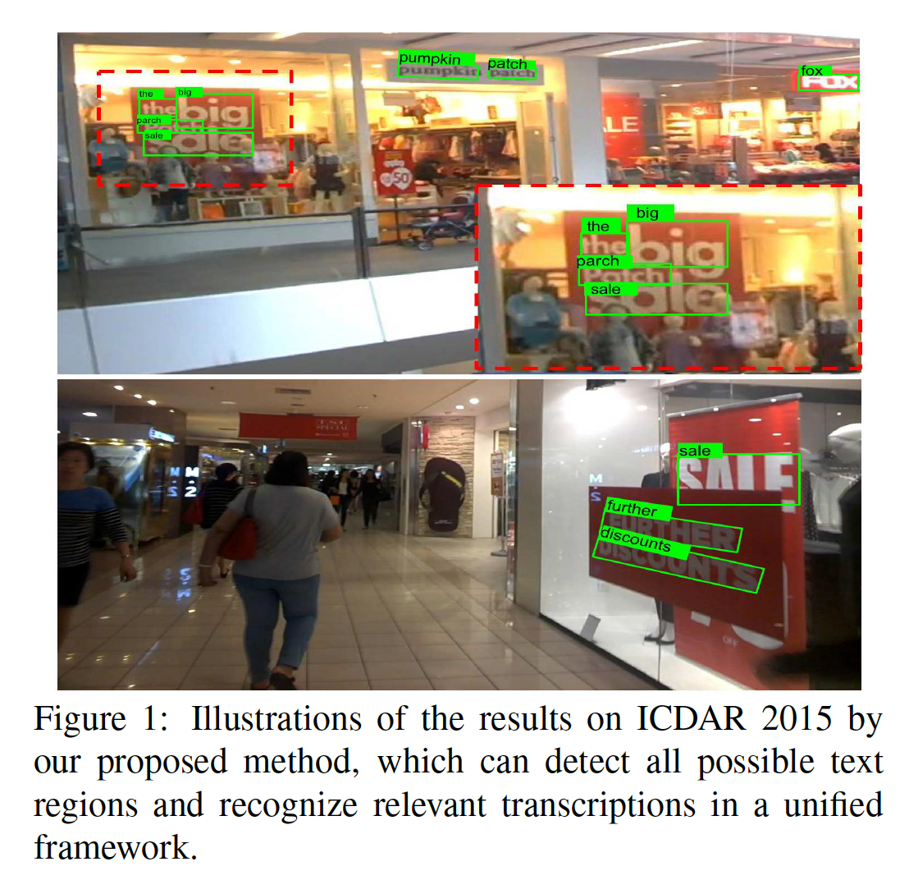
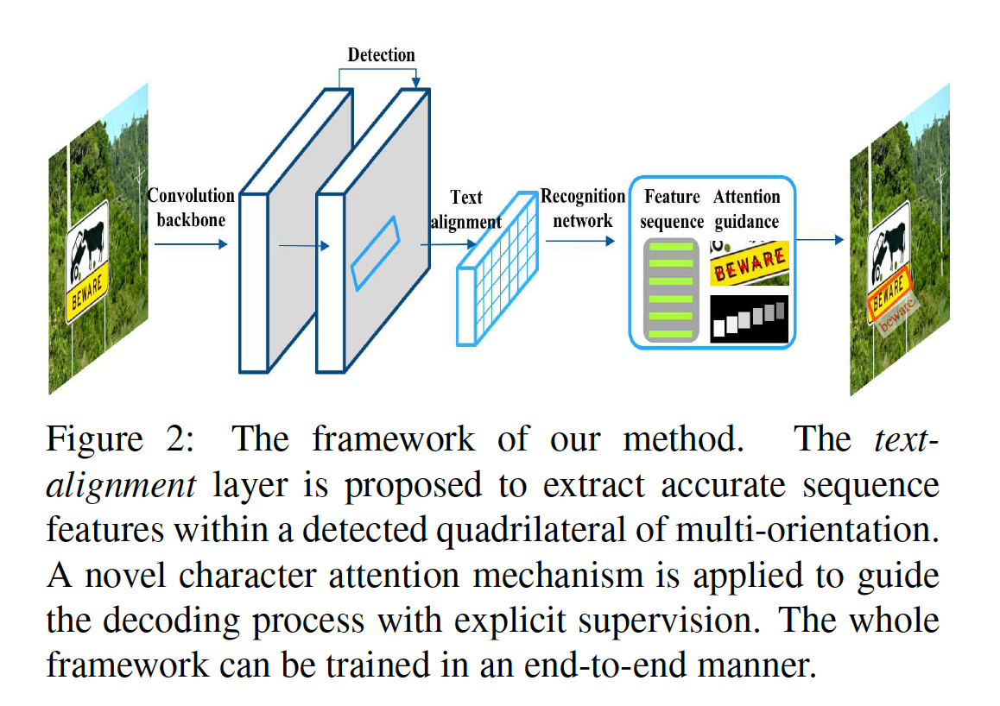
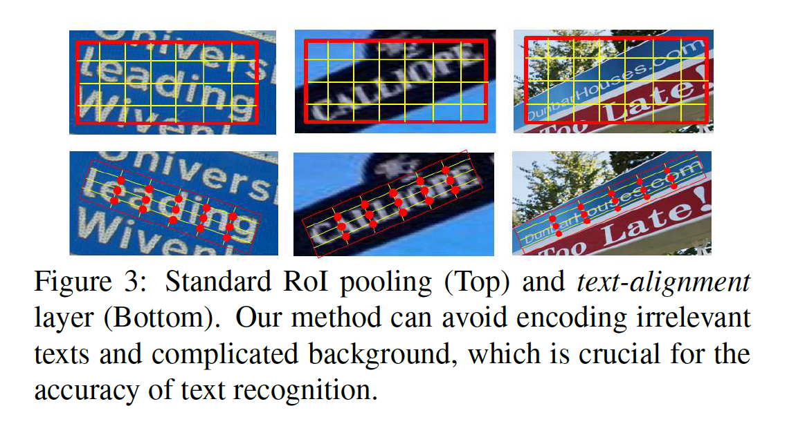
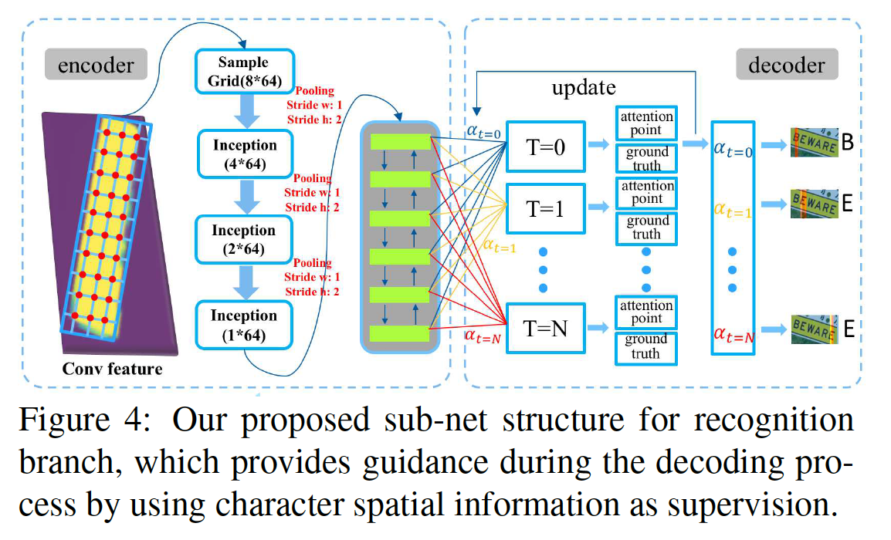
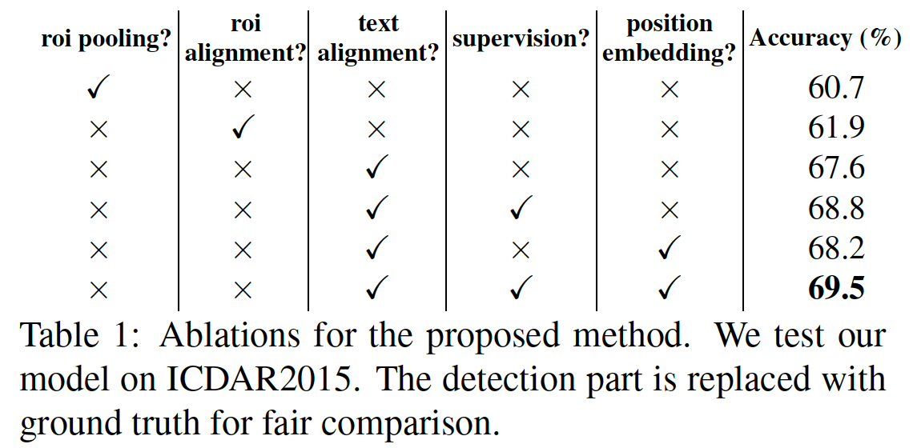
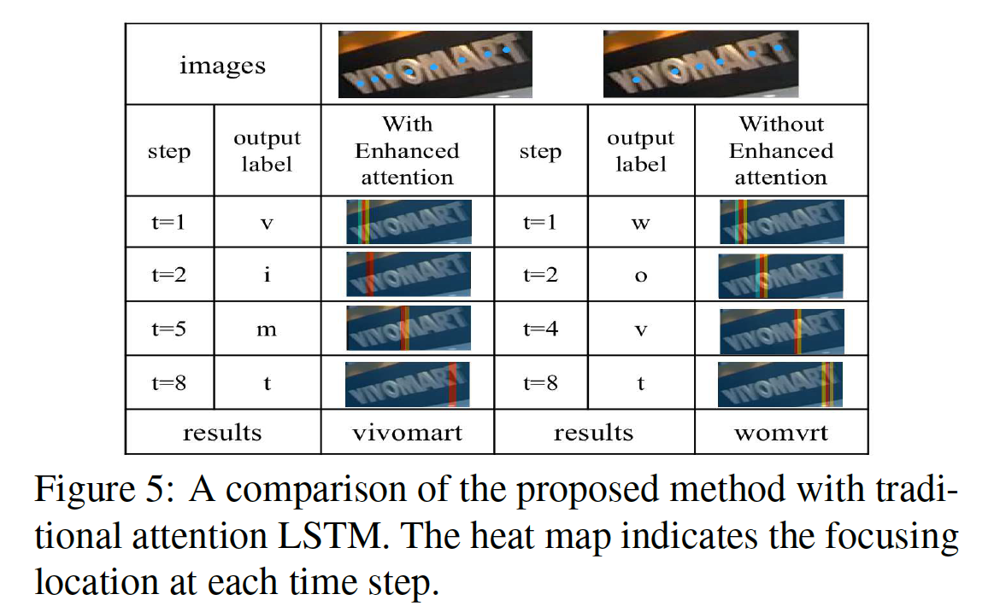
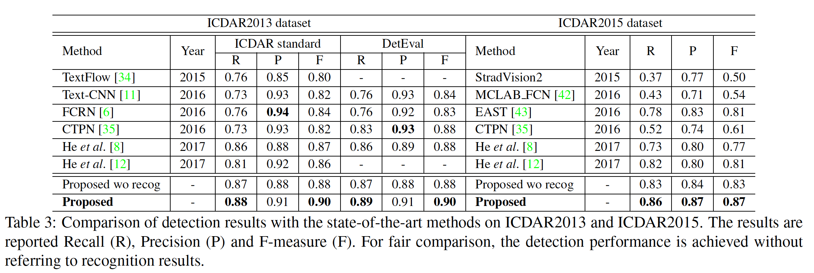
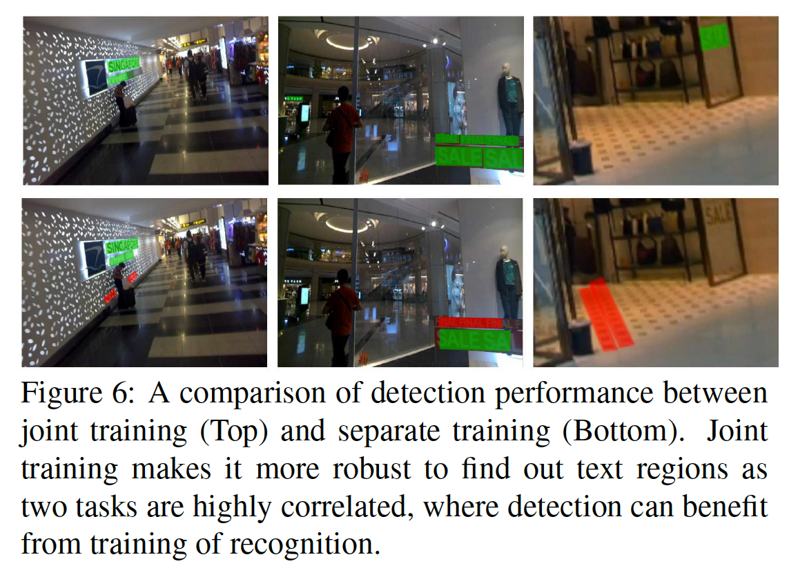
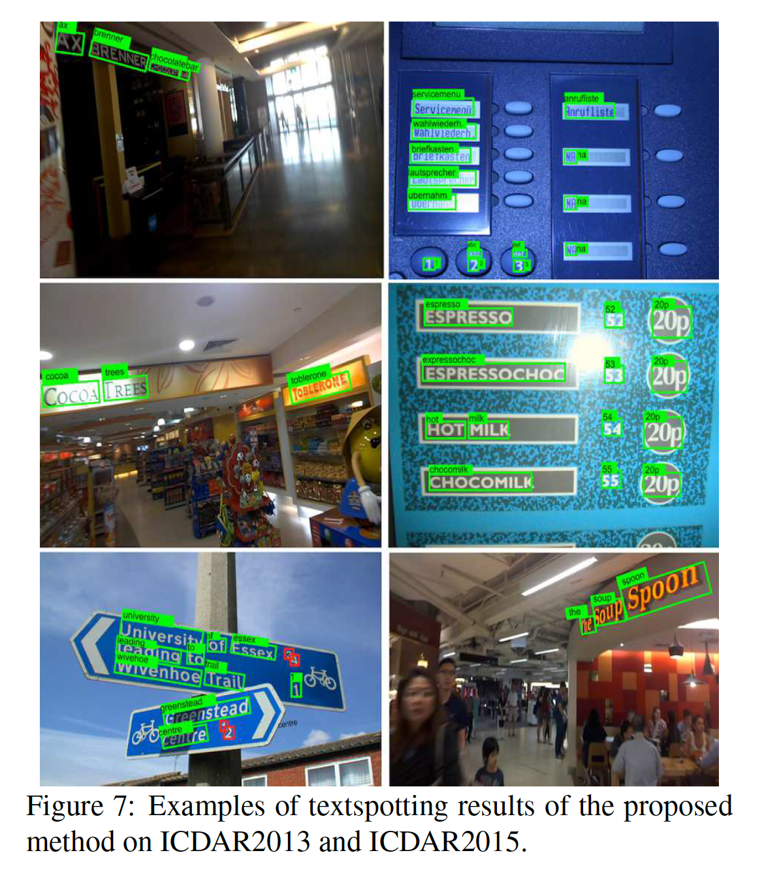
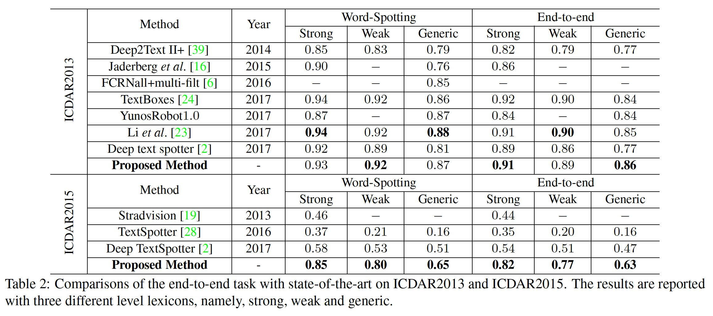

## An End-to-End TextSpotter with Explicit Alignment and Attention

### 摘要

​		自然场景中的文本检测和识别长期被认为是两个依次处理的单独任务。由于学习困难和收敛速度的显着差异，共同训练两项任务并非易事。在这项工作中，我们提出一种概念上简单而高效的框架，其在统一框架中同时处理这两个任务。我们的主要贡献有三个方面：（1）我们提出一种新颖的文本对齐（text-alignment）层，其运行它精准地计算任意方向文本实例的卷积特征，这是提升性能的关键；（2）将字符空间信息作为显式监督，从而引入字符注意力机制（character attention mechanism），这在识别上产生很大改进。两种技术以及用于单词识别的新RNN分支无缝集成到了一个可端到端训练的单一模型中。这使两个任务可以通过共享卷积特征来协同工作，这对于识别具有挑战性的文本实例至关重要。我们的模型在ICDAR 2015上的端到端识别中获得了令人印象深刻的结果[19]，大大提高了最新结果[2]，并通过分别使用强词库、弱词库和通用词库将F-measure从（0.54、0.51、0.47）提高到（0.82、0.77、 0.63）。由于联合训练，我们的方法还可以通过在相关基准上获得最新的最新检测性能来充当良好的检测器。代码见 https://github.com/tonghe90/textspotter 。

### 1. 引言

​		text spotting 目的是将输入的自然图像映射到一组字符序列或单词以及相应的位置。由于它的众多潜在应用，在视觉界引起了越来越多的关注。依靠最近的深度学习技术的浪潮，它已经取得了快速的进步，正如最近的工作[17、8、2、23、12、35、43、31、33、22、26]所证实的。但是，由于文本实例通常会在字体、尺度和方向上表现出巨大的多样性，并具有各种照明效果（通常来自高度复杂的背景），自然场景中的text spotting仍然是一个开发问题。

​		text spotting的过去工作通常将其视为两个单独的任务：文本检测和单词识别，它们依次实现。文本检测的目标是精确定位自然场景中的文本实例（例如单词），然后，在所有检测到的区域中重复处理识别模型，以识别相应的文本。文本检测的最新方法主要通过直接回归每个文本实例的边界框，扩展自通用目标检测器（例如Faster R-CNN和SSD），或者通过每个像素的预测文本/非文本概率扩展自语义分割方法（例如全卷积网络FCN）。通过精心设计和开发模型，可以针对这些高度域特定的任务，对这些方法进行适当的定制，并实现最新的性能[8、12、35、43、31、42]。单词识别可以转换为序列标签问题，其中最近开发了卷积循环模型[31、9]。它们中的一些进一步纳入注意力机制来提高性能[21、1]。但是，单独训练两个任务没有完整利用卷积网络的潜力，其中卷积特征不是共享的。如果我们清楚地理解或识别单词及其中所有字符的含义，那么我们做出更可靠的决定是很自然的。此外，它还可能引入大量启发式规则和调整成本很高的超参数，这是整个系统高度复杂。

​		最近的Mask R-CNN将实例分割纳入Faster R-CNN检测框架，产生联合预测每个目标实例边界框和分割掩膜的多任务学习模型。我们的工作从该流水线中汲取了灵感，但是其目标是学习输入图像和一组字符序列之间的直接映射。我们在文本检测框架内创建用于单词识别的循环序列建模分支，其中基于RNN的单词识别与检测任务并行处理。

​		但是，梯度在时间上反向传播的RNN分支显然比检测中边界框回归的任务更难优化。这自然导致两个任务在学习难度和收敛速度上存在显着差异，从而使得该模型特别难以共同训练。例如，训练文本检测模型的度大约为 $10^3$ （例如ICDAR 2015上的1000张训练图像），但是，当训练基于RNN的文本识别模型时，这个数量明显增加许多数量级，例如[6]中使用的800K合成图像。此外，仅使用一组字符序列作为直接监督可能过于抽象（高级），无法为有效地训练这种集成模型提供有意义的详细信息，这将使模型难以收敛。在这项工作中，我们在单词和字符水平上都引入空间约束，其允许通过在每步中减小搜索空间以渐进地优化模型。

​		**贡献**	在这项工作中，我们提出了一种端到端的 textspotter，它能够学习输入图像与一组字符序列或单词之间的直接映射。我们提出了一种解决方案，该解决方案将尾部用于多方向文本检测的文本对齐层（text-alignment layer）与字符级注意力机制结合在一起，该机制将字符的强大空间信息显式编码到RNN分支中，如图1所示。这两种技术均忠实地保留了文本实例和字符级中的准确空间信息，在提高整体性能方面发挥了关键作用。我们开发了一种原则性的学习策略，可以通过共享卷积特征来协同训练两个任务。我们的主要贡献如下。

​		第一，我们通过引入网格采样方案（grid sampling scheme）而不是传统的RoI池化来开发文本对齐层。它计算固定长度的卷积特征，其精准地对齐到坚持的到的任意文本区域，成功地避免了RoI池化的方向和量化因子引起的副作用。

​		第二，我们通过将字符级空间信息用作额外的监督引入字符级注意力机制。它将字符的强壮空间信息显式地编码到模型，其允许RNN关注解码过程中的循环注意力特征，产生单词识别的性能提升。

​		第三，两种方法，再加上用于单词识别的新RNN分支，都完美地集成到CNN检测框架中，从而形成可以端到端方式训练的单模型。我们开发了一种原则性和直观的学习策略，通过共享特征可以有效地训练这两项任务，并且快速收敛。

​		最后，我们通过实验表明，单词识别可以显着提高模型中的检测准确性，这表明它们具有很强的互补性，这是此域特定应用程序所独有的。我们的模型在ICDAR2015上实现了多方向文本的端到端识别，获得了最佳结果，大大优于[2]中的最佳结果，并且F-measure从（0.54、0.51、0.47）提高奥（0.82、0.77、0.63），这取决于使用强、弱和通用词典。

### 2. 相关工作

​		这里，我们简要介绍文本检测、识别以及最新端到端wordspotting的相关工作。

​		**场景文本检测**	最近的方法将先前的基于字符文本检测 [14、15、11、37] 转换为直接文本区域估计 [24、43、42、10、8、41、38]，通过将单词或文本行作为一个整体进行检测，从而避免了多个自下而上的后处理步骤。基于最近的目标检测器Faster-RCNN [29]的进展，Tian等人[35] 提出了一种新颖的连接主义者文本提案网络（Connectionist Text Proposal Network：CTPN），该网络可以从卷积层中检测一系列精细文本提议中的文本行，并采用了新的RNN设计。Liao等[24]将SSD扩展到文本检测。He等[8] 提出了一种文本注意力模块，该模块能够从卷积特征中自动学习粗糙文本区域的注意力。这允许模型产生高度准确的单发（one-shot）文本检测。在 [12] 中，作者提出了一种通过计算文本区域各点与顶点坐标之间的偏移量来生成任意四边形的方法。有人提出了一种弱监督文本检测器WeText，以从未标注或弱标注的数据中学习[33]。Zhou等将IoU损失用于文本检测，其在每个空间位置密集地回归文本边界框。

​		**场景文本识别**	随着递归神经网络在手写识别和语音翻译方面的成功，序列模型最近已应用于场景文本识别。例如，He等[9]将单词识别任务转换为序列标签问题，其中通过将LSTM和CTC纳入统一框架而引入编码-解码过程。Shi等人在[31]中也开展了类似的工作，并结合了Spatial Transformer Networks[17]进行自动校正[32]。Lee等[21]提出一种基于注意力的LSTM进行单词识别。但是，这些注意力权重可以从数据的分布中完全学习，而无需任何明确的指导学习过程的监督。

​		**端到端的wordspotting**	端到端的wordspotting是一个繁荣的研究领域。先前的方法通常试图通过将整个过程分为两个独立的问题来解决该问题：训练两个级联模型，一个用于检测，一个用于识别。首先从原始图像上裁剪检测到的文本区域，接着是仿射变换和缩放。识别模型对经过校正的图像进行重复处理，以获得相应的transcript。但是，由于没有可共享特征的级联模型，会累积训练误差。Li等[23]提出了一个统一的网络，该网络通过在课程策略下共享卷积特征以在一个前向传播中同时定位和识别文本。但是，已有的RoI池化操作限制它，以仅检测和识别水平示例。Busta等人[2] 提出了深度的textspotter，可以解决wordspotting的多方向问题。但是，这种方法没有共享特征，意味着后一阶段的的识别损失不会影响前一阶段的定位结果。

### 3. End-to-End TextSpotter

 		本节中，我们介绍所提出的TextSpotter的细节，TextSpotter学习输入图像与一组具有任意方向边界框的单词之间的直接映射。我们的模型是构建在PVANet[13框架之上的全卷积架构。如图2所示，我们引入新的循环分子进行单词识别，其它与现有的用于文本边界框回归的检测分支并行集成到我们的CNN模型中。RNN分支包含一个新的text-alignment层和具有新颖字符注意力嵌入机制的基于LSTM的循环模块。text-alignment层提取检测区域中的精确序列特征，并阻止编码无关文本或背景信息。字符注意嵌入机制通过提供更详细的字符监督来调节解码过程。我们的TextSpotter以端到端的形式直接输出最终结果，而没有任何后处理步骤，除了简单的非极大值抑制（NMS）。

​		**网络架构**	我们的模型是受[43]启发的全卷积架构，[43]中PVANet[13]用作骨干，因为它的计算成本明显较低。与通用目标不同，文本通常在大小和纵横比有更大的变化。因此，它不仅需要保留小尺度文本实例的局部细节，还应当为非常长的实例维持足够大的感受野。有语义分割[30]中的成功的启发，我们通过渐进地的组合Conv5、Conv4、Conv3和Conv2的卷积特征来进行特征融合，以保持局部详细特征和高级上下文信息为目标。这样可以在多尺度文本实例上提供更可靠的预测。 顶层的大小是输入图像的 $1 /4$。

​		**文本检测**	该分支类似于[43]的分支，其中通过采用[40]中所述的IoU损失，在顶部卷积图的每个空间位置上实现了多任务预测。它在顶部卷积层上包含两个子分支，用于联合文本/非文本分类和多方向边界框回归。第一个子分支返回与顶部特征图相同空间大小的分类图，其指示用softmax函数预测的文本/非文本概率。第二个子分支输出相同空间大小的五个位置图，其为每个边界框估计五个参数，每个边界框在文本区域的每个空间位置具有任意方向。五个参数表示当前点到相关边界框的上、下、左和右边的距离。利用这种配置，检测分支能够预测每个文本实例的的任意方向的四边形。通过上述的text-alignment层，将检测到的四边形区域的特征馈入RNN分支进行单词识别。

#### 3.1. Text-Alignment Layer

​		我们创建新的循环分支进行单词识别，其中提出text-alignment层来精准地计算来自任意大小的四边形区域的固定尺寸的卷积特征。text-alignment层扩展自RoI池化[5]，RoI池化广泛用于通用目标检测。RoI池通过执行量化操作从任意大小的矩形区域计算固定大小的卷积特征（例如 $7\times7$ ）。它可以集成到用于网络内区域裁剪的卷积层中，这是训练端到端框架的关键组件。但是，将RoI池化直接用于文本区域将导致不对齐问题。原因如下。

​		首先，与目标检测和分类不同，其中RoI池计算RoI区域的全局特征以区分对象，单词识别需要更详细，更准确的局部特征和空间信息，以便依次预测每个字符。如 [7] 指出，RoI池化进行量化，量化不可避免地引入原始RoI区域与提取特征之间的不对齐。这样的不对齐在预测字符上有明显的副作用，特别是针对如“i”、“I”的小尺度字符。

​		其次，RoI池化是为只能定位水平实例的矩形区域设计的。当应用于多方向文本实例时，它将导致更大的不对齐。此外，当将矩形RoI区域应用于高度倾斜的文本实例时，很容易对大量的背景信息和无关的文本进行编码，如图3所示。这严重降低用于识别连续字符的RNN解码过程的性能。

​		最近的Mask R-CNN通过引入RoIAlign池[7]考虑显式的每像素空间对应。这激发了当前的工作，该工作开发了针对文本实例量身定制的新text-alignment层，该text-alignment是具有任意方向的四边形形状。它提供了强大的字级对齐方式，具有精确的每像素对应关系，这对于从卷积图中提取准确的文本信息至关重要，如图3所示。

​		具体而言，给定四边形区域，我们首先在顶部卷积层构建大小为 $h \times w$ 的采样网格。在区域内以等距间隔生成采样点，并通过双线性采样[7]计算空间位置$(p_x,p_y)$上采样点$(p)$的特征向量$(\mathbf{v}_p)$，如下所示：

$$\mathbf{v}_p = \sum_{i=1}^4\mathbf{v}_{pi}\ast g(p_x,p_y) \ast g(p_y,p_{iy}) \tag{1}$$

其中 $\mathbf{v}_{pi}$ 指点 $p$ 的四个周围点，$g(m,n)$ 为线性插值函数，$p_{ix}$ 和 $p_{iy}$ 为点 $p_i$ 的坐标。如[7]所述，双线性采样的一个吸引人的特性是，可以使用式（3）通过网络反向传播采样点的梯度：

$$\frac{\partial grad}{\partial v_{pi}} = \sum g(p_x,p_{ix}) \ast g(p_y,p_{iy}) \tag{2}$$

​		通过生成固定数量的采样点（例如我们实验中的 $w=64,h=8$），网格采样提供了一种有效的方法，可以从具有任意大小和方向的四边形区域计算固定大小的特征。这种双线性插值允许用于提取每像素对齐，成功避免量化因素。

#### 3.2. Word Recognition with Character Attention

​		单词识别模型构建在text-alignment层之上，如图2所示。这个模块的细节见图4，其中输入是来自大小为 $w \times h \times C$ 的text-align池化层的固定大小的卷积特征。卷积特征馈入多个inception模块，并生成特征向量序列，例如 $64 \times C$ 维的特征，如图4所示。在下一部分中，我们简要介绍注意力机制和增强注意力对齐的三种策略。

##### 3.2.1  注意力机制

​		最近，已开发注意机制进行单词识别[21、1]，其中自动学习隐式注意力来增强解码过程中的深度特征。在编码过程中，双向LSTM层用于编码序列向量。它输出相同数量的隐藏状态 $\{h_1^e,h_2^e,\cdots,h_w^e\}$，其根据过去和将来的信息对强大的序列上下文特征进行编码。不同于先前的工作[31、9]使用每个隐藏状态对字符（包括非字符标签）进行解码，注意力机制引入新的节目过程，其中在每次编码迭代中自动学习注意力权重$(\alpha_t \in \mathbb{R}^w)$，并且解码器通过使用这个的注意力向量预测字符标签 $(y_t)$，

$$y_t = Decoder(h_t^d,g_t,y_{t-1}) \tag{3}$$

其中$h_t^d$ 为时间$t$时的隐藏状态向量，计算为：

$$h_t^d = f(y_{t-1}, h_{t-1}^d, g_t) \tag{4}$$

$g_t$ 为上下文向量，其计算为输入序列的加权和：$g_t = \sum_{j=1}^w \alpha_{t,j} h_j^e$ 。当遇到序列结束符（EOS）时，编码器结束。通过$\alpha_{t,h} = softmax(e_{t,j})$ （其中$e_{t,j} = z(h_{t-1}^d,h_j^e)$为衡量隐藏状态和编码特征$h_j^e$之间匹配相似度的对齐因子）计算注意力向量。这些注意力向量是在训练过程中没有明确指导的情况下自动学习的，从而产生不对齐问题，严重降低识别性能，如图5所示。为了处理这个问题，我们提出新的注意力对齐和增强方法，这些方法可以明确编码每个字符的强注意力。

##### 3.2.2 Attention Alignment and Enhancement

​		我们结束一种新的方法，其增强单词识别中的字符注意力。我们开发显式编码强字符信息的字符对齐机制，以及为模型学习提供有意义的局部细节和字符空间信息的掩膜监督任务。此外，还提出注意力位置嵌入。它从输入序列中识别出最重要的位置，从而进一步增强推理中相应的文本特征。这些技术改进无缝地集成到一个统一的端到端可训练的框架中。每个模块的详情如下。

​		**注意力对齐**	为了处理由存在隐式注意力模型引起的不对齐问题，我们提出一种注意力机制，其通过引入额外的损失作为监督来显式编码字符的空间信息。

​		具体而言，假设$p_{t,1},p_{t,2},\cdots,p_{t,w}$是采样网格中每列的中心点。在第$t$个时间步中，这些中心点可以根据式（5）计算：

$$\delta_t = \sum_{j=1}^w \alpha_{t,j} \times p_{t,j} \tag{5}$$

理想上，$\delta_t$ 应当接近当前字符 $y_t$ 的中心。没有监督，可能导致不对齐和不准确的序列标签。直觉上，我们可以构建损失函数（式（6））来描述注意力点是否关注正确的位置。

$$l_{align} = \sum_{t=0}^T \left\|\frac{\delta_t - k_t}{0.5 \ast \bar{w}_t}\right\|^2 \tag{2}$$

其中$k_t$为ground-truth（GT）坐标，$\bar{w}_t$为当前字符$y_t$的GT宽度。它们都映射到文本方向轴。$T$为序列中字符的数量。注意，预测和GT之间的距离应当通过字符的宽归一化，我们发现这有助于模型收敛。

​		**字符掩膜**	为了进一步增强字符注意力，我们通过利用字符掩膜引入另一种额外监督，其提供更有意义的信息，包括字符的局部细节和空间位置。生成一组二进制掩码，其空间大小与最后一个卷积图相同。掩膜的数量等于字符标签的数量。将softmax损失函数用在每个空间位置，其称为掩膜损失 $l_{mask}$ 。这将字符的强壮细节信息编码到注意力模块。训练过程中，$l_{mask}$ 和 $l_{align}$ 损失是可选的，并且可以在字符级标准没有提供的图像中忽略。

​		**位置嵌入**	[36]首先引入位置嵌入，它的目的是通过编码one-hot坐标向量来使模型获得“位置感知（location aware）”。这等价于边界不同的偏置项。很难直接将其应用于我们的任务，因为特征体的大小会根据输入图像的大小而变化。相反，我们从注意力向量中生成one-hot向量，$u_k = \arg\min_j \alpha_{t,j}$ ，其为固定大小的二值向量（例如64-D）。然后，我们直接拼接one-hot向量与上下文向量（$g_t$），其构成具有额外的one-hot注意力信息的新特征表示。然后，式（3）中的解码器计算可以修改为：

$$y_t = Decoder(h_t^d,g_t,y_{t-1},u_t) \tag{7}$$

​		最后，通过将这些模块集成到一个端到端的模型，我们获得包含四个部分的损失函数：

$$L=l_{loc} + l_{word} + \lambda_1 l_{align} + \lambda_2 l_{mask} \tag{8}$$

其中$l_{word}$为单词识别的softmax损失，$l_{clos}$ 为文本实例检测的损失函数，$\lambda_1$和$\lambda_2$为相应损失权重（都设置为1）。

#### 3.3. 训练策略

​		端到端训练模型存在大量困难。第一，它们的性质大不相同，例如学习困难和收敛速度上的显着差异。第二，极端不平衡的数据分布。我们的方法需要字符级边界框来生成坐标和掩膜。在标准的基准测试（例如ICDAR2013和ICDAR2015）中没有提供详细的字符标注。尽管Gupta等[6]开发了一种快速且可扩展的引擎来生成文本的合成图像，同时提供单词级和字符级的信息，现实图像与合成图像之间仍然存在很大差距，这使得训练后的模型很难很好地推广到真实世界的图像。

​		我们通过制定包括多个步骤的原则上的训练策略来填补这一空白。它能够在我们的单模型中协同训练多个任务，从而实现了从合成图像到真实数据的出色泛化能力。

​		**步骤1：**我们从800k合成图像中随机选择600k图像。首先通过固定检测分支训练单词识别任务。我们给文本对齐层提供单词实例的ground-truth边界框。计算三个损失：$l_{word}$、$l_{align}$ 和 $l_{mask}$。训练过程进行12万次迭代，学习速率为$2 \times 10^{-3}$。

​		**步骤2：**对于下一个80K迭代，我们开放检测分支，但仍将GT边界框用于文本对齐层，因为检测器起初性能较差，这对已经训练好的识别分支有害。学习率设置为 $2 \times 10^{-4}$ 。在下一个20K迭代中，从检测结果中生成采样网格。模型在这一阶段中式端到端训练的。

​		**步骤3：**来自ICDAR2013、ICDAR2015和Multi-lingual数据集的大约3000张真实世界图像用于下一个60K迭代。为了增强泛化能力，采用数据增强。我们利用保持纵横比不变地缩放图像，接着是-20度到20度的随你旋转和$800 \times 800$ 的随机裁剪。为了利用字符级监督，我们将batch-size设置为4，其中包含来自合成数据的图像。学习率仍为 $2 \times 10^{-4}$。整个系统使用Caffe[18]实现。

### 4. 实验

#### 4.2. Textalignment vs. RoI Pooling

#### 4.3. Character Attention

#### 4.4.  Joint Training vs. Separate Models

#### 4.5. Proposed Method vs. State-of-the-art Methods

