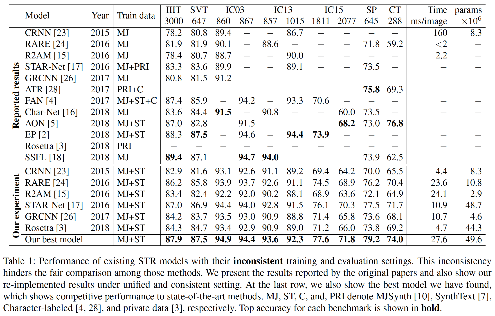
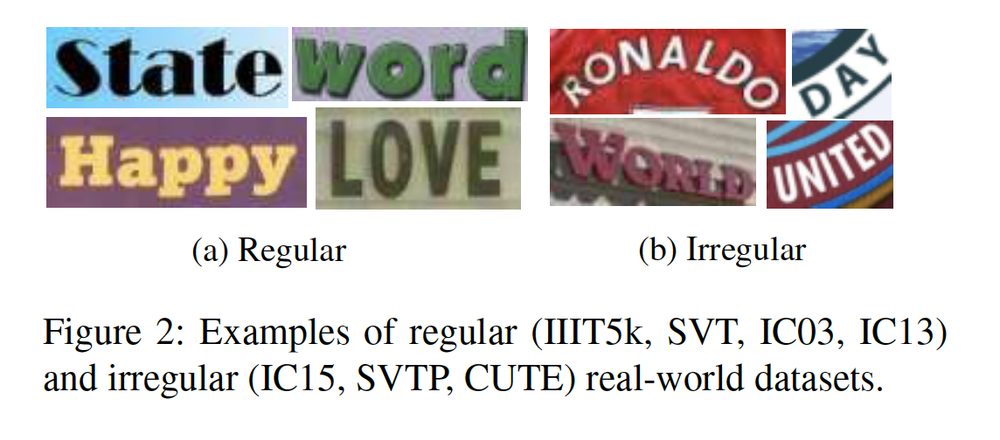
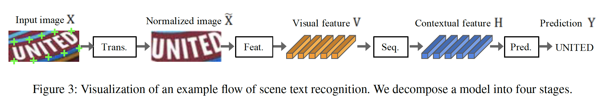
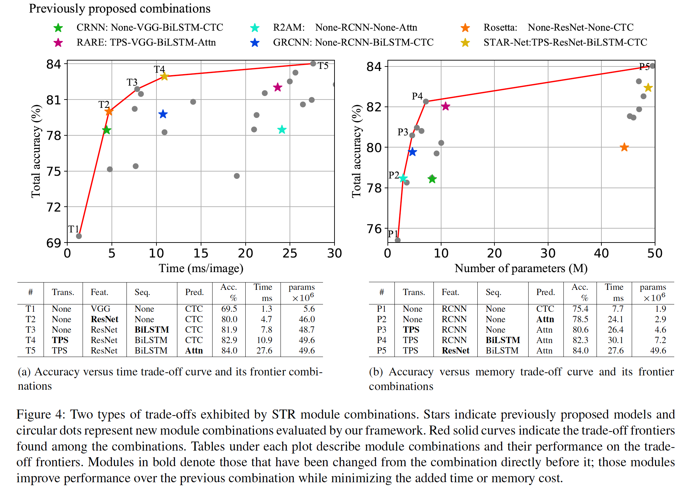
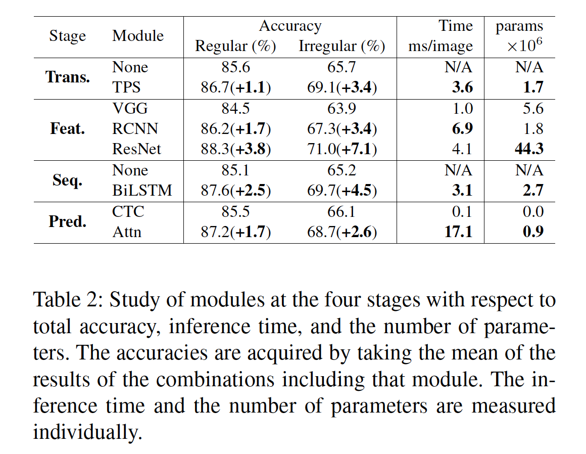
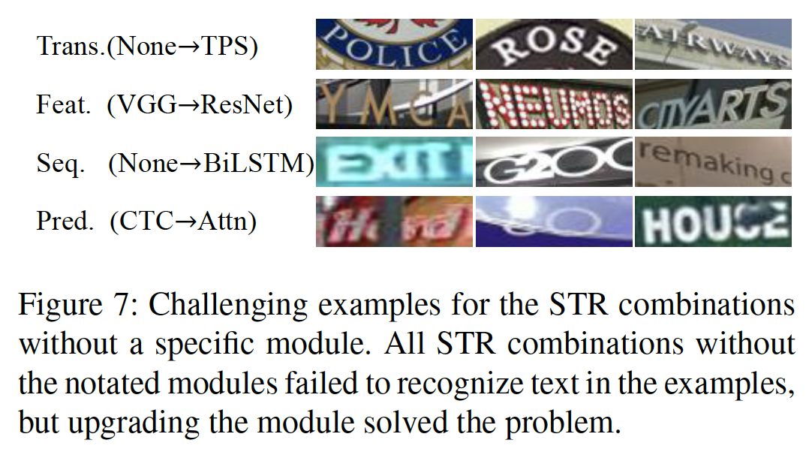
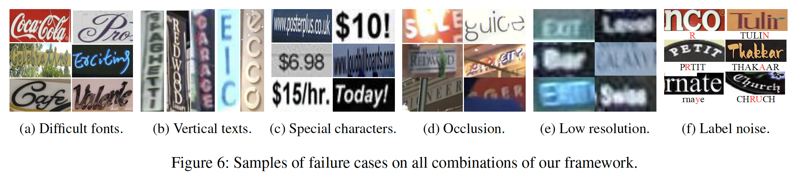

## What Is Wrong With Scene Text Recognition Model Comparisons? Dataset and Model Analysis

### 摘要

​		近年来，针对场景文本识别（Scene Text Recognition：STR）模型提出了许多新建议。尽管每个声称都突破了技术的界限，但由于训练和评估数据集的选择不一致，因此在该领域大体上缺乏全面、公正的比较。本文通过三个主要贡献解决了这一难题。第一，我们检查训练和评估数据集的不一致之处，以及由于不一致导致的性能差距。第二，我们引入一个统一的四阶段STR框架，大多数现有的STR模型都适合该框架。使用此框架可对先前提出的STR模块进行广泛评估，并发现先前未探索的模块组合。第三，我们在一组一致的训练和评估数据集下分析了模块对性能、准确性、速度和内存需求的贡献。这样的分析消除当前比较中的障碍，以了解现有模块的性能提升。代码见 1https://github.com/clovaai/deep-text-recognition-benchmark。

### 1. 引言

​		在自然场景中阅读文本（称为场景文本识别（Scene Text Recognition：STR））已成为许多工业应用中的重要任务。光学字符识别（OCR）系统的成熟使其成功地应用于清洁文档，但是由于在现实世界中出现的各种文本外观以及捕获这些场景的条件不完善，大多数传统的OCR方法在STR任务上都无法发挥作用。

​		为了处理这些挑战，先前的工作 [23、24、15、17、26、28、4、16、5、2、3、18]提出多阶段流水线，其中每个阶段是处理特定挑战的深度神经网络。例如，Shi等[23]建议使用循环神经网络来处理给定输入中变化数量的字符，以及连接主义时序分类损失[6]来识别字符。Shi等[24]提出一种变换模块，该模块将输入标准化为纯文本图像，以减轻下游模块处理弯曲文本的表示负担。

​		但是，由于有些论文提出了不同的评估和测试环境，因此很难评估新提议的模块是否以及如何对现有技术进行改进，因此很难比较所报告数字的票面价值（表1）。我们的分析反应使用STR数据及其引起的不一致。例如，我们在IC03数据集中发现7个缺失示例，在IC13数据集中也发现158个缺失示例。我们调查STR数据集上的先前工作，并发现不一致导致无法比较的结果，如表1所示。其次，我们介绍STR的统一框架，该框架为现有方法提供一个通用的视角。具体来说，我们将STR模型分为四个连续的操作阶段：转换（Trans.）、特征提取（Feat.）、序列建模（Seq.）和预测（Pred.）。该框架不仅提供现有方法，还提供它们可能的变体，可以对模块方面的贡献进行广泛的分析。最后，我们在统一的实验设置下研究模块在准确性、速度和内存需求方面的贡献。通过这项研究，我们将更严格地评估各个模块的贡献，并提出以前被忽略的模块组合，以改进现有技术。此外，我们在基准数据集上分析失败案例，以识别STR中仍待解决的挑战。

### 2. STR中的数据集问题

​		在本节中，我们将检查先前工作使用的不同培训和评估数据集，然后解决它们之间的差异。通过此分析，我们重点介绍每项工作在构建和使用其数据集方面的差异，并在比较不同工作之间的性能时调查不一致导致的偏差（表1）。通过实验测量由于数据集不一致而导致的性能差距，并在第4中节进行讨论。

#### 2.1. 合成数据集进行训练

​		在训练STR模型时，标注场景文本图像是昂贵的，因此难以获得足够的标签数据。与其使用真实数据，大多数STR模型都使用合成数据集进行训练。我们首先介绍最近的STR论文中使用的两种流行的合成数据集：

- **MJSynth（MJ）**[10]是设计用于STR的合成数据集，包含8.9M单词边界框图像。单词边界框生成过程如下：1）字体渲染，2）边界和阴影渲染，3）背景着色；4）字体、边界和背景的复合，5）应用投影失真，6）与真实世界的图像融合和7）添加噪声。图1a展示了MJSynth的例子。
- **SynthText（ST）**[7]是另一个合成生成的数据集，最初是为场景文本检测而设计的。图1b中给出如何将单词呈现到场景图像上的示例。尽管SynthText设计用于场景文本检测任务，但是通过裁剪单词边界框可以将它用于STR。一旦裁切并过滤了非字母数字字符的单词框，SynthText将具有5.5M训练数据。

		注意，先前的工作使用了MJ、ST和/或其他来源的各种组合（表1）。这些**不一致**之处使人怀疑，这些改进是由于所提出的模块的贡献还是由于更好或更大的训练数据的贡献。我们在§4.2中的实验描述训练数据集对基准上最终性能的影响。我们进一步建议未来的STR研究应清楚地指出所使用的训练数据集，并使用相同的训练集比较模型。

#### 2.2. 真实世界数据进行评估

​		七个真实的STR数据集已被广泛用于评估经过训练的STR模型。对于一些基准测试数据集，在之前的工作中使用数据集的**不同子集**进行评估（表1）。子集中的这些差异导致**不一致**的比较。

​		我们通过将数据集分为常规和非常规数据集来介绍它们。根据文本的难度和几何布局，基准数据集被区分为“常规”或“不规则”数据集[24、28、5]首先，**常规数据**包含具有水平排列的字的文本图像，并且字符之间具有均匀的间距。这些代表STR的相对简单案例：

- **IIIT5K-Words（IIIT）**[20]是从Google图像搜索上爬取的数据集，利用大有可能返回文本图像的查询单词，例如“billboards”、“signboard”,、“house numbers”、 “house name plates” 和 “movie posters”。IIIT包含2000张图像进行训练，以及300张图像进行评估。
- **Street View Text（SVT）**[27]包含从Google Street View收集的户外街景图像。这些图像中的一些是由噪声的、模糊的或者低分辩的。SVT包含257张图像进行训练，以及647张图像进行评估。
- **ICDAR2003（IC03）**[19]是为ICDAR 2003 Robust Reading Competition 而创建的，用于理解相机捕获的场景文本。它包含1156张图像进行训练，以及1110张图像进行评估。忽略所有太短（少于3个字符）或包含非字母数字字符的单词，会将1,110张图像减少到867张。但是，研究人员是使用两种不同版本的数据进行评估：860张图像和867张图像。与867张图像的数据集相比，860图像的数据集缺少7个单词框。 省略的文字框可以在补充材料中找到。
- **ICDAR2013（IC13）**[13]继承了IC03的的大多数图像，也创建用于ICDAR 2013 Robust Reading Competition。它包含848张图像进行训练，以及1095张图像进行评估，其中裁剪具有非字母数字字符的单词可获得1,015张图像。再次，研究人员使用了两个不同的版本进行评估：857和1015张图像。857张图像的数据集是1,015个集的子集，其中修剪了少于3个字符的单词。

​        其次，**非常规数据集**通常包含较难的STR角点情况，例如弯曲且任意旋转或扭曲的文本[24、28、5]：

- **ICDAR2015（IC15）**[12]创建用于 ICDAR2015 Robust Reading Competition，包含4468张图像进行训练，以及2077张图像进行评估。这些图像是在佩戴者自然运动的情况下由Google眼镜捕获的。因此，数据集包含许多噪声、模糊和旋转的图像，还有一些分辨率较低图像。研究人员还是使用两种版本进行评估：11811张图像和2077张图像。先前论文[4、2]仅使用1811张图像，并丢弃非字母数字字符图像以及一些极端旋转、透视移位和弯曲的图像以进行评估。在补充资料中可以找到一些废弃的文字框。
- **SVT Perspective（SP）**[21]从Google Street View收集，并包含645张图像进行评估。由于普遍存在非正面视角，许多图像包含透视投影。
- **GUTE80（CT）**[22]收集自自然场景，包含288张裁剪图像进行评估。其中的许多图像是曲线文本图像。

​        注意，表1为我们提供了一个关键问题，先前的工作在**不同的基准数据集**上评估了他们的模型。具体而言，评估是针对IC03、IC13和IC15中不同版本的基准进行的。在IC03上，7个样本会造成0.8％的性能差距，与以前的性能相比，这是一个巨大的差距。在IC13和IC15的情况下，样本之间的差距甚至大于IC03。

### 3. STR Framework Analysis

​		本节的目的是介绍场景文本识别（Scene Text Recognition：STR）框架，该框架由四个阶段组成，这些框架是从独立提出的STR模型之间的共性得出的。之后，我们描述每个阶段中的模块选项。

​		由于STR与计算机视觉任务（例如目标检测）和序列预测任务相似，因此STR受益于高性能卷积神经网络（CNN）和递归神经网络（RNN）。卷积-循环神经网络（Convolutional-Recurrent Neural Network：CRNN）[23]是STR的CNN和RNN的首次结合应用，它从输入文本图像中提取CNN特征，并用RNN重新配置它们以进行鲁棒的序列预测。在CRNN之后，提出多种变体[24、15、17、16、26、4、3]来提高性能。为了纠正任意文本的几何形状，例如，已经提出了转换模块以对文本图像进行标准化[24、17、16]。为了处理具有固有高维度和隐因素（例如，字体样式和杂乱的背景）的复杂文本图像，已纳入改进的CNN特征提取器[15、26、4]。另外，随着人们越来越关注推理时间，一些方法甚至省略了RNN阶段[3]。对于改进字符序列预测，提出了基于注意力的解码器[15、24]。

​		从已有的STR模型中推导的四个阶段如下：

1. **Transformation（Trans.）** 使用Spatial Transformer Network（STN[11]）来标准化输入文本图像已简化下游阶段。
2. **Feature extraction（Feat.）**将输入图像映射到一个表示，该表示关注与字符识别相关的属性，同时抑制无关特征，例如字体、颜色、大小和背景。
3. **Sequence modeling（Seq.）**捕获字符序列中的上下文信息，以供下一阶段使用，从而更可靠地预测每个字符，而不是独立地进行预测。
4. **Prediction（Pred.）**从已识别的图像特征中估计输出字符序列。

​        我们提供图3作为概述，在补充材料中可以找到我们在本文中使用的所有体系结构。

#### 3.1. Transformation stage

​		这一阶段的模块将输入图像 $X$ 变换到标准图像 $\tilde{X}$ 。自然场景中的文本图像具有各种形状，如弯曲和倾斜的文本所示。如果这样的输入图像没有改变地被馈入，则随后的特征提取阶段需要学习关于这种几何形状的不变表示。为了减小这种负担，薄板样条（Thin-Plate Spline：TPS）变换是空间变换网络（STN）的一种变体[11]，它具有灵活性，可以应用于文本行的各种长宽比[24、17]。TPS在基准点（fiducial points）之间采用平滑样条插值（smooth spline interpolation）。更准确地说，TPS在上下包络点（enveloping point）找到多个基准点（图3中的绿色“ +”标记），并将字符区域标准化为预定义的矩形。我们的框架允许选择或取消选择TPS。

#### 3.2. Feature extraction stage

​		在这一阶段中，CNN抽象输入图像（即$X$或$\tilde{X}$），并输出视觉特征图$V=\{v_i\},i=1,\cdots,I$（$I$为特征图的列数）。特征提取器产生的每列有沿着输入图像的水平行的可辨别性感受野。这些特征用于估计每个感受野中的字符。

​		我们研究三种架构（VGG、RCNN和ResNet），它们用于STR的特征提取。VGG的原始形式包括多个卷积层，然后是几个全连接的层[25]。RCNN是CNN的一种变体，可以根据字符形状递归应用以调整其感受野[15、26]。ResNet是具有残差连接的CNN，其简化更深的CNN的训练。

#### 3.3. Sequence modeling stage

​		Feat.阶段提取的特征被调整到特征$V$序列。即，特征图的每列$v_i \in V$用作序列的一帧。但是，该序列可能缺乏上下文信息。因此，一些先前工作使用BiLSTM，以在特征提取阶段后作出更好的序列 $H = Seq.(V)$。另一方面，Rosetta[3]移除BiLSTM以减小计算复杂度和内存开销。我们的架构允许选择或不x选择使用BiLSTM。

#### 3.4. Prediction stage

​		在这一阶段，模块从输入$H$中预测字符序列（即，$Y ＝ y_1,y_2,\cdots$）。总结前面的工作，我们有两个预测选项：（1）Connectionist Temporal Classification：CTC和（2）基于注意力的序列预测（Attn）[24、4]。即使给定固定数量的特征，CTC也允许非固定数量的序列预测。CTC的关键方法是在每列（$h_i \in H$）预测一个字符，并通过删除重复字符和空格（blank）将完整的字符序列修改为非固定的字符流[6、23]。另一方面，Attn自动捕获输入序列中的信息流，从而预测输出序列[1]。它使STR模型能够学习表示输出类依赖性的字符级语言模型。

### 4. 实验和分析

​		本节包含对来自第3节中四阶段框架的所有可能STR模块组合（总共2×3×2×2 = 24个）的评估和分析，所有评估都是在从在第2节中列出的数据集中构造的通用训练和评估数据集中进行的。

#### 4.1. 实现细节

​		如第2节所述，训练和评估数据集严重影响衡量STR的性能。为了进行公平的比较，我们固定训练、验证和评估数据集的选择。

​		**STR 训练和模型选择**	我们使用MJSynth8.9M和SynthText 5.5M的并集（共计14.4M）作为训练数据。我们采用AdaDelta[29]优化器，它的decay rate设置为 $\rho=0.95$。batch size设置为192，迭代次数为300K。梯度裁剪幅度为 5。所有参数利用He方法[8]初始化。我们使用IC13、IC15、IIT和SVT训练集的并集作为验证数据，并在每2000训练stpdf后验证模型以选择这个数据集中准确率最高的模型。注意，验证集没有包含IC03数据，因为它们中的一些数据与IC13的评估数据集重复。重复场景图像的总数为34，并且它们包含215个单词边界框。重复的示例可以在补充材料中找到。

​		**评估标准**	本文中，我们从准确性、时间和内存方面全面分析STR组合。为了提高准确性，我们在涉及基准的所有子集的9个真实评估数据集上以及在统一评估数据集（共8539张图像：来自IIIT的3,000张图像、来自SVT的647张图像、来自IC03的867张图像、来自IC13的1015张图像、来自IC15的2,077张图像、来自SP的645张图像和来自CT的288张图像）中，对每幅图像的单词预测成功率进行测量。我们仅评估单词和数字。对于每中STR组合，我们在不同的初始化种子下进行5次实验，并取它们的平均准确率。对于速度评估，我们将测量每个图像的平均时钟时间（以毫秒为单位），以在相同的计算环境下识别给定的文本，详细信息如下。对于内存评估，我们计算整个STR流水线中的FLOPs。

​		**环境**	为了公平的速度比较，我们所有评估在相同的环境中进行：Intel

Xeon(R) E5-2630 v4 2.20GHz CPU、 NVIDIA TESLA P40 GPU 和 252GB RAM。所有实验在NAVER Smart Machine Learning（NSML）平台上进行。

#### 4.2. 训练数据分析

​		我们研究使用训练集的不同组对基准测试上性能的影响。如2.1节中提到的，先前的工作是哟哦那个不同的训练数据集，并且不确定其模型对改进的贡献。为了解决这个问题，我们使用不同的训练数据集检查第4.3节中最佳模型的准确性。仅使用MJSynth，我们获得80.0%的准确率，仅使用SynthText，获得75.6%的准确率，两者都使用获得84.1%的准确率。MJSynth和SynthText的组合将准确率提高4.1%，超过单独使用MJSynth和SynthText。这项研究的经验是使用不同训练数据集的性能结果是不可比较的，并且如此的比较难以证明模型的贡献，这就是为什么我们使用相同的训练数据集来训练所有模型，特别提到的除外。

​		有趣的是，20%的MJSynth（1.8M）和20%的SynthText（1.1M）（总共2.9M图像，约为SynthText的一半）的组合得到81.3%的准确率——比单独使用MJSynth或SynthText好。MJSynth和SynthText有不同的特性，因为它们使用不同的选项生成，例如扭曲和模糊。这种结果表明，训练数据的多样性比训练样本的数量更重要，并且使用不同训练数据集的效果要比简单包含更多数据更为复杂。

#### 4.3. 模块组合的权衡分析

​		这里，我们专注于在模块的不同组合中显示的准确率-速度和准确率-内存的权衡。我们在补充材料中提供完整的结果表。对于所有24种组合的平衡图见表4，包括6个前面提到的STR模型（图中的“星星”标记）。在准确率-时间的平衡方面，Rosetta和STAR-net位于边界，而其他四个先前模型位于边界内。在准确率-内存平衡方面，R2AM位于边界，而其他四种先前提到的模型位于边界内。权衡边界上的模块组合以准确率的升序标记（准确率-时间为T1至T5，准确率-内存为P1至P5）。

​		**平衡边界上的组合分析**	如表4a所示，T1在没有包含任何变换或序列模块下，获得最小的时间，接下来的模块依次引入（在表5a中加粗）：ResNet、BiLSTM、TPS和Attn。注意，从T1到T5，单模型在时间上发生变化。我们的框架提供平滑的方法变换，从而根据应用场景提供最小的性能平衡。它们依次增加整个STR模型的复杂度，从而以提高计算效率为代价提高性能。ResNet、BiLSTM和TPS引入相对适中的整体速度减慢（$1.3\mbox{ms} \rarr 10.9\mbox{ms}$），同时极大地提高精度（$69.5％ \rarr 82.9％$）。另一方面，最终的变化Attn仅将精度提高1.1％，而效率却高达27.6 ms。

​		对于表4b中所示的准确率-内存平衡，P1是内存消耗量最少的模型，并且从P1到P5，在内存和准确率之间进行平衡。在准确率-速度平衡中，我们观察到直到P5的每一步都有单个模块移动，其中变化的模块为：Attn、TPS、BiLSTM和ResNet。它们以内存为代价，依次提高准确率。与T1中使用的VGG相比，我们观察到P1-P4中deRCNN更轻，并且给出好的准确率-内存平衡。RCNN需要少量重复应用的CNN层。我们观察到transformation、sequential和prediction模块对内存消耗的贡献不明显（$1.9\mbox{M} \rarr 7.2\mbox{M}$参数）。虽然整体上是轻量权重的，这些模块提高准确率改进（ 75.4% $\rarr$ 82.3% ）。另一方，最终的变化ResNet在内存消耗从7.2M增加到49.6M FLOPs的情况下，将准确率提高1.7%。因此，可以确保关注内存消耗的从业人员可以相对自由地选择专门的变换、序列和预测模块，但应避免使用像ResNets这样的繁重特征提取器。

​		**对于速度和内存最重要的模块**	通过根据模块选择对图4中的散点图进行颜色编码，我们已经确定了模块方式对速度和内存的影响。完整的颜色编码图位于补充材料中。这里，我们在图5中分别展示对速度和内存要求最高的模块（分别是预测模块和特征提取模块）的散点图。

​		根据预测模块和特征模块，存在明确的组合簇。在准确率-速度平衡方面，我们确定CTC和Attn簇（添加Attn会显着降低整体STR模型的速度）。另一方面，对于准确率-内存的平衡，我们观察到特征提取器对内存的贡献最大。重要的是要认识到每个标准的最重要模块是不同的，因此，从业人员在不同应用场景和约束下应根据自己的需求研究不同的模块组合，以实现最佳平衡。

#### 4.4. 模块分析

​		这里，我们在准确率、速度和内存需求下研究逐模块的性能。对于这种分析，每个模块的边际准确率是通过对包括表2中的模块在内的组合进行平均计算得出的。在每个阶段更新模块需要额外的资源、时间或内存，但是提供了性能增加。该表显示，在所有阶段，非常规数据集的性能提高约为常规基准的两倍。在比较准确率提高和时间使用时，从None-VGG-None-CTC的基本组合来看，ResNet、BiLSTM、TPS和Attn的顺序是模块最有效的升级顺序。此顺序与准确率-时间边界（$T1\rarr T5$）的组合顺序相同。另一方面，准确率-内存的观点发现RCNN、Attn、TPS、BiLSTM和ResNet为模块的最优更新顺序，例如准确率-内存边界顺序（P1 $\rarr$ P5）。有趣的是，时间模块的有效顺序与内存模块的顺序相反。模块的不同属性在实践应用中提供不同的选择。此外，从两个角度来看，模块排名与边界模块更改的顺序相同，这表明在所有组合下，每个模块对性能的贡献均相似。

​		**定性分析**	如第3节中所述，每个模块都通过解决STR任务的目标难度来帮助识别文本。图7显示了仅在某些模块升级时才能正确识别的示例（例如，从VGG升级到ResNet主干）。每行显示了我们框架的每个阶段中模型的更新。 所提供的样本在升级之前失败，但是在升级之后就可以识别。TPS转换将弯曲文本和透视文本标准化为标准视图。预测结果显示出剧烈的性能改进，尤其是圆圈商标徽标中的“POLICE”和店面招牌透视图中的“AIRWAYS”。先进的特征提取器（ResNet）产生更好的表示能力，改善具有严重背景模糊的情况（”YMCA“、”CITYARTS“）以及未见过的字体（”NEUMOS“）。BiLSTM通过调整感受野产生更好的上下文建模；它可以忽略不相关的裁剪字符（“I”位于“EXIT”之后，“C”位于“G20”之后）。注意力包含发现丢失或遮挡字符的隐式字符级语言建模，例如“Hard”中的“a”、“to”中的“t”和“HOUSE”中的“S”。这些示例简要介绍了实际应用中模块的贡献点。

#### 4.5.  失败案例分析

​		我们调查所有24中组合的失败案例。由于我们的框架源自所提出的STR模型之间的共性，并且我们的最佳模型显示与以前所提出的STR模型的可竞争性能，因此所提出的失败案例对整个领域构成共同的挑战。我们希望我们的分析启发STR的未来工作来处理这些挑战。

​		在基准测试数据集（第2节）中的8539个示例中，所考虑的24个模型中的任何一个均不能正确识别644张图像（7.5％）。我们发现图6中的六种失败案例。以下是有关案例挑战的讨论，并提出了未来的研究方向。

​		**书法字体：**广告牌的字体风格（例如“Coca Cola”）或者街道店铺名称（例如“Cafe”）仍是挑战。如此多样的字符表示需要新颖的特征提取器来提供泛化的视觉特征。另一种可能的方法是正则化，因为模型对于训练数据集中的字体过拟合。

​		**垂直文本：**当前主要的STR模型假设水平文本图像，因此结构上不能处理垂直文本。一些STR模型[28、5]也利用垂直信息，但是，垂直文本还没有被清楚地涵盖。需要进一步研究以涵盖垂直文本。

​		**特殊字符：**由于当前的基准测试没有评估特殊字符，现有工作在训练期间将它们排除。这导致错误预测，误导模型将它们视为字母字体字符。**我们建议使用特殊字符训练**。在IIT上，这产生从87.9%到90.3%的准确率提升。

​		**严重遮挡：**当前方法没有广泛利用上下文信息来克服遮挡。未来的研究可能要考虑更好的语言模型以最大化地利用上下文。

​		**低分辨率：**已有的模型没有显式地处理低分辨率的案例；图像金字塔或超分辨率模块可能提高性能。

​		**标签噪声：**我们在失败示例中发现一些噪声（不准确）标签。我们检查基准测试中所有样本以识别噪声标签的比例。所有基准测试数据都包含噪声标签，不考虑特殊字符的标签错误率是1.3％，考虑特殊字符的标签错误率是6.1％，考虑到区分大小写的标签错误率是24.1％。

​		我们在Github库中提供所有失败案例，希望它们能激发对STR问题的极端案例的进一步研究。