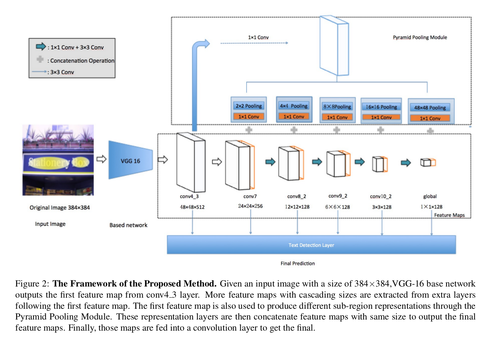
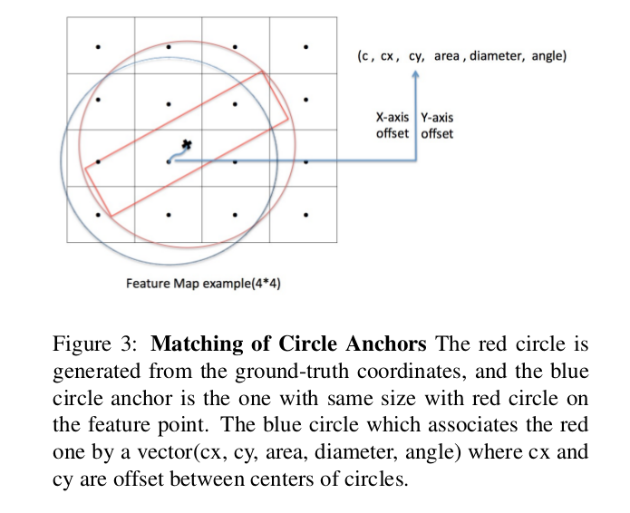
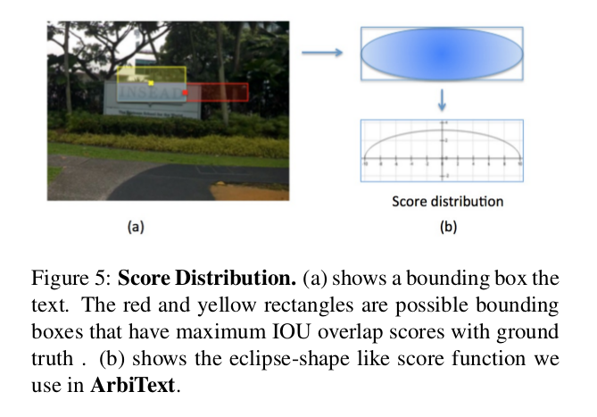
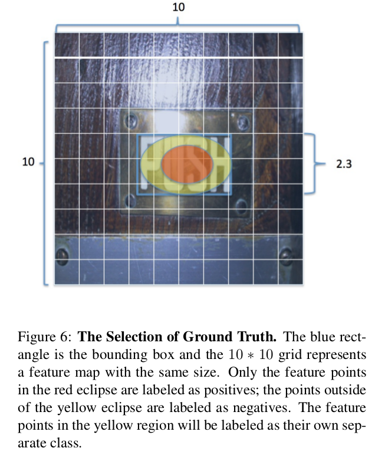

ArbiText: Arbitrary-Oriented Text Detection in Unconstrained Scene
=

# 1. Introduction
尽管通用对象检测器在一般对象检测上性能显著，但这些方法在文本和通用对象的数据分布之间存在差距。为了增强现有深层模型的生成能力，[7]（《Synthetic Data for Text Localisation in Natural Images》）提出将渲染的单词自然地混合到野生图像上以进行训练数据增强。基于如此训练数据训练的模型对噪声和不可控变化具有鲁棒性。[31]（DeepText） 和 [13]（TextBoxes）尝试将区域提议层集成到深度神经网络，其可以生成文本特定的提议（例如具有更大纵横比的边界框）。在[16](《Arbitrary-Oriented Scene Text Detection via Rotation Proposals》)中，引入边界框旋转提议以所提出的模型更加适应自然场景中文本不可知的方向。然而，前面提到的场景文本检测器要么需要考虑非常多的提议假设，因此急剧降低计算效率，要么使用不充分的预设边界框已处理非限制自然场景中严重的视觉变化。

为了解决已存在方法前面提到的缺点，我们提出一种新颖的无提议的模型用于自然图像中任意方向文本的检测，这种方法基于圆形锚和SSD框架。更具体地，采用圆形anchor表示边界框，其对方向、纵横比和尺度变化更具鲁棒性。采用SSD是因为其较快的检测速度和理想的准确率。除了SSD生成特征图外，我们还加入了金字塔池化模块，其能构建多个不同尺度的金字塔表征。通过融合这些不同种类的特征图，局部和全局信息能够被保留，使得在非限制自然场景中的文本可以被更加可靠地检测。接着，融合特征图被馈入文本检测模块（该模块由几个全连接卷积层组成）以预测可靠的圆形锚。此外，为了克服由不固定尺寸的圆形锚引起的确定正类点的难度，我们通过将这些模糊点分配给新类来引入一种新颖的掩模损失函数。为了获得最终检测结果，采用Locality-Aware Non-Maximum Suppression（LANMS）。

本文的贡献总结如下：
- 我们提出一种新颖的无提议方法用于检测非限制自然场景图像中的任意方向文本，其基于圆形锚表示和SSD框架。相比于传统矩形锚，圆形锚对于不同纵横比、尺度和方向变化更具鲁棒性。
- 我们将金字塔池化模块加入SSD，其能够利用局部和全局信息来进行鲁棒性文本检测。
- 我们开发一种新的掩模损失函数以克服由圆形锚引起的确定正类点的难度，因此，它也提高最终的检测准确率。

# 2. Related Works
# 3. Method
## 3.1. Model Framework

图2为本文提出的方法的基本框架，其由四个部分组成：1）用于将原始输入图像转换为密集特征表示的骨干网络；2）具有级联特征大小的特征图组件，用于检测多尺度文本；3）用于提取子区域特征表示的金字塔池化模块；4）用于圆形anchor预测最终文本检测层。详细设计如图2 。

## 3.2. Circle Anchors

如图3所示，我们使用圆形锚来表示边界框，而不是传统的矩形锚。具体地，边界框可以用5维向量 $(x, y, a, r, \theta)$ 表示，其中 $a$ 、 $r$ 和 $\theta$ 分别表示圆形锚的面积、半径和旋转角度。
$$
\begin{align}
\alpha = \frac{1}{2}\arcsin(\frac{a}{2r^2})  \\
x_2 = r \cdot \cos(\alpha + \theta), y_2 = r \cdot \sin(\alpha + \theta)  \\
x_3 = r \cdot \cos(\alpha - \theta), y_2 = r \cdot \sin(\alpha - \theta)  \\
x_1, y_1 = -x_3, -y_3, x_4, y_4 = -x_2, -y_2  \\
x_1, x_2, x_3, x_4 = x_1 + x, x_2 + x, x_3 + x, x_4 + x  \\
y_1, y_2, y_3, y_4 = y_1 + y, y_2 + y, y_3 + y, y_4 + y  
\end{align}
\tag 1
$$
在大小为 $w \times w$ 的特征图的位置 $(i, j)$ ，关联一个 $(c, \Delta x, \Delta y, \Delta a, \Delta r, \Delta \theta)$ 的圆形anchor $C_0$ ，其指明一个唯一的圆形锚（表示为 $(x, y, a, r, \theta)$ ）以置信度 $c$ 被检测，其中
$$
\begin{align}
x = \Delta x \cdot \frac{r_a}{w} + j, y = \Delta y \cdot \frac{r_a}{w} + i  \\
r = \exp(\Delta r) \cdot \frac{r_a}{w}  \\
a = \exp(\Delta a) \cdot \frac{r_a}{w}  \\
\theta = \Delta \theta
\end{align}  \tag 2
$$
这里，为了计算稳定性，使用面积 $a$ 和半径 $r$ 。同时，我们将每个值乘以因子 $\frac{r_a}{w}$ ，其中 $r_a = 1.5$ 。

角度 $\theta$ 是边界框长边和水平轴之间的夹角。因此， $\theta$ 的范围从 $-90^\circ$ 到 $90^\circ$ 。

## 3.3. Training Labels Rebuilding and the Loss Function Formulation

对于基于SSD的方法，特征图的所有点都可能用于最小化特定的损失函数。具体地，在SSD中，被标记为正类的点从默认锚和ground-truth边界框之间的重叠大于0.5的区域选择。然而，我们的方法中没有默认锚，但是我们仍能计算每个点的置信度。如图5（a）所示，边界框边缘的特征点有最大重叠0.5（边界框用红色和黄色着色）。因此，得分服从一个椭圆分布（如图5（b））。椭圆的中心的得分有最大值1.0，当点到达边缘时，得分降为0.5 。我们使用半椭圆作为函数计算每个点的得分。因此，椭圆外的点得分值为 0 。

想象一个具有旋转角度 $\theta$ 的椭圆得分函数，其长半轴和短半轴的长度分别为 $\frac{w}{2}$ 和 $\frac{h}{2}$ ，其中 $w$ 和 $h$ 是边界框的宽和高。因此，得分函数可以表示为：
$$
\begin{align}
A \cdot (x)^2 + B \cdot (x) \cdot (y) + C \dot (y) ^ 2 + F \cdot s^2 = F  \\
a = \frac{w}{2}; b = \frac{h}{2}  \\
A = a^2 \cdot \sin^2(\theta) + b^2 \cdot \cos^2(\theta)  \\
B = -2(a^2 - b^2) \cdot sin(\theta) \cdot \cos^2(\theta)  \\
C = a^2 \cdot \cos^2(\theta) + b^2 \cdot \sin^2(\theta)  \\
F = a^2 \cdot b^2
\end{align}  \tag 3
$$
其中 $x, y$ 分别为特征点到边界框中心的距离， $s$ 是得分。根据得分函数，椭圆中所有点的得分大于0.5 。然而，点越接近边界框的边缘，边界框外的噪声越大，这可能使网络训练更难收敛。因此，仅得分大于阈值 $\alpha$ 的点被视为正类（如图6所示，仅红色区域内的点被标记为正类）。边界框之外的点被标记为负类。对于得分在0.5和 $\alpha$ 之间的点，我们给它们分配一个额外的标签。因此，总计有 $(N+1)$ 个类（没有背景）。这个额外的类仅在计算分类损失时使用。

具有不同大小的特征图可以检测不同尺度的文本。一个默认框别标记为正类，其应当满足
$$1 < \frac{h_g}{c_h} < 4  \tag 4$$
其中 $h_g$ 为边界框的高， $c_h$ 为特征图单元的高。对于训练，我们使用如下的目标损失函数：
$$
\begin{align}
L(mask, c, l, g) = \frac{1}{N_{cls}} \sum_{i=0}^{N+1}mask_i \cdot L_{cls}(c_i) + \\
\lambda_1 \frac{1}{N_{reg}} \sum_{i=1}^{N}mask_i \cdot L_{loc}(l, g) +  \\
\lambda_2 \frac{1}{N_{reg}} \sum_{i=1}^N mask_i \cdot L_{cls}(vertical)
\end{align} \tag 5
$$
其中 $N$ 为对象类别的数量， $l$ 为预测位置， $g$ 为ground-truth的位置。对于每个类，如果相应点被标记为正类，并且属于第 $i$ 个类，则 $mask_i = 1$ 。 $L_{cls}(vertical)$ 是仅包含正类点的垂直边界框分类损失。我们采用 smooth L1损失和Softmax损失。
