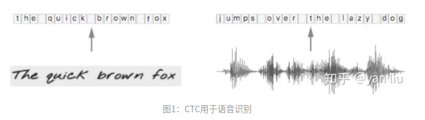
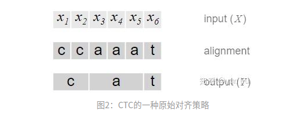
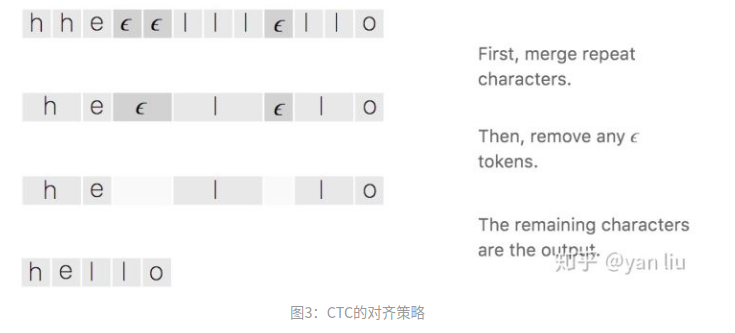
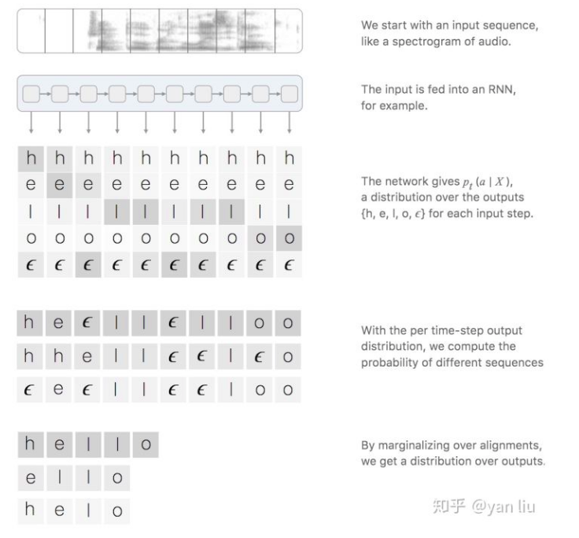
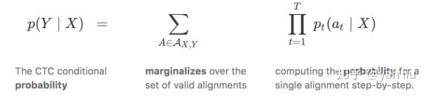
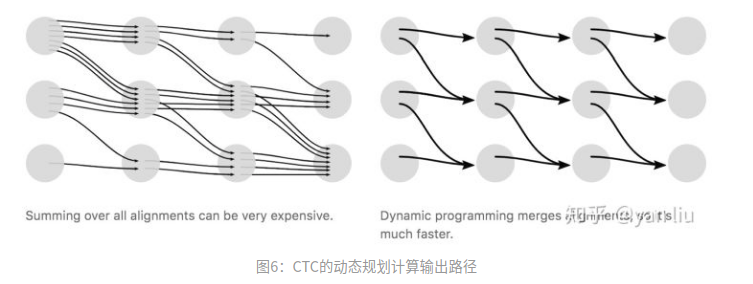
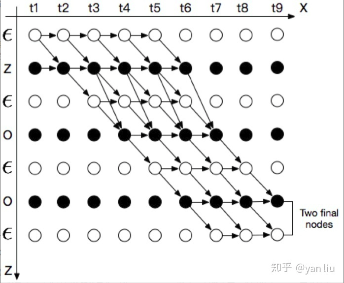

## 简介
在语音识别中，我们的数据集是音频文件和其对应的文本，不幸的是，音频文件和文本很难在单词的单元上对齐。除了语言识别，在OCR，机器翻译中，都存在类似的Sequence to Sequence结构，同样也需要在预处理操作时进行对齐，但是这种对齐有时候是非常困难的。如果不使用对齐而直接训练模型时，由于人的语速的不同，或者字符间距离的不同，导致模型很难收敛。

CTC(Connectionist Temporal Classification)是一种避开输入与输出的一种方式，是非常适合语音识别或者OCR这种应用的。

给定输入序列 $X=[x_1,x_2,...,x_T]$ 以及对应的标签数据 $Y=[y_1,y_2,..,y_U]$ ,例如语音识别中的音频文件和文本文件。我们的工作是找到 $X$ 到 $Y$ 的一个映射，这种对时序数据进行分类的算法叫做Temporal Classification。

对比传统的分类方法，时序分类有如下难点：

1. $X$ 和 $Y$ 的长度都是变化的；
2. $X$ 和 $Y$ 的长度是不相等的；
3. 对于一个端到端的模型，我们并不希望手动设计 $X$ 和 $Y$ 的之间的对齐。  

CTC提供了解决方案，对于一个给定的输入序列 $X$ ，CTC给出所有可能的 $Y$ 的输出分布。根据这个分布，我们可以输出最可能的结果或者给出某个输出的概率。

损失函数：给定输入序列 $X$ ，我们希望最大化 $Y$ 的后验概率 $P(Y|X)$ , $P(Y|X)$ 应该是可导的，这样我们能执行梯度下降算法；

测试：给定一个训练好的模型和输入序列 $X$ ，我们希望输出概率最高的 $Y$ :

$$Y^\ast = argmax_Yp(Y|X)\tag{1}$$

当然，在测试时，我们希望 $Y^\ast$ 能够尽快的被搜索到。

## 算法详解
给定输入 $X$ ，CTC输出每个可能输出及其条件概率。问题的关键是CTC的输出概率是如何考虑 $X$ 和 $Y$ 之间的对齐的，这种对齐也是构建损失函数的基础。所以，首先我们分析CTC的对齐方式，然后我们在分析CTC的损失函数的构造。

### 1.1 对齐
需要注意的是，CTC本身是不需要对齐的，但是我们需要知道 $X$ 的输出路径和最终输出结果的对应关系，因为在CTC中，多个输出路径可能对应一个输出结果，举例来理解。例如在OCR的任务中，输入 $X$ 是含有“CAT”的图片，输出 $Y$ 是文本 $[C, A, T]$ 。将 $X$ 分割成若干个时间片，每个时间片得到一个输出，一个最简单的解决方案是合并连续重复出现的字母，如图2 。

这个问题有两个缺点：
1. 几乎不可能将 $X$ 的每个时间片都和输出 $Y$ 对应上，例如OCR中字符的间隔、语音识别中的停顿;
2. 不能处理有连续重复字符出现的情况，例如单词“HELLO”，按照上面的算法，输出的是“HELO”而非“HELLO”。

为了解决上面的问题，CTC引入了空白字符 $\epsilon$ ，例如OCR中的字符间距，语音识别中的停顿均表示为 $\epsilon$ 。所以，CTC的对齐涉及去除重复字母和去除 $\epsilon$ 两部分，如图3。

这种对齐方式有三个特征：
1. $X$ 与 $Y$ 之间的时间片映射是单调的，即如果 $X$ 向前移动一个时间片， $Y$ 保持不动或者也向前移动一个时间片；
2. $X$ 与 $Y$ 之间的映射是多对一的，即多个输出可能对应一个映射，反之则不成立，所以也有了特征3；
3. $X$ 的长度大于等于 $Y$ 的长度。

### 1.2 损失函数
CTC的时间片的输出和输出序列的映射如图4：

也就是说，对应标签 $Y$ ，其关于输入 $X$ 的后验概率可以表示为所有映射为 $Y$ 的路径之和，我们的目标就是最大化 $Y$ 关于 $x = y$ 的后验概率 $P(Y|X)$ 。假设每个时间片的输出是相互独立的，则路径的后验概率是每个时间片概率的累积，公式及其详细含义如图5。

上面的CTC算法存在性能问题，对于一个时间片长度为 $T$ 的 $N$ 分类任务，所有可能的路径数为 $T^N$ ，在很多情况下，这几乎是一个宇宙级别的数字，用于计算Loss几乎是不现实的。在CTC中采用了动态规划的思想来对查找路径进行剪枝，算法的核心思想是如果路径 $\pi_1$ 和路径 $\pi_2$ 在时间片 $t$ 之前的输出均相等，我们就可以提前合并他们，如图6。

其中，横轴的单位是 $X$ 的时间片，纵轴的单位是 $Y$ 插入 $\epsilon$ 的序列 $Z$ 。例如对于单词“ZOO”，插入 $\epsilon$ 后为：
$$
Z =\{\epsilon, Z, \epsilon, O, \epsilon, O, \epsilon\}\tag{2}
$$

我们用 $\alpha_{s,t}$ 表示路径中已经合并的在横轴单位为 $t$ ，纵轴单位为 $s$ 的节点。根据CTC的对齐方式的三个特征，输入有9个时间片，标签内容是“ZOO”， $P(Y|X)$ 的所有可能的合法路径如图7：

图7分成两种情况

- Case 1：如果 $\alpha_{s,t} = \epsilon$ ， 则 $\alpha_{s,t}$ 只能由前一个空格 $\alpha_{s-1,t-1}$ 或者其本身 $\alpha_{s,t-1}$ 得到，如果 $\alpha_{s,t}$ 不等于 $\epsilon$ ，但是 $\alpha_{s,t}$ 为连续字符的第二个，即 $\alpha_{s} = \alpha_{s-2}$ ，则 $\alpha_{s,t}$ 只能由前一个空格 $\alpha_{s-1,t-1}$ 或者其本身 $\alpha_{s,t-1}$ 得到，而不能由前一个字符得到，因为这样做会将连续两个相同的字符合并成一个。 $p_t(z_s | X)$ 表示在时刻 $t$ 输出字符 $z_s$ 的概率。$\alpha(s,t) = (\alpha(s,t-1) + \alpha(s-1, t-1))\cdot p_t(z_s | X) \tag{3}$
- Case 2: 如果 $\alpha_{s,t}$ 不等于 $\epsilon$ ，则 $\alpha_{s,t}$ 可以由 $\alpha_{s,t-1}$ ， $\alpha_{s-1,t-1}$ 以及 $\alpha_{s-2,t-1}$ 得来，可以表示为：$\alpha(s,t) = (\alpha(s,t-1) + \alpha(s-1, t-1) + \alpha(s-2, t-1))\cdot p_t(z_s | X)\tag{4}$

从图7中我们可以看到，合法路径有两个起始点，合法路径的概率 $p(Y|X)$ 是两个final nodes的概率之和。
