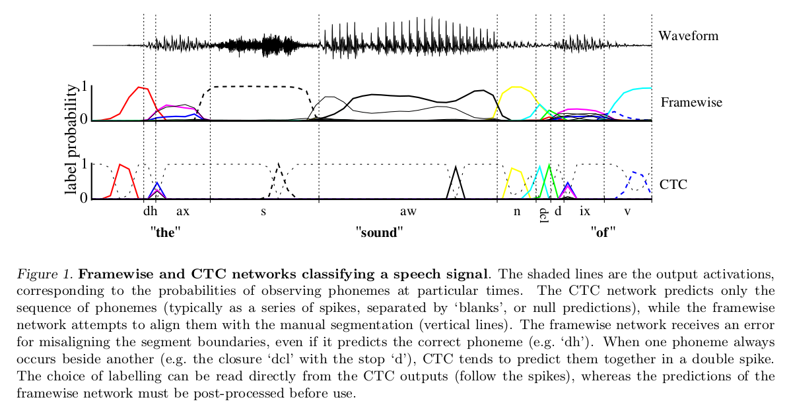
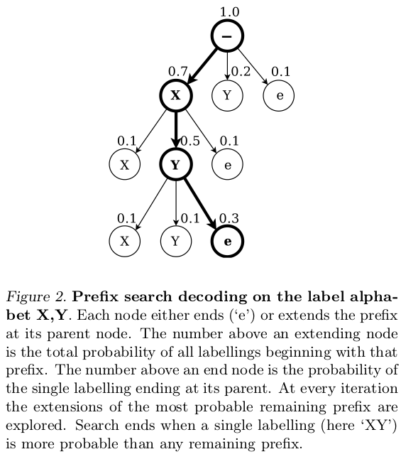
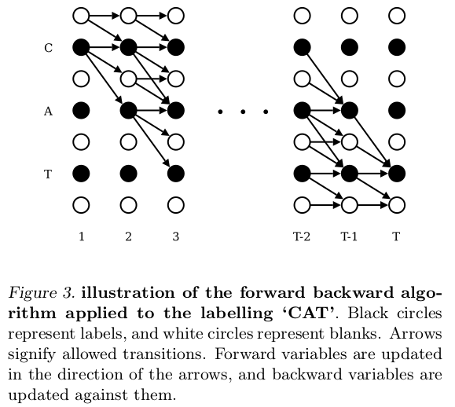

Connectionist Temporal Classification: Labelling Unsegmented Sequence Data with Recurrent Neural Networks
=

# 1. Introduction
标记未分段的序列数据是现实世界序列学习中普遍存在的问题。在感知任务（例如，手写识别，语音识别，手势识别）中尤其常见，其中有噪声的实值输入流用诸如字母或单词的离散标签串来注释。

最近，例如隐马尔科夫模型（hidden Markov Model: HMM）、条件随机场和它们的变体等的图模型是序列标注的主导框架。虽然这些方法对于许多问题证明是成功的，但是它们有几个缺点：（1）它们通常需要大量的任务特定知识，例如： 设计HMM的状态模型，或选择CRF的输入特征;（2）它们需要明确的（通常是有问题的）依赖性假设来使推断易于处理，例如假设观察是独立于HMM的;（3）对于标准HMM，即使序列标记是有区别的，训练也是生成性的。

另一方面，循环神经网络（RNN）不需要数据的先验知识，除了输入和输出表征的选择外。它们可以进行有区别的训练，其内部状态为时间序列建模提供了强大的通用机制。此外，它们往往对时间和空间噪声具有鲁棒性。

然而，到目前为止，还不可能将RNN直接应用于序列标记。问题是标准神经网络目标函数是针对训练序列中的每个点单独定义的; 换句话说，只能训练RNN进行一系列独立的标签分类。这意味着必须对训练数据进行预分段，并且必须对网络输出进行后处理以给出最终的标签序列。

目前，最有效地使用RNN进行序列标记是将它们与所谓的混合方法中的HMM结合起来（Bourlard＆Morgan，1994; Bengio，1999）。混合系统使用HMM来模拟数据的长期序列结构，并使用神经网络来提供局部分类。在训练期间，HMM部分能够自动分段，并且将网络分类转换为标签序列。然而，也继承了前面提到的HMM的缺点，混合系统不能利用RNN的全部潜力进行序列建模。

本文提出了一种用RNN标记序列数据的新方法，该方法不需要预先分割的训练数据和后处理输出，并在单个网络体系结构中对序列的所有方面进行建模。基本思想是在给定的输入序列为条件，将网络输出解释为所有可能的标签序列的概率得分。给定这种分布，可以导出直接最大化正确标签概率的目标函数。因为目标函数是可微的，然后，可以通过标准的反向传播来训练网络（Werbos，1990）。

在下文中，我们称标注未分段数据序列的任务为时序分类（temporal classification）（Kadous，2002），以及我们称为此目的使用RNN作为连接主义时序分类（connectionist temporal classification： CTC）。相反，我们将输入序列的每个时间步或帧的独立标记称为逐帧分类。

# 2. Temporal Classification
令 $S$ 为服从固定分布 $\cal{D_{X \times Z}}$ 训练样本集合。输入空间 $\cal{X} = (\Bbb R^m)^\ast$ 为所有 $m$ 维实值向量序列的集合。目标空间 $\cal{Z}$ $= L^\ast$ 为标签的（有限）字母 $L$ 上的所有序列的集合。一般而言，我们称 $L^\ast$ 的元素为标签序列或标注。$S$ 中的每个样本由序列对 $(x, z)$ 组成。目标序列 $z = (z_1, z_2, \cdots, z_U)$ 最多与输入序列 $x =(x_1，x_2，...，x_T)$ 一样长，即 $U \le T$ 。由于输入和目标序列通常不是一样长的，因此，没有先验的方法来对齐它们。

目的是使用 $S$ 训练时间分类器 $h: \cal{X} \rightarrow Z$ 以最小化某些任务特定误差测量的方式对先前未看到的输入序列进行分类。

## 2.1. Label Error Rate
本文中，我们对以下误差测量感兴趣： 给定与 $S$ 不相交的测试集 $S' \subset \cal{D_{X \times Z}}$ ，定义时序分类器 $h$ 的label error rate（LER）为它的类和 $S'$ 中目标之间的规范化edit 距离，即
$$LER(h, S') = \frac{1}{N} \sum_{(x,z) \in S'} ED(h(X)) \tag 1$$
其中 $Z$ 是 $S'$ 中目标标签的总数， $ED(p, q)$ 是两个序列 $p$ 和 $q$ 之间的edit 距离，即将 $p$ 变为 $q$ 所需的最小插入、取代和删除次数。

这是对任务（如语音或手写识别）的自然测量，其中目标是最小化转录错误率。

# 3. Connectionist Temporal Classification
本节中描述允许循环神经网络用于CTC的输出表征。关键步骤是将网络输出转换为标签序列上的条件概率分布。然后，通过为给定输入序列选择最可能的标记，可以将网络用于分类器。

## 3.1. From Network Outputs to Labellings
CTC网络有一个softmax输出层（Bridle，1990），该层比 $L$ 中的标签多一个单元。前 $|L|$ 个单元的激活可以解释为，在特定时间，观察到相应标签的概率。额外一个单元的激活是观察到 "blank" 或没有标签的概率。_这些输出一起定义了将所有可能的标记序列与输入序列对齐的所有可能方式的概率。_ 然后，可以对不同对齐概率求和来找到任何一个标记序列的总概率。

更正式地说，对于长度为 $T$ 的输入序列 $x$ ，定义有 $m$ 个输入、 $n$ 个输出和权重向量 $w$ 的循环神经网络作为连续映射 $\cal{N_w}: (\Bbb{R^m})^T \rightarrow (\Bbb{R^n})^T$ 。令 $y = \cal{N_w}(x)$ 为网络输出序列，并且 $y_k^t$ 表示在 $t$ 时间输出单元 $k$ 的激活，其定义了字母 $L'= L  \cup \{blank\}$ 中长度为 $T$ 的序列的集合 $L'^T$ 上的分布：
$$p(\pi|x) = \prod_{t=1}^T y_{\pi_t^t}, \forall \pi \in L'^T  \tag 2$$
从现在开始，我们称 $L'^T$ 中的元素为路径（path），并将它们表示为 $\pi$ 。

（2）中隐含的假设是，在给定网络的内部状态的情况下，不同时间的网络输出是条件独立的。通过要求从输出层到其自身或网络不存在反馈连接来确保这一点。

下一步是定义多到一映射 $\cal{B}:$ $L'^T \rightarrow L^{\le T}$ ，其中 $L^{\le T}$ 是可能的标签集合（即原始输入标签字母表 $L$ 上的长度小于或等于 $T$ 的序列集合）。我们只需从路径中删除所有空白和重复标签即可（例如，$\cal{B}(a-ab-) = \cal{B}(-aa--abb) = aab$）。直观地，这对应于当网络从预测无标签切换到预测标签或从预测一个标签到另一个标签时输出新标签（参见图1中的CTC输出）。最后，我们使用 $\cal B$ 将给定标签 $l \in L^{\le T}$ 的条件概率定义为与它对应的所有路径的概率之和：
$$p(l|x) = \sum_{x \in \cal B^{-1}(l)} p(\pi | x) \tag 3$$

## 3.2. Constructing the Classifier
给定上述公式，分类器的输出应当是输入序列的最可能的标签：
$$h(x) = \arg \max_{l\in L^{\le T}} p(l|x)$$
使用HMM的术语，我们称找到这种标签的任务为解码（decoding）。不幸的是，我们不知道我们系统的通用、易处理的解码算法。然而，以下两种近似方法在实践中给出了良好的结果。

第一种方法（最佳路径解码： best path decoding）是基于最可能路径对应最可能标签的假设：
$$
\begin{alignat}{2}
h(x) \approx & \cal{B}(\pi ^\ast)  \\
& \mbox{where } \pi^\ast = \arg \max_{\pi \in N^t} p(\pi | x)
\end{alignat} \tag 4
$$
最佳路径解码很容易计算，因为 $\pi^\ast$ 仅是每个时间步中最激活输出的联结。然而，它不确保找出最可能的标签。

第二种方法（前缀搜索解码： prefix search decoding）依赖于以下事实：通过修改4.1节的前向——后向算法，我们可以有效地计算标签前缀的连续扩展的概率（图2）。

给定足够的时间，总能找到最可能的标注。但是，必须扩展的前缀的最大数量随输入序列长度呈指数增长。如果输出分布在模式周围充分达到峰值，它仍将在合理的时间内完成。但是，对于本文中的实验，需要进一步的启发式以使其应用可行。

观察一个经过训练的CTC网络的输出倾向于形成由强烈预测的空白分隔的一系列尖峰（图1），我们将输出序列分成很可能以空白开始和结束的部分。然后，我们单独计算每个部分的最可能标记，并将这些标记连接起来以获得最终分类。

实际上，前缀搜索适用于此启发式算法，并且通常优于最佳路径解码。然而，在某些情况下它确实失败，例如，如果在截面边界的两侧弱预测相同的标记。

# 4. Training the Network
到目前位置，我们描述了允许RNN用于CTC的输出表征。现在，我们推导使用梯度下降训练CTC网络的目标函数。

目标函数由极大似然准则推导。也就是说，最小化它可以最大化目标标注的对数似然。注意，这与标准神经网络目标函数的基本原理相同（Bishop，1995）。给定目标函数，及其相应网络输出的导数，可以通过标准的反向传播来计算权重梯度。然后，可以使用当前用于神经网络的任何基于梯度的优化算法来训练网络（LeCun等人，1998; Schraudolph，2002）。我们从极大似然函数所需的算法开始。

## 4.1. The CTC Forward-Backward Algorithm
我们需要一种有效的方法来计算单个标记的条件概率 $p(l|x)$ 。乍一看（3）表明这将是有问题的：总和是在与给定标签相对应的所有路径上，并且通常存在很多这样的路径。

幸运的是，问题可以通过动态规划算法来解决，类似于HMM的前向后向算法（Rabiner，1989）。**关键思想是对应于标记的路径的总和可以被分解为对应于该标记的前缀的路径的迭代和。然后，迭代能够有效地使用递归 _forward_ 和 _backward_ 变量有效地计算。**

对于长度为 $r$ 的序列 $q$ ， $q_{1:p}$ 和 $q_{(r-p):r}$ 分别表示其前和后 $p$ 个符号。然后，对于标签 $l$ ，定义前向变量 $\alpha_t(s)$ 为在时间 $t$ 时 $l_{1:s}$ 的全部概率，即
$$\alpha_t(s) \overset{def}= \sum_{\pi \in N^T:\cal B(\pi_{1:t})=l_{1:s}} \prod_{t'=1}^t y_{\pi_{t'}}^{t'} \tag 5$$
正如我们将看到的， $\alpha_t(s)$ 能够从 $a_{t-1}(s)$ 和 $\alpha_{t-1}(s-1)$ 递归地计算。

为了允许输出路径中的空格，我们考虑修改的标签序列 $l'$，在开头和结尾添加空格以及每对标签之间插入空格。因此，$l'$ 的长度变为 $2 |l| + 1$ 。在计算 $l$ 的前缀概率时，我们允许空格和非空格标签之间的所有转换，以及任何一对不同的非空白标签之间的转换。我们允许所有的前缀以一个空格（$b$）或 $l(l_1)$ 的第一个符号开始。

这为我们提供了如下的初始化规则
$$
\begin{alignat}{2}
\alpha_1(1) &= y_b^1  \\
\alpha_1(2) &= y_{l_1}^1 \\
\alpha_1(s) & = 0, \forall s > 2
\end{alignat}
$$
以及递归
$$
\alpha_t(s) =
\begin{cases}
\bar{\alpha}_t(s) y_{l_s'}^t & \mbox{ if } l_s' = b \mbox{ or } l_{s-2}' = l_s'  \\
(\bar{\alpha}_t(s) + \alpha_{t-1}(s-2))y_{l_s'}^t & \mbox{ otherwise}
\end{cases} \tag 6
$$
其中
$$
\bar\alpha_t(s)\overset{def}{=} \alpha_{t-1}(s) + \alpha_{t-1}(s-1)  \tag 7
$$
注意，$\alpha_t(s) = 0, \forall s < |l'| - 2(T-t) - 1$ ，因为这些变量对应于没有足够时间步长来完成序列的状态（图3右上角的未连接圆圈）。同时 $\alpha_t(s) = 0, \forall s < 1$ 。

然后，$l$ 的概率是在时间 $T$ 时，有或者无最终空格的 $l'$ 的全部概率之和。
$$p(l|x) = \alpha_T (|l'|) + \alpha_T(|l'| - 1) \tag 8$$

相似地，反向变量 $\beta_t(s)$ 定义为，在时间 $t$ 时，$l_{s:|l|}$ 的全部概率：
$$
 \beta_t(s) \overset{def}{=} \sum_{\pi \in N^T: \cal{B}(\pi_{t:T}) = 1_{s:|l|}} \prod_{t'=t}^T y_{\pi_{t'}}^{t'} \tag 9 \\
\beta_T(|l'|) = y_b^T \\
\beta_T(|l'| - 1) = y_{l_{|l|}}^T  \\
\beta_T(s) = 0, \forall s < |l'| - 1
$$
$$
\beta_t(s) =
\begin{cases}
\bar\beta_t(s) y_{l_s'}, & \mbox{ if } l_s' = b \mbox{ or } l_{s+2}' = l_s'  \\
(\bar\beta_t(s) + \beta_{t+1}(s+2)) y_{l_s'}^t, & \mbox{ otherwise}
\end{cases}  \tag {10}
$$
其中
$$
\bar\beta_t(s) \overset{def}{=} \beta_{t+1}(s) + \beta_{t+1}(s+1) \tag {11}
$$
注意，对于 $\forall s > 2t$ （图3的左下角未连接的圆）和 $\forall s > |l'|$ ，有 $\beta_t(s) = 0$。

实际上，上述递归很快就会导致任何数字计算机出现下溢。避免这种情况的一种方法是缩放前向和后向变量（Rabiner，1989）。如果我们定义
$$
C_t \overset{def}{=} \sum_s \alpha_t(s), \hat{\alpha}_t(s) \overset{def}{=} \frac{\alpha_t(s)}{C_t}
$$
并且，在（6）和（7）的RHS用 $\hat\alpha$ 替换 $\alpha$ ，前向变量将保持在计算范围内。相似地，对于后向变量，我们定义
 $$
 D_t \overset{def}{=} \sum_s \beta_t(s), \hat{\beta}(s)\overset{def}{=}\frac{\beta_t}{D_t}
 $$
并在（10）和 （11）的RHS中用 $\hat \beta$ 替换 $\beta$ 。

为了评估极大似然误差，我们需要目标标签概率的自然对数。使用重新缩放的变量，这些变量具有特别简单的形式：
 $$\ln (p(l|x)) = \sum_{t=1}^T \ln(C_t)$$

## 4.2. Maximum Likelihood Training
极大似然训练旨在同时最大化训练集中所有正确分类的对数概率。我们的案例中，这意味着最小化如下的目标函数：
$$O^{ML}(S, \cal{N_w}) = -\sum_{(x,z) \in S} \ln(p(z|x)) \tag {12}$$
为了使用梯度下降训练网络，我们需要（12）中对应网络输出的微分。由于训练样本是独立的，因此，我们可以单独地考虑它们：
$$
\frac{\partial O^{ML}(\{(x,z)\}, \cal{N_w})}{\partial y_k^t} = -\frac{\partial \ln(p(z|x))}{\partial y_k^t}  \tag {13}
$$
现在证明，如何使用4.1节中算法计算（13）。

关键之处在于，对应标签 $l$ ，在给定 $s$ 和 $t$ 时，前向和后向变量的乘积是对应于l的所有路径在时间 $t$ 经过符号 $s$ 的概率。更精确地，由（5）和（9）有：
$$
\begin{alignat}{2}
\alpha_t(s)\beta_t(s) & = \sum_{\pi \in N^T:\cal B(\pi_{1:t})=l_{1:s}} \prod_{t'=1}^t y_{\pi_{t'}}^{t'} \sum_{\pi \in N^T: \cal{B}(\pi_{t:T}) = 1_{s:|l|}} \prod_{t'=t}^T y_{\pi_{t'}}^{t'}  \\
& = \sum_{\pi \in N^T:\cal B(\pi_{1:t})=l_{1:s}} \sum_{\pi \in N^T: \cal{B}(\pi_{t:T}) = 1_{s:|l|}} \prod_{t'=1}^t y_{\pi_{t'}}^{t'} \prod_{t'=t}^T y_{\pi_{t'}}^{t'} \\
& = \sum_{\pi \in N^T:\cal B(\pi_{1:t})=l_{1:s}} \sum_{\pi \in N^T: \cal{B}(\pi_{t:T}) = 1_{s:|l|}} y_{\pi_t}^t\prod_{t'=1}^t y_{\pi_t}^t  \\
\end{alignat}
$$

这里需要处理下两个求和公式的意思,因为 $\cal B(\pi_{1:t})=l_{1:s} 且 B(\pi_{t:T})=l_{s:\left| l \right|}$ ,一左一右两个序列都对应上了,则必然有 $\cal B(\pi_{1:T})=l_{1:\left| l \right|}$,又因为 $\pi_{t}$ 对应的点既在 $l_{1:s}$ 中,又在 $l_{s:\left| l \right|}$ 中,一个点出现在两个集合中,则必然只能出现在两个集合的交集中,而 $l_{1:s}$ 和 $l_{s:\left| l \right|}$ 的交集为 $l_{s}'$ ,所以另一个条件就是 $\pi_{t}=l_{s}$ ,这是一种对应的关系.

最后有:
$$
\alpha_{t}(s)\beta_{t}(s)=\sum_{\pi\in B^{-1}(l):\\\pi_{t}=l_{s}}{y_{\pi_{t}}^{t}\prod_{t=1}^{T}y_{\pi_{t}}^{t}}=\sum_{\pi\in B^{-1}(l):\\\pi_{t}=l_{s}}{y_{l_{s}'}^{t}\prod_{t=1}^{T}y_{\pi_{t}}^{t}}$$

从（2）中重新排列并代入，有
$$\frac{\alpha_t(s)\beta_t(s)}{y_{l_s'}^t} = \sum_{\pi\in\cal B^{-1}(l): \pi_t=l_s'} p(\pi|x)$$
从（3）我们可以看出，这是由于在时间 $t$ 经过 $l$ 的那些路径产生的总概率 $p(l|x)$ 的一部分。对于任意的 $t$ ，因此，我们在 $s$ 上求和，的
$$p(l|x) = \sum_{s=1}^{|l'|} \frac{\alpha_t(s)\beta_t(s)}{y_{l_s'}^t} \tag {14}$$
为了求相对于 $y_k^t$ 的微分，我们仅需要考虑在时间 $t$ 经过标签 $k$ 的路径。注意，对于单个标签 $l$ 可以重复相同的标签（或空白）若干次，我们定义标签 $k$ 出现的位置集合为 $lab(l，k) = \{s: l_s' = k\}$，其可以为空。然后，（14）的微分为：
$$\frac{\partial p(l|x)}{\partial y_k^t} = \frac{1}{{y_k^t}^2} \sum_{s\in lab(l, k)} \alpha_t(s)\beta_t(s) \tag {15}$$
观察
$$\frac{\partial \ln(p(l|x))}{\partial y_k^t} = \frac{1}{p(l|x)}\frac{\partial p(l|x)}{\partial y_k^t}$$
我们设置 $l = z$ ，并将（8）和（15）带入（13）得到目标函数的微分。
