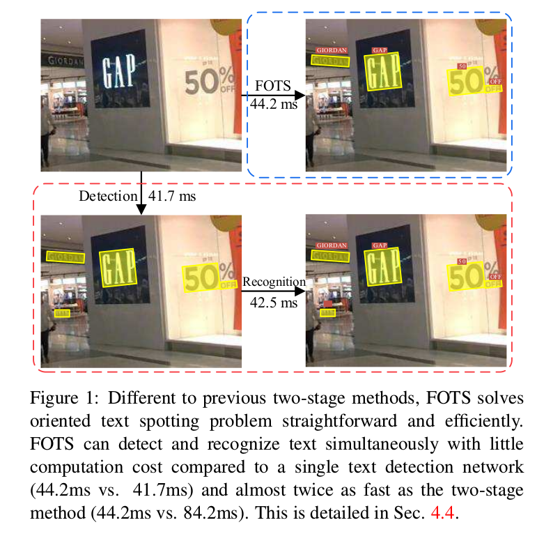
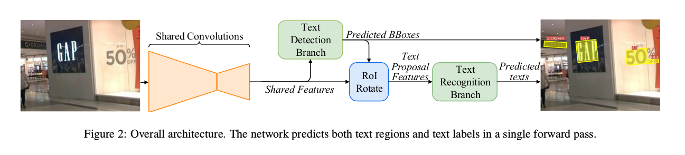
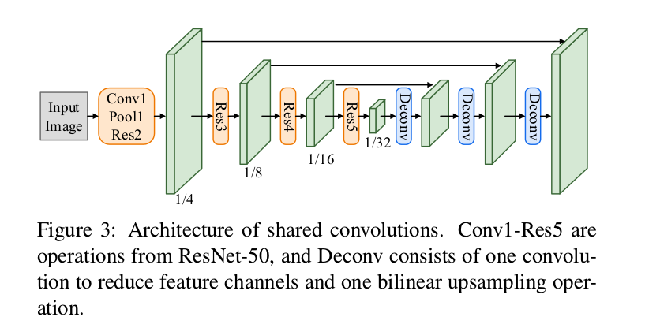
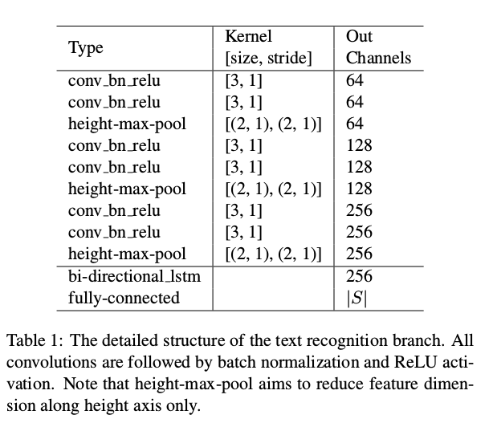
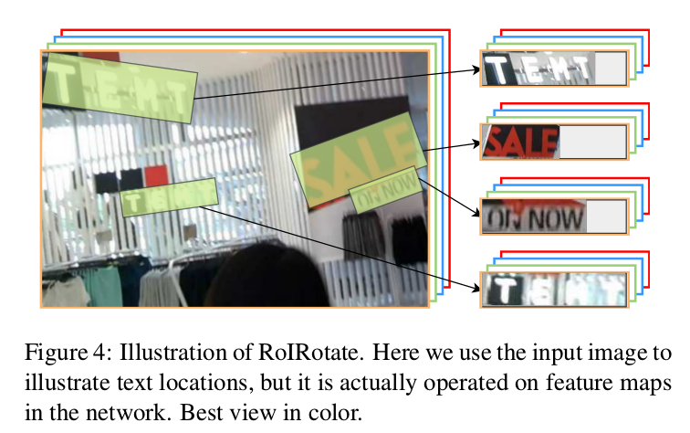
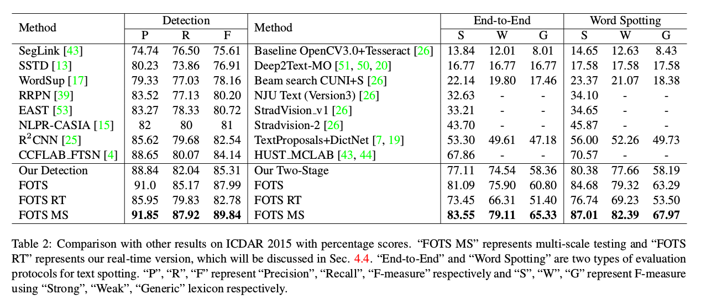
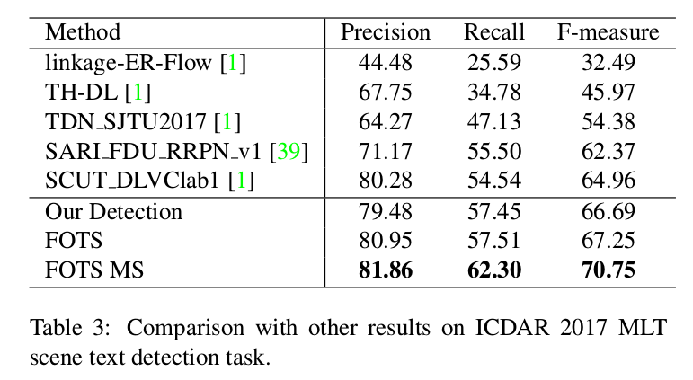
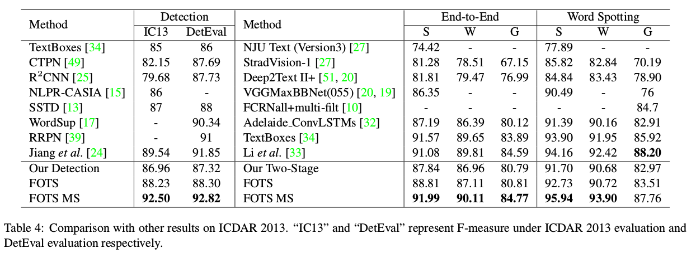
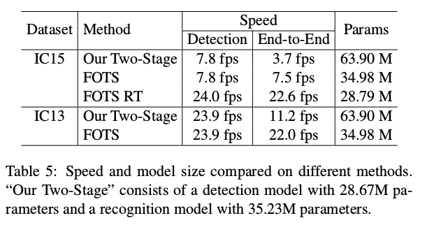

FOTS: Fast Oriented Text Spotting with a Unified Network
=

# 1. Introduction
在文本检测中，通常使用一个卷积神经网络从场景图像中提取特征图，然后使用不同的解码器（decoder）解码区域[49,43,53]。而在文本识别中，用于序列预测的网络在文本区域之上逐个进行[44,14]。它导致严重的时间成本，特别是对于有大量文本区域的图像。另一个问题是它忽略了在检测和识别中共享的视觉线索中的相关性。单个检测网络不能由来自文本识别的标签监督，反之亦然。

本文中，我们提出同时考虑文本检测和识别。它产生一个快速的定向文本识别系统（fast oriented text spotting system: FOTS），其能够端到端训练。相比之前的两阶段文本识别，我们的方法通过卷积神经网络更好地学习特征。由于特征提取通常占用大部分时间，因此将计算量缩减到单个检测网络，如图1所示。连接检测和识别的关键是 _RoIRotate_ ，它根据定向检测的边界框获取合适的特征图。

架构如图2。首先使用共享卷积提取特征图。基于全卷积网络的定向文本检测分支构建在特征图顶部，以预测检测边界框。RoIRotate操作从特征图提取与检测结果相关的文本提议特征。然后，文本提议特征被馈入循环神经网络（RNN）encoder和Connectionist Temporal Classification（CTC）decoder 。由于网络中所有的模块是可微的，整个网络可以端到端训练。据我们所知，这是第一个用于定向文本检测和识别的端到端可训练框架。我们发现无需复杂的后处理和超参数调整即可轻松训练网络。

本文的贡献归纳如下：
- 我们为快速定向的文本识别提出了端到端的可训练框架。通过共享卷积特征，网络可以在几乎没有计算开销的情况下同时检测和识别文本，从而实现实时速度。

- 我们引入 _RoIRotate_ ，一种新的可微操作以从卷积特征图提取定向文本区域。这个操作将文本检测和识别统一到一个端到端的管道中。

- FOTS在许多文本检测和文本定位基准上大大超过了最先进的方法，包括ICDAR 2015 [26]，ICDAR 2017 MLT [1]和ICDAR 2013 [27]。

# 2. Related Work
## 2.1. Text Detection
多数传统的文本检测方法将文本视为字符的组合。这些基于字符的方法，首先定位图像中的字符，然后将它们组成单词或文本线。基于滑动窗口的方法[22,28,3,54]和基于连接组件（connected-component）的方法传统方法中两种具有代表性的类型。

最近，许多基于深度学习的方法提出用以直接检测图像中的单词。Tian等人[49]采用垂直锚机制以预测固定宽度的提议，然后连接它们。Ma等人[39]通过提出旋转RPN和旋转RoI池，为任意方向的文本引入一种新颖的基于旋转的框架。Shi等人[43]首先预测文本分割，然后将它们链接成一个完整的用于linkage预测实例。Zhou等人[53]（EAST）和He等人[15]提出deep direct regression方法用以多方向场景文本检测。

## 2.2. Text Recognition
通常，场景文本识别旨在从规则但长度可变的文本图像中解码一系列标签。大多数先前的方法[8,30]捕获单个字符，然后精炼误分类的字符。除了字符级方法外，最近的文本区域识别方法可以分为三种类型：基于单词分类、基于序列到标签（sequence-to-label）的解码和基于序列到序列（sequence-to-sequence）的模型。

Jaderberg等人[19]将单词识别问题看做大量类标签的卷积多类别分类任务。Su等人将文本识别视作序列标签问题，其中RNN在HOG特征上构建，并采用CTC作为解码器。Shi等人[44]和He等人提出深度循环模型以编码max-out CNN特征，并采用CTC解码编码的序列。Fujii等人[5]提出编码器和摘要器（summarizer）网络以执行行级脚本识别。Lee等人[31]使用基于注意力的序列到序列结构以自动关注某个提取的CNN特征，并隐式学习嵌入到RNN的字符级语言模型。为了处理不规则的输入图像，Shi等人[45] 和刘等人[37] 引入空间注意机制，将扭曲的文本区域转换为适合识别的规范姿势。

## 2.3. Text Spotting
多数先前的文本识别方法，首先使用文本检测模型生成文本提议，然后使用单一的文本识别模型识别它们。Jaderberg[20]等人首先使用一个集成模型生成具有高召回率的整体文本提议，然后使用单词分类器进行单词识别。Gupta等人[10]训练了一个全卷积回归网络用以检测文本，并采用[19]中的单词分类器进行文本识别。Liao等人[34]使用基于SSD的方法进行文本检测，并使用CRNN进行文本识别。

最近，Li等人提出一种端到端的文本识别方法，其使用受RPN启发的文本提议网络进行文本检测，以及具有注意力机制的LSTM进行文本识别。我们的方法相比它们有两个主要优势： **（1）我们引入RoIRotate和使用完全不同的文本检测算法解决更复杂和困难的场景，同时它们的方法仅适合水平文本。（2）我们的方法在速度和性能方面远好于它们，几乎无成本的文本识别步骤确保我们的文本识别系统以实时速度运行，同时他们的方法花费大约900ms处理 $600\times800$ 的输入图像。**

# 3. Methodology
FOTS是一种端到端的可训练的框架，其同时检测和识别自然场景图像中的所有单词。它由四个部分组成：共享卷积、文本检测分支、RoIRotate操作和文本识别分支。

## 3.1. Overall Architecture
我们的框架的概述如图2所示。文本检测分支和识别分支共享卷积特征，共享网络的架构如图3 。共享网络的骨干是ResNet-50 。受特征金字塔的启发，我们将低层特征图和高层特征图联结。通过共享卷积产生的特征图的分辨率是输入图像的 $1/4$ 。文本检测分支使用共享卷积产生的特征，输出密集的每个像素的文本预测。根据文本检测分支产生的定向文本区域提议，所提出的RoIRotate将相应的共享特征转换为固定高度的表征，同时保持原始区域的宽高比。最后，文本识别分支在区域提议上识别单词。CNN和LSTM用于编码文本序列信息，接着是CTC解码器。我们的文本识别分支如表1 。

## 3.2. Text Detection Branch
受[53,15]的启发，我们采用全卷积网络作为文本检测器。由于自然场景图像中存在许多小型文本边界框，所有我们将共享卷积中的特征图从原始输入图像大小的 $1/32$ 放大到 $1/4$ 。在提取共享特征后，一个卷积用于输出每个像素的存在文本预测。第一个通道计算每个像素称为正样本的概率。与[53]（EAST）相似，原始区域的缩小版本中的像素被视为正类。对于每个正样本，接着4个通道预测该像素到包含该像素的边界框顶部、底部、左边和右边的距离，最后一个通道预测相应边界框的方向。最终的预测结果通过应用阈值和NMS抑制这些正样本而产生。

在试验中，我们观察到许多模式相似的文本笔划很难分类，例如栅栏，格子等。我们采用OHEM以更好地区分这些模式，也解决了类别不平衡问题。这使得在ICDAR 2015数据集上获得大约2%的F-measure提高。

检测分支的损失函数由两部分组成：文本分类项和边界框回归项。文本分类项可以视为下采样得分图上逐像素分类损失。仅原始区域的缩小版本被认为是正类区域，而原始边界框和缩小版本之间的区域被视为“NOT CARE”，不对分类损失作出贡献。将OHEM选择的得分图中正类元素集合表示为 $\Omega$ ，分类的损失函数可以表示为：
$$
\begin{alignat}{2}
L_{cls} & = \frac{1}{|\Omega|} \sum_{x \in \Omega}H(p_x, p_x^\ast)  \\
& = \frac{1}{|\Omega|}\sum_{x \in \Omega}(-p_x^\ast \log p_x - (1 - p_x^\ast)\log(1 - p_x))
\end{alignat}  \tag 1
$$
其中 $|\cdot|$ 为集合中的元素数量， $H(p_x, p_x^\ast)$ 表示预测得分图 $p_x$ 和表示文本或者非文本的二值标签 $p_x^\ast$ 之间的交叉熵损失。

对于回归损失，我们采用[52]中IoU损失和[53]中的旋转角度损失，因为它们对对象形状、尺度和方向的变化具有鲁棒性：
$$
\begin{alignat}{2}
L_{reg} = & \frac{1}{|\Omega|}IoU(R_x, R_x\ast)  \\
& + \lambda_{\theta}(1 - \cos(\theta_x, \theta_x^\ast))
\end{alignat} \tag 2
$$
这里， $IoU(R_x, R_x^\ast)$ 是预测边界框 $R_x$ 和 ground-truth $R_x^\ast$ 之间的IoU损失。第二项是旋转角度损失，其中 $\theta_x$ 和 $\theta_x^\ast$ 表示分别表示预测方向和ground-truth方向。我们在实验中将超参数 $\lambda_\theta$ 设置为 10 。

因此，完整的检测损失可以表示为：
$$L_{detect} = L_{cls} + \lambda_{reg} L_{reg} \tag 3$$
其中超参数 $\lambda_{reg}$ 平衡两种损失，我们在实验中将其设为1 。

## 3.3. RoIRotate

RoIRotate对定向特征区域应用变换以获得轴对齐特征图，如图4所示。本文中，我们固定输出高度并保持宽高比不变以处理文本长度的变化。相比RoIRotate和RoIAlign，RoIRotate提供提取兴趣区域特征的更一般的操作。我们也比较了RRPN[39]中的RRoI池化。RRoI池化通过最大池化将旋转区域变换到固定大小的区域，而我们使用双线性插值来计算输出的值。这个操作避免RoI和所提取的特征之间的不对齐，并附加地是输出的特征的长度是可变的，这更适合文本识别。

**这个过程可以分为两个步骤。第一，通过文本提议的预测或者ground-truth坐标计算仿射变换参数。第二，将仿射变换分别应用到共享特征图的每个区域，并且获得规范的文本区域的水平特征图。第一个步骤可以表示为：**  
$$
\begin{alignat}{2}
& t_x = l \ast \cos \theta - t \ast \sin \theta - x \tag 4  \\
& t_y = t \ast \cos \theta + t \ast \sin \theta - y \tag 5  \\
& s = \frac{h_t}{t + b} \tag 6  \\
& w_t = s \ast (l + r) \tag 7 \\
\end{alignat}
$$

$$
\begin{alignat}{2}
M & = \left [
  \begin{array}{ccc}
  \cos \theta & - \sin \theta & 0  \\
  \sin \theta & \cos \theta & 0  \\
  0 & 0 & 1
  \end{array}
  \right ] \left[
  \begin{array}{ccc}
  s & 0 & 0  \\
  0 & s & 0  \\
  0 & 0 & 1
  \end{array}
   \right] \left[
   \begin{array}{ccc}
   1 & 0 & t_x  \\
   0 & 1 & t_y  \\
   0 & 0 & 1
   \end{array}
    \right] \\
  & = s \left [
  \begin{array}{ccc}
  \cos \theta & - \sin \theta & t_x \cos \theta - t_y \sin \theta  \\
  \sin \theta & \cos \theta & t_x \sin \theta + t_y \cos \theta  \\
  0 & 0 & \frac{1}{s}
  \end{array}
  \right ]  \tag 8
\end{alignat}
$$
**其中 $M$ 是仿射变换矩阵。 $h_t, w_t$ 表示仿射变换后特征图的高（我们的设置中为 8）和宽。$(x, y)$ 表示共享特征图中的点的坐标，$(t,b,l,r)$ 分别表示特征图中像素点到top、bottom、left和right的距离， $\theta$ 表示方向。$(t,b,l,r)$ 和 $\theta$ 通过ground-truth或检测分支给出。**

使用转换参数，可以使用仿射变换轻松生成最终的RoI特征：
$$
\left(
  \begin{array}{c}
  x_i^s  \\
  y_i^s  \\
  1
  \end{array}
\right) = M^{-1} \left(
  \begin{array}{c}
  x_i^t  \\
  y_i^t  \\
  1
  \end{array}
  \right) \tag 9
$$
并且，对于 $\forall i \in [1, \cdots, h_t], \forall j \in [1, \cdots, w_t], \forall c \in [1, \cdots, C]$ ，有：
$$
V_{ij}^c = \sum_n^{h_s} \sum_m^{w_s} U_{nm}^c k(x_{ij}^s - m; \Phi_x)k(y_{ij}^s - n; \Phi_y)  \tag {10}
$$
其中 $V_{ij}^c$ 是通道 $c$ 中位置 $(i, j)$ 处的输出值，$U_{nm}^c$ 是通道 $c$ 中位置 $(n, m)$ 出的输入值。 $h_s, w_s$ 表示输入的宽和高。$\Phi_x, \Phi_y$ 是一般的采样核 $k(\cdot)$ 参数，其定义为插值法，具体为双线性插值。由于文本提议的宽是变化的，我们在识别函数中将特征图填充到最大宽度，并忽略填充部分。

Spatial transformer 网络以相似的方式使用仿射变换，但是通过不同的方法获得变换参数，并且主要在图像域使用，即变换图像本身。RoIRotate使用共享卷积产生的特征图作为输入，并生成所有文本提议的具有固定高度以及不变宽高比的特征图。

不同于对象分类，文本识别随检测噪声非常敏感。预测文本区域的一个很小误差可能砍掉几个字符，这不利于训练，因此，我在训练期间，使用ground-truth文本区域而不是预测的文本区域。在测试时，首先使用阈值和NMS过滤预测文本区域，在RoIRotate之后，经过变换的特征图被传入文本识别分支。

## 3.4. Text Recognition Branch
文本识别分支旨在使用通过共享卷积和RoIRotate变换提取的区域特征来预测文本标签。考虑到文本区域中标签序列的长度，LSTM的输入特征沿宽度轴通过原始图像的共享卷积仅减少两次（如3.2节所述为1/4）。否则，将消除紧凑文本区域中的可辨别特征，尤其是窄形字符的特征。我们的文本识别分支由类似VGG的系列卷积、仅沿高度轴的池化、一个双向LSTM、一个全连接和最终的CTC解码器组成。

**首先，空间特征被馈入几个卷积层和具有维度减少的沿高度轴的池化层以提取更高水平的特征，如表1 。**

**接着，所提取的高层特征图 $L \in \Bbb R^{C \times H \times W}$ 转置成时间为主以形成序列 $l_1, \cdots, l_W \in \Bbb R^{C \times H}$ ，并馈入RNN进行解码。这里，我们使用双向LSTM，每个方法有 $D = 256$ 个输出通道，来捕获输入序列特征的长期依赖。然后，在两个方向的每个时间步中计算的隐藏状态 $h_1, \cdots, h_W \in \Bbb R^D$ 被求和，并馈入全连接层，其给出每个状态在字符类 $S$ 上的分布 $x_t \in \Bbb R ^{|S|}$ 。为了避免在如ICDAR2015这样的小数据集上产生过拟合，我们在全连接之前添加dropout。最后，CTC将逐帧的类别得分转换为标签序列。给定每个 $h_t$ 的 $S$ 的概率分布 $x_t$ 和grount-truth标签序列  $y^\ast = \{y_1, \cdots, y_T \}$ ，标签 $y^\ast$ 的条件概率是所有如下路径 $\pi$ 的概率之和：**
$$p(y^\ast | x) = \sum_{\pi \in \cal B^{-1}(y^\ast)} p(\pi | x) \tag {11}$$
其中 $\cal B$ 定义为从包括空格（blank）和重复标签的集合到 $y^\ast$ 的多到一的映射。这个训练过程试图最大化公式（11）之和在整个训练集上的对数似然。遵循[9]（CTC），识别损失可以定义为：
$L_{recog} = -\frac{1}{N}\sum_{n=1}^N \log p(y_n^\ast | x)  \tag {12}$
其中 $N$ 是输入图像中的文本区域数， $y_n^\ast$ 为识别标签。

结合公式（3）中的检测损失，完整的损失函数为：
$$L = L_{detect} + \lambda_{recog} L_{recog} \tag {13}$$
其中超参数 $\lambda_{recog}$ 控制两个损失的平衡。 我们的实验中 $\lambda_{recog}$ 设置为 1 。

## 3.5. Implementation Details
使用ImageNet预训练的模型初始化。训练过程包含两步：首先使用Synth800K数据集训练网络10个epoch，然后使用真实数据微调模型至其收敛。

数据增强：首先，图像的长边从640个像素调整到2460个像素。接着，在 $[-10^\circ, 10^\circ]$ 范围内随机旋转图像。然后在 $[0.8, 1.2]$ 范围内随机缩放图像的高，同时保持它们的宽不变。最后，从经过变换的图像中随机剪裁 $640 \times 640$ 的样本。

如3.2节所述，为了更好的性能，我们采用OHEM。对于每幅图像，选择512个hard negative 样本、512个random negative 样本和所有正样本进行分类。因此，正负样本之比从 $1:60$ 降到 $1:3$ 。对于边界框回归，我们选择128个hard positive样本和128个random positive用于训练。

在测试时，从文本检测分支获得预测的文本区域之后，所提出的RoIRotate将阈值和NMS应用于这些文本区域，并将所选文本特征提供给文本识别分支以获得最终识别结果。对于多尺度测试，所有尺度的结果组合在一起，并再次传入NMS以获得最终结果。

# 4. Experiments

