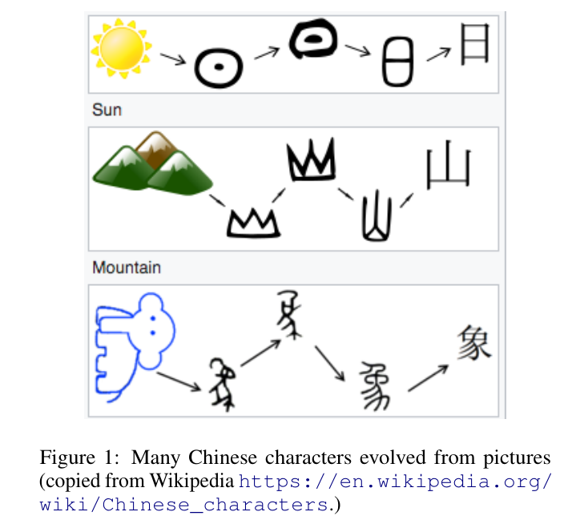
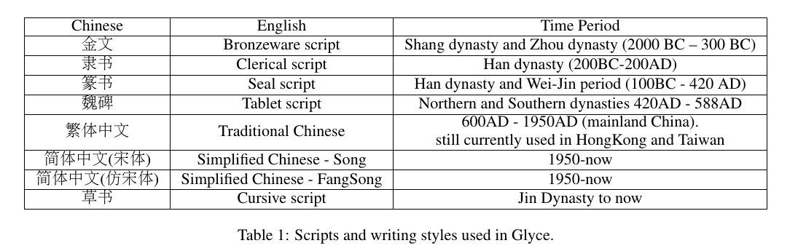
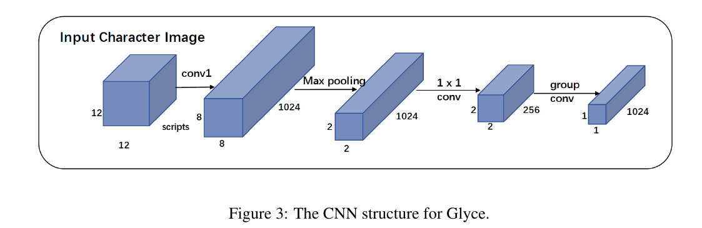
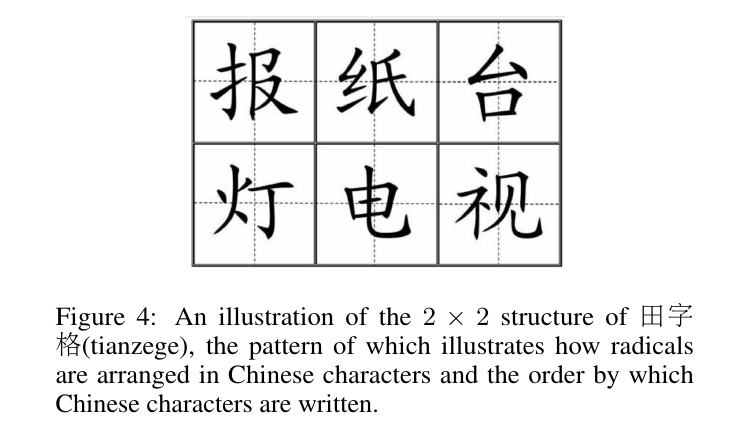
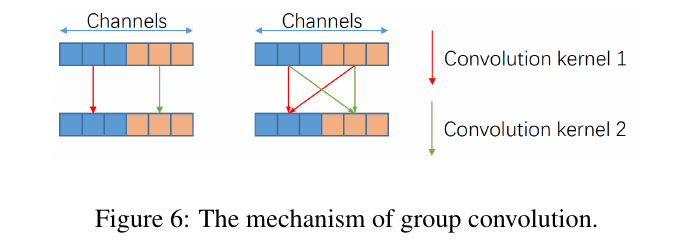
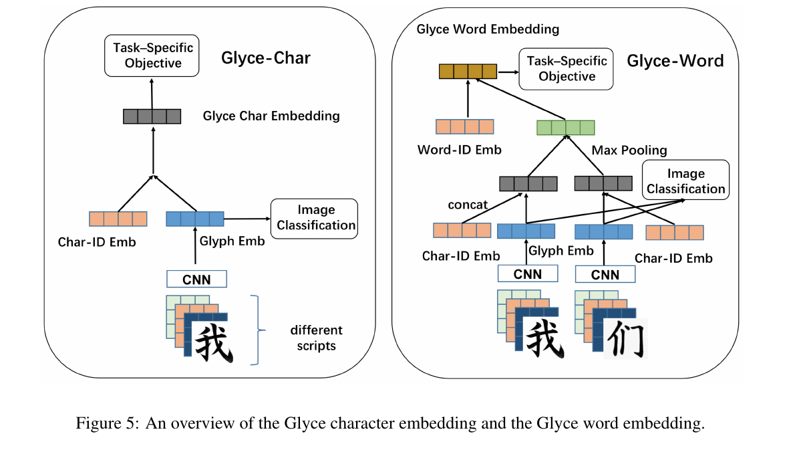
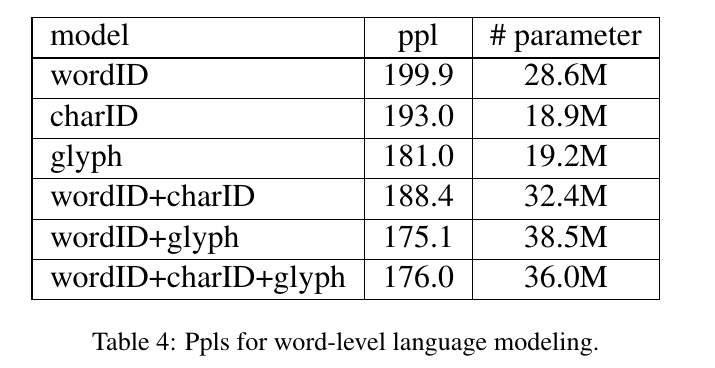

Glyce: Glyph-vectors for Chinese Character Representations
=

# Abstract
直观的是，像中文这样的徽标图形语言的NLP任务应该受益于这些语言中使用的字形信息。然而，由于字形中缺乏丰富的象形证据以及标准计算机视觉模型对字符数据的弱泛化能力，仍然有待找到利用字形信息的有效方法。

本文中，我们通过提出Glyce（汉字表示的字形向量）来处理这个差距。我们作出了三个方面的创新：（1）我们使用历史中文脚本（例如青铜器脚本，篆文，繁体中文等）来丰富人物中的象形证据;（2）我们设计了适合汉字图像处理的CNN结构;（3）我们使用图像分类作为多任务学习中的辅助任务，从而提高模型的泛化能力。

我们首次证明，基于字形的模型能够在广泛的中文NLP任务中始终优于基于字/字符ID的模型。使用 Glyce，我们在13（几乎所有）中文NLP任务中获得最佳性能，包括g (1) character-Level lan-
guage modeling, (2) word-Level language
modeling, (3) Chinese word segmentation,
(4) name entity recognition, (5) part-of-
speech tagging, (6) dependency parsing, (7)
semantic role labeling, (8) sentence seman-
tic similarity, (9) sentence intention iden-
tification, (10) Chinese-English machine
translation, (11) sentiment analysis, (12)
document classification and (13) discourse parsing。

# 1. Introduction
汉字是语标（logogram），可以分解为更小、更基本的语音语义部分：pictographs（象形）、对象的图形描述（例如： 亻、日、木等）；以及形声（如：青和晴）。回溯公元前2世纪的汉代，《说文解字》用偏旁来索引文字，今天仍然遵循这种传统。由于许多汉字是从图片演变而来的（图1所示的例子），汉字的语标编码丰富的意义信息。

分布式表示的出现（Mikolov等，2013; Pennington等，2014）提供了一种表达文本语义的优雅方式，并已广泛应用于中文自然语言处理。主流的深度算法几乎都使用单词或者字符作为基本的语义单元，并在单词/字符级别学习嵌入表示。字形表示很少使用。

直观的是，考虑到语标信息应该有助于语义建模。最近的研究直接支持这种论点：部首表示在广泛的语言理解任务中已被证明是有用的。使用“五笔”方案——一种模仿计算机键盘上字符键入序列顺序的汉字编码方法——可以提高汉英机器翻译的性能（Tan et al。，2018）。尽管部首和五笔表征编码了关于字符结构的一些信息，并一定程度上构建了更好的字符表征，但是部首和五笔表征都是编码了任意的ID，并因此不能触及更深层的标识信息。

最近，有一些努力将基于CNN的算法用于字符视觉特征。不幸的是，它们没有表现出一致的性能提升（Liu等，2017；Zhang和LeCun，2017），并且一些甚至产生负面结果（Dai和Cai，2017）。例如，Dai和Cai（2017）在char徽标上运行CNN以获得中文字符表示并将其用于下游语言建模任务。他们报告说，字形表示的合并实际上使性能恶化，并得出结论，基于CNN的表示不能为语言建模提供额外的有用信息。使用相似的策略，Liu等（2017）和Zhang与LeCun（2017）在文本分类任务上测试了这种思想，并且仅在非常有限设置中观察到性能提升。

我们对早期基于CNN的模型（Dai和Cai，2017）中报告的负面结果提出以下解释：
1. 没有使用正确的脚步版本：汉字系统有很长历史的进化，如图2所示。最着名的版本包括Oracle骨骼脚本（公元前2000年 - 公元前300年），文书脚本（200BC-200AD），印章脚本（公元100年 - 公元420年），平板电脑脚本（420AD-588AD）等。这种演变遵循某些模式。字符从容易绘画开始，慢慢地演变为容易书写。而且，随着时间的推移，它们变得越来越没有那么象形，也没有那么具体。迄今为止使用最广泛的脚本版本是简体中文，是最容易编写的脚本，但不可避免地会丢失最大量的象形信息。这可能导致仅使用简体中文字符训练的模型的糟糕性能。
2. 没有使用合适的CNN结构：不同于ImageNet图像，其大小几乎是 $800 \times 600$ 的尺度，字符logo明显更小（通常仅有 $12 \times 12$ 的大小）。它需要一个不同的CNN架构来捕获字符图像的局部图形特征。
3. 在以前的工作中没有使用regulatory function： 不同于ImageNet数据集（包含数百万数据点）上的分类任务，大约有10000个汉字。因此，辅助训练目标在阻止过拟合和提升模型泛化能力上至关重要。

本文中，我们提出GLYCE——GLYph-vectors for Chinese character representations 。我们将汉字视为图像，并使用CNN获得它们的表征。我们通过使用如下技术解决前面提到的问题：
- 我们使用历史和当代脚步的集合（例如青铜时期的脚本、文书脚本、印章脚本和繁体中文等）以及不同的书写风格（例如草书）来丰富字符图像的象形信息。
- 我们利用田字格结构为汉字进行了象形字符建模。
- 我们通过添加图像分类损失函数来使用多任务学习以增加模型的泛化能力。

使用Glyce，我们获得13个中文NLP任务上的最佳性能。...

# 2 Related Work
汉字可以分解为更小且原始的的部分，其作为意义而不是单词的基本单位。一项工作利用部首表示来构建字符表示（Shi等人，2015; Li等人，2015b; Yin等人，2016; Sun等人，2014）。Li等人（2015b）和Sun等人（2014）学习基于skip-gram（Mikolov等人）的学习部首表示。Yin等人（2016）发现部首表征提高单词相似性任务。Nguyen等人(2018)使用部首嵌入来提高单词发音任务的性能。表示汉字的另一种方式是使用五笔编码方案，其为基于形状的汉字编码方法。Tan等人（2018）证明五笔风格编码可以帮助机器翻译任务。

就我们而言，在Dai和Cai（2017）中首次探讨了在字符logo上运行CNN以获得汉字表征。基于logo的表征在两个任务上测试：语言建模和单词分割。不幸的是，Dai和Cai（2017）中报告的结果是负面的。Tan等人（2018）将CNN结构纳入GloVe（Pennington等人，2014）和skipgram（Mikolov等人，2013）以学习汉字嵌入。据报道，类似语义评估任务（如类比预测）有了显着改进。不幸的是，Tan等人（2018）没有进一步探索真实中文NLP任务中的性能。另一个重要的工作是来自Liu等人（2017），它全面研究了三种象形语言的视觉特征：中文、日文和韩文。评估模型的任务是使用象形特征对维基百科标题和模型进行分类。相似地，Zhang和LeCun（2017）使用象形特征来获得中文、日文和韩文的字符嵌入。使用在线产品评论在文本分类任务上测试logo嵌入。Liu等（2017）和Zhang与LeCun（2017）初步探索了在文本分类任务中使用CNN编码中文语言特征的可能性。就我们而言，没有广泛认可的结论是是否以及如何将汉字作为徽标图像处理以帮助进行语义建模。

基于CNN的模型广泛用于字母语言的字符级编码（Zhang等人，2015; Kim等人，2016; Chung等人，2016; Luong和Manning，2016）。在汉字中，字符级表征与单词级表征结合（Yin等，2016；Dong等人，2016；Yu等人2017）。在Zhang和LeCun（2017）中，汉字转换为拼音，这是一个使用字母表的标准中文罗马化系统。

# 3 Glyce
本文中，我们详细描述所提出的Glyce模型。
## 3.1 Using Historical Scripts
如第一节描述的，象形信息在简体中文中严重丢失。因此，我们提出使用历史上不同时期的脚本和不同书写风格。我们收集如下主要的历史的字体：金文（Bronzeware script）、隶书（Clerical script）、篆书（Seal script）和魏碑（Tablet script）、繁体中文（traditional Chinese）和简体中文（Simplified Chinese），以及不同的书写风格：草书（cursive script）和仿宋。细节如表1，例子如图2 。

不同历史时期的字体（其通常在形状上完全不同）有助于模型集成不同源的象形证据；不同书写风格的字体有助于提高模型的泛化能力。两种策略都能广泛用于计算机视觉中的数据增强策略。

## 3.2 The Tianzige-CNN Structure for Clyce
深度CNN广泛用于如图像分类和检测的计算机视觉任务。标准CNN结构包含两个主要部分：卷积层和池化层。对于三维的图像输入 $x \in \cal{R}^{H \times W \times C}$ （$H,W,C$分别为输入的宽、高、通道），CNN模型使用核扫描输入网格。$n \times n$ 核将每个原始图像的 $n \times n$ 区域映射到单个值。最大池化操作通常在卷积操作之后，其从相邻网格中选择最大值。

不幸的是，在我们的任务中直接使用深度CNN的产生非常差的性能，因为（1）字符图像有相对更小的大小：ImageNet图像的大小通常为 $800 \times 600$，而汉字图像的大小明显更小，通常为 $12 \times 12$ ；（2）训练样本缺乏：ImageNet数据集分类利用数百万的不同图像。相比之下，仅有大约1000个不同的汉字。

为了处理这个问题，我们提出“田字格”CNN结构，其针对中文字符建模量身定制，如图3所示。田字格是汉字书法的传统形式。它是初学者学习书写汉字的四个正方形格式（与汉字“田”相似），如图4所示。输入图像首先传入核大小为5个卷积层，并输出1024个通道以捕获更低级的图像特征。然后，一个核大小为4的最大池化层用于特征图，并将分辨率从 $8 \times 8$ 降到“田字格” $2 \times 2$ 。这个 $2\times2$ 田字格结构展示了汉字的排列方式以及汉字的编写顺序。我们发现田字格结构在提取字符意义方面具有重要意义。最后，我们应用卷积操作来将田字格映射到最终的输出。我们使用组卷机，而不是使用传统的卷积操作，如图6所示。组卷机滤波器远小于它们的正常副本，因此，不太容易过拟合。

将模型从单个脚本调整到多个脚本相当容易，这可以通过简单地将输入从2D（即 $d_{font} \times d_{font}$）更改为3D（即$N_{script} \times d_{font} \times d_{font}$）来实现，其中 $d_{font}$ 表示字体尺寸。

## 3.3 Using Image Classification as an Auxiliary Objective
为了进一步阻止过拟合，我们使用图像分类任务作为辅助训练目标。来自CNN的字形嵌入$h_{image}$将被转发到图像分类目标以预测其对应的charID。假设图像 $x$ 的标签为 $z$ 。图像分类任务 $\cal{L}(cls)$ 的训练目标给定如下：
$$
\begin{alignat}{2}
\cal{L}(cls) &= -\log p(z|x) \\
&=-\log softmax(W \times h_{image})
\end{alignat} \tag 1
$$
令 $\cal{L}(task)$ 表示我们需要处理任务的任务特定的目标，例如语言建模、单词分割、机器理解等。我们将 $\cal{L}(task)$ 和 $\cal{L}(cls)$ 线性结合，作出最终的目标训练函数如下：
$$\cal{L} = (1 - \lambda(t)) \cal{L}(task) + \lambda(t) \cal{L}(cls) \tag 2$$
其中 $\lambda(t)$ 控制任务特定目标和辅助图像分类目标之间的平衡。 $\lambda$ 为epoch $t$ 数量的函数： $\lambda(t) = \lambda_0 \lambda_1^t$ ，其中 $\lambda_0 \in [0, 1]$ 表示衰减率。 这意味着图像分类目标的影响随着训练的进行而降低，直观的解释是在训练的早期阶段，我们需要来自图像分类任务的更多规则。添加图像分类作为训练模仿多任务学习的思想。

## 3.4 Glyce-Char Embeddings
Glyce-Char嵌入的概述如图5所示。相同汉字的不同字体的图像首先堆叠，然后传递给CNN以获得图像嵌入 $h_{image}$ 。 $h_{image}$ 直接输出到图像分类模型用以 $\cal{L}(cls)$ 的训练。然后，结合Glyph嵌入和charID嵌入以获得Glyce-char嵌入。使用拼接、highway网络或其他全连接层。

## 3.5 Glyce-Word Embeddings
中文单词可以进一步分为字符。最近的工作（Yin等人，2016；Yu等人，2017）结合中文字符表示和单词表示以捕获更多细粒度语义，并也能处理位置单词。Glyce-Word嵌入如图5所示。我们首先使用CNN以为每个字符获得象形嵌入，然后拼接charID嵌入以获得Glyce-Char嵌入。由于中文单词包含任意数量的字符，我们在所有成分Glyce-char嵌入上使用一层max pooling来使维度不变。池化层的输出使用拼接、highway network或另外的全连接层以进一步与wordID结合以获得Glyce-word嵌入。

# 4 Experimental Results
本节中，我们介绍不同中文NLP任务上的结果。
## 4.1 Task1： Char-Level Language Modeling
第一个任务是字符级的语言建模任务，其中我们需要根据前一个字符预测后一个字符。我们在Chinese Tree-Bank6.0（CTB6）上评估模型。我们按照通常使用的协议，将数据的80%、10%、10% 的数据用于训练、验证和测试。数据集包含4401个不同的中文字符。我们使用LSTM结构，并通过所有设置的网络搜索调整层数、dropout rate、批大小和学习率。

表3报告了每个模型的复杂度，以及参数量。$cahrID$ 意味着我们仅有charID嵌入。$glyph$ 意味着字符嵌入仅使用象形嵌入构建。$charID + glyph$ 意味着我们使用二者。 $1 script$ 意味着仅使用简体中文脚步，而 $8 script$ 意味着使用历史脚本和不同的书写风格，如3.2节讨论的。

我们可以看到最好的象形模型优于字符模型。对于 $d = 1024$ 的设置，$glyph$、 $1 script$ 、 $no img cls$ 优于最佳的charID设置，即使它有明显更少的参数（由于glyph模型不需要维持 $D \times V$ 的look-up字符嵌入矩阵）。这证实了汉字的字形编码了大量的语义信息，并且只要我们使用适当的CNN结构，基于字形的模型就优于基于charID的模型。我们通过添加辅助图像分类目标和历史脚本来观察渐进性能提升。有趣的是，图像分类目标对于8脚本模型是必不可少的，没有它，ppl的价值就会飞涨。这种解释是直观的：图像分类目标推动CNN模型从不同的脚本提取共享的象形特征，其对于理解字符语义是必不可少的。

charID和glyph嵌入的结合给出了额外的性能提升，使用8个脚本和辅助图像分类目标推动Ppl值降到50.67。也值得注意的是最佳的Glyce设置也明显浩宇更大的$d=2048$的charID模型。

## 4.2 Task2： Work-Level Language Modeling
我们使用相同的Chinese Tree-Bank 6.0 数据集进行单词级语言建模评估。训练、验证、测试级与字符级设置相同。我们使用Jieba（只用最广泛的开源中文单词分割系统）来分割数据集。分割的数据集包含大约50000个单词，并且我们将出现少于2次的单词替换为UNK符号。LSTM模型在单词级表示上运行以预测接下来的单词。不同的设置在计算单词嵌入的方式上有所不同：
- wordID： 每个单词与基于其唯一的wordID嵌入关联。
- charID： Word嵌入是基于其组成字符的嵌入来计算的，并且不保持wordID嵌入。
- glyph： 与charID相似，但是字符嵌入使用glyph信息计算，而不是charID嵌入计算。
- wordID+charID：单词嵌入是基于其对应的wordID嵌入和组成（constituent）charID嵌入来计算。
- wordID+glyph： 单词嵌入基于其相应的wordID嵌入和来自glyph的 constituent 字符嵌入计算。
-wordID+charID+glyph： 单词嵌入基于其相应的wordID嵌入、来自charID的constituent char嵌入和来自glyph的插入嵌入计算。

对于所有模型，向量维度固定到512.结果如表4所示。如我们所见，glyph模型，其仅使用字符的象形信息，明显由于wordID模型和charID模型，以及令人吃惊的wordID+charID模型。有趣的是，wordID+glyph产生最佳性能，优于wordID+charID+glyph。这表明glyph信息已经为单词级语言建模提供明显（和足够）的语义信息。

## 4.3 Task3： Name Entity Recognition
对于中文NER任务，我们使用广泛采用的OntoNotes、MSRA和Resume数据集。由于多数数据集没有黄金标准的分割，所以该任务可以视为字符级标签任务：输出每个字符的标签。当前的SOTA标签模型是基于Lattice-LSTM（Zhang和Yang，2018），获得比CRF+LSTM更好的性能。因此，我们使用Lattice-LSTM的开源代码作为骨干，替换charID嵌入为Glyce-char嵌入，并遵循数据集划分、模型设置和训练准则。结果如下：

