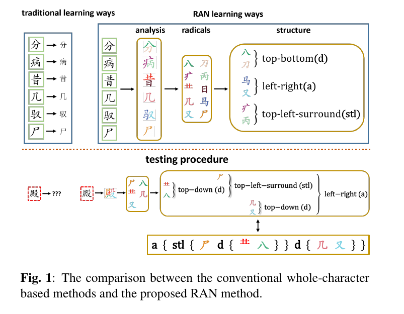
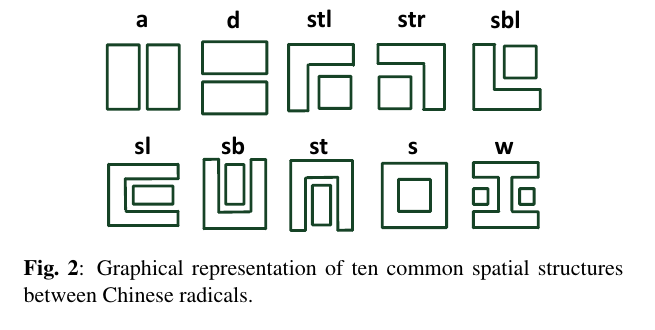
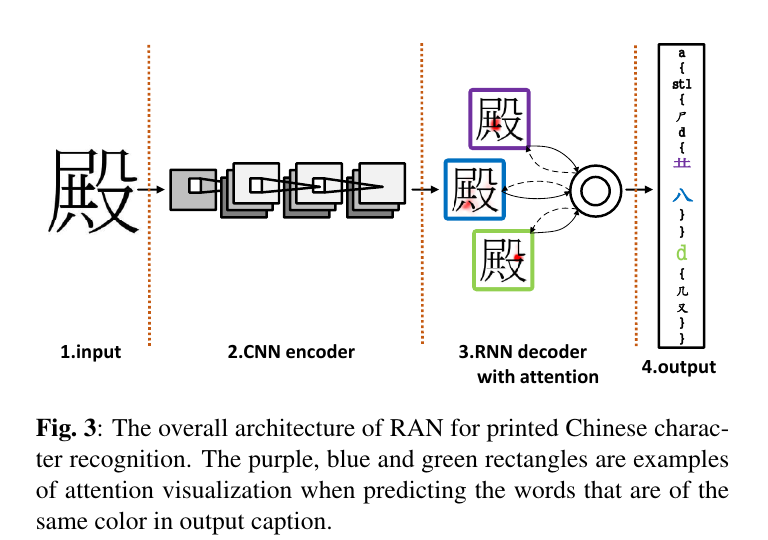
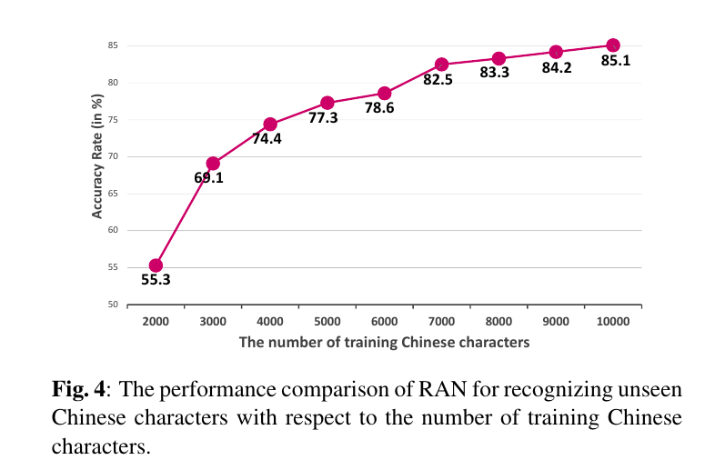
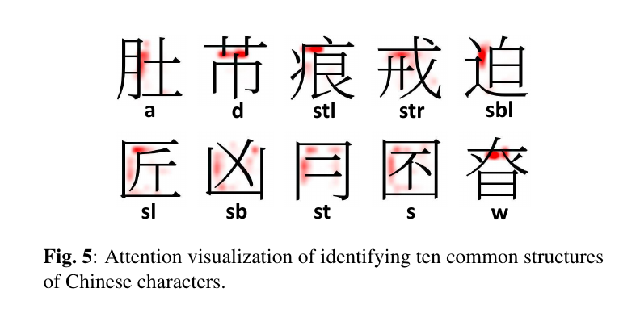
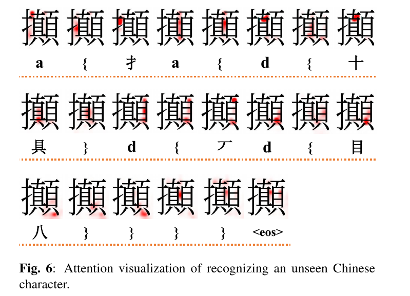
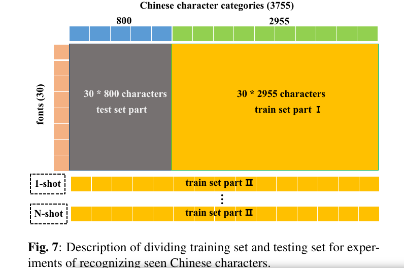
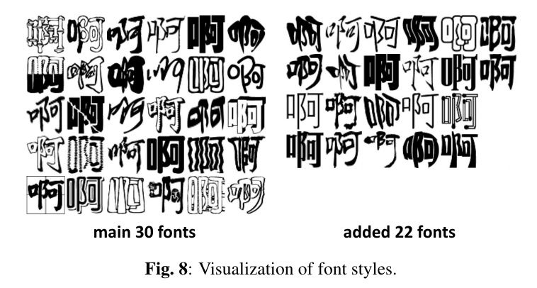
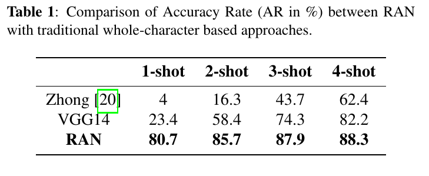
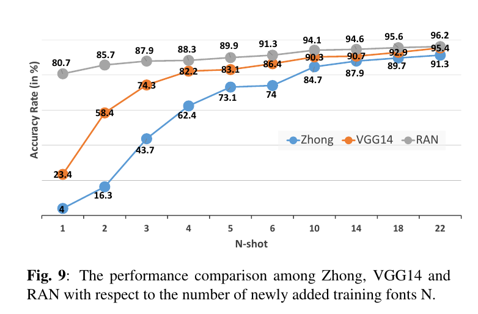

Radical Analysis Network for Zero-shot Learning in Printed Chinese Character Recognition
=

# Abstract
汉字有巨大的字符类别集合，超过20,000，随着越来越多的新奇字符的继续创作，这个数字仍在增加。然而，巨大的字符可以分解成约500个基本和结构部首的紧凑集合。本文引入一种新颖的部首分析网络（radical analysis network： RAN），其通过识别部首，并分析它们的二维空间结构来识别印刷中文字符。所提出的RAN首先采用卷积神经网络（作为编码器）提取输入的视觉特征。然后采用基于循环神经网络的解码器，旨在通过空间注意机制检测部首基和二维结构来生成汉字描述描述（caption）。将汉字作为一个部首的组合而不是单个字符类来处理的方式在很大程度上减少了词汇的大小，使RAN能够具备识别看不见的汉字类的能力，即Zero-Shot Learning。

# 1. Introduction
由于大量已有的字符类（超过20000）、正增加的新字符（例如成龙创造的“Duang”）和复杂的内部结构，中文字符识别成为一个错综复杂的问题。然而，主要的传统方法[1]仅能识别大约4000个常用字符，而没有能力处理未见过或者新创造的字符。并且，将每个字符样本视为一个整体，而没有考虑相似性和不同字符之间的内部结构。

众所周知，所有汉字都由基本的结构成分组成，称为部首。仅大约500个部首便可以描述超过20000个汉字。因此，将汉字分解城部首，并描述它们的空间结构为caption以进行识别是一种直观的方式。本文中，我们提出一种新颖的Radical Analysis Network（RAN）来生成汉字识别的caption。与传统的方法相比，RAN有两个不同的属性：1）相比字符词汇表，部首词汇表的大小极大减小；2）它是一种新颖的汉字 zero-shot learning，其可以识别在识别阶段未见过得汉字，因为训练阶段中，相应的部首和空间结构可以从其他已见的单词中学习。图1展示了传统方法和RAN在汉字识别方面的比较。传统方法中，分类器将字符输入作为单个图像，并尝试学习输入图像和预定义类之间的映射。如果测试字符类是训练样本中未出现的，如图1中的红色虚线矩形，他将被误分。而RAN尝试模拟识别汉字的行为为汉字学习者。例如，在要求小孩记忆和识别汉字之前，汉语老师首先教导它们认识部首、理解部首的含义以及掌握它们之间的空间结构。这种学习方式更具生成性，有助于提高学生学习汉字的记忆能力，这在RAN中得到了很好的体现。如图1右上部分的例子，六个训练样本包含十个不同的部首，并出现在上下、左右、左上环绕的空间结构。当在测试中遭遇未见的字符时，RAN仍能生成字符的相应caption（即图1的有效矩形），因为它已经学习关键的部首和结构。技术上，大量的汉字以及新创造的字符可以通过紧凑的部首集和训练中学习到的空间结构来识别。

在过去的几十年，作出了许多基于部首的汉字识别努力。[3]将字符过度分割成候选字根，只能处理左右结构。[4]首先检测单独的部首，然后采用级联的部首匹配方法来识别汉字。最近，[5]也尝试使用多标签学习的深度残差网络来检测位置依赖的部首。通常，这些方法在处理部首之间复杂的2D结构时，是有难度的，并且没有关注未见过的字符类的识别。

关于网络架构，所提出的RAN是[6]中基于注意力的编码器-解码器模型的改进版本。我们采用卷积神经网络作为编码器来从输入汉字中提取高级视觉特征。解码器是具有门限循环单元的循环神经网络（GRU），其将高级视觉特征转换为输出字符caption。我们采用在解码器中内置的基于覆盖的空间注意模型来同时检测部首和内部二维结构。 基于GRU的解码器也像潜在的语言模型一样执行，旨在在成功检测到部首和结构之后掌握组成汉字标题的规则。这项研究的主要贡献总结如下：
- 我们提出汉字识别的zero-shot learning，解决处理未见过或者新创造字符的问题。
- 我们描述了如何根据对汉字部首和结构的详细分析来对汉字进行标题化。
- 我们通过实验证明RAN如何识别已见/未见的汉字并通过注意力可视化显示其效率。

# 2. Radical Analysis

相比大量的汉字类，部首类别的数量非常有限。由中国国家语言委员会出版的GB13000.1标准[2]声明，20902个汉字由560个不同的部首组成。按照cjk-decomp中的策略，我们将汉字分解为相应的caption。关于部首之间的空间结构，我们在图2中展示了10中常用的结构，其中“a”代表左右结构，“d”代表上下结构，“stl”代表左上环绕（top-left-surround）结构，“str”代表右上环绕结构，“sbl”代表左下环绕结构，“sl”代表左环绕结构，“sb”代表上环绕结构，“s”代表环绕结构，“w”代表within结构。

我们使用一对大括号来约束字符标题中的单个结构。以“stl”为例，它描述为“stl{radical-1 radical-2}”。通常，如上面提到的常用实例，结构可以由两个不同的部首描述。然而，对于一些独特的结构，它们由三个或更多个部首描述。

# 3. Network Architecture of RAN
基于注意力的编码器-解码器模型首先学习将输入编码为高级表示。然后，通过高级表示的加权和生成固定长度的上下文向量。注意力作为加权系数执行，以便它可以从整个输入中选择最相关的部分来计算上下文向量。最后，编码器使用这个上下文向量来生成一个单词一个单词的可变长度的输出序列。这种框架可以扩展到许多应用，包括机器翻译、图像描述、视频处理和手写识别。

## 3.1 CNN encoder

本文中，我们在打印汉字上评估RAN。输入为灰度图，像素值规范到0和1之间。RAN的整体结构如图3所示。我们采用CNN作为编码器，其已被证明是提取图像高级视觉特征强力模型。我们采用的CNN框架仅包含卷积、池化和激活层，而没有全连接层，称为全卷积神经网络。它确实有意义，因为随后的解码器可以通过从所有提取的视觉特征中选择特定部分来选择性地关注图像的某些像素。

假设CNN编码器提取的高级视觉表示由一个大小为 $H \times W \times D$ 的三维数组表示，然后CNN的输出为 $L = H \times W$ 个元素的可变长度的网格。这些元素的每一个都是与图像局部区域相对应的D维标注。

$$A = \{a_1, \cdots, a_L\}, a_i \in \Bbb{R}^D \tag 1$$

## 3.2. Decoder with spatial attention
### 3.2.1 Decoder
如图3所示，解码器旨在生成输入汉字的描述。输出caption $Y$ 由one-hot的编码单词表示：

$$Y = \{y_1, \cdots, y_C\}, y_i \in \Bbb{R}^K  \tag 2$$

其中 $K$ 为词汇表（包含基本部首、空间结构和brace对）中的单词总数， $C$ 为描述的长度。

注意，标注序列的长度 （$L$）是固定的，而caption的长度（$C$）是可变的。为了处理固定长度标注序列与可变长度输出序列相关联的问题，我们尝试计算一个中间的固定大小的向量 $c_t$ ，其将在3.2.2节描述。给定上下文向量 $c_t$ ，我们利用无向的GRU来产生逐单词的caption。GRU是简单RNN的改进版本，其可以避免梯度消失和爆炸的问题。每个预测单词的概率由上下文向量 $c_t$ 计算循环GRU的隐藏状态 $s_t$ 和前一个目标单词 $y_{t-1}$ 使用如下方程：

$$P(y_t|y_{t-1}, X) = g(W_oh(Ey_{t-1} + W_ss_t + W_cc_t)) \tag 3$$

其中 $g$ 表示词汇表重工所有单词的softmax激活函数，$h$表示maxout激活函数，$W_o \in \Bbb{R}^{K \times \frac{m}{2}}$、$W_s \in \Bbb{R}^{m \times n}$、 $W_c \in \Bbb{R}^{m \times D}$ ，而 $E$ 表示嵌入矩阵，$m$ 和 $n$ 为嵌入和GRU解码器的维度。

解码器采用两个无向的GRU层来计算隐藏状态 $s_t$：
$$
\begin{alignat}{2}
\hat{s}_t &= GRU(y_{t-1}, s_{t-1})  \tag 4 \\
c_t &= f_{catt}(\hat{s}_t, A)  \tag 5 \\
s_t &= GRU(c_t, \hat{s}_t)  \tag 6
\end{alignat}
$$
其中$s_{t-1}$表示前一个隐藏状态，$\hat{s}_t$为循环GRU隐藏状态的预测，$f_{catt}$表示基于覆盖的空间注意力模型（3.2.2节）。

### 3.2.2. Coverage based spatial attention
直觉上，对于每个部首或结构，整个输入字符不是提供有用信息所必需的，只有输入字符的一部分应该主要有助于在每个时间步 $t$ 处计算上下文向量 $c_t$ 。因此，解码器采用空间注意力来获知哪个输入部分适合关注以生成下一个预测部首或结构，然后给相应的局部标注向量 $a_i$分配更高的权重（见图3红色区域）。然而，经典的空间注意力存在一个问题，即缺乏覆盖（coverage）。覆盖表示综合对齐信息，其指示输入的局部是否已被关注。在识别汉字时，综合对齐信息尤为重要，因为原则上，每个部首或结构应当仅编码一次。缺乏覆盖将导致错位，产生过度解析或欠解析（over-parsing/under-parsing）问题。过解析意味着一些部首和结构被解码超过两次或更多，而欠解析表示一些部首和结构从未被解码。为了处理这个问题，我们附加一个覆盖向量来完成注意力的计算。覆盖向量旨在跟踪过去的对齐信息。这里，我们将基于覆盖的注意力参数化为多层感知机（MLP），其与编码器和解码器联合训练：
$$
\begin{alignat}{2}
F &= Q * \sum_{l=1}^{t-1} \alpha_l  \tag 7 \\
e_{ti} &= \nu_{att}^T \tanh(W{att}\hat{s}_t + U_{att}a_i + U_ff_i)  \tag 8 \\
\alpha_{ti} &= \frac{\exp(e_{ti})}{\sum_{k=1}^L\exp(e_{tk})} \tag 9
\end{alignat}
$$
其中 $e_{ti}$ 表示在当前GRU隐藏状态预测 $\hat{s}_t$ 和覆盖向量 $f_i$ 的条件下在时间步长 $t$ 处的注释向量 $a_i$ 的能量。覆盖向量初始化为零向量，我们基于所有过去的注意力概率之和计算它。$\alpha_{ti}$ 表示时间步 $t$ 时的 $a_i$ 的空间注意力系数。令 $n'$ 表示注意力的维度， $M$ 表示滤波器 $Q$ 的特征图的数量；然后，$\nu_{att} \in \Bbb{R}^{n' \times n}$ 、 $U_{att} \in \Bbb{R}^{n' \times D}$ 和 $U_f \in \Bbb{R}^{n' \times M}$ 。利用权重 $\alpha_{ti}$ ，我们计算上下文向量 $c_t$ 为：
$$
c_t = \sum_{i=1}^L \alpha_{ti}a_i \tag 10
$$
无论输入图像大小如何，它都具有固定长度。

# 4. Experiments
RAN的训练目标是最大化预测公式3中的单词概率，而我们使用交叉熵CE作为损失函数。CNN编码器采用VGG架构。根据训练集的不同大小，我们提出使用两种不同的VGG架构，即VGG14-s和VGG14。“VGG14”意味着两种架构都包含14个卷积层，并将其分为4块。每个块堆叠的卷积层数为 $(3, 3, 4, 4)$ ，而最大池化函数在每个块之后。在VGG14-s中，输出通道的数量分别为 $(32,64,128,256)$。而在VGG14中，输出通道的数量为 $(64,128,256,512)$。注意，相同块中每个卷积层的输出通道数仍然保持不变。我们使用VGG14-s进行识别未见过字符的实验，因为训练集的大小相对较小，后缀“s”表示“较小”。 而VGG14用于识别具有各种字体样式的已见字符的实验。解码器是具有256个前馈GRU单元的单一层。嵌入的维度 $m$ 和GRU解码器的维度 $n$ 设置为256。注意力维度 $n'$ 设置为标注维度 $D$ 。计算覆盖向量的卷积大小设置为 $(5 \times 5)$，特征图$M$的数量设置为 256 。我们利用具有梯度剪裁的adadelta算法进行优化。

在解码阶段，我们旨在生成给定输入字符的最可能的caption字符串。采用beam搜索算法来完成解码过程，因为我们在测试过程中没前面预测的ground-truth。beam的大小设置为10 。

## 4.1 Experiments on recognition of unseen characters
本节中，我们通过准确率和注意力可视化来证明RAN在识别未见过汉字上的有效性。仅当测试字符的预测caption准确匹配ground-truth时，它才被视为成功识别。

在这项实验中年，我们选择26079个宋体汉字，其仅由361个部首和29个空间结构组成。我们将它们分为训练集、验证集和测试集。我们将训练集从2000增加到10000，以此来研究多数训练字符才足以训练模型识别未见过的16079的字符。罪域未见过的16079个汉字，我们选择2000个作为验证集，14079个作为测试集。我们也在测试过程中采用集成方法，因为训练量小，表现差异很大。我们在图4中展示了性能，其中2000个训练字符可以成功识别未见过的14079个汉字中的55.3%，10000个训练汉字可以识别85.1% 。实际上，大约500个汉字就足以覆盖全部汉字部首和空间结构。然而，我们的实验从2000个训练字符开始，因为当训练集太小时，RAN难以收敛。

为了生成汉字caption，识别孤立部首之间的结构至关重要。如图5所示，我们通过注意力可视化来展示，在10个样本上，RAN是如何识别常见结构的。注意力图中的红色表示空间注意力概率，其中更浅的颜色描述更高的注意力概率，更深的颜色描述更低的注意力概率。以“a”结构为例，解码器主要关注两个部首之间的空白区域，表明左右方向。

更具体地，在图6中，我们展示RAN是如何一步一步地从图像中学习识别未见过得汉字为字符caption。当遇到基本的部首时，注意力模型很好地产生与人类直觉强烈对应的对齐。同时，当它检测到左右方向和上下方向时，它成功地生成结构“a”和“d”。在检测到空间结构之后，解码器立即生成一对括号“{}”，用于约束汉字标题（caption）中的结构。

## 4.3 Experiments on recognition of seen characters

本节中，我们通过与传统完整字符建模方法比较来证明RAN在识别已见过的汉字的有效性。训练集包含3755个常用汉字类别，测试集包含800个字符类别。组织训练集和测试集的详细实现如图7所示。我们设计这个实验就像汉字识别的几次学习一样。我们将3755个字符划分为2955个字符和其他800个字符。30种不同字体的800个字符组成测试集，其他相同的30种字体的2955的字符组成训练集的一部分。此外，我们使用其他字体的3755个字符作为训练集的第二部分。当我们添加其他 $N$ 种字体的3755个字符作为训练集时，我们称之为 N-shot 。训练集第二部分的字体数量从1增加到22 。主要的30种字体和新加入的22种字体见图8 。

系统“Zhong”是[20]中提出的系统。同时，我们替换“Zhong”中CNN架构为VGG14，并保持其他部分不变，我们称职位系统“VGG14”。表1清楚地表明，当这些字符类的训练样本很少时，RAN明显优于传统的基于全字符的汉字方法。图9示出了当所看到的类的训练样本的数量增加并且RAN仍然始终优于基于整个字符的方法时的比较。

