TextBoxes++: A Single-Shot Oriented Scene Text Detector
=

# I. Introduction
TextBoxes++将卷积对象检测其中的矩形边界框表示改为四边形或者有方向的矩形表示。为了能够获得更好的覆盖通常较长的文本区域的感受野，设计“long”卷积核预测边界框。TextBoxes++在多个卷积层通过联合预测文本存在性和相对锚框的坐标偏移以直接输出单词边界框。最终的输出是所有边界框的非极大值抑制。网络的单个前向传递密集地检测整个图像上的多尺度文本框。因此，检测器在速度方面有极大优势。我们将通过实验证明TextBoxes++使用单一尺度的单个前向传递获得高准确率和高速度，并且当执行多尺度输入的多个传递时获得更高的准确率。

我们进一步将TextBoxes++和CRNN结合，识别器不仅产生额外的识别输出，还使用其语义级感知泛化文本检测，因此进一步提升单词识别的准确率。本文相对于TextBoxes的改进有：1）扩展TextBoxes（水平检测器）到可以处理任意方向的文本； 2）回顾和改善网络结构和训练过程，这导致进一步的性能提升； 3）进行更多对比性实验以进一步强调TextBoxes++检测自然图像中任意方向文本的有效性； 4）通过提出一种优雅地利用检测和识别信息的新颖得分来改进检测和识别的组合。

本文主要的贡献有三个方面： 1）提出任意方向的文本检测器TextBoxes++是准确、快速和端到端可训练的。 2）本文提供了某些重要设计选择和其他问题上的对比性研究，包括边界框表示、模型配置和不同评估方法的有效性。这些研究的结论可以推广到其他文本理解算法，并提供一些重要问题的见解。3）由于识别文本的语义级感知，还引入使用识别结果以进一步精炼检测结果的思想。

# II. Related Works
## A. Object detection

## B. Text detection
场景文本理解系统通常有两个主要部分组成： 文本检测和文本识别。前一部分以单词边界框的形式定位图像中的文本。后者将裁剪后的单词图像转录成机器可解释的字符序列。本文覆盖这两方面，但是更关注检测。通常，大多数文本检测器基于原始检测目标和目标边界框的形状可以大致分成几种类别。

a）基于原始检测目标的分类策略： 大多数文本检测方法可以大致分成三类：
- 1）Character-based： 单个字符或者文本的部分首先被检测，然后组合成单词（[7]《Real-time scene text localization and recognition》）。[7]提出一种代表性的例子，其通过Extremal Region（极值区域）定位文本，然后通过全面搜索方法将检测到的字符组合成单词。
- 2）Word-based： 与通用对象检测器相似的方式提取单词。如R-CNN、YOLO等。
- 3）Text-line-based： 检测文本线，然后分割成单词。

b）基于目标边界框形状的分类策略：
- 1）水平或者几乎水平：这些方法关注检测图像中的水平或者几乎水平的文本。《Detecting and reading text in natural scenes》提出基于AdaBoost的算法。然后《Localizing text in scene images by boundary clustering, stroke segmentation, and string fragment classification》提出一个3阶段的框架，其由边界聚类、笔划分割和字符串碎片分类组成。还有一些基于对象检测的方法 。。。
- 2）Multi-oriented： 相比与1）中的方法，多方向文本检测更具鲁棒性，因为场景文本在图像中是任意方向的。《Detecting texts of arbitrary orientations in natural images》提出两组旋转不变特征用于检测多方向文本。第一组是组件级（component level）特征，例如特征计算之前的估计中心、尺度、方向。第二组是链级特征，例如尺寸变化、颜色自相似（self-similarity）和结构自相似。《Orientation robust text line detection in natural images》构建一个MSER图，接着用一个更高阶的相关聚类来生成多方向候选。《A unified framework for multi-oriented text detection and recognition》提出用于多方向文本检测和识别统一框架，其使用相同的特征进行文本检测和识别。最后，基于纹理的纹理分类器用于区分文本和非文本候选。。。。。

# III. Detecting Oriented Text with TextBoxes++
## A. Overview

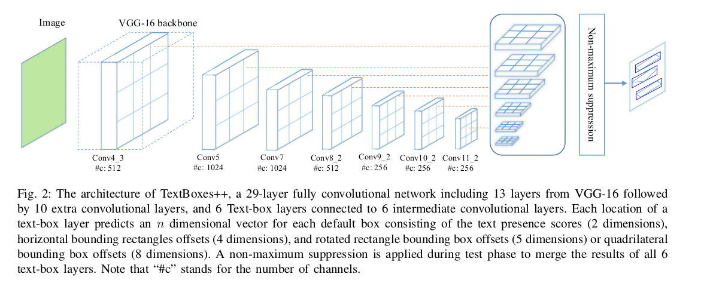

TextBoxes++依靠一个端到端训练的全卷积神经网络检测任意方向的文本。基本思想受SSD启发。提出使用四边形或者方向矩形表示多方向文本。然后，调整网络以预测从专门为定向文本设计的默认框到由四边形或定向矩形表示的定向文本的回归。为了更好地覆盖某些区域中可能密集的文本，我们提出使用垂直偏移来密集默认框。此外，调整卷积核以更好地处理文本线，它们与通用对象检测相比通常是长对象。

## B. Proposed network
_1）网络架构：_ TextBoxes++的架构如图2 。它继承自流行的VGG-16架构，保留其从conv1_1到conv5_3层，并将VGG16的最后两个全连接层转换为有匣采用因子的卷积层（conv6和conv7）。另外8个卷积层划分为具有通过max-pooling获得不同分辨率的4个阶段（conv8到conv11）。多个输出层（称为text-box层）插入到最后和某些中间卷积层。也使用卷积层预测聚合的输出，然后进行有效的非最大抑制（NMS）过程。相比TextBoxes，TextBoxes++将最后的全局池化层调整为卷积层，这进一步让多尺度训练和测试收益。
_2）具有垂直偏移的默认框：_ text-box层是TextBoxes++的关键部分。text-box层根据其输入特征图预测文本存在和边界框。TextBoxes++的输出边界框包括定向边界框 $\{q\}$ 或 $\{r\}$ ，和包含相应定向边界框的最小水平边界矩形 $\{b\}$ 。这是通过预测每个位置的多个预先设计的水平默认框的偏移的回归来实现的（例如，参见图3）。更加精确地，令 $b_0 = (x_0, y_0, w_0, h_0)$ 表示水平默认框，其也可以写为 $q_0 = (x_{01}^q, y_{01}^q, x_{02}^q, y_{02}^q, x_{03}^q, y_{03}^q, x_{04}^q, y_{04}^q)$ 或者 $r_0 = (x_{01}^r, y_{01}^r, x_{02}^r, y_{02}^r, h_0^r)$ ，其中 $(x_0, y_0)$ 是默认框的中心点， $w_0$ 和 $h_0$ 分别是默认框的宽和高。 $q_0, r_0$ 和 $b_0$ 之间的关系如下：
$$
\begin{align}
x_{01}^q = x_0 - w_0 / 2, x_{01}^q = y_0 - h_0 / 2,  \\
x_{02}^q = x_0 + w_0 / 2, x_{02}^q = y_0 - h_0 / 2,  \\
x_{03}^q = x_0 + w_0 / 2, x_{03}^q = y_0 + h_0 / 2,  \\
x_{04}^q = x_0 - w_0 / 2, x_{04}^q = y_0 + h_0 / 2,  \\
x_{01}^r = x_0 - w_0 / 2, x_{01}^r = y_0 - h_0 / 2,  \\
x_{02}^r = x_0 + w_0 / 2, x_{02}^r = y_0 - h_0 / 2,  \\
h_0^r = h_0
\end{align}  \tag 1
$$

每个特征图位置，以就卷积的方式输出分类得分和每个关联默认框（表为 $q_0$ 或 $r_0$）的偏移。对于定向文本的四边形表示，text-box层预测 $(\Delta x, \Delta y, \Delta w, \Delta h, \Delta x_1, \Delta y_1,  \Delta x_2, \Delta y_2,  \Delta x_3, \Delta y_3, \Delta x_4, \Delta y_4, c)$ ，指明具有置信度的水平矩阵 $b = (x, y, w, j)$ 和四边形矩阵 $q = (x_1^q, y_1^q, x_2^q, y_2^q, x_3^q, y_3^q, x_4^q, y_4^q)$ ：
$$
\begin{align}
x = x_0 + w_0 \Delta x,  \\
y = y_0 + h_0 \Delta y,  \\
w = w_0 \exp(\Delta w),  \\
h = h_0 \exp(\Delta h),  \\
x_n^q = x_{0n}^q + w_0 \Delta x_n^q, n = 1, 2, 3, 4  \\
y_n^q = y_{0n}^q + h_0 \Delta y_n^q, n = 1, 2, 3, 4  \\
\end{align}  \tag 2
$$
当使用旋转矩形表示时，text-box层预测 $(\Delta x, \Delta y, \Delta w, \Delta h, \Delta x_1, \Delta y_1,  \Delta x_2, \Delta y_2, \Delta h^r, c)$ ，以及旋转矩阵 $r = (x_1^r, y_1^r, x_2^r, y_2^r, h^r)$ 计算如下：
$$
\begin{align}
x_n^r = x_{0n}^r + w_0 \Delta x_n^r, n = 1, 2  \\
y_n^r = y_{0n}^r + h_0 \Delta y_n^r, n = 1, 2  \\
h^r = h_0^r \exp(\Delta h_r)
\end{align}  \tag 3
$$
在训练期间，ground-truth单词框根据边界框重叠匹配默认框，这遵循SSD匹配方案。如图3，为了效率，使用旋转矩阵或四边形的最小水平边界矩形匹配默认框。注意，在每个位置有许多不同纵横比的默认框。使用这种方法，我们有效地通过它们的纵横比划分单词，允许TextBoxes++学习处理相似纵横比单词的特定回归和分类权重。因此，默认框的设计是高度特定于任务的。

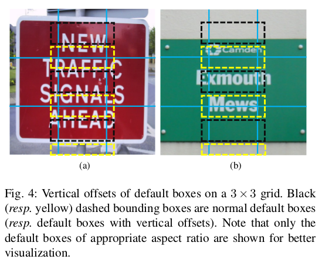

不同于一般的对象，单词往往具有较大的纵横比。TextBoxes中设计具有大纵横比的“long”默认框。具体地，对于水平文本数据集，包括1、 2、 3、 5、 7 和 10 。然而，TextBoxes++旨在检测任意方向的文本，因此，设置默认框的纵横比为1、 2、 3、 5、 1/2、 1/3、 1/5 。进一步，文本通常在某个区域是密集的，所以每个默认框设置了垂直偏移以覆盖所有的文本，这使默认框在垂直方向是密集的。图4给出一个例子：图4（a）中，中间正常默认框（黑色虚线）同时可以处理靠近它的两个单词。在这个案例中，如果没有使用水平偏移，某个单词可能缺失。图4（b）中，默认框根本没有覆盖底部单词，这也说明了使用具有垂直偏移的默认框的必要性。

_3）卷积层：_ TextBoxes中使用 $1\times5$ 卷积滤波器处理长单词或文本线。而本文中，使用 $3 \times 5$ 卷积滤波器以处理定向文本。这些Inception风格的滤波器使用矩形感受野，这更好地匹配更大纵横比的单词。正方形感受野带来的噪声信号可以避免。

## C. Adapted training for arbitrary-oriented text detection
_Ground Truth representation:_ 对于III-B节中描述的两种目标边界框表示，采用如下的ground-truth的定向文本表征：
- a）Quadrilateral： 对于每个ground-truth定向文本 $T$ ，令 $G_b = (\tilde{x}_0^b, \tilde{y}_0^b, \tilde{w}_0^b, \tilde{h}_0^b)$ 为其水平矩形ground-truth（即包围 $T$ 的最小水平矩形），其中 $(\tilde{x}_0^b, \tilde{y}_0^b)$ 是 $G_b$ 的中心， $\tilde{w}_0^b$ 和 $\tilde{h}_0^b$ 分别为 $G_b$ 的宽和高。根据公式（1），这个矩形ground-truth也可以表示为 $G_b = (b_1, b_2, b_3, b_4)$ ，其中 (b_1, b_2, b_3, b_4) 是 $G_b$ 顺时针顺序的4个定点， $b_1$ 是左上角点。使用定向文本ground=truth $T$ 的四个顶点来表示由 $G_q = (q_1, q_2, q_3, q_4) = (\tilde{x}_1^q, \tilde{y}_1^q, \tilde{x}_2^q, \tilde{y}_2^q, \tilde{x}_3^q, \tilde{y}_3^q, \tilde{x}_4^q, \tilde{y}_4^q)$ 表示的一般四边形的 $T$ 。四个顶点 $(q_1, q_2, q_3, q_4)$ 也以顺时针顺序组织，使得四个点对中 $(b_i, q_i), i = 1, 2, 3, 4$ 中两两之间的欧式距离最小。更准确地，令 $(q_1', q_2', q_3', q_4')$ 以顺时针顺序表示同一个四边形 $G_q$ ，其中 $q_1'$ 是顶部的点（ $G_q$ 为矩形中的左上点）。然后 $q$ 和 $q'$ 之间的关系为：
$$
\begin{align}
d_{i, \Delta} = d_E(b_i, q_{(i+\Delta-1)\%4 + 1}'), \Delta = 0, 1, 2, 3  \\
\Delta_m=\arg \max_\Delta (d_{1,\Delta} + d_{2,\Delta} + d_{3,\Delta} + d_{4,\Delta})  \\
q_i = q_{(i + \Delta_m -1)\%4+1}'
\end{align}  \tag 4
$$
其中 $d_E(b, q')$ 是两点之间的欧式距离， $\Delta_m$ 是点的偏移，其给出 $G_b$ 和 $G_q$ 之间的四对对应点的距离的最小和。

- b) Rotated rectangle: 旋转矩形可以表示为一个水平矩形和一个旋转角度 $(x, y, w, h, \theta)$ 。然而，由于数据的偏差， $\theta$ 上通常存在不均匀分布，这可能使模型产生数据集依赖。为了缓解这个问题，提出使用 $G_r = (\tilde{x}_1^r, \tilde{y}_1^r, \tilde{x}_2^r, \tilde{y}_2^r, \tilde{h}^r)$ 表示ground-truth旋转矩形 $G_r$ ，其中 $(\tilde{x}_1^r, \tilde{y}_1^r)$ 和 $(\tilde{x}_2^r, \tilde{y}_2^r)$ 是ground-truth第1和第2的顶点（即 $G_q$ 的第1和第2的顶点）， $\tilde{h}^r$ 是旋转矩阵的高。

_2）Loss function:_  采用SSD相似的损失函数。具体地，令 $x$ 为匹配的指示矩阵。对于第 $i$ 个默认框和第 $j$ 个ground-truth， $x_{ij}$ 意味着根据它们之间的边界框重叠匹配，反之 $x_{ij} =0 $ 。令 $c$ 为置信度， $l$ 为预测位置，$g$ 为ground-truth位置。损失函数定义为：
$$L(x, c, l, g) = \frac{1}{N}(L_{conf}(x, c) + \alpha L_{loc}(x, l, g))  \tag 5$$
其中 $N$ 是匹配上ground-truth边界框的默认框数量， $\alpha$ 设置为0.2 以快速收敛。对于定位采用smooth L1损失，置信度采用两个类别的softmax损失。

_3）Online hard negative mining：_ 某些纹理和信号与文本非常相似，这使得网络难以区分。使用SSD的hard negative mining策略抑制它们。具体地，对相应数据集的训练分为两个阶段。对于第一阶段，负样本和正样本之间的比例设置为 $3:1$ ，然后第2阶段设置为 $6:1$ 。

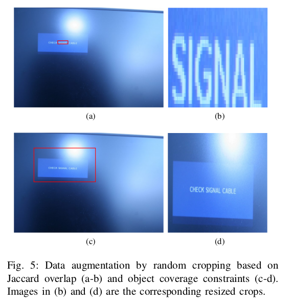

_4）Data Augmentation：_ SSD使用基于裁剪和ground-truth之间最小Jaccard重叠进行随机裁剪增强。然而，这种策略不适合文本，其通常很小。这是Jaccard重叠很难满足小对象，如图5（a-b）中的例子，对于小对象，尽管Jaccard重叠满足，但是数据增强后重新调整的图像中的对象异常大，其几乎覆盖整幅图像。这在自然图像是不常见的案例。为了解决这个问题，除了Jaccard重叠之外，我们还建议添加一个称为对象覆盖（object coverage）的新重叠约束。对于剪裁的边界框 $B$ 和ground-truth边界框 $G$ ，Jaccard重叠 $J$ 和对象覆盖 $C$ 定义如下：
$$
\begin{align}
J = \mid B \cap G \mid / \mid B \cup G \mid  \\
C = \mid B \cap G \mid / \mid G \mid
\end{align}  \tag 6
$$
其中 $\mid \cdot \mid$ 表示基（cardinality）（即area）。基于对象覆盖 $C$ 的随机剪裁策略更加适合小对象，例如自然图像中的大多数文本，如图5（c-d）的例子。本文中，使用最小重叠和覆盖阈值都设置为0、 0.1、 0.3、 0.5、 0.7 和 0.9 的随机剪裁策略。注意，阈值设置为0意味着既不使用最小Jaccard重叠，也不使用对象覆盖限制。然后，每个剪裁的区域被调整到固定大小。

_5）Multi-scale training：_ 为了训练速度，将随机裁剪的区域调整为相对小尺寸的图像。然而，TextBoxes++的输入图像可以是任意尺寸的，为了更好的处理多尺度文本，在训练阶段的最后几千次迭代中使用更大尺度的输入尺寸。

## D. Testing with efficient cascaded non-maximum suppression
首先，将6个多尺度预测结果调整到输入图像的原始尺寸，并将这些调整后的结果融合成一个密集的置信度图。然后，在融合的特征图上使用NMS操作。由于在四边形和旋转矩形上使用NMS比水平矩形更加耗时，因此将NMS操作划分成两个步骤以加速。第一，在包含预测的四边形或旋转矩形的最小水平矩形上应用具有相对高的IOU阈值（例如0.5）的NMS，在水平矩形上的操作耗时更少，并能移除许多候选边界框；第二，在四边形或旋转矩形上将耗时的NMS应用到少量剩下的候选边界框，使用一个更低的IoU阈值（例如0.2）。在第二阶段NMS操作后剩下的边界框被视为最终检测到的文本边界框。级联的非极大值抑制比直接将NMS应用到四边形或旋转矩形更快。

## E. Word spotting, end-to-end recognition, and detection refining
直觉上，文本识别器有助于消除一些false-positive检测结果，它们可能是有意义的单词（如重复模式）。特别地，当词典存在时，文本识别器可以有效地消除不匹配任何给定单词的检测到的边界框。遵循这种直观思想，我们提出使用单词识别和端到端识别改善TextBoxes++的检测结果。
_1) Word spotting and end-to-end recognition:_ 单词识别是定位给定字典的特定单词。端到端识别关心检测和识别。两个任务都可以通过将TextBoxes++和文本识别器连接获得。采用CRNN作为文本识别器，CRNN使用CTC作为其输出层，其基于输入图像 $I$ 估计一个序列概率，表示为 $p(w|I)$ ，其中 $w$ 表示一个字符序列输出。如果没有给定词典， $w$ 被视为识别的单词，并且概率 $p(w|I)$ 衡量图像到特定单词的概率。CRNN也支持使用词典，对于给定词典 $\cal{W}$ ，CRNN输出的概率衡量输入图像 $I$ 是如何匹配每个单词 $w \in \cal{W}$ 。定义识别得分 $s_r$ 如下：
$$
s_r =
\begin{cases}
p(w|I), & \mbox{Without lexicon}  \\
\max_{w\in\cal{W}} p(w|I), & \mbox{With lexicon }\cal{W}
\end{cases}  \tag 7
$$
注意，在所提出的方法中，词典的使用不是必须的。我们仅使用词典以公平的比较其他方法。

_2）Refining detection with recognition：_ 我们提出通过将识别得分 $s_r$ 集成到原始的检测得分 $s_{d}$ 以精炼检测。实际上，识别得分值通常不能与检测得分值相比。例如，检测得分 $s_d$ 的阈值通常设置为0.6，而识别得分 $s_r$ 的阈值通常设置为0.005 。这两个分数的一般组合将导致检测分数的严重偏差。本文中，我们提出定义如下的新颖得分 $S$ ：
$$S = \frac{2 \times e^{(s_d + s_r)}}{e^{s_d} + e^{s_r}}  \tag 8$$
公式（8）存在两种启发，首先，我们使用指数函数使得两个得分值可比较。然后，使用一个调和平均以获得最终的组合得分。这个组合得分 $S$ 比使用网络搜索更方便。

# IV. Experiments
继承自对象检测，所有的场景文本检测基准依靠IoU阈值评估文本检测器的性能。然而，文本检测与对象检测略微不同，检测文本的终极目标是识别文本。在形同IoU值的情况下，文本检测可能产生完全不同的结果。例如，图6（a-c）的三个检测结果具有相同的IoU，但是，由于缺少部分文本，图6（a）和（b）检测结果无法正确识潜在文本。由于全部覆盖文本，图6（c）的检测结果倾向于给出准确的识别结果。因此，处理经典的文本检测基准外，我们还使用文本检测结果执行单词识别和端到端识别实验以进一步评估TextBoxes++的性能。

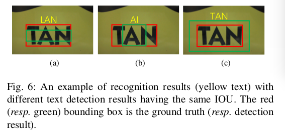

## A. Datasets & evaluation protocol
文本检测、单词识别和端到端识别的经典评估协议全部依赖 _precision(P), recall(R), f-measure(F)_ 。它们给定如下：
$$
P = \frac{TP}{TP + FP}  \\
R = \frac{TP}{TP + FN}  \\
F = 2 \times \frac{P \times R}{P + R}  \tag 9
$$
其中 TP、 FP和FN分别是击中的边界框数、错误识别的边界框数和错过的边界框数。对于检测，如果检测边界框 $b$ 与ground-truth框之间的IoU值大于给定阈值（通常设为0.5），那 $b$ 被视为击中边界框（hit box）。单词识别和端到端识别中的击中边界框不仅需要相同的IoU限制，还需要准确的识别结果。由于准确率和召回率之间存在平衡， $f-measure$ 是性能评估中使用最多的衡量标准。

## B. Implementation details
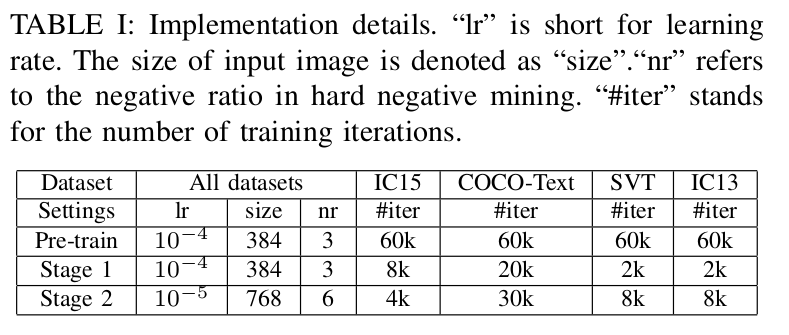

**TextBoxes++** 使用Adam训练。整个训练过程包含如表1的三个阶段。首先，对于所有测试数据集，在SynthTextboxes预训练TextBoxes++。然后，在每个数据集相应的训练图像上继续训练。最后，使用一个更小的学习率和更大的负样本比例继续这个训练。注意，最后一个训练阶段，使用更大的输入图像尺寸以获得更好的多尺度文本检测。详细的超参数设置如表1 。

**Text recognition** 使用预训练CRNN模型预训练。

所有实验在一个Titan XP GPU上完成。

## C. Quadrilateral v.s. Rotated Rectangle
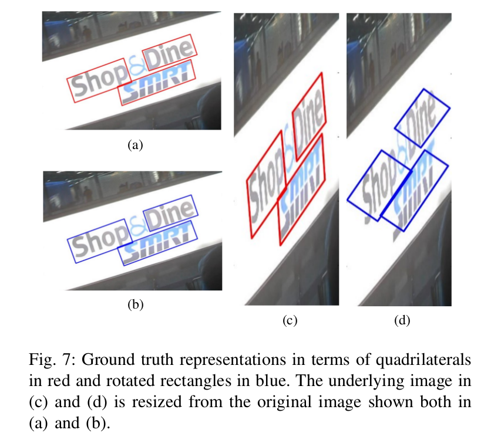  
旋转的矩形是四边形的近似简化，在表示任意方向的文本边界框时更灵活。尽管两种表示同样适用于普通文本字体和样式，但是四边形表示可以更好地适应重新调整大小的图像。图7指出，在原始图像（图7（a-b））中，使用四边形和旋转矩形表示的边界框几乎相同。然而，有图7（c-d）可知，在调整后的图像中旋转矩形匹配的文本差于四边形。从这个意义上讲，具有四边形表示的TextBoxes ++比使用旋转矩形的变体更准确。

我们对经过广泛测试的ICDAR 2015 Incidental文本数据集进行了实验，以比较TextBoxes++的这两种变体；量化对比结果在表II中给出。

## D. Text localization
_1）Performance：_
- **Oriented Text Dataset:** 首先在广泛使用的ICDAR2015 Incidental文本数据集上测试定向文本的性能，量化结果如表III 。COCO-Text的测试结果如表IV 。

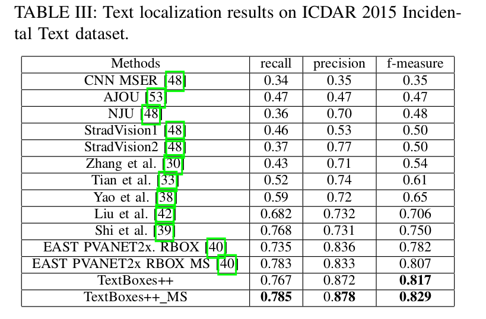

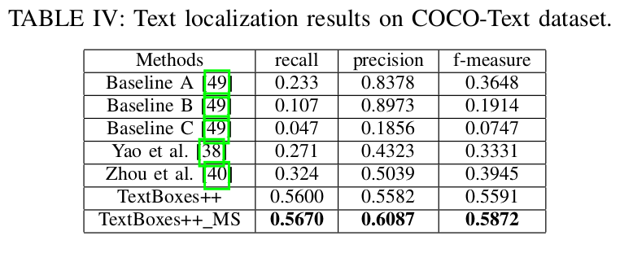

- **Horizontal Text Dataset:** 同时也评估了TextBoxes++在ICDAR2013上的表现，ICDAR2013是最流行的水平文本数据集，其结果如表 V 。

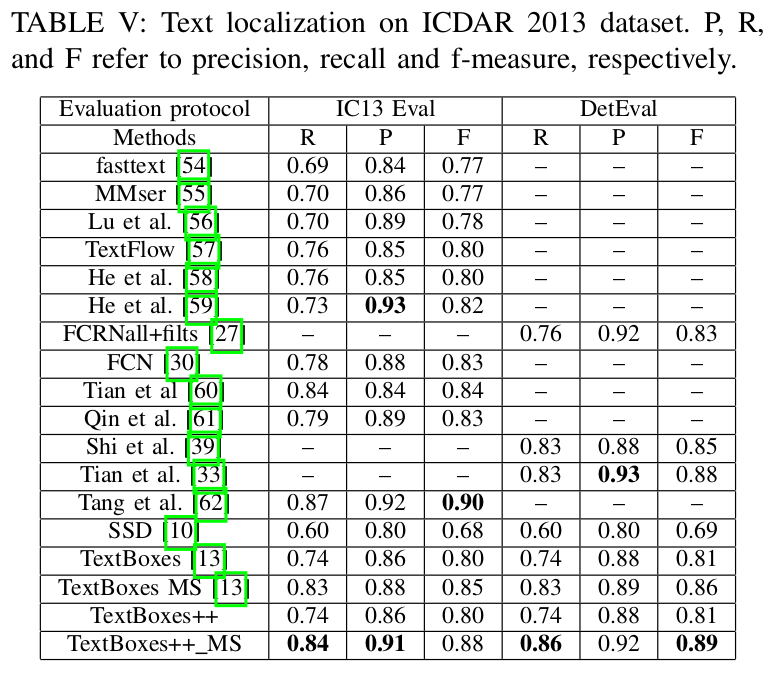

_2) Runtime:_ 运行时间如表VI。

## E. Word spotting and end-to-end recognition to refine text detection

_1) Word spotting and end-to-end recognition:_ 尽管单词识别和端到端识别相似，但是单词识别和端到端识别的评估略微不同。对于单词识别，仅某些特定的单词和文本需要被检测和识别，其意味着单词识别通常比端到端识别难。
- **Oriented text datasets:**
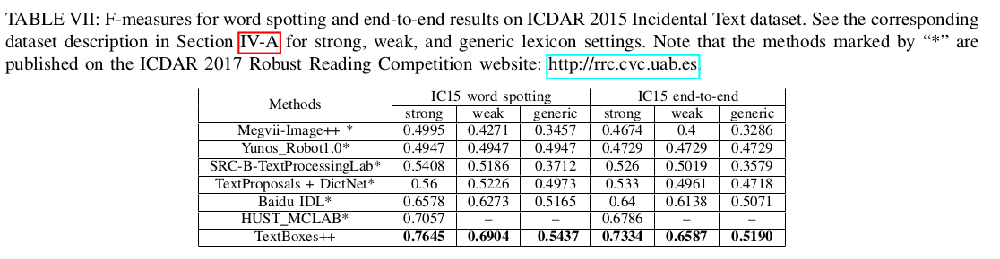
- **Horizontal text datasets:**
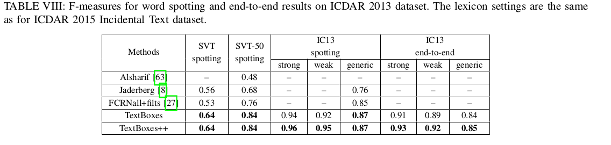

_2) Refining detection with recognition:_
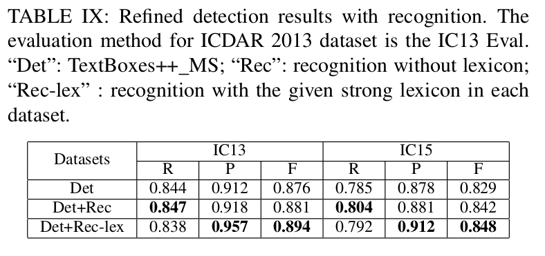

## F.Weaknesses
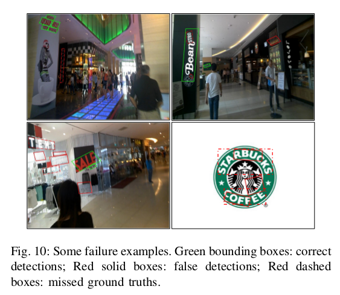
