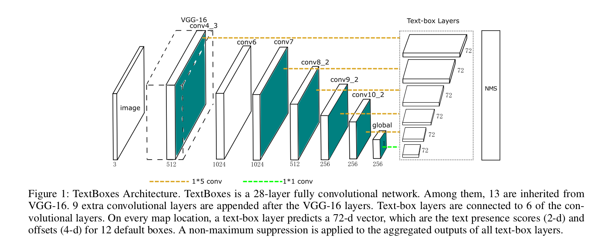
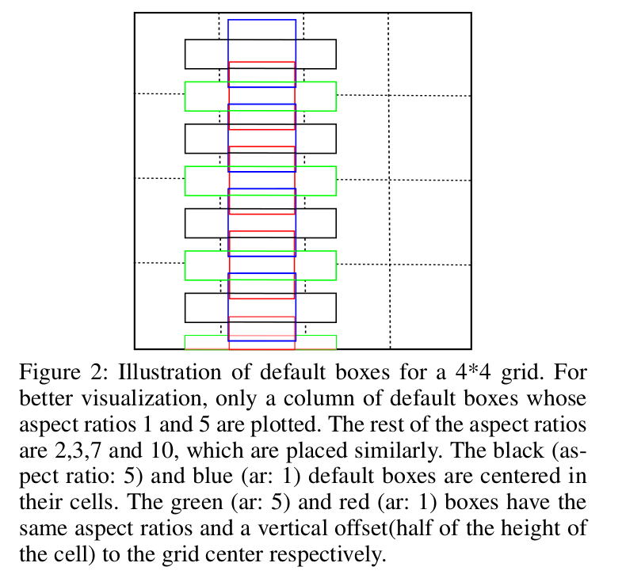
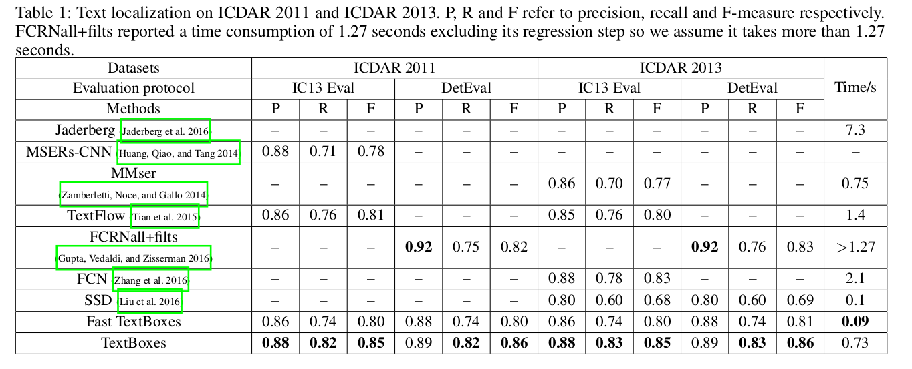
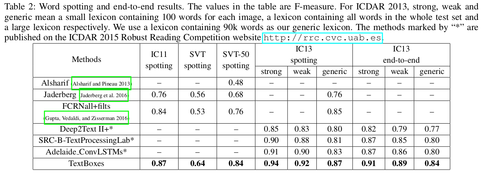

TextBoxes: A Fast Text Detector with a Single Deep Neural Network
=

# Introduction
TextBoxes直接预测边界框相对于default boxes的偏移。此外，还认为单词识别有助于区分文本和背景，特别是当单词被限制在给定的集合（即词典）时。采用成功的文本识别算法CRNN连接到TextBoxes。这个识别器不仅提供额外的识别输出，还通过语义级感知（semantic-level awareness）泛化识别，从而进一步提高了文字识别的准确性。TextBoxes和CRNN的结合在文字识别上产生最佳性能和端到端的识别任务。

本文的贡献有三个方面：
- 设计端到端的可训练的神经网络模型用于场景文本检测。
- 提出有效结合检测和识别的文字识别/端到端识别框架。
- 获得高度竞争力的结果，同时保持计算效率。

# Related Works
直观上，场景文本理解可以进一步分为两个子任务：文本检测和文本识别。前者旨在定位图像中的文本，后者将单词图像裁剪成机器可解释的字符序列。基于基本的检测目标，文本检测方法可以粗糙地分为三类：

1）Character-based： 首先检测单个字符，然后将它们组合成单词。

2）Word-based： 用一般物体检测的类似方式直接命中单词（Jaderberg等人2016; Zhong等人2016; Gomez-Bigorda和Karatzas 2016）。《Reading text in the wild with convolutional neural networks》
（Jaderberg等人，2016）提出了基于R-CNN（Girshick等人，2014）的框架。首先，使用类别无关的提议生成器生成提议。然后通过随机森林分类其分类提议。最后用于边界框回归的卷积神经网络精炼边界框。

3）Text-line-based：检测文本行然后分成单词。 例如《Symmetry-based text line detection in natural scenes》提出利用文本的对称特征检测文本线。《Multi-oriented text detection
with fully convolutional networks》使用全卷积网络定位文本线。

TextBoxes是基于单词的（word-based）。相比于《Reading text in the wild with convolutional neural networks》的三个检测步骤，并且每个步骤进一步超过一种算法，TextBoxes是一种非常简单的管道，可以端到端训练。

TextBoxes受SSD的启发，并采用CRNN识别文字。

# Detecting text with TextBoxes
## Architecture

网络的架构如图1，它继承自VGG-16，保留VGG-16从conv1_1到conv4_3层，VGG-16的最后两个全连接层转换为带下采样的卷积层，接着是额外的卷积和池化层，即conv6到pool11 。

多个输出层（称为text-box layers）插入到最后或者某些中间卷积层之后。它们的输出被聚合并经历非最大抑制（NMS）过程。输出层也是卷积，因此TextBoxes全卷积的，可以输入任意大小的图像。

## Text-box layers
Text-box layers是TextBoxes的关键组成部分。Text-box layers根据输入特征图同时预测文本的存在性和边界框。在特征图的每个位置，输出分类得分和相对默认框的偏移。假设图像和特征图的大小分别是 $(w_{im}, h_{im})$ 和 $(w_{map}, h_{map})$ 。在关联默认框 $b_0=(x_0, y_0, w_o, h_0)$ 特征图位置 $(i, j)$ ，text-box层预测 $(\Delta x, \Delta y, \Delta w, \Delta h, c)$ ，其指明检测到的边界框 $b = (x, y, w, h)$ 的置信度为 $c$ ，其中
$$
\begin{align}
x = x_0 + w_0 \Delta x,  \\
y = y_0 + h_0 \Delta y,  \\
w = w_0 \exp(\Delta w),  \\
h = h_0 \exp(\Delta h),  \\
\end{align}  \tag 1
$$
在训练阶段，ground-truth单词框根据边界框重叠匹配默认框，遵循SSD的匹配方案。设计6个纵横比的默认框，包括1、2、3、5、7和10 。然而这使默认在水平方向是密集的，而垂直方向比较稀疏。为了解决这个问题，每个默认框设置水平偏移。默认框的设计如图2 。

此外，在text-box层采用不规则的 $1 \times 5$ 卷积滤波器，而不是标准的 $3 \times 3$ 卷积。这种Inception风格的滤波器产生矩形的感受野，其能更好地适应更大的纵横比，同时避免正方形感受野带来的噪声信号。

## Learning
采用SSD的损失函数。令 $x$ 为匹配的指示矩阵， $c$ 为置信度， $l$ 为预测位置， $g$ 为ground-truth位置。具体地，对于第 $i$ 个默认框和第 $j$ 个ground-truth， $x_{ij} = 1$ 意味着匹配，而 $x_{ij}$ 相反。损失函数定义为：
$$L(x, c, l, g) = \frac{1}{N}(L_{conf}(x, c) + \alpha L_{loc}(x, l, g))  \tag2 $$
其中 $N$ 是匹配ground-truth的默认框的数量， $\alpha$ 设为1 。

## Multi-scale inputs
尽管在默认框和卷积滤波器上有优化，但是仍难以鲁棒性地定位极端纵横比和大小的单词。为了进一步提高检测精度，为TextBoxes使用多个重新缩放版本的输入图像。为了进一步提升准确率，TextBoxes的输入图像的多个重新缩放版本。输入图像重新缩放到5个尺度，包括（$with \times height$）$300 \times 300$ 、 $700 \times 700$ 、 $300 \times 700$ 、 $500 \times 700$ 和 $1600 \times 1600$ 。主要某些尺度水平方向压缩图像，使得“long”单词变短。多尺度输入提升检测准确率，同时轻微增加计算开销。在ICDAR2013中，进一步提升检测的 $f-measure$ 5个百分点。检测每幅图像的所有五个尺度花费0.73s，如果去除 $1600 \times 1600$ 的尺度需要0.24s。运行时间在单个Titan X GPU上测量。注意，不同于测试，仅使用单尺度输入（$300 \times 300$）用于训练。

## Non-maximum suppression
非极大值抑制应用到所有text-box层的聚合输出，并将额外的非极大值抑制应用到文本定位的所尺度输入的结果上。

## Word spotting and end-to-end recognition
文字识别适用于定位词典中给定的特定单词。端到端识别关注检测和识别。尽管简单地将TextBoxes和文本识别器连接两个任务都能获得。我们认为识别器有助于消除false-positive检测结果。特别地，当词典给定时，识别器有效地消除不匹配任何给定单词的检测到的边界框。

采用CRNN作为文本识别器。CRNN使用CTC作为其输出层，其根据输入图像估计序列概率，即 $p(w|I)$ ，其中 $I$ 是输入图像， $w$ 表示字符序列。将概率视为匹配分数，它衡量一个特定单词与图像的兼容性。然后检测得分是给定词典中所有单词之间的最大分数：
$$s = \max_{x \in \cal{W}}p(w|I) \tag 3$$
其中 $\cal{W}$ 是给定词典。如果任务没有指明词典，使用包含90k英文单词的通用词典。

将原始TextBoxes的检测得分替换为公式（3）中的得分。然而，在所有边界框上评估公式（3）将非常耗时。在实践中，我们首先使用TextBoxes通过检测较低的分数阈值和较高的NMS重叠阈值来生成冗余的候选单词集，使用多尺度输入的ICDAR1023，每个图像保留具有0.93的高召回率的边界框35个。然后，将公式（3）应用到所有候选以重新评估它们的得分，接着是第二得分阈值和NMS。当使用多尺度输入时，为每个尺度单独生成候选，并在所有尺度候选上执行上述步骤。较低的重叠阈值用于被识别为相同单词的框，从而对相同单词的框施加更强的抑制。

# Experiments
## Datasets
**SynthText** 包含800k合成文本图像，通过将渲染的单词与自然图像混合来创建。合成图像看起来很逼真，因为使用学习算法仔细选择文本的位置和变换。 该数据集用于预训练我们的模型。

**ICDAR 2011 (IC11)** 在ICDAR2011数据集是高分辨率真实世界图像。其测试集用于评估模型。

**ICDAR 2013 (IC13)** ICDAR2013数据集与ICDAR2011数据集相似，使用其训练集训练模型。ICDAR2013数据集给出了3个不同大小的词典。对于测试图像，给出100个单词作为词典，这称为强词典。

**Street View Text (SVT)** 由于图像更低的分辨率，SVT比ICDAR数据集更加挑战。图像中存在未标记的文本。因此，仅使用这个数据集用于单词识别，其中词典包含50个单词。

## Implementation details
TextBoxes以 $300 \times 300$ 图像使用SGD训练。momentum = 0.9，weight decay = $5 \times 10^{04}$ 。初始学习率为 $10^{-3}$ ，在40k迭代后衰减到 $10^{-4}$ 。除了SVT的所有数据集，首先在SynthText上训练50K次迭代，然后在ICDAR2013上微调2k次迭代。对于SVT，在SVT训练集上微调。所有图像使用SSD的数据增强策略。文本识别使用预训练CRNN执行。

## Text localization

