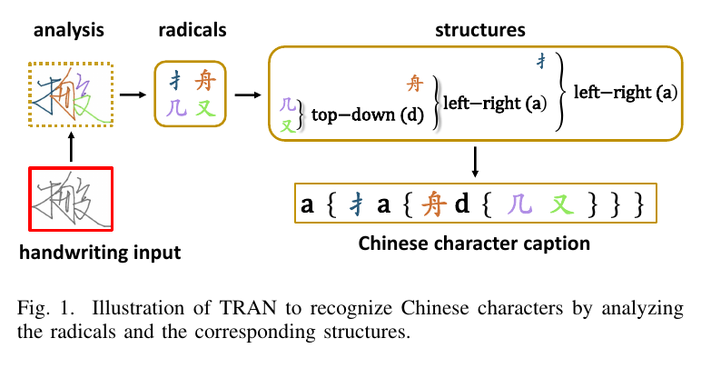
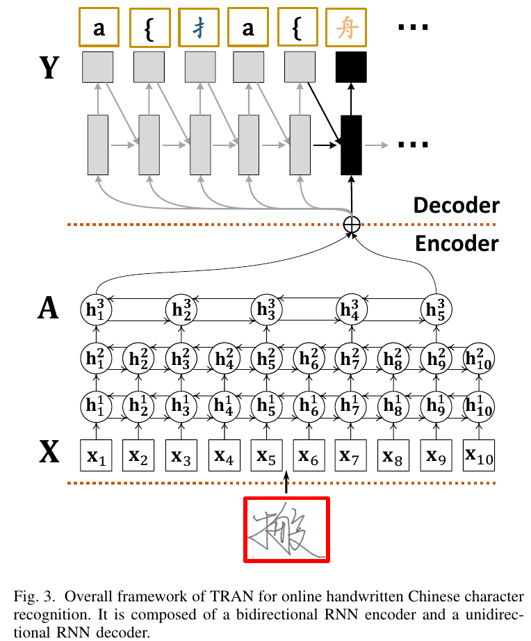
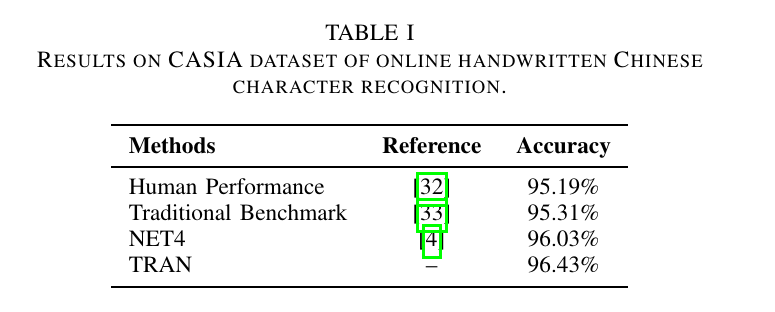
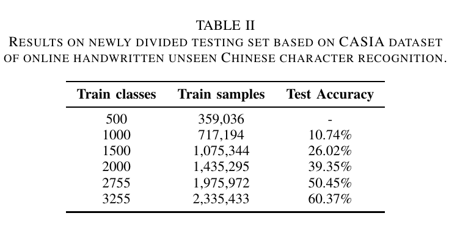
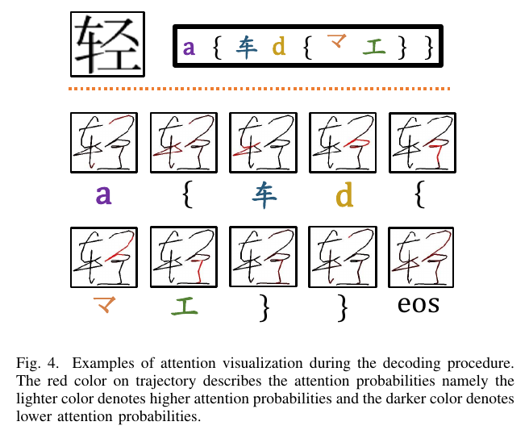

Trajectory-based Radical Analysis Network for Online Handwritten Chinese Character Recognition
=

# Abstract
最近，由于深度学习技术的发展，在线手写汉字识别取得巨大进步。然而，先前的研究主要将汉字视为一个类，而没有显示地考虑其内部结构，即具有复杂几何性的部首部分。在这项研究中，我们提出一种新颖的基于笔记的部首分析网络（trajectory-based Radical Analysis Network： TRAN），首先识别部首并同时分析部首中的二维结构；然后通过基于它们内部部首分析而生成的caption来识别汉字。所提出的TRAN采用循环神经网络（RNN）作为编码器和解码器。RNN编码器通过直接将手写笔迹转换为高级特征来充分利用在线信息。RNN解码器旨在通过注意力模型来检测部首和空间结构以生成caption。将汉字视为部首的二维组成方式可以减小词汇表的大小，并且仅当模型进过相应的部首，便可确保TRAN能够识别未见过的汉字类的能力。在CASIA-OLHWDB数据库上评估时，所提出的方法明显由于最佳的完整字符建模方法，相应的字符错误了（character error rate：CER）减小10% 。同时，对于识别500个未见过的汉字的情况，TRAN可以获得60%的字符准确率，而传统的完整字符方法没有能力处理它们。

# I. Introduction
手写汉字的机器识别已被研究数十年。由于大量的字符类和手写输入的模棱两可，手写汉字识别是一个富有挑战性的任务。尽管一些传统方法获得巨大成就，但是它们仅将字符样本视为整体，而没有考虑不同字符的相似性和内部结构。并且，它们没有能力处理未见过的字符类。

然而，汉字可以分解为一些基本结构部分，称为部首。首先提取嵌入到汉字，然后使用这些知识识别是一种直观的方式。在过去几十年，为基于偏旁部首的汉字识别作出了许多贡献。例如，[8]提出一种基于汉字识别的匹配方法。它首先单独地检测部首，然后采用层级的部首匹配方法来将偏旁部首组成一个字符。[9]尝试将字符过分割成候选部首，但是所提出的方法仅能处理左右结构，并且过分割带来许多困难。最近，[10]提出基于部首的汉字识别的多标签学习。他将字符类转换为几个偏旁部首和空间结构的组合。通常，这些方法在处理部首分割和部首中结构分析时存在困难不是灵活的。此外，它们没有关注识别未见过的汉字类。

本文中，我们提出一种新颖的基于部首的方法来进行在线手写汉字识别，称为trajectory——based radical analysis network（TRAN）。不同于上面提到的基于部首的方法，在TRAN中，部首分割和结构检测通过注意力模型自动处理，该注意力模型联合整个网络进行优化。TRAN的主要思想是将汉字分解成偏旁部首，并检测偏旁部首之间的空间结构。然后，我们将部首分析描述为汉字caption。当部首匹配ground-truth时，手写汉字被成功识别。为了更方便，我们在图1中说明了TRAN学习方式。在线手写汉字的输入在图1左下展示。它包含四种不同的偏旁部首。手写输入在部首中的上下和左右结构检测到后，最终识别为右下的汉字。基于偏旁部首的分析，如果偏旁部首已见过，那么所提出的TRAN能够识别未见过的汉字类。

所提出的TRAN是基于RNN的编码器-解码器模型的改进版。基于注意力的encoder-decoder模型扩展用于许多应用，包括机器翻译、图像描述、语音识别和数学公式识别等。在线手写汉字识别的原始数据是可变长度的序列（xy-coordinate）。首先，TRAN采用堆叠的双向RNN来将输入序列编码到高级表示。然后，一个无向的RNN解码器在一个时间以一个符号的形式将高级表示转换为输出字符描述。对于预测到的偏旁部首，在解码器中构建一个基于覆盖的注意力模型来扫描整个输入序列，并选择最相关的部分来描述分割的偏旁部首或偏旁部首之间的二维结构。我们所提出的TRAN与我们先前的工作[22]相关，但有两个方面的差异：1）[22]关注RAN在印刷汉字识别上的应用，而本文关注手写识别汉字的应用。有趣的是，研究RAN在手写汉字识别方面的表现，因为手写字符由于书写风格的多样性而更加模糊。2）我们选择通过采用RNN编码器直接编码原始序列数据，以便充分利用无法从静态图像中恢复的动态轨迹信息，而不是将在线手写字符转换为静态图像并采用卷积神经网络[23]对其进行编码。

这项研究的主要贡献如下：
- 我们为在线手写汉字识别提出TRAN。
- 偏旁部首词汇表的大小远小于汉字词汇表，导致输出类别之间的冗余减少和识别性能的提高。
- 仅当偏旁部首是已见过时，TRAN才具备识别未见或新创造的汉字的能力。
- 我们通过实验证明了RAN与在线手写汉字识别相比，与现有技术相比如何表现，并展示了它在识别看不见的角色类别方面的有效性。

# II. Description of Chinese Character Caption

本节中，我们将介绍如何生成汉字描述。字符描述由3个重要部分组成：偏旁部首、空间结构和括号对（例如：“{”和“}”）。偏旁部首表示汉字的基本部分，它通常与不同的汉字共享。与大量的汉字类别相比，偏旁部首的数量是十分有限的。中国国家语言委员会公布的GB13000.1标准声明，近2万多个汉字由500个偏旁部首组成。至于偏旁部首中的复杂结构，图2展示了11个常用的结构，并描述如下：
- single-element：有时一个单独偏旁部首表示一个汉字，因此我们不能发现如此字符的内部结构。
- a： 左右结构
- d： 上下结构
- stl： 左上环绕结构
- str： 右上环绕结构
- sbl： 左下环绕结构
- sl： 左环绕结构
- sb： 下环绕结构
- st： 上环绕结构
- s： 环绕结构
- w： within 结构

在分解汉字为偏旁部首和空间结构后，我们使用一对括号来限制单一的结构。以“stl”为例，它的描述为“stl {radical-1 radical-2}”。当所有的偏旁部首都包含在caption中时，汉字描述的生成完成。

# III. The Proposed Approach

本节中，我们阐述所提出的TRAN框架，即从在线手写笔迹点序列中生成潜在的汉字描述，如图3所示。首先，我们从原始的笔迹点（xy坐标）中提取笔迹信息为输入特征。然后，采用一个堆叠的双向RNN作为编码器来将输入特征转换为高级表示。由于原始的笔迹点是可变长序列，提取的高级表示也是可变长序列。为了关联可变长序列的表示和可变长字符描述，我们通过对高级表示和无向RNN编码器使用的固定长度的上下文向量进行加权求和来生成固定长度的上下文向量，从而一次一个符号地生成字符描述。我们引入注意力模型来生成权重系数，使得在每个解码步中，上下文向量仅包含有用的笔迹信息。

## A. Feature extraction
在线手写汉字的数据采集过程中，笔尖移动（xy坐标）和笔状态（笔下或上笔：pen-down pen-up）存储为可变长度的序列数据：
$$\{[x_1, y_1, s_1], [x_2, y_2, s_2], \cdots, [x_N, y_N, s_N]\} \tag 1$$
其中 $N$ 为序列长度，$x_i$ 和 $y_i$ 为笔移动xy坐标，$s_i$ 表示第$i$个点属于哪个笔划。

为了处理不同书写速度的不均匀采样问题和不同便携式设备的坐标尺寸变化问题，根据[4]执行插值和规范化到原始的笔迹点。然后，为每个点提取6维特征向量：
$$[x_i, y_i, \Delta x_i, \Delta y_i, \delta(s_i = s_{i+1}), \delta(s_i \ne s_{i+1})] \tag 2$$
其中 $\Delta x_i = x_{i+1} - x_i$， $\Delta y_i = y_{i+1}-y_i$ ；当条件为true时，$\delta(\cdot)=1$
，否则为0 。最后两项为指示笔为哪种状态的flag，即 $[1, 0]$ 和 $[0, 1]$ 分别为pen-down和pen-up的概率。为了方便起见，在接下来的章节中，我们使用 $X = (x_1, x_2, \cdots, x_N)$ 来表示编码器的输入序列，其中 $x_i \in \Bbb{R}^d(d=6)$ 。

## B. Encoder
给定特征序列 $(x_1, x_2, \cdots, x_N)$ ，我们采用RNN作为编码器来序列编码为高级表示，因为RNN已被证明其在处理序列信号方面的强项。然而，一个简单的RNN在训练过程面临严重的问题，即梯度消失和爆炸。因此，本研究采用了一种改进版本的RNN命名门控循环单元（GRU）[27]，它可以缓解这两个问题，因为它利用更新门和复位门来控制前向信息和后向梯度的流动。编码器中GRU的隐藏状态 $h_t$ 计算为：
$$h_t = GRU(x_t, h_{t-1}) \tag 3$$
GRU函数为：
$$
\begin{alignat}{2}
z_t &= \sigma(W_{xz}x_t + U_{hz}h_{t-1}) \tag 4 \\
r_t &= \sigma(X_{xr}x_t + U_{hr}h_{t01}) \tag 5 \\
\tilde{h}_t &= \tanh(W_{xh}x_t + U_{rh}(r_t \otimes h_{t-1})) \tag 6 \\
h_t &= (1-z_t) \otimes h_{t-1} + z_t \otimes\tilde{h}_t \tag 7 
\end{alignat}
$$
其中 $\sigma$ 表示sigmoid激活函数，$\otimes$表示逐元素乘法运算，$z_t, r_t$ 和 $\tilde{h}_t$为更新门、复位门和候选激活（update gate、reset gate、 candidate activation）。$W_{xz}$、$W_{xr}$、$W_{xh}$、$U_{hz}$、$U_{hr}$ 和 $U_{rh}$为相关权重矩阵。

然而，尽管无向GRU可以获得输入信号的历史，但是它没有建模未来场景的能力。因此，我们通过将输入向量传递通过在相反方向上运行的两个GRU层并连接它们的隐藏状态向量来使用双向GRU，以便编码器可以使用历史和未来信息。为了获得高级表示，编码器将多个GRU层堆叠在彼此之上，如图3所示。在这项研究中，我们的编码器包含4个双向GRU层。每层有250个前馈和250个后馈GRU单元。我们也在高级GRU层的时间轴上添加池化，因为：1）高级表示过于准确，并包含太多冗余信息；2）如果编码器的输出减少，解码器需要注意的更少，导致性能提升；3）池化操作加速编码过程。通过随时间删除偶数输出，将池应用于顶部GRU层。

假设双向的GRU编码器产生长度为 $L$ 的高级表示序列 $A$ 。因为在双线编码器中有一个池化操作，所以 $L=\frac{N}{2}$
。这种表示的每一个是一个D维向量（$D = 500$）：
$$A = \{a_1, \cdots, a_L\}, a_i \in \Bbb{R}^D \tag 8$$

## C. Decoder with attention model
在获得高级表示 $A$ 之后，解码器旨在利用它们生成汉字描述。输出序列 $Y$ 表示为one-hot编码向量序列：
$$Y=\{y_1, \cdots, y_C\}, y_i \in \Bbb{R}^K \tag 9$$
其中 $K$ 为词汇表的大小，$C$为字符描述的长度。注意，表示序列的长度 $(L)$ 和字符描述的长度 $(C)$ 是可变的。为了处理可变长表示到可变长字符描述的映射，我们尝试计算一个中间的固定大小的向量 $c_t$ ，其包含表示序列的有用信息。然后，解码器利用这个固定大小的向量以每步一个符号的预测字符描述。由于 $c_t$ 包含输入序列的整体信息，预测单词的概率使用一个多层感知机，由上下文向量 $c_t$ 、当前解码器状态 $c_t$ 和前一个预测符号 $y_t$计算：
$$p(y_t | y_{t-1}, X) = g(W_o h(Ey_{t-1} + W_s s_t + W_c c_t))  \tag {10}$$
其中 $g$ 表示词汇表中所有符号上softmax激活函数，$h$ 表示maxout激活函数。令 $m$ 和 $n$ 表示嵌入和解码器状态的维度，$W_o \in \Bbb{R}^{K \times \frac{m}{2}}$ 、 $W_s \in \Bbb{R}^{m \times n}$ 、 $W_c \in \Bbb {R}^{m \times D}$ 和 $E$ 表示嵌入矩阵。

由于上下文向量 $c_t$ 需要是固定长度，所以通过将时间步 $t$ 的所有表示相加来产生上下文向量是一种直接的方式。然而，平均和太鲁棒，并且导致有用信息的丢失。因此，我们采用加权和，而权重系数称为注意力概率。注意概率作为描述来说明表示序列的哪个部分在每个解码步骤中是有用的。我们计算解码器状态 $s_t$ 和上下文向量 $c_t$ 如下：
$$
\begin{alignat}{2}
\hat{s}_t &= GRU(y_{t-1}, s_{t-1}) \tag{11} \\
F &= Q * \sum_{l=1}^{t-1} \alpha_l \tag{12} \\
e_{ti} &= \nu_{att}^T\tanh(W_{att}\hat{s}_t + U_{att}a_i + U_f f_i) \tag{13} \\
\alpha_{ti} &= \frac{\exp(e_{ti})}{\sum_{k=1}^L \exp(e_{tk})} \tag{14} \\
c_t &= \sum_{i=1}^L\alpha_{ti}a_i \tag{15} \\
s_t &= GRU(c_t, \hat{s}_t) \tag{16}
\end{alignat}
$$
这里，我们可以看到采用两个无向的GRU层来计算解码器状态 $s_t$ 。GRU函数与公式3相同。$\hat{s}_t$表示当前解码器状态预测，$e_{ti}$表示条件 $\hat{s}_t$下，时间步 $t$ 时 $\alpha_{ti}$ 的能量（energy），注意力概率 $\alpha_{ti}$ （其为$\alpha_t$ 的第 $i$ 个元素）由采用 $e_{ti}$ 作为输入的softmax函数计算。然后，上下文向量 $c_t$ 通过表示向量 $a_i$ 与注意力概率（用作权重）的加权和计算，我们也在注意力模型中附加覆盖向量 $f_i$（$F$ 的第 $i$ 个向量）。覆盖向量基于所有过去的注意力概率之和计算，这使得覆盖向量包含公式2中的对齐历史信息。为了使注意力模型知道表示序列的哪个部分是否已被关注，我们采用覆盖向量。令 $n'$ 表示注意力的维度。然后，$\nu_{att} \in \Bbb{R}^{n'}$ 、$W_{att} \in \Bbb{R}^{n' \times n}$ 和 $U_{att} \in \Bbb{R}^{n' \times D}$ 。

# IV. Training and Testing Details
所提出的模型的训练目标是最大化公式10中的预测符号概率，我们使用交叉熵作为目标函数：
$$O = -\sum_{t=1}^C \log p(w_t | y_{t-1}, X) \tag{17}$$
其中 $w_t$ 表示时间步 $t$ 时的ground-truth单词， $C$ 为输出字符串的长度。GRU编码器的实现细节见III-B节。解码器使用两层，每层使用256个前向GRU单元。嵌入维度 $m$ 、解码器状态维度 $n$ 和注意力维度 $n'$ 都设置为 256 。计算覆盖向量的卷积核大小设置为 $(5 \times 1)$ ，因为它是一维的卷积操作，同时卷积滤波器的数量设置为256.我们使用具有梯度裁剪的AdaDelta算法进行优化。Adadelta超参数设置为 $\rho = 0.95, \epsilon = 10^{-8}$ 。

在解码阶段，我们旨在生成给定输入笔迹的最可能的字符caption：
$$\hat{y} = \arg\max_y \log P(y|X) \tag{18}$$
然而，不同于训练过程，我们没有前面预测单词的ground-truth。为了防止由下一个解码步骤继承的先前预测误差，采用简单的从左到右的beam搜索算法[30]来实现解码过程。这里，我们从句子开头<sos>开始维持一组10个部分假设（partial hypothesis）。在每个时间步，beam中的每个部分假设随着每个可能的单词扩展，并且仅保留10个最可能的光束。重复此过程，直到输出字成为句子结尾<eos>。

# V. Experiments
本节中，我们通过回答一下问题来介绍识别已见和未见的在线手写汉字类的实验：
Q1 在识别已见汉字类时，TRAN是否有效？  
Q2 在识别未见汉字类时，TRAN是否有效？  
Q3 TRAN如何分析偏旁部首和空间结构？

## A. Performance on recognition of seen Chinese character classes（Q1）

本节中，我们证明TRAN在识别已见汉字类时的有效性。字符类集合为 3755个常用汉字。用于训练的数据集为CASIA，其包含OLHWDB1.0 和 OLHWDB1.1 。共有2693183个样本用于训练，224590个样本用于测试。训练和测试数据由不同的作者制作，个人手写风格巨大。表I列出了CASIA测试集上人类的性能和先前的基准测试。NET4是由[4]提出的方法，其代表在CASIA数据集上的最佳方法。NET4获得96.03%的准确率，而TRAN获得96.43%的准确率，揭示相对字符错误率降低10％。为了公平比较，这里，NET4和TRAN都没有使用[4]中提出的顺序丢失技巧，因此NET4的性能不如[4]中提出的最佳性能好。正如本研究在第一部分中所做的贡献所解释的，基于偏旁部首的方法和基于非偏旁部首的汉字识别方法之间的主要区别在于偏旁部首词汇的大小远远小于汉字词汇，导致输出类别之间的冗余减少和提高识别表现。

## B. Performance on recognition of unseen Chinese character classes(Q2)
汉字类的数量不是固定，其随创建的新字越来越多。同时，整体的汉字类是巨大的，并且难以训练覆盖它们所有的识别系统。因此，具有识别未见汉字能力的识别系统是有必要的，称之为 zero-shot learning 。

显然，传统的基于非偏旁部首的方法不能识别未见过的汉字，因为训练过程中未见过的字符从未出现。然而，仅当组成未见过字符的偏旁部首出现过，TRAN就能识别未见过的汉字。为了验证TRAN在未见过字符上的识别性能，我们将3755个常见汉字分为3255个类和其他500个类。我们从原始训练集中选择属于3255个类的手写字符作为新的训练集，并且我们从原始测试集中选择属于其他500个类的手写字符作为新的测试集。通过如此，测试字符类和手写变化都没有在训练过程中遇到。我们探索不同大小的训练集来训练 TRAN ，范围为从500到3255飞汉字类，并且我们确保测试字符的偏旁部首在训练集中被覆盖。结果见表II。

## C. Attention visualization (Q3)
