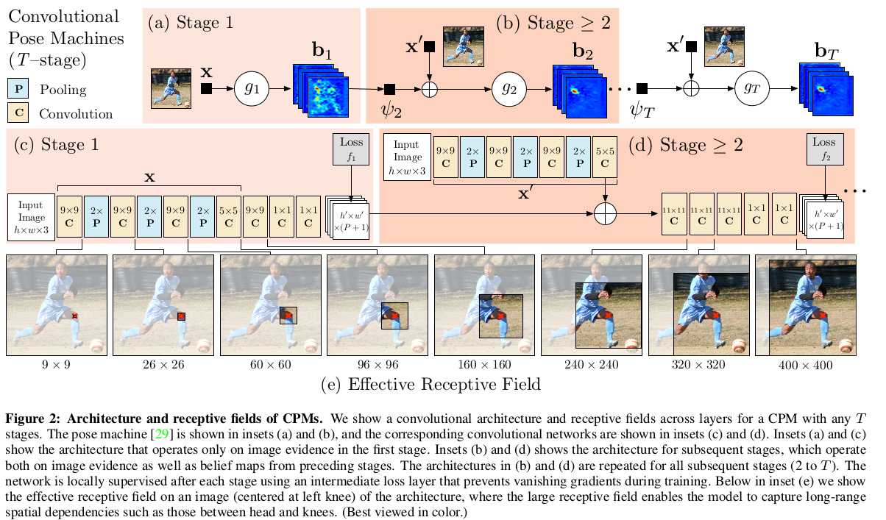

Convolutional Pose Machines
=

# 1. Introduction
我们引入卷积姿势机器（Convolutional Pose Machines： CPM）用于关节姿势估计的任务。CPM继承了姿势机[29]架构的好处——隐式学习图像和多部分（multi-part）线索之间的长程依赖关系，学习和推理之间的紧密集成，模块化顺序设计——并将它们与卷积提供的优势结合起来的架构： 直接从数据学习图像和空间上下文特征表示的能力；一种允许使用反向传播全局联合训练的可微架构；以及有效处理大型训练数据集的能力。

CPM 由一系列重复产生每个部分位置的 2D belief map 的卷积网络组成。在 CPM 的每个阶段，前一个阶段产生的图像特征和 belief map 作为输入。belief map 为后续阶段提供了对每个部件的位置的空间不确定性的表达性的非参数编码，允许CPM学习部件之间关系的丰富的图像相关空间模型。我们不是使用图形模型[28,38,39]或专门的后处理步骤[38,40]显示地解析这样的 belief map，而是学习直接在中间belief map 上运行的卷积网络，并学习隐含在图像依赖的空间模型与部件之间的关系。总体提出的多阶段架构是完全可微的，因此可以使用反向传播以端到端的方式进行训练。

在CPM的特定阶段，part belief 的空间上下文为后续阶段提供了强烈消除歧义的线索。因此，CPM的每个阶段都会生成belief map，并对每个部分的位置进行越来越精确的估计（参见图1）。为了捕获部件之间的长期交互，在我们的顺序预测框架的每个阶段中的网络设计的动机是在图像和信念图上实现大的感受野。我们发现，通过实验，belief map 上的大型感受野对于学习长期空间关系和提高准确率是至关重要的。

在CPM中组合多个卷积网络导致整个网络具有许多层，这些层在学习期间存在消失梯度[4,5,10,12]的问题的风险。现此问题的原因是，当传播通过网络的多个层时，反向传播的梯度强度会降低。虽然最近的工作表明在中间层监督非常深的网络有助于学习[20,36]，但是它们主要限制在分类问题中。本文中，我们证明，对于如姿势估计的结构化预测问题，CPM如何自然地建议一个系统框架，通过网络定期执行中间监督、补充梯度以及引导网络产生越来越准确的belief map 。我们还讨论了这种顺序预测架构的不同训练方案。

我们的主要贡献：（a）通过卷积架构的顺序组合学习隐式空间模型，以及（b）设计和训练这样的体系结构的系统方法，以学习结构化预测任务的图像特征和依赖于图像的空间模型，而无需任何图模型风格推理。

# 2. Related Work
经典的关节姿态估计方法是 **pictorial structure** 模型[2,3,9,14,26,27,30,43]，其中身体部分之间的空间关系表示为具有耦合连接肢体的运动先验树结构图模型。这些方法在人的所有肢体都可见的图像上是成功的，但是容易出现特征误差，例如重复计算图像证据，这是由于树结构模型未捕获的变量之间的相关性而发生的。Kiefel等人的方法基于pictorial structure 结构，但是底层图表示不同。 **Hierarchical models** [35,37]表示分层树结构中不同尺度和尺寸的部分之间的关系。这些模型的基本假设是较大的部分（对应于完整的肢体而不是关节）通常具有可以更容易检测的辨别性图像结构，并因此有助于推理较小的，难以检测的部分的位置。**Non-tree models** [8,16,19,33,42]结合了相互作用，这些相互作用引入了环以增加树结构，其中附加边缘捕获对称性，遮挡和长期关系。这些方法通常必须在学习期间和测试时依赖于近似推断，因此必须与允许有效推理的模型进行空间关系的精确建模，通常使用简单的参数形式以允许快速推理。相比之下，基于序列预测框架的方法[29]通过直接训练推理过程来学习隐式空间模型，其中变量之间可能存在复杂的相互作用，如[22,25,31,41]。

Toshev等人使用标准卷积架构回归笛卡尔坐标。最近的工作将图像回归为置信度图，并将它们排序为图模型，这需要手工设计的能量函数或空间概率先验的启发式初始化，以移除回归置信度图中的异常点。其中一些还利用专用网络模块进行精确细化[28,38]。在这项工作中，我们展示了回归置信度图适合输入到具有大的感受野的进一步卷积网络，以学习隐式空间依赖性而无需使用手工设计的先验，并在所有精确区域上实现最先进的性能而没有仔细的初始化和专门的精确细化。Pfister等人[24]也使用较大感受野的网络模块来捕获隐式的空间模型。由于卷积的可微本质，我们的模型能够全局训练，其中Tompson等人[39]和Steward等人[34]也讨论了联合训练的好处。

Carreira等[6]训练一个深度网络，使用误差反馈迭代地改进部分检测，但使用[40]中的笛卡尔表示，这不会保留空间不确定性，导致高精度区域的精度较低。在这项工作中，我们展示了顺序预测框架如何利用置信度图中保留的不确定性来编码丰富的空间背景，同时强制执行中间局部监督以解决消失梯度的问题。

# 3. Method
## 3.1. Pose Machines

我们表示第 $p$ 个解剖标志（我们称之为部分）的像素位置为 $Y_p \in Z \subset \Bbb R^2$ ，其中 $Z$ 为图像中所有 $(u, v)$ 位置的集合。我们的目标是预测所有 $P$ 部分的图像位置 $Y = (Y_1, \cdots, Y_p)$ 。Pose Machine[29]（见图2a和2b）由一系列多类预测器 $g_t(\cdot)$ 组成，其被训练用以预测层次结构每个级别中每个部分的位置。在每个阶段 $t\in \{1,\cdots,T\}$，分类器 $g_t$ 基于从由 $x_z \in \Bbb R ^d$ 表示的位置 $z$ 处的图像提取的特征和来自阶段 $t$ 中每个 $Y_p$周围的邻域的前一分类器的上下文信息，预测用于为每个部分 $Y_p = z, \forall z \in Z$ 分配位置的 belief 。因此，在第一个阶段 $t = 1$ 产生如下的 belief 值：
$$g_1(x_z) \rightarrow \{b_1^p(Y_p = z)\}_{p \in \{0, \cdots, P\}} \tag 1$$
其中 $b_1^p(Y_p = z)$ 是由分类器 $g_1$ 预测的用于在图像位置 $z$ 处分配第一阶段中的第 $p$ 部分的分数。我们将在图像中每个位置处评估的部分 $p$ 的所有 belief $z =(u, v)^T$ 表示为 $b_t^p \in \Bbb R ^{w \times h}$，其中 $w$ 和 $h$ 分别是图像的宽度和高度。即
$$b_t^p[u, v] = b_t^p(Y_p = z)  \tag 2$$
为了方便期间，我们将所有部分的belief map 的集合表示为 $b_t \in \Bbb R ^{w \times h \times (P+1)}$ （$P + 1$ 表示 $P$ 个部分加上背景)。

在后续阶段，分类器再次基于（1）图像数据 $x_z^t \in \Bbb R^d$ 的特征，以及（2）来自每个 $Y_p$ 附近的前一个分类器的上下文信息来预测为每个部分 $Y_p = z, z \in Z$ 分配位置的信念：
$$g_t(x_z', \psi(z, b_{t-1})) \rightarrow \{b_t^p(Y_p = z)\}_{p\in \{0, \cdots, P+1\}} \tag 3$$
其中 $\psi_{t>1}(\cdot)$ 是从 belief $b_{t-1}$ 到上下文特征的映射。在每个阶段，计算出的belief提供了每个部分位置的逐渐增长的精炼估计。注意，我们允许后续阶段的图像特征 $x_z'$ 与第一阶段 $x$ 中使用的图像特征是不同的。[29]提出的姿态机为预测 $(\{g_t\})$ 使用提升随机森林、跨越所有阶段的 $(x'=x)$ 的固定的手工设计的图像特征，以及固定的手工设计的上下文特征图 $(\psi(\cdot))$ 来捕获所有阶段的空间上下文。

## 3.2. Convolutional Pose Machines
我们展示姿势机器的预测和图像特征计算模块如何可以被深度卷积架构替代，从而允许直接从数据中学习图像和上下文特征表示。卷积结构还具有完全可微的优势，从而实现CPM所有阶段的端到端联合训练。我们描述了CPM的设计，它结合了深度卷积架构的优点和姿势机器框架提供的隐式空间建模。

### 3.2.1 Keypoints Localization Using Local Image Evidence
卷积姿态机的第一阶段仅从局部图像证据中预测部分 belief 。图2c展示使用深度卷积网络从局部图像证据进行部分检测的网络结构。这种证据是局部的，是因为网络第一阶段的感受野限制在输出像素位置的周围的一个小patch中。我们使用的网络结构为5个卷积层，后结2个 $1\times1$ 卷积层，其产生了一个全卷积架构。在实践中，为了达到一定的精度，我们将输入裁剪图像标准化为 $368 \times 368$（详见4.2节），上面显示的网络感受野为 $160 \times 160$ 像素。可以有效地将网络视为在图像上滑动深层网络并从每个 $160 \times 160$ 图像块中的局部图像证据回归到 $P + 1$ 大小的输出向量，该向量表示该图像位置处的每个部分的分数。

### 3.2.2 Sequential Prediction with Learned Spatial Context Features

虽然具有一致外观的标志物（例如头部和肩部）的检测率可以是有利的，但是由于其在配置和外观方面的大的变化而对于人类骨骼的运动链下方的标志物的精度通常低得多。然而，belief 图围绕部分位置，尽管是嘈杂的，但可以提供非常丰富的信息。如图3所示，当检测如右手肘之类的具有挑战性的部分时，具有尖峰的右肩部的 belief 图作为强力线索。后续阶段的预测器 $(g_{t>1})$ 可使用图像位置 $z$ 周围区域的噪声 belief 图的空间上下文 $(\psi_{t>1}(\cdot))$ ，并通过利用部件以一致的几何配置出现的事实来改进其预测。姿态机的第二阶段中，分类器 $g_2$ 接受图像特征 $x_z^2$ 作为输入，并且通过特征函数 $\psi$ 对前一阶段中的每个部分的信念计算特征。特征函数 $\psi$ 用于在不同部分的位置 $z$ 周围的空间区域中编码来自前一阶段的置信图。对于卷积姿势机器，我们没有计算上下文特征的显式函数。相反，我们将 $\psi$ 定义为前一阶段信念的预测因子的感受野。

通过在第二级网络的输出层获取感受野来指导网络的设计，该感受野足够大以允许学习部件之间潜在的复杂和长期相关性。通过简单地在前一阶段的输出上提供特征（与在图模型中指定潜在函数相反），后续阶段中的卷积层允许分类器通过选择最具预测性的特征来自由地组合上下文信息。来自第一阶段的信念图是从网络生成的，该网络使用小的感受野局部地检查图像。在第二阶段，我们设计了一个网络，大大增加了等效的感受野。通过以牺牲精度为代价的池化，以增加参数数量为代价增加卷积滤波器的内核大小，或者在训练期间遇到消失梯度的风险增加卷积层的数量，可以实现大的感受野。我们的网络设计，以及后续阶段 $(t \ge 2)$ 相应的感受野如图2d所示。我们选择使用多个卷积层以获得在 8 倍缩小的热图上的较大感受野，因为它允许我们在模型的参数数量方面是简约的。我们发现，即使在高精度区域，我们的步长为8个网络也与步长为4的网络有相同性能，但是步长为8个网络更容易获得较大的感受野。我们也为图像特征图重复相似的结构以是空间上下文是图像依赖的，并且允许误差修正，遵循姿态机的结构。

我们发现准确率随着感受野大小而提升。在图4中，我们展示了FLIC数据集[32]的准确度提高，因为通过对标准化为 $304 \times 304$ 的输入图像进行一系列实验性试验，通过改变架构而不显着改变参数数量来改变原始图像上感受野的大小。我们看到随着有效感受野的增加，精度也会提高，并且在大约250个像素时开始饱和，这也恰好大约是标准化对象的大小。这种对感受野大小的准确性的改进表明，网络确实编码了部件之间的长期相互作用，并且这样做是有益的。在图2中表现最佳的设置中，我们将裁剪后的图像标准化为更大尺寸的 $368 \times 368$ 像素以获得更好的精度，并且将第一阶段的信念图上的第二阶段输出的感受野设置为 $31 \times 31$， 这相当于原始图像上的 $400 \times 400$ 像素，其中半径通常可以覆盖任何一对部分。利用更多的阶段，感受野变得更大。在下一节中，我们展示上升到 6 个阶段的结果。

## 3.3. Learning in Convolutional Pose Machines
上面描述的姿态机的设计导致具有许多层的深度架构。训练具有许多层的网络可能出现梯度消失问题，反向传播梯度的大小随着输出层和输入层之间的中间层的数量的增加而减小。

幸运的是，姿态机的序列预测框架提供了一种自然的方法来训练处理这个问题的深度架构。姿态机的每个阶段被训练以重复地产生每个部分的每个位置的信念图。我们鼓励网络通过在每个阶段 $t$ 的输出处定义损失函数来重复地达到这样的表示，其最小化每个部分的预测和理想信念图之间的 $l_2$ 距离。部分 $p$ 的理想信念图为 $b_\ast^p(Y_p = z)$ ，这是通过将高斯峰置于每个身体部位 $p$ 的ground-truth位置而创建的。因此，我们的目标是在每个级别的每个阶段的输出上最小化的成本函数由下式给出：
$$f_t = \sum_{p=1}^{P+1}\sum_{z \in Z} ||b_t^p(z) - b_\ast^p(z)||_ 2^2 \tag 4$$
完整架构的总体目标是通过在每个阶段添加损失来获得并由下式给出:
$$\cal{F} = \sum_{t=1}^Tf_t  \tag 5$$

# 4. Evaluation
## 4.1. Analysis
**Addressing vanishing gradients.** 中间监督的优点在于，即使完整的体系结构可以具有多个层，它也不会成为消失梯度问题的牺牲品，因为中间损失函数在每个阶段补充梯度。

**Benefit of end-to-end learning.** 如图6a 。

**Comparison on training schemes.** 如图6b 。四种训练方式：（i）使用强制中间监督的全局损失函数从头训练；（ii）stage-wise（sw），其中每个阶段以前馈的方式进行训练；（iii）与（i）一样堆叠，但是使用（ii）的权重初始化；（iv）与（i）相同，但是没有中间监督。

**Performance across stages.** 如图6c 。

## 4.2. Datasets and Quantitative Analysis
基准测试数据集包括MPII、LSP和FLIC。为了使标准化的输入样本为368×368用于训练，我们首先调整图像的大小以使样本大致成为相同的尺度，然后根据数据集中提供的中心位置和粗略尺度估计来裁剪或填充图像（如果可用）。在没有这些信息的LSP等数据集中，我们根据关节位置或图像大小来估计它们。对于测试，我们执行类似的调整大小和裁剪（或填充），但仅在必要时从图像大小估计中心位置和尺度。此外，我们将来自不同尺度的信念图（在给定的周围扰动）合并用于最终预测，以处理给定尺度估计的不准确性。

**MPII Human Pose Dataset.** 28000 张图像。数据增强： $[-40^\circ, 40^\circ]$ 的随机选择、水平翻转。
