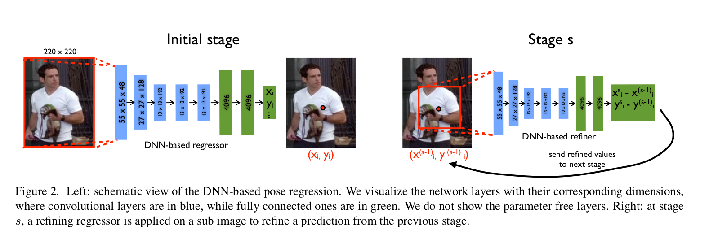

DeepPose: Human Pose Estimation via Deep Neural Networks
=

# 1. Introduction
人体姿势估计的问题（定义为人体关节的定位问题）在计算机视觉社区中受到了极大的关注。在图1中，我们可以看到一些这个问题的挑战——强关节、小、几乎看不到接缝、遮挡和需要捕捉的背景。

这一领域的主要工作主要是由于第一个挑战，需要在大空间内搜索所有可能的关节姿势。基于部分的模型自然地适用于模型关节（[16,8]），并且近年来已经提出了具有有效推理的各种模型（[6,18]）。

然而，上述效率是以有限的表现力 - 局部检测器的使用为代价实现的，这在许多情况下是单个部件的原因，并且最重要的是通过仅对身体部位之间的所有相互作用的一小部分进行建模。已经认识到这些限制，如图1所示，并且已经提出了以整体方式推理姿势的方法[15,20]，但在现实问题中成功有限。

在这项工作中，我们归结为人类姿态估计的整体观点。我们利用最近的深度学习发展，提出了一种基于深度神经网络（DNN）的新算法。DNN已在视觉分类任务和最近的对象定位任务中表现出突出性能。然而，将DNN应用于关节对象的精确定位的问题在很大程度上仍未得到解决。在本文中，我们试图阐明这个问题，并提出一个简单而强大的整体人体姿态估计公式作为DNN。

我们将姿态估计表示为联合回归问题，并展示如何在DNN设置中成功投射它。将每个身体关节的位置回归到使用完整图像和7层通用卷积DNN作为输入。这种形式有两种优势：第一，DNN能够捕获每个身体关节的完整上下文——每个关节回归器使用完整图像作为信号。第二，该方法比基于图模型的方法更容易制定——无需显式设计部件的特征表征和检测器; 无需显式设计模型拓扑和关节之间的交互。相反，我们证明一般的卷积网络可以被学习以处理这个问题。

此外，我们提出级联的基于DNN的姿态检测器。如此的级联允许关节定位的正确率增加。以初始的姿态估计开始，基于完整图像，我们学习基于DNN的回归器，其通过使用更高分辨率的子图精细关节预测。

我们针对所有报告的结果显示了四种广泛使用的基准测试的最新结果或优于现有技术。我们表明，我们的方法在人物的图像上表现良好，这些人在外观和关节方面表现出很强的变化。最后，我们通过跨数据集评估显示泛化性能。

# 2. Related Work
从计算机视觉的早期阶段就提出了将一般关节对象，特别是人体姿势表示为部件图的想法[16]。由 Fishler 和 Elschlager [8]引入的称为的 Pictorial Strictures（PSs），由 Felzenszwalb和 Huttenlocher [6]使用距离变换技巧变得易于操作和实用。结果，随后开发了具有实际意义的各种基于PS的模型。

然而，上述易处理性受限于具有基于树的姿态模型，其具有不依赖于图像数据的简单二进制潜能。因此，研究的重点是在保持易处理性的同时丰富模型的表示能力。早期的尝试基于更丰富的部件检测器[18,1,4]来获得这种能力。最近，提出了表达复杂关节关系的各种模型。Yang 和 Ramanan[26] 使用部件的混合模型。Johnson和Everingham [13]研究了具有 PS 混合的完整模型尺度的混合模型。Tian等人[24] 在一个层次模型中捕获更丰富的高阶空间关系。捕获高阶关系的另一种方法是通过图像相关的PS模型，可以通过全局分类器[25,19,17]进行估计。

归因于我们以整体方式推理姿势的理论已经显示出有限的实用性。Mori和Malik [15]试图为每个测试图像找到一组标记图像中最接近的样本并转移关节位置。Shakhnarovich等人采用了类似的最近邻设置。 [20]，然而他们使用局部敏感哈希。最近，Gkioxari等人[10] 提出用于零件配置的半全局分类器。这种形式在真实数据上表现出非常号的结果，然而，它基于线性分类器，表现能力低于我们的模型，而且仅在手臂上进行测试。Ionescu等人[11]采用姿态回归的思想，然而，他们推理3D姿势。

与我们最接近的工作使用卷积NN和Neighborhood Component Analysis来回归代表姿势的嵌入点[23]。然而，这项工作不采用网络级联。DNN 分类器的级联已被用于定位，但用于的是人脸关键点[21] 。

# 3. Deep Learning Model for Pose Estimation
我们使用如下的符号。为了表示一个姿势，我们在姿态向量（pose vector）中编码所有 $k$ 个身体关节位置，定义为 $y = (\cdots, y_i^T, \cdots), i\in\{1, \cdots, j\}$ ，其中 $y_i$ 包含第 $i$ 个关节的 $x$ 和 $y$ 坐标。标记的图像表示为 $(x, y)$ ，其中 $x$ 表示图像数据， $y$ 表示ground-truth 姿态向量。

此外，由于关节坐标是绝对图像坐标，因此，根据相应包围人体或部分的边界框来标准化它们是有好处的。在一个简单的情况下，边界框可以表示完整的图像。如此边界框通过边界框中心 $b_x \in \Bbb R^2$ 以及宽 $b_w$ 和高 $b_h$ : $b = (b_c, b_w, b_h)$ 定义。然后，关节 $y_i$ 可以通过边界框中心平移，以及边界框大小缩放，这称为通过 $b$ 标准化：
$$N(y_i;b) =
\left(
\begin{array}{cc}
  1/b_w & 0  \\
  0 & 1/b_h
\end{array}
\right)
(y_i - b_c)  \tag 1
$$
进一步地，我们将相同的标准化应用到姿态向量的元素 $N(y;b) = (\cdots, N(y_i;b)^T, \cdots)$ ，这产生了一个 _normalized pose vector_ 。最后，稍微滥用符号，我们使用 $N(x; b)$ 来表示边界框 $b$ 对图像 $x$ 的裁剪，这实际上是通过框来规范化图像。为简洁起见，我们用 $N(\cdot)$ 表示以 $b$ 为完整的图像框的归一化，。

## 3.1. Pose Estimation as DNN-based Regression
本文中，我们将姿态估计视为回归问题，其中我们训练，并使用函数 $\psi(x;\theta) \in \Bbb R^{2k}$ ，其从图像 $x$ 回归到标准化姿态向量，其中 $\theta$ 表示模型的参数。因此，使用式（1）的标准化变换，在绝对图像中的姿态预测 $y^\ast$ 为：
$$y^\ast = N^{-1}(\psi(N(x); \theta)) \tag 2$$

尽管它的形式简单，但是 $\psi$ 中的方法的能力和复杂度是基于深度均价神经网络的。如此的卷积网络包含几层——每层都是线性变换后跟非线性变换。第一层将预定义大小的图像作为输入。最后一层输出回归目标值，本文为 $2k$ 个关节坐标。

$\psi$ 的基本架构为Krizhevsky等人用于图像分类的网络，因为实验表明它在对象定位中也有突出的结果。该网络包含7层（如图2左）。用 $C$ 表示卷积层，$LRN$ 表示local response normalization 层， $P$ 表示池化层， $F$ 表示全连接层。仅 $C$ 和 $F$ 层包含可学习的参数，同时其他的是参数自由的。 $C$ 和 $F$ 层由线性变换后跟非线性变换组成，本文中非线性变换为修正线性单元。 对于 $C$ 层，大小定义为 $width \times height \times depth$ ，其中前两个维度具有空间意义，而深度（depth）定义了滤波器的数量。如果我们在括号中写出每层的大小，那么网络可以简洁地描述为：
$$C(55 \times 55 \times 96) - LRN - P - C(27 \times 27 \times 256) - \\
LRN - P - C(13 \times 13 \times 384) - C(13 \times 13 \times 384) -  \\
C(13 \times 13 \times 256) - P - F(4096) - F(4096)
$$
前两个 $C$ 层的滤波器大小分别为 $11 \times 11$ 和 $5 \times 5$ ，其余的三层为 $3 \times 3$ 。

**Training** 使用 $L_2$ 损失以获得最优的网络参数：
$$\arg \min_\theta \sum_{(x,y)\in D_N} \sum_{i=1}^k||y_i - \psi_i(x;\theta)||_ 2^2  \tag 4$$
批大小设置为 128 ，学习率设置为0.0005 。数据增强使用随机图像检测、左右翻转，dropout 率设置为 0.6 。

## 3.2. Cascade of Pose Regressors
来自前一部分的姿势公式具有以下优点：联合估计基于完整图像并因此依赖于上下文。然而，由于其固定的输入大小 $220 \times 220$ ，网络查看细节的能力有限——它学习的过滤器以粗略的尺度捕获姿势属性。这些是估计大致姿态所必须，但是不足以始终精准的定位身体关节。为了获得更好的精度，我们提出训练级联的姿态回归器。在第一阶段，级联通过估计初始姿势开始，如上一节所述。在后续阶段，训练额外的DNN回归器以预测从前一阶段到真实位置的关节位置的位移。因此，每个后续阶段能够被认为是当前预测姿态的细化，如图2所示。此外，每个后续阶段使用预测的关节位置来聚焦在图像的相关部分上——子图像在前一阶段的预测关节位置周围被裁剪，并且该关节的姿势位移回归器被应用于该子图像。
