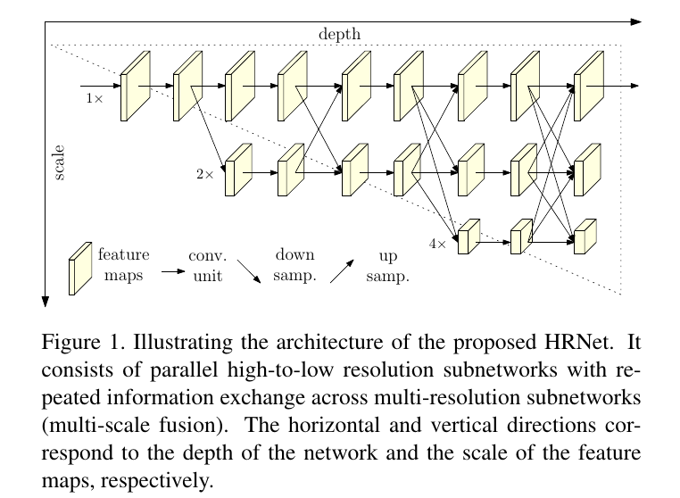
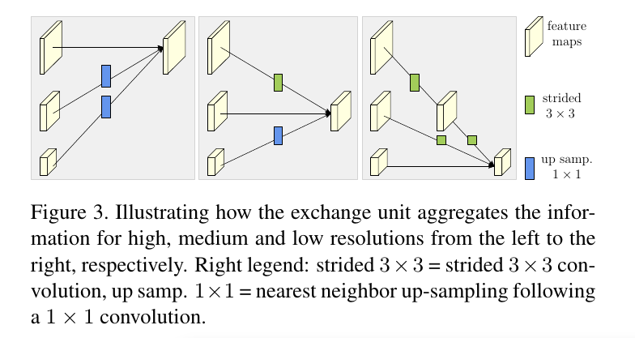
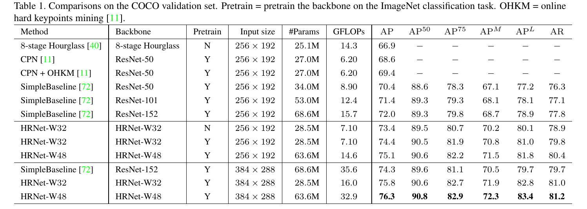
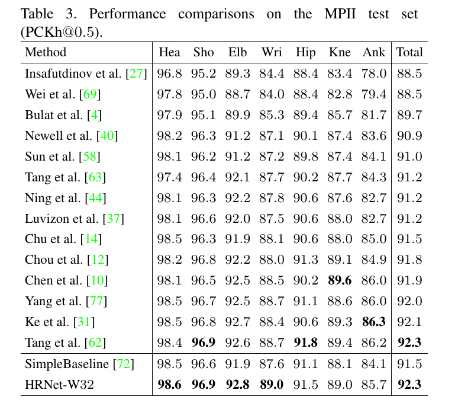

Deep High-Resolution Representation Learning for Human Pose Estimation
=

# Abstract
在本文中，我们对人体姿势估计问题感兴趣，重点是学习可靠的高分辨率表示。大多数现有方法从由高到低分辨率网络产生的低分辨率表示中恢复高分辨率表示。相反，我们提出的网络在整个过程中维持高分辨率表示。

我们从高分辨率子网开始作为第一阶段，逐步添加由高到低分辨率子网以形成更多阶段，并且并行连接多分辨率子网。我们进行重复的多尺度融合，使得每个由高到低分辨率的表示一次又一次地从其他并行表示接收信息，从而导致丰富的高分辨率表示。因此，预测的关键点热图可能更准确，空间更精确。我们通过两个基准数据集的先进姿态估计结果，经验证明了我们网络的有效性：COCO关键点检测数据集和MPII人体姿势数据集。此外，我们展示了我们的网络在PoseTrack数据集上的姿势跟踪的优越性。

# 1. Introduction
2D人体姿态估计是计算机视觉的基础而富挑战性的问题。目标是定位人体解剖学关键点（例如：肘部、手腕等）或部位。它有许多应用，包括人体行为识别、人机交互、动画等。本文对单人姿态估计感兴趣，其是与其他相关问题的基础，例如多人姿态估计、视频姿态估计和跟踪等。

最近的发展证明深度卷积神经网络已获得最佳的性能。大多数现有方法通过网络传递输入，通常由串联的由高到低分辨率子网络组成，然后提高分辨率。例如，Hourglass[40]通过一个对称的由低到高的过程恢复高分辨率。SimpleBaseline[72]采用少量转置卷积层来生成高分辨率表征。此外，膨胀卷积用于放大由高到低分辨率网络的后面层（例如VGGNet或ResNet）[27,77]。

我们提出一种新颖的架构，称为High-Resolution Net（HRNet），其能够在整个过程中维持高分辨率的表征。我们从高分辨率的子网络开始，并作为第一个阶段，然后逐渐一步一步的添加高到低分辨率子网络以形成更多的阶段，并且并行的连接多分辨率子网。我们通过在整个过程中反复交换并行多分辨率子网络中的信息来进行重复的多尺度融合。我们估计了网络输出的高分辨率表示的关键点。产生的网络如图1所示。

相比已有的广泛使用的用于姿态估计的网络，我们的网络有两个好处。（i）我们的方法并行地连接高到低分辨率的子网络，而不是大多数已有方法的串联。因此，我们的方法能够维持高分辨率，而不是通过由低到高的过程来恢复分辨率，因此预测热图可能空间上更加准确。（ii）多数已有的融合方案是聚合低级和高级表示。相反，我们在相同深度和相似水平的低分辨率表示的帮助下执行重复的多尺度融合以提升高分辨率表示，反之亦然，从而导致高分辨率表示对于姿态估计也很丰富。

我们凭经验证明了两个基准数据集的优越关键点检测性能：COCO关键点检测数据集[36]和MPII人体姿态数据集[2]。此外，我们在PoseTrack数据集[1]上展示了我们的网络在视频姿态跟踪中的优越性。

# 2. Related Work
单人姿态估计的多数传统解决方案是采用概率图模型或者pictorial结构模型，最近通过利用深度学习来更好地建模一元和成对energy[9,65,45]或模仿迭代推理过程[13]。如今，深度卷积神经网络提供了占据主导的解决方案。有两种主流的方法：回归关键点的位置，以及估计关键点热图，接着选择具有最高热值的位置作为关键点。

大多数关键点热图估计的卷积神经网络由与分类网络相似的子网络组成，其减小了分辨率，一个主体网络产生与其输入相同分辨率的表示，接着是一个估计关键点位置热图的回归器，然后将它们转换为完整分辨率。主体网络主要采用高到低和低到高的框架，可能使用多尺度融合和中间（深度）监督增强。

**High-to-low and low-to-high.** 高到低的过程旨在生成低分率和高级表示，而低到高过程旨在产生高分辨率表示。两个过程都可能重复多次以提升性能。

代表性的网络设计模式包括：（i）系统的高到低和低到高过程。Hourglass和其演变体设计了low-to-high过程作为high-to-low的镜像。（ii）繁重的high-to-low和轻量的low-to-high。高到低过程基于ImageNet分类网络，例如在[11,72]中采用ResNet，在low-to-high过程仅采用少量的双线性上采样或者转置卷积层。（iii）结合膨胀卷积。在[27,51,35]中，在ResNet或VGGNet的最后两个阶段采用膨胀卷积来消除空间分辨率损失，其接下来是一个轻量的高到低过程以进一步增加分辨率，从而避免仅使用膨胀卷积带来的昂贵的计算成本。图2描绘了四种代表性的姿态估计网络。

**Multi-scale fusion.** 直接的方式是单独地将多分辨率图像馈入多个网络，并聚合输出响应图。Hourglass及其扩展[77,31]通过skip连接将低到高过程中将低级特征逐步融入到高到低过程相同分辨率的高级特征。在级联金字塔网络中，globalnet将高到低的过程中的低级特征逐步融入从低到高过程，然后，refinenet 结合了通过卷积处理的低到高级别的特征。我们的方法重复多个尺度的融合，其部分受深度融合和其扩展[67,73,59,80,82]的影响。

**Intermediate suoervision.** 中间监督或者深度监督，早期开发用于图像分类[34,61]，也采用与帮助网络训练和提高热图估计质量，例如[69,40,64,3,11]。Hourglass方法和卷积姿态估计机方法处理中间热图作为输入或剩余子网络的部分输入。

**Our approach.** 我们的网络并行地连接高到低的子网络。它为空间准确的热图估计维持高分辨率表示。它通过重复地融合高到低子网络产生的表示来生成可靠的高分辨率表示。我们的方法不同于多数已有的工作，已有的工作需要单独的低到高的上采样过程，并聚合低级和高级表示。我们的方法，没有使用中间的热图监督，但是他在关键点检测准确率和计算复杂度与参数效率上更加优越。

存在用于分类和分割的相关多尺度网络[5,8,74,81,30,76,55,56,24,83,55,52,18]。我们的工作受他们中的一些[56,24,83,55]的启发，并有明显的差异使它们不适用于我们的问题。Convolutional neural fabrics[56]和interlinked CNN[83]由于在每个子网络（深度、BatchNorm）和多尺度融合上缺乏合适的设计，未能产生高质量的分割结果。grid network[18]，许多权重共享的 U-Net 的组合，由跨越多个分辨率表示的两个单独融合过程：在第一阶段，信息仅从高分辨率传递给低分辨率；在第二阶段，信息仅从低分辨率到高分辨率，并因此缺乏竞争力。多尺度的DenseNet没有目标，也无法生成可靠的高分辨率表示。

# 3. Approach
人体姿态估计，即关键点检测，旨在从大小为 $W \times H \times 3$ 的图像 $I$ 中检测 $K$ 个关键点或部位（例如肘部、腕关节等）的位置。最佳的方法将这个问题转换为估计大小为 $W' \times H'$ 的 $K$ 个热图 —— $\{H_1, H_2, \cdots, H_K\}$ ，其中每个热图 $H_k$ 表示第 $k$ 个关键点的位置置信度。

我们遵循广泛采用的使用卷积神经网络来预测人体关键点，其由一个由两个步幅减小分辨率组成的主干组成，一个主体输出与其输入特征图具有相同分辨率的特征图，一个回归器估计选择关键点位置并转换为全分辨率的热图。我们关注主题的设计，并引入High-Resolution Net（HRNet）（如图1描述）。

**Sequential multi-resolution subnetwork.** 已有的人体姿态估计网络通过串联的连接高到低分辨率的子网络构成，其中每个子网络（构成一个阶段）由一系列卷积组成，并且相邻子网络之间存在下采样层来减半分辨率。

令 $\cal{N}_{sr}$ 为第 $s$ 个阶段的子网络，$r$ 为分辨率索引（它的分辨率为第一个子网络分辨率的 $\frac{1}{2^{r-1}}$）。$S$ 个阶段（例如4）的高到低网络可以表示为：

$$\cal{N}_{11} \rightarrow \cal{N}_{22} \rightarrow \cal{N}_{33} \rightarrow \cal{N}_{44} \tag 1$$

**Parallel multi-resolution subnetwork.** 我们从高分辨率子网络开始作为第一阶段，然后逐渐一步一步地添加高到低分辨率的子网络，已组成新的阶段，并以并行地方式连接多分辨率的子网络。因此，后一阶段的并行子网络的分辨率包括前一阶段的分辨率和一个更低的分辨率。

包含4个并行分支的网络结构的例子如下：
$$
\begin{alignat}{3}
\cal{N}_{11} &\rightarrow \cal{N}_{21} &\rightarrow \cal{N}_{31} &\rightarrow \cal{N}_{41} \\
&\searrow \cal{N}_{22} &\rightarrow \cal{N}_{32} &\rightarrow \cal{N}_{42} \\
& &\searrow \cal{N}_{33} &\rightarrow \cal{N}_{43} \\
&&&\searrow \cal{N}_{44}
\end{alignat} \tag 2
$$

**Repeated multi-scale fusion.** 我们引入跨越并行子网络的交换单元（exchange units）使得每个重复地接收来自其他并行子网络的信息。这里是一个展示交换信息的方案。我们将第三个阶段划分为几个（例如3）交换块（exchange block），并且每个块由跨越并行单元的交换单元3个并行卷积单元组成，如下所示：
$$
\begin{alignat}{6}
\cal{C}_{31}^1 &\searrow & & \nearrow \cal{C}_{31}^2 & \searrow & & \nearrow \cal{C}_{31}^3 &\searrow \\ 
\cal{C}_{32}^1 &\rightarrow &\varepsilon_3^1 & \rightarrow \cal{C}_{32}^2 &\rightarrow &\varepsilon_3^2 &\rightarrow \cal{C}_{32}^3 &\rightarrow \varepsilon_3^3 \\
\cal{C}_{33}^1 &\nearrow && \searrow \cal{C}_{33}^2 &\nearrow && \searrow \cal{C}_{33}^3  &\nearrow
\end{alignat} \tag 3
$$
其中$\cal{C}_{sr}^b$表示低$s$个阶段中第$b$个块第$r$个分辨率中的卷积单元，$\varepsilon_s^b$ 为相应的交换单元。

我们在图3中展示了交换单元，并在下面给出公式。为了方便讨论，我们丢弃下标 $s$ 和上标 $b$ 。输入为 $s$ 个响应图: $\{X_1, X_2, \cdots, X_s\}$ 。输出为 $s$ 个响应图: $\{Y_1, Y_2, \cdots, Y_s\}$ ，其分辨率和宽与输入相同。每个输出是输入图的聚合，$Y_k = \sum_{i=1}^s a(X_i, k)$ 。跨越阶段的交换单元有额外的输出图 $Y_{s+1}$： $Y_{s+1} =a(Y_s, s+1)$ 。

函数 $a(X_i, k)$ 包含从分辨率 $i$ 到分辨率 $k$ 的上采样或下采样 $X_i$ 。我们为下采样采用带步幅的 $3 \times 3$ 卷积。例如，一个步长为2的 $3 \times 3$ 卷积进行2倍的下采样，两个连续的步长为2的 $3 \times 3$ 卷积进行4倍下采样。对于上采样，我们采用简单的最近邻采样，后跟 $1 \times 1$ 卷积来对齐通道数。如果 $i = k, a(\cdot,\cdot)$ 仅是恒等连接： $a(X_i, k) = X_i$ 。

**Heatmap estimation.** 我们仅从最后的交换单元输出的高分辨率表示中回归热图，其经验上可以良好工作。损失函数（定义为均方误差）用于比较预测热图和ground-truth热图。ground-truth热图通过应用以每个关键点的ground-truth为中心、标准差为1个像素的2D高斯分布生成。

**Network instantiation.** 我们通过遵循ResNet的设计规则来实例化关键点热图估计的网络，以将深度分布到每个阶段以及每个分辨率的通道数量。

主体（即我们的HRNet）包含四个并行子网络的四个阶段，其分辨率逐渐减半，而相应地，宽度加倍。第一个阶段包含4个残差单元，其中每个单元（与ResNet-50相同）由宽度为64的瓶颈组成，接着是减小特征图宽度到 $C$ 的一个 $3 \times 3$ 卷积。第2、3、4阶段分别包含1、4、3个交换块。一个交换块包含4个残差单元，其中每个单元在每个分辨率包含两个 $3 \times 3$ 卷积以及跨越分辨率的交换单元。总之，共计8个交换单元，即执行8个多尺度融合。

在我们的实验中，我们研究一个小网络和一个大网络：HRNet-W32和HRNet-W48，其中32和48分别表示最后三个阶段的高分辨率网络的宽度 $(C)$。其他三个并行子网络的宽度为：对于HRNe-W32为64、128、256，对于HRNet-W48为96,192,384.

# 4. Experiments
## 4.1. COCO Keypoint Detection
**Dataset.** COCO数据集包含超过200000张图像以及有17个关键点的250000个人的实例标签。我们在COCO train2017数据集上训练我们的模型，该数据集包括57K图像和150K人实例。我们在val2017数据集和test-dev2017数据集上评估我们的方法，它们分别包含5000和20K图像。

**Evaluation metric.** 标准评估度量是基于Object Keypoint Similarity（OKS）： $OKS = \frac{\sum_i\exp(-d_i^2/2s^2k_i^2)\delta(v_i>0)}{\sum_i\delta(v_i>0)}$ 。这里，$d_i$ 是检测到的关键点和相应的ground-truth之间的距离，$v_i$ 为ground-truth的可视性flag，$s$ 为对象尺度，$k_i$ 为控制衰减（falloff）的每个关键点常数。我们报告标准的平均准确率和召回率得分：$AP^{50}$ （$OKS=0.50$时的$AP$）、$AP^{75}$、$AP$ （10个位置的 $AP$ 的平均， $OKS=0.50,0.55,\cdots,0.9,0.95$）； $AP^{M}$ 为中型对象，$AP^L$ 为大型对象，以及 $OKS=0.50,0.55,\cdots,0.90,0.955$处的 $AR$ 。

**Training.** 我们将宽或高的人体检测边界框扩展到固定纵横比： $height: width = 4:3$ ，然后从图像中剪裁边界框，其最后调整到 $256 \times 192$ 或 $384 \times 288$ 的固定大小。数据增强包括随机旋转（$[-45^o, 45^o]$），随机缩放（$[0.65,1.35]$），和翻转。遵循[68]，还包含一半身体数据增强。

我们使用Adam优化器。学习率方案遵循[72]。基本学习率设置为 $1e-3$，并在第170和200epoch时，分别减小到 $1e-4$ 和 $1e-5$ 。训练过程在210epoch时终止。

**Testing.** 使用类似于[47,11,72]的两阶段自上而下的范例：使用行人检测器检测人体实例，然后预测检测关键点。

我们在验证集和测试开发集上使用SimpleBaseline提供的相同的人体检测器。遵循[72,40,11]的通用实践，我们通过平均原始和翻转图像的热图来计算热图。通过调整最高热值位置来预测每个关键点位置，在从最高响应到第二高响应的方向上具有四分之一偏移。

**Results on the validation set.** 我们在表1中报告了我们的方法和其他最佳方法的结果。我们小型网络——HRNet-W32，输入大小为 $256 \times 192$ 的从头训练的模型，获得73.4 AP得分，由于其他具有相同输入大小的方法。（i）与Hourglass相比，我们的小型网络将AP提高了6.5个点，我们网络的GFLOP低得多，不到一半，而参数数量相似，我们的数量略大。（ii）相比有和没有OHKM的CPN，略大的模型大小和略高的复杂度，分别获得4.8和4.0的增加。（iii）相比前面最佳的SimpleBaseline[72]，我们的小型网HRNet-W32获得了显着的改进：具有类似模型尺寸和GFLOP的主干ResNet-50获得3.0点，并且主干ResNet-152获得1.4点，其模型尺寸（#Params）和GLOP是我们的两倍多。

我们的网络可以受益于（i）针对ImageNet分类问题预训练的模型的训练：HRNet-W32的增益为1.0分; （ii）通过增加宽度来增加容量：我们的大净HRNet-W48分别对输入尺寸256×192和384×288进行了0.7和0.5的改进。

考虑到输入尺寸384×288，我们的HRNet-W32和HRNet-W48得到了75.8和76.3 AP，与输入尺寸256×192相比，它有1.4和1.2的改进。相比使用ResNet-152作为骨干的SimpleBaseline，我们的HRNet-W32和HRNet-W48分别以45％和92.4％的计算成本获得1.5和2.0点的增益。

**Results on the test-dev set.** 表2报告我们的方法和已有最佳方法的姿态估计性能。我们的方法明显优于bottom-up方法。一方面，我们的小型网络，HRNet-W32，获得74.9的AP。它优于所有其他top-down方法，并且在模型大小（参数量#Params）和计算复杂度（GFLOPs）方面更加有效。相比具有相同输入大小的SimpleBaseline[72]，我们的小型和大型网络分别获得1.2和1.8个提高。使AI Chellenger上获得的额外数据，我们单一的大型网络可以获得77.0的AP。

## 4.2 MPII Human Pose Estimation
**Dataset.** MPII人体姿势数据集[2]包含从具有全身姿势注释的各种现实世界活动中获取的图像。有大约25K图像和40K主体，其中有12K主体用于测试，其余科目用于训练集。数据增强和训练策略与MS COCO相同，处理输入大小才加为 $256 \times 256$ 以与其他方法公平比较。

**Testing.** 测试程序几乎与COCO中的测试程序相同，只是我们采用标准测试策略——使用提供的人员边界框而不是检测到的人员边界框。遵循[14,77,62]，测试过程执行6个尺度的金字塔。

**Evaluation metric.** 使用标准的度量[2]——PCKh（head-normalized probability of correct keypoint）得分。如果关节位于ground-truth位置的 $\alpha l$ 个像素范围内，则它是正确的，其中 $\alpha$ 为常量，$l$ 为head大小，对应于ground-truth head边界框对角长度的60% 。最后报告 PCKh@0.5（$\alpha = 0.5$）得分。

**Results on the test set.** 

## 4.3. Application to Pose Tracking
**Dataset.** PoseTrack[28]是视频中人体姿态估计和关节跟踪的大尺度基准测试。基于流行的MPII Human Pose 数据集提供的原始视频包含66374帧的550个视频序列。视频序列的292、50、208个视频分别用于训练、验证和测试。训练视频的长度在41到151帧之间，视频中间的30帧是密集标注的。验证/测试集中的视频范围在65到298帧之间。来自MPII Pose数据集的关键帧周围的30帧被密集注释，然后每四帧被注释。总的来说，这构成大约23,000个标记帧和153,615个构造注释。

**Evaluation metric.** 我们从两个方面评估结果：逐帧多人姿态估计和多人姿态跟踪。姿态估计通过mAP评估，如[51,28]。多人姿态跟踪通过多对象跟踪准确率（mean Average Precision： mAP）评估。细节如[28]给出。

**Training.** 我们在PoseTrack2017训练集上训练用于单人姿态估计的HRNet-W48，其中网络通过COCO数据集上预训练的模型初始化。我们通过将所有关键点（对于一个人）的边界框扩展15％的长度而获得的边界框，来提取人员框，作为我们网络的输入。训练设置（包括数据增强）几乎与COCO相同，除了学习计划不同（因为现在是微调）：学习率从$1e-4$k开始，在第10个epoch时，降低到 $1e-5$，并在第15个epoch时，降低到 $1e-6$ ；迭代在20个epoch时结束。

**Testing.** 我们遵循[72]来跟踪帧的姿态。包含三步：人体边界框检测和生成、人体姿态估计、相邻帧的姿态关联。我们使用SimpleBaseline中的人体边界框检测器，并通过根据FlowNet 2.0 [26]计算的光流传播预测的关键点，然后对盒子移除进行非最大限制抑制，将检测到的盒子传播到附近的帧中。姿态关联方案（Pose Association Scheme）是基于某帧中的关键点和相邻帧中根据光流传播的关键点之间的对象关键点相似度。然后，使用贪心匹配算法来计算相邻帧中的关键点。更多细节见[17]。

**Results on the PoseTrack2017 test set.**

## 4.4 Ablation Study
我们研究我们的方法在COCO关键点检测数据集上的每个组件的影响。除了研究输入大小的影响，所有的结果都是在 $256 \times 192$ 的输入大小上获得的。

**Repeated multi-scale fusion.** 