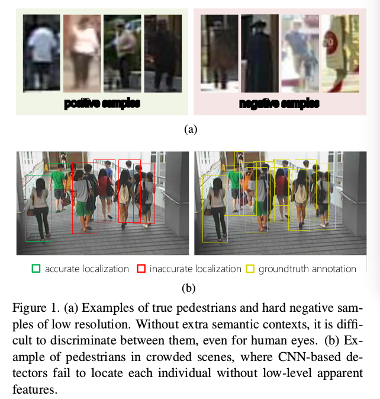
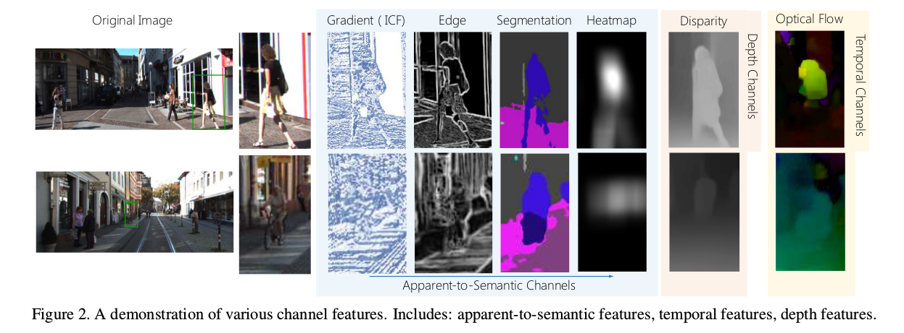
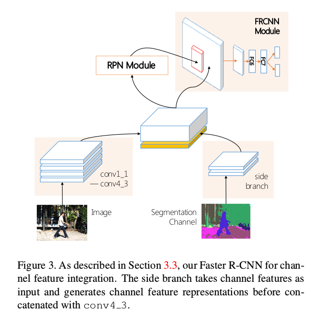
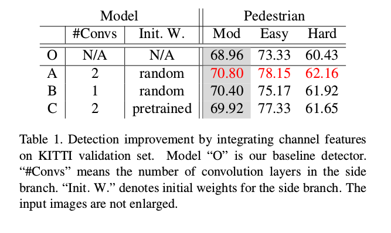
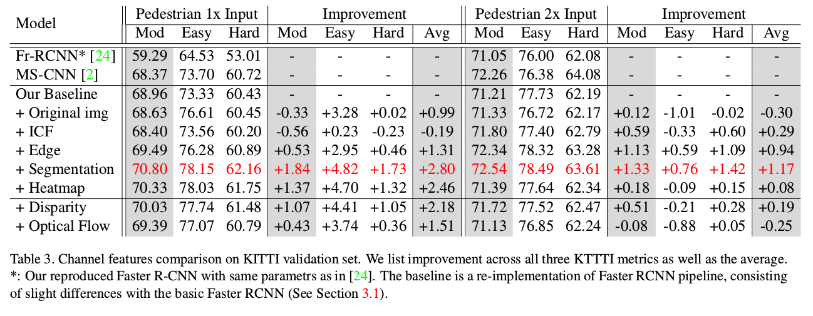
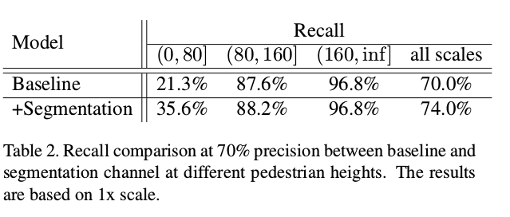
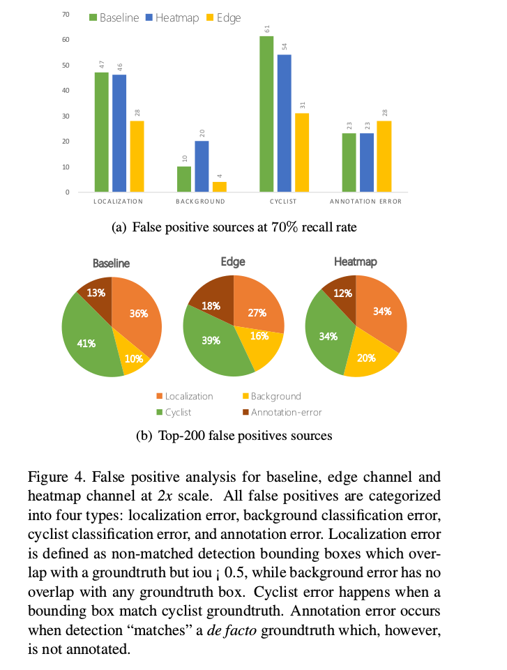
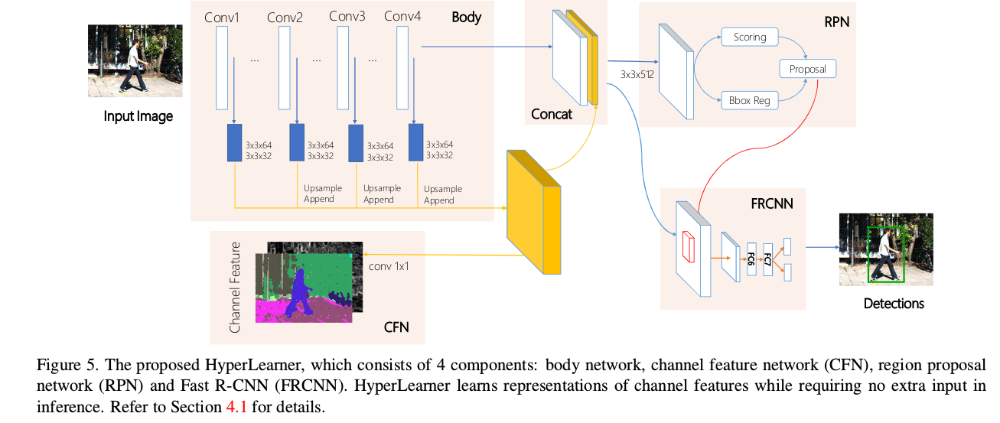
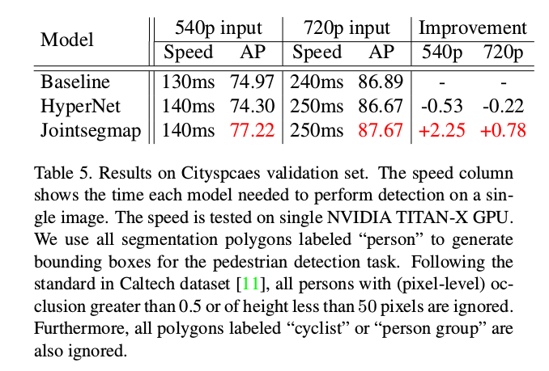
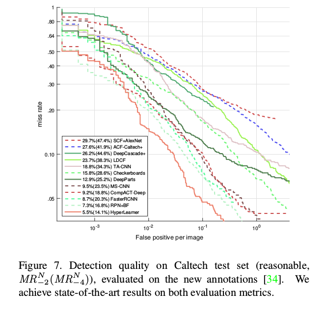

What Can Help Pedestrian Detection?
=

# 1. Introduction
行人检测作为许多现实世界任务中的第一步也是最基本的步骤，例如人类行为分析、步态识别、智能视频监控和自动驾驶，在过去十年中引起了人们的广泛关注[11,26,10,35， 33,30]。然而，虽然深度卷积神经网络在通用对象检测上做出了巨大进步，但是，考虑到两个主要挑战，行人检测领域的研究仍然没有累积进步。

首先，相比一般对象，行人很少能从背景中辨别。换句话说，这种辨别能力依赖更多的语义上下文。如图1（a）所示，通常以低分辨率（小于20×40像素）出现，行人与杂乱的背景一起带来硬阴性样本（hard negative example），例如交通标志、支柱盒和购物窗口中的模特，与行人有非常相似的外观特征。没有额外的语义上下文，检测器在如此低分辨率输入下工作，不能在它们之间区分它们，导致召回率的降低和 False Positive 的升高。

如何准确地定位每个行人是第二个挑战。图1（b）为实际应用中的一个案例，其中行人在拥挤场景中站得非常接近。因此，检测器通常不能逐个单独地定位，从而产生许多 False Positive 。当卷积和池化层生成高级语义激活图时，这个问题对于基于 CNN 的检测甚至更糟，它们也模糊了非常接近的实例之间的边界。一种处理该问题的只管替代方法是使用额外的低级外观特征（如边缘），通过给检测器提供详细的外观信息达到解决定位缺点的问题。

此外，在许多应用中，检测器也可以其他信息获益，如当深度传感器装备有相机时，使用深度（depth），或者当视频输入时，使用时序信息。然而，检测器如何使用这些信息也不是清楚的，特别是基于 CNN 的检测器。

鉴于上述观察，一个问题自然地被提出： _哪种额外的特征是有效的，以及它们是如何切实地改善基于 CNN 的行人检测器？_ 本文旨在回答这个问题，并探索行人检测任务中不同额外特征的特点。本文的贡献为：
- 首先，我们将额外的特征作为输入通道集成到基于 CNN 的检测器。为了研究三组通道特征： apparent-to-semantic channels、 temporal channels 和 depth channels ，扩展实验在 KITTI 行人数据集上进行。
- 然后，我们实验性的分析了不同种类的通道特征的优势和劣势。具体地，我们量化了不同通道特征带来的改善，以对误差源进行深入了解。
- 最后，提出一种新颖的网络架构（称为 HyperLearner ）以多任务学习的形式聚合额外的特征。在 HyperLearner 中，通道特征被聚合为监督，而不是额外的输入，因此，它能够使用给定特征的信息，并提高减小性能，而在推理时，不需要额外的输入。我们验证了 HyperLearner 在几个行人检测基准测试上的的有限性，并获得最佳性能。

# 2. Related work
传统的行人检测器，扩展自 Viola 和 Jones 范式[27]，例如 ACF、LDCF 和 Checkerboards ，在将他传入提升决策森林之前过滤不同的 Integral Channels Features（ICF），主导行人检测领域多年。在加上卷积神经网络的普及，基于 CNN 的模型[17,33,2]行人检测结果推向一个从未达到的高度。在[33]中，给出了通过 RPN 生成的区域提议，RoI 池化层提取的 CNN 特征被传入提升森林；而在 Cai等人[2]中，一个下游神经网络架构被提出一致性端到端的检测。

集成不同类型的通道特征已被证明在基于决策森林的行人检测器中是有用的。Park等人[23]的工作将光流嵌入到提升决策森林中以改进视频片段中的行人检测器。CCF[32]使用 ImageNet 预训练的 VGG-16 网络的激活图作为通道特征，而 Costea 和 Nedevschi [8] 使用语义场景解析热图，其中检测器从具有更大感受野的语义信息中获益。然而，基于 CNN 的行人检测是否能够或者如何能够从额外的特征中获益，仍然缺乏研究。

# 3. Channel features for pedestrian detection
## 3.1. Preliminaries
在深度探索我们的实验之前，我们首先描述数据集、评估度量和使用的基线。

**KITTI dataset** 我们选择 KITTI 数据集进行通道特征的分析，因为其拥有多个场景中不同尺度的行人，也有相邻帧和立体数据信息。KITTI 包含 7481 张分辨率为 $1250 \times 375$ 的标签图像，以及另外 $7518$ 张图像用于测试。训练数据集根据[5]进一步划分为两个独立的数据集进行训练和验证。KITTI 中人的类别分为两个子类： pedestrian 和 cyclist ，两者都在 PASCAL 标准下评估。KITTI 包含三种评估指标： easy 、 moderate 和 hard ，具有不同的最小边界框高度、最大遮挡级别等。标准评估遵循适度的指标。

**Faster R-CNN** 我们基线检测器是 Fast R-CNN[24]，使用 ImageNet 预训练的 VGG-16 权重初始化。其由两个部分组成： 全卷积的 RPN 用于提议生成，以及使用高前景可能性的区域作为输入的下游的 Fast R-CNN（FRCNN）检测。

由于KITTI包含大量的小对象，我们稍微修改了框架，如[30]和[2]。具体地，我们将锚点数量从 3 个尺度和 3 个纵横比调整为 5 个尺度和 7 个纵横比；此外，所有的 conv5 层被移除以为 RPN 和 FRCNN 保留高分辨率的激活图。

我们选择 Faster R-CNN 不仅因为它的流行性和最先进的性能，而且还有普遍性：当在其他基于CNN的行人探测器中应用类似技术时，我们的观察应该保持最有效。

## 3.2. Introduction to channel features
本节中，我引入集成到基于 CNN 行人检测器的通道特征。根据它们携带的信息类型，选择的集成通道功能分为三组：apparent-to-semantic channels, temporal channels and depth channels 。图 2 提供所有通道的示范。

**Apparent-to-semantic channels** 该组通道包含 ICF 通道、边缘通道、分割通道和热图通道。这些通道中的信息覆盖低级外观到高级语义。

ICF 通道为由 LUV 颜色通道、梯度大小通道和 HOG 组成的手工特征通道，其广泛用于基于决策森林的检测器 [9,22,34] 。ICF通道仅包含局部块中的颜色和梯度，代表图像中最低级但详细的信息。

边缘通道从 HED 网络的第二和第三层提取。不同于如 Canny 的传统边缘检测器，HED 框架产生更多的语义意义的边缘图（如图2）。因此，边缘通道被视为包含详细外观以及高级语义的中级特征通道。

如[20,4]，全卷积网络在 MS-COCO 数据集上训练以生成语义分割通道，其中每个像素表示输入某个类的概率（例如人和街道的概率）。分割通道携带高级语义信息，同时仍然保留一些详细的外观特征，即不同类别之间的边界。然而，在没有每个实例的轮廓的情况下，在分割通道中不能将两个相同类别的紧密放置的实例彼此区分开。

此外，为了获得仅有高级语义的特征通道，我们将分割通道模糊到热图通道中。通过这样做，也消除了不同类别的对象之间的清晰边界，并且仅保留了类别的高级信息。

**Temporal channels** 时序特征（如光流和运动）已被证明对工作于视频的传统行人检测器有益。我们测试在基于 CNN 框架中它们的性能，我们使用时间上相邻的帧提取光流通道作为代表。

**Depth channels** 随着越来越多的深度传感器用于只能系统，如机器人和自动驾驶，这些任务中可用的深度信息成为增强检测器的另一种额外通道功能。我们转而使用 DispNet [21]来重建立体图像中的视差通道，而不是使用激光雷达捕获的稀疏点云。

## 3.3. Integration techniques
我们通过在VGG-16主流旁边创建一个新的浅层侧分支（side branch）来集成通道特征（参见图3）。这个侧分支由几个卷积层（核大小为 3， 填充为 1， 步长为 1）和最大池化层（核大小为 2，步长为 2）组成，输出大小为输入 $1/8$ 的128通道的激活图，其进一步与激活图 conv4_3 联结。联结激活图被传入 RPN 和 FR-CNN 以执行检测。

我们实验不同的侧分支组成： 卷积层的数量和初始权重（即随机高斯或者预训练权重）。我们用于预训练侧分支的技术是训练 Faster R-CNN 检测器，该检测器完全依赖于侧分支并且利用来自该网络的权重初始化侧分支。

总结在表1中，所有集成方法都改进了所有三个指标中两个类的 KITTI 验证集中基线 Faster R-CNN 检测器。有两个额外卷积层的模型由于仅有一个额外卷积层的模型。当进一步与 VGG-16 网络集成时，预训练的侧分支没有良好地执行。当探测网络时，我们发现具有预训练权重的模型倾向于更多地“依赖”侧分支，（即，由侧分支产生的激活图具有比主流更大的值）。考虑到侧分支被预训练以独立地执行检测的事实，这种不平衡可能是导致性能下降的原因。基于这些分析，在未来的试验中，我们使用两个随机高斯初始化的卷积层。

## 3.4. Comparison and analysis
我们在两个输入尺度（$1\times \mbox{ 和 } 2 \times$）执行实验。为了公平比较，还包括受控实验，其中原始图像用作侧分支的输入。

通常，与额外通道特征集成的模型显示出相对于基线的改进。使用原始图像作为额外输入的实验显示出非显而易见的改进，这证实了性能增益确实归因于通道特征集成。在所有通道特征中，ICF 通道在两个尺度上展示出对检测器性能最小的贡献。我们推测原因是，在深度卷积网络中，CNN 特征比如 HOG 的手工特征更具辨别性。

回顾行人检测两个主要挑战： hard negative samples 和 单独的定位。通过详细分析，我们证明基于 CNN 的检测器是如何从额外特征获益以克服这些问题。

**$1\times$ experiments** 在 $1\times$ 试验中，携带更多语义信息的通道表现出更好的性能。如表3所示，具有有分割通道和热图通道的检测器带来最显著的性能提高。根据我们前面的假设，检测器利用额外的通道特征提供的语义上线以从 hard negative samples 中辨别低分辨率的行人。

表 2 提供了在某个准确率（70%）下有分割通道的模型和基线模型对不同大小的行人检测的召回率的比较。平均领先 4％ 的召回率，具有分割通道的探测器在小行人（高度小于或等于80像素）的召回中表现明显更好。

**$2\times$ experiments** 在 $2\times$ 实验中，相比 $1 \times$ 的实验，仅有高级语义而没有低级外观特征（即热图通道）没能产生相对与基线的一致的性能提高。尽管如此，具有高级语义和低级外观信息（边缘通道和分割通道）的通道特征由于其他通道。对此的一个可能的解释是，当输入大尺度时，低级细节（例如变换）在检查中表现得更重要。为了进一步探索这种现象，我们从验证集中随机采样 $1/4$ 的图像（大约800），并手机了 70% 召回率下的假阳性统计，如图4（a）。而在图4（b）中，我们也统计了验证集中 top-200 假阳性，并展示出每种错误源的比例。不仅在高召回率下抑制所有类别的误报，边缘通道也对定位精度有显着贡献。与基线和带有热图通道的检测器相比，检测器与边缘通道集成后，定位误差率分别降低了 9％ 和 7％ 。这证明，当输入高分辨率的图像时，具有低级外观特征（例如个体之间的边界和对象轮廓）的通道特征提高定位准确率。

此外，当光流被集成到检测器中时，我们见证了1倍的显着改善。Park等[23]也通过详细分析证明了这种基于决策森林的探测器的有效性。对于视差通道，结果与热图通道的结果非常相似。为了深入了解这一点，我们应该注意到视差图中的相对值也可以作为“类似分段”的通道（见图2），而与深度卷积特征和预定义的锚点相比，绝对值只有有限的影响。

# 4. Jointly learn the channel features
将通道特征集成到网络中可以增强我们的检测器处理低分辨率和高分辨率的图像。使用这些通道特征，我们可以缩小分辨率之间的大部分差距，而不会通过扩大输入图像带来沉重的计算成本，并推动最先进的技术发展。

鉴于额外的通道特征通常来自另一个神经网络的馈送，因此对于基本的 Faster R-CNN 而言，蛮力集成方法在计算上是昂贵的。当许多通道特征来自神经网络（例如，语义分割和边缘）时，便很自然地认为“教导”我们的神经网络的通道特征生成和检测。在接下来的章节中，我们提出一种新的网络结构，其适合多任务学习，称为 HyperLearner 。

## 4.1. HyperLearner
HyperLearner 框架如图 5 所示，该系统有四个部分组成：用于激活地图生成的主体网络，通道特征网络（CFN），区域提议网络（RPN）和用于最终检测任务的 Faster R-CNN（FRCNN）网络。

最左边，整幅图像向前传递通过多个卷积层以生成分层的激活图。我们首先聚合激活图并将它们组成一个统一的空间，即聚合激活图。来自多个级别的聚合激活图被证明在许多计算机视觉任务中是有用且重要的，这是因为其能够收集丰富的层次表征。然后，这种聚合图被传入通道特征网络（CFN）。CFN 是用于通道特征检测的前馈全卷积网络。不同于 Faster R-CNN，RPN和FRCNN 不仅仅将最后的卷积层（conv4_3）的输出作为输入，相反，聚合特征图也会传入传入 RPN 和 FRCNN 。通过共享相同的聚合激活图，RPN 和 FRCNN 也能够从 CFN 学习的表征中受益。

**Aggregated activation map** 主体网络将原始图像 $3 \times H \times W$ 作为输入，并输出几个激活图。在我们的试验中，主题网络为使用ImageNet预训练的权重初始化的 VGG-16 网络（没有 conv5_1 到 conv5_3）。我们从 conv1_2、 conv2_2、 conv3_3 和 conv4_3 提取激活图。由于网络中的池化层，这些图具有不同大小和通道数。我们在每个图后添加连个卷积层，并使它们的通道数相同（所有试验中都为 32 ）。然后，高级特征被上采样成与第一个激活图相同的大小。最后，它们被连接到一起组成聚合激活图。

**Channel Feature Network（CFN）** CFN 通过一个全卷积结果，直接使用聚合激活图以产生预测的通道特征图。该图的大小通常与原始图像相同。例如，预测通道图可能是几个类的语义分割图，或类似 HED 网络的边缘检测图。

**Region Proposal Network（RPN）and Fast-RCNN（FR-CNN）** RPN 和 FRCNN 与[24]中提出的结构相同。RPN 和 FRCNN 用 VGG-16 网络最后的卷积激活图（conv4_3）和从主体网络的聚合激活图作为输入。RPN 生成的提议被传入 FRCNN 以执行最终的检测。

## 4.2. Training Details
**Loss Function** 在训练阶段，处理用于标准 Faster R-CNN 框架的原始图像和 ground-truth 边界框外，HyperLearner 还将通道特征图作为其监督，其通常通过其他的 CNN（如语义分割和边缘）生成。为了处理通道特征学习，我们引入一种新的像素说你是。将 CFN 预测的特征图表示为 $C_{x,y}$ ，监督图表示为 $S_{x,y}$ 。损失计算为 $\frac{1}{H \times W} \sum_{(x,y)}L(S_{x,y}, C_{x,y})$ ，其中 $H$ 和 $W$ 表示特征图的大小，$L$ 是单个像素的损失函数。在二值概率图中，如边缘图，使用交叉熵损失： $L(p, q)=\beta_{x,y}(-p\log q - (1 - p)\log(1-q))$ ，其中 $\beta$ 为平衡正类标签和负类标签的权重函数。如果 $S_{x,y} > 0.5$ ， $\beta = 1- |S_+| / |S|$ ；否则，$\beta = |S_+| / |S|$ ，其中 $|S_+| = \sum 1[S_{x,y} > 0.5]$ 。对于多类概率图，如分割图，使用交叉损失。对于其他任务，使用 MSE 损失。

网络的最终损失为 $L = L_{CFN} + \lambda_1 L{RPN_{cls}} + \lambda_2 L_{RPN_{bbox}} + \lambda_3 L_{FRCNN_{cls}} + \lambda_4 L_{FRCNN_{bbox}}$ ，在所有试验中，设置 $\lambda_i = 1$ 。

**Multi-stage training** 聚合激活图在框架中扮演着重要角色，其必须被仔细训练。我们采用务实的多阶段训练方法，而不是巧妙地为每个损失部分设置权重。整个训练过程分为 4 个阶段。

第一个阶段，仅优化 CFN 。细节上，我们固定主体网络中所有预训练卷积层的是参数（conv1_1 到 conv4_3），并丢弃所有的 RPN 和 FRCNN 层以训练 CFN 。在第二阶段，我们固定全部主体网络（包括用于聚合激活图的卷积层）和 CFN ，并仅训练 RPN 。在第三阶段，主体网络、CFN 和 RPN 被固定，仅优化 FRCNN 部分。最后阶段，所有层联合优化。跨越所有阶段，在FRCNN的优化中，我们将来自 RPN 的区域提议坐标视为固定值，并且不反向传播梯度。

# 5. Experiments and results
HyperLeaner 的性能在多个行人数据集上评估： KITTI、Caltech Pedestrian 和 Cityscapes 。

## 5.1. KITTI Dataset
我们评估了两种特征监督的 HyperLearner 的性能： 边缘和语义分割。当直接集成到 Faster R-CNN时，这两种通道特征被证明是有效的。KITTI 验证集上结果如表 4 所示。

## 5.2. Cityscapes dataset

## 5.3. Caltech dataset

