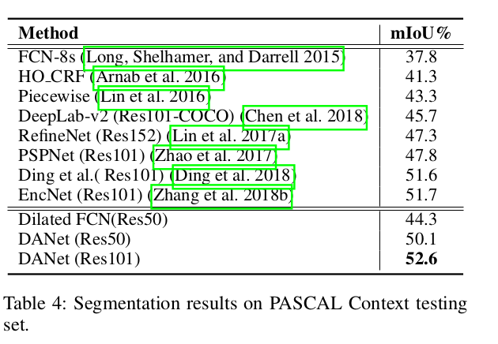

Dual Attention Network for Scene Segmentation
=

# 解决的问题
场景分割是一个基本且具有挑战性的问题，其目标是将场景图像分割和解析成与语义类别相关联的不同图像区域，包括填充物（例如天空，道路，草地）和离散物体（例如人，汽车，自行车）。为了有效地完成场景分割的任务，我们需要区分一些混淆的类别并考虑具有不同外观的对象。例如，“田地”和“草地”的局部特征在某些情况下是难以区分的，并且道路的不同位置中的“汽车”可能具有不同的尺度、遮挡和照明变化。因此，有必要增强用于像素级识别的特征表示的能力。

# 贡献
- 提出Dual Attention Network（DANet）以捕获空间和通道维度全局特征依赖。
- 提出位置注意力模块（Position Attention Module）以学习特征的相互依赖，通道注意力模块（Channel Attention Module）设计用于建模通道的相互依赖。它们通过在局部特征上建模丰富的上下文依赖关系，显着改善了分割结果。
- 在三个流行基准测试（包括Cityscapes、PASCAL Context和COCO Stuff数据集）上取得最佳结果。

# Dual Attention Network

使用预训练的具有膨胀策略的残差网络，我们去除最后两个ResNet块中的下采样操作，并采用膨胀卷积，因此最终特征图的大小扩到输入图像的 $1/8$ 。然后来自膨胀残差网络的特征被传入两个并行的注意力模块。最后聚合来自两个注意力模块的输出特征以获得更好的特征表示用来进行像素级预测。

# Position Attention Module

如上图所示，给定局部特征 $A \in \Bbb R^{C \times H \times W}$ ，首先将其馈入具有批归一化和ReLU的卷积层以分别生成两个新的特征图 $B$ 和 $C$ ，其中 $\{B, C\} \in \Bbb R ^{H \times W}$ 。然后，将它们重塑为 $\Bbb R ^ {C \times N}$ ，其中 $N = H \times W$ 为特征的数量。之后，我们 $C$ 的转置和 $B$ 之间执行矩阵乘法，并应用softmax层以计算空间注意力图 $S \in \Bbb R^{N \times N}$ ：
$$s_{ji} = \frac{\exp(B_j \cdot C_j)}{\sum_{i=1}^N \exp(B_i \cdot C_j)}  \tag 1$$
其中 $s_{ji}$ 衡量第 $i$ 个位置对第 $j$ 个位置的影响。注意，两个位置的特征表示越相似，对它们之间的相关性越大。

与此同时，我们将特征 $A$ 馈入带批归一化和ReLU的卷积层以生成新的特征图 $D \in \Bbb R^{C \times H \times W}$ ，并将它们重塑为 $\Bbb R ^{C \times N}$ 。然后，我在 $D$ 和 $S$ 的转置之间执行矩阵乘法，并将结果重塑为 $\Bbb R^{C \times H \times W}$ 。最后，我们将结果乘以一个缩放参数 $\alpha$ ，并与特征 $A$ 进行逐元素的和运算以获得最终的输出 $E \in \Bbb R^{C \times H \times W}$ ：
$$E_j = \alpha \sum_{i=1}^N (s_{ji} D_i) + A_j  \tag 2$$
其中 $\alpha$ 初始化为 0 ，并逐渐地学习以分配更多的的权重。从式（2）可以推断出，每个位置产生的特征 $E$ 为所有位置的特征和原始特征的权重和。因此，它具备全局上下文视野，并根据空间注意力图选择性地聚合上下文。此特征表示实现了相互增益，并且对于场景分割更加稳健。

# Channel Attention Module

高级特征的每个通道图可以视为类别特定的相应，并且不同的语义相应与其他响应关联。通过利用通道图之间的相互依赖，我们能够强调特征图之间的相互依赖，并改善特定语义的特征表示。因此，我们构建通道注意力图以显示建模通道之间的相互依赖。

通道注意力模块的结构如上图。不同于位置注意力模块，我们从原始特征 $A \in \Bbb R^{C \times H \times W}$ 直接计算通道注意力图 $X \in \Bbb R ^{C \times C}$ 。具体地，将 $A$ 重塑为 $\Bbb R ^ {C \times N}$ 。然后，在 $A$ 和 $A$ 的转置之间执行矩阵乘法，最后应用softmax层以获得通道注意力图 $X \in \Bbb R ^ {N \times N}$ :
$$x_{ji} = \frac{\exp(A_i \cdot A_j)}{\sum_{i=1}^C \exp(A_i \cdot A_j)}  \tag 3$$
其中 $x_{ji}$ 衡量第 $i$ 个通道对第 $j$ 个通道的影响。此外，在 $X$ 的转置和 $A$ 之间执行矩阵乘法，并将它们的结果重塑为 $\Bbb R^{C \times H \times W}$ 。然后，将结果与缩放参数 $\beta$ 相乘，并与 $A$ 执行逐元素和运算以获得最终输出 $E \in \Bbb R ^ {C \times H \times W}$ :
$$E_j = \beta \sum_{i=1}^C(x_{ji}A_i) + A_j \tag 4$$
其中 $\beta$ 从0逐渐学习权重。式（4）表明每个通道的最终特征是所有通道特征与原始特征的权重和，其建模特征图之间的长期语义依赖。它强调类别依赖的特征图，并有助于提升特征辨别能力。不同于最近通过全局池化或Encoding Layer来利用特征关系的工作，我们利用所有相应位置的空间信息以建模通道相关性。

# Attention Module Embedding with Networks
为了利用长期依赖，我们聚合来自上述两个注意力模块的特征。具体地，我们通过一个卷积层变换两个注意力模块的输出，并执行逐元素和以完成特征融合。之后跟一个卷积层以生成最后的预测图。注意，我们的注意力模块不增加过多的参数，也有效加强特征表示。

# Experiments
## Implementation Details
我们采用“poly”学习率策略，其为初始学习率乘以 $(1 - \frac{iter}{total\_iter}) ^ {0.9}$ 。Cityscapes的基础学习率为 0.01，其他为0.001 。momentum为0.9，weight decay为0.0001 。采用随机剪裁和左右翻转。

## Results on Cityscapes Dataset
**Ablation Study for Attention Modules**

**Ablation Study for Improvement Strategies**
6 个图像尺度{0.75 1 1.25 1.5 1.75 2}用于推理。

**Comparing with State-of-the-art**

