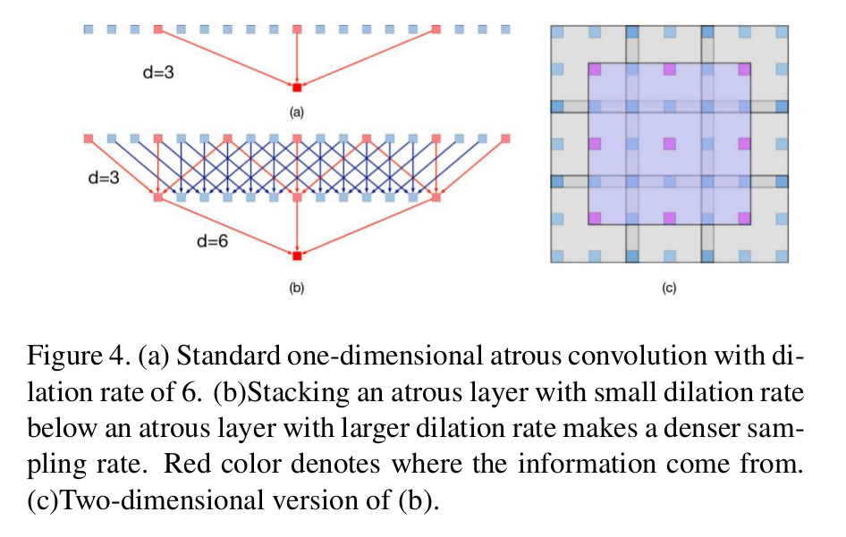

DenseASPP for Semantic Segmentation in Street Scenes
=

# 1. Introduction
Atrous 卷积能够获得更大的感受野尺寸，而不增加核的参数量。atrous卷积产生的特征图大小与输入相同，但是每个神经元处理的输出更大的感受野，因此，编码更高级的语义。

尽管 atrous 卷积解决了特征图和感受野大小之间的矛盾，但是由atrous卷积的特征图简单生成语义掩模的方法仍然遭遇局限。具体地，atrous卷积的特征图中的所有神经元共享相同的感受野大小，这意味着语义掩模生成过程仅利用了单一尺度的特征。然而，经验[24,2,3]表明，多尺度信息将有助于解决模糊的情况并产生更强大的分类。为此，ASPP提出联结由具有不同膨胀率的 atrous 卷积生成的特征图，使得输出特征图中神经元包含多感受野大小，这编码了多尺度信息，并实际上提升性能。

然而，ASPP 仍然遭遇另一个局限。具体地，自动驾驶场景下的输入图像具有高分辨率，这要求神经元具有甚至更大的感受野。为了在ASPP中获得足够大的感受野，必须使用一个足够大的膨胀率。然而，随着膨胀率的增加（例如，$d > 24$），atrous 卷积变得越来越无效，并逐渐丧失建模能力。因此，设计能够编码多尺度信息，以及同时获得足够大的感受野尺寸的网络结构非常重要。

这启发我们提出Dense Atrous Spatial Pyramid Pooling（DenseASPP）来解决街景中挑战性的尺度变化，如图1所示。DenseASPP在基础网络后接级联的atrous卷积层组成。它使用密集连接将每个 atrous 卷积层的输出馈送到前面所有未访问的 atrous 卷积层，见图2。在DenseASPP中，每个 atrous 卷积仅使用合理膨胀率（$d \le 24$）的 atrous 卷积滤波器。通过一系列的 atrous 卷积，后面层的神经元获得越来越大的感受野，而不遭遇ASPP中核衰退问题。并且，通过一系列特征联结（concatenation），每个中间的特征图编码多个尺度的语义信息，并且不同的中间特征图编码不同尺度范围的多尺度信息。因此，DenseASPP的最终输出特征图不仅覆盖大尺度范围的语义信息，而且以非常密集的方式覆盖那个范围，如图3 。

总之，本文作出两个如下贡献：  
1. DenseASPP 能够生成覆盖非常大尺度范围（感受野范围）的特征。
2. DenseASPP 的生成特征图能够以非常密集的方式覆盖上述尺度范围。

# 2. Related Work

# 3. Dense Atrous Spatial Pyramid Pooling
## 3.1. Atrous Convolution and Pyramid Pooling
Atrous 卷积最先在FCN[14]中引入以增加感受野，同时保持特征图的分辨率不变。以一维为例，令 $y[i]$ 表示输出信号，$x[i]$ 表示输入信号，atrous 卷积可以表示如下：
$$y[i] = \sum_{k=1}^K x[i+d \cdot k] \cdot w[k] \tag 1$$
其中 $d$ 为膨胀率， $w[k]$ 表示滤波器的第 $k$ 参数， $K$ 为滤波器的大小。当 $d=1$ 时，上式变为标准卷积。Atrous 卷积相当于将输入 $x$ 与通过在两个连续滤波器值之间插入 $d-1$ 个零而产生的上采样滤波器进行卷积。因此，大型膨胀率意味着大型感受野。

在街景分割中，对象通常具有非常大的尺寸。为了处理这种情况，特征图必须覆盖不同尺度的感受野。为了这个目标，DeepLabV3提出两种策略，即级联（cascading）和并行（parallel）的具有不同膨胀率的几个atrous 卷积层。在级联模式中，由于更高的 atrous 层接收更低 atrous 层的输出，因此，它能够有效地产生大感受野。在并行模式中，由于多个 atrous 层接收相同的输入，并且它们的输出被联结到一起，因此，获得的输出的确是不同尺度感受野输入的采样。并行模式被正式称为ASPP，它是[2]中Atrous Spatial Pyramid Pooling的缩写。

为了简化符号，我们使用 $H_{K,d}(x)$ 来表示一个不稳定的卷积，并因此将ASPP写为
$$y = H_{3,6}(x) + H_{3,12}(x) + H_{3,18}(x) + H_{3,24}(x) \tag 2$$
在这项由DenseNets [8]推动的工作中，我们进一步将级联和并行策略的界限推向了一种新颖的架构，该架构能够生成比[3]更密集的缩放感受野。

## 3.2. Denser Feature Pyramid and Larger Receptive Field

DenseASPP的结构如图2（a）所示。Atrous 卷积层以级联的方式组织，其中每层的膨胀率一层一层地增加。膨胀率小的层放在下部，而膨胀率大的层放在上部。每个 atrous 层的输出与输入特征图和更底层的所有输出联结，并且联结的特征图被馈入接下来的层。DenseASPP最终的输出是多种膨胀率、多个尺度的 atrous 卷积生成的特征图。所提出的结构仅使用一些 atrous 卷积层同时组合更密集和更大的特征金字塔。遵循式（2），DenseASPP的每个 atrous 层可以表示如下：
$$y_l = H_{K, d_l}([y_{l-1}, y_{l-2}, \cdots, y_0]) \tag 3$$
其中 $d_l$ 表示层 $l$ 的膨胀率， $[\cdots]$ 表示联结操作。 $[y_{l-1}, \cdots, y_0]$ 表示所有先前层输出联结而成的特征图。与原始的ASPP相比，DenseASPP将所有膨胀层堆叠在一起，并且使用密集连接将它们连接。这种改变带来两个方面的收益： _denser feature pyramid_ 和 _larger receptive field_ 。

### 3.2.1 Denser Feature Pyramid
DenseASPP构成比ASPP中更密集的特征金字塔。“denser”这个词不仅意味着特征金字塔的更好的尺度多样性，而且意味着卷积中涉及的像素多于ASPP中的像素。

**Denser Scale Sampling：** DenseASPP 使用一种有效采样不同尺度输入的有效架构。DenseASPP的关键设计是使用密集连接来实现具有不同扩张速率的各种层的集成。每个集成等价于不同尺度（即不同感受野）的核。因此，我们得到的特征图比 ASPP [2]中有更多的尺度。

膨胀能够增加卷积核的感受野。对于膨胀率为 $d$ 和核大小为 $K$ 的 atrous 卷积层，相等的感受野为：
$$R = (d - 1) \times (K - 1) + K \tag 4$$
例如，对于 $d=3$ 的 $3 \times 3$ 卷积层，相应的感受野大小为 7 。

将两个卷积层堆叠到一起可以获得更大的感受野。假设，我们有滤波器核大小分别为 $K_1$ 和 $K_2$ 的两个卷积，新的感受野为：
$$K = K_1 + K_2 - 1 \tag 5$$
例如，核大小为 7 的卷积层和核大小为 13 的卷积层堆叠产生大小为 19 的感受野。

图3表示DenseASPP简化的特征金字塔以帮助读者更好地理解其尺度多样性。DenseASPP由 $3, 6, 12, 18$ 的膨胀率构成。每个条带中的数字代表不同膨胀率的组合，每个条带的长度代表每种组合的等效核尺寸。很明显，堆叠的 atrous 层之间的密集连接能够构成具有更密集的尺度多样性的特征金字塔。DenseASPP集合的感受野是ASPP中的超集。

**Denser Pixel Sampling：** 与ASPP相比，DenseASPP在特征金字塔的计算中获得了更多的像素。ASPP使用4个 atrous 卷积层构成特征金字塔，膨胀率为6,12,18,24。与相同感受野的传统卷积层相比，具有大扩张率的 atrous 卷积层的像素采样率非常稀疏。

图4（a）展示传统一维 atrous 卷积层，其膨胀率为 6 。这个卷积层感受野为 13 。然而，在如此大的核中，仅有三个像素被采样用于计算。这种现象在二维情况下更糟。尽管获得较大的感受野，但是在计算过程中丢失了许多信息。

这种情况在DenseASPP中大不一样。在DenseASPP中，膨胀率逐层增加，因此，较上层的卷积可以利用较低层的特征，并使像素采样更密集。图4（b）展示了这个过程： 将具有膨胀率 3 的 atrous 层置于具有膨胀率6的层下方。对于原始的膨胀为 6 的 atrous 层，7 个像素的信息对最终计算有贡献，其比原始的 3 个像素更密集。在二维情况中，49个像素将有助于最终预测，而在标准的单层扩张卷积中，只有9个像素有贡献。当膨胀率变大时，这种现象变得更加明显。图4（c）展示了2D版本的现象。具有较大膨胀率的卷积层可以从具有较小膨胀率的滤波器获得帮助，并以更密集的方式对像素进行采样。

### 3.2.2 Larger Receptive Field
DenseASPP带来的另一个好处是更大的感受野。在传统的ASPP中 atrous 卷积层以并行的方式工作，并且四个分支在前馈过程中不共享任何信息。相反，DenseASPP中的 atrous 卷积层通过 skip 连接共享信息。膨胀率小和膨胀率大的层相互依赖地工作，其中前馈过程不仅构成更密集的特征金字塔，而且还赶上更大的过滤器以感知更大的上下文。

遵循式（5），令 $R_{max}$ 表示特征金字塔最大的感受野，函数 $R_{K, d}$ 表示核大小为 $K$ 和膨胀率为 $d$ 的卷积层的感受野。因此，$ASPP(6, 12, 18, 24)$ 的最大感受野为：
$$
\begin{alignat}{2}
R_{max} &= \max [R_{3, 6}, R_{3, 12}, R_{3, 18}, R_{3, 24}]  \\
& = R_{3, 24}  \\
& = 51
\end{alignat} \tag 6
$$
而在 $DenseASPP(6, 12, 18, 24)$ 中，最大感受野为：
$$
\begin{alignat}{2}
R_{max} &= R_{3, 6} + R_{3, 12} + R_{3, 18} + R_{3, 24} \\
&= 122
\end{alignat}  \tag 7
$$
如此大的感受野能够为高分辨率图像中的大型对象提供全局信息。例如，Cityscapes的分辨率为 $2048 \times 1024$ ，并且我们的分割网络的最后的特征图大小为 $256 \times 128$ 。 $DenseASPP(6, 12, 18, 24)$ 覆盖大小为 122 的特征图，而 $DenseASPP(3, 6, 12, 18, 24)$ 覆盖大小为 128 的特征图。

## 3.3. Model Size Control
为了控制模型大小并防止网络变得太宽，我们遵循[8]，在DenseASPP的每个膨胀层之前添加一个 $1 \times 1$ 卷积层以减小特征图的深度为其原始大小的一半。此外，较薄的滤波器可以进一步控制输出的大小。

假设，每个 atrous 层输出 $n$ 个特征图，DenseASPP 有 $c_0$ 个特征图作为输入，并且第 $l$ 个膨胀层之前的第 $l$ 个 $1 \times 1$ 的卷积层有 $c_l$ 个输入特征图，我们有：
$$c_l = c_0 + n \times (l - 1) \tag 8$$
在我们的设置中，膨胀层之前的 $1 \times 1$ 卷积层将维度减少为 $c_0 / 2$ 个通道。并且，我们在DenseASPP的所有 atrous 层中设置 $n = c_0 / 8$ 。因此，DenseASPP的参数量可以计算如下：
$$
\begin{alignat}{2}
S &= \sum_{l=1}^L[c_l \times 1^2 \times \frac{c_0}{2} + \frac{c_0}{2} \times K^2 \times n]  \\
& = \sum_{l=1}{L}[\frac{c_0}{2}(c_0 + (l-1) \times \frac{c_0}{8}) + \frac{c_0}{2} \times K^2 \times \frac{c_0}{8}]  \\
&=\frac{{c_0}^2}{32}(15 + L + 2K^2) L
\end{alignat}  \tag 9
$$
其中 $L$ 是DenseASPP中 atrous 层数， $K$ 是核大小。例如，DenseNet121 的特征图有512个通道，因此，对于基于DenseNet121模型 $n$ 被设置为64 。此外，在atrous 层之前，特征图的通道数使用 $1 \times 1$ 卷积层减少到 256 。因此， $DenseASPP(3, 6, 12, 18, 24)$ 输出832通道的特征图，总共155640个参数，这远小于DenseNet121的模型大小（接近 $1\times 10^8$ 个参数）。

# 4. Experiments
## 4.1. Implementation Details
使用ImageNet预训练，首先移除最后两个池化层和最后的分类层，并将移除池化层后的卷积层的膨胀率分别设置为2和4以预训练权重可重用。修改后的卷积层的输出特征的分辨率是输入图像的 $\frac{1}{8}$ 。在特征图之后，使用具有19个 $1 \times 1$ 滤波器的卷积层来预测18个标签图，其进一步上采样8倍以使用ground-truth标签图来定义交叉熵损失。在我们的实现中，在每个权重层之前使用批量标准化[9]来简化训练并使其与来自不同层的连接特征图相比较。数据增强为随机水平翻转、 $[0.5, 2]$ 范围随机缩放、$[-10, 10]$ 范围内的随机亮度扰动以及 $512 \times 512$ 随机裁剪图像块。

使用初始学习率为 0.0003 和weight decay为0.00001的Adam优化器训练。通过将初始学习率乘以 $(1 - \frac{epoch}{max\_epoch})^{0.9}$ 来安排学习率。所有模型以大小为8的小批量训练 8 个epoch 。批归一化的统计量在整个小批量上更新。

### 4.1.1 DenseASPP
不同的DenseASPP的结构的影响。

### 4.1.2 Detailed study on DenseASPP components

