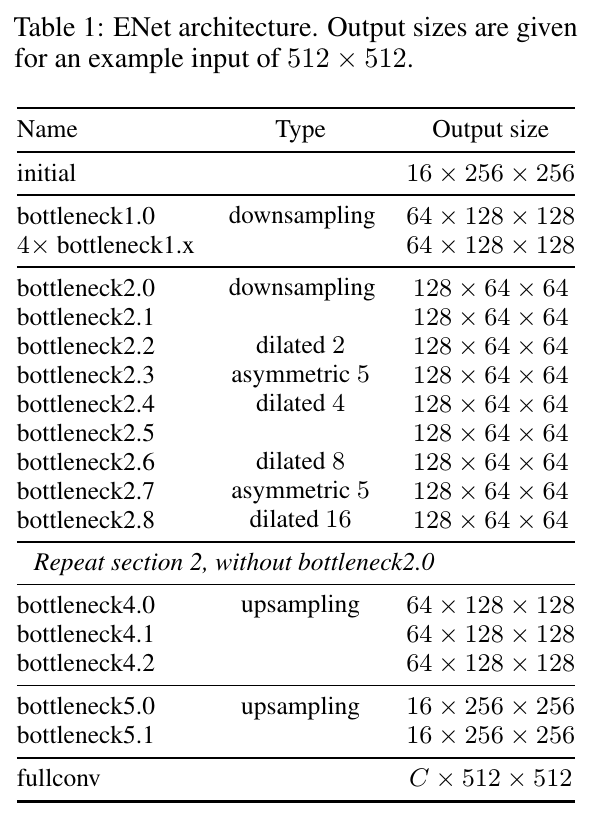
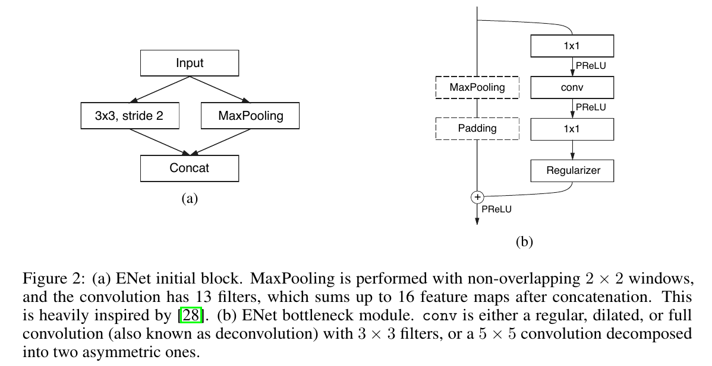
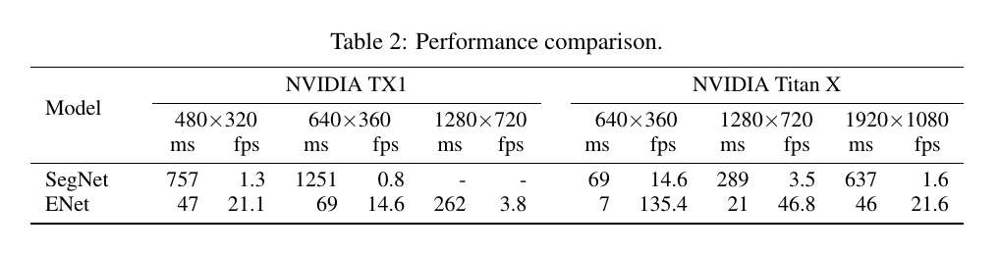
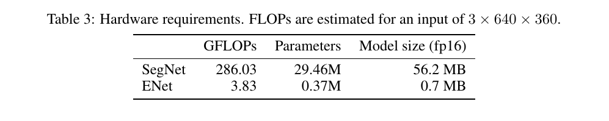
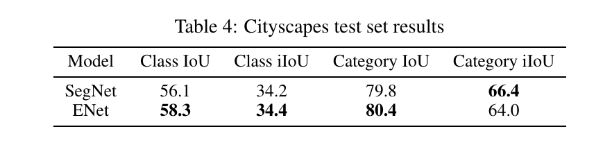
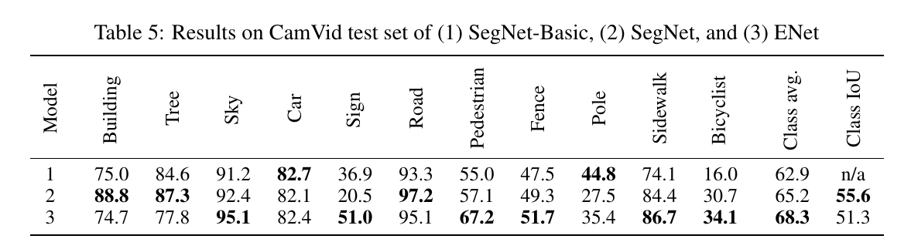

ENet: A Deep Neural Network Architecture for Real-Time Semantic Segmentation
=

# Abstract
在移动应用程序中，实时执行逐像素语义分段的能力至关重要。最近针对该任务的深度神经网络具有需要大量浮点运算并且具有阻碍其可用性的长运行时间的缺点。本文中，我们提出一种新颖的深度神经网络架构（称为ENet： efficient neural network），它创建为针对需要低延迟操作的任务。ENet的速度提高了18倍，FLOP要求减少了75倍，参数减少了79倍，并且为现有模型提供了类似或更好的精度。我们在CamVid、Cityscapes和SUN数据集上测试，并报告了与现有最佳方法的比较，以及网络准确率和处理时间的平衡（trade-off）。我们在嵌入式系统上展示了所提出架构的性能测量结果，并提出了可能使ENet更快的软件改进建议。

# 1 Introduction
最近对增强现实可穿戴设备、家庭自动化设备和自动驾驶车辆的兴趣产生了对可以在低功耗移动设备上实时操作的语义分割（或视觉场景理解）算法的强烈需求。这些算法将图像中的每个像素标记为对象类中的一个。最近几年，大型数据集和计算能力强大的机器的可用性已经帮助深度卷积神经网络（CNN）[1,2,3,4]超越了许多传统计算机视觉算法的性能[5,6,7]。尽管CNN在分类方面越来越成功，但当应用于图像的像素标记时，它们提供粗略的空间结果。因此，它们通过与其他算法级联以细化结果，例如基于分割的颜色或条件随机场等。

为了对图像进行空间分类和精细分割，已经提出了几种神经网络体系结构，例如SegNet[10,11]或全卷积网络[12]。所有这些工作是基于VGG-16架构，其为设计用于多类分类的非常大的模型。这些参考文献提出了具有大量参数和长推理时间的网络。在这些情况下，它们无法用于许多移动或电池供电的应用，这些应用需要以高于10fps的速率处理图像。

本文中，我们提出一种新的神经网络架构，其优化以快速推理和高准确率。使用ENet分割的图像的例子如图1所示。我们的工作中，我们没有选择使用任何的后处理步骤，这些后处理步骤当然可以与我们的方法结合，但是或弱化端到端CNN方法的性能。

第3节中，我们提出一个快速而紧凑的encoder-decoder架构，称为ENet。它根据最近文献中出现的规则和思想设计，其中所有的规则和思想在第4节中讨论。所提出的网络在驾驶场景的Cityscapes和CamVid上评估。我们在NVIDIA Jetson TX1嵌入式系统模块以及NVIDIA Titan X GPU上进行基准测试。 结果可以在第5节中找到。

# 2 Related Work
语义分割对于理解图像内容和发现目标对象非常重要。这种技术在诸如驾驶辅助和增强现实等应用中至关重要。而且，实时操作对他们来说是必须的，因此，仔细设计CNN至关重要。当代计算机视觉应用广泛使用深度神经网络，现在是许多不同任务中使用最广泛的技术之一，包括语义分割。这项工作介绍了一种新的神经网络架构，因此，我们的目标是以同样方式与执行绝大多数推理的其他文献进行比较。

最佳的场景解析CNN使用两个独立的神经网络架构：encoder和decoder 。受概率自编码器的启发[17,18]，encoder-decoder网络架构在SegNet-basic[10]中引入，并进一步在SegNet[11]中改进。编码其是一个CNN（例如VGG-16），其训练用以分类输入，同时解码器用于上采样encoder的输出[12, 19, 20, 21, 22]。然而，由于这些网络的大型架构和大量参数，它们在推断期间很慢。与FCN不同，VGG16的全连接层在SegNet的最新版本中倍丢弃，这是为了减小浮点操作的数量和内存，使得这些网络最小。不过，它们仍都无法进行实时操作。

其他已有的架构使用更简单的分类器，然后将它们与CRF（作为后处理步骤）级联[9, 23]。如[11]所示，这些技术使用繁重的后处理步骤，并且通常无法标记占用帧中较少像素数的类CN也可以与循环神经网络结合以提高准确率，但是它们遭遇速度衰退。此外，必须记住，用作后处理步骤的RNN可以与任何其他技术结合使用，包括本工作中提供的技术。

# 3 Network Architecture
我们的网络架构呈现在表1中。它分为几个阶段，如表中的水平线和每个块名称后的第一个数字所示。报告输出尺寸的示例输入图像分辨率为 $512 \times 512$ 。我们采用ResNets [24]的视图，将它们描述为具有单个主分支和带有与之分离的卷积滤波器的扩展，然后使用一个逐元素加法将它们融合，如图2b所示。每个块包含三个卷积层：一个 $1 \times 1$ projection 减小维度、一个主卷积层（图2b中的conv）和一个 $1 \times 1$ expansion 。我们在所有卷积之间放置BatchNorm和PReLU。就像在原始论文中一样，我们将这些称为瓶颈模块。如果瓶颈为下采样，添加一个对象池化层到主分支。此外，在两个维度中，第一个 $1 \times 1$ projection 替换为一个步长为2的 $2 \times 2$ 卷积。我们对激活进行零填充，以匹配特征图的数量。conv是具有 $3 \times 3$ 滤波器的规则、膨胀或全卷积（也称为deconv或fractionally strided conv）。有时，我们也将它替换为非对称个卷积，即$5 \times 1$ 和 $1 \times 5$ 的卷积序列。对于正则化，我们使用Spatial Dropout[27]，在bottleneck2.0之前 $p=0.01$ ，在这之后 $p =0.1$ 。

初始阶段包含一个单一的块，它在图2a中呈现。阶段1包含5个瓶颈层，同时阶段2和阶段3有相同的结构，除了阶段3没有在开始时下采样输入（我们消除了第0个bottleneck）。阶段4和阶段5属于解码器。

因为cuDNN使用单独的核进行卷积和偏置加法，为了减小核的调用次数和整体内存操作，我们任何的映射中都没有使用偏置项。这个选项对于准确率没有任何影响。在卷积层和接下来的非线性层之间，我们使用BatchNorm[25]。解码器重工的最大池化替换为max-uppooling ，并且padding替换为没有偏置的空间卷积。在最后的上采样模块中，我们没有使用池化索引，因为初始块在输入帧的三个通道上操作，而最终的输出有 $C$ 个特征图（对象类的数量）。此外，处于性能原因，我们决定仅将bare full卷积作为网络的最后一个模块，其单独占用解码器处理时间的相当大一部分。

# 4 Design Choices
本节中，我们将讨论我们的最重要的实验结果和直觉，其已经塑造了ENet的最终架构。

**Feature map resolution** 语义分割期间下采样图像有两个缺点。第一，减小特征图的分辨率意味着损失空间信息，如明确的边缘形状。第二，全像素分割要求输出与输入有相同的分辨率。这意味着强大的下采样将需要同样强大的上采样，这增加了模型大小和计算成本。第一个问题在FCN中通过添加有encoder产生的特征图得到解决，而在SegNet中，通过保存max-pooling中选择元素的索引来解决，并在解码器中使用它们以产生稀疏的上采样图。我们遵循SegNet的方法，因为它允许减小内存需求。我们仍发现强力的下采样损害准确率，并尝试尽可能地限制它。

然而，下采样有个大优势。下采样图像上的滤波操作有更大的感受野，其允许它们聚合更多的上下文。当试图区分诸如道路场景中的骑手和行人之类的类时，这尤其重要。网络了解人们的外表是不够的，它们出现的背景同样重要。最后，我们发现为此目的最好使用扩张卷积[30]。

**Early downsampling** 获得良好性能和实时运算的一个关键直觉是实现处理大型输入帧是非常昂贵的。这可能听起来很显然，但是许多流行的架构没有注意到网络早期阶段的优化，目前为止，这通常是最昂贵的。

ENet的前两个块极大地减小了输入尺寸，并仅使用一个小型的特征图集合。这种思想背后是视觉信息在空间上是高度冗余的，因此可有被压缩称更有效的表示。此外，我们的直觉是初始网络层不应直接对分类作出贡献。相反，它们应该作为良好的特征提取器，并且只对网络的后续部分进行预处理。这种思想在我们的实验中起到作用；在Cityscapes数据集中，将特征图数从16增加到32没有增加准确率。

**Decoder size** 本项工作中，我们希望提供与[11]中提出的编码器-解码器架构不同的视图。SegNet是非常对称的架构，因为编码器是编码器的精确镜像。相反，我们的架构包含一个大型的编码器，和一个小型的解码器。这是因为编码器应该能够以与原始分类架构类似的方式工作，即操作较小分辨率数据并提供信息处理和过滤。相反，编码器的角色是为了上采样编码器的输出，仅微调细节。

**Nonlinear operations** 最近的文章[31]报告了在卷积之前使用ReLU和BatchNorm的好处。我们尝试将这种思想应用到ENet，但这对准确性有不利影响。相反，我们发现删除网络初始层中的大多数ReLU可以改善结果。这是一个非常令人惊讶的发现，所以我们决定调查它的原因。

我们将网络中的ReLU替换为PReLU，其在每个特征图上使用额外的参数，目的是学习非线性的负斜率。我们期望在identity是优选传递函数的层中，PReLU权重将具有接近1的值，并且相反地，如果ReLU是优选的，则值约为0。该实验的结果可以在图3中看到。

初始层权重表现出较大的方差，并略微偏向正值，而在编码器的后期部分，它们稳定为重复模式。主分支中的所有层的行为几乎与常规ReLU完全相同，而瓶颈模块内的权重为负，即函数反转并按比例缩小负值。我们假设由于其有限的深度，identity在我们的架构中不能很好地工作。学习这种有损函数的原因可能是原始ResNets[31]是可以深达数百层的网络，而我们的网络只使用几层，它需要快速过滤掉信息。值得注意的是，解码器权重变得更正（positive），学习更接近identity的函数。这证实了我们的直觉，即解码器仅用于微调上采样输出。

**Information-preserving dimensionality changes** 如早期描述，早期输入需要下采样，但是过多的维度减小也会妨碍信息流动。在[28]中提出了解决这个问题的一个很好的方法。有人认为，VGG体系结构所使用的方法，即执行池化，然后进行卷积扩展维度，但相对便宜，会引入代表性瓶颈（或迫使人们使用更多数量的滤波器，这会降低计算效率）。另一方面，卷积后的池化，其增加特征图的深度，但是计算上是昂贵的。因此，如[28]提出的，我们选择我们选择与步幅2的卷积并行执行池化操作，并拼接产生的特征图。这项技术允许我们将初始块的速度提高5倍。

此外，我们已发现原始的ResNet架构中的一个问题。当下采样时，卷积分支中的第一个 $1 \times 1$ projection在两个维度以2的步幅执行，其有效地丢弃75%的输入。将滤波器尺寸增加到 $2 \times 2$ 以允许考虑全尺寸输入，因此提高信息流动和准确率。当然，它使这些层在计算上更加昂贵，但是在ENet中这些层的数量很少，开销是不明显的。

**Factorizing filters** 已经表明卷积权重具有相当大的冗余度，并且每个 $n \times n$ 卷积可以被分解为彼此相继的两个较小的卷积：一个为 $n \times 1$ 的滤波器，另一个为 $1 \times n$ 的滤波器。这个想法也在[28]中提出，从现在起我们采用它们的命名约定，并将这些称为非对称卷积（asymmetric convolution）。我们在网络中使用 $n = 5$ 的非对称卷积，因此这两个操作的成本与单一的 $3 \times 3$ 卷积相似。这允许增加块学习的各种函数并增加感受野。

更重要的是，瓶颈模块中使用的一系列操作（投影、卷积、投影）可以看作将一个大的卷积层分解为一系列更小更简单的操作，即低阶近似。如此的分解允许更大的加速，并且极大地减小参数量，使得更少的冗余。此外，由于在层之间插入的非线性操作，它允许使计算的功能更丰富。

**Dilated convolutons** 如上述讨论，网络有宽感受野非常重要，因此他可以通过考虑宽上下文来执行分类。我们希望避免过多地下采样特征图，并且决定使用膨胀卷积来改进我们的模型。他们取代了在最小分辨率下运行的阶段中几个瓶颈模块内的主卷积层。这带来显著的准确率提升，Cityscapes中IoU增加大约4个百分点，而没有额外的成本。当我们将它们与其他瓶颈模块（常规和非对称）交错，而不是按顺序排列它们（如[30]中所做的那样）时，我们获得最佳准确率。

**Regularization** 多数逐像素分割数据集是相当的小（$10^3$ 数量级的图像），所以像神经网络这样的表达模型很快就会开始过度拟合它们。在最初的实验中，我们使用L2重量衰减但收效甚微。然后，受[33]的启发，我们尝试了随机深度，其增加了准确率。然而，显而易见的是，丢弃整个分支（即将其输出设置为0）实际上是应用空间丢弃[27]的一种特殊情况，其中所有通道或其中任何通道都不被忽略，而不是选择随机子集。我们将Spatial Dropout放置在卷积分支的末尾，就在添加之前，结果表明它比随机深度更好。

# 5 Results
我们在三个不同的数据集上对ENet的性能进行了基准测试，以展示实际应用的实时性和准确性。我们在道路场景的CamVid和Cityscapes数据集以及室内场景的SUN RGB-D数据集上测试。我们将SegNet作为基线，因为它是最快的分割模型之一，与FCN相比，它的参数更少，操作内存也更少。所有我们的模型，使用Torch7进行训练、测试和性能评估。为了比较结果，我们使用类平均准确率和IoU度量。

## 5.1 Performance Analysis
我们在广泛使用的NVIDIA Titan X GPU以及NVIDIA TX1 嵌入式系统模块上报告推理速度的结果。ENet设计用于在NVIDIA TX1板上实现超过10 fps，输入图像尺寸为 $640 \times 360$，足以满足实际的道路场景解析应用。对于推理，我们将批量标准化和Dropout合并到卷积过滤器中，以加速所有网络。

**Inference time** 表2比较了不同分辨率的单输入帧的推理时间。我们也报告每秒钟可以处理的帧数。虚线表示我们没有获得测量结果，这是由于缺少内存。ENet明显快于SegNet，它提供了实时应用的高帧率，并允许具有encoder-decoder架构的非常深的神经网络模型的实际应用。

**Hardware requirements** 表3报告了不同模型使用的浮点运算量和参数量的比较。ENet效率很明显，因为它的要求要小两个数量级。请注意，我们报告以半精度浮点格式保存模型参数所需的存储空间。ENet的参数很少，所需的空间仅为0.7MB，因此可以将整个网络安装在嵌入式处理器中极快的片上存储器中。此外，这减轻了对模型压缩的需求[34]，使得可以使用通用神经网络库。但是，如果需要在极其严格的内存限制下运行，这些技术仍然可以应用于ENet。

## 5.2 Benchmarks
我们使用Adam优化算法来训练网络。它允许ENet快速收敛，并且使用四个Titan X GPU，我们使用的每个数据集训练只用了3-6个小时。它分两个阶段进行：首先我们仅训练编码器对输入图像的下采样区域进行分类，然后我们附加解码器并训练网络以执行上采样和像素分类。5e-4的学习率和2e-4的L2重量衰减以及10的批量大小始终提供最佳结果。我们使用了定义为的自定义类加权方案： $w_{class} = \frac{1}{\ln(c + p_{class})}$ 。与逆类概率加权相反，权重在概率接近0时有界。$c$ 是额外的超参数，其设置为 1.02（即我们限制类的权重为区间 $[1, 50]$）。

