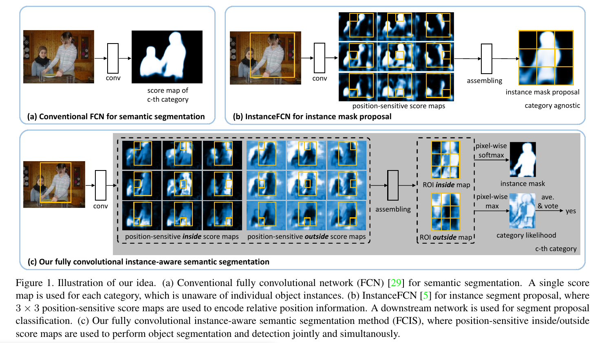
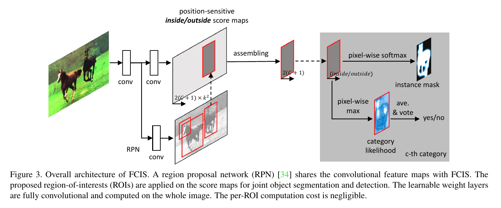
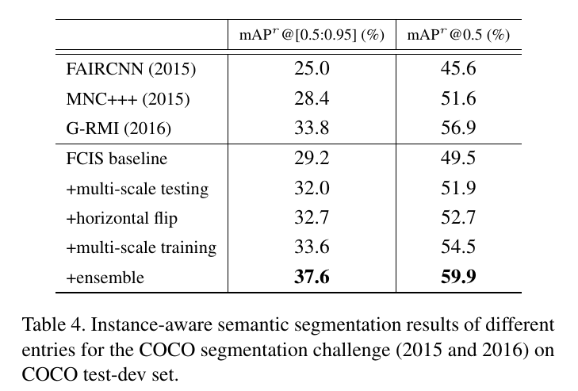

Fully Convolutional Instance-aware Semantic Segmentation
=

# Abstract
我们提出了第一个全卷积端到端解决方案的实例感知语义分割任务。它继承了FCNs在语义分割[29]和实例掩码方案[5]中的优点。它联合并同时检测和分割对象实例。通过引入位置感知的内/外分数图，底层卷积表示在两个子任务之间以及在所有感兴趣的区域之间完全共享。所提出的网络是高度集成的，并在准确率和效率上都偶的最佳性能。在COCO 2016年的分割竞赛中，它以较大的优势胜出。代码将在 https://github.com/daijifeng001/TA-FCN 发布。

# 1. Introduction
全卷积网络（FCN）最近主导语义图像分割领域。FCN采用任意大小的输入图像、应用一系列卷积层，并且为所有语义类别产生每个像素的似然得分图，图图1（a）所示。由于卷积的简洁、高效以及权重共享，FCN提供了准确、快速以及端到端的解决方案用于语义分割。

然而，一般的FCN对于实例感知的语义分割任务不起作用，其需要单个对象实例的检测和分割。这种局限是固有的。因为卷积是平移不变的，所以相同的图像像素无论其在上下文中的相对位置如何，都会得到相同的响应(因此分类分数)。然而，实例感知的语义分割需要在区域级别上操作，并且相同的像素在不同的区域有不同的语义。这种行为在整个图像上通过单个FCN不能建模。这个问题在图2中示例。

需要某种平移不变特性来解决这个问题。在实例感知语义分割方法的流行家族中，采用不同类型的子网络，分三个阶段实现：1）在整幅图像上应用FCN来生成中间和共享特征图；2）根据共享的特征图，池化层将RoI变形到固定大小的per-RoI的特征图；3）最后网络的一个或多个全连接层将per-RoI特征图转换为per-RoI掩膜。注意，平移不变属性在最后一步的fc层中引入。

如此的方法有几个缺点。首先，由于特征变形和调整，RoI池化步骤损失空间细节，然后，其需要为fc层获得固定尺寸的表示（例如 $14 \times 14$） 。这种失真和固定的尺寸表示降低了分割精度，特别是对大对象。其次，fc层过参数化任务，而没有使用局部权重共享正则化。例如，最后的fc层具有784通路的高维输出来估计 $28 \times 28$ 的掩膜。最后，最后步骤的per-RoI网络不在RoI中共享。从经验上看，最后一步需要相当复杂的子网络才能获得较好的精度[36,9]。因此，对于大量RoI(通常是数百或数千个区域建议)来说，速度很慢。例如，在MNC方法[8]中，其在COCO分割挑战2015中获得第一名，ResNet-101模型[18]中的10层保存在每个roi子网络中。这种方法每幅图像花费1.4秒，其中超过80%的时间花费在最后的per-RoI步骤。这些缺点促使我们提出这样一个问题，我们能否利用FCNs的优点来实现端到端实例感知语义分割?

最近，全卷积方法提出用于实例掩膜提议生成[5]。它将传统FCNs中的平移不变分数映射扩展到位置敏感的分数映射，这在一定程度上是平移变化的。这种方法仅用于掩膜提议生成，并展现出几个缺点。它对语义类别是盲目的，需要一个下游网络来检测。对象分割和检测子任务是单独的，解决方案不是端到端的。它在正方形、固定尺寸的滑动窗口（$224 \times 224$ 像素）上操作，并采用耗时的图像金字塔扫描以寻找不同尺寸的实例。

在这项工作中，我们提出第一个端到端的全卷积方法进行实例感知语义分割。它被称为FCIS，在[5]中扩展了这种方法。底层卷积表示和分数图完全共享用于目标分割和检测子任务，这通过一种新的联合公式来完成，不需要额外的参数。网络结构高度集成而有效。per-RoI计算简单、快速，并没有设计任何变形或调整操作。这种方法在图1（c）中简要展示。它在边界框提议上操作，而不是滑动窗口，享受着对象检测[34]的最新进展。

大量的实验证明，该方法在精度和效率上都是最先进的。该方法在大规模的COCO数据集[25]上实现了比以往的MNC[8]算法更高的精度。在COCO 2016分割大赛中获得第一名，准确率较第二名高出12%。它很快。在COCO竞赛中，使用ResNet-101模型，推理速度为每幅图像花费0.24秒（NVIDIA K40），其比MNC[8]快8倍。

# 2. Our Approach
## 2.1. Position-sensitive Score Map Parameterization
在FCNs[29]中，分类器训练来预测每个像素“属于摸一个对象类”的似然得分。它是平移不变量，不会感知单个对象实例。例如，相同像素可以是一个对象的前景，却是另一个（相邻）对象的背景。每个类的单一得分图不足以区分这两种情况。

为了引入平移可变特性，全卷积解决方案首先在[5]中提出用以实例掩膜提议。它使用 $k^2$ 位置敏感得分图，其对应 对象的 $k \times k$ 均匀划分的单元。在图1（b）（k=3）中展示。每个得分图具有与原始图像相同的空间范围(分辨率较低，如小16倍)。每个得分表示“相应像素属于某个对象实例”的似然。例如，第一个图是针对图1（b）中“左上位置”。

在训练和推断期间，对于固定尺寸的正方形滑动窗口（$224 \times 224$ 像素），它的逐像素前景似然图通过集成（复制-粘贴）其相应得分图的 $k \times k$ 的单元产生。以这种方式，一个像素在不同的实例中可以有不同的分数，只要该像素在实例中处于不同的相对位置。

如[5]所示，这种方法对于对象掩膜提议任务是最佳的。然而，它也受到任务的限制。仅使用一个固定大小的正方形滑动窗口。网络应用在多尺度图像上以寻找不同尺寸的对象实例。该方法对于对象类是盲目的。仅使用一个单独的“objectness”分类子网络来将窗口分类为对象或背景。对于实例感知语义分割任务，使用一个单独的下游网络来进一步分类掩膜提议为对象类[5]。

## 2.2. Joint Mask Prediction and Classification
对于实例感知语义分割任务，不仅[5]，而且许多其他最佳方法，例如SDS[15]、Hypercolumn[16]、CFM[7]、MNC[8]和MultiPathNet[42]共享相似结构：使用两个网络进行独立和顺序地对象分割和检测子任务。

很显然，这种情况下的设计选择，例如两个网络的结构、参数和执行顺序，都是任意的。为了方便而不是为了基本的考虑，可以很容易地制作它们。我们推测，分离的子网络设计可能不能充分利用这两个任务之间的紧密相关性。

我们增强了“位置敏感分值图”的思想，实现了目标分割和检测子任务的协同并行。对于这两个子任务以及底层卷积表示，共享一组相同的得分图。 我们的方法没有加入额外的参数，并消除了无关紧要的上界选项。我们相信它可以更好地利用两个子任务之间的强相关性。

我们的方法如图1（c）和图2所示。给定一个RoI，它们逐像素得分图通过RoI中的集成操作产生。对于RoI中的每个像素，有两个任务：1）检测，是否属于相应位置的对象包围框（detection+）或（detection-）；2）分割：是否它在对象实例的边界内（segmentation+）或（segmentation）。这正是表1中我们的基线FCIS(单独的分数图)。这种情况下，两个分类其为两个 $1\times1$卷积层，每个仅使用一个任务监督。

我们的联合公式融融合这两个问题到两个得分：内部和外部。有三种情况：1）高内部得分和低外部得分：detection+，segmentation+；2）低内部得分和高外部得分：detection+，segmentation-；3）两个得分都低：detection-，segmentation- 。两个得分通过softmax和max操作联合回答这两个问题。对于检测，我们使用max来中区分情况1）-2）（detection+）和情况3）（detection-）。对于分割，在每个像素位置，我们使用softmax来区分情况1）（segmentation+）和情况2）（segmentation-）。RoI的前景掩膜（以概率）是每个像素分割得分（对每个类）的并集。相似地，两组得分来自两个 $1 \times 1$ 卷积层。inside/outside分类器接收到来自分割和检测损失的反向传播梯度时，对其进行联合训练。

这种方法有许多可取的特性。所有的per-RoI部分（如表1（c））没有自由参数。得分图由单个FCN产生，而没有涉及任何特征变形、调整或fc层。所有的特征和得分图维持原始图像的纵横比。FCN的局部权重共享属性得以保留，并作为正则化机制。所有per-RoI计算简单（$k^2$单元分割、得分图复制、softmax、max、平均池化）而快速，从而导致per-RoI计算成本忽略不计。

## 2.3. An End-to-End Solution

图3展示了我们端到端解决方案的架构。虽然可以使用任何卷积网络架构[39,40]，但在这项工作中我们采用了ResNet模型[18]。 用于1000路分类的最后一个完全连接的层被丢弃。仅预训练之前的卷积层。产生的特征图有2048个通道。在它的顶部，添加一个 $1 \times 1$ 卷积层将维度减小到 1024 。

在原始的ResNet中，网络顶部的有效特征步长（特征图分辨率减小）为 32 。这对于实例感知语义分割太粗糙。为了减小特征步长，并维持感受野，应哟功能“hole algorithm”[3,29]（算法atrous）。conv5卷积层的第一块中的步长从2减小到 1 。因此，有效特征步长减小到 16 。为了维持感受野，通过设置膨胀率为2，将“hole algorithm”应用到所有的conv5卷积层。

我们使用原始的提议网络（RPN）来生成RoI。为了与MNC方法[8]公平比较，它以相同的方式添加conv4层的顶部。注意，RPN也是全卷积的。

从conv5特征图中，使用 $1 \times 1$ 卷积层生成 $2k^2 \times(C + 1)$ 个得分图（$C$ 个对象类别，一个背景类别，每个类别两组 $k^2$ 得分图，默认在实验中$k = 7$）。在得分图上，每个ROI被投射到小16倍的区域。它的所有类别的分割概率图和分类得分计算为2.2节中描述的。

遵循现代对象检测系统，使用边界框（bbox）回归[13,12]来细化初始输入RoI。在conv5特征图上添加具有 $4k^2$ 通道的兄弟 $1\times1$ 卷积层，以估计位置和大小的边界框偏移。

我们在推断和训练中讨论更多细节。

**Inference** 对于输入图像，RPN生成最高得分的300个RoI。他们通过bbox回归分支，并产生另外300个RoI。对于每个RoI，我们获得它所有类别的分类得分和前景掩膜（以概率）。图2中展示了一个例子。具有IoU阈值0.3的非极大抑制（NMS）用于过滤高度重叠的ROI。剩余的ROI被分类为具有最高分类分数的类别。它们的前景掩膜通过如下的掩膜投票[8]获得。对于正在考虑的RoI，我们发现所有RoI（来自600）的IoU得分高于0.5。它们的前景掩模按每个像素平均，并按其分类分数加权。平均掩膜二值化为输出。

**Training** 如果RoI与其对应的最近的ground-truth对象的边界框IoU大于0.5，那么这个RoI为正，否则它是负的。每个RoI有三个相等权重的损失：$C+1$个类的softmax检测损失、_仅ground-truth类的前景掩膜上_ 的softmax分割损失和如[12]bbox回归损失。后两个损失项仅是正类RoI上有效。

在训练期间，模型由ImageNet分类上预训练模型初始化。预训练模型中没有的层随机初始化。训练图像调整到短边具有600个像素。我们使用SDG优化。我们使用8个GPU训练模型，每个GPU保持一张图像的mini-batch，产生8倍的有效批大小。对于PASCAL VOC[11]上的实验，执行30K轮迭代，其中前20K和最后10K迭代的学习率分别为 $10^{-3}$ 和 $10^{-4}$ 。COCO上的实验迭代数为PASCAL VOC的8倍。

因为per-RoI的计算是可忽略不计的，训练受益于以较低的训练成本检查更多的RoI。具体而言，我们应用OHEM。在每个mini-batch中，在一幅图像的300个提议RoI上置信前馈。他们中，选择最高损失的128个RoI来反向传播它们的误差梯度。

对于RPN提议，默认使用9个锚（3个尺度 $\times$ 3个纵横比）。另外3个更精细的锚用于COCO数据集的实验[25]。 要在FCIS和RPN之间启用功能共享，需要进行联合训练[8,35]。

# 3. Related Work
**Semantic Image Segmentation** 这项任务是为图像中的每个像素分配一个语义类别标签。他没有区分对象实例。最近，该领域被基于FCN的一族流行方法占据。FCN扩展了全局上下文[28]、多尺度特征融合[4]和反卷积[31]。[3,43,37,24]中的最近工作集成FCN和条件随机场（CRF）。在[2]中，昂贵的CRN被更有效的域迁移替换。由于每个像素的类标注是昂贵的，FCN中的监督信号已放宽到边界框[6]、scribble[23]或弱监督图像类标签[19,20]。

**Object Segment Proposal** 这项任务是为了生成类无关的对象分割。传统的方法（例如MCG和Selective Search）使用低级图像特征。最近，这项任务通过深度学习方法获得，例如DeepMask和SharpMask。最近，[5]中提出全卷积方法，其启发了这项工作。

**Instace-aware Semantic Segmentation** 该方法都需要对象实例的分类和分割。典型地，这两个子任务单独地完成。通常，分割任务依赖一个分割提议方法，而分类任务构建在基于区域方法[13,12,24]之上。这中范例包含历史最佳方法，例如SDS、Hypercolumn、CFM、MNC、MultiPathNet和迭代方法。如此方法有某些缺点，如第一节和2.2节所讨论的。在这项工作中，我们提出了一种全卷积方法，其中包含两个子任务的集成联合公式。

有一些努力[22,26]试图通过对FCN的输出进行分组/聚类来扩展FCN以实现感知语义分段。但是，所有这些方法都依赖于复杂的手工制作后处理，而且不是端到端的。表现也不尽如人意。

**FCNs for Object Detection** [5]中“位置敏感得分图”的概念在R-FCN [9]中得到了改进，从而产生了一种用于对象检测的全卷积方法。从前景-背景分割似然到对象类别似然重新利用得分图。R-FCN[9]仅执行对象分类。它没有实例分割任务感知。它也可以与[5]以只用直接的方式结合用以实例感知分割任务。这在我们的实验中（4.1节）的到研究。

# 4. Experiments
## 4.1. Ablation Study on PASCAL VOC
通过消融实验，研究了基于PASCAL VOC数据集[11]的FCIS方法。按照[15、7、16、8]中的协议，对VOC 2012训练集进行模型训练，并对VOC 2012验证集进行评估，附加来自[14]的实例掩码注释。在掩码水平IoU(相交-过并)阈值为0.5和0.7时，通过mAP[15]来评估准确率。

将所提出的FCIS方法与其他(几乎)全卷积基线方法以及具有不同设计选择的FCIS变体进行了比较。为了公平比较，ImageNet预训练的ResNet-101模型用于所有方法。OHEM并没有采用。

**naive MNC.** 这种基线与MCN相似，除了ResNet-101的所有卷积层用在整幅图像以获得特征图，接着在conv5层最后一块的顶部应用RoI池化。利用784路fc层对ROI池化特征进行掩模预测(分辨率为28×28)，采用21路fc层进行分类。为了公平比较，也应用atrous策略。它几乎是全卷积的，在per-RoI计算中仅有单层的fc子网络。

**InstFCN + R-FCN.** 类无关掩膜提议首次由InstFCN生成，然后由R-FCN分类。它是InstFCN和R-FCN的直接结合。这两个FCN独立地训练，并分别用于掩膜预测和分类。

**FCIS(translation invriant).** 为了验证位置敏感得分图引入的平移不变的重要性，FCIS的这项基线设置 $k=1$ 以使其平移不变。

**FCIS(separate score maps).** 为了验证掩膜预测和分类的联合形式，该基线单独地使用用于两个子任务的两组得分图。第一组 $k^2$ 个得分图仅用于分割，与[5]有相似的方法。第二组仅用于分类，与R-FCN有相同的方法。因此，两组得分图的先前卷积分类器不相关，而较浅的卷积特征图仍然是共享的。

表1展示了结果。naive MNC 基线在IoU阈值的0.5和0.7的 $\mbox{mAP}^r$ 得分分别为59.1%和36.0% 。它们比原始的MNC得分低5.5%和12.9% ，其per-RoI子网络中保留ResNet-101的10层。这验证相应的平移变化属性对于实例感知语义分割的重要性。

“Inst + R-FCN”的结果相当好，但仍次于FCIS的结果。其推理深度也慢（在NVIDIA K40 GPU上1.27秒每幅图像）。

所提出的FCIS方法获得最佳结果。这验证我们的端到端解决方案的有效性。它的退化版本“FCIS（平移不变）”更糟糕，表明位置敏感得分图参数化至关重要。它的弱化版本“FCIS（separate score maps）”也糟糕，表明联合公式是有效的。

## 4.2. Experiments on COCO
 遵循COCO实验指南，训练在80K+40K的_trainval_ 图像是进行，并在_test-dev_集上报告结果。我们使用标准的COCO评估度量（$\mbox{mAP}^r@[0.5:0.95]$ 和传统的 $\mbox{mAP}^r@0.5$度量）上评估性能。

 **Comparison with MNC** 我们比较了所提出的FCIS和MNC，MNC是COCO分割挑战2015的第一名。两种方法都在RoI上进行掩膜预测和分类，并且共享相似的训练/推断过程。为了公平比较，我们保持它们的通用实现细节相同。

 表2介绍了使用ResNet-101模型的结果。当没有使用OHEM时，FCIS在COCOtestdev集上获得28.8%的 $\mbox{mAP}^r$ ，其比MNC高出4.2％（相对于17％）。根据COCO对象尺寸的标准划分，更大对象的准确率提高更明显，表明FCIS可以更好地捕获空间信息。FCIS也远快于MNC。推断中，FCIS在NVIDIA K40 GPU上每幅图像花费0.24秒（网络前馈花费0.19秒，掩膜投票用了0.05秒），其大约比MNC快6倍。在训练中，FCIS也快了大约4倍。此外，由于几乎是没有per-ROI成本，FCIS可以从OHEM中获益，获得29.2%的 $\mbox{mAP}^r @ [0.5:0.95]$ 。同时，对于MNC而言，OHEM是无法承受的，因为在训练期间会增加相当大的计算开销。

 **Networks of Different Depths** 表3展示了在FCIS方法中，使用不同深度的ResNet的结果。当网络深度从50增加到101时，准确率提高了，并且当深度达到152时，达到饱和。

 **COCO Segmentation Challenge 2016 Entry** 基于FCIS方法，我们参加了COCO分割挑战2016，并获得第1名。

表4列出了2015年和2016年COCO细分挑战中的参赛作品和其他参赛作品的结果。我们的作品基于FCIS，并仅有一些简单的技巧。

_FCIS Baseline._ 基线FCIS方法获得29.2%的 $\mbox{mAP}^r@[0.5:0.95]$ ，其已经高于MNC+++，其为2015年测获奖作品。

_Multi-score testing._ 遵循[17,18]，位置敏感得分图在测试图像的金字塔上计算，其中短边是 $\{480, 576, 668, 864, 1200 1400\}$ 个像素。对于每个RoI，我们从ROI具有最接近 $224\times224$的像素数的尺度获得其结果。注意，RPN提议仍然从单一尺度计算（短边为600）.多尺度测试将准确率提高了 2% 。

_Horizontal flip._ 与[42]相似，FCIS方法应用与原始和翻转的图像，并平均相应ROI的结果。这将准确率提高了0.7% 。

_Multi-scale training._ 我们应用与多尺度推断相同的尺度进行多尺度训练。对于更精细的尺度，由于内存问题，裁剪$600\times600$ 的随机图像块进行训练，如[27]。这将准确率增加了0.9% 。

_Ensemble._ 遵循[18]，使用集成生成区域提议，并且通过集成处理提议的并集以用于掩模预测和分类。我们使用6个网络的集成。最终结果为37.6%，其比G-RMI高3.8%（相对高11%），G-RMI2016年的第2名，比MNC+++高9.2%，MNC+++为2015年的第一名。一些样例结果如图4所示。

**COCO Detection** 所提出的FCIS方法也在边界框级对象检测上执行良好。通过将实例掩模的边界框作为检测到的边界框，通过标准 mAPb@[0.5：0.95]分数测量，COCO测试开发设置的目标检测精度达到39.7％。 结果在COCO对象检测排行榜中排名第二。

 