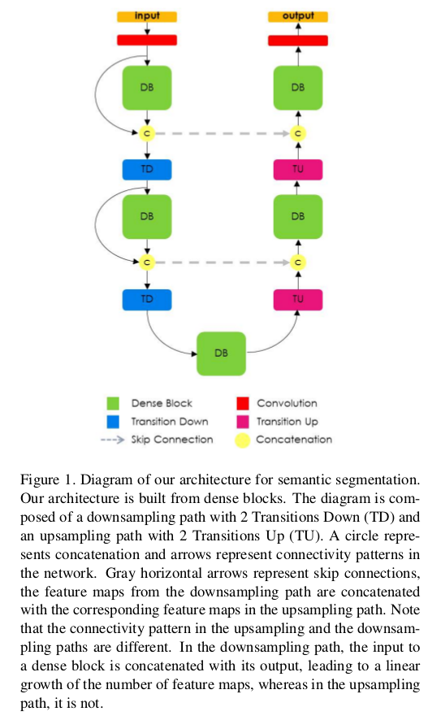
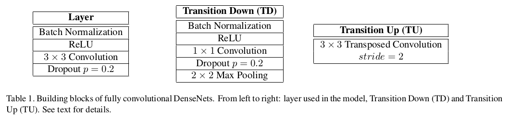

Fully Convolutional DenseNets for Semantic Segmentation
=

# 1 Introduction
本文的贡献：
- 将DenseNet架构扩展到全卷积网络用于语义分割，同时缓和特征图爆炸。
- 强调所提出的上采样路径（由密集块构建）比具有更多标准操作的上采样路径表现更好，例如U-net。
- 表明这样的网络可以获得当前最佳性能。

# 2 Related Work
语义分割的最新进展致力于通过以下方式改进架构设计：（1）改进上采样路径并增加FCN内的连通性[27,1,21,8]; （2）引入模块以解释更广泛的上下文理解[36,5,37]; （3）赋予FCN架构提供结构化输出的能力[16,5,38]。

首先，在文献中，提出不同的替代方法来处理FCN的上采样路径中分辨率的恢复；从简单双线性插值到更高复杂的操作，如unpooling或者transpose convolution 。从下采样到上采样的跳层连接允许更精细信息的恢复。

其次，为语义分割网络引入更大上下文的方法包括[10,36,5,37]。在[10]中，计算出的无监督全局图像描述符被添加到每个像素的特征图中。在[36]中，循环神经网络用于通过在两个方向上水平和垂直扫描图像来检索上下文信息。在[5]中，通过使用膨胀卷积替换池化层来捕获更大的上下文而减少图像分辨率。

然后，条件随机场（CRF））长期以来一直是一种流行的选择，以强制分割输出的结构一致性。最近，完全连接的CRF [16]已被用于包括FCN输出的结构特性[5]。

最后，值得注意的是当前最佳的FCN结构都依赖预训练的模型来改善分割结果。

# 3 Fully Convolutional DenseNets

## 3.2 From DenseNets to Fully Convolutional DenseNets
下采样路径为DenseNets，下采样路径的最后一层称为 $\mbox{bottleneck}$ 。本文中，用密集块代替卷积运算，并将上采样操作称为 $\mbox{transition up}$ 。$\mbox{transition up}$ 由transpose convolution组成，然后，上采样特征图与来自跳层连接的特征图联结后输出一个新的dense block。

在上采样过程中，特征图分辨率增加，从而导致内存需求增加，为了克服这一局限。因此，转置卷积仅应用于由最后一个密集块获得的特征映射，而不应用于到目前为止连接的所有特征图。最后一个密集块总结了相同分辨率下所有先前密集块中包含的信息。请注意，由于池化操作，先前密集块中的某些信息在过渡中丢失。然而，该信息可在网络的下采样路径中获得，并且可以通过跳层连接传递。图1给出详细设计。

## 3.3 Semantic Segmentation Architecture

首先，表1定义了dense block层、transition down 和 transition up 。

然后，表2总结了所有的Dense103 层。
