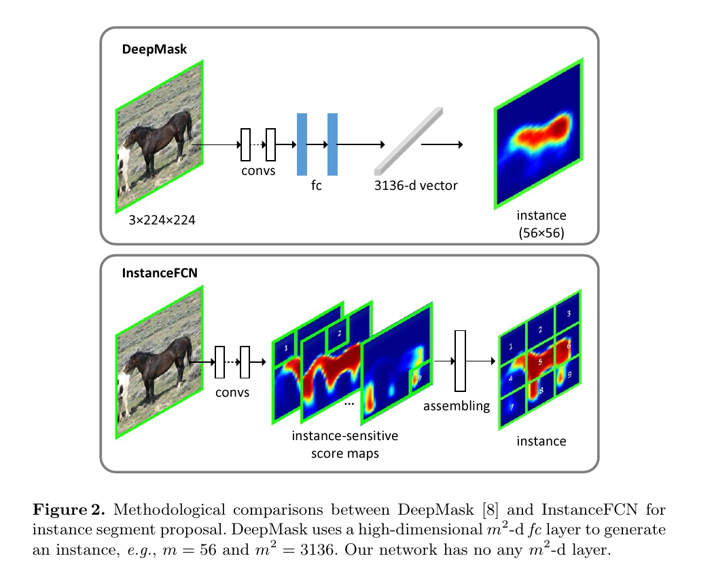
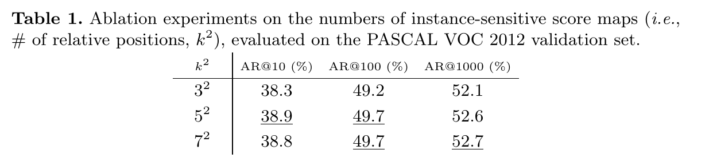
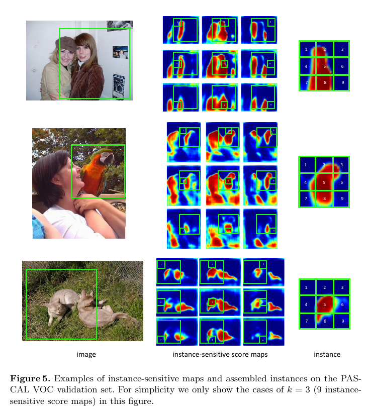
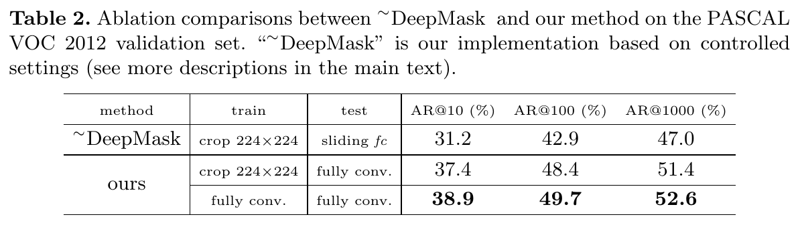
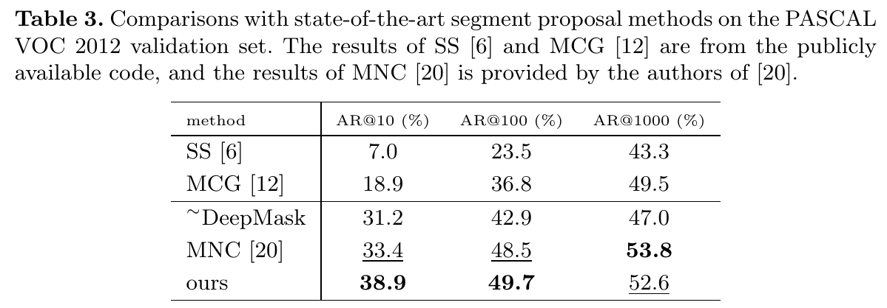
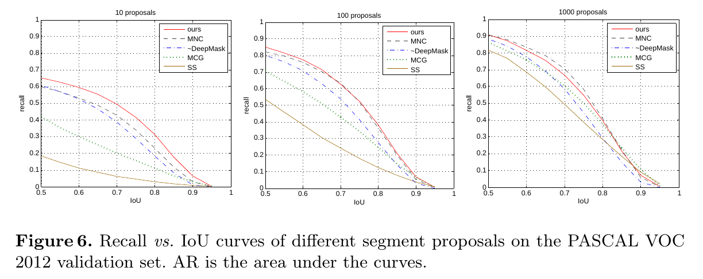
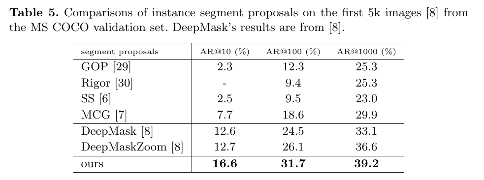

Instance-sensitive Fully Convolutional Networks
=

# Abstract
全卷积网络（FCNs）已证明对于语义分割是十分成功的，但FCN输出不知道对象实例。本文中，我们开发能够处理提议的实例级分割候选的FCNs。与之前生成一个score map的FCN不同，我们的FCN被设计用来计算一小组实例敏感的score map，每个实例都是相对于实例位置的像素级分类器的结果。在这些实例敏感得分图的顶部，一个简单的集成模块可以在每个位置输出实例候选。与最近用于实例分割的DeepMask方法相比，我们的方法没有任何与掩码分辨率相关的高维层，而是利用图像的局部一致性来估计实例。我们在PASCAL VOC和MS COCO上给出了实例分割提议的竞争结果。

# 1 Introduction
全卷积网络(FCN)[1]已被证明是一种有效的端到端语义图像分割解决方案。FCN产生与输入图像成比例的得分图，其中每个像素代表对象的分类。尽管FCNs具有良好的准确性和易用性，但并不直接适用于生成实例段(图1(顶部))。之前的实例语义分割方法（例如[2,3,4,5]）一般采用现成的分割建议方法(如[6,7])。

本文中，我们开发一种端到端的全卷积网络，其能够分割候选实例。如[1]中的FCN，在我们的方法中，每个像素仍然表示一个分类器；但是不同与FCN，其生成一个得分图（对于一个对象类），我们的方法计算一组实例敏感得分图，其中每个像素是实例对象的相对位置的分类器（图（下））。例如，使用一个 $3 \times 3$ 的规则网格描述相对位置，我们产生一组9个得分图，其中（例如图1中的map #6）在对象实例的“右侧”有高的分。使用这组得分图，我们能够在每个滑动窗口中通过assembling来自score映射的输出来生成对象实例段。这一过程确保产生分割实例的全卷积形式。

最与我们方法相关的DeepMask是受卷积网络驱动的实例分割提议方法。DeepMask学习将图像滑动窗口映射到 $m^2$ 维的向量（表示一个 $m \times m$ 分辨率的掩膜，例如 $m = 56$）的函数。这通过 $m62$维的全连接层计算。见图 2 。尽管可以通过将DeepMask的全连接层转换为 $m^2$ 维输出的卷积层来实现全卷积形式（如[8]中推断时），但是它与[1]中每个输出像素都是低维分类器的FCNs有本质区别。与DeepMask不同，我们的方法没有与掩膜大小 $m^2$ 相关的层，并且我们方法的每个像素是低维分类器。这可以通过利用自然图像的局部一致性（local coherence）[9]来生成每个窗口的像素级预测。我们将深入讨论和比较DeepMask。

在PASCAL VOC和MS COCO基准测试中，与一系列的提案方法进行了比较[6,12,8]，我们的方法产生吸引人的实例分割提议结果。由于预测掩膜的层的小尺寸，在小型的PASCAL VOC数据集上训练的模型展现了良好的准确率，而有更少的过拟合风险。此外，当应用下游分类器时，我们的系统也展示了实例语义分割的竞争性结果。我们的方法（称为InstanceFCN）证明分割实例仍能通过[1]中FCN的形式处理,填补了FCNs广泛应用中缺失的一块。

# 2 Related Work
全卷积模型的一般概念追溯到至少20年前。对于卷积神经网络（CNN），滑动窗口(或称为patch或crop)不一定在图像域中运行，而是在feature map上运行，其可以在feature map上重新转换为卷积滤波器。这些全卷积模型自然适用于图像恢复问题，如去噪[16]、超分辨率[17]等[18]，其中每个输出像素都是强度值的实数回归器。

近年来，FCNs[1]在语义分割方面表现出了令人瞩目的质量和效率。在[1]中，每个像素是相对于网络感受野的一个分类器。因此，给定类别的语义分割标准，网络可以端到端、像素到像素地训练。但是这种方法不能区分对象实例（表1）。

区域建议网络(RPN)采用完全卷积的方式运行，在Faster R-CNN[19]中被开发用于建议边界框级实例。在RPN中，输出图的每个像素表示边界框回归器和对象性分类器。RPN没有生成掩膜级提议。在[20]中，RPN边界框用于回归分割掩膜，这由fc层对感兴趣的区域(RoI)池化特征[21]执行。

## 3 Instance-sensitive FCNs for Segment Proposal
## 3.1 From FCN to InstanceFCN
尽管用于语义分割原始FCN没有产生显示的实例，但是我们仍能考虑一些特殊的案例，其中这样的FCN可以很好地生成实例。考虑仅包含一个对象实例的图像。在这种情况下，原始的FCN可以产生关于这个对象类的良好掩膜，并且因为仅有一个实例，这也是关于这个对象实例的良好掩膜。在这一过程中，FCN没有任何预定义的滤波器，其依赖掩膜分辨率/大小（称为 $m \times m$） 。

接下来，考虑图像包含两个对象实例，它们相互接近（图1（上））。尽管，现在，FCN输出不能区分这两个实例，我们注意到输出对于多数像素确实是可重用的，除了一个对象与其他相连的这些——例如，当左侧实例的“右侧”与右侧实例的”左侧“相连时（图1）。如果我们可以区分“右侧”和“左侧”，我们仍然可以依赖类似于fcn的得分图来生成实例。

**Instance-sensitive score maps**

上述分析启发我们将相对位置的概念引入到FCN。理想地，相对位置对应于对象实例，例如对象的“右侧”或对象的“左侧”。与原始的FCN相比，其中每个输出像素是对象类的分类器，我们提出每个输出像素是实例相对位置的分类器。例如，对于图1（下）中的 #4 得分图，每个像素为是否为实例“左侧”的分类器。

在我们的实践中，我们使用正方形滑动窗口中的 $k \times k$ （例如$k=3$）的规则网络来定义相对位置（图1（下））。这导致了一组 $k^2$ (例如9)分数映射，这是我们的FCN输出。我们称它们为位置敏感得分图。在如下模块的帮助下，产生这些得分图的网络架构可端到端训练。

**Instance assembling module**

实例敏感得分图也没有产生对象实例。但是我们简单的assemble这些图的实例。我们在这一组实例敏感得分图上滑动分辨率为 $m \times m$ 的窗口（图1（上））。在这个滑动窗口中，每个 $\frac{m}{k} \times \frac{m}{k}$ 子窗口直接从相应得分图的相同子窗口中复制值。然后，$k^2$ 的子窗口集成到一起（根据它们的相对位置）以assemble一个新的分辨率为 $m \times m$ 的窗口。这就是来自滑动窗口的实例集成。

实例集成模块在训练和推理阶段都采用。在训练期间，这个模型从稀疏采样的滑动窗口中生成实例，并与ground-truth进行比较。在训练期间，我们在特征图上密集的滑动窗口以预测每个位置的实例。更多细节见算法章节。

我们注意到assembling模块是我们架构中唯一涉及掩模分辨率 $m \times m$ 的组件。然而，assembling模型没有需要学习的网络参数。因为仅有复制和粘贴，它并不昂贵。由于它用于计算损失函数，该模块会影响训练。

## 3.2 Local Coherence
接下来，我们从局部一致性（local coherence）的观点分析我们的方法。我们所说的local coherence是指，对于自然图像中的一个像素，当在相邻的两个窗口中计算时，它的预测很可能是相同的。当窗口移动一小步时，不需要完全重新计算预测。

该方法充分利用了local coherence性。对于一个单步滑动的窗口（图3（下）），坐标系中的相同像素将具有相同的预测，因为它是从相同的score map中复制的(除了相对位置划分附近的几个像素)。当掩膜分辨率 $m^2$ 足够高时，这允许我们节约大量参数。

这与DeepMask[8]基于“滑动fc层”的机制形成对比（图3（顶部））。在DeepMask中，当窗口以一个步长平移时，图像坐标系统的相同像素有两个不同通道的fc层预测，如图3（上）所示。因此，当在两个相邻窗口评估时，该像素的预测通常不同。

通过利用局部一致性，我们的网络层的大小和尺寸都与掩码分辨率 $m \times m$ 无关，而与DeepMask不同。这不仅减小掩膜预测层的计算成本，而且更重要的是，减小掩膜回归需要的参数量，使得在如PASCAL VOC的小型数据集上有更少的过拟合风险。在实验章节中，我们证明我们的掩膜预测层的参数比DeepMask少百倍。

## 3.3 Algorithm and Implementation
接下来，我们描述我们的方法的网络架构、训练算法和推理算法。

**Network architecture.** 如常用的实践，我们使用ImageNet预训练的VGG-16网络作为特征提取器。VGG-16中的13个卷积层以全卷积的方式应用于任意大小的输入图像。我们遵循[24]中的实践来减小网络步长以及增加特征图分辨率：最大池化层$\mbox{pool}_4$（$\mbox{conv}_{4\_3}$ 和 $\mbox{conv}_{5\_1}$）修改为步长为1，而不是2，并且相应的 $\mbox{conv}_{4\_3}$ 到 $\mbox{conv}_{5\_3}$ 中的滤波器通过“hole algorithm”调整。使用修改的VGG网络，$\mbox{conv}_{5\_3}$ 特征图的有效步长为 $s = 8$ 个像素（相对输入图像）。我们注意到这个减小的步长直接决定我们得分图的分辨率，其中我们的掩膜是复制和集成的。

在特征图的顶部，有两个全卷积分支，一个用于估计分割实例，另一个用于为实例评分。对于第一个分支，我们采用 $1 \times 1$ 的512维的卷积层（具有ReLU）来转换特征，然后使用 $3 \times 3$ 的卷积层来生成一组实例敏感得分图。使用描述相对位置的 $k \times k$ 的规则网络，最后一个卷积层有$k^2$ 输出通道，对应于 $k^2$ 实例敏感的得分图集合。见图4的上部分支。在这些得分图的顶部，assembling模块用于生成分辨率为 $m \times m$ 的滑动窗口中的对象实例。我们使用 $m = 21$ 个像素（具有8个步长的特征图上）。

对于给实例评分的第二个分支（图4下），我们使用一个 $3 \times 3$ 的512维的卷积层（具有ReLU），后面是 $1 \times 1$ 卷积层。该$1\times1$层是一个逐像素的逻辑回归，用于对以该像素为中心的滑动窗口的实例/非实例进行分类。因此，该分支的输出是对象性得分图（图4（下）），其中一个得分对应生成一个实例的一个的滑动窗口。

**Training.** 我们的网络端到端地训练。我们采用[21,19]的image-centric策略。前向传递计算实例敏感得分图集和对象性得分图。之后，随机采样一组256个滑动窗口[21,19]，并且仅从这256个窗口集成实例以计算损失函数。损失函数定义为：

$$\sum_i(\cal{L}(p_i, p_i^\ast)) + \sum_j(\cal{L}(s_{i,j}, S_{i,j}^\ast)) \tag1$$

这里，$i$ 是采样窗口的索引，$p_i$ 为这个窗口中实例的预测对象性得分，以及如果这个窗口是正样本，那么 $p_i^\ast$ 为 1 ；如果为负样本，则 $p_i^\ast$ 为 0 。$S_i$ 为这个窗口中集成分割实例，$S_i^\ast$ 为ground-truth 分割实例，$j$ 为该窗口中像素索引。$\cal{L}$ 为逻辑斯蒂回归损失。我们使用[8]中正类/负类样本的定义，并且这256个采样串口的正负样本之比为 $1:1$ [19]。

我们的方法接收任意尺寸的图像作为输入。我们按照[26]中的尺度扰动进行训练：调整训练图像使得它的短边从 $600 \times 1.5^{\{-4, -3, -2, -1, 0, 1\}}$ 像素中随机采样。我们使用随机梯度下降（SGD）作为求解器。共进行40K迭代，前32k迭代学习率为 0.001 ，后8K迭代学习率为 0.0001 。我们使用8-GPU实现进行训练，其中每个GPU保存1个图像，具有256个采样窗口（因此有效的小批量大小为8个图像）。权重衰减为0.0005，momentum为 0.9 。前13个卷积层由ImageNet预训练的VGG-16初始化，而额外的卷积层使用均值为0、方差为0.01的高斯分布初始化。

**Inference.** 网络的前向传递在输入图像上运行，生成实例敏感得分图和对象性得分图。然后，集成模块在这些图上密集地应用滑动窗口以产生每个位置的分割实例。每个实例与对象性得分图的得分相关。为了处理多尺度，我们调整图像的短边为  $600 \times 1.5^{\{-4, -3, -2, -1, 0, 1\}}$ 像素，并在每个尺度上计算所有的实例。在K40GPU上评估一幅图像花费1.5秒。

对于每个输出分割，我们极端其值以构成二值掩膜。然后，我们采用非极大值抑制（NMS）以生成最终的分割提议集合。NMS基于对象性扥分和由二进制掩码的紧密边界框给出的边界框级IoU。我们使用0.8的阈值进行NMS。在NMS之后，排名前N的分割提案用作输出。

# 4 Experiments
## 4.1 Experiments on PASCAL VOC 2012
我们首先在PASCAL VOC2012上执行实验。遵循[3,4]，我们使用[27]的分割注释，并在训练集上训练模型，在验证集上验证。所有分割提议方法通过预测实例和ground-truth实例之间的掩膜级IoU评估。遵循[8]，我们测量固定数量 $N$ 提议上的平均召回率（0.5到1.0的IoU阈值之间），表示为 “AR@N” 。在[28]中，与传统的评估方案指标相比，AR指标与检测准确性（与下游分类器[2,21]一起使用时）更加相关。

**Ablation on the number of relative position $k^2$**

表1展示使用不同 $k^2$ 值的结果。我们的方法对 $k^2$ 不敏感，并且即使当 $k=3$ 时，也可以很好地执行。图5展示了实例敏感图和 $k=3$ 的集成实例的一些例子。

**Ablation comparisons with the DeepMask scheme**

为了公平起见，我们在PASCAL VOC上实现DeepMask基线。具体而言，网络结构是VGG-16后跟一个额外的512维的 $1 \times 1$ 卷积层[8]，生成如[8]的 $224 \times 224$ 图像裁剪块中 $14 \times 14$ 特征图。然后，将一个512维的fc层应用到这个特征图，接着是一个 $56^2$ 维的fc用以生成一个 $56 \times 56$ 分辨率的掩膜。在这样的设置下，两个fc层有53M参数。对象性得分分支如[8]构成。所有其他设置与我们的相同，以进行公平比较。我们称这个模型为 ~DeepMask ，其表示我们的DeepMask实现。这种基线的结果如表 2 。

表2展示了消融比较。如第一个变体，我们像在DeepMask中一样在 $224 \times 224$ 的裁剪上训练我们的模型。在这种消融训练下，我们的方法仍然优于 ～DeepMask 一点。当在全尺寸图像上训练时（表2），我们的结果进一步得到提高。在全尺寸图像上训练的增益进一步证明我们的全卷积方案的益处。

值得注意的是，我们的方法有更少的参数。我们最后的 $k^2$ 维卷积层仅有 0.1M 参数（所有其他层有DeepMask副本一样）。这种掩膜生成层仅有DeepMask的fc层参数的 1/500 。我们的方法可以回归高维 $m \times m$ 掩模，因为它利用了局部一致性。我们还期望更少的参数可以降低过拟合的风险。

**Comparisons with state-of-the-art segment proposal methods**

表3和图6中，我们比较了最佳的分割提议方法：Selective Search、Multiscale Grouping（MCG）、～DeepMask和Multi-task Network（MNC）[20]。MNC联合多级级联方法，它提出了盒级区域，从这些区域回归掩模，并对这些掩模进行分类。利用训练的MNC，我们将掩膜回归输出形式为分割提议。

表3和图6展示了基于CNN的方法（～DeepMask、MNC、我们的）比SS和MCG的自下而上的分割方法更好。此外，我们的方法与MNC有相似的AR@100和AR@1000，但是但是具有高出5.5%的AR@10。与我们的完全卷积方式相比，MNC的掩模回归是由高维fc层完成的。

**Comparisons on Instance Semantic Segmentation**

## 4.2 Experiments on MS COCO

