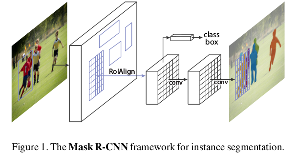
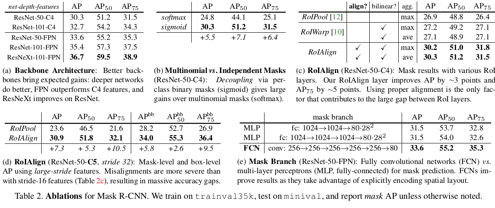
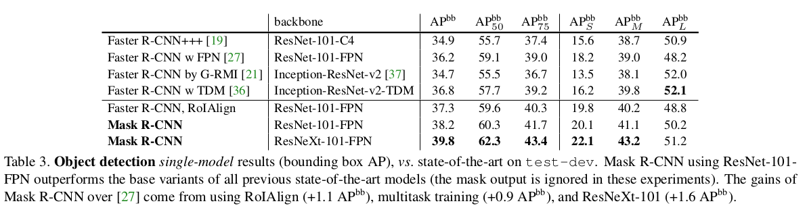

Mask R-CNN
=

# 1 Introduction
对象检测要求分类单个对象，并使用一个边界框对其定位。而语义分割（semantic segmentation）要求每个像素分类为固定的类别集合，而不需要区分对象实例。

Mask R-CNN通过在每个RoI上添加一个用于预测分割掩模的分支扩展了Faster R-CNN，该分支与分类和边界框回归并行存在。掩模分支是一个用于每个RoI的小型FCN，以像素到像素的形式预测分割掩模。

Faster R-CNN输入与输出之间不是像素到像素对齐的，这在RoIPool [18,12]（参与实例的事实上的核心操作）如何为特征提取执行粗略空间量化方面最为明显。为了解决这个错位，提出了一个简单的、无量化的层，称为RoIAlign，忠实地保留了精确的空间位置。虽然RoIAlign只是很小的改变，却有很大的影响：它将掩模精度提高了10％到50％，在更严格的定位指标下显示出更大的收益。其次，解耦（decouple）掩模和类别预测：为每个类独立地预测二值掩模，而没有在类别之间竞争，并且依靠网络的分类分支预测类别。而FCN通常执行逐像素的多类别分类，这耦合分割和分类，并且基于本文实验对于实例分类效果不佳。

# 2 Related Work
**R-CNN:**

**segmentation:**

# 3 Mask R-CNN
Mask R-CNN在概念上很简单： Faster R-CNN的每个候选对象有两个输出，一个是类别标签，一个是边界框偏移；对于mask，添加第三个分支输出对象掩模。但是额外的掩模输出区别类别和边界框输出，要求一个对象的更精细空间布局的提取。

**Faster R-CNN:** 第一阶段，称为RPN，用于生成候选边界框；第二阶段是Fast R-CNN，它使用RoIPool从每个候选框中提取特征，并执行分类和边界框回归。可以共享两个阶段使用的特征，以便更快地推断。

**Mask R-CNN:** Mask R-CNN采用相同的两阶段过程，有相同的第一阶段（它是RPN）。在第二阶段中，并行地预测类别和边界框偏移，Mask R-CNN还为每个RoI输出一个二值掩模。

形式上，在训练期间，定义每个采样RoI的多任务损失为 $L = L_{cls} + L_{box} + L_{mask}$ 。分类损失 $L_{cls}$ 和边界框损失 $L_{box}$ 与[12]（Fast R-CNN）定义的一样。对于每个RoI，掩模分支有 $Km^2$ 维输出，其编码 $K$ 个分辨率为 $m \times m$ 的二值掩模，一个二值分支对应一个类。二值分支应用逐像素sigmoid，并定义 $L_{mask}$ 为平均二值交叉熵损失（average binary cross-entropy loss）。对于一个与ground-truth类 $k$ 关联的RoI，$L_{mask}$ 仅定义在第 $k$ 个掩模（其他掩模没有对损失作出贡献）。

**Mask Representation:** 掩模编码输入对象的空间布局。因此，与通过全连接（fc）层不可避免地折叠成短输出向量的类标签或边界框偏移不同，提取掩模的空间结构可以通过由卷积提供的像素到像素的对应自然地解决。

具体地，使用FCN从每个RoI中预测一个 $m \times m$ 的掩模。这允许掩模分支的每层维持明显的 $m \times m$ 对象空间布局，同时是没有折叠称为缺乏空间维度的向量表征。全卷积表征需要更少的参数，并且通过实验表明具有更高的准确率。

这种像素到像素的行为要求我们的RoI特征（它们本身就是小特征图）能够很好地对齐，以忠实地保持显式的每像素空间对应关系。这启发我们开发如下的RoIAlign层。

**RoIAlign:** RoIPool是提取小特征图的（例如 $7\times7$）标准操作。RoIPool首先量化（quantize）浮点型的RoI为特征图的离散粒度，然后，这种量化的RoI划分为空间bin，最后聚合每个bin所涵盖的特征值（通常通过max pooling）。例如，通过计算 $[x / 16]$ 在连续坐标 $x$ 上执行量化，其中16是特征图步幅并且 $[·]$ 是舍入的; 同样地，当分成bin（例如，7×7）时执行量化。这些量化在RoI和提取的特征之间引入了错误（misalignment）。虽然这可能不会影响对小平移具有鲁棒性的分类，但它对预测像素级精确掩模有很大的负面影响。

为了解决这个问题，提出了一个RoIAlign层来消除RoIPool的严格量化，正确地将提取的特征与输入对齐。这种改变很简单： 避免RoI边界或bin的任何量化（即使用 $x/16$ 替换 $[x/16]$ ）。*使用双线性插值[22]来计算每个RoI bin中四个规则采样位置的输入特征的精确值，并聚合结果（使用最大值或平均值）。*

**Network Architecture:** 为了演示本文方法的一般性，我们使用多种体系结构实例化Mask R-CNN。为了清楚起见，区分：（i）用于整个图像上的特征提取的卷积骨干架构，以及（ii）用于边界框识别（分类和回归）的网络头和分别应用于每个RoI的掩模预测。

本文使用两种形式的架构：ResNet和ResNet-FPN。头部架构如图3 。

## 3.1 Implementation Details
遵循Fast/Faster R-CNN的超参数设置。

**Training:** 如果anchor与ground-truth 边界框的IoU值大于等于0.5，则分配为正类；否则为负类。掩模损失 $L_{mask}$ 仅定义在正类RoI上。掩模的目标是RoI与其关联ground-truth掩模的交集（intersection）。

输入图像短边为800像素。每个GPU两张图像，并且每幅图像采用 $N$ 个RoI，正负比例为 $1:3$ 。 对于C4骨干网络（原始版本的ResNet-Faster R-CNN），$N$ 为64；对于FPN， $N$ 为512 。在8张GPU上训练160k次迭代，学习率为0.02，且在120k次迭代后除以10 。weight decay = 0.0001，momentum = 0.9 。

RPN 的anchor有5个尺度、3个纵横比。

**Inference:** 在测试时，C4 骨干的提议数量为300，FPN为1000 。在这些提议上允许预测分支，后跟NMS。 然后，掩模分支应用最高得分的100个检测边界框。尽管这不同于训练时的并行计算，但是它能够加速推断并提升准确率。掩模分支为每个RoI预测 $K$ 个掩模，但是仅使用第 $k$ 个掩模，其中 $k$ 是通过预测分支预测的类。然后将 $m \times m$ 浮点掩码输出调整大小为RoI大小，并在阈值0.5处二进制化。

注意，由于仅使用前100个检测框，Mask R-CNN仅增加了轻微的计算（例如，大约为典型模型的 20%）。

# 4 Experiments： Instance Segmentation
使用COCO数据集进行实验。报告标准的COCO度量方式，包括AP（averaged over IoU thresholds）、 $AP_{50}$ 、 $AP_{75}$ 和 $AP_S$ 、 $AP_M$ 和 $AP_L$ （不同尺度的AP）。

## 4.1 Main Results

## 4.2 Ablation Experiments

## 4.3 Bounding Box Detection Results

# 5 Mask R-CNN for Human Pose Estimation
Mask R-CNN可以轻松地扩展到人体姿态估计。将关键点的位置建模为独热（one-hot）掩模，并采用Mask R-CNN来预测K个掩模，每个K关键点类型（例如，左肩，右肘）都有一个。这个任务展示Mask R-CNN的灵活性。

**Implementation Details:** 仅对分割系统作出很小的修改就可以应用与关键点。对于一个实例的 $K$ 个关键点的每一个，训练目标是独热（one-hot）的 $m \times m$ 二值掩模，其中掩模仅仅是标记为前景的单一（single）像素。训练期间，对于每个可视的ground-truth关键点，将 $m^2$-way softmax输出上的交叉熵损失降至最低（这可以促使检测到单个点）。注意，与实例分割一样， $K$ 个关键点仍然独立地对待。

本文采用Res-FPN变体，并且关键点头部与图3（右）相似。关键点头部由堆叠的8个 512-d 的 $3 \times 4$ 卷积组成，接着是反卷积层和 2 倍的双线性上采样，产生 $56 \times 56$ 的输出分辨率。输出高分辨率是关键点定位准确的需要。

使用 COCO $trainval135k$ 图像进行训练。训练时，图像从 $[640, 800]$ 像素上随机采样；测试时，使用800像素的单一尺度。训练 90k ，初始学习率为0.02，在60k和80k迭代减小10倍。NMS阈值为0.5 。其他实现细节与3.1节相同。

### A Experiments on Cityscapes

Cityscapes数据集包含2975张训练图像，500张验证图像和1525整测试图像。所有图像分辨率为 $2048 \times 1024$ 。

骨干网络为 Res-FPN-50 ，图像短边从 $[800, 1024]$ 中随机采样。推断时，1024的单一尺度。每张GPU一幅图像，24k迭代学习率从0.01开始，在18k时减少为0.001 。
