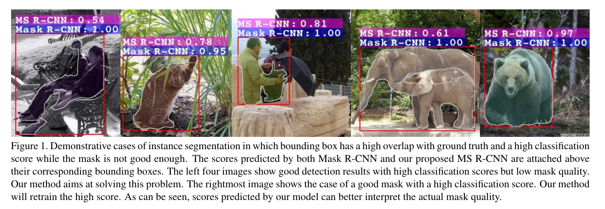
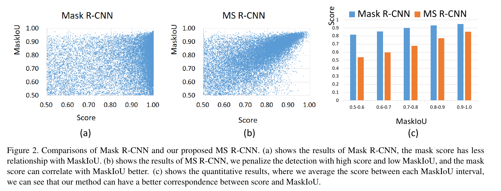
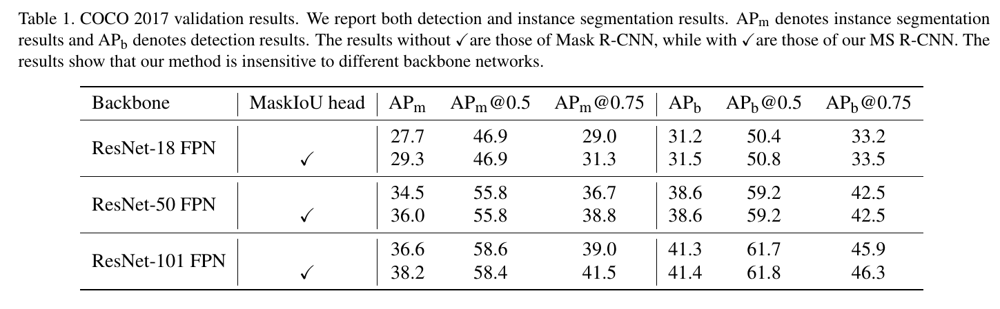
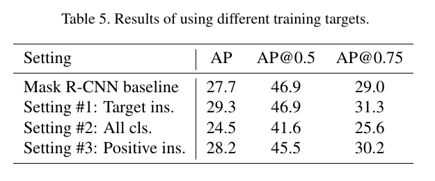
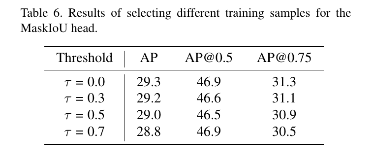
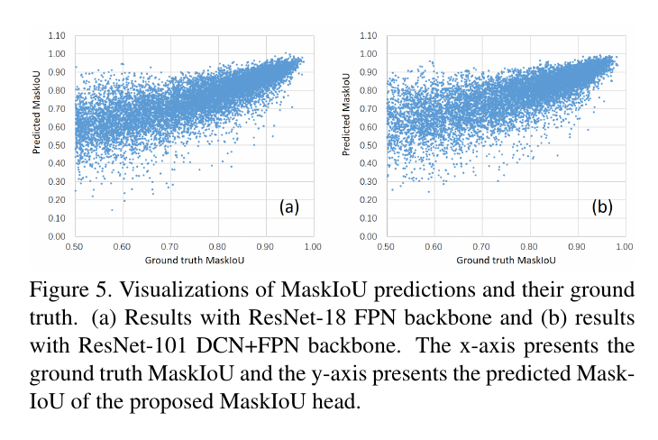

Mask Scoring R-CNN
=

# Abstract
让一个深度网络意识到自己预测的质量是一个有趣但重要的问题。在实例分割任务中，在多数实例分割框架中，将实例分类的置信度作为掩膜质量。然而，掩膜质量（量化为实例掩膜和其ground-truth）之间的IoU，通常没有分类得分良好的关联。本文中，我们研究这个问题并突出Mask Scoring R-CNN，其包含一个网络块来学习预测实例掩膜的质量。所提出的网络块利用实例特征和对应预测掩膜来回归掩膜 IoU 。掩码评分策略校准掩码质量和掩码评分之间的不一致，并通过在COCO AP评估期间优先考虑更准确的掩码预测来提高实例分割性能。通过对COCO数据集的广泛评估，掩模评分R-CNN在不同模型下获得一致且显著的增益，并优于最先进的掩模R-CNN。我们希望我们的简单有效的方法将为改进实例分割提供一个新的方向。我们方法的源代码可以在https://github.com/zjhuang22/maskscoring_rcnn上找到。

# 1. Introduction
深度网络极大地推动了计算机视觉的发展，在分类[22、16、35]、目标检测[12、17、32、27、33、34]、语义分割[28、4、37、18]等方面产生了一系列最先进的技术。从计算机视觉深度学习的发展可以看出，深度网络的预测能力正在逐步从图像级预测[22]提升到区域/边界框级预测[12]、像素级预测[28]和实例/掩码级预测[15]。进行细粒度预测的能力不仅需要更详细的标签，还需要更精细的网络设计。

本文中，我们关注实例分割问题，其为对象检测的自然的接下来一步，即从粗糙的边界框级的实例识别移动到精准像素级分类。具体而言，这项工作提出一种新颖的方法来为实例分割假设评分，这对实例分割评估非常重要。原因在于大多数评价指标是根据假设得分来定义的，更精确的分数有助于更好地描述模型性能。例如，准确率-召回率曲线和平均准确率（AP）是实例分割数据集COCO中常用的。如果一个实例分割假设没有合适地评分，那么他可能被错误地认为是假阳性或假阴性，导致AP下降。

然而，在多数实例分割管道中，例如Mask R-CNN和MaskLab中，实例分割的分数与边界框级分类置信度共享，其由应用与提议特征的分类器预测。使用分类置信度来衡量掩膜质量是不合适的，因为它仅用于区分提议的语义类别，并不知道实例掩码的实际质量和完整性。分类置信度和掩膜质量的不对齐如图1所示，其中实例分割假设获得准确的边界框定位结果以及高分类得分，但是相应的掩膜不准确。显然，使用如此的分类分数来为掩膜打分倾向于降低评估结果。

与之前旨在获得更准去实例定位或分割掩膜的方法不同，我们的方法关注为掩膜评分。为了达到这个目的，我们的模型学习每个掩膜的得分，而不是使用其分类得分。为了简明起见，我们称学习到的得分为mask score。

受实例分割AP度量的启发，该度量为预测掩膜及其ground-truth掩膜之间的IoU来描述实例分割质量，我们提出一个新网络来直接学习IoU。本文中，IoU表示为MasIoU。一旦在测试阶段获得预测的MaskIoU，通过将预测的MaskIoU与分类分数相乘，重新评估掩模评分。因此，掩码评分既知道语义类别，也知道实例掩码的完整性。

学习MaskIoU与提议分类或掩膜预测完全不同，因为它需要“比较”预测掩膜和对象特征。在Mask R-CNN框架下，我们实现了一个名为MaskIoU head的MaskIoU预测网络。我们称所提出的模型（即具有MaskIoU头部的Mask R-CNN）为Mask Scoring R-CNN（MS R-CNN）。使用我们的MS R-CNN进行了大量的实验，结果表明，由于掩模质量和分数之间的一致性，我们的方法提供了一致和显著的性能改进。

总之，这项工作的主要共享强调如下：
1. 我们提出Mask Scoring R-CNN，第一个处理评分实例分割假设的框架。它探索提高实例分割模型性能的一个新方向。考虑到实例掩码的完整性，如果实例掩码的分类分数高，而掩码不够好，则可以对实例掩码的得分进行惩罚。
2. 我们的MaskIoU非常简单而高校。COCO基准上的实验结果表明，当使用来自我们的MS R-CNN掩膜分数而不仅是分类置信度时，在不同的骨干网中，AP持续提高约1.5% 。

# 2. Related Work
## 2.1. Instance Segmentation
当前的实例分割方法可以大致分为两类。一类是基于检测的方法，而另一类是基于分割的方法。基于检测方法利用最佳的检测器（如Faster R-CNN、R-FCN）来获得没分实例的区域，然后预测每个区域的掩膜。Pinheiro等人[31]提出DeepMask以滑动窗口的形式来分割和分类中心对象。Dai等人[6]提出提出实例敏感FCN来生成位置敏感图，并集成它们以获得最终掩膜。FCIS[23]采用具有inside/ouside分数的位置敏感图来生成实例分割结果。He等人[15]提出Mask R-CNN，其通过添加一个实例分割分支在Faster R-CNN顶部来构建。基于 Mask R-CNN，Chen等人[3]提出MaskLab，其使用位置敏感得分来获得更好的结果。然而，这些方法的一个潜在缺点是掩膜质量仅有分类得分衡量，因此导致上面提到的问题。

基于分割的方法首先预测每个像素的类标签，然后将它们分组到一起以形成实例分割结果。Liang等人[24]使用谱聚类来聚类像素。其他工作，例如[20,21]，在聚类过程中添加边界检测信息。Bai等人[1]预测像素级能量值，并使用watershed算法进行分组。最近，有一些工作[30,11,14,10]使用度量学习来学习嵌入。具体而言，这些方法为每个像素学习嵌入来确保相同实例的像素有相似的嵌入。然后对所学习的嵌入进行聚类，得到最终的实例标签。由于这些方法没有显式的分数来度量实例掩码的质量，因此必须使用平均像素级的分类分数作为替代。

上面提到的两类方法没有考虑掩膜得分和掩膜质量之间的对齐。由于不可靠的掩膜分数，由于掩模得分的不可靠性，一个相对于ground truth的IoU较高的掩模假设，如果其掩模得分较低，则容易被低优先级排序。在本例中，最终的AP因此降级。

## 2.2. Detection Score Correction
目前有几种针对检测框分类分值进行校正的方法，其目的与我们的方法相似。Tychsen-Smith等人[36]提出 Fitness NMS，其使用检测边界框和它们ground-truth之间的IoU来纠正检测得分。它将边界框IoU预测作为分类任务。我们的方法不同于这个方法的地方在，我们将掩膜IoU估计作为回归任务。Jiang等人[19]出IoU-Net，其直接回归边界框 IoU，以及将预测IoU用于NMS和边界框精炼。在[5]中，Cheng等人讨论false positive，并使用一个单独的网络来纠正如此样本的得分。SoftNMS[2]使用两个边界框之间的重叠来纠正低分数的边界框。Neumann等人[29]提出Relaxed Softmax来预测安全临界行人检测标准Softmax中的temperature尺度因子值。

与这些关注边界框级检测的方法不同，我们的方法设计用于实例分割。实例掩膜在我们的Mas-IoU头部处理，使得网络可以意识到实例掩膜的完整性，并且最终的掩膜得分反应实例分割假设的实际质量。这是提高实例分割性能的一个新方向。

# 3. Method
## 3.1 Motivation

在最近的Mask R-CNN框架中，检测（即实例分割）假设得分是有其分类得分的最大元素确定的。由于背景杂乱、遮挡等问题，可能出现分类得分高，而掩膜质量低，如图1所示。为了量化分析这个问题，我们将来自mask R-CNN的vanilla mask评分与预测的mask及其ground truth mask (MaskIoU)之间的实际IoU进行比较。具体而言，我们使用具有ResN-18 FPN的Mask R-CNN在COCO2017验证集上进行实验。然后，然后我们选择了MaskIoU和分类分数均大于0.5的Soft-NMS后的检测假设。MaskIoU与分类分值的分布情况如图2 (a)所示，每个MaskIoU区间的平均分类分值如图2 (c)所示，为蓝色。这些图表明，在Mask R-CNN中，分类得分和MaskIoU没有良好的相关。

在多数实例分割评估协议中，例如COCO，具有低MaskIo和高得分的检测假设是有害的。在许多实际应用中，确定检测结果何时可以信任以及何时不能是非常重要的。这启发我们根据每个检测假设的MaskIoU学习校准的掩膜得分。不失一般性，我们在Mask R-CNN框架和提出的Mask Scoring R-CNN（MS R-CNN）上工作，MS R-CNN是具有额外的MaskIoU头部模块的Mask R-CNN，其学习将MaskIoU与mask得分对齐。我们的框架的预测掩膜得分如图2（b）以及图2（c）的橘黄色柱状图。

## 3.2. Mask Scoring in Mask R-CNN
Mask Scoring R-CNN概念简单：具有MaskIo Head的Mask R-CNN，其将实例特征和预测掩膜一起作为输入，并预测输入掩膜和ground-truth掩膜之间的IoU，如图3所示。我们将在接下来的章节中详细介绍我们的框架。

**Mask R-CNN:** 我们从简要回顾Mask R-CNN开始。遵循Fast R-CNN，Mask R-CNN包含两个阶段。第一个阶段是Region Proposal Network（RPN）。它建议候选对象边界框，而不管对象类别。第二阶段称为R-CNN阶段，对每个提案使用RoIAlign提取特征，并对提案进行分类、边界框回归和掩码预测。

**Mask scoring:** 我们定义 $s_{mask}$ 为预测掩膜的得分。理想的 $s_{mask}$ 等于预测掩膜与其匹配ground-truth掩膜之间的像素级IoU，其之前称为 MaskIoU。对于ground-truth类，理想的 $s_{mask}$ 应当仅有正类值，并且对于其他类，只能为零，因为掩膜仅属于一个类。这要求掩膜得分在两个任务上良好地工作：将掩膜分类为正确的类别和为前景对象类回归提议的MaskIoU 。

仅使用单个目标函数很难训练两个任务。为了简明起见，我们可以将掩膜得分学习任务分解为掩膜分类和IoU回归，表示为 $s_{mask} = s_{cls} \cdot s_{iou}$ 。$s_{cls}$ 关注将提议分类为所属的类，$s_{iou}$ 关注回归MaskIoU。

对于 $s_{cls}$, $s_{cls}$ 的目标是对提案所属的类别进行分类，这已经在R-CNN阶段的分类任务中完成。因此，我们可以直接使用相应的分类得分。回归 $s_{iou}$ 为本文的目标，其在接下来的段落讨论。

**MaskIoU head:** MaskIoU头部旨在回归预测掩膜及其ground-truth掩膜之间的IoU。我们使用RoIAlign层和预测掩膜的拼接作为MaskIoU头部的输入。当拼接时，我们使用核大小为2、步长为2的最大池化，从而得到与RoI特征相同空间尺寸预测掩膜。我们仅选择选择回个ground-truth类的MaskIoU（对于测试，我们选择预测类），而不是所有类。我们的MaskIoU头部包含4个卷积层和3个全连接层。对于4个卷积层，我们遵循Mask头部，并在所有的卷积层中分布设置核大小和滤波器数为3和256 。对于3个全连接层，我们遵循RCNN头部，并设置前两个FC层的输出Wie1024，最后的FC输出为类数量。

**Training:** 对于训练MaskIoU头部，我们使用RPN提议作为训练样本。训练样本要求为提议框和匹配的ground-truth框之间的IoU大于0.5 ，其与Mask R-CNN的Mask头部的训练样本相同。为了给每个样本生成回归目标，我们首先获取目标类的预测掩膜，并使用0.5的阈值将预测掩膜二值化。

然后，我们使用二值掩膜和其匹配的ground-truth之间的MaskIoU作为MaskIoU目标。我们使用$l_2$损失来回归MaskIoU，损失权重设置为1 。所提出的MaskIoU头部集成到Mask R-CNN中，并且整个网络端到端训练。

**Inference:** 推理期间，我们仅使用MaskIoU头部来校正R-CNN生成的分类得分。具体而言，假设Mask R-CNN的R-CNN阶段输出 $N$ 个边界框，并选择SoftNMS后的top-k（即 $k = 100$）得分的边界框。然后，将top-k边界框馈入Mask头部以生成多类掩膜。这是标准的Mask R-CNN推断过程。我们也遵循这一过程，并馈入top-k目标掩膜来预测MaskIoU。预测的MaskIoU与分类得分相乘，从而得到新的校准掩膜得分作为最终的掩膜置信度。

# 4. Experiments
所有实验在COCO数据集上进行，该数据集有80个对象类别。我们遵循COCO2017的设置，使用115K图像的train split训练，5k validation split验证，20k test-dev split测试。我们使用COCO评估度量AP（IoU阈值上的平均）来报告结果，包括 AP@0.5、AP@0.75和 $AP_S$ 、$AP_M$、 $AP_L$（不同尺度的AP）。AP@0.5（或者AP@0.75）表示使用IoU阈值0.5（或0.75）来识别一个预测边界框或者掩膜是否值正类。除非说明，AP使用掩膜IoU评估。

## 4.1. Implementation Details
在所有实验中，我们使用重新实现的Mask R-CNN。我们使用基于ResNet-18的FPN网络来进行消融研究，基于ResNet-18/50/101的Faster RCNN/FPN/DCN+FPN来将我们的方法与其他基线结果进行比较。在训练和测试期间，对于ResNet-18 FPN，输入图像调整到短轴有600px，而长轴最大为100px。与标准FPN不同，ResNet-18中，RPN提议和特征提取器仅使用C4、C5。对于ResNet-50/101，输入图像的沿短轴调整到800像素，沿长轴调整到1333px。余下ResNet-50/101的配置遵循Detectron。我们训练所有的网络18个epoch，在14和17个epoch后降低学习率0.1倍。动力为0.9的同步SGD作为优化器。对于测试，我们使用SoftNMS，并且每幅图像保留top-100得分检测。

## 4.2. Quantitative Results
我们在不同的骨干网络（包括ResNet-18/50/101）和不同的框架（包括Faster R-CNN/FPN/DCN+FPN）上报告结果，从而证明我们的方法的有效性。结果如表1和表2 。

## 4.3. Ablation Study
我们在COCO2017验证集上全面评估我们的方法。我们在所有的消融研究实验中使用ResNet-18 FPN。

**The design choices of MaskIoU head input:** 我们首先研究MaskIoU 头的输入选择的设计，其为掩膜头部的预测掩膜得分图（$28 \times 28 \times C$）与RoI特征的融合。图4中呈现了几种设计选项，并解释如下：
（a） 目标掩膜拼接RoI特征：获取目标类的得分图并最大池化，然后与RoI特征拼接。
（b）目标掩膜乘以RoI特征：获取目标类的得分图并最大池化，然后与RoI特征相乘。
（c）所有掩膜与RoI特征拼接：池化所有 $C$ 类掩膜得分图，并与RoI特征拼接。
（d）目标掩膜拼接高分辨率的RoI特征：获取目标类的得分图，并与$28\times28$的RoI特征拼接。

结果如表4 。

**The choices of the training target:** 如前面提到的，我们将掩膜得分学习分解为掩膜分类和MaskIoU回归。是否有可能直接学习掩膜得分？此外，RoI中可能包含多个对象类。我们是否学习所有类的MaskIoU？如何设置MaskIoU头部的训练目标仍需要探索。有许多训练目标的不同选项：
1. 学习目标类的MaskIoU，同时忽略提议中的其他类。这也是本文的默认训练目标，以及是本段所有实验的对照组。
2. 学习所有类的MaskIoU。如果一个类没有出现在RoI中，它们的目标MaskIoU设置为 0 。这设置表示仅使用回来预测MaskIoU，其要求回归其能认识到无关类的缺席。
3. 学习所有正类的MaskIoU，其中正类表示在RoI区域中出现的类。并忽略提议中余下的类。此设置用于查看对RoI区域中的更多类别执行回归是否会更好。

表5呈现了上述训练目标的结果。

**How to select training samples:** 由于所提出的MaskIoU头部构建在Mask R-CNN框架的顶部，根据Mask R-CNN的设置，MaskIoU头部的所有训练样本与其ground-truth边界框的边界框级IoU大于0.5。然而，它们的MaskIoU可能没有超过0.5 。

给定阈值 $\tau$ ，我们使用MaskIoU大于 $\tau$ 的样本来训练 MaskIoU头部。表6呈现了结果。结果表明使用所有的样本获得最佳性能。

## 4.4. Discussion
本节中，我们首先讨论预测的MaskIoU的质量，然后研究，如MaskIoU是完美的，那么Mask Scoring R-CNN的性能上界，并在最后分析MaskIoU的计算复杂度。在讨论中，所有的结果使用较弱的骨干网络（即ResNet-18 FPN）和较强的不敢网络（即ResNet-101 DCN+FPN）在COCO2017验证集上获得。

**The quality of the predicted MaskIoU:** 我们使用ground-truth和预测MaskIoU之间的相关稀疏来衡量我们的预测的质量。回顾我们的测试过程，我们根据分类得分，选择在SoftNMS之后选择前100分数的边界框，将这些检测框馈入Mask头部，并获得预测掩膜，然后使用预测掩膜和RoI特征作为MaskIoU头部的输入。MaskIoU头部的输出和分类得分进一步集成到最终的掩膜的得分。

在COCO2017验证数据集上，我们为每幅图像保留100个预测MaskIoU，从5000张图像上收集500000个预测。我们在图5中绘制了每个预测与它们相应的ground-truth。我们可以看到，MaskIoU预测与它们的ground-truth有良好的相关性，特别是对较高MaskIoU的这些预测。对于ResNet-18 FPN和ResNet-101 DCN+FPN，预测与其ground-truth之间的相关稀疏大约为0.74。它表明预测的质量对骨干网络的变化不敏感。这种结论与表1一致。因为之前没有方法预测MaskIoU，我们称前面的工作为预测边界框IoU。[19]（IoU-Net）获得0.617的相关稀疏，其次于我们。

**The upper bound performance of MS R-CNN:** 这里，我们将讨论我们方法的性能上界。对于每个预测掩膜，我们可以找出与其匹配的ground-truth掩膜；然后，当ground-truth MaskIoU大于0时，我们仅使用ground-truth MaskIoU来替换预测MaskIoU。结果如表7所示。结果表明，Mask Scoring R-CNN一致优于Mask R-CNN 。与Mask Scoring R-CNN的理想预测相比，实际的Mask Scoring R-CNN仍有改进空间，其中ResNet-18 FPN骨干评分为2.2% AP, ResNet-101 DCN+FPN骨干评分为2.6% AP。

**Model size and running time:** 对于每个提议，我们的MaskIoU头有大约0.39G FLOPS，而Mask头有大约0.53G FLOP。我们使用TITAN V GPU来测试速度（sec./image）。对于ResNet-18 FPN，无论是对于Mask R-CNN还是MS R-CNN，速度都在0.132左右。对于ResNet-101 DCN+FPN，掩模R-CNN和MS R-CNN的速度都在0.202左右。掩模评分R-CNN中MaskIoU头的计算成本可以忽略不计。