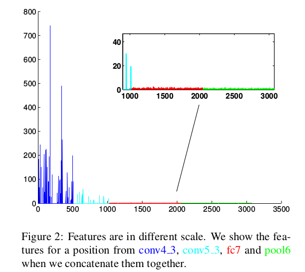
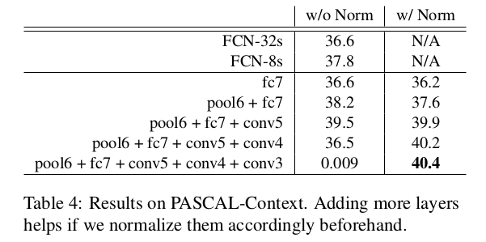

ParseNet: Looking Wider to See Better
=

# 1 Introduction
FCN忽略关于图像的全局信息，因此忽略了语义上下文的潜在有用的场景级信息。在使用深度学习分割图像之前，就有全局上下文的研究。从FCN架构开始，几种方法集合图模型（如CRF）将全局上下文和结构化信息引入FCN。虽然这些方法功能强大，但它们需要更多的黑魔法（管理训练方法和参数的专业知识）来训练网络，并且可能导致更复杂的架构以及更难或至少更耗时的训练和推理。

先前的工作表明，通过将整个图像中的特征与局部斑块上的特征连接起来，可以不再需要CFR平滑过程，因为整个图像特征已经编码了平滑信息。并且简单地添加如此的上下文特征也有助于检测和分割任务。

图1介绍了本文如何引入上下文模块。注意，某些层特征的尺度（就每个维度的值而言）比其他层的更大，使得难以直接组合它们用于预测。因此，首先使用 $l_2$ 规范化特征，接着应用一个合适的缩放因子，这个因子也通过反向传播学习。

# 3 ParseNet
# 3.1 Global Context
语义分割是按像素或每个块进行分类，如果仅使用局部信息则很难完成。然而，如果提供具有整幅图像的上下文的分类器时，这个任务就变得更加简单。虽然理论上，网络更高层具有非常大的感受野（如使用VGG的FCN的 $fc7$ 有 $404 \times 404$ 像素的感受野），但是实际上更高层的感受野要小得多。据[32]可知，实际感受野大小大于是理论的25% ，因此妨碍从全局决策中建模。明确地添加整个图像的特征是必需的，并且在FCN架构中非常直接。_具体地，使用全局均值池化最后一层或者任何期望的层的上下文特征。_ 这显著提升网络的语义分割质量。

## 3.2 Early Fusion and Late Fusion
一旦获得全局上下文特征，就需要将其融合到网络中。有两种方法将全局上下文特征融合到局部特征中。首先，是早融合（early fusion），如图1，将全局特征在空间上unpool（复制）到与局部特征映射相同的大小，然后将它们连接起来，并使用组合特征来学习分类器。其次是，后融合（late fusion），其中每个特征用于学习它自己的分类器，接着将两种预测合并到单个分类得分中。

两种融合方法都有优势和劣势。如果组合特征后不存在额外的操作，早融合与后融合很相似。对于后期融合，可能存在这样的情况，即单个特征无法识别但是组合它们可能并且一旦每个都进行预测就无法恢复它。这种方式是本文不推荐的。

通过早期融合，可以添加额外的容量，非线性或降维（1×1卷积层），以将非线性变换应用于组合特征。注意这导致增加内存和计算量。表7比较不同的组合策略，并证明合适的 $l_2$ 规范化比 $1\times1$卷积层更好。

在融合特征时，必须仔细规范每个单独的特征以让特征很好的工作；在经典计算机视觉中，这称为提示组合问题（cue combination problem）。如图2所示，在从递增的更高层（从左到右）组合的位置处提取特征向量，其中低层特征具有比更高层层更大的尺度。正如4.2节中所讲的，通过朴素地组合特征，所得特征将不具有辨别力，并且将需要大量参数调整以实现足够的精度。相反，本文首先是 $l_2$ 规范每个特征，并学习可能的尺度参数，这使得学习更加稳定。

## 3.3 $l_2$ Normalization Layer
朴素地联结特征将导致较差的性能，因为“更大”的特征主导“更小”的特征。尽管在训练期间，权重会相应调整，但是需要非常仔细的参数调整，并依赖数据，因此，这违背鲁棒性原则。如表4所示，在PASCAL-Context数据集上，可以组合conv4的特征，并获得最佳性能，然而，如果进一步添加conv3，网络崩溃了。

具体地，令 $l$ 为需要最小化的损失，本文使用softmax 损失和。对于d维输入 $x = (x_1, \cdots, x_d)$ 的层，使用 $l_2$-norm 规范化：
$$\hat{x} = \frac{x}{\|x\|}_2  \tag 1$$
其中 $\|x\| _ 2$ 是 $x$ 的 $l_2$ 范数：
$$\|x\| _ 2 = (\sum_{i=1}^d|x_i|^2)^{1/2}  \tag 2$$
直接使用公式（1），特征将会很小，使得网络难以训练。受batch normalization和PReLU的启发，引入缩放参数 $\gamma_i$ ，对于每个通道，缩放规范化的值：
$$y_i = \gamma_i \hat{x}_i  \tag 3$$

在方向传播期间，可以通过链式法则计算 $\gamma$ 的梯度：
$$
\begin{alignat}{0}
\frac{\partial l}{\partial \hat{x}} = \frac{\partial l}{\partial y} \cdot \gamma  \tag 4   \\
\frac{\partial l}{\partial x} = \frac{\partial l}{\partial \hat{x}} (\frac{I}{\|x\| _ 2} - \frac{xx^T}{\|x\| _ 2^3})  \tag 5   \\
\frac{\partial l}{\partial \gamma_i} = \sum_{y_i}\frac{\partial l}{\partial y_i} \hat{x}_i \tag 6   
\end{alignat}
$$
