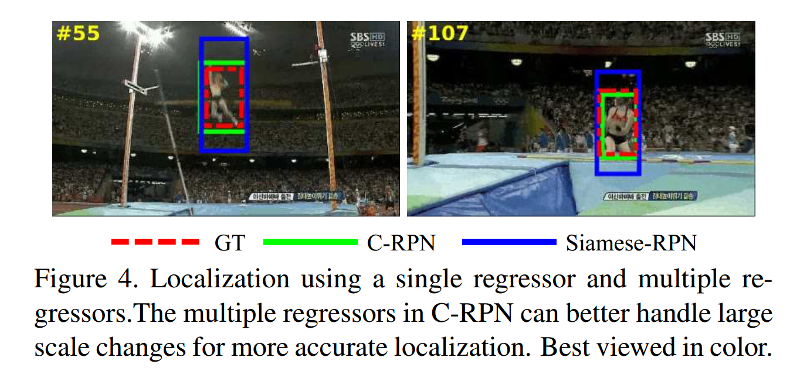
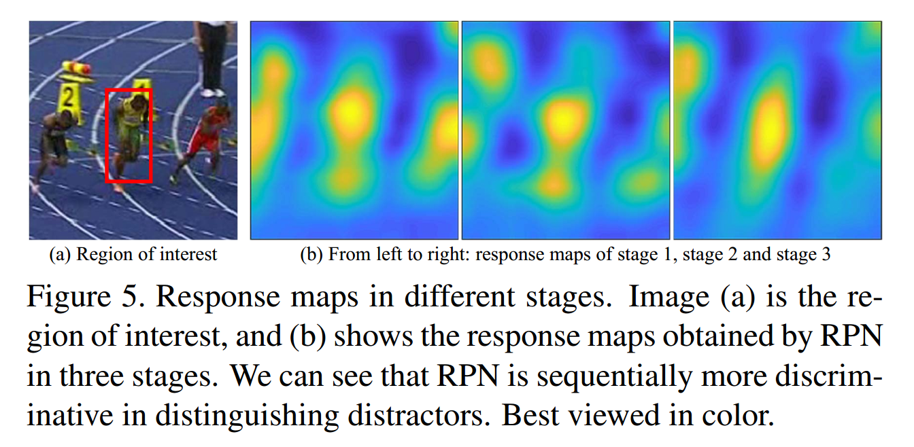
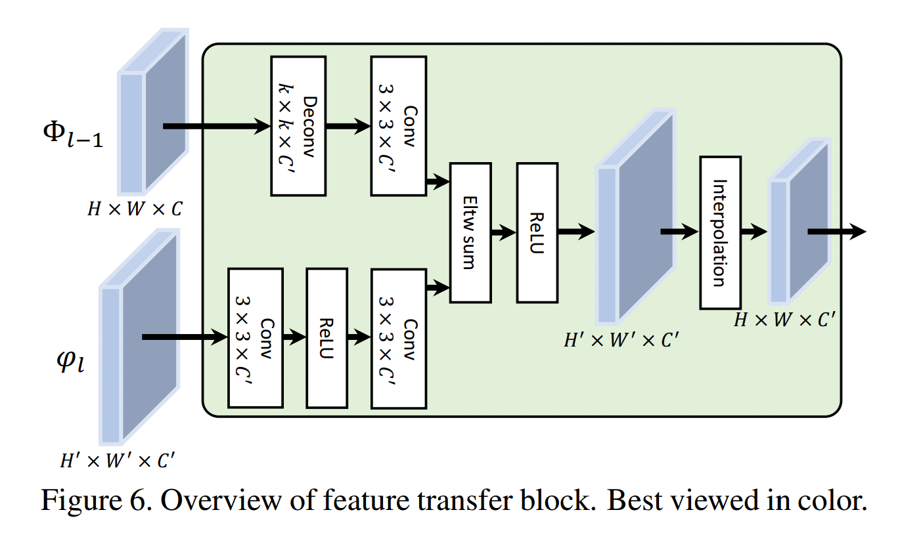
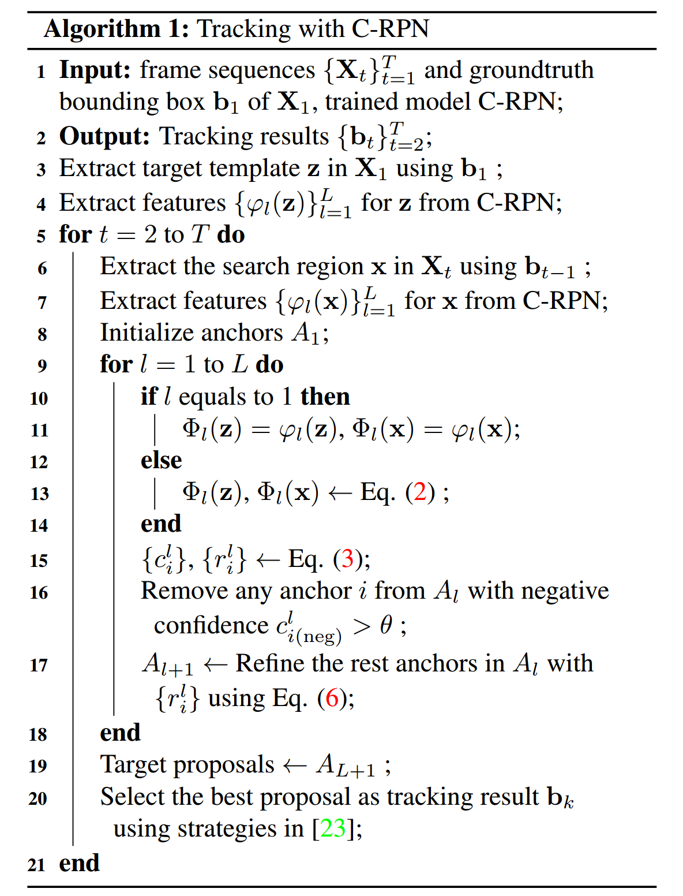
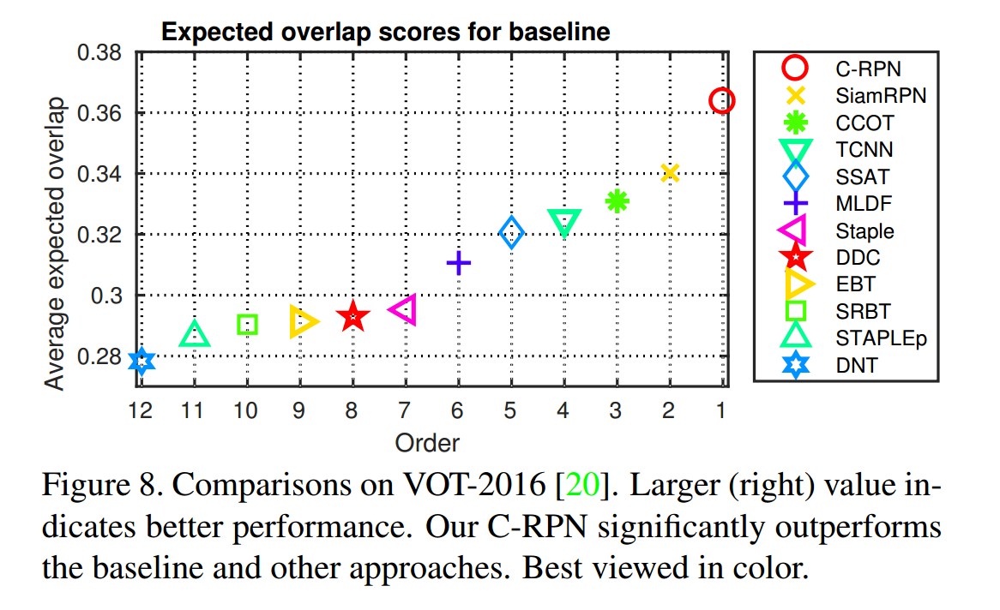
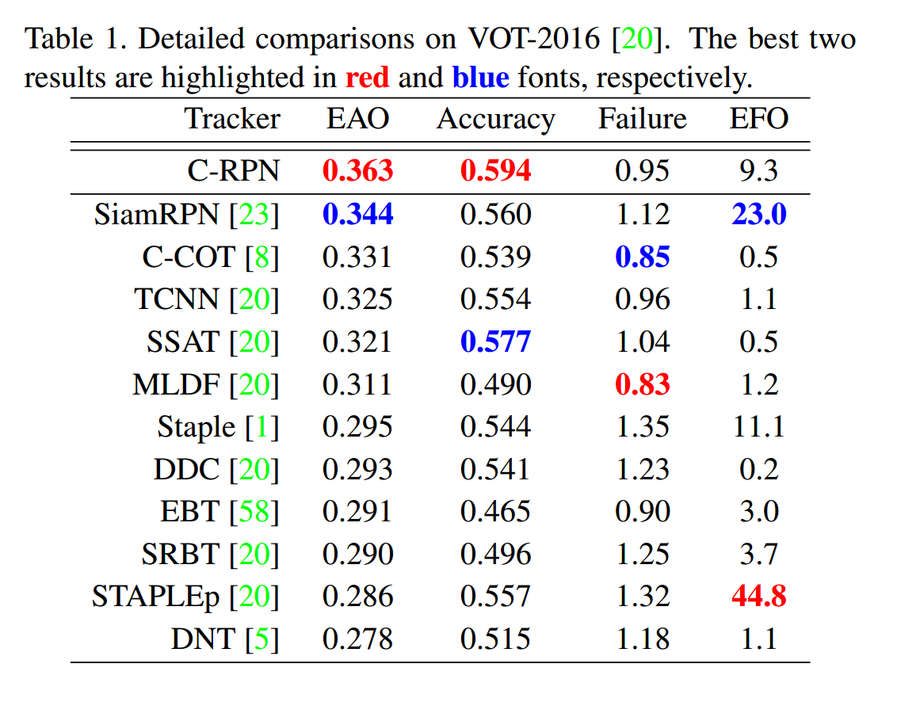
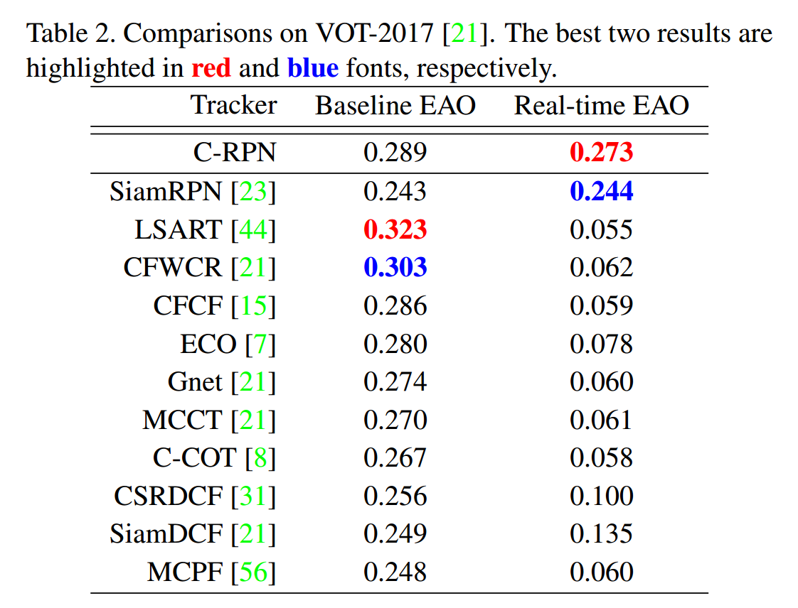
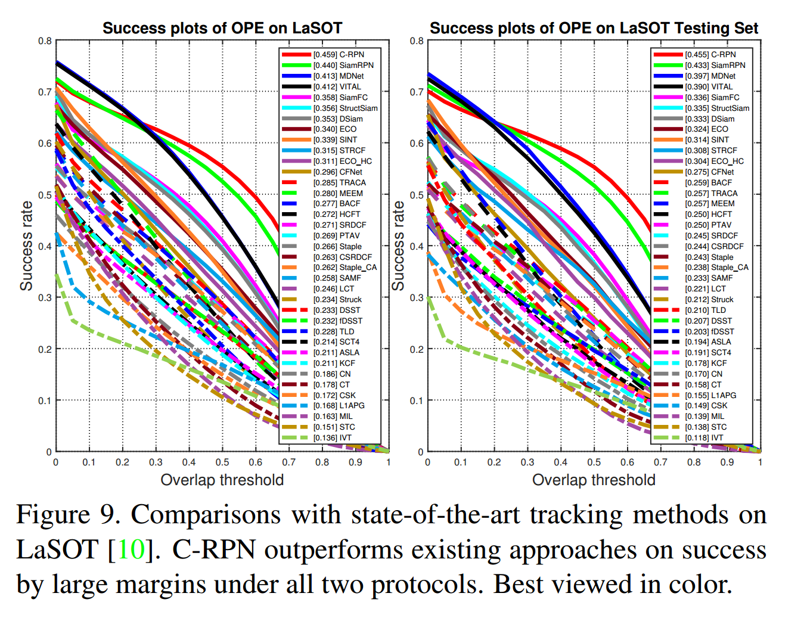

### Siamese Cascaded Region Proposal Networks  for Real-Time Visual Tracking

**Abstract**

​		最近，区域提议网络（RPN）与 Siamese 网络结合进行跟踪，并且表现出色的准确率和高效率。然而，先前提出的单级 Siamese-RPN 跟踪器在存在类似干扰物和大规模尺度变化的情况下会退化。为了解决这些问题，我们提出了一个多阶段跟踪框架，即 Siamese 级联 RPN（C-RPN），该框架包含 Siamese 网络的从深层的高级层到浅层的低级层的一系列级联的 RPN 。与之前的解决方案相比，C-RPN 有几个优势：**（1）**每个 RPN 使用前一个阶段的 RPN 的输出训练。这样的过程会刺激困难的负样本，导致更不平衡的训练样本。因此，RPN 在区分困难的背景（即类似的干扰因素）时将更具辨别性。**（2）**每个 RPN 通过一个新颖的特征迁移块（feature transfer block：FTB）来充分利用多级特征，使用高级语义和低级空间信息进一步改进了 C-RPN 的辨别性。**（3）**通过多步回归，C-RPN 通过上一阶段调整的锚框逐步精炼每个 RPN 中目标的位置和形状，这使得位置更加准确率。C-RPN 利用多任务损失函数端到端训练。在推理期间，C-RPN 按照原样部署，而没有任何时序适应，从而进行实时跟踪。在 OTB-2013、OTB-2015、VOT-2016、VOT-2017、LaSOT 和 TrackingNet 上的大量实验中，C-RPN始终获得最佳的结果和实时运行速度。

#### 1. Introduction

​		视觉跟踪是计算机视觉中最基本的问题之一，并且具有众多的应用程序，例如机器人技术、人机交互、智能车辆和监控等。尽管近年来取得了长足的进步，但是由于许多因素（包括遮挡、尺度变化等），视觉跟踪仍然具有挑战性。

​		最近，由于 Siamese 网络平衡的准确率和速度，所以在跟踪社区中取得极大的关注。通过将对象跟踪构建为匹配问题，Siamese 跟踪器 [2、17、19、23、45、46、51、59] 旨在从大型视频数据集上离线学习一个通用的相似度函数。在这些方法中，[23]的工作将 RPN（最初用于对象检测）引入 Siamese 网络，从而提出一阶段的 Siamese-RPN 。通过 RPN 提取提议，该方法可以同时从多个尺度进行分类和定位，从而实现出色的性能。此外，RPN 的使用避免了应用耗时的金字塔进行目标尺度估计[2]，产生了一个实时解决方案。

##### 1.1 Problem and Motivation

​		尽管取得了令人鼓舞的结果，但 Siamese-RPN 可能会漂移到背景，尤其是在存在类似语义干扰项的情况下（见图1）。我们确定了造成这个问题的两个原因。

​		第一，训练样本的分布是不平衡的：（1）正类样本远远少于负类样本，从而导致 Siamese 网络的低效训练；（2）大多数负样本是容易的负样本（不相似的非语义背景），这些样本在训练辨别式分类器[29]时，贡献少量有用的信息。因此，分类器被易分的背景样本占据主导，并且，当遭遇困难的相似语义干扰因素时，会有性能衰减。

​		第二，低级空间特征没有得到充分利用。在 Siamese-RPN（以及其他 Siamese 跟踪器）中，仅仅使用最后一层的特征来区分目标/背景，最后一层的特征包含更多的语义信息。然而，在跟踪过程中，背景干扰因素和目标可能属于相同的类别，以及/或者有相似的语义特征 [49] 。在这样的案例中，高级语义特征在区分目标/背景时，缺乏辨别性。

​		除了上述问题，一阶段 Siamese-RPN 还使用具有预定义的锚框的单个回归器进行目标定位。当这些锚与目标具有较高的重叠时，它们有望工作很好。但是，对于无模型的视觉跟踪，没有关于目标对象的先验信息是已知的，并且很难估计目标的尺度是如何变化。在一步回归中使用预定义的粗糙锚框不足以进行准确的定位[3、14]（再次参见图1）。

​		类不平衡问题在两阶段对象检测器中得到处理（例如 Faster R-CNN[38]）。第一个提议阶段逐渐过滤掉大多数背景样本，然后，第二个分类阶段采用启发式采样（例如固定的前景背景比例）来维持前景和背景之间可控的平衡。此外，即使对象有极端的形状，回归的两个步骤也获得准确率的定位。

​		受两阶段检测器的启发，我们提出多阶段跟踪框架，它通过级联 RPN 序列来解决类不平衡问题，同时，充分利用跨层的特征进行鲁棒性视觉跟踪。

##### 1.2. Contribution

​		作为**第一个贡献**，我们引入了一种新颖的多阶段跟踪框架，即 Siamese 级联RPN（C-RPN），以通过执行难负采样来解决类不平衡的问题[40、48]。C-RPN 包含包含 Siamese 网络从高级层到低级层的级联 RPN 序列。在每个阶段（级）中，RPN 执行分类和定位，并输出这一阶段中锚框的分类得分和回归偏移。然后，过滤掉容易的负类锚，如下的锚（视为困难样本）用作下一阶段的 RPN 的训练样本。通过这样的过程，C-RPN 执行逐阶段的难负样本采样。因此，训练样本的分布逐渐更加平衡，而 RPN 的分类器在区分更困难的干扰因素上也具有更大的判别力（见图1）。

​	与单阶段SiamRPN相比，C-RPN的**另一个好处**是目标定位更准确[23]。由于有多个 RPN，导致 C-RPN 由多个回归步骤组成，而不是在单个回归步骤中使用预定义的粗糙锚框。在每个阶段中，通过回归器调整锚框（包括位置和大小），这为下一阶段的回归器提供了更好的初始化。因此，C-RPN 可以渐进地精炼目标边界框以进行更好的定位，如图1所示。

​		利用网络的不同层的特征已被证明对提高模型辨别能力有益[27、28、30]。为了充分利用高级语义和低级空间特征进行视觉跟踪，我们通过指定新颖的特征迁移块（feature transfer block：FTB）来作出**第二个贡献**。FTB 确保将高级特征融合到低级 RPN，而不是在一个 RPN 中使用单层的特征，这进一步提高其辨别能力来处理复杂的背景，导致 C-RPN 产生更好的性能。C-RPN 的结构如图 2 。

​		在六个基准测试（包括OTB-2013、OTB-2015、VOT-2016、VOT-2017、LaSOT 和 TrackingNet）上的大量实验中，我们的 C-RPN 获得最佳结果，并以实时速度运行。

#### 2. Related Work

**Deep tracking**	受图像分类 [18、22] 中成功的启发，视觉跟踪引入深度卷积神经网络，并展现优秀的性能 [7、8、12、32、35、43、49、50] 。Wang 等 [50]  提出堆叠的去噪字编码器来学习通用特征表示以进行跟踪中的对象外观建模。Ma 等 [32] 将深度特征应用于相关滤波跟踪，获得了显着的收益。Nam 和 Han [35] 提出了一种具有在线更新特征的轻型 CNN 架构，以学习用于跟踪目标的通用特征。Fan 和 Ling [12] 通过引入捕获对象结构的递归神经网络（RNN）来扩展此方法。Song 等 [43] 使用 CNN 中的对抗学习来学习更丰富的表示进行跟踪。Danelljan 等 [8] 为相关滤波跟踪提出连续卷积滤波器，随后在[7]中对该方法进行了优化。

**Siamese tracking**	Siamese 网络因其平衡的准确率和效率，受到人们越来越多的关注。Tao 等 [45] 使用 Siamese 网络来从视频中学习匹配函数，然后使用固定的匹配函数搜索目标。Bertinetto 等 [2] 提出全卷积的 Siamese 网络（SiamFC），用于通过测量目标和候选对象之间的区域特征相似性进行跟踪。归功于其轻量的结构以及无需模型更新，SiamFC 以 80 fps 的速度高效运行。Held 等 [19] 提出 GOTURN 方法，该方法利用 Siamese 网络学习运动预测模型。Valmadre 等 [46] 使用 Siamese 网络来学习相关滤波跟踪的特征表示。He 等 [17] 引入双重 Siamese 网络进行跟踪。后来，在 [16] 中，它们通过纳入角度估计和空间掩膜，改进了这个双重 Siamese 跟踪。Wang 等 [51] 将注意力机制引入 Siamese 网络以学习更具辨别性的指标进行跟踪。值得注意的是，Li 等 [23] 将 Siamese 网络与 RPN 结合，并提出一阶段的 Siamese-RPN 跟踪器，获得优秀的性能。Zhu 等 [59] 利用更多负样本来改进 Siamese-RPN 跟踪器。尽管取得了进步，但是这个方法需要其他域的大量额外训练数据。

**Multi-level features**	神经网络不同层的特征包含不同的信息。高级特征包含更多的抽象信息，而低级层包含更详细的空间信息[30]。已经证明了使用多级特征有益于跟踪。在 [32] 中，Ma 等为三个相关模型独立使用三个不同层的特征，并将它们的输出融合得到最终的跟踪结果。Wang 等 [49] 开发了具有两层特征的两个回归模型，以区分相似的语义干扰因素。

**Cascaded structure**	级联结构已是提高性能的流行策略。Viola 等 [48] 提出了简单特征的增强级联，用于高效对象检测。Li 等 [24] 为人脸检测提出构建在 CNN 上的级联结构，并高效地实现强大的判别能力。Cai 等 [3] 提出多阶段的对象检测框架（Cascade R-CNN），旨在通过依次增加 IoU 阈值进行高质量检测。Zhang 等 [15] 利用级联通过调整锚点来完善检测结果。

**Our approach**	本文中，我们关注解决类不平衡问题以提高建模辨别性。我们的方法与 Siamese-RPN 相关但有不同之处，Siamese-RPN 应用一阶段 RPN 进行分类和定位，并跳过数据不平衡问题。相比之下，我们的方法通过难负样本采样级联了 RPN 序列来处理数据不平衡，并使用多个回归渐进式地精炼锚框以进行更好的目标定位。我们的方法也与使用多级特征进行跟踪的 [32、49] 相关。然而，与[32、49]不同，它们为相互独立的模型独立使用多级特征（即决策级的融合），我们提出特征迁移块来为每个 RPN 融合跨层的特征，改进了从复杂背景中区分目标的辨别能力。

#### 3. Siamese Cascaded RPN (C-RPN)

​		本节中，我们详细介绍 Siamese Cascaded RPN（简称 C-RPN），如图2所示。

​		C-RPN 包含两个子网络：Siamese 网络和 Cascaded RPN。利用 Siamese 网络来提取目标模板 $\mathbf{x}$ 和搜索区域 $\mathbf{z}$ 的特征。然后，C-RPN 的每个 RPN 接收 $\mathbf{x}$ 和 $\mathbf{z}$ 的特征。对于 RPN，我们使用特征迁移块（FTB）来融合高级层的特征，而不是仅使用某一层的特征。在 $\mathbf{z}$ 的特征图上，RPN 同时进行分类和定位。基于分类得分和回归偏移，我们过滤掉容易的负锚（例如，负类置信度得分小于预设阈值 $\theta$ 的锚框），并在下一个阶段的 RPN 训练中精炼余下的锚。

##### 3.1. Siamese Network

​		与 [2] 相同，我们采用修改的 AlexNet [22] 来开发我们的 Siamese 网络。Siamese 网络包含两个相同的分支（ z-分支和 x-分支），它们分别用于从 $\mathbf{z}$ 和 $\mathbf{x}$ 上提取特征（见图2）。关于 Siamese 网络的更多细节见 [2] 。

​		与仅使用 Siamese 网络的最后层的特征进行跟踪不同，我们利用多级特征来提高模型鲁棒性。为了方便起见，我们将具有 $N$ 层的 Siamese 网络中来自 $conv-i$ 层的 $z$ 和 $x$ 的特征变换表示为 $\varphi_i(\mathbf{z})$ 和 $\varphi(\mathbf{x})$ 。（为了简化符号，以从低级层到高级层的逆序来命名 Siamese 网络的每一层，即 $conv-N$、 $conv-(N-1)$、$\cdots$  $conv-2$、 $conv-1$ 。）

##### 3.2. One-Stage RPN in Siamese Network

​		在介绍 C-RPN 之前，我们首先回顾一阶段的 Siamese-RPN 跟踪器 [23]，其包含锚分类和回归两个分支，如图3所示。它以 $\mathbf{z}$ 和 $\mathbf{x}$ 的特征变换 $\varphi_1(\mathbf{z})$ 和 $\varphi_1(\mathbf{x})$ 作为输入，并输出锚的分类得分和回归偏移。为了简单起见，我们在下一节中移除下标。

​		为了确保对每个锚进行分类和回归，利用两个卷积层来将 $\varphi(\mathbf{z})$ 的通道调整到稳定的形式，以分别进行分类和回归，这两个卷积分别表示为 $[\varphi(\mathbf{z})]_{cls}$ 和 $[\varphi(\mathbf{z})]_{reg}$ 。相似地，我们将两个卷积层应用到 $\varphi(\mathbf{x})$ ，但是保持通道不变，并且获得 $[\varphi(\mathbf{z})]_{cls}$ 和 $[\varphi(\mathbf{z})]_{reg}$ 。因此，每个锚的分类得分 $\{c_i\}$ 和回归偏移 $\{r_i\}$ 计算为：

$$\begin{align} \{c_i\} &= corr([\varphi(\mathbf{z})]_{cls}, [\varphi(\mathbf{x})]_{cls}) \\ \{r_i\} &= corr([\varphi(\mathbf{z})]_{reg}, [\varphi(\mathbf{x})]_{reg}) \end{align} \tag{1}$$

其中 $i$ 为锚索引，而 $corr(\mathbf{a}, \mathbf{b})$ 表示 $\mathbf{a}$ 和 $\mathbf{b}$ 之间的相关，其中 $\mathbf{a}$ 用作内核。每个 $c_i$ 是一个 2D 向量，表示第 $i$ 个锚的负类和正类置信度。相似地，每个 $r_i$ 是一个 4D 向量，其表示锚的中心点位置和大小到 ground-truth 的偏移。Siamese RPN 利用多任务损失训练，这个多任务损失包含：分类损失（即 softmax 损失）和回归损失（即 smooth $L_1$ 损失）。读者可以参考 [23、38] 进一步了解详情。

 ##### 3.3. Cascaded RPN

​		如上所述，前面的 Siamese 跟踪器大多忽略类不平衡问题，当相似语义的干扰物出现时，会产生性能衰退。此外，它们仅使用最后一层的高级语义，这没有充分利用多级特征。为了处理这个问题，我们提出级联 $L(L \le N)$ 的 RPN 的多阶段跟踪框架。

​		对于第 $l(1 < l \le L)$ 个阶段中的 $\mbox{RPN}_l$ ，它从 FTB 接收 $\Phi_l(\mathbf{z})$ 与 $\Phi_l(\mathbf{x})$ 的 $conv-l$ 层和高级层的融合特征。 $\Phi_l(\mathbf{z})$ 与 $\Phi_l(\mathbf{x})$ 通过如下公式获得：

$$\begin{align}\Phi_l(\mathbf{z}) &= \mbox{FTB}(\Phi_{l-1}(\mathbf{z}, \varphi_l(\mathbf{z})) \\ \Phi_l(\mathbf{x}) &= \mbox{FTB}(\Phi_{l-1}(\mathbf{x}, \varphi_l(\mathbf{x})) \end{align} \tag{2}$$

其中 $\mbox{FTB}(\cdot, \cdot)$ 表示3.4节描述的 FTB 。对于 $\mbox{RPN}_1$ ，$\Phi_1(\mathbf{\mathbf{z}}) = \varphi_1(\mathbf{z})$ 和 $\Phi_1(\mathbf{x}) = \varphi_1(\mathbf{x})$ 。因此，阶段 $l$ 中的锚的分类得分 $\{c_i^l\}$ 和回归偏移 $r_i^l$ 计算为

$$\begin{align}\{c_i^l\} &= corr([\Phi_l(\mathbf{z})]_{cls}, [\Phi_l(\mathbf{x})]_{cls}) \\ \{r_i^l\} &= corr([\Phi_l(\mathbf{z})]_{reg}, [\Phi_l(\mathbf{x})]_{reg} )\end{align} \tag{3}$$

其中在 $\Phi_l(\mathbf{z})$ 和 $\Phi_l(\mathbf{x})$ 上执行卷积来推导 $[\Phi_l(\mathbf{z})]_{cls}$、$[\Phi_l(\mathbf{x})]_{cls}$、$[\Phi_l(\mathbf{z})]_{reg}$ 和 $[\Phi_l(\mathbf{x})]_{reg}$ 。

​		令 $A_l$ 表示阶段 $l$ 的锚框集合。利用分类得分 $\{c_i^l\}$ ，我们可以过滤掉 $A_l$ 中负类置信度大于预设阈值 $\theta$ 的锚，并且剩下的锚构成一个新的锚框集合 $A_{l+1}$ ，它用于训练 $\mbox{RPN}_{l+1}$ 。对于 $\mbox{RPN}_1$ ，$A_1$ 是预定义的。此外，为了给 $\mbox{RPN}_{l+1}$ 的回归器提供更好的初始化，我们使用 $\mbox{RPN}_l$ 中的回归结果 $\{r_i^l\}$ 来精炼 $A_{l+1}$ 中的锚，因此生成比 Siamese RPN [23]  的单步回归的定位结果更准确，如图4所示。图2给出了 C-RPN 的级联结构。

​		包含分类损失函数 $L_{cls}$ （softmax 损失）和回归损失 $L_{loc}$ （smooth $L_1$ 损失）的 $\mbox{RPN}_l$ 的损失函数 $\mathcal{l}_{\mbox{RPN}_l}$ 如下：

$$\mathcal{l}_{\mbox{RPN}_l}(\{c_i^l\}, \{c_i^l\}) = \sum_i L_{cls}(c_i^l, c_i^{l*}) + \lambda\sum_i c_i^{l*} L_{loc}(r_i^l, r_i^{l*}) \tag{4}$$

其中 $i$ 为阶段 $l$ 的 $A_l$ 中锚索引，$\lambda$ 是平衡损失的权重，$c_i^{l*}$ 为锚 $i$ 的标签，而 $r_i^{l*}$ 为锚 $i$ 和 ground-truth 之间的真实距离。遵循 [38] ，$r_i^{l*} = (r_{i(x)}^{l*}, r_{i(y)}^{l*}, r_{i(w)}^{l*}, r_{i(h)}^{l*})$ 是一个 4D 向量，使得

$$\begin{align} r_{i(x)}^{l*} &= (x^\ast - x_a^l) / w_a^l &r_{i(y)}^{l*} &= (y^\ast - y_a^l) / h_a^l \\ r_{i(w)}^{l*} & = \log(w^\ast/w_a^l) &r_{i(h)}^{l*} &= \log(y^\ast/h_a^l) \end{align} \tag{5}$$

其中 $x$、$y$、$w$ 和 $h$ 是边界框的中心坐标和其宽高。变量 $x^\ast$ 和 $x_a^l$ 用于阶段 $l$ 的 ground-truth 和锚（同样适用于 $x$、$y$ 和 $h$）。值得注意的是，与使用固定锚的 [23] 不同，C-RPN 中的锚通过下一阶段的回归器渐进式地调整，计算为：

$$\begin{align}x_a^l &= x_a^{l-1} + w_a^{l-1}r_{i(x)}^{l-1} &y_a^l &= y_a^{l-1} + h_a^{l-1}r_{i(y)}^{l-1} \\ w_a^l &= w_a^{l-1} \exp(r_{i(w)}^{l-1}) & h_a^l &= h_a^{l-1} \exp(r_{i(h)}^{l-1})\end{align} \tag{6}$$

对于 $A_1$ 中锚，$x_a^1$ 、$x_a^1$、$w_a^1$ 和 $h_a^1$ 是预定义的。

​		上述过程构成了所提出级联的 RPN 。由于拒绝容易的负锚，每个 RPN 的训练样本的分布逐渐更平衡。因此，每个RPN的分类器在区分困难的干扰因素时依次更具辨别性。此外，多级特征的形式进一步提高处理复杂背景的辨别性。图5通过展示每个阶段的检测响应图来证明不同RPN的辨别能力。

​		C-RPN 的损失函数 $\mathcal{l}_{\mbox{CRPN}}$ 包含所有的 $\mbox{RPN}_{l}$ 的损失函数。对于每个 RPN， 损失函数使用式（4）计算，并且 $\mathcal{l}_{\mbox{CRPN}}$ 表示为

$$\mathcal{l}_{\mbox{CRPN}} = \sum_{l=1}^L \mathcal{l}_{\mbox{RPN}_l} \tag{7}$$

##### 3.4. Feature  Transfer Block

​		为了高效利用多级特征，我们引入 FTB 来融合跨层的特征，使得每个 RPN 能够共享高级语义特征来提高辨别能力。详细的讲，使用反卷积来匹配不同源的特征维度。然后，使用逐元素求和融合不同的特征，接着是一个 ReLU 层。为了确保每个 RPN 中的锚有相同的 ground-truth，我们应用插值来重新缩放融合特征，以使所有RPN的输出分类和回归图具有相同的分辨率。图 6 展示了 $\mbox{RPN}_l(l>1)$ 的特征迁移过程。

##### 3.5. Training and Tracking

**Training.**	C-RPN 在图像对上训练，该图像对从与 [23] 相同的序列上采样。式（7）的多任务损失函数确保我们以端到端的形式训练 C-RPN 。考虑到连续两帧中的目标的尺度是平滑变化的，我们为每个锚使用一个尺度和不同的纵横比。锚的纵横比如 [23] 设置为 $[0.33, 0.5, 1, 2, 3]$ 。

​		对于每个 RPN， 我们采用采用如对象检测[38]中的策略来确定正类和负类训练样本。我们定义将与 ground-truth 的 IoU 大于阈值 $\tau_{\mbox{pos}}$ 的锚定义为正样本，而与 ground-truth 的 IoU 小于阈值的 $\tau_{\mbox{neg}}$ 的锚定义为负样本。一个图像对最多生成 64 个样本。

**Tracking.**	我们将跟踪视为多阶段的检测。对于每个视频，我们在第一帧中预计算目标模板的嵌入。在新的帧中，我们根据上一帧的结果提取感兴趣的区域，然后使用 C-RPN 在这一区域执行检测。每个阶段中，RPN 为每个锚输出分类得分和回归偏移。丢弃负类得分大于 $\theta$ 的锚，精炼余下的锚并在下一阶段的 RPN 中使用。最后一个阶段 $L$ 之后，剩下的锚视为目标提议，使用 [23] 中的策略，从目标提议中选择最好的一个作为跟踪结果。算法1总结了 C-RPN 的跟踪过程。

#### 4. Experiments

**Implementation detail.**	我们在 Matlab 中使用 MatConvNet [47] 来实现 C-RPN，机器配置为 8GB 的 Nvidia GTX 1080 。骨干 Siamese 网络采用修改的 AlexNet [22]。我们借助 ImageNet 上预训练的模型的参数，而不是从头训练。训练期间，冻结前两层的参数。阶段数 $L$ 为 3 。阈值 $\theta$、$\tau_{\mbox{pos}}$ 和 $\tau_{\mbox{neg}}$ 根据经验设置为 0.95、0.6 和 0.3 。C-RPN 使用 SGD 端到端训练 50 个周期，并且学习率从 $10^{-2}$ 几何衰减到 $10^{-2}$ 。我们使用 [10] 的训练数据训练的 C-RPN 在 LaSOT 上实验，而使用 VID[39] 和 YT-BB [37] 训练的 C-RPN 进行其他实验。

##### 4.1. Experiments on OTB-2013 and OTB-2015

​		我们在流行的 OTB-2013 和 OTB-2015 上进行实验，这两个数据分别包含 51 和 100 完全标注的视频。C-RPN 以大约 36 fps 的速度运行。

​		遵循 [52]，我们采用 _one-pass evaluation (OPE)_ 上的成功曲线（success plot） 来评估不同的跟踪器。与 15 个最佳跟踪器（SiamRPN [23]、DaSiamRPN [59]、TRACA [6]、ACT [4]、BACF [13]、ECO-HC [7]、CREST [42]、SiamFC [2]、Staple [1]、PTAV [11]、SINT [45]、CFNet [46]、SA-Siam [17]、HDT [36] 和 HCFT [32]）如图7所示。

##### 4.2. Experiments on VOT-2016 and VOT-2017

​		**VOT-2016** 包含 60 个序列，旨在评估跟踪器的短期性能。跟踪器的综合性能使用 Expected Average Overlap（EAO）评估，EAO 同时考虑准确率和鲁棒性。跟踪器的速度利用 Normalized Speed（EFO）表示。

​		我们在 VOT-2016 上评估 C-RPN，并将它与 11 个跟踪器（包含基线 SiamRPN 和其他 11 个跟踪器）进行比较。不同跟踪器的 EAO 如图 8 所示。C-RPN 获得最佳结果，其明显优于 SiamRPN 及其他方法。表 1 列出了 VOT-2016 上不同跟踪器的比较，可以看出 C-RPN 在准确率和鲁棒性方面都优于其他跟踪，并能高效运行。

​		**VOT-2017** 包含 60 个序列，其将 VOT-2016 中的 10 个最不具挑战的视频替换为 10 个困难序列。与 VOT-2016 不同，VOT-2017 引入了考虑跟踪性能和效率的新的实时实验。VOT-2017 上，C-RPN 和其他前 10 个方法的比较结果如表 2。

##### 4.3. Experiments on LaSOT

​		LaSOT [10] 是最近的大尺度数据集，旨在进行训练和评估跟踪器。LaSOT 中有 1400 个视频。在 LaSOT 上，我们比较 C-RPN 与其他 35 个方法（包括 ECO [7]、MDNet、SiamFC、VITAL、StructSiam、TRACA、BACF 等）。遵循 [10] ，我们报告不同跟踪器的 _success_（SUC）的结果，如图 9 。

##### 4.4. Experiment on TrackingNet

​		TrackingNet [34] 提出用于评估自然环境中跟踪器的性能。我们在其 511 个视频的测试集上评估 C-RPN 。遵循 [34]，我们利用三个度量 _precision_ （PRE）、_normalized precision_（NPRE）和 _success_（SUC） 进行评估。表 3 展示了比较结果。

##### 4.5. Ablation Experiment

​		为了验证不同组件的影响，我们在 LaSOT（Protocol II）[10] 和 VOT-2017 [21] 上进行消融实验。

**Number of stages ?**	如图 4 所示，添加第二个阶段显著改进了一阶段的基线。我们观察到第二阶段的改进比第三阶段高，我们认为第二阶段处理了大多数困难的背景。添加更多的阶段可以进一步得到改进，但是计算量也相对增加。

**Negative anchor filtering ？** 过滤掉容易的负样本旨在为下一阶段的 RPN 提供更平衡的训练。为了证明其有效性，我们将阈值设置为 1 ，使得所有精炼的锚能传给下一阶段。表 5 展示了移除 C-RPN 中的负锚可以提高 LaSOT 上的 SUC 。

**Feature transfer block ?**	我们在两个基线上执行事呀咦证明 FTB 的性能：（a）我们在 C-RPN 中仅采用一个卷积层（最后一层）的特征；（b）我们利用 C-RPN 的多个卷积层，但是首先进行相关操作，然后融合所有层的结果（即 _decision-level_ 融合）。注意，对于两个基线（a）和（b），我们采用级联策略。这两个基线与所提出的方法的比较如表 6 。

