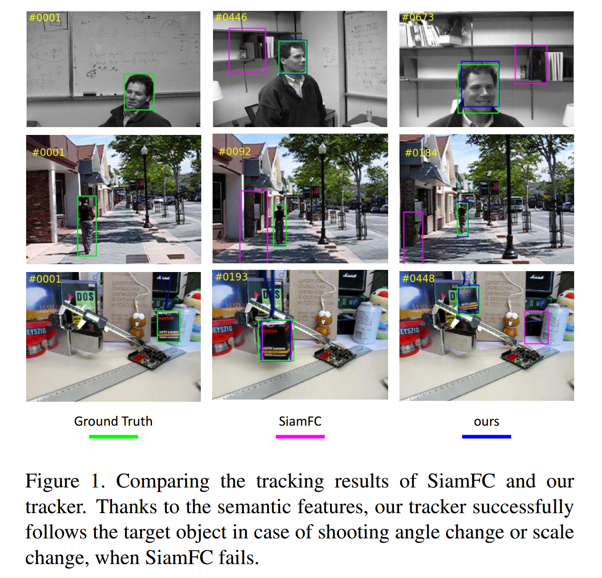
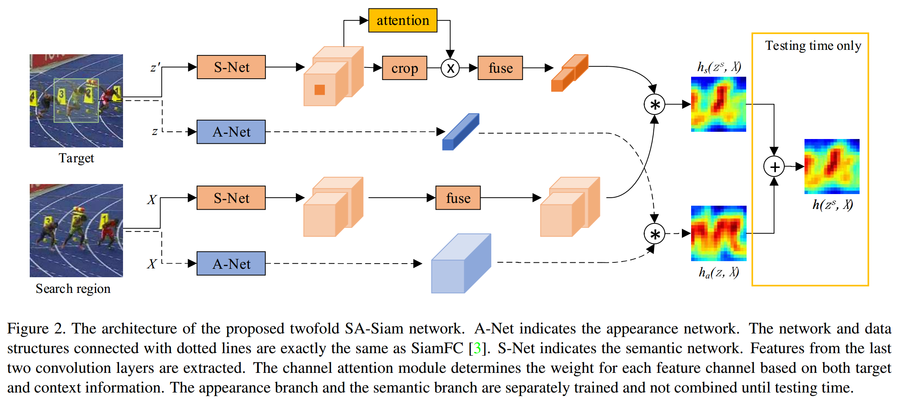
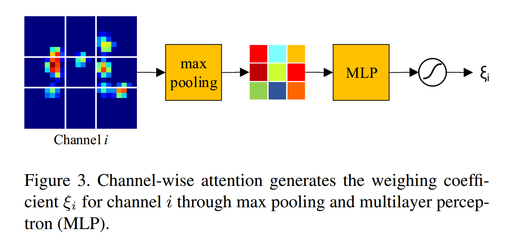
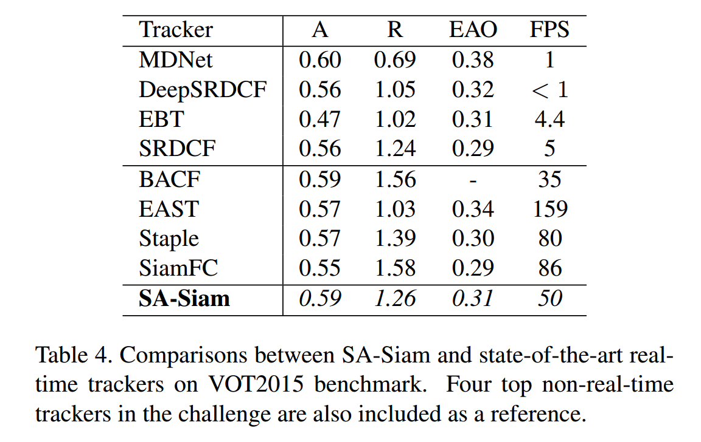
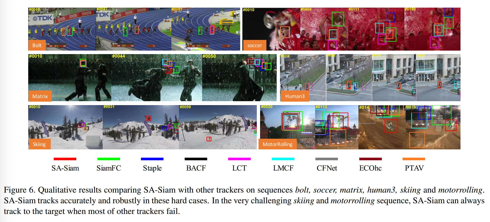

### A Twofold Siamese Network for Real-Time Object Tracking

#### Abstract

​		根据图像分类任务学习到的语义（Semantic）特征和相似性匹配任务学习到的外观（Appearance）是相互补充的，我们构建了一个twofold（双重） Siamese网络（即SA-Siam）进行实时对象跟踪。SA-Siam包含语义分支和外观分支。每个分支是一个学习相似性的Siamese网络。SA-Siam中的重要设计选项是单独地训练这两个分支保持两类特征的异构。此外，我们为语义分支提出通道注意力机制。根据目标位置周围的通道激活计算逐通道权重。虽然继承至SiamFC[3]的架构允许我们的跟踪器以实时的速度运行，但是双重设计和注意力机制显著提高了跟踪性能。所提出的SA-Siam大幅领先OTB-2013/50/100基准测试上的所有其他实时跟踪器。

#### 1. Introduction

​		视觉目标跟踪是计算机视觉中最基础和最具挑战的任务。给定第一帧中未知目标的边界框，其目的是定位视频序列中所有后续帧中的目标。虽然视觉对象跟踪在监控、自动化系统和增强现实中有丰富的应用，但是它仍是一个非常具有挑战性的任务。一个原因，在第一帧中仅具有边界框时，当目标自身由于各种原因而移动、变形或外观改变时，很难将未知目标与混乱的背景区分开。另一理由，大多数应用需要实时跟踪。设计实时高性能跟踪器甚至更加困难。

​		设计高性能跟踪器的关键是找出 _辨别性和泛化（discriminative and generalized）_ 的表达特征和相应的分类器。辨别性允许跟踪器将真实目标与混乱甚至欺骗性的背景区分开。泛化表示跟踪器能容忍跟踪的对象的外观变化，即使对象不是先验，也是如此。通常，辨别性能力和泛化能力都需要通过在线训练过程增强，这一过程收集目标信息同时跟踪目标。但是，在线更新非常耗时，尤其是在涉及大量参数时。因此，平衡跟踪性能和运行速度非常重要。

​		最近几年，深度卷积神经网络（CNN）在各种视觉任务中展示了其卓越的能力。他们还大大提高了对象跟踪的最新水平。一些跟踪器[7、26、30、9、6]将深度特征集成到一般跟踪方法中，并受益于CNN特征的表达能力。一些其他跟踪器[29、28、12、33]直接使用CNN作为分类器，并充分利用端到端训练。大多数这些方法采用在线训练来提升跟踪性能。但是，由于大量的CNN容量和深度神经网络的复杂性，执行在线训练的计算量很大。因此，大多数基于CNN在线的跟踪器运行速度远低于实时。

​		与此同时，出现了两个基于CNN的实时跟踪器[13，3]，它们通过完全避免在线训练来实现较高的跟踪速度。虽然GOTURN [13]将对象跟踪视为边界框回归问题，但SiamFC [3]将其视为相似性学习问题。看来SiamFC的性能要比GOTURN好得多。这归功于全卷积网络架构，这允许SiamFC充分利用离线训练数据，并使其本身高度可辨别。但是，如图1所示，当目标具有明显的外观变化时，泛化能力仍然很差，并且会遇到困难。结果，SiamFC与最佳的在线跟踪器仍然存在性能差距。

​		本文中，我们旨在提高提高SiamFC的泛化能力。广泛理解的是，在图像分类任务的深度CNN训练中，深度层的特征包含更强的语义信息，并且对于外观变化更具不变性。这些语义特征是对在相似性学习问题中训练的外观特征的理想补充。受这一观察的启发，我们设计了SA-Siam，其为包含语义分支和外观分支的双重Siamese网络。每个分支是一个计算目标图像和搜索图像之间相似性得分的Siamese网络。为了维持两个分支的异构，分别训练两个分支，并且在每个分支获得相似性得分之前，不结合它们。

​		对于语义分支，我们进一步提出了一种通道注意机制，以实现最小程度的目标自适应。**其动机是不同的对象激活不同的特征通道集。**我们将对在跟踪特定目标中起更重要作用的通道给予更高的权重。这是通过基于目标对象和周围上下文中的通道响应来计算通道权重来实现的。目标自适应的最简单形式提高了跟踪器的辨别能力。评估显示，在OTB-2013 / 50/100基准测试中，我们的跟踪器大大优于所有其他实时跟踪器，并在VOT基准测试中达到了最先进的性能。

#### 2. Related Work

##### 2.1. Siamese Network Based Trackers

​		视觉对象跟踪可以建模为相似性学习问题。通过将目标图像补丁和搜索区域中候选补丁的比较，我们可以将对象跟踪到获得最高相似度得分的位置。这种方法值得注意的优势是，它不需要或者需要少量的在线训练。因此，可以轻松获得实时跟踪。

​		利用深度CNN进行相似性学习通常使用Siamese架构[23]。这类对象跟踪的先驱工作是全卷积的Siamese网络（SiamFC）。全卷积网络的优势是可以为网络提供远远大于搜索图像的输入，而不是与目标补丁相同大小的候选补丁，并且在单次评估中，它在密集网格上的所有平移子窗口上计算相似性[3]。这种优势还体现在训练时，其中每个子窗口有效地代表了有用的样本，而几乎没有额外的成本。

​		有SiamFC的大量后续工作[39、38、15、32、11]。如果低级特征足以跟踪目标，则EAST [15]尝试通过尽早停止特征提取器来加快跟踪器的速度。CFNet[38]为低级CNN特征引入相关滤波来加速跟踪，而没有准确率损失。SINT[32]涉及光流信息，并获得更好的性能。然而，由于光流计算上相当昂贵，SINT仅以4帧每秒的速度(fps)运行。DSiam[11]尝试在线更新跟踪目标的嵌入，DSiam明显获得更好的性能，而没有太多的速度丢失。

​		SA-Siam继承自SiamFC的网络架构。我们打算通过一种创新的方式来改进SiamFC，以利用异构功能。

##### 2.2. Ensemble Trackers

​		我们所提出SA-Siam包含关注不同类型CNN特征两个独立训练的分支。它与集成跟踪器共享一些见解和设计原则。

​		HDT[30]是一个典型的集成跟踪器。它使用具有来自每一层的CNN特征的相关滤波器（CF）构造跟踪器，然后使用自适应Hedge方法对冲（hedge）这些CNN跟踪器。TCNN[28]在树结构中维持多个CNN来学习集成模型，并估计目标状态。STCT [33]是CNN的顺序训练方法，可以有效地将预先训练的深度特征转移到在线应用程序中。BranchOut[12]为目标表示采用CNN，其有一个常用的卷积层，但是有多个全连接层的分支。它允许每个分支具有不同数量的层，以便维持目标外观的可变抽象级别。PTAV[10]保留两个分类器，一个用作跟踪器，另一个为验证器。高效的跟踪器（可用于连续帧）和功能强大的验证器（仅在必要时运行）的结合在速度和准确性之间取得了良好的平衡。

​		这些集成跟踪器的普遍见解是，可以通过利用CNN特征的不同层来制作强大的跟踪器。此外，各模型之间的相关性应较弱。在SA-Siam的设计中，外观分支和语义分支使用不同抽象层次的特征。此外，它们不联合训练，以避免变得同构。

##### 2.3. Adaptive Feature Selection

​		不同特征在不同的跟踪目标上具有不同的影响。使用单对象跟踪的所有可用特征是不高效的。在SCT [4]和ACFN [5]中，作者建立了一个注意力网络，以便在多个特征提取器中为跟踪目标选择最佳模块。HART[18]和RATM[16]使用具有注意力模型的RNN来分离在哪里和用什么处理途径来主动抑制不相关的视觉特征。最近，SENet[14]论证了图像识别任务中逐通道注意力的有效性。

​		在我们的SA-Siam网络中，我们执行基于通道激活执行逐通道注意力。它可以视为一种类型的目标自适应，其有可能改进跟踪性能。

#### 3. Our Approach

​		我们提出twofold全卷积Siamese网络进行实时对象跟踪。这种设计背后的基本思想是，相似性学习问题中训练的外观特征，以及在图像分类问题中的语义特征相互补充，因此联合考虑以进行鲁棒性视觉跟踪。

##### 3.1. SA-Siam Network Architecture

​		所提出的SA-Siam网络的架构在图2中描述。网络的输入为从视频序列的第一（目标）帧和当前帧上裁剪的一对图像补丁进行跟踪。我们使用符号 $z$、$z^s$ 和 $X$ 来分别表示目标、背景周围的目标和搜索区域中的目标。$z^s$ 和 $X$ 的大小都为 $W_s \times H_s \times 3$ 。精确的目标 $z$ 的大小为 $W_t \times H_t \times 3$ （$W_t < W_s$ 和 $H_t < H_s$），其位于 $z^s$ 的中心。$X$ 可以看作搜索区域中候选补丁 $x$ 的集合，候选补丁 $x$ 与 $z$ 有相同的维度。

​		SA-Siam由外观分支（图中蓝色框指示）和语义分支（橙色框指示）组成。每个分支的输出是指明目标 $z$ 和搜索区域 $X$ 中候选补丁 $x$ 之间的相似性。**两个分支单独训练，并其在测试之前不会组合。**

​		**The appearance branch：**外观分支以 $(z, X)$ 作为输入。它复制SiamFC网络[3]。这个卷积网络用于提取外观特征，称为 A-Net，并且提取的特征表示为 $f_a(\cdot)$ 。来自外观分支的响应图可以写为：

$$h_a(z, X) = coor(f_a(z), f_z(X)), \tag{1}$$

其中 $corr(\cdot)$ 是相关操作。A-Net中的所有参数在相似性学习问题中从头训练。特别地，利用来自训练视频中丰富补丁对 $(z_i, X_i)$ 和搜索区域中相应的ground-truth响应图 $Y_i$ ，通过最小logistic损失函数 $L(\cdot)$ 来优化A-Net，如下：

$$\arg \min_{\theta_a}\frac{1}{N}\sum_{i=1}^{N}\{L(h_a(z_i, X_i;\theta_a),Y_i)\}, \tag{2}$$

其中 $\theta_a$ 表示A-Net中参数，$N$ 为训练样本的数量。

​		**The semantic branch：**语义分支以 $(z^s, X)$ 作为输入。**我们直接使用图像分类任务上预训练的CNN作为S-Net，并在训练和测试期间固定其所有参数。**我们令S-Net输出最后两个卷积层（我们的实现中为_conv4_ 和 _conv5_）的特征，因为它们提供了不同的抽象级别。不会提取低级特征。

​		不同卷积层的特征有不同的空间分辨率。为了使符号简单，我们将串联的多级特征表示为 $f_s(\cdot)$。为了使语义特征适合相关操作，我们在特征提取之后插入融合模块（其通过 $1 \times 1$ 卷积实现）。在相同层的特征中执行融合。融合后的搜索区域 $X$ 的特征向量可以写为 $g(f_s(X))$ 。

​		目标处理（target processing）略微不同。S-Net以 $z^s$ 为目标输入。在 $z^s$ 的中心有 $z$ ，并且包含目标的上下文信息。由于S-Net使全卷积的，我们可以通过简单的裁剪操作从 $f_s(z^s)$ 上获得 $f_s(z)$ 。注意力模块以 $f_s(z^s)$ 为输入，并输出通道权重 $\xi$ 。注意力模块在下一节描述。在 $1 \times 1$ 卷积融合之前，将特征乘以通道权重。因此，语义分支的响应图可以写为：

$$h_s(z^s, X) = corr(g(\xi \cdot f_s(z)), g(f_s(X))), \tag{3}$$

其中 $\xi$ 的维度与$f_s(z)$ 中的通道数相同，$\cdot$ 为逐元素乘法。

​		在语义分支中，我们仅训练融合模块和通道注意力模块。利用训练对 $(z_i^s, X_i)$ 和ground-truth响应图 $Y_i$ ，语义分支通过最小化如下的logistic损失函数 $L(\cdot)$ 来优化：

$$\arg \min_{\theta_s} \frac{1}{N} \sum_{i=1}^N \{L(h_s(z_i^s, X_i; \theta_s), Y_i)\}, \tag{4}$$

其中 $\theta_s$ 表示可训练参数，$N$ 为训练样本的数量。

​		测试期间，综合热图计算为两个分支热图的加权平均：

$$h(z^s, X) = \lambda h_a(z, X) + (1 - \lambda) h_s(z^s, X), \tag{5}$$

其中 $\lambda$ 为平衡两个分支重要性的加权参数。实际上，$\lambda$ 可以从验证集上估计。$h(z^s, X)$ 中的最大值的位置给出了跟踪目标的中心位置。与SiamFC[3]相似，我们使用多尺度输入来处理尺度变化。我们发现使用三个尺度在性能和速度之间取得了很好的平衡。

##### 3.2. Channel Attention in Semantic Branch

​		高级语义特征对于对象的外观变化是鲁棒的，因此使得跟踪器更加泛化，但是缺少辨别性。为了加强语义分支的辨别能力，我们设计了一个通达注意力模块。

​		直觉上，不同的通道在跟踪不同的目标时，扮演着不同的角色。一些通道在某个目标的跟踪极其重要，而在跟踪其他目标时则是可有可无的。如果我们能够采用通达重要性来跟踪目标，那么我们就能实现目标自适应的最小功能。为了做到这一点，不仅目标是相关的，目标周围的上下文也很重要。因此，在我们所提出的注意力模块中，输入是 $z^s$ 的特征图，而不是 $z$ 的特征图。

​		注意力模块通过逐通道操作实现。图3为第 $i$ 个通道的注意力过程。以 $conv5$ 的特征图为例，我们的实现中，空间维度为 $22 \times 22$ 。我们将特征图划分为 $3 \times 3$ 的网格，并且大小为 $6\times6$ 的中心网格对应于跟踪目标 $z$ 。在每个网格中执行最大池化，然后使用两层MLP来产生这个通道的系数。最后，使用具有偏置的Sigmoid函数生成最终的输出权重 $\xi_i$ 。**MLP模块在从相同的卷积层提取的通道之间共享权重。**

​		注意，注意力添加到目标处理中。目标补丁的通道 $i$ 中的所有激活乘以 $\xi_i$ 。因此，这一模块仅为跟踪序列的第一帧传播一次。计算成本可以忽略。

##### 3.3. Discussions of Design Choices

​		**We separately train the two branches.**	我们基于如下结论作出这一选择。对于训练样本，具有语义线索的跟踪可能比具有外观线索的跟踪更容易，而对于一些其他的样本，可能仅仅相反。以前者为例，如果两个分支联合训练，那么当语义分支具有辨别性热图与外观分支有非信息热图时，总体损失可能很小。然后，这些训练样本并没有在优化外观分支中发挥作用。因此，两个分支联合训练比单独训练的力量要弱。

​		**We do not fine-tune S-Net.**	迁移学习的常用实践是在新问题中微调预训练的网络。我们选择不这样做，因为使用与我们训练A-Net一样的过程微调S-Net将是这两分支同构。尽管微调可以独立改善语义分支的性能，但是综合性能可能受到不利影响。我们进行了实验来验证这一设计选择，由于篇幅限制，我们没有将它们包含在本文中。

​		**We keep A-Net as it is in SiamFC.**	虽然使用多级特征以及添加通道注意力显著改善语义分支，但是我们不将它们用于外观分支。这是因为不同卷积层的外观特征在表现力上没有显著差异。我们不能将相同的注意力模块用于外观分支，因为高级语义分支非常稀疏，而外观特征非常密集。一个简单的最大池操作可以生成语义特征的描述性摘要，但不能生成外观特征的描述性摘要。因此，A-Net需要一个更加复杂的注意力模块，而其代价可能是得不偿失的。

#### 4. Experiments

##### 4.1. Implementation Details

​		**Network structure:**	A-Net和S-Net都使用如AlexNet[22]的网络作为基础网络。A-Net与SiamFC网络的结构完全相同。S-Net是从ImageNet[31]上预先训练的AlexNet加载的。修改步长是的S-Net的最后一层的输出与A-Net有相同的维度。

​		在注意模块中，每个通道的池化特征被堆叠成一个9维向量。接下来的MLP有1个隐藏层，包含9个神经元。隐藏层的非线性函数是ReLU。MLP后面是一个带偏置0.5的Sigmoid函数。这是为了确保没有通道将被抑制到零。

​		**Data Dimensions:**	在我们的实验中，目标图像补丁 $z$ 的维度为 $127 \times 127 \times 3$，$z^s$ 和 $X$ 的维度都为 $255 \times 255 \times 3$。$z$ 和 $X$ 在A-Net的输出特征粉笔是 $6 \times 6 \times 256$ 和 $22 \times 22 \times 256$ 。针对$z^s$ 和 $X$ ，来自 S-Net 的 $conv4$ 和 $conv5$ 的特征维度分别为 $24 \times 24 \times 384$ 和 $22 \times 22 \times 256$ 。这两组特征的 $1 \times 1$ 卷积网络各输出128个通道(共256个)，空间分辨率不变。响应图尺寸为 $17 \times 17$ 。

​		**Training:**	我们的方法在ILSVRC-2015[31]视频数据集上离线训练，并且我们仅使用彩色图像。在超过4000个序列中，有大约1.3M帧，以及大约2M具有ground-truth边界框的跟踪对象。对于每个tracklet，对于每个tracklet，我们随选择一对图像，并从中心为 $z$ 的图像中裁剪 $z^s$，从另一个中心为ground truth目标的图像中裁剪 $X$ 。两个分支都30个周期，其中前25个周期学习为0.01，后五个周期学习率为0.001。

​		我们使用TensorFlow实现模型。我们的实验在Xeon E5 2.4GHz 和 GeForce GTX Titan X GPU 的PC上执行。SA-Siam的平均测试速度为50 fps 。

​		**Hyperparameters:**	两个分支通过权重 $\lambda$ 组合。这个超参数是在一个小型验证集TC128[24]上估计的，该数据集不包括OTB基准测试中的序列。我们以步长为0.2执行从0.1到0.9的网格搜索。评估认为，当 $\lambda = 0.3$ 时，获得最佳性能。我们在所有测试序列上使用这个值。评估和测试期间，搜索三个尺度来处理尺度变化。

##### 4.2. Datasets and Evaluation Metrics

​		**OTB:**	目标跟踪基准（Object Tracking Benchmarks: OTB）[36、37包含三个数据集，即OTB-2013、OTB-50和OTB-100。它们分别有51、50和100个真实世界目标用于跟踪。所有的序列都有11个干扰属性。

​		OTB上的两个标准度量是成功率（success rate）和精确度（precision）。对于每一帧，我们计算跟踪到的边界框和ground-truth边界框之间的IoU，以及它们中心位置的距离。通过在不同IoU阈值下评估成功率获得成功曲线（success plot）。通常，报告成功曲线的AUC。精确率图可以以相似的方式获取，但是通过报告20个像素阈值下的代表性精确率。我们使用标准的OTB工具包来获得所有这些数值。

​		**VOT:**	视觉目标跟踪（Visual Object Tracking: VOT）基准测试有许多版本，我们始终最新的版本：VOT2015[19]、VOT2016[20] 和 VOT2017[21]。VOT2015和VOT2016有相同的序列，但是VOT2016中的ground-truth标签比VOT2015更加准确。在VOT2017中，将VOT2016上的十个序列替换为新的序列。

​		VOT基准测试通过应用基于重置的方法来评估跟踪器。无论何时跟踪估计的边界框与ground-truth没有重叠，跟踪器在五帧后重新初始化。VOT基准测试的主要评估准则是准确率（Accuracy：A）、鲁棒性（Robustness：R）和期望平均重叠（Expected Average Overlap：EAO）。良好的跟踪器有高 A和 EAO 得分，但是有较低的R得分。

##### 4.3. Ablation Analysis

​		我们使用实验来验证我们的主张，并证明我们在SA-Siam中的设计选择。我们使用OTB基准测试进行消融分析。

​		**语义分支和外观分支相互补充。**我们单独评估语义模型（$S_1$）和外观模型（$S_2$）的性能。$S_1$ 为近包含S-Net和融合模块的基本版本。$S_1$ 和 $A_1$ 都从随机初始化开始从头训练。在表1的前两行报告了结果。第三行表示包含 $S_1$ 和 $A_1$ 的SA-Siam模型的结果。这种改进是巨大的，组合模型即使没有多级语义特征或通道注意力，也能获得最佳性能。

​		为了证明我们的异构特征的优势，我们比较SA-Siam和两种简单集成模型。我们使用不同的初始化来训练另一个语义模型 $S_2$ ，并采用SiamFC作者发布的外观模型作为 $A_2$。然后，我们集成 $A_1A_2$ 和 $S_1S_2$。表2展示独立和集成模型的性能。显然，集成模型 $A_1A_2$ 和 $S_1S_2$ 的性能不如 SA-Siam 模型。这证实了互补特征在设计双重Siamese网络中的重要性。

​		**使用多级特征和通道注意力带来的增益。**表1的最后三行表明了每个组件是如何改进跟踪性能的。直接使用多级特征略微有帮助，但是缺乏一种平衡不同抽象层次的机制。我们发现注意力模块扮演了重要角色。有效地平衡了层内和层间通道的重要性，获得了显著的增益。

​		图4为视频序列 _david_ 和 _bolt_ 的卷积层的通道权重。我们使用具有偏置 0.5 的Sigmoid函数使得权重在 $[0.5, 1.5]$ 的范围之间。首先，我们观察到 $conv4$ 和 $conv5$ 权重分布完全不同。这就提示了为什么注意力模块对使用多级特征的模型有更大的影响。其次，两个视频上的 $conv4$ 的权重分布完全不同。对于视频 _bolt_，注意力模块倾向于抑制更多通道。

​		**Separate vs. joint training.**  我们已经声明SA-Siam的两个分支应当单独训练。为了支持这一说法，我们尝试联合训练这两个分支(没有多级特征或注意力)。正如我们所料，性能不如单独训练的模型好。在OTB-2013/50/100基准测试上，联合训练模型的AUC和精确率分别为 $(0,630, 0.831)$、$(0.546, 0.739)$ 和 $(0.620, 0.819)$。

##### 4.4. Comparison with State-of-the-Arts

​		我们比较SA-Siam和OTB与VOT基准测试上的最佳实时跟踪器。通常，跟踪速度超过25 fps时，可视为实时。我们的跟踪器以50fps运行。

​		**OTB benchmarks：**

​		**VOT2015 benchmark:**

​		**VOT2016 benchmark:**

​		**VOT2017 benchmark:**

