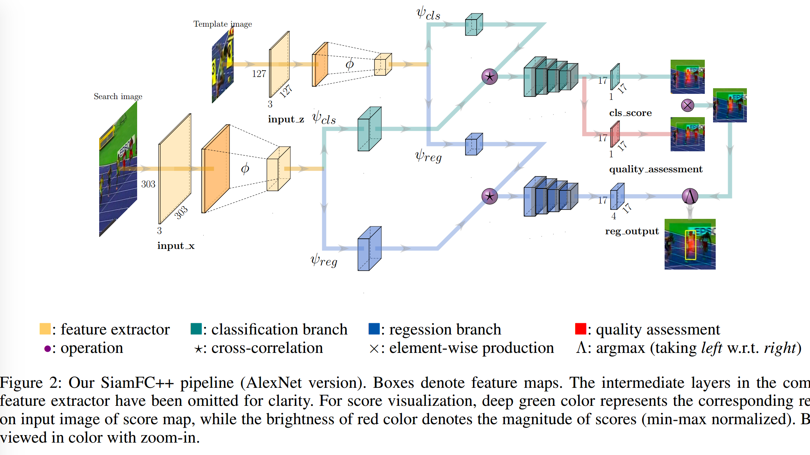
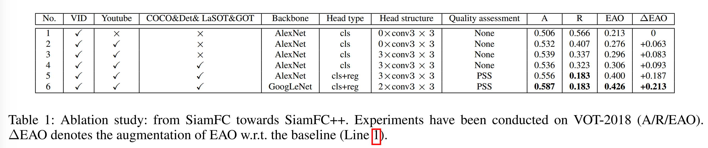
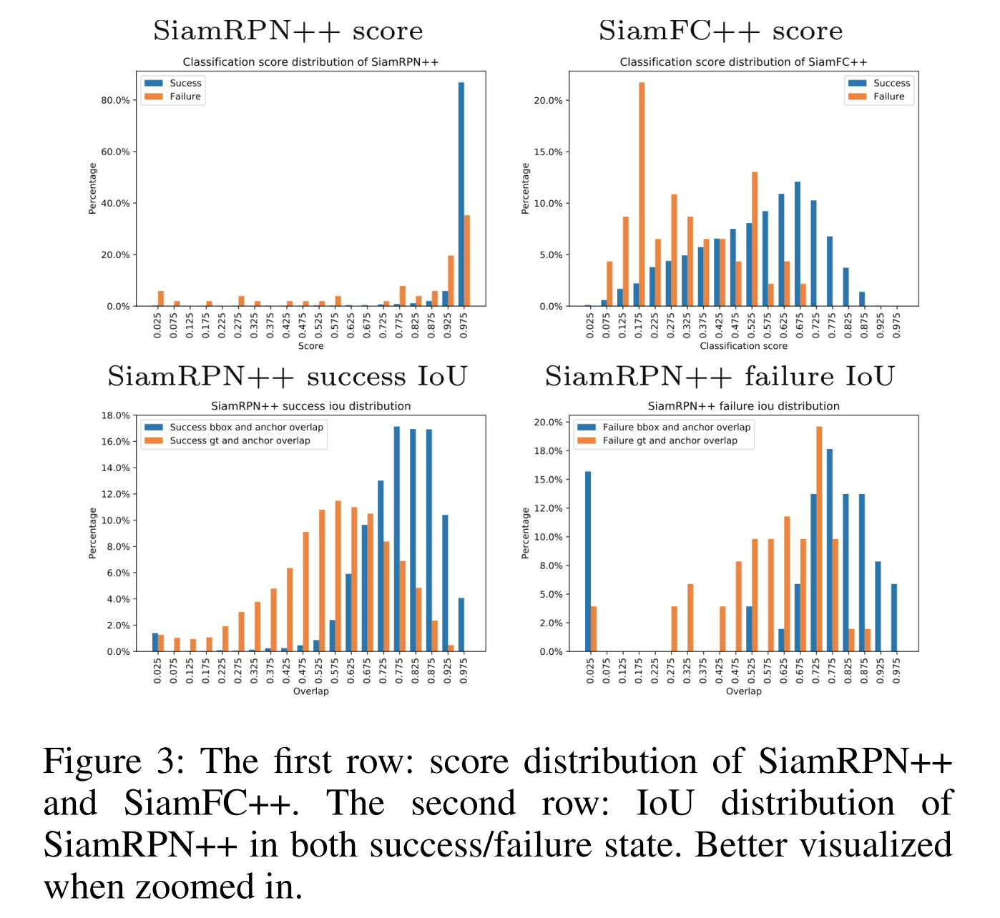

### SiamFC++: Towards Robust and Accurate Visual Tracking with Target Estimation Guidelines
#### Abstract

​		视觉跟踪问题要求同时对给定的目标有效地进行鲁棒分类和精确的目标状态估计。以往的方法提出了多种目标状态估计方式，但很少考虑到视觉跟踪问题本身的特殊性。基于仔细分析，我们提出一系列目标状态估计的实践指南进行高性能通用目标跟踪器的设计。遵循这些指南，我们设计了我们的Fully Convolutional Siamese tracker++（SiamFC++），该算法通过引入 _classification and target state estimation branch (**G1**), classification score without ambiguity (**G2**), tracking without prior knowledge (**G3**), and estimation quality score (**G4**)_ 来实现。广泛的实验和消融研究证明了我们所提出指南的有效性。没有花里胡哨的操作，我们的SiamFC++跟踪器在五个基准测试（OTB2015、VOT2018、LA-SOT、GOT-10K、TrackingNet）上获得最佳性能，这证明了这个跟踪器的跟踪和泛化能力。特别地，在大尺度TrackingNet数据集上，SiamFC++获得了之前从未有过的75.4的AUC得分，同时以90 FPS的速度运行，这远远超过了实时需要。代码和模型可以下网站获得： https://github.com/MegviiDetection/video_analyst 。

#### 1	Introduction

​		通用视觉跟踪旨在，在给定非常有限的信息的情况下，定位通常仅在第一帧中有标注的视频中运动的目标。作为计算机视觉多个领域中的基础构建单元，这项任务带来大量应用，包括基于UAV的监视和监控系统。通用对象跟踪的一个独特特性是不允许关于目标及其周围环境有任何先验知识(Huang, Zhao, and Huang 2018)。

​		跟踪问题可以视为 _分类_ 任务和 _估计_ 任务的结合。第一个任务旨在通过分类提供目标的稳健的大致位置。第二个任务是估计准确的目标状态，通常用边界框表示。虽然现代跟踪器已获得显著进步，但是令人吃惊的是，在第二个任务（即目标状态估计）上有较大的差异。基于这一方面，之前的方法可以大致分为三类。第一类（包含Discriminative Correlation Filter（DCF）和 SiamFC ）采用暴力多尺度测试，这是不准确和不高效的。同时，目标尺度/纵横比在相邻帧中以固定比例变化的先验假设通常在现实中是不成立的。对于第二个类，ATOM 通过梯度下降迭代地精炼多个初始边界框来估计目标边界框，其在准确率上产生显著的改进。然而，这种目标估计方法带来的不仅有严重的计算负担，还有许多需要仔细调整的额外超参数（例如初始边界框的数量、初始边界框的分布）。第三类是SiamRPN跟踪器家族，其通过引入 Region Proposal Network（RPN）来执行准确而高效的目标状态估计。然而，预定义的锚点设置不仅引入了模糊的相似度评分，严重妨碍了鲁棒性(参见第4节)，而且还需要访问数据分布的先验信息，这显然违背了一般对象跟踪的精神(Huang, Zhao, and Huang 2018)。

​		受前面分析的启发，我们提出一系列用于高性能通用目标跟踪器设计指南：

- **G1:  decomposition of classification and state estimation**	跟踪器应当执行两个子任务：分类和状态估计。没有强力的分类器，跟踪器不能从背景或干扰物中辨别目标，这严重妨碍跟踪的鲁棒性（Zhu等 2018）。没有准确的估计结果，跟踪器的准确率从根本上受到限制(Danelljan 等 2019)。这些暴力的多尺度测试方法很大程度上忽略了后一项任务，存在效率低和准确性低的问题。
- **G2:  non-ambiguous scoring**   分类得分应当直接表示“视场”（即对应像素的子窗口）中目标存在性得分，而不是如锚框的预定义设置。作为一个反面例子，对象和锚点之间的匹配(例如，基于锚点的RPN分支)很容易产生假阳性结果，导致跟踪失败(更多细节参见第4节)。
- **G3:  prior knowledge-free**  跟踪方法应当是无需如尺度/纵横比分布的先验知识，这是通用目标跟踪的精神(Huang, Zhao, and Huang 2018)提出的。现有的方法普遍存在对数据分布先验知识的依赖，阻碍了其泛化能力。
- **G4:  estimation quality assessment**  正如先前的研究（Jiang等 2018；Tian 等 2019），直接使用分类置信度进行边界框选择会导致性能退化。应该使用独立于分类的估计质量分数，就像之前许多关于目标检测和跟踪的研究一样（Jiang 等 2018；田等人2019年；Danelljan等人2019年）。第二个分支(例如ATOM和DiMP)的惊人准确性主要来自于此准则。而其他人仍然忽略了它，为进一步提高估计精度留下了空间。

​       遵循上述指南，我们基于全卷积的Siamese跟踪器（Bertinetto等2016年）设计了我们的 SiamFC++ ，其中，由于全卷积的本质，特征图中的每个像素对应搜索图像中的每个平移（translate的）子窗口。我们为准确的目标估计添加了回归头部，其与分类头部并行（**G1**）。由于删除了预定义的锚点设置，因此也删除了关于目标尺度/纵横比分布的匹配模糊度(G2)和先验知识(G3)。最后，遵循 **G4** ，添加一个估计质量评估分支来得到高质量的边界框。

​	我们的贡献可以总结为如下三个方面：

1. 通过识别跟踪的独特特性，设计了一套实用的目标状态估计指南，用于现代跟踪器的设计。
2. 我们利用我们所提出的指南的应用设计设计了一个简单而强力的 SiamFC++ 跟踪器。大量的实验和全面的分析证明了我们提出的指导方针的有效性。
3. 我们的方法在五个挑战性基准测试上获得最佳的结果。据我们所知，我们的SiamFC++ 是第一个在大尺度 TrackingNet 数据集（Muller等 2018 年）上获得 75.4 的 AUC 得分，同时以 90 FPS 的速度运行。

#### 2    Related Works

​		**Tracking Framework**

​		现代跟踪器跟进他们目标状态的估计大致可以分为三个分支。

​		它们中的一些（包括DCF和SiamFC）使用多尺度测试来估计目标的尺度。具体而言，将搜索补丁缩放到多个尺度并集成为缩放尺度的mini-batch，算法选择与最高分类得分对应的尺度作为当前帧中的预测尺度。这种策略从根本上是有限的，因为边界框估计本身就是一个具有挑战性的任务，需要对对象的姿态有一个高层次的理解(Danelljan等人 2019年)。

​		受 DCF 和 IoU-Net（Jiang等2018）的启发，ATOM 通过序列分类和估计来跟踪目标。对分类得到的目标粗糙初始位置进行迭代精炼，实现精确的边界框估计。每帧中的边界框的多个随机初始化位置和每次迭代精炼中的多次反向传播极大减缓了ATOM的速度。这种方法在准确率上产生明显的改进，但是带来严重的计算负担。此外，ATOM 还引入了许多需要仔细调整的额外超参数。

​		在另一个分支中，即SiamRPN及其后继工作在Siamese网络之后附加一个区域提议网络，获得了之前未有的准确率（RPN）。RPN 回归预定义锚和目标位置之间的偏移和大小差距。然而，RPN结构更适合目标检测，目标检测中需要高召回率，而在视觉跟踪中，仅仅应当跟踪一个目标。同时，锚框和目标之间的模糊匹配严重妨碍了跟踪器的鲁棒性（见第4节）。最后，锚点设置不符合通用对象跟踪的精神，需要预定义的超参数来描述其形状。

​		**Detection Framework**

​		视觉跟踪任务具有许多独特的特征，与目标检测有许多共同之处，使得每一个任务都能相互受益。例如，RPN结构首先在Faster-RCNN中使用，其获得在SiamRPN 中获得令人吃惊的性能。从Faster-RCNN (Ren et al. 2015)继承而来的最先进的现代探测器，称为锚基探测器，采用了RPN结构和锚框设置。基于锚的检测器将预定义提议（称为锚）分类为正类或负类补丁。然而，由锚框引入的超参数（例如锚框的尺度/纵横比）已被证明极大地影响最终的准确率，并且需要启发式调整。研究人员尝试使用多种方式来设计无锚检测器，例如在目标中心附近的像素点上预测边界框，或者检测和分组边界框的一对角点。在本文中，我们展示了一个基于精心设计的目标状态估计准则的简单管道，其灵感来自(Huang 等 2015；Yu 等 2016；Tian等 2019)可以实现最先进的跟踪性能。

#### 3	SiamFC++: Fully Convolutional Siamese Tracker for Object Tracking

​		本节中，我们详细描述 Fully Convolutional Siamese Tracker++ 框架。我们的 SiamFC++ 基于 SiamFC，并且根据所提出的准则渐进式地精炼。如图2所示，SiamFC++框架包含用于特征提取的Siamese子网络和用于分类和回归的区域提议子网络。

​		**Siamese-based Feature Extraction and Matching**

​		目标跟踪任务可以视为_相似性学习_问题（Li 等 2018a）。具体来说，离线训练Siamese网络，并在线评估以在更大的 _搜索_ 图像中定位 _模板_ 图像。Siamese 网络包含两个分支。_模板_ 分支采用第一帧中的目标补丁作为输入（表示为 $z$），而 _搜索_ 分支以当前帧作为输入（表示为 $x$）。Siamese主干在两个分支之间共享参数，它对输入 $z$ 和 $x$ 执行相同的变换，将它们嵌入到一个公共特征空间中，用于后续任务。在嵌入空间 $\phi$ 上执行模板补丁和搜索补丁之间的互相关：

$$f_i(z,x) = \psi_i(\phi(z)) \star \psi_i(\phi(x)), i\in\{\mbox{cls, reg}\} \tag{1}$$

其中 $\star$ 表示互相关操作，$\phi(\cdot)$ 表示进行特征提取常用的 Siamese 骨干，$\psi_i(\cdot)$ 表示任务特定的层，而 $i$ 表示子任务类型（“cls” 为分类，“reg” 为回归）。在我们的实现中， 在常用的特征提取之后，我们为 $\psi_{\mbox{cls}}$ 和 $\psi_{\mbox{reg}}$ 使用两个卷积层将公共特征调整到任务特定的特征空间。注意， $\psi_{\mbox{cls}}$ 和 $\psi_{\mbox{reg}}$ 提取的特征有相同的大小。

​		**Application of Design Guidelines in Head Network**

​		基于SiamFC，我们尊序如下的指南来渐进式地精炼我们跟踪器的每一个部分。

​		遵循 **G1** ，我们在嵌入空间内进行互相关后设计分类头部和回归头部。对于特征图中的每个像素，分类头部以 $\psi_{\mbox{cls}}$ 作为输入，并且相应的图像补丁分类为正类或负类补丁，而回归头部以 $\psi_{\mbox{reg}}$ 作为输入，并且输出额外的偏移来精炼边界框位置的预测。经过图2的互相关运算，给出了头部的结构。

​		具体而言，对于分类，如果特征图 $\psi_{\mbox{cls}}$ 上的位置 $(x, y)$ 对应的输入图像的位置 $(\lfloor \frac{s}{2}\rfloor + xs, \lfloor \frac{s}{2} \rfloor + ys)$ 位于ground-truth 边界框中，那么将该位置视为正类样本。否则，该位置为负样本。这里，$s$ 为骨干的总步长（本文中 $s = 8$）。对于特征图 $\psi_{\mbox{reg}}$ 中的每个正类位置 $(x, y)$ ，最后预测对应位置 $(\lfloor \frac{s}{2}\rfloor + xs, \lfloor \frac{s}{2} \rfloor + ys)$ 到ground-truth边界框四条边的距离，将这个距离表示为 4D 向量 $t^\ast = (l ^\ast, t^\ast, t^\ast, b^\ast)$。因此，位置 $(x, y)$ 的回归模板可以公式化为：

$$\begin{align}l ^\ast &= (\lfloor\frac{s}{2}\rfloor + xs) - x_0, &t^\ast = (\lfloor\frac{s}{2}\rfloor + ys) - y_0 \\ r^\ast &= x_1 - (\lfloor\frac{s}{2}\rfloor + xs), &b^\ast = y_1 - (\lfloor\frac{s}{2}\rfloor + ys) \end{align} \tag{2}$$

其中 $(x_0, y_0)$ 和 $(x_1, y_1)$ 表示与点 $(x, y)$ 关联的 ground-truth 边界框 $B^\ast$ 的左上角和右下角。

​		分类和回归头部的特征图上的每个位置 $(x, y)$ 对应于以位置  $(\lfloor \frac{s}{2}\rfloor + xs, \lfloor \frac{s}{2} \rfloor + ys)$  为中心的输入图像上的一个图像补丁。遵循 **G2** ，我们直接分类对应的图像补丁，并回归每个位置处的目标边界框，如许多先前的跟踪器（Henriques等 2014；Bolme等 2010；Bertinetto等 2016）。换句话说，我们的SiamFC++ 直接将位置视为训练样本。而基于锚的方法（Li 等 2018a；Zhu 等 2018;Li等 2019）将输入图像上的位置作为多个锚框的中心，在同一位置输出多个分类分数，并回归与这些锚框对应的目标边界框，导致锚与目标的模糊匹配。尽管（Li 等 2018a；Zhu 等 2018；Li等 2019）在各种benmarks上的表现优于（Henriques 等，2014；Bolme 等 2010；Bertinetto 等 2016），我们的实证结果表明，模糊匹配会导致严重的问题（详见第4节）。在我们的每像素预测形式中，在最终特征图的每个像素位置仅作出一个预测。因此，很明显，每个分类分数直接给出了目标在对应像素子窗口的置信度，我们的设计在这个程度上是没有歧义的。

​		由于SiamFC++对位置进行了分类和回归，它没有预先定义的锚边界框，因此无需关于目标数据分布（例如尺度/纵横比）的先验知识，这符合 **G3** 。

​		在上述部分中，我们还没有考虑目标状态估计的质量，并且直接使用分类分数来选择最终的方框。这可能引起位置准确率的衰减，因为（Jiang 等 2018）证明分类置信度不与定位准确率关联。根据（Luo 等 2016）的分析，子窗口中心周围的输入像素在对应的输入特征像素上比其他像素更重要。因此，我们假设，目标中心周围的特征像素比其他像素有更好的估计质量。遵循 **G4** ，我们添加一个简单而高效的质量评估分支，其与（Tian 等 2019；Jiang 等 2018）相似，它附加一个与 $1 \times 1$ 卷积分类头部并行的 $1 \times 1$ 卷积层，如图2的有部分。输出用来估计先验空间分数（Prior Spatial Score：PSS），其定义如下：

$$\mbox{PPS}^\ast = \sqrt{\frac{\min(l^\ast, r^\ast)}{\max(l^\ast, r^\ast)} \times \frac{\min(t^\ast, b^\ast)}{\max(t^\ast, b^\ast)}} \tag{3}$$

注意，PPS 不是质量评估仅有的选择。作为一个变体，我们还可以预测预测边界框和 ground-truth 边界框之间的 IoU 得分（这与（Jiang 等 2018）相似）：

$$\mbox{IoU}^\ast = \frac{\mbox{Intersection}(B, B^\ast)}{\mbox{Uion}(B, B^\ast)} \tag{4}$$

其中 $B$ 为预定义的边界框，$B^\ast$ 为与其对应的 ground-truth 边界框。

​		推理期间，将 PSS 与相应的预测分类得分相乘作为最终的边界框选择的分数。在这种方式中，远离目标中心的那些边界框将会被严重地降低权重。从而提高了跟踪准确率。

​		**Training Objective**

​		我们优化如下的训练目标函数：

$$\begin{align}L(\{p_{x, y}\},q_{x, y}, \{t_{x,y}\}) &= \frac{1}{N_{\mbox{pos}}}\sum_{x,y} L_{\mbox{cls}}(p_{x,y}, c_{x,y}^\ast) \\ & + \frac{\lambda}{N_{\mbox{pos}}}\sum_{x,y} \mathbf{1}_{\{c_{x,y}^\ast > 0\}}L_{\mbox{quality}}(q_{x,y}, q_{x,y}^\ast) \\ &+ \frac{\lambda}{N_{\mbox{pos}}}\sum_{x,y}\mathbf{1}_{\{c_{x,y}^\ast > 0\}}L_{\mbox{reg}}(\mathbf{t}_{x,y}, \mathbf{t}_{x,y}^\ast) \end{align} \tag{5}$$

其中 $\mathbf{1}_{\{\cdot\}}$ 为指示器函数，如果下标中的条件成立，那么该函数为 1 ；如果不成立，则为 0 ，$L_{\mbox{cls}}$ 表示分类结果的 Focal Loss （Lin 等 2017），$L_{\mbox{quality}}$ 表示质量评估的二值交叉熵，$L_{\mbox{reg}}$ 表示边界框结果的 IoU 损失（Yu 等 2016）。如果 $(x, y)$ 为正样本，那么我们 $c_{x,y}^\ast$ 的值为 1 ；如果 $(x, y)$ 为负样本，那么 $c_{x,y}^\ast$ 的值为 0 。

#### 4	Experiments

​		**Implementation Details**

​		**Model settings**	在这项工作中，我们使用不同的骨干架构实现了两个版本的跟踪器：一个采用修改版本的 AlexNet，表示为 SiamFC++-AlexNet；另一个采用 GoogLeNet，表示为 SiamFC++-GoogLeNet。由于计算成本较低，后一种方法在跟踪基准上的性能与之前使用ResNet-50（He et al. 2016）的方法相同，甚至更好（参见第4节）。两个网络在 ImageNet 上预训练，这已证明在跟踪任务中的使用性。

​		**Training data**	我们采用 ILSVRC-VID/DET、COCO、Youtube-BB、LaSOT 和 GOT-10K 作为我们的基本训练集。对于视频数据集，我们从 VID、LaSOT 和 GOT-10K 上选择间隔小于 100 （Youtube-BB 为 5）的帧对来提取图像对。对于图像数据集（COCO/ImagenetDET），我们通过包含负样本对(Zhu et al. 2018)作为训练样本的一部分来生成训练样本，以增强区分模型干扰物的能力。

​		**Training phase**	对于 AlexNet 版，我们 **冻结 conv1 到 conv3 的参数，并微调 conv4 和 conv5 上的参数**。对于没有预训练的那些层，我们采用标准差为 0.01 的零中心高斯分布进行初始化。我们首先用 5 个热身周期训练我们的模型，学习速率从 $10^{−7}$ 线性增加到 $2 \times 10^{−3}$ ，然后对其余 45 个周期使用余弦退火学习速率计划，每个周期使用 600k 个图像对。我们选择动量为0.9的随机梯度下降法(SGD)作为优化器。

​		对于 GoogLeNet 实现的版本，我们冻结 stage1 和 stage2 、微调 stage3 和 stage4 、将基本学习率增强为 $2 \times 10^{-2}$ ，并且骨干的参数的学习率乘以 0.1 。我们还将每个 epoch 中的图像对减少到 300k ，将总训练周期减少到 20 （因此，5个周期用于 warm-up ，15 个周期用于训练），并且在第 10 个周期冻结骨干的参数以避免过拟合。对于 LaSOT 基准测试（协议 II）上的实验，我们冻结骨干中的参数，并进一步降每个周期中的图像对减少到 150k ，使得相对更少数量的训练数据的训练可以更稳定。

​		所提出的具有 AlexNet 骨干的跟踪器在 VOT2018 短期基准测试上以 160 FPS 的速度运行，而具有 GoogLeNet 骨干的跟踪器在 VOT2018 短期基准测试上以 90 FPS 的速度运行，两个跟踪器都在 NVIDIA RTX 2080Ti GPU 上测试。

​		**Test phase**	我们的模型的输出是边界框及其它们对应的置信度分数 $s$ 的集合。根据最后一帧中预测的对应边界框的尺度/纵横比变化和与目标位置的距离来惩罚得分。然后，选择具有最高惩罚得分的边界框，并用于更新目标状态。

​		**From SiamFC towards SiamFC++**

​		虽然都采用每个像素的预测形式，但是 SiamFC 和我们的 SiamFC++ 之间存在明显的性能差距。本小节中，我们在 VOT2018 数据集上执行消融研究，以 SiamFC 作为基线，消融研究旨在识别跟踪性能改进的关键组件，结果见表1。

​		**Results on Several Benchmarks**

​		**Comparison with Trackers that Do not Apply Our Guidelines**

​		这里以 SiamRPN++ 为例，尽管 SiamRPN 家族最近取得了成功，但我们发现 SiamRPN 跟踪器及其家族并没有完全遵循我们提出的指导方针。

- **（G2）**SiamRPN的分类得分表示锚和目标之间的相似度，而不是模板模板和搜索图像中的目标之间的相似性，这可能引起匹配不明确；
- **（G3）**预设锚框的设计需要模板大小和纵横比分布的先验知识；
- **（G4）**目标状态估计的选择没有考虑估计质量。

​        值得注意的是 SiamRPN 家族并没有采用多尺度检验，而是采用了回归分支的 proposal 细分，从而达到了惊人的跟踪精度，符合我们的准则 **G1** 。

​		由于违反指南G2，我们从经验上发现SiamRPN家族很容易产生假阳性结果。换句话说，当目标物体的外观变化较大时，SiamRPN 会对附近的目标或背景产生不合理的高分。如图1所示，我们可以看到，SiamRPN++ 在平面外旋转和变形等具有挑战性的情况下，无法对目标物体进行跟踪，因为它给附近的物体(例如岩石或人脸)打了很高的分数。我们假设 SiamRPN 匹配目标（object）和锚，而不是目标（object）自身，这可能会产生漂移，从而阻碍其健壮性。相反，我们所提出的 SiamFC++ 直接匹配模板目标和搜索图像中的目标，它给出准确的得分预测，并成功跟踪目标。

​		为了验证我们的假设，在VOT2018数据集上，我们记录 SiamRPN++ 和我们所提出的 SiamFC++ 产生的最大得分。然后，我们根据跟踪结果（例如成功或失败）划分它们。在 VOT2018 上，如果跟踪结果与ground-truth的重叠为 0 ，那么将这个结果称为失败。否则，它为称为成功。可视化结果见图3的第一行。对比SiamRPN++和SiamFC++的得分，我们可以看到，无论是否成功，SiamRPN++的大部分分类分数都遵循相似且高度重叠的分布，而我们失败状态的SiamFC++的分类分数与成功状态的分类分数呈现出非常不同的模式。

​		造成 SiamRPN++ 歧义的另一个原因是，特征匹配过程是使用固定长宽比的patch进行的(不同长宽比的多个patch会带来不可忽略的计算成本)，而匹配后的特征的每个像素都被分配了长宽比不同的锚点。在违反 **G3** 的情况下，SiamRPN 的性能随着锚的尺度和长宽比的变化而变化。

​		此外，图3的第二行绘制了输出边界框与 ground truth 之间的 SiamRPN++ 统计 IoU 的直方图与锚点与ground truth之间 IoU 统计量的直方图，两个直方图分别处于成功和失败状态。如 IoU 分布的所示，锚设置给出的先验知识（违背 **G3**）导致目标状态估计的偏差。具体而言，SiamRPN++ 的预测边界框与锚框的重叠程度大于与 ground-truth 框的重叠程度，从而导致性能下降。

​		关于 **G4** 的违规，我们可以看到 GOT-10k 基准上 SiamRPN++ 的 $SR_{.5}$ 和 $SR_{.75}$ 分别比 SiamFC++ 低 7.7 和 15.4 个百分点。在 GOT-10k 中，Sucess Rate（SR）衡量重叠超过预定义阈值（即 0.5 和 0.75）的成功跟踪的帧的百分比。阈值越高，跟踪结果更准确。因此，SR是评估质量的可靠指标。SiamRPN++ 的 $SR_{.75}$ 远低于 SiamFC++ 的 $SR_{.75}$ ，这表明 SiamRPN++ 的更低估计质量是因违背指南 **G4** 引起的。