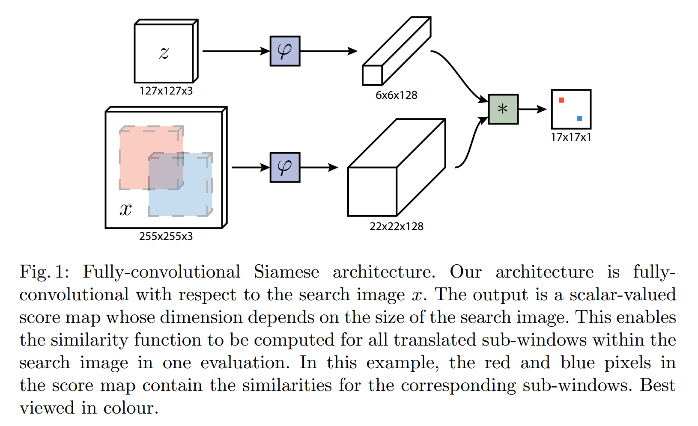
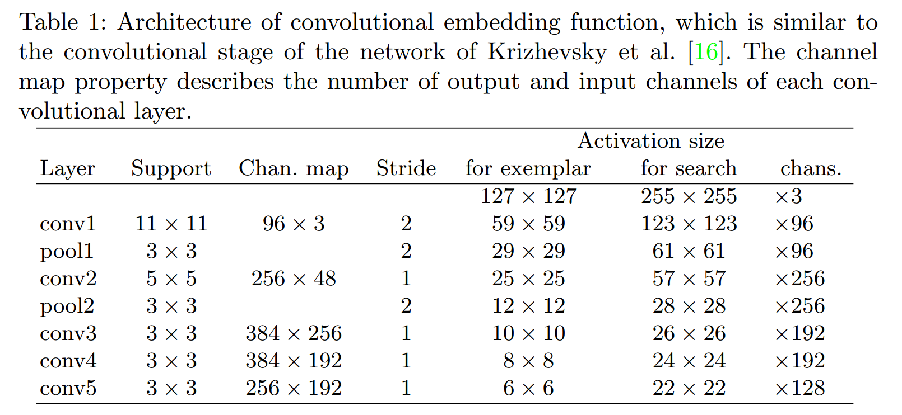
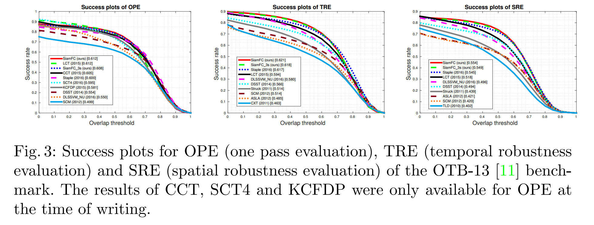
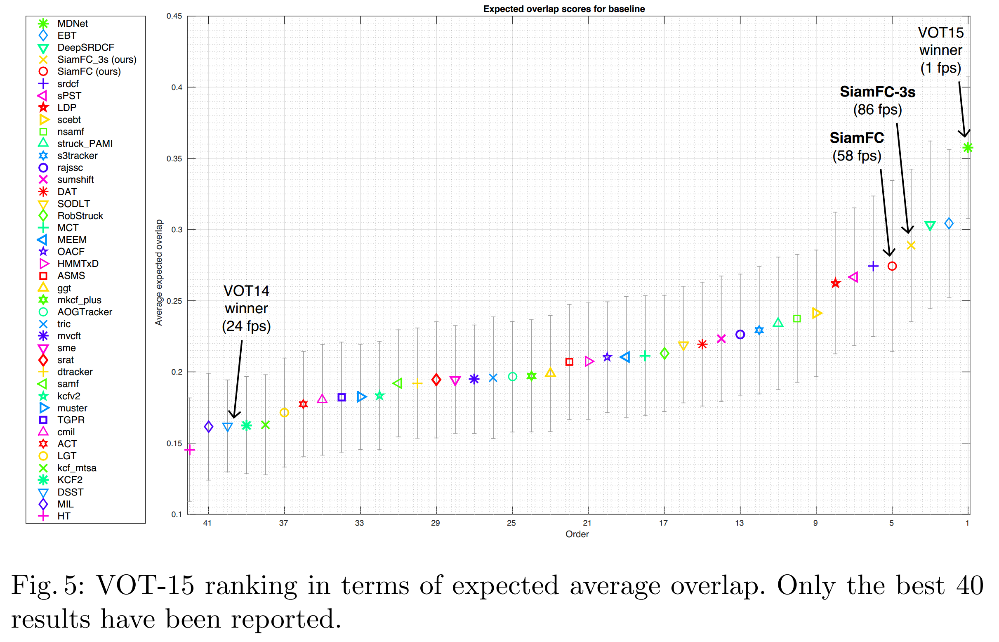
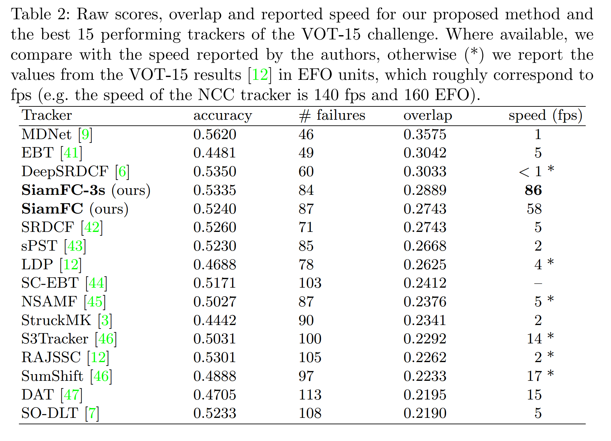
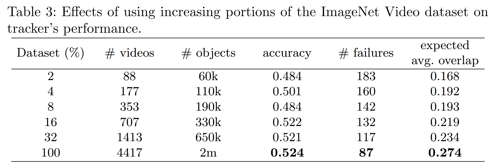

### Fully-Convolutional Siamese Networks for Object Tracking

#### Abstract

​		传统上，通过使用视频本身作为唯一的训练数据，仅仅在线学习对象外观模型来解决任意对象跟踪问题。尽管这些方法取得成功，但仅在线学习的方法从根本上限制了他们可以学习的模型的丰富性。近来，已经进行了一些尝试来利用深度卷积网络的表达能力。但是，如果事先不知道要跟踪的对象，则必须在线执行随机梯度下降以适应网络的权重，从而严重损害系统的速度。在本文中，我们为基本的跟踪算法配备了在ILSVRC15数据集上经过端到端训练的新型全卷积Siamese网络，用于视频中的目标检测。尽管我们的跟踪器极其简单，但是仍能以超越实时的速度执行，并在多个基准测试上获得最佳性能。

#### 1 Introduction

​		我们考虑跟踪视频中任意对象的问题，其中对象通过第一帧中的矩形单独确定。因为算法可能需要跟踪任意对象，所以不可能收集数据并训练特定的检测器。

​		多年来，这种情况下最成功的范例是使用从视频本身中提取的示例以在线方式学习对象外观的模型[1]。这在很大程度上归功于TLD [2]，Struck [3]和KCF [4]等方法的证明能力。然而，使用仅来自当前视频的数据的明显缺陷是只能学习相对简单的模型。虽然计算机视觉中的其他问题已经越来越广泛地采用从大型监督数据集训练而来的深度卷积网络（conv-net），但监督数据的稀缺性和实时操作的局限性阻止了在每个视频学习检测器的范式中朴素的应用深度学习。

​		几种最近的工作旨在克服使用不同但关联任务上学习的预训练ConvNets的局限。这些方法要么是使用网络内部表示作为特征的“浅层”妨[5、6]，要么是执行SGD来微调网络的几个卷积层[7、8、9]。虽然浅层方法的使用不能完全利用端到端学习的好处，但是跟踪期间应用SGD来获得最佳结果的方法不能实时执行。

​		我们提出一种替代方法，其中，在初始的离线阶段，训练深度卷积网络来处理更一般的 _相似性学习_ ，然后在在线跟踪上简单地评估这个函数。本文的主要贡献在于证明该方法在现代跟踪基准测试中以远远超过帧速率要求的速度获得了非常有竞争力的性能。具体而言，我们**训练网络来定位更大 _搜索_ 图像中的_示例_ 图像**。进一步的贡献是相对于搜索图像全卷积的新颖Siamese架构：通过计算其两个输入的互相关性的双线性层，可以实现密集而有效的滑动窗口评估。

​		我们认为，相似性学习方法已经相对被忽略了，因为跟踪社区无法访问大量的标记数据集。实际上，直到最近，可用的数据集仅包含几百个带标注的视频。但是，我们认为，用于视频对象检测的ILSVRC数据集的出现[10]（以下称为ImageNet Video）使训练这种模型成为可能。此外，训练和测试深度模型以使用来自同一域的视频进行跟踪的公平性是一个有争议的问题，最近，VOT委员会已禁止这样做。我们展示了我们的模型可以从ImageNet视频域推广到ALOV / OTB / VOT [1,11,12]域，从而可以将跟踪基准的视频保留用于测试目的。 

#### 2	Deep Similarity learning for tracking

​		学习跟踪任意对象可以使用相似度学习来处理。我们提出学习一个函数 $f(z,x)$，这个函数将示例图像$z$与相同大小的候选图像$x$比较，如果两幅图像描述相同的对象，返回一个高得分，反之，返回低得分。为了找出对象在新图像中的位置，我们可以详尽地测试所有可能的位置，并选择与对象的过去外观具有最大相似度的候选对象。在实验中，我们仅简单实用对象的初始外观作为示例。函数 $f$ 将从标记对象轨迹的视频数据集中学习。

​		鉴于深度卷积网络在计算机视觉[13、14、15、16]中的成功，我们使用深度卷积网络作为函数 $f$ 。深度卷积网络的相似度学习通常使用Siamese架构[17、18、19]来处理。Siamese网络将相同的变换 $\varphi$ 应用到两个输入上，然后使用另一个函数 $g$ 来组合它们的表示，即 $f(z,x) = g(\varphi(z), \varphi(x))$ 。当函数 $g$ 为简单的距离或相似度度量时，函数 $\varphi$ 可以视为一个嵌入。深度Siamese卷积网络先前被用于例如人脸验证[18、20、14]、关键点描述符学习[19、21]和one-shot字符识别[22]等任务。

##### 2.1	Fully-convolutional Siamese architecture

​		我们提出了一种相对于候选图像 $x$ 是全卷积的Siamese架构。如果一个函数与平移交换，我们说它是全卷积的。为了给出更准确的定义，对于任意变换 $\tau$，引入 $L_{\tau}$ 表示平移运算 $(L_{\tau})[u]=x[u-\tau]$。如果

$$h(L_{k\tau}x) = L_{\tau}h(x) \tag{1}$$

那么将信号映射到信号的函数 $h$ 为具有整数步幅 $k$ 的全卷积。（当 $x$ 为有限信号时，这仅需要在输出的有效区域中成立。）

​		全卷积网络的优势在于，我们可以提供更大的 _搜索图像_ 作为输入到以输入网络，而不是使用相同大小的候选图像，并且它将在单次评估中计算密集网格上所有已平移的子窗口的相似度。为了达到这一目标，我们使用全卷积嵌入函数 $\varphi$，并使用互相关层结合产生的特征图：

$$f(z,x) = \varphi(z) \ast \varphi(x) + b \mbox{ } \mathbb{1}, \tag{2}$$

其中 $b \mbox{ } \mathbb{1}$ 表示在每个位置取值 $b \in \mathbb{R}$ 的信号。这个网络的输出不是单个得分，而是定义在有限网格 $\mathcal{D} \subset \mathbb{Z}^2$ 上的得分图，如图1所示。请注意，嵌入函数的输出是具有空间支持的特征图，而不是普通向量。在立体匹配的工作中已经应用了相同的技术[23]。

​		跟踪期间，我们**使用以前一个目标位置为中心的搜索图像**。**相对于得分图中心的位置的最高得分乘以网络的步幅即可得出目标在帧与帧之间的位移**。在单次前向传递中，通过集成一个小批量的缩放图像，可以在单个前向传递中搜索多个尺度。

​		**结合使用互相关产生的特征图以及在更大的搜索图像上一次评估网络在数学上等价于使用内积组合特征图以及在每个平移子窗口独立的评估网络。**但是，互相关层提供了一种非常简单的方法，可以在现有conv-net库的框架内有效地实现此操作。尽管这在测试期间显然很有用，但在训练期间也可以利用。

##### 2.2	Training with large search images

​		我们采用辨别方法在正负样本对上训练网络，并使用logistic损失：

$$l(y,v) = \log(1 + \exp(-yv)) \tag{3}$$

其中 $v$ 为单个示例-候选对上的实数得分，$y \in \{+1, -1\}$ 为ground-truth标签。在训练期间，我们通过使用包含示例图像和较大搜索图像对来利用网络的全卷积本质。这将产生一个得分映射 $v: \mathcal{D} \rarr \mathbb{R}$ ，每对有效地生成许多样本。我们将得分度的损失定义为单个损失的均值：

$$L(y,v) = \frac{1}{|\mathcal{D}|} \sum_{u \in \mathcal{D}} l(y[u], v[u]), \tag{4}$$

在得分图中的每个位置 $u \in \mathcal{D}$ 需要一个真实标签 $y[u] \in \{+1, -1\}$。卷积网络的参数 $\theta$ 通过使用随机梯度下降法来获得：

$$\arg\min_{\theta} \mathbb{E}_{(z,x,y)} L(y, f(z,x;\theta)). \tag{5}$$

通过从标注视频的数据集上提取目标位于中心的示例和搜索图像来获得图像对，如图2所示。图像是从视频的两个帧中提取的，两个帧都包含对象并且相距最多 $T$ 帧。训练期间忽略对象的类。每幅图像中对象的尺度时标准化的，而不会破坏图像的宽高比。如果得分图的元素位于中心的半径 $R$ （考虑到网络的步长 $k$）内，将这些元素视为属于一个正样本

$$y[u] = \begin{cases} + 1 &\mbox{if } k||u -c|| \le R \\ -1 & \mbox{otherwise .}\end{cases} \tag{6}$$

加权得分图中正负样本的损失以消除类不平衡。

​		由于我们的网络时全卷积的，因此没有风险学习到位于中心的子窗口的偏差。我们认为考虑以目标为中心的搜索图像是有效的，因为最困难的子窗口以及那些对跟踪器的性能影响最大的子窗口可能是与目标相邻的子窗口。

​		注意，因为网络时对成的 $f(z, x) = f(x, z)$ ，实际上，在示例中也是全卷积的。虽然理论上这允许我们对不同对象使用不同大小的示例图像，但我们假定大小一致，因为它简化了小批量实现。但是，将来可以放宽此假设。

##### 2.3	ImageNet Video for tracking

​		ImageNet Large Scale Visual Recognition Challenge[10]（ILSVRC）的2015版引入了ImageNet Video 数据集作为新的视频中对象检测挑战的一部分。要求参与者对30种不同类别的动物和车辆进行分类和定位。训练和验证集包含几乎4500个视频，总共超过百万标注帧。如果与VOT [12]、ALOV [1]和OTB [11]中加标签的序列（总共少于500个视频）的数量相比，这一数字尤其令人印象深刻。我们认为，此数据集不仅应因其庞大的规模而引起跟踪社区的极大关注，而且还因为它所描绘的场景和对象与规范的跟踪基准中发现的场景和对象不同。因此，可以安全地使用它来训练用于跟踪的深度模型，而不会过拟合这些基准测试中使用的视频域。

##### 2.4	Practical considerations

**Dataset curation**	训练期间，我们采用 $127 \times 127$ 的示例图像和 $255 \times 255$ 的搜索图像。加上上下文的附加空白， 缩放图像使边界框具有固定的区域。更准确地说，如果紧密边界框的大小为 $(w, h)$，并且背景边界为 $p$ ，则选择缩放因子 $s$ ，以使缩放矩形的面积等于一个常数

$$s(w + 2p) \times s(h + 2p) = A.\tag{7}$$

我们使用示例图像的区域 $A = 127^2$ ，并将背景的数量设置为平均维度 $p = (w + h) / 4$ 的一半。离线提取每帧的示例和搜索图像来避免训练期间的图像调整。在这项工作的初步版本中，我们采用了一些启发式方法来限制从中提取训练数据的帧数。在本文的实验中，我们使用了ImageNet Video的所有4417个视频，它们占了超过200万个带标签的边界框。

**Network architecture**	我们为嵌入函数 $\varphi$ 采用的架构类似于Krizhevsky等人的网络[16]。参数的维度和激活见表1。前两个卷积层后都使用最大池化层。除了最后个卷积层conv5后，每个卷积层之后都使用ReLU非线性层。在训练过程中，在每个线性层之后立即插入批归一化[24]。最后表示的步长为8。**该设计的重要方面是在网络内不引入填充。**尽管这在图像分类中是常见的，但它与式（1）的全卷积属性冲突。

**Tracking algorithm**	由于我们的目的是证明当在ImageNet Video上进行训练时，我们的全卷积Siamese网络的功效及其泛化能力，因此我们使用一种极其简单的算法来进行跟踪。与更复杂跟踪器不同，我们不会更新模型或保留过去的记忆，我们不涉及例如光流或颜色直方图的额外线索，并且我们不使用边界框回归细化我们的预测。尽管其简明扼要，当跟踪算法装配离线学习的相似度度量时，跟踪算法获得令人吃惊的好结果。在线上，我们确实包含了一些基本的时间约束：**我们仅在大约其先前大小的四倍的区域内搜索对象，并将余弦窗口添加到得分图中以惩罚较大的位移**。通过处理搜索图像的多个缩放版本来实现缩放空间跟踪。尺度上的任何改变都会受到处罚，当前尺度的更新会受到抑制。

#### 3	Related work

​		最近的一些工作试图训练递归神经网络（RNN）来解决对象跟踪问题。Gan等[25]训练RNN来预测每帧中目标的绝对位置，Kahou等[26]使用可微注意力机制训练RNN进行跟踪。这些方法在现代基准测试上还没有展示竞争性结果，但是，这无疑是未来研究的有希望的途径。我们指出，通过将Siamese网络解释为展开的RNN，可以对长度为2的序列进行训练和评估，从而可以在这种方法与我们的方法之间得出有趣的相似之处。因此，Siamese网络可以作为递归模型的强大初始化。

​		Denil等[27] 使用粒子滤波器跟踪对象，该粒子滤波器使用学习的距离度量将当前外观与第一帧的外观进行比较。但是，它们的距离指标与我们的差距很大。他们无需计算整个对象的图像，而是计算fixation之间的距离。为了学习一个距离度量，它们训练了一个Restricted Boltzman Machine（RBM），然后使用两个fixation的隐激活之间的欧式距离。尽管RBM是无监督的，它们建议在检测的对象图像中心的随机fixation上训练RBM。必须在了解要跟踪的对象的情况下，在在线或离线阶段执行此操作。当跟踪一个目标时，他们学习使用不确定性作为奖励信号来选择特定于该对象的fixation的随机策略。除了MNIST数字的合成序列外，该方法仅在面部和人物跟踪问题上得到了定性证明。

​		虽然在每个新视频上从头训练深度卷积网络是不可行的，但是，在测试时，几项工作调查了从预训练参数微调的可行性。SO-DLT [7]和MDNet [9]都为离线阶段的相似检测任务训练了卷积网络，然后在测试时使用SGD并使用从视频本身提取的示例来学习检测器，就像传统的跟踪-作为-检测器的学习范例。由于在许多示例中评估前向和后向传递的计算量，这些方法无法以帧速率运行。利用卷积网络进行跟踪的另一种方法是使用预训练卷积网络的内部表示作为特征来应用传统的浅层方法。像DeepSRDCF [6]这样的追踪器，Ma等[5] 和FCNT [8]取得了很好的结果，由于conv-net表示的尺寸较大，它们无法实现帧速率操作。

​		与我们自己的工作同时，其他一些作者也建议通过学习成对图像的函数，将卷积网络用于对象跟踪。Held等[28]引入了GOTURN，其中训练卷积网络来直接从两幅图像上回归目标在第二幅图像中的位置。预测矩形而不是位置具有以下优点：可以在不借助详尽评估的情况下处理尺度和纵横比的变化。然而，他们的方法的缺点是它不具有第二图像平移的固有不变性。这意味着必须向网络显示所有位置的示例，这是通过大量数据集扩展来实现的。Chen等[29]训练将一个示例和一个更大的搜索区域映射到响应图的网络。然而，由于它们的网络的最后一层是全连接的，所以他们的方法缺乏对第二幅图像平移的不变性。与Held等相似，因为训练集必须表示所有对象的所有平移，所以它不是有效的。它们的方法因为网络为 “Y” 形，因此称为YCNN。与我们的方法不同，在训练后，它们不同动态调整搜索区域的大小。Tao等[30]提出训练Siamese网络阿里确定候选图像的位置，其匹配初始对象的外观，称它们的方法为SINT（Siamese INstance search Tracker）。与我们的方法相比，它们采用全卷积的架构。相反，在测试时，它们如Struck[3]一样在不同半径的圆内采样边界框。此外，它们涉及光流和边界框回归来改进结果。为了提高它们系统的计算速度，它们采用RoI池化来高效测试大量重叠的子窗口。尽管进行了优化，但每秒2帧的速度仍然无法使整个系统保持实时。

​		以上所有在视频序列上进行训练的竞争方法（MDNet [9]，SINT [30]，GOTURN [28]）都使用属于基准所使用的相同ALOV / OTB / VOT域的训练数据。由于担心过度拟合基准中的场景和对象，因此在VOT挑战中禁止这种做法。因此，本文的一种重要贡献是论证了卷积网络可以训练用于高纤的目标跟踪，而不使用相同分布的视频作为测试集。

### 4	Experiments

##### 4.1	Implementation details

**Training.**	嵌入函数的参数是使用MatConvNet [31]通过简单的SGD最小化等式（5）来找到的。参数的初始值服从高斯分布，并根据改进的Xavier方法[32]缩放。训练50个周期，每个周期包含50000个样本对。每次跌倒使用大小为8个mini-batch估计梯度，学习率在每个时期中从$10^{-2}$几何退火到 $10^{-5}$。

**Tracking.**	如前所述，在线阶段是故意简化的。初始对象外观的嵌入 $\varphi(z)$ 计算一次，并与后续帧的子窗口卷积比较。我们发现，通过简单的策略（例如线性插值）在线更新示例（的特征表示）不会增加太多的性能，因此我们保持其不变。**我们发现使用bicubic插值将得分图从 $17 \times 17$ 上采样至 $272 \times 272$ 产生更准确的位置，这是因为原始图相对粗糙。** 为例处理尺度变化，我们还在五个尺度 $1.025^{\{-2, -1, 0, 1, 2\}}$搜索对象，并通过具有0.35的因子的线性插值来更新尺度damping。

​		在配备单个NVIDIA GeForce GTX Titan X和4.0 GHz英特尔酷睿i7-4790K的机器上，当分别搜索3和5个尺度时，我们的完整在线跟踪管道以每秒86帧和58帧的速度运行。

##### 4.2	Evaluation

##### 4.3 The OTB-13 benchmark

​		OTB-13 [11]基准考虑了在不同阈值下的平均每帧成功率：如果跟踪器的估计值与ground-truth之间的IoU高于某个阈值，则跟踪器将在给定帧中成功。然后，比较不同阈值下跟踪器成功率曲线下的面积。表3给出了几个跟踪器的比较结果。鉴于序列的本质，对于这个基准测试，在训练中，我们仅将25%的对转换为灰度。

**VOT-14 results.**	我们将我们的方法SiamFC（和SiamFC-3s变体）与参与VOT挑战2015版的最佳的10个跟踪器比较。这个挑战上衡量：准确率和鲁棒性。图4展示了准确率-鲁棒性曲线，其中最好的跟踪器更接近右上角。

**VOT-15 results.**	我们比较了我们的方法与40个参与VOT 2015版上最好的跟踪器。这个案例下，准确率的原始分数和失败次数用于计算 _expected average overlap measure_ ，这表示失败后没有重新初始化的平均IoU。图5给出EAO方法的最终排序，而表2报告了前15个跟踪器的得分和速度。

**VOT-16 results.**	

##### 4.5	Dataset size

