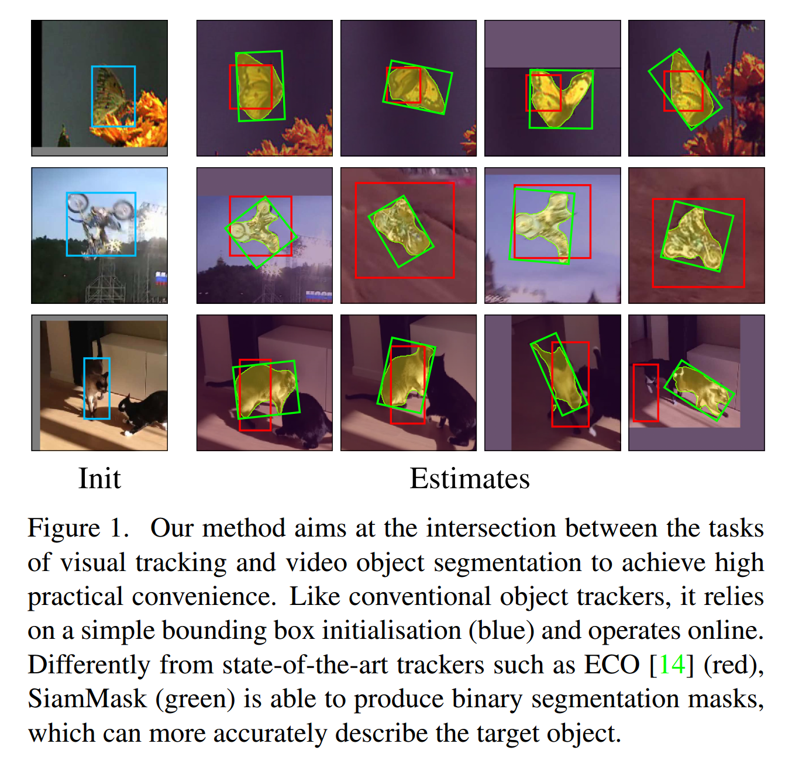
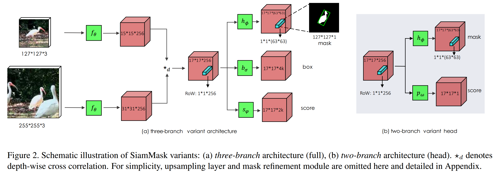
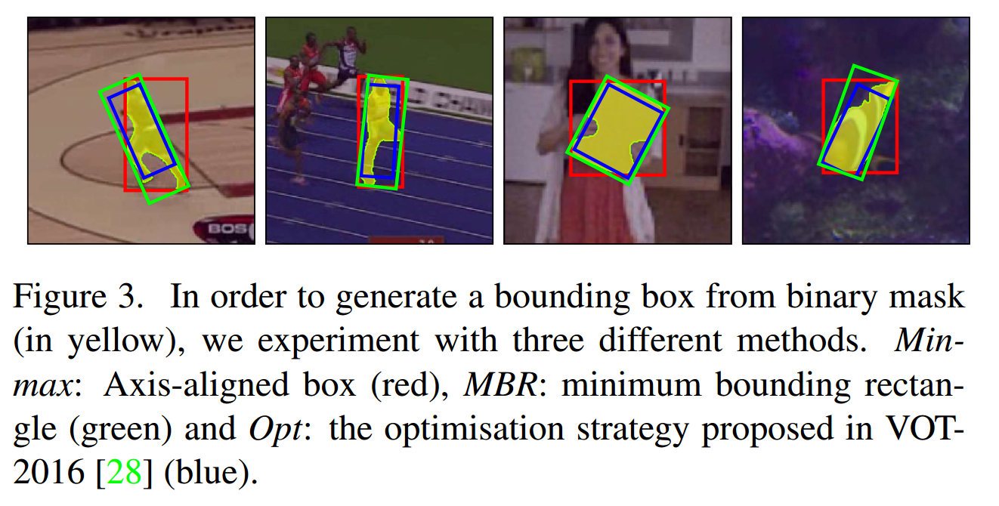
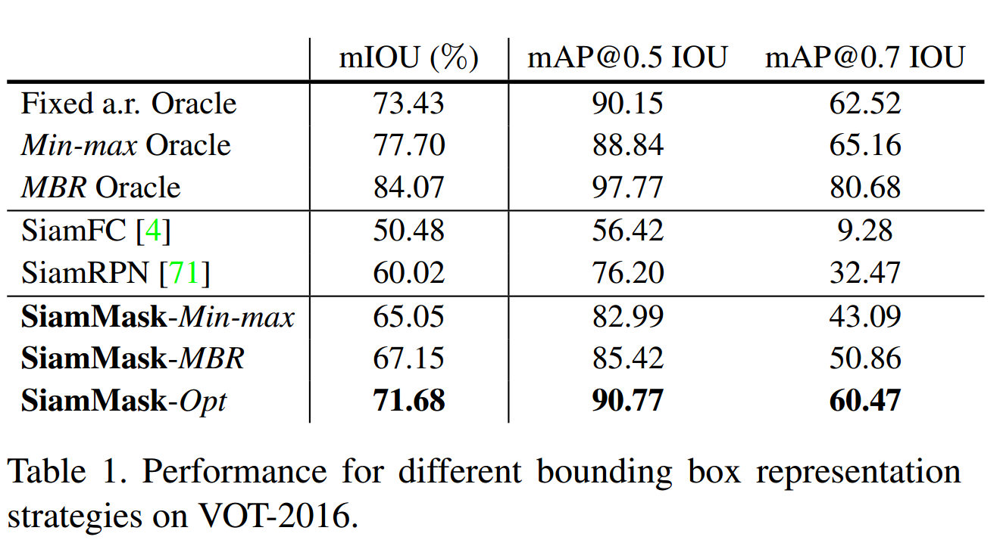
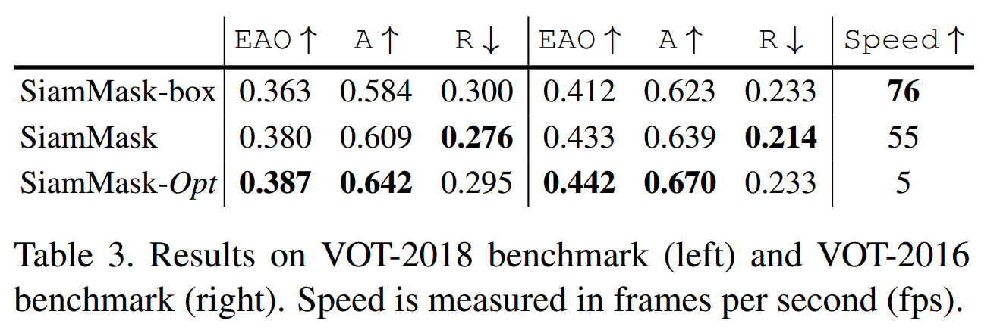
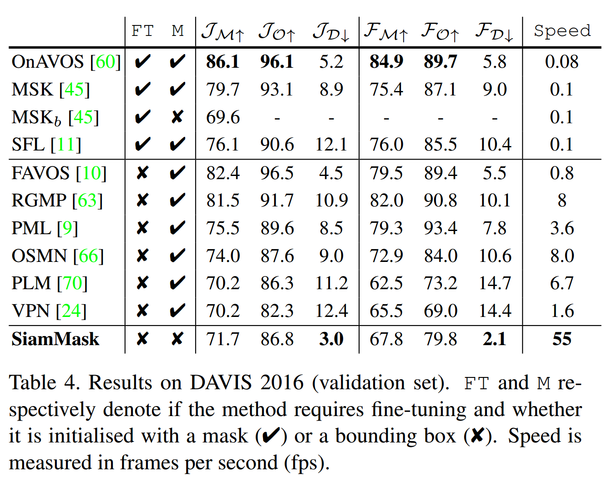
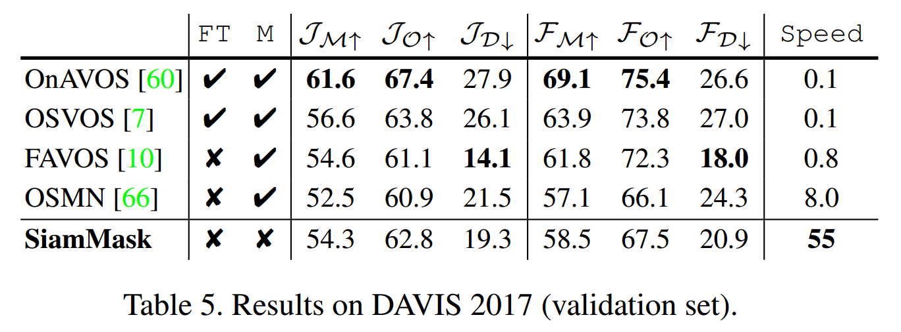
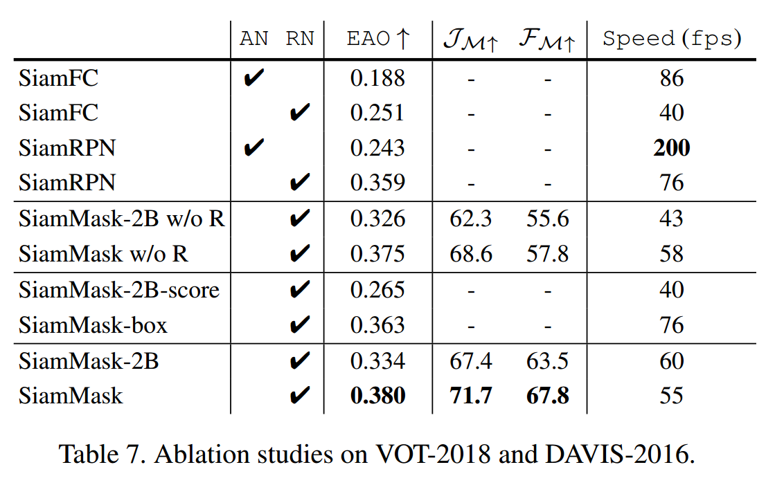
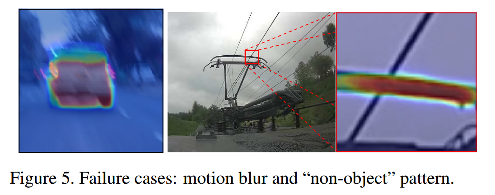

### Fast Online Object Tracking and Segmentation: A Unifying Approach

#### Abstract

​		在本文中，我们说明了如何使用一种简单的方法实时执行视觉对象跟踪和半监督视频对象分割。我们的方法（称为SiamMask）通过增加二值分割任务的损失来改进目标跟踪中流行的全卷积Siamese方法的离线训练过程。一旦得到训练，SiamMask仅依靠单个边界框初始化并在线运行，从而以每秒55帧的速度生成与类无关的对象分割掩膜与旋转边界框。尽管其简单、多功能和快速的速度，但我们的策略使我们能够在VOT-2018的实时跟踪器中建立最新的结果，同时展示了在DAVIS-2016和DAVIS-2017上的半监督对象分割任务上的竞争性性能和最佳速度。

#### 1. Introduction

​		在任何需要对感兴趣目标进行一定程度推理的视频应用中，跟踪都是一项基本任务，因为它允许在帧之间建立对象之间对应关系[38]。目标跟踪有广泛的应用场景，例如自动监控、汽车导航、视频标签、人机交互和行为识别。给定视频的第一帧中的任意感兴趣目标的位置，_视觉目标跟踪_ 的目的是以最好的可能准确率估计其在所有后续帧中的位置[69、65、55]。

​		对于许多应用程序而言，在视频流传输时可以在线进行跟踪非常重要。换句话说，跟踪器不应利用将来的帧来推断物体的当前位置[30]。这是视觉对象跟踪基准所描绘的场景，该基准代表具有简单轴对齐的[62、34、42、59、43]或旋转的[30]边界框的目标对象。如此简单的标准有助于保持数据标准的低成本；此外，它允许用户执行快速而简单的目标初始化。

​		与目标跟踪相似，半监督 _视频目标分割_（video object segmentation: VOS）需要估计视频的第一帧指定的任意的目标的位置。然而，在这种情况下，目标表示包含二值分割掩膜，这个掩膜表示像素是否属于目标[46]。对于需要像素级信息的应用（例如视频编辑[44]和rotoscoping [41]），这种详细表示更为理想。可以理解，与简单的边界框相比，生成像素级估计需要更多的计算资源。结果，VOS方法传统上很慢，通常每帧需要几秒钟的时间（例如[61、57、45、2]）。 最近，人们对更快的方法产生了兴趣[66、40、63、10、9、24、23]。 但是，即使最快的仍然无法实时运行。

​		本文中，我们旨在通过提出的SiamMask来弥补任意目标跟踪和VOS之间的差距，SiamMask是一个可以用于处理两个问题的简单的多任务学习方法。基于全卷积的Siamese网络[4]的快速跟踪方法在数百万对视频帧（例如[31、71、17、67]）上离线训练的成功，以及最近YouTube-VOS（一个具有逐像素标注的大型视频数据集）的推出，激发了我们的方法 [64]。我们旨在保留这些方法的离线可训练性和在线速度，同时显着改善其对目标对象的表示，它们的表示仅限于简单的轴对齐边界框。

​		为了达到这个目标，我们在三个任务上同时训练Siamese网络，每个任务对应不通过的策略来建立新的帧中目标对象和候选区域的对应。如Bertinetto等[4]的全卷积方法，一个任务是以滑动窗口的形式学习目标对象和多个候选之间的相似性。输出是密集的响应图，其仅指示对象的位置，而没有提供关于对象空间位置的任何信息。为了提炼这个信息，我们同事学习两个进一步的任务：使用RPN[53、31]的边界框回归和类无关的二值分割[49]。值得注意的是，离线训练期间，仅需要二值标签来计分割损失，而不需要在分割/跟踪任务上在线学习。在我们所提出的架构中，每个任务都由与共享CNN分开的不同分支来代表，并贡献最终损失，最终损失将这三个输出相加。

​		一旦训练，SiamMask仅依靠单个边界框初始化，在线运行，而不需要更新，并以每秒55帧的速度产生对象分割掩膜和旋转边界框。尽管其简单而快速，SiamMask在实时对象跟踪为题的VOT-2018上建立了新的SOTA。此外，这种方法在DAVIS-2016和DAVIS-2017的半监督VOS上也具竞争力，同时以很大的优势称为最快的方法。通过简单的边界框初始化（而不是掩码）即可获得此结果，而无需采用VOS方法经常使用的昂贵技术，例如微调[39、45、2、60]，数据增强[25、33]和 光流[57、2、45、33、10]。

#### 3. Related Work

​		本节中，我们简要回顾处理本文两个方法的最具代表性的技术。

**Visual Object Tracking.**   可以说，直到最近，用于跟踪任意对象的最流行的范例一直是仅根据视频第一帧中提供的ground truth信息在线训练判别式分类器（然后在线进行更新）。这种策略通常称为 _tracking-by-detection_ （例如[1、55]）。在过去的几年，由于Correlation Filter（一种可区分任意目标的模板及其2D平移的简单算法）的发展，作为一种特别快速有效的通过检测来跟踪策略，由于Bolme等[6]的开创性工作，该算法日益受到关注。然后，利用采用multi-channel formulations[26、22]，空间约束（spatial constraints）[27、15、37、32]和深度特征（例如[14、58]），基于相关过滤器的跟踪器的性能得到了显着改善。

​		最近，[4、21、56]介绍了一种完全不同的方法。这些方法在视频帧对上离线训练相似度函数，而不是在线学习辨别性的分类器。在测试时，这个函数可以在新视频上一次一帧地简单评估。特别地，利用区域提议[31]、难样本挖掘[71]、集成[17]和记忆网络[67]的全卷积Siamese方法[4]的革新，相当程度上提高了跟踪性能。

​			大多数现代跟踪器（包括上述的所有跟踪器）使用矩形边界框来初始化目标和估计其在后续帧中的位置。尽管其方便，但是简单的矩形通常不能恰当地表示一个对象，这如图1所示。这启发我们提出一个能够产生二值分割掩膜同时仍依赖边界框初始化的跟踪器。

​		有趣的是，在过去，跟踪器通常不会生成目标对象的粗糙二进制掩码（例如[13、48、5]）。然而，据我们所知，Yeo等人[68]基于超像素的方法是唯一最新的跟踪器（与我们的跟踪器一样）能够在线运行并从边界框初始化开始生成二进制掩码。然而，它的最快变体（4帧每秒）明显比我们所提出的方法慢。此外，当使用CNN特征时，其速度会受到60倍的降低的影响，跌落至0.1 fps以下。最后，它在现代跟踪或VOS基准测试中没有表现出竞争力。与我们类似，Perazzi等[45]和Ci等[12]的方法也能从一个矩形开始，并输出每帧的掩膜。但是，它们需要在测试时微调，这使得它们很慢。

**Semi-supervised video object segmentation.**    任意目标跟踪的基准测试（例如[55、30]）假设跟踪器以序列的方式接收输入帧。 这一方面通常称为在线或着因果关系[30]。相反，传统上，半监督VOS算法更关注感兴趣对象的准确表示[44、46]。

​		为了利用视频帧之间的一致性，几种方法是通过图标签方法将第一帧的监督分割掩膜传播到时间上相邻的掩膜上（例如[61、47、57、40、2]）。特别是，最近，Bao等[2]提出一种非常准确的方法，该方法利用了时空MRF，其中，时间相关性是通过光流建模的，而空间相关性是由CNN表示的。

​		另一个流行的策略是独立地处理视频帧（例如[39、45、60]），与大多数跟踪方法中发生的相似。例如，在OSVOS-S中，Maninis等[39]没有利用任何的时序信息。它们依赖预训练的全卷积网络来分类，然后，在测试时，它们使用第一帧中提供的ground-truth掩膜来微调。相反，MaskTrack [45]是从头开始对单个图像进行训练的，但是它通过使用最新的掩膜预测和光流作为网络的附加输入，在测试时确实利用了某种形式的时序性。

​		为了达到最高的准确性，在测试时，VOS方法通常采用计算密集型技术，例如微调[39、45、2、60]、数据增强[25、33]和光流[57、2、45、33 ，10]。因此，这些方法通常有低帧速率和无法在线操作的特征。例如，对于像DAVIS这样短短几秒钟的视频，要求几分钟[45，11]甚至几小时[57，2]的方法并不罕见。

​		最近，最近，VOS社区对更快的方法[40，63，10，9，24，23]越来越感兴趣。据我们所知，Yang等[66]和Wug等[63]是性能能与最新技术相抗衡的最快方法。前者使用元网络“调制器”在测试期间快速适应分割网络的参数，而后者不使用任何微调，而是采用经过多阶段训练的编解码器Siamese体系结构。这两个方法都以10帧每秒以下的速度运行，而我们的方法快了6倍，并且仅依赖边界框初始化。

#### 3. Methodology

​		为了运行在线可操作和快速运行，我们采用Bertinetto等[4]的全卷积侧Siamese框架。此外，为了说明我们的方法与作为起点的特定全卷积方法无关（例如[4，31，71，67，18]），我们考虑流行的SiamFC [4]和SiamRPN [31]为两个代表性的例子。

##### 3.1.  Fully-convolutional Siamese networks

**SiamFC.**	Bertinetto等人[4] 提出使用离线训练的全卷积Siamese网络作为跟踪系统的基本构建模块，该网络将示例图像 $z$ 与（较大）搜索图像 $x$ 进行比较以获得密集的响应图。$z$ 和 $x$ 分别是目标对象为中心的 $w \times h$ 的裁剪和以目标最新的估计位置为中心的更大裁剪。由相同的CNN $f_{\theta}$ 处理两个输入，产生的两个特征图进行互相关操作：

$$g_{\theta}(z, x) = f_{\theta}(z) \ast f_{\theta}(x). \tag{1}$$

本文中，我们称响应图（式（1）的左边）的每个空间元素为候选窗口的响应（response of a candidate window: RoW）。例如，$g_{\theta}^{n}(z,x)$ 编码了示例 $z$ 和 $x$中第 $n$ 个候选窗口之间相似度。对于SiamFC，目标是使响应图的最大值与搜索区域 $x$ 中的目标位置相对应。相反，为了允许每个RoW编码有关目标对象的更丰富的信息，我们将式（1）的简单互相关替换为逐深度互相关[3]并生成多通道响应图。SiamFC在百万个视频帧上使用logistics损失离线训练，该损失称为 $\mathcal{L}_{sim}$ 。

**SiamRPN.**	Li等[31]依赖区域提议网络（RPN）[53、16]相当程度上提高了SiamFC的性能，该方法运行估计具有不同纵横比的边界框的目标的位置。特别地，在SiamRPN中，每个RoW编码 $k$ 个锚框提议及对应对象/背景得分的集合。因此，SiamRPN与分类得分并行输出边界框预测。这两个输出分支使用smooth $L_1$ 和交叉熵损失训练。接下来，我们分别称它们为 $\mathcal{L}_{box}$ 和 $\mathcal{L}_{score}$ 。

##### 3.2. SiamMask

​		与现有的依赖于低保真度对象表示的跟踪方法不同，我们讨论产生每帧二值分割掩码的重要性。为了这个目标，我们证明，除相似度得分和边界框坐标外，全卷积的Siamese网络也编码了产生逐像素二值淹没的所需要的信息。这可通过将已有的Siamese跟踪器使用额外的分支和损失扩展来获得。

​		我们使用简单的两层具有可学习参数$\phi$的神经网络$h_{\phi}$来预测 $w \times h$ 的二值掩膜（每个RoW一个）。令$m_n$表示与第$n$个RoW对应的预测掩膜，

$$m_n = h_{\phi}(g_{\theta}^n(z, x)). \tag{2}$$

根据式（2），我们可以看出掩膜预测是一个图像到分割$x$和$z$中目标对象的函数。以这种方式，$z$可以用作引导分割过程的参考，使得任意类的对象可以被跟踪。这清楚地表示，给定不同参考图像 $z$ ，网络会为 $x$ 产生不同的分割掩膜。

**Loss function.**	训练期间，每个RoW用ground-truth二值标签 $y_n \in \{\pm\}$ 标记，并与大小为 $w \times h$ 的逐像素的ground-truth掩膜 $c_n$ 关联。令 $c_n^{ij}\in\{\pm\}$ 表示与第$n$个候选RoW中对象掩膜的像素 $(i,j)$ 对应的标签。掩膜预测任务的损失函数 $\mathcal{L}_{mask}$ （式（3））为所有RoW上的二值logistics回归损失：

$$\mathcal{L}_{mask}(\theta, \phi) = \sum_{n}(\frac{1+y_n}{2wh}\sum_{ij}\log(1 + e^{-c_n^{ij}m_n^{ij}})).\tag{3}$$

因此，$h_{\phi}$ 的分类层包含 $w \times h$  个分类器，每个分类器指示给定的像素是否属于候选窗口中的对象。注意，$\mathcal{L}_{mask}$ 仅考虑正类RoW（即$y_n=1$中）。

**Mask representation.**  与语义分割方法FCN [36]和Mask R-CNN [19]（在整个网络中维护明确的空间信息）相反，我们的方法遵循[49，50]的精神，并从扁平化的对象表示开始生成掩码。特别地，在我们的情况下，该表示对应于由$f_{\theta}(z)$和$f_{\theta}(x)$之间的深度互相关所产生的 $(17 \times 17)$ RoW 之一。重要的是分割任务的网络 $h_{\phi}$ 包含两个 $1 \times 1$ 卷积层，一个由256个通道，另一个由$63^2$ 个通道（见图2）。这允许每个像素分类器利用整个RoW中包含的信息，从而在 $x$ 中具有其相应候选窗口的完整视图，这对于消除看起来像目标的实例（例如，图4的最后一行）也是至关重要的，这些看起来像的目标被称为干扰物[52，71]。为了产生更精确的对象掩膜，我们遵循[50]的策略，该策略使用由上采样层和跳过连接构成的多个细化模块合并了低分辨率和高分辨率特征（请参阅附录）。

**Two variants.**  对于四个实验，我们使用分割分支和损失 $\mathcal{L}_{mask}$ 增强SiamFC[4]和SiamRPN[31]非架构，获得我们称为SiamMask的两分支和三分支的变体。这些分别优化的多任务损失 $\mathcal{L}_{2B}$ 和 $\mathcal{L}_{3B}$ 定义为：

$$\mathcal{L}_{2B} = \lambda_1 \cdot \mathcal{L}_{mask} + \lambda_2 \cdot \mathcal{L}_{sim}, \tag{4}$$

$$\mathcal{L}_{3B} = \lambda_1 \cdot \mathcal{L}_{mask} + \lambda_2 \cdot \mathcal{L}_{score} + \lambda_3 \cdot \mathcal{L}_{box}. \tag{5}$$

$\mathcal{L}_{sim}$ 可参考[4，2.2节]，$\mathcal{L}_{box}$ 和 $\mathcal{L}_{score}$ 参考[31，3.2节]。对于 $\mathcal{L}_{3B}$ ，如果RoW的一个锚框与ground-truth边界框的IoU至少为0.6，那么将这个RoW视为正类（$y_n = 1$），否则将其视为负类（ $y_n = -1$ ）。对于 $\mathcal{L}_{2B}$，我们采用[4]相同的策略来定义正负样本。我们没有搜索式（4）和式（5）的超参数，仅与[49]一样，设置 $\lambda_1 = 32$，$\lambda_2 = \lambda_3 = 1$ 。边界框和得分输出的任务特定分支由两个 $1 \times 1$ 卷积层组成。 图2说明了SiamMask的两个变体。

**Box generation.**  注意，虽然VOS基准测试需要二值掩膜，但一般的跟踪（如VOT[30]）需要边界框作为目标对象的最终表示。我们考虑三种策略来从二值掩膜上生成边界框（图3）：（1）轴对齐的边界矩形（min-max），（2）选择最小包围矩形（MBR）和（3）VOT-2016[28]上提出的用于自动边界框生成的最优策略（Opt）。我们在第四节中通过实验评估这些替代方案。

##### 3.3. Implementation details

**Network architecture.**   对于我们的两个变体，我们使用ResNet-50 [20]直到第4阶段的最后卷积层作为我们的主干 $f_{\theta}$ 。为了在深度层中获得高空间分辨率，我们通过使用步长为1的卷积将输出步长减少至8。此外，我们还使用膨胀卷积[8]增加感受野。在我们的模型中，我们向共享主干 $f_{\theta}$ 添加了一个非共享的调整层（具有256个输出的 $1\times1$ 卷积）。简单起见，我们在式（1）将其去除。附录中描述了网络架构的更多细节。

**Training.**	与SiamFC[4]相似，我们使用分别使用 $127 \times 127$ 像素的示例和 $255 \times 255$ 像素的搜索图像补丁。训练期间，我们随机扰动示例和搜索补丁。具体而言，我们考虑随机平移（上至 $\pm$ 个像素）和缩放（示例和搜索补丁分别为 $2^{\pm 1/8}$ 和 $2^{\pm 1/4}$）。

​		网络骨干在ImageNet-1K分类任务上预训练。我们将SGD与第一个预热阶段一起使用，在该阶段中，前5个学习周期的学习率 $从10^{-3}$ 线性增加到$5×10^{-3}$，然后在后15个学习周期对数递减至$5×10^{-4}$。我们使用COCO[15]、ImageNet-VID[54]和YouTube-VOS[64]训练所有模型。

**Inference.**	跟踪期间，SiamMask每帧简单地评估一次，而没有任何域适应。在我们的两个变体中，我们使用在分类分支中获得最高分的位置来选择输出掩膜。然后，在应用每个像素的sigmoid后，我们使用阈值0.5来二值化掩膜分支的输出。在两分支变体中，对于第一帧后的每个视频帧，我们将输出掩膜与“最小-最大”框配合使用，并将其用作裁剪下一帧搜索区域的参考。相反，在三分支变体中，我们发现利用box分支中得分最高的输出作为参考更有效。

#### 4. Experiments

​		在这一节中，我们在两个相关任务上评估我们的方法，这两个任务是：视觉对象跟踪（VOT-2016和VOT-2018）和半监督视频对象分割（DAVIS-2016和DAVIS-2017）。我们分别称两分支和三分支变体为SiamMask-2B和SiamMask。

##### 4.1.	Evaluation for visual object tracking

**Datasets and settings.**	我们采用两个广泛使用的基准测试来进行目标跟踪任务的评估：VOT-2016[26]和VOT-2018[29]，两个数据集都标注有旋转的边界框。我们使用VOT-2016来执行实验以理解不同类型的表示是如何影响性能的。对于这第一种实验，我们使用IOU和$(AP)@\{0.5,0.7\}$。然后，在VOT-2018上，使用官方的VOT工具包和EAO比较最佳算法，其考虑了跟踪器的准确率和鲁棒性。

**How much does the object representation matter ?**	已有的跟踪方法通常预测具有固定[4、22、15、37]或变化[31、21、71]纵横比的轴对齐边界框。我们感兴趣的是了解在多大程度上产生每帧的二值掩膜可以改善跟踪。为了关注表示的准确率，对于这个实验，我们仅忽略时序方面，并随机采样视频帧。以下段落中描述的方法在VOT-2016序列中的随机裁剪搜索补丁（随机偏移在$\pm16$像素以内，缩放变形最大为$21 \pm 0.25$）上进行了测试。

​		表1中，我们使用Min-max、MBR和Opt方法（3.2节和图3）来比较三分支变体。为了便于理解，我们还报告了SiamFC和SiamRPN的结果，这些结果代表了固定和可变长宽比方法的代表，以及可获取每帧ground-truth信息并充当不同表示策略上限的三个预测（Oracle）。（1）固定纵横比的oracle使用每帧的ground-truth区域和中心位置，但将宽高比固定为第一帧中的纵横比，并生成一个与轴对齐的边界框。（2）Min-max 预测使用旋转ground-truth边界框的最小包围矩形来产生轴对齐的边界框。（3）最后，MBR预测使用ground-truth的旋转最小包围矩形。注意（1）、（2）和（3）可以分别视为SiamFC、SiamRPN和SiamMask的表示策略的性能上界。

​		表1说明了我们的方法获得最好的mIOU，而不论使用哪种边界框生成策略。尽管SiamMask-Opt提供了最高的IOU和mAP，但由于其缓慢的优化过程而需要大量的计算资源[28]。SiamMask-MBR获得85.4的map@0.5 的IoU，相对于两个全卷积基线，分别提高了29和9.2个点。有趣的是，当在精度为0.7 IOU的情况下考虑mAP时，差距显着扩大：分别为+41.6和+18.4。值得注意的是，我们的准确结果离固定的宽高比预测不远。此外，通过与由Oracle表示的上限性能比较，可以注意到通过简单地更改边界框表示，有很大的改进空间（例如，固定长宽比与MBR oracle高 +10.6％ mIOU）。

​		总的来说，这项研究表明，与简单报告轴对齐边界框的流行策略相比，MBR策略从对象的二值掩膜上获得的旋转边界框具有显着优势。

**Results on VOT-2018 and -2016.**  表2中，我们将采用MBR策略的SiamMask和SiamMask–Opt的两种变体与最近发布的VOT-2018基准的五个最新跟踪器进行了比较。除非另有说明，否则SiamMask指的是具有MBR策略的三分支变体。SiamMask的两种变体都获得显著的性能和实时性。特别地，我们的三分支变体明显好于最近且顶级性能的DaSiamRPN[71]，其获得了0.380的EAO和55fps的运行速度。即使没有边界框回归分支，我们更简单的两分支变体（SiamMask-2B）获得了0.334的EAO，这接近SA_Siam_R[17]并优于出版文献中其他实时方法。此外，SiamMask-Opt可以获得0.387EAO的最佳性能，但是仅以5fps的速度运行。这是预料之中的，因为边界框优化策略需要更多的计算才能提供更高的IOU。我们的模型在精度指标下特别强大，相对于基于相关滤波器的跟踪器CSRDCF [37]、STRCF [32]而言，它显示出显着优势。这并不令人吃惊，因为SiamMask依赖更丰富的目标表示，如表1所示。有趣的是，与我们的方法相似，He等（SA_Siam_R）[17]则通过考虑多个旋转和缩放的边界框来实现更准确的目标表示。然而，它们的表示仍然局限于固定纵横比的边界框。

​		表3给出VOT-2018和-2016上具有不同边界框生成方法的SiamMask的进一步结果。SiamMask-box表示采用SiamMask的边界框分支进行推理（尽管已经训练了掩膜分支）。通过使用mask分支生成框，我们可以观察到所有评估指标的明显改进。

##### 4.2.	Evaluation for semi-supervised VOS

​		我们的模型经过训练后，也可以用于VOS的任务，以实现竞争性能，而无需在测试时进行任何调整。重要的是，与典型的VOS方法不同，我们的方法可以在线、实时运行，并且只需要简单的边界框初始化即可。

**Datasets and settings.**	我们在DAVIS-2016 [46]、DAVIS-2017 [51]和YouTube-VOS [64]基准上报告SiamMask的性能。对于这两个DAVIS数据集，我们使用官方的性能度量：Jaccard指数（J）表示区域相似度，而F度量（F）表示轮廓精度。对于每个测量 $\mathcal{C} \in \{\mathcal{J}, \mathcal{F}\}$，考虑三个统计量：均值 $\mathcal{C_M}$、召回率$\mathcal{C_O}$和decay $\mathcal{C_D}$，这会告诉我们随着时间的推移性能的增/减[46]。遵循[64]，Youtube-VOS上的最终结果$\mathcal{O}$为四个度量的平均：出现过类别的$\mathcal{J}$、出现过类别的$\mathcal{F}$、未出现过类别的$\mathcal{J}$和未出现过类别的$\mathcal{F}$。

​		为了初始化SiamMask，我们从第一帧提供的掩膜上提取轴对齐的边界框（min-max策略，图3）。与大多数VOS方法相似，在同一视频（DAVIS-2017）的多个目标的情况下，我们简单地执行多目标推理。

**Results on DAVIS and YouTube-VOS.**	在半监督设置中，VOS方法使用二值掩膜[44]初始化，测试时，在MRF/CRF和光流中推理中，它们中的许多方法需要计算密集性技术（例如微调、数据增强和光流）。显然，这些策略使在线应用（这是我们的重点）成为不可能。 因此，在我们的比较中（表4、5和6），我们主要关注速度较快的最新方法。

##### 4.3. Further analysis

**New architecture.**	如表7，$AN$和$RN$表示是否使用AlexNet或ResNet-50作为共享骨干$f_{\theta}$。

**Multi-task training.**	见表7和表3。

**Timing.** 在单个NVIDIA Titan X GPU上，两个变体的平均速度分别为55和60帧每秒。

**Failure cases.** 

