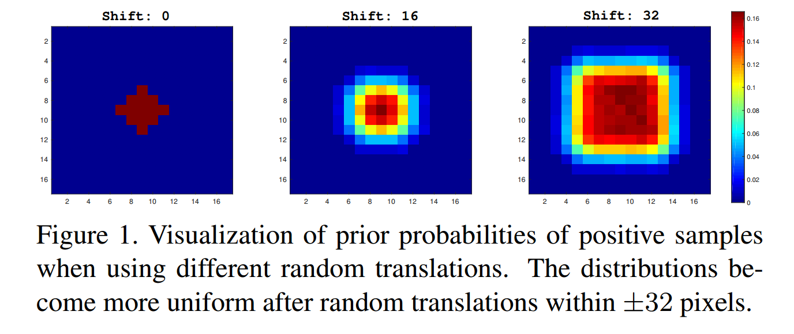
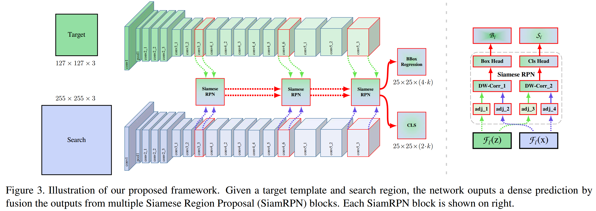
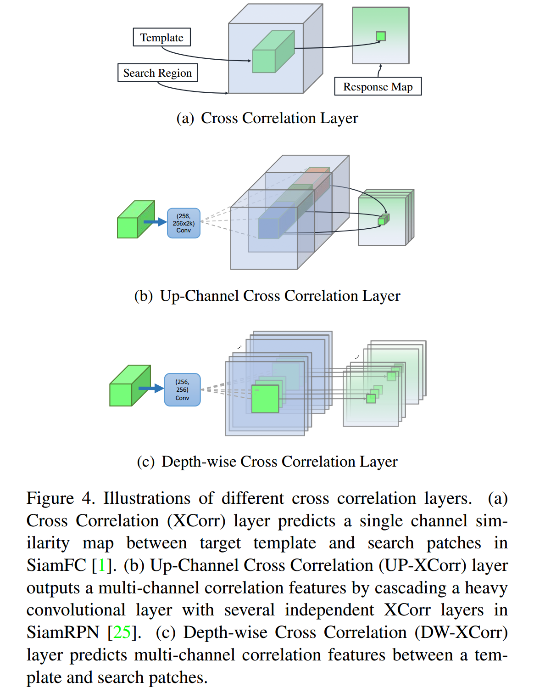
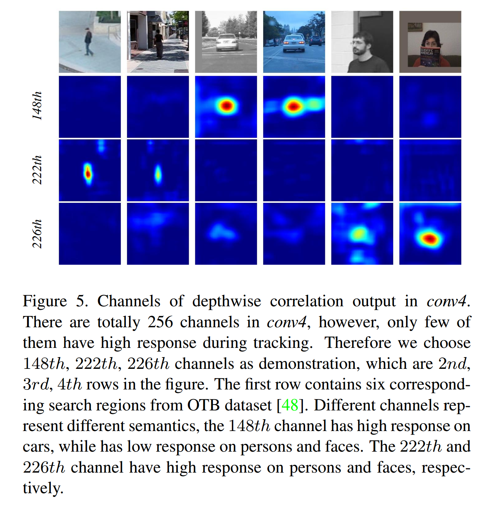
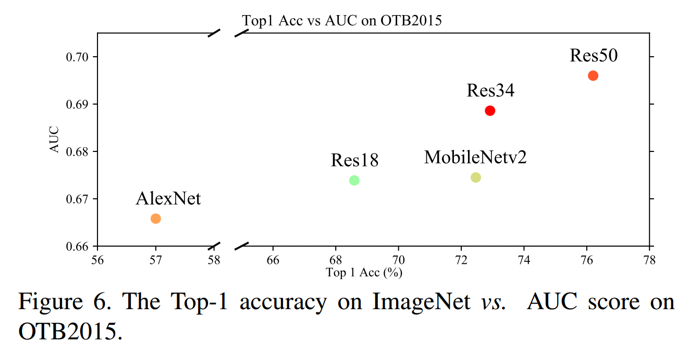
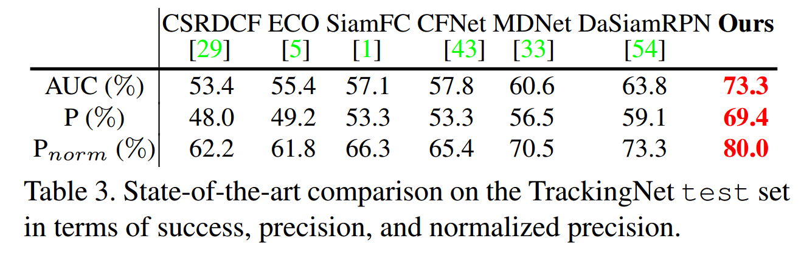

### SiamRPN++: Evolution of Siamese Visual Tracking with Very Deep Networks

#### Abstract

​		基于Siamese网络的跟踪器将跟踪公式化为目标模板和搜索区域之间的卷积特征互相关。然而，与最佳的算法相比，Siamese跟踪器仍然在准确率上有差距，并且它们不能利用深度网络（例如ResNet-50或更深网络）的特征。本文中，我们证明这个核心问题时来自缺乏严格的平移不变性。通过合理的理论分析和实验验证，我们通过简单但有效的空间感知采样策略突破了这一限制，并成功地训练了ResNet驱动的Siamese跟踪器，并获得了显着的性能提升。此外，我们提出一种新的模型架构来执行逐层和逐深度的聚合，其不仅进一步提高准确率，还能减小模型的大小。我们执行广泛的消融研究来论证所提出跟踪器的效率，其在5个大型数据集（包含OTB2015、VOT2018、UAV123、LaSOT和TrackingNet）上获得当前最佳的结果。

#### 1. Introduction

​		视觉目标跟踪在过去几十年中受到越来越多的关注，并且一直是非常活跃的研究方向。它在视觉监控[49]、人机交互[27]和增强现实[50]等不同领域具有广泛的应用。尽管最近已经取得了很大进展，但是由于许多因素，例如光照变化、遮挡和背景杂波，仅举几例[48]，它仍然被公认为一项非常具有挑战性的任务。

​		最近，基于Siamese网络的跟踪器[42,1,16,44,43,25,45,54,46]在社区中吸引了很多的关注。这些Siamese跟踪器通过为目标模板和搜索区域学习的特征表示之间的互相关，将视觉目标跟踪问题公式化为学习通用相似度图。为例确保跟踪效率，离线学习的Siamese相似性函数通常在运行期间固定[42, 1,16]。CFNet跟踪器[43]和DSiam跟踪器[12]分别通过running平均值模板和快速转换模块更新跟踪模型。SiamRPN跟踪器在Siamese网络后引入区域提议网络[25]，并执行联合分类和回归进行跟踪。DaSiamRPN跟踪器[54]进一步引入干扰感知的模块，并提高模型的辨别能力。

​		在跟踪OTB2015等基准[48]，尽管上述Siamese跟踪器已经获得了出色的跟踪性能，尤其是在精确度和速度方面取得了很好的平衡，但即使是性能最佳的Siamese跟踪器，例如SiamPRN，其准确性仍与最新技术[5]仍有明显差距。我们观察到，所有这些跟踪器都在类似于AlexNet [24]的体系结构上构建了他们的网络，并尝试了几次训练具有像ResNet [15]这样更复杂的体系结构的Siamese跟踪器，但是却没有性能提升。受这种观察的启发，我们分析已有的Siamese跟踪器，并发现**核心问题来自破坏了严格的平移不变**。由于目标可能出现在搜索区域的任何位置，因此目标模板的学习特征表示应保持空间不变，并且我们进一步从理论上发现，在现代深度架构中，**只有AlexNet的零填充变体满足该空间不变性限制**。

​		为了克服这一限制，并通过广泛的实验验证，以更强大的深度架构来驱动Siamese踪器，我们引入了一种简单而有效的采样策略，以打破Siamese跟踪器的空间不变性限制。我们使用ResNet作为骨干网络成功训练了基于SiamRPN[25]的跟踪器，并获的显著的性能改进。得益于ResNet架构，我们为互相关操作提出了一种layer-wise feature aggregation结构，该结构可帮助跟踪器根据在多个级别学习的特征来预测相似度图。通过分析Siamese网络结构的互相关性，我们发现其两个网络分支在参数数量方面高度不平衡。 因此，我们进一步提出了一种深度可分离的相关结构，该结构不仅大大减少了目标模板分支中的参数数量，而且稳定了整个模型的训练过程。此外，观察到一种有趣的现象，相同类别的对象在相同通道上具有高响应，而余下的通道被抑制。这种正交属性可能还改进了跟踪性能。

​		总之，这项工作的主要贡献为如下四点：

- 我们提供了对Siamese跟踪器的深入分析，并证明了当使用深度网络时，准确性的降低是由于严格的平移不变性的破坏所致。
- 我们提出简单而有效的采样策略来打破这种空间不变的限制，这成功地训练了由ResNet架构驱动的Siamese跟踪器。
- 我们提出了一种用于互相关操作的逐层特征聚合结构，该结构可帮助跟踪器根据在多个级别学习的特征来预测相似度图。
- 我们提出了一种深度可分离的相关结构，以增强互相关，从而产生与不同语义相关的多个相似度图。

​		基于上述理论分析和技术贡献，我们开发了高度有效的视觉跟踪模型，该模型在跟踪准确率方面确立了新的最佳方案，同时以35FPS的速度高效运行。所提出的跟踪器（称之为 _SiamRPN++_）在五个大型跟踪基准测试上一致性地获得最佳跟踪结果，数据集包括OTB2015[48]、VOT2018[22]、UAV123[32]、LaSOT[10]和TrackingNet[31]。此外，我们提出了使用MobileNet[19]的变体，它也能保持竞争性性能，同时以70FPS的速度运行。

#### 2. Related Work

​		在这一节中，我们简要介绍最近的跟踪器，并且特别关注Siamese跟踪器[42、1]。此外，我们还介绍深度架构的最新发展。

​		由于建立了新的基准数据集[47、48、20、22、10、31]和改进的方法[17、53、6、7、18、33、9、5、45、54、51]，视觉跟踪在过去十年中迅速发展。 标准化基准[47、48、10]为比较不同算法提供了公平的测试平台。每年举行的跟踪挑战[23，20，21，22]不断提高跟踪性能。随着这些进步，已经提出了许多有希望的跟踪算法。Bolme等人[3]的开创性工作将卷积理论从信号处理领域引入视觉跟踪，并将对象模板匹配问题转化为频域的相关运算。归功于这些变换，基于相关滤波的跟踪器不仅获得高效的运行速度，如果使用恰当的特征[17、52、53、8、6]，还提高了准确率。随着视觉跟踪中深度学习模型的广泛采用，基于具有深度特征表示的相关滤波的跟踪算法[9、5]在流行的跟踪基准测试[47、48]和挑战[23、20、21]上获得最佳准确率。

​		最近，基于Siamese网络的跟踪器因其均衡的跟踪精度和效率而受到了广泛的关注[42、1、16、44、43、13、25、45、54、46]。这些跟踪器将视觉跟踪公式化为互相关问题，并且期望更好地利用端到端学习的深度网络的优势。为了从两个分支的互相关上产生相似性图，他们训练了一个“Y”形神经网络，该网络为两个网络分支，一个用于对象模板，另一个用于搜索区域。此外，这两个分支可以在跟踪阶段固定[42、1、16、45、25、54]或者在线更新以适应目标的外观变化[44、43、13]。当前最佳的Siamese跟踪器[25、54]通过Siamese网络后的区域提议网络增强了跟踪性能，并产生非常有前途的结果。然而，在OTB基准测试[48]上，他们的跟踪准确率仍然与如ECO[5]和MDNet[33]这样的最佳跟踪器有差距。随着Krizhevsky等[24]在2012年提出现代深度架构AlexNet，网络架构的研究正在迅速发展，并提出了许多复杂的深度架构，例如VGGNet [38]、GoogleNet [39]、ResNet [15] ]和MobileNet [19]。这些深层的体系结构不仅提供了对神经网络设计的更深刻理解，而且推动了许多计算机视觉任务的最新发展，例如目标检测[34]、图像分割[4]和人体姿势估计[ 40]。在深度视觉跟踪器中，网络体系结构通常包含不超过五个由AlexNet或VGGNet定制的结构层。[35]解释了这种现象，浅层特征主要有助于物体的精确定位。在这项工作中，如果使用整个Siamese网络合适地训练模型，那么我们认为Siamese跟踪器的性能可以获得显著提高。

#### 3. Siamese Tracking with Very Deep Networks

​		这项工作最重要的发现是，如果基于Siamese网络的跟踪算法装备更深的网络，那么它的性能可以显著提高。然而，直接使用更深的网络（如ResNet）简单地训练Siamese跟踪器不会获得期望的性能改进。我们发现根本原因很大程度上涉及Siamese跟踪器的固有限制，因此，在引入所提出的SiamRPN ++模型之前，我们首先对用于跟踪的Siamese网络进行更深入的分析。

##### 3.1. Analysis on Siamese Networks for Tracking

​		基于Siamese网络的跟踪算法[42、1]将视觉跟踪公式化为互相关问题，并利用具有Siamese网络结构的深度模型学习跟踪相似度图，这种Siamese网络的一个分支用于学习目标的特征表示，另一个分支用于搜索区域。目标通常在序列的第一帧给出目标补丁，并将其视为一个示例 $\mathbf{z}$。目标是在语义嵌入空间 $\phi(\cdot)$中从后续帧 $\mathbf{x}$找到最相似的补丁（实例）：

$$f(\mathbf{z}, \mathbf{x}) = \phi(\mathbf{z}) \ast \phi(\mathbf{x}) + b, \tag{1}$$

其中 $b$ 用于建模相似度值的偏移。

​		这种简单的匹配函数自然意味着在设计Siamese追踪器时存在两个固有的限制：

- Siamese跟踪器中使用的contracting部分和特征提取器对于_严格的平移不变性_ （$f(\mathbf{z}, \mathbf{x}[\Delta\tau_j])=f(\mathbf{z},\mathbf{x})[\Delta\tau_j]$，其中$[\Delta \tau_j]$为平移子窗口运算）具有内在限制。
- Contracting部分具有 _对称结构_ 的固有限制，即$f(\mathbf{z}, \mathbf{x}') = f(\mathbf{x'}, \mathbf{z})$，这适合相似学习。

​		详细分析之后，我们发现妨碍Siamese跟踪器使用深度网络的核心原因与这两个方面相关。具体而言，原因之一是**深层网络中的填充会破坏严格的平移不变性**。另一个是**RPN需要_非对称_ 特征用于分类和回归**。我们将介绍使用空间感知的采样策略来克服第一个问题，并在3.4节讨论第二个问题。严格的平移不变仅存在如修改的AlexNet[1]的没有填充的网络。先前基于Siamese的网络[1、44、43、25、54]设计为浅层来满足这种限制。但是，如果采用的网络被诸如ResNet或MobileNet之类的现代网络所取代，则不可避免地要进行填充以使网络更深，从而破坏了严格的翻译不变性限制。**我们的假设是违反此限制将导致空间偏差。**

​		我们通过在带有填充的网络上进行仿真实验来检验我们的假设。移位（shift）定义为由数据扩充中的均匀分布生成的最大平移范围。我们的仿真实验如下，首先，在三个单独的训练实验中，将目标放置在具有不同shift范围（0、16和32）的中心。收敛之后，我们聚合测试数据集上的热图，然后在图1中可视化结果。在第一种0偏移的仿真中，边界区域的概率衰退为0。这表明尽管出现了测试目标，但仍会学习到强烈的中心偏离。其他两个方针证明增加shift范围将逐渐阻止模型奔溃到这种平凡的解决方案中。量化结果展示了32-shift的聚合热图更接近测试对象的位置分布。它证明了这种采样策略有效地缓解了填充网络对严格的平移不变性的破坏。

​		**为了避免在对象上施加强烈的中心偏差，我们通过空间感知的采样策略训练具有ResNet-50骨干的SiamRPN，这种采样策略通过在搜索图像上的一个均匀分布采样目标。** 如图2所示，在VOT2018上，zero shift的性能减少值0.14，适当的shift（$\pm 64$ 像素）对于训练深层的暹罗跟踪器至关重要。

（上述问题的解释：

​		现代网络破坏严格平移不变性以后，带来的弊端就会学习到偏见：按照SiamFC的训练方法，正样本都在正中心，网络会学习到这种统计特性，即正样本的分布。

​		为了验证我们猜测，设计了模拟实验。当我们像SiamFC一样训练时，把正样本都放在中心，网络只对正样本有响应；如果把正样本均匀分布在某个范围内，而不是一直都在中心时（范围是离中心点一定距离，该距离为shift；正样本在整个范围内均匀分布），随着shift的不断增大，这种现象得到缓解。

​		我们按照这种思想进行了实际的实验验证，在训练过程中，我们不再将正样本放在中心，而是以均匀分布的采样方式让目标在中心点附近偏移。由图2可以看出，随着偏移的增大，深度网络可以有刚开始的完全没有效果逐渐变好。

​		所以说，通过均匀分布的采样方式让目标在中心点附近进行偏移，可以缓解网络因为破坏了严格平移不变性带来的影响，即消除了位置偏见，让现代网络可以应用于跟踪中。

​		那么为什么在检测和语义分割中不存在这个问题呢？因为，对于目标检测和语义分割而言，其训练过程中，目标本身就是在全图的每个位置均匀分布。很容易验证，如果在目标检测网络中只训练标注在图像中心的样本，而边缘的样本都不进行训练，那么这样的网络只会对图像中心位置产生高响应。更为致命的是，按照SiamFC的训练方式，中心位置为正样本，边缘位置为负样本，那么网络只会记录下边缘永远为负，这背离了我们的初衷。）

##### 3.2. ResNet-driven Siamese Tracking

​		根据上述分析，中心偏差的影响可以消除。一旦消除了中心位置的学习偏差，任何现成网络（例如MobileNet、ResNet）可用于在迁移学习后进行视觉跟踪。此外，我们可以自适应地构建网络拓扑并揭示深层网络的性能以进行视觉跟踪。

​		在这一小节中，我们将讨论如何将深度网络迁移到我们的跟踪算法。特别地，我们进行的实验主要针对ResNet-50 [15]。原始的ResNet具有32个像素的大步长，这不适合密集的Siamese网络预测。如图3所示，通过将conv4和conv5块修改为具有单位空间步长，我们将最后两个块的有效步幅从16个像素和32个像素减少到8个像素，并通过膨胀卷积[28]来增加其感受野 。在每个块输出上附加一层额外的 $1 \times 1$ 卷积层将通道减少到256。

​		由于保留了所有层的填充，目标特征的空间尺寸增加到15，这给相关模块带来了沉重的计算负担。因此，我们将中心的 $7 \times 7$ 区域[43]裁剪为模板特征，其中每个特征单元仍可以捕获整个目标区域。

​		遵循[25]，我们使用互相关层和全卷积层的组合来集成计算分类得分（表示为$\mathcal{S}$）和边界框回归器（表示为$\mathcal{B}$）的头部模块。Siamese RPN块表示为$\mathcal{P}$。

​		此外，我们发现仔细微调ResNet会提升性能。通过将ResNet提取器的学习率设置为比RPN部分小10倍，特征表示可以更适合于跟踪任务。与传统的Siamese方法相比，深度网络的参数以端到端的形式联合训练。据我们所知，我们是第一个在深度Siamese网络（> 20层）上实现视觉跟踪的端到端学习。

##### 3.3. Layer-wise Aggregation

​		在利用如ResN额头-50的深度网络之后，聚合不同的深度层变得可能。直觉上，视觉跟踪需要丰富的表示，这种表示跨越从低到高、从小型到大型和从精细分辨率到粗糙分辨率的层。即使卷积网络中的特征很深，但仅靠隔离的层还是不够的：将这些表示进行复合和聚合可改善对识别和定位的推断。

​		前面仅使用浅层网络（如AlexNet）的工作，多级特征不能提供非常不同的表示。但是，考虑到感受野变化很大，ResNet中的不同层更有意义。更早层的特征主要关注的低级信息（例如颜色、形状）对定位非常重要，但是缺乏语义信息；后面层的特征有丰富的语义信息，在某些挑战性场景（例如运动模糊、巨大变形）中可能会很有用。假设使用这种丰富的层次信息会帮助跟踪。

​		在我们的网络中，提取多分枝特征来协同推断目标定位。例如对于ResNet50，我们利用后面三个残差块提取的多级特征进行逐层聚合。我们分别称这些输出为 $\mathcal{F}_3(\mathbf{z})$、$\mathcal{F}_4(\mathbf{z})$和$\mathcal{F}_5(\mathbf{z})$。如图3所示，$conv3$、$conv4$和$conv5$的输出单独馈入三个Siamese RPN模块。

​		由于三个RPN模块的输出大小有相同的分辨率，在RPN的输出上直接采用加权和。使用权重融合层组合所有输出:

$$\mathcal{S}_{all} = \sum_{l=3}^5 \alpha_i \ast \mathcal{S}_l, \mathcal{B}_{all} = \sum_{l=3}^5 \beta_i \ast \mathcal{B}_l.\tag{2}$$

由于它们的域不同，组合权重分为分类和回归。权重与网络一起端到端地离线优化。

​		与前面的工作相比，我们的方法没有显示地组合卷积特征，但是单独地分类器和回归。注意，随着主干网络的深度显著增加，我们可以从多样的视觉语义层次上获得增益。

##### 3.4. Depthwise Cross Correlation

​		互相关模块是嵌入两个分支信息的核心操作。SiamFC[1]利用互相关层来获得目标位置的单通道响应图。在SiamRPN [25]中，通过添加巨大的卷积层来缩放通道（UP-XCorr），互相关被扩展为嵌入更高级别的信息（例如锚）。繁重的up-channel模块严重导致参数分布不平衡（即[25]中RPN模块包含20M参数，而特征提取器仅包含4M参数），这使得在SiamRPN中难以进行训练优化。

​		在本小节中，我们提出一种轻量的互相关层（称为Depthwise Cross Correlation（DW-XCorr））来获得高效的信息关联。DW-XCorr层包含的参数比SiamRPN中使用的UP-XCorr的参数少10倍，但是性能比UP-XCorr好。

​		为此，采用了conv-bn块来调整每个残差块中的特征以适合跟踪任务。至关重要的是，边界框预测和基于锚的分类都是 _非对称的_ ，这与SiamFC（见3.1节）不同。为了编码这种差异，将目标分支和搜索分支传入两个 _非共享（non-shared）_ 的卷积层。然后，具有相同通道数的卷积层的两个特征图进行逐通道的相关操作，并附加另一个conv-bn-relu块来融合不同通道的输出。最后，附加用于分类或回归输出的最后卷积层。

​		通过将互相关替换为depthwise相关，我们可以极大地减少计算成本和内存使用。以这种方式，目标和搜索分支的参数量得到平衡，产生的训练过程更加稳定。

​		此外，表5展示了一个有趣的现象。相同类的目标在相同通道（第148通道的汽车、第222通道的人和第226通道的脸）上具有较高的响应。可以理解该特性，因为深度互相关所产生的通道特征几乎是正交的，并且每个通道代表一些语义信息。当使用up-channel互相关时，我们还分析了热图，并且响应图的解释性较差。

#### 4. Experimental Results

##### 4.1. Training Dataset and Evalutation

**Training.**  我们的体系结构的骨干网络[15]在ImageNet [37]上进行了预训练，这已被证明是对其他任务的很好的初始化[14，28]。我们在COCO[26]、ImageNet DET[37]、ImageNet VID和YouTube-BoundingBoxes Dataset[36]上训练网络，并学习如何测量一般对象之间的相似性以进行视觉跟踪的一般概念。在训练和测试上，我们都使用127像素的模板补丁和255像素的搜索区域的单尺度图像。

**Evaluation.**  我们关注OTB2015 [48]、 VOT2018 [22] 和 UAV123 [32]上的短期单目标跟踪。我们使用VOT2018-LT[22]来评估长期跟踪。在长期跟踪中，对象可能会长时间离开视野或完全被遮挡，这比短期跟踪更具挑战性。我们还分析了我们的方法在LaSOT[10]和TrackingNet[31]上的泛化能力，这两个基准测试是当前最大的单目标跟踪基准测试。

##### 4.2. Implementation Details

**Network Architecture.**  在实验中，我们遵循DaSiamRPN[54]的训练和推理设置。我们将两个同级卷积层附加到经过大步缩减的ResNet-50（第3.2节）上，以使用5个锚点执行提议分类和边界框回归。三个随机初始化的 $1 \times 1$ 卷积层附加到 $conv3$、$conv4$和$conv5$以将特征维度减少到256。

**Optimization.**  使用SGD训练SiamRPN++。我们在8个GPU上以128对的minibatch（每个GPU包含16对）使用同步的SGD，在前5个epoch中使用0.001的warmup学习率训练RPN分支。对于最后15个epoch，整个网络端到端地训练整个网络，其学习率从0.005指数衰减到0.0005。使用0.0005的权重衰减和0.9的momentum。训练损失为分类损失和用于回归的标准smooth $L_1$ 损失之和。

##### 4.3.  Ablation Experiments

**Backbone Architecture.**  特征提取器的选择至关重要，因为参数的数量和层的类型会直接影响跟踪器的内存、速度和性能。使用AlexNet、ResNet-18、ResNet-34、ResNet-50和MobileNet-v2作为骨干的性能如图6所示。我们报告了OTB2015成功曲线相对于ImageNet的top1精度按曲线下面积（AUC）的性能。我们观察到我们的SiamRPN ++可以从更深的ConvNets中受益。

​	

​		表1还给出在VOT2018上将AlexNet替换为ResNet50的结果。此外，我们的实验证明，微调骨干部分至关重要，其产生极大的跟踪性能提高。

**Layer-wise Feature Aggregation.**  为了研究逐层特征聚合的影响，我们首先在ResNet50上训练了具有单个RPN的三个变体。我们通过经验发现，单独使用$conv4$，在EAO方面可以获得0.374的竞争性性能，但是更深层和更浅层的性能下降了4%。通过组合两个分支，$conv4$和$conv5$的性能得到提高，然而在其他两个组合上没有观察到改进。尽管如此，鲁棒性增加了10%，这是我们跟踪器的关键弱点。它意味着我们的跟踪器仍有提高的空间。在聚合三个卷积层之后，准确率和鲁棒性得到稳定提高，VOT和OTB上分别增加了3.1%和1.3%。总而言之，逐层特征聚合在VOT2018上产生0.414的EAO得分，这比单层的基线高4.0%。

**Depthwise Correlation.**  我们将原始的Up-Channel Cross Correlation层与所提出的Depthwise Cross Correlation层比较。如图1所示，所提出的depthwise互相关在VOT2018上提高了2.3%，在OTB2015上提高了0.8%，这证明了depthwise互相关的重要性。这部分因为两个分支上平衡的参数使学习过程更加稳定，并且更好地收敛。

##### 4.4. Comparison with the state-of-the-art

**OTB-2015 Dataset.**  标准的OTB基准测试在鲁棒性方面提供了公平的测试平台。基于Siamese的跟踪器将跟踪公式化为one-shot检测任务，而没有任何在线更新，因此，在这种没有重设的基准测试上产生低劣的性能。然而，我们认为浅层网络的有限表示是由于主要障碍阻止基于Siamese的跟踪器抑制顶级表现的方法（例如C-COT）。

​		在OTB2015数据集上，我们比较了SiamRPN++与最佳的跟踪器。图7展示在重叠成功上，我们的SiamRPN++跟踪器产生领导结果。与DaSiamRPN[54]相比，SiamRPN++将重叠提高3.8%，将精确率提高3.4%。深度ConvNets提取的表示对光照和背景模糊不敏感。据我们所知，这是第一次在OTB2015数据集上，Siamese跟踪器可以获得与最佳跟踪器相当的性能。

**VOT2018 Dataset.**  

**Accuracy vs. Speed.**  图8中，可视化了VOT2018上的EAO与相应的FPS。报告的速度在NVIDIA Titan Xp GPU上测试。

**VOT2018 Long-term Dataset.**  在最新的VOT2018挑战上，新引入了长期实验。它包含35个长期序列，其中目标可能长时间超出视野或完全遮挡。使用精确率、召回率和组合F-score衡量性能。我们在VOT2018-LT上报告了这些度量在最佳跟踪器上的比较结果。

​		如图9所示，在装备长期策略的跟踪器后，在F-score上，SiamRPN++比DaSiam_LT增加了2.2%，并且比最佳的跟踪器高1.9%。在TP和TR方法，由ResNet提取的强力特征比我们的基线DaSiamRPN高2%。同时，SiamRPN++的长期版本仍能以21FPS的速度运行，这几乎是MBMD[22]（VOT2018-LT上的胜者）的8倍。

**UAV123 Dataset.**  UAV123包含平均长度为915帧的123个序列。图10比较了[30]、ECO[5]、ECO-HC[5]、DaSiamRPN[54]、SiamRPN[25]和本文的方法。我们的跟踪器获得0.613的成功得分，这大幅领先DaSiamRPN（0.586）和ECO（0.525）。

**LaSOT Dataset.**  为了进一步在更大和更具挑战的数据集上验证所提出的框架，我们在LaSOT[10]上执行实验。LaSOT数据集提供了大尺度、高质量密集标注的1400个视频，测试集上有280个视频。图11报告了我们的SiamRPN++跟踪器在LaSOT测试集上综合性能。SiamRPN++获得了49.6%的AUC得分。

**TrackingNet Dataset.**  最近的TrackingNet[31]提供了大量数据来评估自然环境下的跟踪。我们在其511个视频上评估SiamRPN++。遵循[31]，我们使用三种度量success（AUC）、precision（P）和normalized precision（$P_{norm}$）进行评估。表3给出比较结果。

