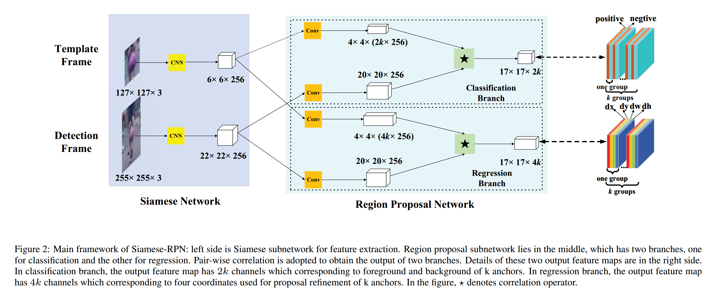
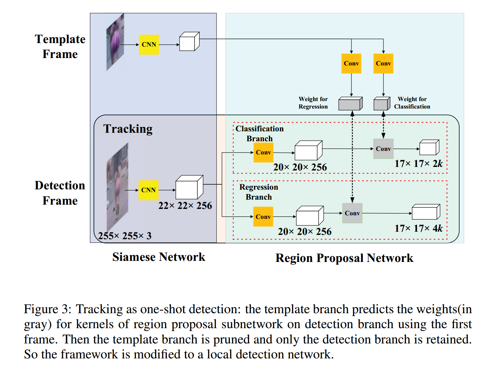
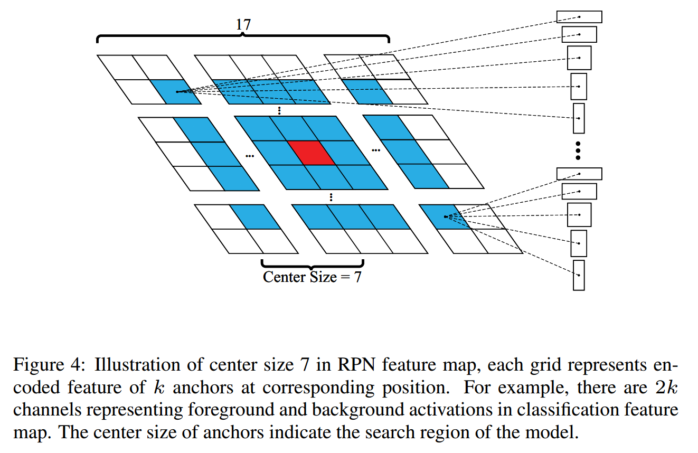
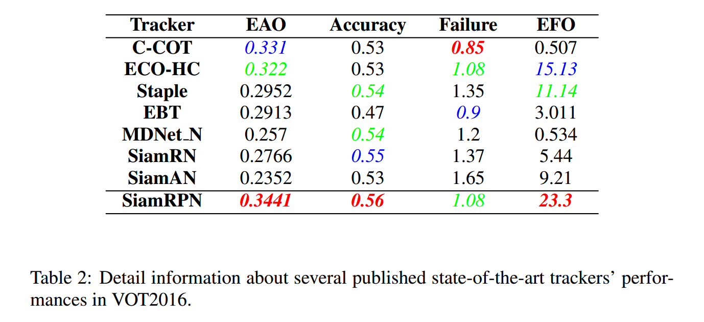
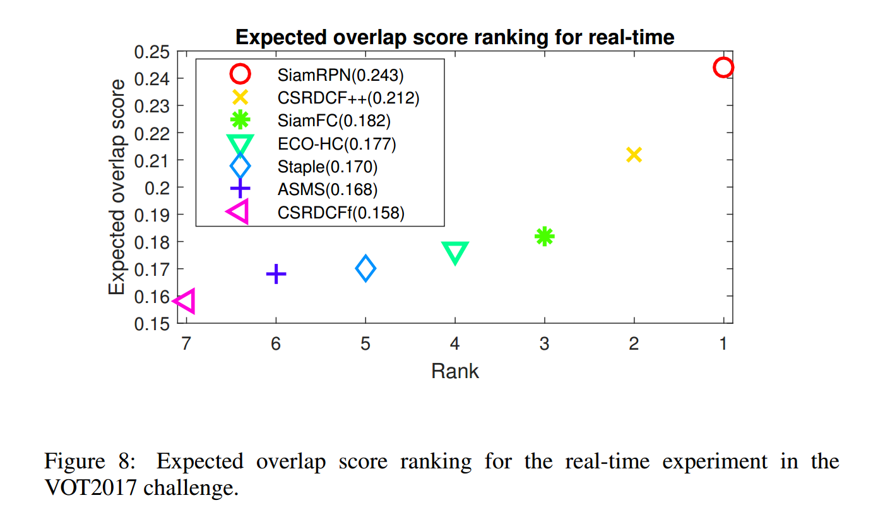
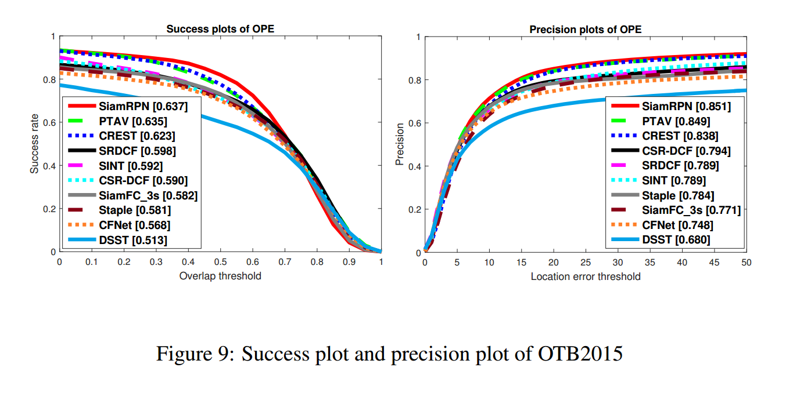
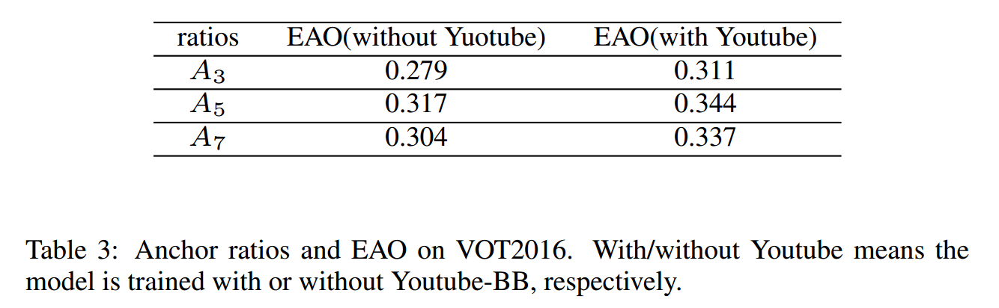

### High Performance Visual Tracking with Siamese Region Proposal Network

#### Abstract

​		近年来，视觉对象跟踪一直是一个基本主题，许多基于深度学习的跟踪器已经在多个基准上实现了最先进的性能。然而，大多数跟踪器难以在实时速度下获得顶级性能。本文中，我们提出Siamese region proposal network（Siamese-RPN），其在大尺度图像对上端到端地离线训练。具体而言，它包含用于特征提取的Siamese子网络和包含分类分支与回归分支的区域提议网络。在推理阶段，所提出的框架构成局部单发检测任务。我们可以预计算Siamese子网络的模板分支，并将相关层（correlation layer）视为平凡的卷积层，以执行在线跟踪。受益于提议的改进，传统的多尺度测试和在线微调可以被丢弃。Siamese-RPN运行速度为160 FPS，同时在VOT2015、VOT2016和VOT2017实时挑战上获得领先性能。

#### 1. Introduction

​		视觉目标跟踪是多种计算机视觉任务（例如自动驾驶和视频监控）中的基本构建块。由于光照、变形、遮挡和运动引起的外观变化较大，这是一个挑战[37，39]。此外，速度在实际应用中也是非常重要的。

​		现代检测器大致可以分为两个分支。第一个分支是基于_相关滤波（correlation filter）_，其通过利用循环相关的属性并在傅立叶域中执行运算来训练回归器。它可以执行在线跟踪，并同时高效地更新滤波器的权重。原始的版本在傅立叶域上执行，然后在跟踪社区广泛使用。最近，基于相关滤波的方法使用深度特征来提高准确率，但是模型更新期间极大地损害了速度。另一个分支旨在使用非常强壮的深度特征，并且不更新模型。然而，因为不使用描述信息的域，这些方法的性能总不能域基于相关滤波的方法一样好。

​		本文中，我们证明，当采用恰当的设计时，基于离线训练的深度学习跟踪器可以获得与基于相关滤波的最佳方法相当的结果。关键是所提出的Siamese区域提议网络（Siamese-RPN）。它包含一个模板分支和一个检测分支，其以端到端的方式使用大尺度图像对离线训练。受最佳的提议提取方法RPN的启发，我们在**相关特征图上执行提议提取**。与标准的RPN不同，我们使用两个分支的相关特征图进行提议提取。在跟踪任务中，我们没有预定义的类，因此我们需要模板分支将目标的外观信息编码到RPN特征图中，从而从背景中辨别前景。

​		对于推理，我们将其视为局部one-shot检测框架，其中第一帧中的边界框为仅有的示例。我们将模板分支重新解释为参数，从而将预测检测核作为元学习器（meta-leaner），例如[2]（《learning feed-forward one-shot learners》）。meta-learner和检测分支仅使用RPN监督端到端训练。在线跟踪期间，在初始帧后，剪掉模板分支以加速训练。据我们所知，本文的工作是第一个将在线跟踪是为one-shot检测的。

​		我们在VOT2015、VOT2016和VOT2017上评估所提出的方法。在这三个任务上，本文的方法都获得领先性能。在没有在线微调的情况，我们能够得到最佳结果主要有两个方面的理由：**第一，我们的方法可以利用图像对离线训练，这可以利用大尺度训练数据，例如Youtube-BB。消融研究证明更多的数据有助于得到更好的性能。第二，我们发现区域提议子网络通常预测准确的提议尺度和纵横比，从而得到紧致的边界框，如图1。**

​		本文的贡献总结为如下三个方面：1）我们提出的Siamese区域提议网络（Siamese-RPN），其针对跟踪任务利用大尺度图像对端到端地离线训练。2）在线跟踪期间，所提出的框架构成局部one-shot检测任务，其可以精炼提议以丢弃昂贵的多尺度测试。3）它在OT2015、VOT2016和VOT2017实时挑战上以160FPS的速度获得领先性能，这证明它在准确率和效率上的优势。

#### 2. Related Works

​		由于本文的主要贡献是将Siamese-RPN重构为局部one-shot检测任务，我们简要回归与我们工作相关的三个方面：基于Siamese网络结构的跟踪器、检测中的RPN和one-shot学习。

##### 2.1. Trackers based on Siamese network structure

​		Siamese网络包含两个分支，它将原始补丁隐式编码到另一个空间，然后将其融合成特定张量以产生单个输出。它通常用于比较隐式嵌入空间两个分支的特征，特别是针对对比任务。最近，Siamese网络在视觉跟踪社区取得极大的关注，因为它们准确率和速度上的平衡。GOTURN将Siamese网络作为特征提取器，并使用全连接层作为融合张量。通过将最后一帧中的预测边界框用作唯一建议，可以将其视为一种回归方法。Re3[12]采用循环网络来获得由模板分支产生的更好特征。受基于相关方法的启发，Siamese-FC首先引入相关层作为融合张量，并极大提高了准确率。与GOTURN的一个提议回归相比，Siamese-FC的成功理由是**密集的监督热图，**其确保了Siamese-FC对于快速移动目标更具鲁棒性。CFNEt将相关滤波添加到模板分支，并使Siamese网络更浅，但更有效。然而，Siamese-FC和CFNet都缺乏边界框回归，并需要多尺度测试，这使得它缺乏优雅。与最佳的相关滤波方法相比，这些实时跟踪器的主要缺点是它们不令人满意的准确率和鲁棒性。

##### 2.2. RPN in detection

​		RPN首先在Faster R-CNN中提出。在RPN之前，传统的提议提取方法非常耗时。例如，Selective Search需要两秒来处理一幅图像。但是，这些方法不足以进行检测。多个锚点的枚举[27]和共享卷积特征使提议提取方法在实现高质量的同时省时。由于前景-背景分类和边界框回归的监督，RPN能够提取更准确的提议。有几种采用RPN的Faster R-CNN变体。R-FCN考虑组件的位置信息，FPN采用特征金字塔网络来提高小型模板检测的性能。与两阶段检测相比，RPN的改进版（例如SSD和YOLO8000）是高效的检测器。由于RPN的速度和极高的性能，它有许多成功的应用，然而它不能在跟踪完整利用。

##### 2.3. One-shot learning

​		最近几年，深度学习领域越来越关注one-shot学习主题。基于贝叶斯统计量的方法和元学习方法是解决这一问题的两个主要方法。在[20]中，目标类由概率模型表示，并且在推理阶段采用贝叶斯估计。换句话说，元学习方法旨在获得学习学习的能力，也就是说，意识到并控制自己的学习。具体来说，在反向传播期间，[1]利用神经网络来预测目标网络的梯度。[30]学习了一个网络，该网络将一个标记的小型支持集和一个未标记的样本映射到其标记。尽管这些基于元学习的方法获得竞争性结果，这些方法通常在分类任务上评估，并它们中非常少的方法能扩展到跟踪任务。Learnet[2]首先利用元学习方法来解决跟踪任务，其从单个示例中预测学生网络的参数。但是，在多个基准测试中，Learnet的性能在基于现代DCF的方法（例如CCOT）中没有竞争力。

#### 3. Siamese-RPN framework

​		本节中，我们详细描述所提出的Siamese-RPN框架。如图2所示，所提出的框架包含用于特征提取的Siamese子网络和用于提议生成的区域提议子网络。具体而言，在RPN子网络中有两个分支，一个负责前景-背景分类，另一个用于提议精炼。包含目标对象的图像补丁馈入所提出的框架，并且整个系统端到端地训练。

##### 3.1. Siamese feature extraction subnetwork

​		在Siamese网络中，我们采用没有padding的全卷积网络。令 $L_{\tau}$ 表示平移算子 $(L_\tau x)[u] = x[u - \tau]$，然后移除所有的padding以满足步长为 $k$ 的全卷积定义：

$$h(L_{k\tau}x) = L_{\tau} h(x) \tag{1}$$

这里，我们使用修改的AlexNet[18]，其中移除conv2到conv4的组。

​		Siamese特征提取子网络包含两个分支。**一个称为 _template branch_，其接受历史帧的目标补丁作为输入（表示为 $z$） 。另一个称为 _detection branch_，其接受当前帧的目标补丁作为输入（表示为 $x$）。**两个分支在CNN中共享参数，使得两个补丁通过相同的变换隐式编码，这适合后续的任务。为了方便，我们使用 $\varphi(z)$ 和 $\varphi(x)$ 表示Siamese子网络的输出特征图。

##### 3.2. Region proposal subnetwork

​		区域提议子网络包含逐对的相关部分和监督部分。监督部分有两个分支，一个是前景-背景分类和另一个是提议回归。如果有 $k$ 个锚，网络需要输出 $2k$ 个通道分类和 $4k$ 个通道回归。因此，逐对回归部分首先通过两个卷积层将 $\varphi(z)$ 增加为两个分支 $[\varphi(z)]_{cls}$ 和 $[\varphi(z)]_{reg}$ ，它们通道上分别为 $2k$ 和 $4k$ 倍。通过两个卷积层将$\varphi(x)$ 也分为两个分支 $[\varphi(x)]_{cls}$ 和 $[\varphi(x)]_{reg}$，但是保持通道数不变。以“group”的方式将 $[\varphi(z)]$ 视为 $[\varphi(x)]$ 的相关核，也就是说，$[\varphi(z)]$ 组中的通道数与 $[\varphi(x)]$的整体通道数相同。在分类分支和回归分支上的相关计算为：

$$\begin{align} A_{w \times h \times 2k}^{cls} &= [\varphi(x)]_{cls} \star [\varphi(z)]_{cls} \\ A_{w \times h \times 4k}^{reg} &= [\varphi(x)]_{reg} \star [\varphi(z)]_{reg}\end{align}\tag{2}$$

模板特征图 $[\varphi(z)]_{cls}$ 和 $[\varphi(z)]_{reg}$ 用作核，而 $\star$ 表示卷积操作。如图2所示，$A_{w \times h \times 2k}^{cls}$中的每个点表示为 $(\tilde{w}, \tilde{h}, :)$，包含 $2k$ 个通道向量，其表示相应原始图的每个锚的负类和正类激活。分类分支中采用softmax损失作为监督。相似地，$A_{w \times h \times 4k}^{reg}$ 中的每个点表示为 $(\hat{w}, \hat{h}, :)$，包含 $4k$ 个通道向量，其表示 $dx, dy, dw, dh$ 衡量锚和相应ground truth之间的距离。

​		当使用几个锚训练网络时，我们使用Faster R-CNN中的损失函数。分类损失为交叉熵损失，我们采用具有规范化坐标的 smooth $L_1$ 损失进行回归。令 $A_x, A_y, A_w, A_h$ 表示锚框的中心点和形状，令 $T_x, T_y, T_w, T_h$ 表示ground truth 框的中心点和形状，规范化距离为：

$$\begin{align}\delta[0] &= \frac{T_x - A_x}{A_w},& \delta[1] &= \frac{T_y - A_y}{A_h} \\ \delta[2] &= \ln\frac{T_w}{A_w},& \delta[3] &= \ln\frac{T_h}{A_h}\end{align} \tag{3}$$

然后将它们穿过smooth $L_1$ 损失，其可以写为如下：

$$smooth_{L_1}(x, \sigma) = \begin{cases}0.5 \sigma^2 x^2, & |x| < \frac{1}{\sigma^2} \\ |x| - \frac{1}{2\sigma^2}, & |x| \ge \frac{1}{\sigma^2}\end{cases} \tag{4}$$

最后，我们优化损失函数

$$loss = L_{cls} + \lambda L_{reg} \tag{5}$$

其中 $\lambda$ 为平衡两个部分的超参数。$L_{cls}$ 为交叉熵损失，而$L_{reg}$ 为

$$L_{reg} = \sum_{i=0}^3 smooth_{L_1}(\delta[i], \sigma) \tag{6}$$

##### 3.3. Training phase: End-to-end train Siamese-RPN

​		在训练阶段，从ILSVRC [29]中随机抽取样本对，并从Youtube-BB [25]中连续抽取样本对。从相同视频的两帧中提取模板和检测补丁。在使用ImageNet预训练Siamese子网络后，我们使用SGD端到端训练Siamese-RPN。由于训练回归分支的需要，采用的数据增强包括仿射变换。

​		在跟踪任务中，由于相邻帧中的相同目标没有太大的变化，因此采用比检测任务更少的锚。因此采用不同纵横比和一个尺度的锚，锚的纵横比为 $[0.33, 0.5, 1, 2, 3]$ 。我们所提出的框架中，选择正类和负类训练样本的策略也很重要。这里采用目标检测任务中的标准，我们将IoU与两个阈值$th_{hi}$和$th_{lo}$一起用作测量。正样本定义为与相应的ground truth的 $IoU > th_{hi}$ 的锚。负样本定义为满足 $IoU < th_{lo}$ 的锚。我们将 $th_{lo}$ 设置为 0.3 ，而将 $th_{hi}$ 设置为 0.6 。我们还在每个训练对中限制最多16哥正样本，以及总共64个样本。

#### 4. Tracking as one-shot detection

​		本节中，我们首先将跟踪任务构成为局部one-shot检测任务。然后，对这种解释下的推理阶段进行了详细分析和简化，以加快速度。最后，引入一些特定的类别来使框架适合跟踪任务。

##### 4.1. Formulation

​		我们将one-shot检测视为如[2]的辨别性任务。它的目标时找出使预测器函数 $\psi(x;W)$ 的平均损失最小的参数 $W$ 。它在 $n$ 个样本 $x_i$ 和相应标签 $l_i$ 的数据集上计算：

$$\min_{W} \frac{1}{n} \sum_{i=1}^n \mathcal{L}(\psi(x_i; W), l_i) \tag{7}$$

_One-shot learning_ 旨在从感兴趣的类的单个模板 $z$ 上学习 $W$ 。判别性one-shot学习的挑战是找到一种将类别信息纳入learner（即学习学习）的机制。为了处理这个挑战，我们提出了一种使用元学习过程从单个模板 $z$ 中学习预测变量参数 $W$ 的方法，即将$(z; W')$映射到 $W$ 的前馈函数 $\omega$ 。令 $z_i$ 为一个批中的模板样本，那么问题可以写为：

$$\min_{W'} \frac{1}{n} \mathcal{L}(\psi(x_i; \omega(z_i; W')), l_i) \tag{8}$$

与上面的一样，令 $z$ 表示模板补丁，$x$ 表示检测补丁，函数 $\varphi$ 为Siamese特征提取子网络，函数 $\zeta$ 为区域提议网络，然后one-shot检测任务可以写为：

$$\min_{W} \frac{1}{n} \sum_{i=1}^n \mathcal{L}(\zeta(\varphi(x_i; W); \varphi(z_i; W)), l_i) \tag{9}$$

​		现在，我们可以将Siamese子网络的模板分支重新解释为训练参数来预测局部检测任务的核，其通常为 _学习学习_ 的过程。在这种解释中，模板分支用于将类别信息嵌入到核，而检测分支使用嵌入信息执行检测。在训练阶段时，meta-learner 不需要除了逐对边界框监督的任何其他监督。在推理阶段，除了初始帧外，裁剪Siamese框架，仅留下检测分支，因此产生很高的速度。将第一帧的模板补丁传入模板分支，并预计算检测核，这使得我们可以在其他帧中执行one-shot检测。由于局部检测任务仅基于模板在初始帧上给出的类别信息，因此可以将其视为one-shot检测。

##### 4.2. Inference phase: Perform one-shot detection

​		如4.2节中的公式，我们将模板分支的输出视为局部检测的核。初始帧上的核都是预计算的，并且在整个跟踪时期固定。利用预计算核卷积的特征图，检测分支执行如图3中one-shot检测的在线推理。执行检测分支上的前向传递以获得分类和回归输出，从而获得前 $M$ 个提议。具体而言，在等式（2）定义的符号后，我们将分类和回归特征图表示为点集：

$$A_{w\times h \times 2k} ^{cls} = \{(x_i^{cls}, y_j^{cls}, c_l^{cls})\} \tag{10}$$

其中 $i \in [0, w), j \in [0, h), l \in [0, 2k)$

$$A_{w \times h \times 4k}^{reg} = \{(x_i^{reg}, y_j^{reg}, dx_p^{reg}, dy_p^{reg}, dw_p^{reg}, dh_p^{reg}) \tag{11}$$

其中 $i \in [0, w), j\in[0, h), p\in[0, k)$ 。

​		由于分类特征图中的奇数通道表示正类激活，所以我们收集所有 $A_{w \times h \times 2k}^{cls}$ 中的前 $K$ 个点，其中 $l$ 为奇数，并将点集表示为 $CLS^\ast = \{(x_i^{cls}, y_j^{cls}, c_l^{cls})_{i \in I, j \in J, l \in L}\}$，其中 $I,J,L$为一些索引集。变量 $i$ 和 $j$ 分别编码了对应锚的位置信息，而 $l$ 编码了相应锚的比例，因此我们可以推导相应的锚集为 $ANC^\ast = \{(x_i^{an}, y_j^{an}, w_l^{an}, h_l^{an})_{i\in I, j \in J, l \in L}\}$ 。此外，我们找出 $A_{w \times h \times 4k}^{cls}$ 上 $ANC^{\ast}$ 的激活以得到相应的精炼坐标为 $REG^{\ast} = \{(x_i^{reg}, y_j^{reg}, dx_l^{reg}, dy_l^{reg}, d_w^{reg}, d_h^{reg})_{i \in I, j \in J, l \in L}\}$ 。之后，精炼的前 $K$ 个提议集 $PRO^{\ast} = \{(x_i^{pro}, y_j^{pro}, w_l^{pro}, h_l^{pro})\}$ 可以由如下的等式（12）获得：

$$\begin{align} x_i^{pro} &= x_i^{an} + dx_l^{reg} \ast w_l^{an} \\ y_j^{pro} &= y_j^{an} + dy_l^{reg} \ast h_l^{an} \\ w_l^{pro} &= w_l^{an} \ast d^{dw_l} \\ h_l^{pro} &= h_l^{an} \ast e^{dhl} \end{align} \tag{12}$$ 

在生成前 $K$ 个提议后，我们使用一些提议选择策略来使它们适合跟踪任务，并且我们将在下一节中讨论。

##### 4.3. Proposal selection

​		为了使one-shot检测框架适合跟踪任务，我们提出两种策略来选择提议。

​		第一种提议选择策略是丢弃由远离中心的锚生成的边界框。例如，我们仅保留分类特征图 $A_{w \times h \times 2k}^{cls}$ 上中心 $g \times g$ 的子区域以获得 $g \times g \times k$ 个锚，而不是 $m \times n \times k$ 个锚。因为相邻帧通常没有大的运动，丢弃策略有效地移除异常点。图4为选择目标锚的展示，在分类特征图中，选择的目标锚的距离不会大于 7 。

​		第二种是提议选择策略是，我们使用余弦窗口和尺度变化来重新排列提议的评分，以获得最佳评分。丢弃异常值后，添加余弦窗口以抑制较大的位移，然后添加惩罚以抑制尺寸和比例的较大变化：

$$penalty = e^{k \ast max(\frac{r}{r'}, \frac{r'}{r}) \ast max(\frac{s}{s'}, \frac{s'}{s})} \tag{13}$$

这里，$k$ 为超参数。$r$ 表示提议的宽高的比例，$r'$ 表示最后一帧的宽高比例。$s$ 和 $s'$ 表示提议和最后一帧的整体尺度，其计算如下：

$$(w + p) \times (h + p) = s^2 \tag{14}$$

其中 $w$ 和 $h$ 表示目标的宽和高，$p$ 表示填充，其等于 $\frac{w+h}{2}$ 。这些操作之后，将分类得分和时序乘法相乘后，重新对前 $K$ 个提议排序。之后，使用NMS来得到最终的跟踪边界框。选择最终的边界框后，通过线性插值更新目标大小以保持形状平滑地变化。

#### 5. Experiments

​		在四个挑战性跟踪数据集（VOT2015、VOT2016、VOT2017实时（每个数据包含60个视频）和100个视频的OTB2015）上进行实验。所有跟踪结果均使用报告的结果来确保公平比较。

##### 5.1. Implementation details

​		我们使用ImageNet [28]预训练的经过修改的AlexNet，其中前三个卷积层的参数固定，并且仅对Siamese-RPN中的后两个卷积层进行微调。使用SGD优化等式（5）的损失函数获得这些参数。共计执行50个epoch，在对数空间上，将学习率从 $10^{-2}$ 减小到 $10^{-6}$。通过使用小于100的间隔选择帧来从VID和Youtube-BB上提取图像对，并进一步执行裁剪过程。如果将目标边界框的大小表示为 $(w, h)$ ，我们在历史帧上裁剪大小 $A \times A$ 的模板补丁，其表示如下：

$$(w + p) \times (h + p) = A^2 \tag{15}$$

其中 $p = \frac{w + h}{2}$ 。之后，将它调整到 $127 \times 127$ 。使用这种方式，在当前帧上，以模板补丁的两倍大小裁剪检测补丁，并将其调整为 $255 \times 255$ 。

​		在推理阶段，由于我们将在线跟踪视为one-shot检测任务，所有没有在下你适应问题。我们的实验在Intel i7、12G RAM、 Nvidia GTX 1060上使用PyTorch实现。

##### 5.2. Result on VOT2015

​		VOT2015数据集包含60个序列。它在准确率（跟踪成功时的平均重叠）和鲁棒性（失败次数）方面评估性能。综合性能使用Expected Average Overlap（EAO）评估，其兼顾准确率和鲁棒性。此外，使用规范化速度（normalized speed: EFO）评估速度。

​		根据最新的VOT规则，我们将跟踪器与排名前10位的跟踪器进行了比较（从board中删除MDNet [24]，因为它已使用OTB序列生成的数据进行了训练）。将 Siamese-FC 添加进比较以作为我们的基线。图5展示了Siamese-RPN能够优于VOT2015上的跟踪器，表1列出了跟踪器的细节。如表1所示，Siamese-RPN在EAO、准确率、失败率和EFO方面排名第一。VOT2015报告的所有跟踪器中，仅有少量跟踪器能够实时跟踪，但是它们的期望重叠较低。Siamese-FC是VOT2015上的顶级跟踪器之一，它可以超越实时的帧率跟踪，并获得最佳性能。Siamese-RPN能够以160FPS的速度执行，器几乎是Siamese-FC（86 FPS）的两倍，然而在EAO方法增加了23% 。

##### 5.3. Result on VOT2016

​		VOT2016挑战中，序列与VOT2015一样，但是边界框是重新标注的。性能评估与VOT2015相同。

​		我们比较了VOT2016上的前25个跟踪器。Siamese-RPN在挑战的所有通道上是最优的。图6展示了EAO排名，而表2展示了几种最佳跟踪器的详细信息。

##### 5.4. Result on VOT2017 real-time experiment

​		在VOT2017上，至少10个挑战序列被替换为10个较难的序列。此外，执行了新的实时实验，其中跟踪器需要至少25 FPS的速度处理实时视频流。这意味着，如果跟踪器未能以40ms的速度处理结果，那么评估器将使用最后一帧的边界框作为当前帧的结果。这对几乎所有的最佳跟踪器来说都是一个挑战。没有速度限制下根据EAO排序的钱10个跟踪器在实时实验下获得更低的EAO。

​		图8展示Siamese-RPN与VOT2017中报告的几种实时跟踪器。比较中，根据EAO，Siamese-RPN排名第一。具体而言，它超过第二名CSRDCF++ 14%，超过第三名 Siamese-FC 33% 。

##### 5.5. Result on OTB2015

​		OTB2015包含从常用跟踪序列上收集的100个序列。基于两个度量（准确率和成功图）评估性能。准确率图展示了跟踪结果在目标20个像素范围内的帧的百分比。成功图展示了当阈值从0到1变化时，成功的帧的比例，其中成功帧的意思是它的重叠大于给定的阈值。成功图AUC用于对跟踪算法排序。实验结果见图9。

#### 5.6. Discussion

##### 5.6.1 Data size

​		由于我们的跟踪框架仅需要图像对，而不是连续的视频流，所以我们能够从大尺度稀疏标记的视频上获益。与包含逐帧标注的4000个视频的ILSVRC相比，YoutubeBB包含每30帧标注一次的、超过100000个视频。我们通过逐步从Youtube-BB添加更多数据来训练具有不同数据集大小的Siamese-RPN。

​		图10给出了训练集变化时，Siamese-RPN的跟踪结果。当有更多训练视频时，VOT2015和VOT2016的EAO都保持增长。具体而言，Youtube-BB的引入将VOT2016的EAO从0.317提高到0.344。值得注意的是，性能没有饱和，这意味着使用更多训练数据时，跟踪器的性能会更好。

##### 5.6.2 Anchor Selection

这里，我们讨论锚的两个因素：训练期间的锚比例选择和推理期间的位置选择。

**anchor ratios**   如3.3节所示，我们仅考虑锚锚的不同比例，同时固定锚的尺度，因为相邻两帧中的目标尺度没有太多的变化。尝试三种纵横比：$[0.5, 1, 2], [0.33, 0.5, 1, 2, 3], [0.25, 0.33, 0.5, 1, 2, 3, 4]$ （分别表示为 $A_3，A_5， A_7$）。

​		如表3所示，$A_5$ 的跟踪器比$A_3$表现更好，因为它更易于大宽高比的目标的形状。然而，$A_7$的跟踪器没能提高性能，这我们认为可能是由过拟合引起的。当从Youtube-BB中添加更多训练数据时，$A_7$ 和 $A_5$ 之间的EAO差距从0.013减小到0.007。

**anchor position**  在我们的实验中，中心大小（如4.3节定义）与搜索区域大小相关。我们可以从图4看出，更大的中心大小意味着跟踪器可以选择距中心更大的距离的锚，从而扩大搜索区域。如图11所示，当网络使用Youtube-BB训练时，当中心大小增加时，性能变得越来越好。然而，如果仅使用ILSVRC训练，性能没能如期望的增加，这意味着RPN的辨别能力不足以使用大型搜索区域。