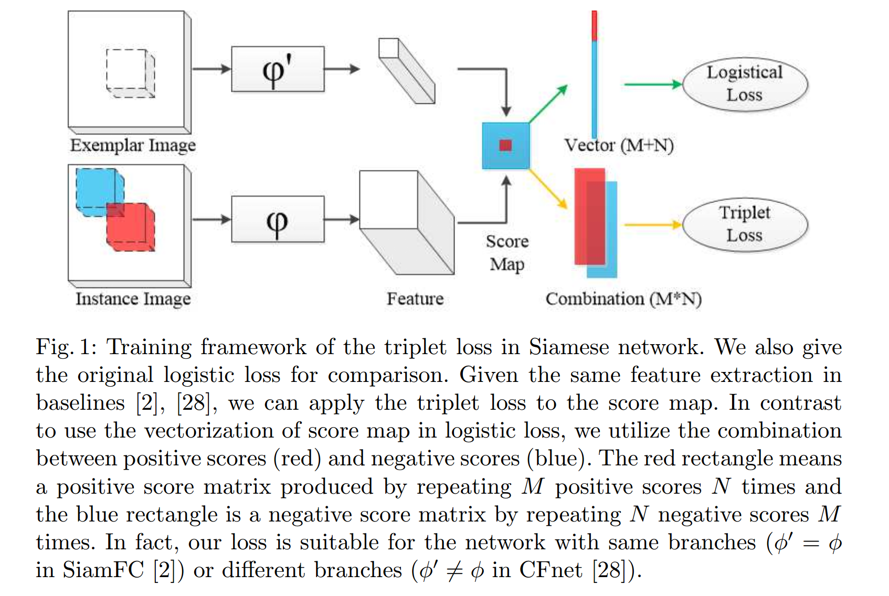
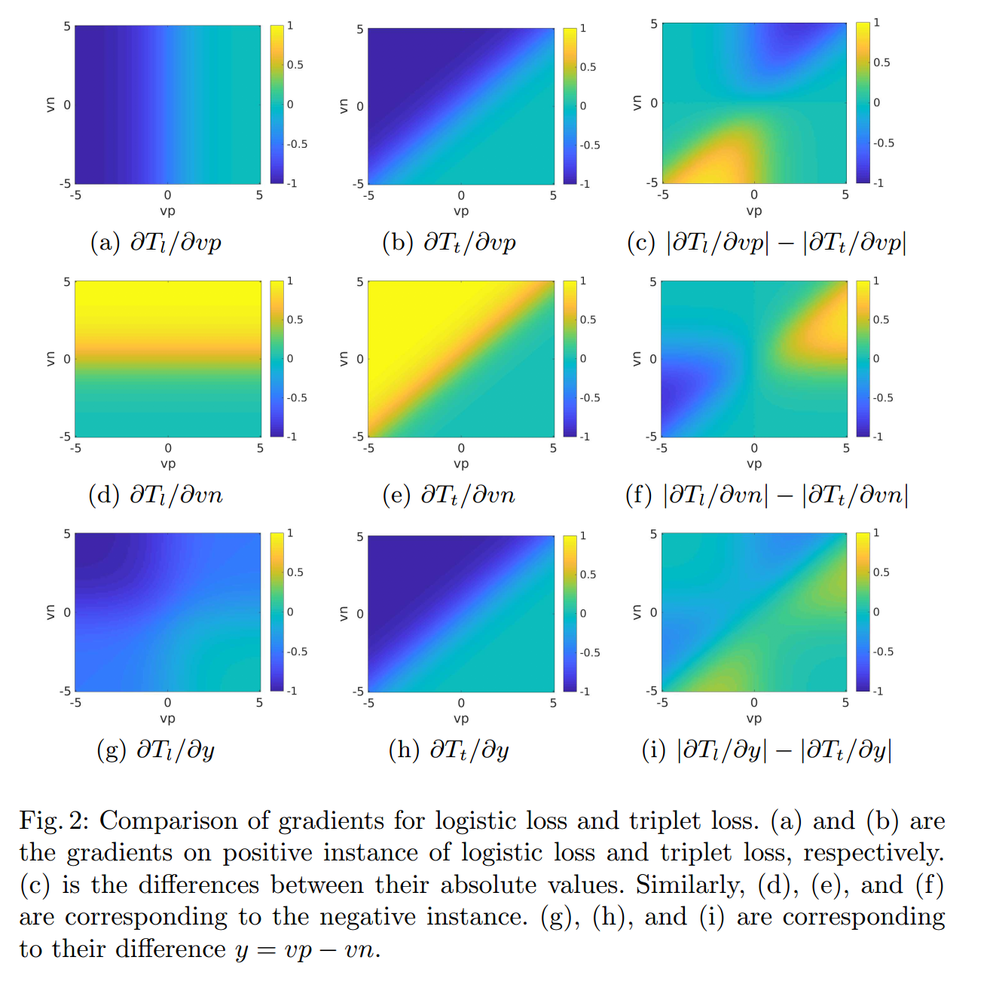
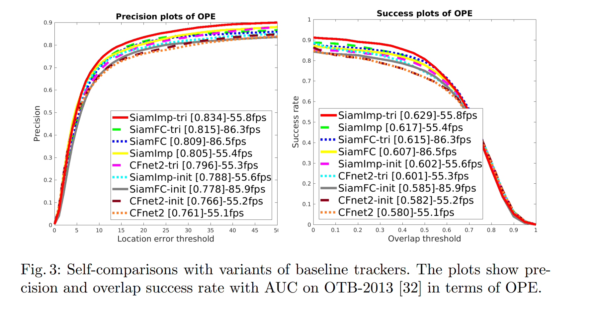
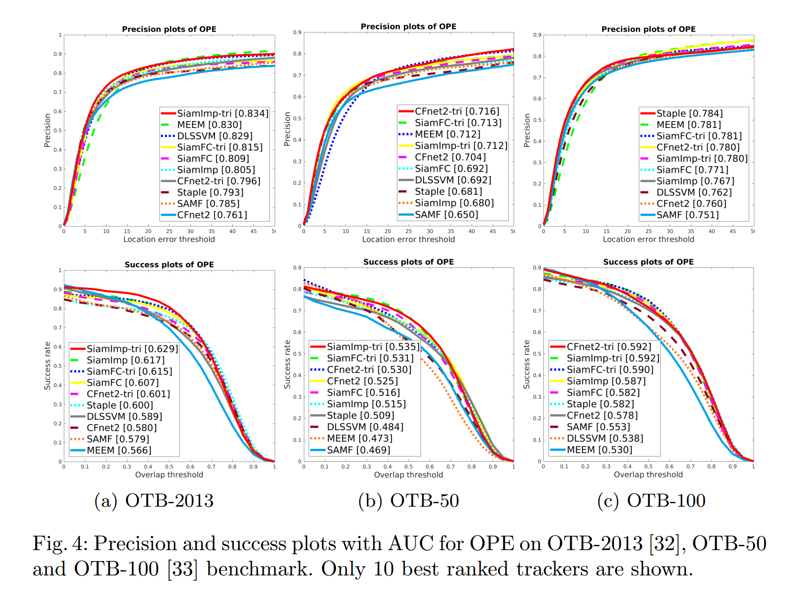
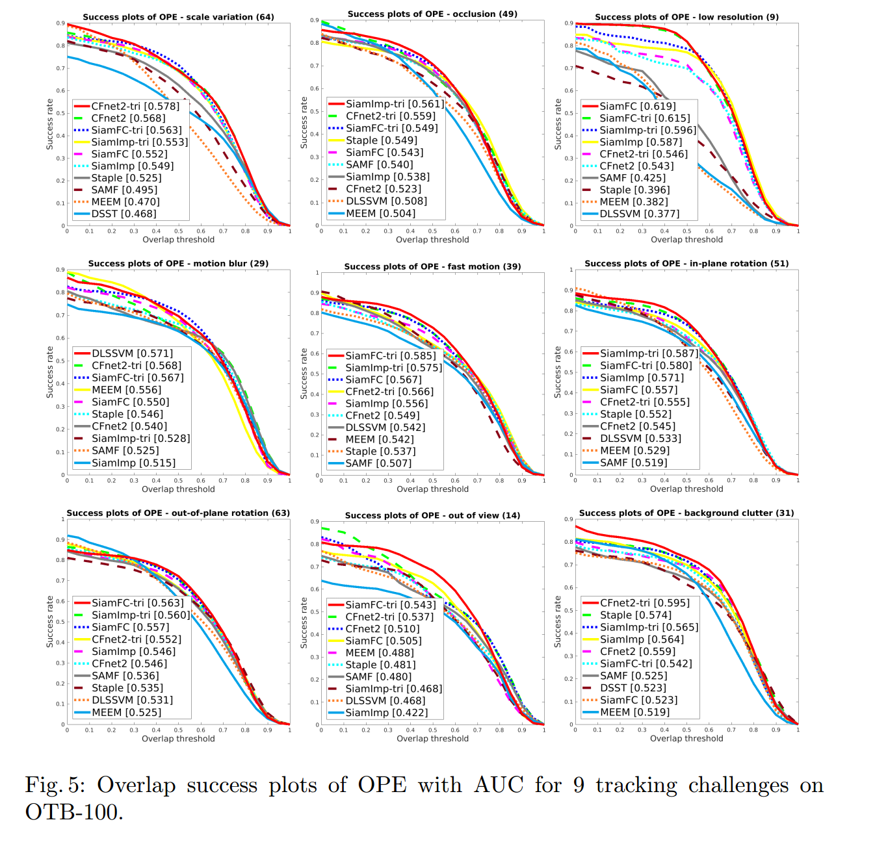
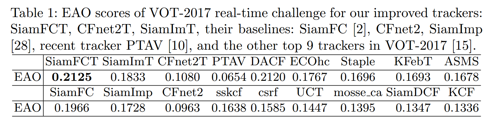

### Triplet Loss in Siamese Network for Object Tracking
**Abstract**  在计算机视觉中的许多应用中，目标跟踪仍然是一个关键且具有挑战性的问题。面对这一挑战，越来越多的研究人员将注意力集中在应用深度学习来获取强大的特征从而提高跟踪精度。本文提出了一种新颖的triplet损失，将其添加到Siamese网络框架中，代替成对损失进行训练，从而提取表示性的深度特征进行目标跟踪。在不添加任何输入的情况下，我们的方法能够利用更多元素进行训练，从而通过结合原始样本来实现更强大的特征。此外，通过梯度和反向传播的组合比较提出了一种理论分析，以证明该方法的有效性。实验中，我们基于Siamese网络将triplet损失应用到3种实时跟踪器。而且，在几种流行的跟踪基准测试中得出的结果表明，我们的变体与基准跟踪器的运行速率几乎相同，并实现了比它们更高的跟踪性能，以及与最新的实时跟踪器相当的准确性。

#### 1. Introduction

​		目标跟踪包含单目标跟踪和多目标跟踪，仍然是许多应用中的一个重要问题，例如自动监控和汽车导航。在单目标跟踪中，强力的特征选择提高检测准确率的关键一步。近年来，这种策略已被广泛用于许多基于相关滤波器（CF）的跟踪器。例如，Henriques等[12]使用梯度直方图（Histogram of Oriented Gradients：HOG）特征而不是[11]中的灰度特征来获得更鲁棒性的跟踪性能。Danelljan等人[5]尝试使用颜色名称（color name）来处理颜色序列。最近，将预训练的网络用于从原始图像提取特征以提高准确率，例如DeepSRDCF、CCOT、MCPF和ECO。除CF跟踪器外，一些基于深度学习的跟踪器关注设计端到端的网络为其跟踪系统获得更强和更稳定的特征。在离线训练阶段，MDNet[20]使用多个域卷积神经网络来提取多个样本中常用特征。然后，训练的网络在不同的序列中通过在线训练逐帧逐帧的精炼。这种跟踪器在OTB-2013上获得优良性能，并在VOT-2015上赢得主要挑战。然而，它的运行速度小于1帧每秒（fps），这远低于处理视频（30 fps）的实时要求。这种较慢的速度时由于在线训练引起的。因此，为了满足实际应用的实时要求，最近的工作（如SiamFC）仍然使用深度网络进行离线训练以获得强力特征，同时，为了加速，尝试避免在线训练。

​		尽管SiamFC利用深度网络来提取强壮特征，但是它没有完整利用输入样本之间的关系。SiamFC与嵌入空间中的相似性学习一样处理跟踪任务。利用离线阶段训练的Siamese网络构造相似度函数。**输入包括包围目标的示例图像和较大的搜索图像，在该图像中可以将具有相同大小示例的滑动窗口视为实例，即候选目标边界框。**根据目标位置和实例之间的距离，当距离小于阈值时，将其标记为正类，否则标记为负类。使用logistic损失最大化正类样本对上相似性得分，并最小化负类样本对上的得分。这种训练方法仅利用样本上逐对关系，而忽略triplet内部的潜在关联：示例、正实例和负实例。

​		本文中，我们尝试通过将triplet loss添加到Siamese框架来充分利用triplet输入来获得更强的特征。对于每个三元组，我们定义一个匹配概率来衡量将正实例分配给示例与负实例进行比较的可能性。然后，在训练期间，我们的目标是最大化所有三元组之间的联合概率。所提出的三元组损失不仅可以进一步挖掘示例、正实例和负实例之间的潜在关系，还能在多数场景中包含更多的元素。这里，我们给出直觉上的示例。**在目标跟踪中，因为第一帧中仅有一个目标边界框，所以示例的数量为1。而正类和负类实例的数量通常多于1。在批中，我们可以将它们分别设置为 $M$ 和 $N$ 。在SiamFC中，最多有 $M + N$ 对元素（$M$ 个正类示例对和 $N$ 个负示例对）用于训练。然而，我们的方法可以产生 $MN$ 个三元对元素（$M$ 哥正类示例对和 $N$ 个负类示例对）。如果$M > 2$ 和 $N > 2$ ，那么 $MN > M + N$ 。这表明我们的方法将获得更多的元素进行训练，从而加强性能。其他场景中，我们也可以获得近似数量的元素。** 这种例子证明我们的损失能够更好地利用样本的组合来获得更强的特征。为了更清楚的解释，三元组损失的训练框架如图1所示。

​		此外，我们给出了原始的logistics损失和所提出的三元组损失之间的理论分析来证明我们方法的有效性。**首先，logistic损失重新设计为可与我们的三元组损失相媲美。其次，我们通过比较多个输入上梯度来分析它们的差异。**我们发现，当正类示例对 $vp$ 的相似性得分不大于负类示例对 $vn$ 的相似性得分时，三元组损失可以提供更大的绝对梯度。这意味着，当网络给出错误的相似性（$vp \le vn$）时，三元组损失给出更强的反馈进行反向传播。这种优势可以提高跟踪准确率，因为如果 $vp \le vn$，那么跟踪系统由于将负实例标记为目标，将产生跟踪误差。

​		实际上，我们的三元组损失适合不同结构的Siamese网络。在实验中，我们将三元组损失应用到三种已有的基于Siamese网络的跟踪器：SiamFC、CFnet2和SiamImp。在著名的跟踪基准OTB-2013上的实验结果证明，具有三元组损失的所有变体优于原始的跟踪器，并获得超越实时要求的相似的较高速度。在三种跟踪基准：OTB-2013、OTB-100和VOT-2017上，与最佳的实时跟踪器相比，我们的跟踪器获得相当的结果。

#### 2. Related Works

**Trackers with Siamese netwok:**  随着最近几年的深度学习的进步，许多经典网络引入目标跟踪，例如Siamese网络。在离线阶段，Tao等人[27]训练Siamese网络学习匹配函数。在在线跟踪阶段，使用学习到的匹配函数来找出与第一帧中的初始目标块最相似的块。Siamese Instance search Tracker（SINT）在OTB-2013上表现很好，但其速度仅有 2 fps 。为了提高运行速度，Bertinetto等人[2]消除全连接层以减少计算量，并为相似性函数应用5个全卷积层来训练端到端的Siamese网络（SiamFC）。然后，直接应用相似性函数来在线跟踪，而没有复杂的微调策略。因此，SiamFC获得超越实时的高帧率，在GPU几乎时86 fps 。另一个相关的跟踪器CFnet将相关滤波器（correlation filter）视为一个网络层来计算Siamese网络生成的卷积特征。实验结果表明，与包含5个卷积层的SiamFC相比，在Siamese网络（CFnet2）中具有CF层的2个卷积层将实现可比的性能和速度（75 fps）。除此之外，CFnet通过修改SiamFC中一些卷积层而提出改进的Siamese网络（SiamImp）。在OTB-2013和OTB-100上的跟踪准确率上，SiamImp优于SiamFC，但其运行速度更低，几乎为 52 fps 。

​		为了证明所提出的三元组损失对于网络结构的一般性，我们将其应用于三个实时跟踪器SiamFC、CFnet2和SiamImp，它们具有相似的Siamese框架，但网络结构不同。

​		**Triplet loss in computer vision:**   Triplet广泛用于计算机视觉中的多种应用，例如人脸识别、图像检索和行人重识别。这里仅列举一些工作作为参考。Schroff等人[23]提出FaceNet用于人脸识别和聚类，这通过将三元损失和深度卷积网络结合来实现。为了保证快速收敛，提出通过选择每个批中最难的样本对（人脸块对）的在线三元挖掘方法。为了进一步挖掘三元组中潜在联系，Song等[26] 通过将批内成对距离的向量提升为成对距离矩阵，应用结构化损失进行训练。Hermans等人[13]系统化的评估了几种经典triplet损失的变体，并提出具有软边界的新颖批硬损失进行行人重识别。他们的方式随机采样一些实例来构建小型数据集作为一个batch，并选择一些最难的实例来计算损失。与大多数现有的具有以上基于边界的三元组损失的方法相反，我们的方法使用基于概率的三元组损失来避免手动选择合适的边距。

#### 3. Revisiting the Siamese network for tracking

​		Bertinetto等人[2]提出具有全卷积层的Siamese网络进行目标跟踪（SiamFC），这将跟踪任务迁移到嵌入空间的示例匹配。跟踪目标块通常在序列的第一帧中给出，并且它可以视为一个示例。其目标是从每帧中找出最相似的块（示例）。如何学习强力的嵌入函数是这种匹配问题的关键步骤。SiamFC的作者使用全卷积的Siamese深度网络来表示这个嵌入函数。在跟踪任务中，设计两个网络分支来处理特别的输入。一个输入是第一帧中的目标边界框，其称为示例输入（exemplar input）。另一个实例输入（instance input）是每个后续帧中的搜索区域，其中包括要匹配的候选补丁。这两个网络分支可以视为不同输入的相同变换 $\phi$，因为他们共享相同的参数。将示例表示为 $z$ ，实例表示为 $x$ ，然后相似性函数定义为

$$f(z,x) = g(\phi(z), \phi(x)), \tag{1}$$

其中 $g$ 为简单的相似度量，例如向量角和互相关（cross correlation）。

​		在SiamFC中，$g$ 为互相关函数，而函数 $f$ 的形式如下：

$$f(z, x) = \phi(z) * \phi(x) + b. \tag{2}$$

​		然后，应用logistic损失来定义训练中的逐对损失函数，其形式如下：

$$L_l(\mathcal{Y}, \mathcal{V}) = \sum_{x_i \in \mathcal{X}} w_i \log(1 + e^{-y_i \cdot v_i}). \tag{3}$$

其中 $\mathcal{Y},\mathcal{V},\mathcal{X}$分别为ground-truth标签、相似性得分和实例输入的几何图形。$y_i \in \{+1, -1\}$ 为单个示例-实例对 $(z, x_i)$ 的ground-truth标签。$v_i$ 为 $(z, x_i)$ 的相似性得分，即 $v_i = f(z, x_i)$ 。$w_i$ 为实例 $x_i$ 的权重，而 $\sum_{x_i \in \mathcal{X}} w_i = 1, w_i > 0, x_i \in \mathcal{X}$ 。在SiamFC中，根据正类实例和负类实例的数量，将平衡权重用于损失。平衡权重的公式定义为：

$$w_i = \begin{cases} \frac{1}{2M}, y_i = 1 \\ \frac{1}{2N}, y_i = -1 \end{cases} \tag{4}$$

其中$M,N$分别为正类实例集 $\mathcal{X}_p$ 和负类实例集 $\mathcal{X}_n$ 的数量，即$M = |\mathcal{X}_p|, N = |\mathcal{X}_n|$ 。（在SiamFC中， $M=13, N=212$。）

#### 4. Siamese network with triplet loss

​		如上所述，我们将SiamFC中[2]实例集 $\mathcal{X}$ 划分为正类集 $\mathcal{X}_p$ 和负类集 $\mathcal{X}_n$。考虑到其他示例输入，我们可以使用SiamFC的输入来构造三元组，即一个元组包含示例、正例和负例。基于这种考虑，我们设计新的三元损失来尽可能挖掘输入之间的潜在关系。由于划分了实例集 $\mathcal{X}$ ，示例-示例对之间的相似性得分集 $\mathcal{V}$ 也可以划分为正类得分集 $\mathcal{V}_p$ 和 负类得分集 $\mathcal{V}_n$ 。然后，我们在这些得分对上直接定义三元损失。为例衡量每个得分对，我们使用匹配概率，即使用softmax函数获得的正类实例分配给示例的概率。这种匹配概率的公式定义如下：

$$prob(vp_i, vn_j) = \frac{e^{vp_i}}{e^{vp_i} + e^{vn_j}}. \tag{5}$$

​		在概率理论解释中，我们的目标是最大化所有得分对之间的联合概率，即所有概率的乘积。使用它的负类对数，我们得到的损失如下：

$$L_t(\mathcal{V}_p, \mathcal{V}_n) = -\frac{1}{MN} \sum_i^M\sum_j^N \log prob(vp_i, vn_j), \tag{6}$$

其中平衡权重 $\frac{1}{MN}$ 用于针对不同数量的实例集将损失保持在相同的尺度。

​		与公式（3）中的原始的逐对logistics损失 $F_l$ 相比，我们的三元损失 $L_t$ 将捕获更多潜在的信息来获得更强壮的表示，这仅需要训练期间的额外计算。首先，我们的三元损失包含更多元素（即单个损失），这可以挖掘示例、正类实例和负类实例之间更潜在的关系。更具体地，$L_l$ 仅包含 $M + N$  个变化的损失，而我们的 $L_t$ 为 $MN$ 个变体加权平均。损失函数中更多的变化意味着更强的表示，因为它可以通过这些变化捕获更多的信息。更详细的分析见下一节。其次，我们将损失分为正分数和负分数，并根据原始分数进行定义。因此，我们使用相同的输入馈人网络。这意味着在训练期间，我们不需要额外的计算即可使用深度网络进行特征提取。唯一增加时间成本是用于计算新损失，而新损失在训练过程中只占时间成本的一小部分。

#### 5. Relationship between logistic loss and triplet loss

​		如上所述，公式（6）中的三元损失包含 $MN$ 个元素，而公式（3）中的logistic损失的数量为 $M + N$ 。因此，我们设法比较公式（3）。为了保持相同的实例输入，在转换过程中，不会导入任何其他实例来增加元素数量。仅有的改变是示例-示例对的使用频率的增加。我们还添加了常量权重来使其成为等价的变换。对于实例 $\mathcal{X}$ 的集合，logistic损失如下：

$$\begin{align} L_l &= \sum_i^M \log(1 + e^{-vp_i}) + \sum_j^N\frac{1}{2N} \log(1 + e^{vn_j}) \\ &=\frac{1}{N}\sum_j^N \sum_i^N \frac{1}{2M} \log(1 + e^{-vp_i}) + \frac{1}{M} \sum_i^M \sum_j^N \frac{1}{2N} \log(1 + e^{vn_j}) \\ &= \frac{1}{MN} \sum_i^M \sum_j^N \frac{1}{2}(\log(1 + e^{-vp_i}) + \log(1+e^{vn_j})). \end{align} \tag{7}$$

这个等式与式（6）相似。我们需要简化式（6）以进一步分析。由式（5）到式（6），我们可以得到如下公式：

​	$$L_t = -\frac{1}{MN} \sum_i^N \sum_j^N \log\frac{e^{vp_i}}{e^{vp_i} + e^{vn_j}} = \frac{1}{MN} \sum_i^M \sum_j^N\log(1 + e^{vn_j - vp_i}). \tag{8}$$

从式（7）到式（8），可以发现主要的差异是和中的项。因此，我们仅需要分析这两项以获得两个损失之间的差异。它们的公式可以表示如下：

$$T_l = \frac{1}{2} (\log(1 + e^{-vp}) + \log(1 + e^{vn})), T_t = \log(1 + e^{vn - vp}). \tag{9}$$

简单起见，我们消除下表 $i$ 和 $j$ 以关注这两项的差异。

##### 5.1 Comparison on the gradients

​		梯度在深度学习训练期间起着重要作用，因为直接涉及反向传播阶段。因此，它们用于指出不同项的特点。首先，我们给定它们的梯度。对于logistic项，梯度推导为：

$$\frac{\partial T_l}{\partial vp} = -\frac{1}{2(1 + e^{vp})}, \frac{\partial T_l}{\partial vn} = \frac{1}{2(1 + e^{-vn})}. \tag{10}$$

​		对于三元损失，该项的梯度为：

$$\frac{\partial T_t}{\partial vp} = -\frac{1}{1 + e^{vp - vn}}, \frac{\partial T_t}{\partial vn} = \frac{1}{1 + e^{vp - vn}}. \tag{11}$$

根据式（10），我们可以发现logistic项的 $\partial T_l / \partial vp$ 和 $\partial T_l/\partial vn$ 仅分别依赖 $vp$ 和 $vn$ ，而我们的 $\partial T_t / \partial vp$ 依赖 $vp$ 和 $vn$ 。这意味着logistic项没有完整利用 $vp$ 和 $vn$ 提供的信息。换句话说，$\partial T_l / \partial vp$ 可以利用 $vn$ 的信息，而 $\partial T_l / \partial vn$  没有利用 $vp$ 的信息。为了进一步分析，使用不同梯度的彩色图的视觉比较如图2。图2（a）和（b）还展示了$\partial T_l / \partial vp$ 和$\partial T_l / \partial vn$ 分别对于 $vn$ 和 $vp$ 是独立的。

​		在跟踪任务中，我们应当保证重要的限制条件 $vp > vn$ 来减少跟踪误差。$vp \le vn$ 意味着正类实例的相似性得分小于或等于负类实例的得分，并且负类实例将被视为导致跟踪失败的目标。因此，训练期间，应当更加关注 $vp < vn$ 。注意，我们将分析两个损失的正实例的梯度。

​		如图2（a）和（b）所示，当 $vp \le vn$ （即左上角区域）时，在这种场景下，梯度 $\partial T_t / \partial vp$ 的绝对值较大（$|\partial T_t / \partial vp| \ge 0.5$）。而当 $vp$ 接近大值大约为5时，即使 $vp < vn$ ，绝对梯度 $|\partial T_l / \partial vp|$ 接近0。这意味着，当 $vp$ 较大时，梯度 $\partial T_l / \partial vp$ 仅提供少量的反馈进行反向传播。然而，我们的梯度 $\partial T_t / \partial vp$ 通过提供更大的绝对梯度，从而给这种场景更多的反馈。对于进一步比较，绝对梯度 $|\partial T_l/\partial vp| - |\partial T_t/\partial vp|$之间的差值的彩色图如图2（c）所示。它指出区域 $0 < vp \le vn$ 内部，我们的绝对梯度大于logistic的绝对梯度，这意味着这一区域中我们的损失可以提供更大的反馈进行反向传播。在 $vp \le vn$ 的剩余区域的大多数中，我们的梯度与logistic梯度近似相等。其次，负实例的梯度的比较见图2（d）、（e）和（f）。相似地，我们的梯度在区域 $vp \le vn$ 上给出了充分的梯度，而在 $vp \le vn < 0$ 上logistic梯度提供更少的反馈。为了直接比较两个变量 $vp$ 和 $vn$ ，我们观察 $y = vp - vn$ 上的导数。容易得出 $\partial T_l / \partial y = \partial T_l / \partial vp - \partial T_l / \partial vn$ 和 $\partial T_t / \partial y = \partial T_t / \partial vp$ 。如图2（g）所示，logistic损失的梯度依赖 $vp$ 和 $vn$ ，这与三元损失相似。这种比较更直观。图2（i）展示了在区域 $vp \le vn$ 中，我们的绝对梯度大于logistic损失。意味着在这一区域中，我们能够提供更好的反馈。总之，当相似得分违反限制 $vp > vn$ ， 我们的损失可以给出更合适的梯度反馈进行反向传播，然而logistic损失的梯度在极端条件下会爆炸，例如当 $vp \rarr 5$ 时， $\partial T_l / \partial vp \rarr 0$ 。

#### 6. Experimental results

​		本节中，我们给出在几种流行的跟踪基准（包括OTB-2013、OTB-100和VOT-2017）的实验结果。

##### 6.1. Implementation details

**Baseline trackers.**  首先，我们介绍了三种上述的基线跟踪器：SiamFC、CFnet2和SiamImp。我们选择[2]中的三个尺度作为基线跟踪器（表示为SiamFC），因为这个版本比5个尺度的版本快，并且性能略微有点低。在[28]中，提出了许多CFnet的变体进行实验比较。2个卷积层的版本（CFnet2）获得高速度，并且比最佳版本略低的性能。因此，选择这个版本作为CFnet结构的代表。本文提出一种改进的Siamese网络（SiamImp）作为基线，它通过减小SiamFC的总步长和最终CNN的输出通道数来实现。除了训练损失，训练方法和训练数据集与[2,28]相似。

​		**Training.**  使用深度学习工具箱MatConvNet，通过利用SGD最小化损失来训练共享网络的参数。共享网络的初始权重设置为SiamFC和CFnet中的预训练模型。从数据集ILSVRC15中随机采样53200对作为训练epoch，并执行10个epoch训练。在每个epoch中选择10%的对作为验证集。然后，我们根据验证集上距离的最小平均误差（在[2]中表示），在每个epoch结束时从训练的模型中决定用于测试的最终网络。使用大小为 8 的mini-batch来估计每次迭代中的梯度，并且学习从 $10^{-4}$ 到 $10^{-5}$ 成几何衰减。为了在基准测试中处理[2,28]中的灰度视频，对于SiamFC，在训练期间将 25% 的对转换为灰度图。对于CFnet2和SiamImp，利用灰度对来训练灰度网络来处理灰度视频。相似地，使用所有的彩色对来训练彩色网络。

​		**Tracking.**   在跟踪阶段，我们仅使用由三元损失训练的模型替换预训练的网络。在线跟踪的其他方面（如跟踪方法和超参数设置）与原始论文相似。更具体地说，我们的变体：SiamFC-tri、CFnet2-tri和SiamImp-tri在OTB-2013上分别获得86.3fps、55.3fps和55.8fps的速度。对应的基线跟踪器运行速度分别为 86.5fps、55.1fps和55.4fps。我们的机器为NVIDIA GeForce 1080和3.4 GHz的Intel Core i7-6700，软件平台为Matlab 2017a + CUDA 8.0 + cudnn v7.0.5 。

##### 6.2. Tracking Benchmarks

​		我们改进的跟踪器在OTB-2013、OTB-50、OTB-100和VOT-2017上评估。

​		OTB-2013基准提出几种度量方法在51个视频序列上评估跟踪器。OTB-100包含100个序列，它们是OTB-2013上的扩展，其中选择50个序列作为小型的基准测试，表示为 OTB-50 。本文中，使用重叠成功率（overlap success rate）和距离精度度量（distance precision metrics）在OTB-2013、OTB-50和OTB-100上评估跟踪器。重叠成功率衡量ground truth 和预测边界框的IoU。成功图显示其IoU分数大于给定阈值的边界框的比例。我们根据Area Under Curve（AUC）中来使用重叠成功率来排序跟踪器。精度度量是指与ground truth相距某个阈值距离内的帧位置的百分比。所有跟踪器的阈值距离设置为20。VOT-2017为Visual Object Tracking 的2017版，其评估短期跟踪性能。在这一挑战中，跟踪器从失败的案例开始，其中预测边界框和ground truth之间没有重叠。VOT-2017通过用10个更具挑战性的视频替换了10个易于跟踪的序列，更新了VOT-2016 [16]中的序列。提出了一种新的实时挑战，以在实时速度的限制下评估跟踪器，即跟踪器应以高于或等于视频帧速率的频率更新每个帧的跟踪结果。如果在跟踪器响应之前有新帧可用，则将最后更新的边界框假定为可用帧上报告的跟踪器输出。对于此数据集，我们根据预期平均重叠（Expected Average Overlap：EAO）评估了实时挑战下的跟踪性能。EAOEAO是精度（与ground truth的重叠）和鲁棒性（失败率）的原则组合[15]。

##### 6.3. Experiments on baseline trackers

​		为了验证三元损失的有效性，我们将基线跟踪器（SiamFC、CFnet2和SiamImp）与它们的不同变体（SiamFC-init、CFnet2-init、SiamImp-init、SiamFC-tri、CFnet2-tri和SiamImp-tri）比较。后缀“init”表示变体是使用原始的预训练模型初始化，并且使用原始的logistic损失与上述超参数再训练10个epoch。相似地，“tri”表示使用相同的初始化和超参数与三元损失训练100个epoch。

​		通过在整个测试序列中运行这些跟踪器并从第一帧中的ground truth位置进行初始化，对这些跟踪器进行OTB-2013评估（一次通过评估（OPE））。如图3所示，使用logistic损失直接训练更多epoch将减少多数跟踪器（除CFnet2）的精度和AUC。这表明logistic损失不能增强通过训练更多的迭代增强原始网络的表示能力。然而，所提出的三元损失可以进一步挖掘原始网络的潜力，从而获得更强的表示。相应结果如图3所示，在所有跟踪器上，它在精度和重叠成功率方面都提高了性能。值得一提的是，具有三元损失的所有变体具有与基线几乎相同的高速度。

##### 6.4. Comparisons on OTB benchmarks

​		在OTB-2013、OTB-50和OTB-100基准测试上，我们比较改进的跟踪器（SiamFC-tri、CFnet2-tri 和 SiamImp-tri）与几种最佳的实时跟踪器（SiamFC、SiamImp、Staple、CN和KCF）。作为参考，还比较了最新的跟踪器：DSST、MEEM、SAMF和DLSSVM。

​		**Overall comparison.**   

​		**Attribute-based Performance Analysis. **

##### 6.5. Results on VOT-2017

**Real-time challenge:**

