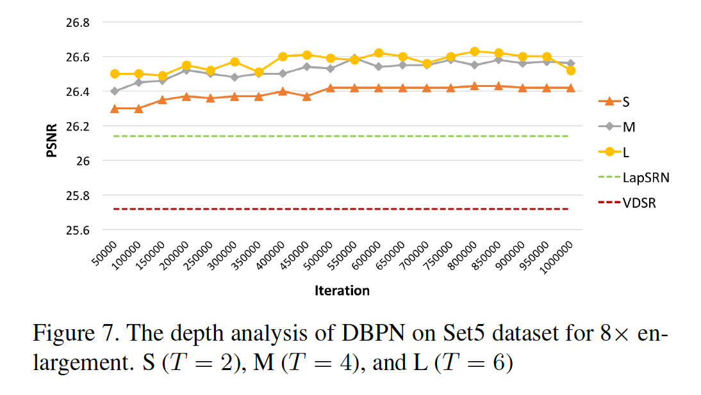
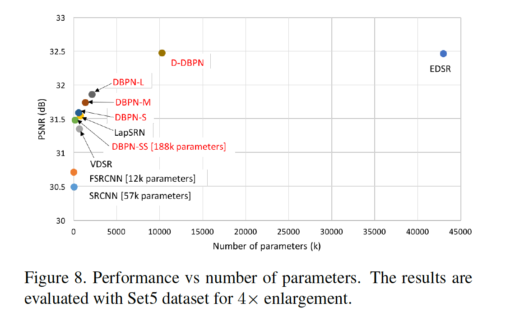
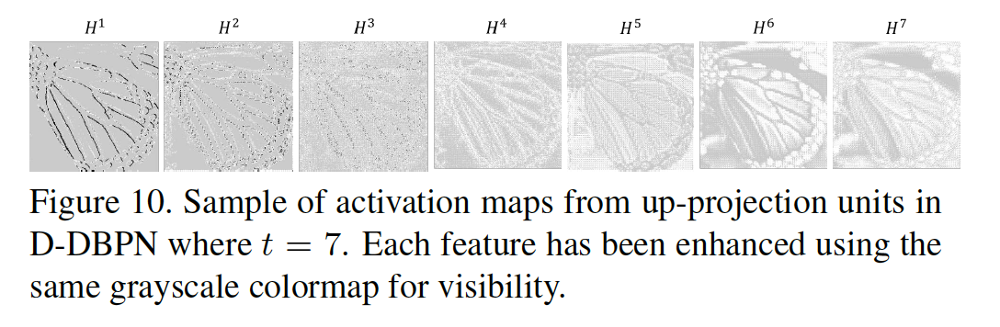

## Deep Back-Projection Networks For Super-Resolution

### 摘要

​		最近所提出的深度超分辨率网络的前馈架构学习低分辨率输入的表示，以及从低分辨率输入到高分辨率输出的非线形映射。然而，这种方法不能完全处理低分辨率和高分辨率图像之间的相互依赖。我们提出Deep Back-Projection Networks（DBPN），该网络利用迭代的上采样和下采样层，为每个阶段的投影误差（projection error）提供错误反馈机制。我们构建相互连接的上采样和下采样阶段，每个阶段代表不同类型的图像质量下降和高分辨率分量。我们证明，将这一思想扩展到允许在上采样和下采样阶段（密集DBPN）进行级联（concatenation），可以使我们重构出进一步提高的超分辨率，并产生出色的结果，尤其是建立大型放大因子（例如跨多个数据集的$8\times$）的最新技术成果。

### 1. 引言

​		视觉深度学习[15、13、5、39、26、33、17]的重要进展最近正在向超分辨率（SR）领域发展[19、29、6、12、20、21、24 ，42]。单图像SR是一个病态逆问题，其中目的是从低分辨率（LR）图像中恢复高分辨率（HR）图像。当前的典型方法是通过学习非线性的LR到HR的映射构建HR图像，其实现为利用深度神经网络[6、7、37、24、21、22、42]。这些网络从LR图像中计算出一系列特征图，最后通过一个或多个上采样层来提高分辨率并最终构建HR图像。与这些纯粹的前向方法相比，人们认为人类视觉系统使用反馈连接来简单地指导任务以获得相关结果[9、23、25]。可能由于缺乏此类反馈而受到阻碍，当前仅具有前馈连接的SR网络难以表示LR与HR的关系，尤其是对于较大的缩放因子。

​		另一方面，早期的SR算法之一，迭代后向投影（iterative back-projection）[18]有效地使用了反馈连接。迭代计算重建误差，然后将其融合回去以调整HR图像强度。尽管已被证明可以改善图像质量，但结果仍然受到振铃效应和棋盘效应的影响[4]。此外，这种方法对诸如迭代次数和模糊算子的参数选择很敏感，从而导致结果中的变化性。

​		受[18]的启发，我们基于迭代上采样和下采样的思想构建端到端的可训练架构：Deep Back-Projection Networks（DBPN）。我们的网络成功的使用大尺度放大因子，如图1所示。我们的工作提供如下贡献：

（1）**Error feedback**	我们提出了一种用于SR的迭代误差反馈机制，该机制可计算上下投影误差，从而指导重建以获得更好的结果。这里，投影误差用于表征或约束早期层中的特征。 详细说明请参见第3节。

（2）**Mutually connected up- and down-sampling stages**	前馈体系结构（被视为单向映射）仅将输入的丰富表示映射到输出空间。由于LR空间中可用的特征有限，这种方法无法映射LR和HR图像，尤其是在较大的放大尺度中。因此，我们的网络不仅关注使用上采样层生成HR特征变体，而且还关注使用下采样层将它映射回LR空间。这种连接如图2（d）所示，在上（蓝框）和下采样（金框）阶段之间交替，代表了LR和HR图像的相互关系。

（3）**Deep concatenation**	我们的网络表示不同类型的图像衰退和HR分量。这种特征使网络能够使用来自所有上采样步骤的HR特征图的深层级联来重建HR图像。与其他网络不同，我们的重建直接直接使用不同类型的LR到HR特征，二没有将它们穿过采样层，如图2（d）的红色箭头。

（4）**Improvement with dense connection**	我们通过在每个上、下采样阶段的密集连接[15]来提高网络的准确性，以鼓励特征复用。

### 2. 相关工作

#### 2.1. 使用深度网络的图像超分辨率

​		Deep Networks SR可以大致分为四种类型，如图2所示。

​		（a）**Predefined upsampling** 通常使用插值作为上采样算子来产生中间分辨率（middle resolution：MR）图像。这种模式最早是由SRCNN [6]提出的，用于学习具有简单卷积层的MR到HR非线性映射。后来，改进的网络利用残差学习[21、42]和递归层[22]。但是，这种方法可能产生来自MR图像新噪声。

​		（b）**Single upsampling**提供简单而有效的方式来增加空间分辨率。这种方法由FSRCNN[7]和ESPCN[37]提出。这些方法已被证明有效地提高了空间分辨率并替代了预定义的算子。但是，由于网络的有限能力，它们不能学习复杂的映射。NTIRE2017的优胜者EDSR属于这一类型。但是，它在每层中需要大量滤波器，和很长的训练时间，作者声称需要大约8天。这些问题为建立更轻巧的网络提供了机会，这些网络可以更好地维持HR分量。

​		（c）**Progressive upsampling** 在LapSRN中被提出。它在一个前馈网络中逐步重建具有不同尺度的多个SR图像。为了简化起见，我们可以说此网络是仅依赖有限的LR特征的单个上采样网络的堆叠。由于这个事实，即使对于我们的浅层网络，LapSRN的性能也要好，尤其是大尺幅因子（例如实验结果中的$8\times$）。

​		（d）**Iterative up and downsampling** 由我们提出。我们专注于增加不同深度的SR特征的采样率，并分配任务以计算每个阶段的重建误差。这种模式使网络可以通过学习各种上采样和下采样算子，同时生成更深的特征来保留HR分量。

#### 2.2.  Feedback networks

​		反馈网络不是一步一步学习输入到目标空间的非线性映射，而是将预测过程分为多个步骤，从而使模型具有自校正过程。反馈程序已在各种计算任务中实现[3、34、46、28、48、38、31]。

​		在人体姿态估计背景中，Carreira等[3] 通过迭代估计并将修正应用于当前估计，提出了迭代误差反馈。PredNet [31]是一种无监督的递归网络，可通过将预测递归地反馈到模型中来对未来帧进行预测编码。对于图像分割，Li等[28]学习隐式的形状先验，并使用它们来改进预测。但是，据我们所知，反馈过程没有在SR中实现。

#### 2.3. 对抗训练

​		对抗训练（例如使用GAN）已用于多种图像重建问题[27、36、33、5、19]。对于SR任务，Jonson等[19]根据从预训练网络中提取的高级特征引入感知损失（perceptual losss）。Ledig等[27]提出SRGAN，其市委单上采样方法。它提出了一种自然图像流形，该流形能够通过基于从VGG19 [40]和SRResNet提取的特征图之间的欧氏距离具体公式化损失函数来创建逼真的图像。

​		我们的网络可以利用对抗损失扩展为生成器网络。但是，我们仅使用目标函数（例如MSE）来优化我们的网络。因此，我们可以将DBPN与SRResNet进行比较，而不是通过对抗性损失来训练DBPN，SRResNet也通过MSE进行了优化。

#### 2.4. Back-projection

​		Back-projection[18]是有效的迭代过程，可最大程度地减少重构误差。先前的研究已经证明了back-projection的有效性[50、11、8、45]。最初，back-projection设计用于多LR输入的情况。但是，仅给定一个LR输入图像，可以通过使用多个上采样算子对LR图像进行上采样并迭代计算重构误差来获得更新过程[4]。Timofte等[45]提到back-projection可以改进SR图像的质量。Zhao等[50]提出通过迭代投影过程来精炼高频纹理细节。但是，产生最优解决方案的初始化仍是未知的。先前的大多数研究都涉及恒定且难以学习的预定义参数，例如模糊算子和迭代次数。

​		为了扩展该算法，我们开发了一种端到端的可训练架构，该架构专注于使用相互连接的上、下采样阶段来指导SR任务，以学习LR和HR图像的非线性关系。通过创建迭代的上下投影单元（其中投影单元声称HR特征）构建的HR和LR图像之间的相互关系，然后down-projection单元将其映射回LR空间，如图2（d）所示。这种方案保证网络通过学习不同的上下采样算子维持HR分量，并生成更深的特征来构建大量LR和HR特征。

### 3. Deep Back-Projection Networks

​		令$I^h$和$I^l$分别为$M\times N$和$M' \times N'$的HR和LR图像，其中$M' < M$，$N' < N$。我们所提出的DBPN架构的主要构建块为投影单元，其被训练（作为SR系统中端到端训练的一部分）来将LR特征图映射到HR特征图（up-projection），或者将HR特征图映射到LR特征图（down-projection）。

#### 3.1. Projection units

​		up-projection单元定义如下：

$$\begin{align}&\mbox{scale up:} &H_0^t &=(L^{t-1} \ast p_t)\uparrow_s, \tag{1} \\ &\mbox{scale down:} &L_0^t&=(H_0^t \ast g_t) \downarrow_s,\tag{2} \\ &\mbox{residual:} &e_t^l &= L_0^t - L^{t-1}, \tag{3}\\&\mbox{scale residual up:} &H_1^t &= (e_t^l \ast q_t)\uparrow_s,\tag{4} \\ &\mbox{output feature map:} &H^t &= H_0^t + H_1^t \tag{5}\end{align}$$

其中$\ast$为空间卷积算子，$\uparrow_s$和$\downarrow_s$分别为尺度因子为$s$的上下采样算子，$p_t$、$g_t$、$q_t$为阶段$t$中反卷积层。

​		这种投影单元采用之前计算的LR特征图$L^{t-1}$作为输入，并将它映射到（中间）HR特征图$H_0^t$；然后它尝试将$H_0^t$映射回LR图$L_0^t$（“back-project”）。观察到的LR图$L^{t-1}$与重建的$L_0^t$之间的残差（差值）$e_t^l$再次被映射到HR，产生新的中间（残差）图$H_1^t$；通过将两个中间特征图相加获得最终的单元输出——HR图$H^t$。这个步骤如图3的上部分。

​		down-projection单元的定义非常相似，但是现在他的工作是将它的输入HR图$H^t$映射到LR图$L^t$，如图3的下部分所示。

$$\begin{align}&\mbox{scale down:} &L_0^t &=(H^t \ast g_t')\downarrow_s, \tag{6} \\ &\mbox{scale up:} &H_0^t&=(L_0^t \ast p_t') \uparrow_s,\tag{7} \\ &\mbox{residual:} &e_t^h &= H_0^t - H^t, \tag{8}\\&\mbox{scale residual down:} &L_1^t &= (e_t^h \ast g_t')\downarrow_s,\tag{9} \\ &\mbox{output feature map:} &L^t &= L_0^t + L_1^t \tag{10}\end{align}$$

​		我们将投影单元组成一系列阶段（stage），在$H$和$L$之间交替进行。这些投影单元可以理解为自纠正（self-correcting）过程，它将投影误差馈入采样层，并通过反馈投影误差迭代地修改解。

​		投影单元使用大尺寸的滤波器，例如$8 \times 8$和$12 \times 12$。在其他已有的网络中，因为大尺寸滤波器会减慢收敛速度，并且可能产生次优结果，所以避免大尺寸滤波器的使用。但是，我们的投影单元的迭代利用使网络能够抑制此限制，即使在浅层网络中也能在较大的放大尺度下实现更好的性能。

#### 3.2. Dense projection units

​		DenseNets中的密集中间层连接模式已被证明可以缓解梯度消失问题、产生改善的特征和鼓励特征重用。受此启发，我们提出通过在投影单元中引入密集连接来改进DBPN，产生Dense DBPN（D-DBPN）。

​		与原始的DenseNets不同，我们避免使用dropout和batch-norm，它们不适合SR，因为它们消除了特征的范围灵活性[30]。相反，在进入投影单元之前，我们使用$1 \times 1$卷积层作为特征池化和降维。

​		在D-DBPN中，每个单元的输入为前面所有单元输出的拼接。令$L^{\tilde{t}}$和$H^{\tilde{t}}$分别为密集上下投影单元的输入。它们使用$conv(1,n_R)$生成，$conv(1,n_R)$用于融合每个单元之前的所有输出，如图4所示。这种改进确保高效地生成特征图，如实验结果所示。

#### 3.3. 网络架构

​		所提出的D-DBPN如图5所示。它可以分为三个部分：初始特征提取、投影和重建。这里，令$conv(f,n)$为卷积层，其中$f$为滤波器大小，$n$为滤波器数量。

1. **初始特征提取**	我们使用$conv(3,n_0)$从输入构建初始LR特征图。然后在进入投影步骤之前，使用$conv(1,n_R)$将维度从$n_0$减小到$n_R$，其中$n_0$为初始LR特征提取中使用的滤波器数，$n_R$为每个投影单元中使用的滤波器数。
2. **Back-projection stages**   初始特征提取之后是一组投影单元，在LR和HR特征图$H^t$、$L^t$的构造之间交替； 每个单元都可以访问以前所有单元的输出。
3. **Reconstruction**    最后，目标HR图像被重建为$I^{sr} = f_{Rec}([H^1,H2,\cdots,H^t])$，其中$f_{Rec}$使用$conv(3,3)$作为重建，并且$[H^1,H^2,\cdots,H^t]$为每个up-projection单元产生的特征图的拼接。

​    由于这些构建块的定义，我们的网络架构是模块化的。我们可以轻松地定义和训练具有不同阶段数的网络，从而控制深度。对于具有$T$个阶段的网络，我们具有初始提取阶段（2层），然后是$T$个上投影单元和$T-1$个下投影单元，每个都有3层，然后进行重建（再一层）。但是，对于密集网络，我们在每个投影单元中添加$conv(1,n_R)$，但前三个单元除外。

### 4. 实验结果

#### 4.1. 实现和训练细节

​		在所提出的网络中，投影单元中的滤波器尺寸相对于缩放因子是不同的。对于$2 \times$放大，我们使用具有两个步幅和两个填充的$6\times6$卷积层。然后，对于$4\times$放大，使用步长为4和填充为2的$8 \times 8$卷积层。最后，对于$8\times$的放大，使用步长为8和填充为2的$12 \times 12$的卷积层。

​		我们基于[14]初始化权重。这里，通过$\sqrt{2/n_l}$计算std，其中$n_l = f_t^2 n_t$，$f_t$为滤波器大小，$n_t$为滤波器数量。例如，当$f_t=3$和$n_t=8$时，std为0.111。所有卷积和反卷积层后时参数化的修正线性单元（PReLU）。

​		我们使用来自DIV2K[43]、FLickr[30]和ImageNet数据集[35]来训练所有网络，而没有进行数据增强。为了产生LR图像，我们使用Bicubic将HR图像缩小到特定尺度因子。我们使用$32 \times 32$的LR图像，batch大小为20。所有层的学习率初始化为$1e-4$，每$5 \times 10^5$次迭代减小10倍，共训练$10^6$次迭代。对于优化，我们使用动量为0.9的Adam，权重衰减为$1e-4$。所有实验均在NVIDIA TITAN X GPU上使用Caffe，MATLAB R2017a进行。

#### 4.2. 模型分析

​		**深度分析**	为了证明我们的投影单元的能力，我们自最初的DBPN构建多个网络$S(T=2)$、$M(T=4)$和$L(T=6)$。在特征提取中，我们使用$conv(3,128)$，接着是$conv(1,32)$。然后，我们使用$conv(1,1)$进行重建。输入和输出图像仅为亮度分量。

​		$4\times$放大的结果如图6所示。DBPN优于最佳方法。从我们的浅层网络开始，$S$网络给出比VDSR、DRCN和LapSRN更高的PSNR。$S$网络进使用12个卷积层，滤波器数量比VDSR、DRCN和LapSRN少。在最佳性能中，$S$网络可以获得31.59dB，其比VDSR、DRCN和LapSRN分别好0.24dB、0.06dB和0.5DB。$M$网络表现出性能改进，其比所有四种已有最佳方法（VDSR、DRCN、LapSRN和DRRN）好。在最佳性能中，$M$网络可以获得31.74dB，其分别比VDSR、DRCN、LapSRN和DRRN好0.39dB、0.21dB、0.20dB、0.06dB。总之，$M$网络使用24个卷积层，其深度与LapSRN相同。与DRRN（52个卷积层）相比，$M$网络网络不可否认表现出投影单元的有效性。最后，$L$网络获得31.86dB，比所有其他方法好，其分别比VDSR、DRCN、LapSRN和DRRN好0.51dB、0.33dB、0.32dB、0.18dB。

​		$8\times$放大结果如图7所示。$S$、$M$、$L$网络在8倍放大方面胜过当前的最新技术，这清楚地表明了我们提出的网络在大尺度缩放因子上的有效性。但是，我们发现每个所提出的网络都没有明显的性能提升，尤其是对于$L$和$M$网络而言，两者的差异仅为0.04 dB。

​		**参数量**	我们在图8和9中展示了网络和现有深层网络SR的网络参数的性能和数量之间的权衡。

​		为了减少实时处理的计算量，我们构造了$SS$网络，它是比$S$网络的更轻版本（$T = 2$）。我们进使用$conv(3,64)$+$conv(1,18)$初始化特征提取。但是，在4倍、8倍放大上的结果比SRCNN、FSRCNN和VDSR好。此外，我们的$SS4网络的性能优于VDSR，在4倍和8倍放大时参数分别减少了72％和37％。

​		在4倍放大时，我们的$S$网络的参数量比LapSRN少27%，但PSNR比LapSRN高。最后，在4倍放大时，D-DBPN参数量为EDSR的76%，但PSNR相同。在8倍放大时，D-DBPN参数量为EDSR的47%，但有更好的PSNR。这种证据表明我们的网络有最佳的性能和参数量之间的平衡。

​		**Deep concatenation**	每个投影单元用于通过构建代表HR组件不同细节的特征来分布重建步骤。深度拼接也与$T$的数量（反向投影阶段）密切相关，这表明从投影单元生成的更详细的特征也将提高结果的质量。在图10中，表明每个阶段成功地生成多样特征来重建SR图像。

​		**Dense connection**	我们实现了D-DBPN-L，其为$L$网络的密集连接，其证明密集连接可以在所有情况中改进网络的性能，如表1所示。在4倍放大时，在Set5和Set14中，密集网络D-DBPN-L的性能分别比DBPN-L好0.13dB和0.05dB。在8倍时，差距更大。在Set5和Set14上，D-DBPN-L比DBPN-L分别好0.23dB和0.19dB。

#### 4.3. 与最佳方法的比较

