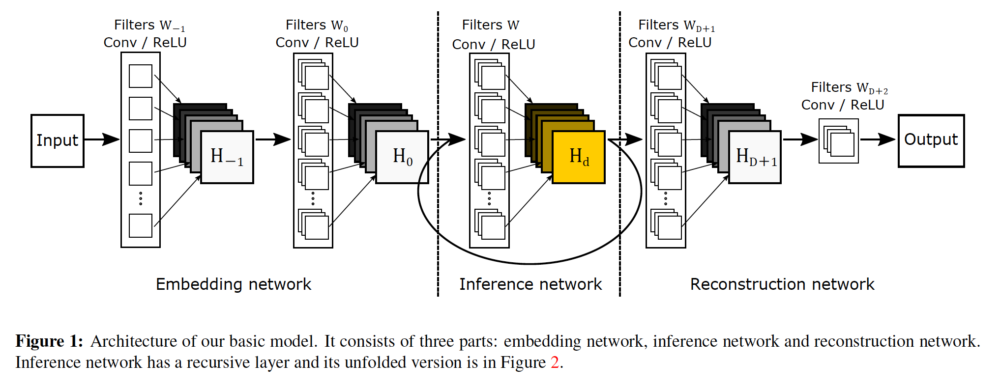
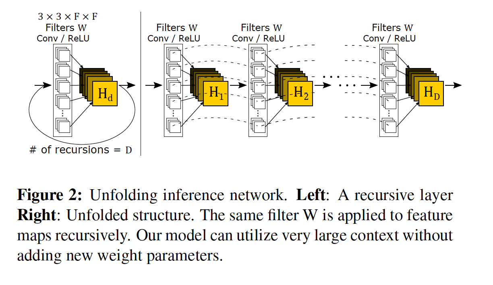
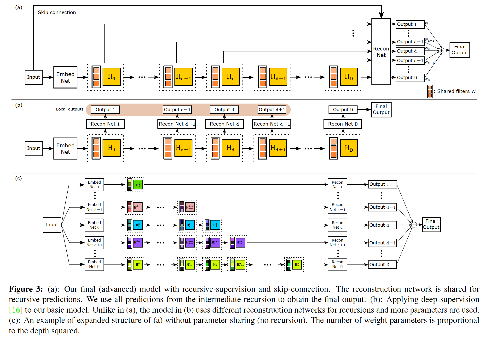
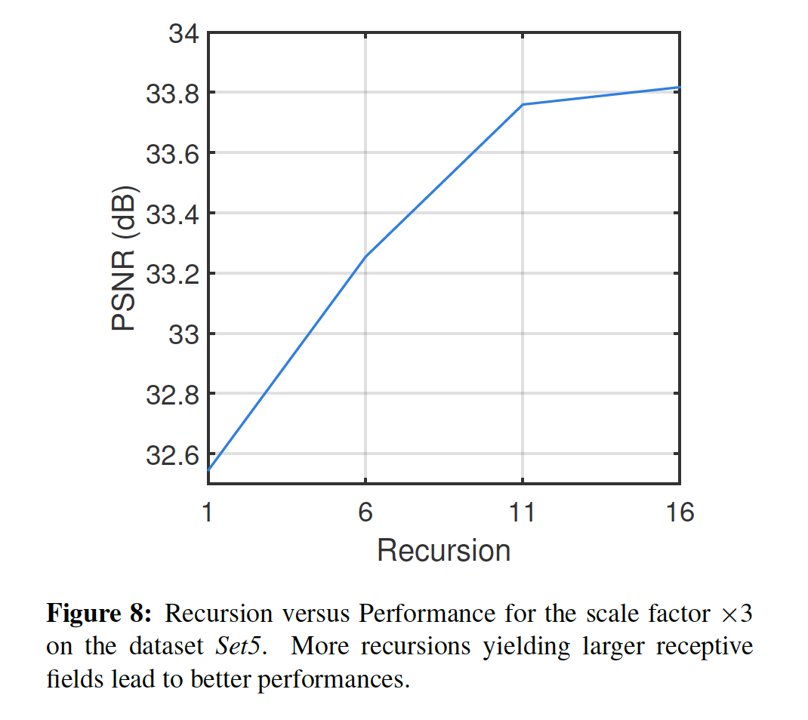
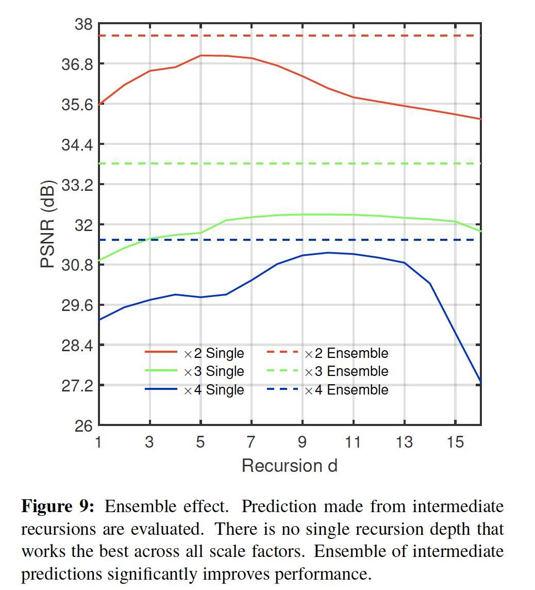
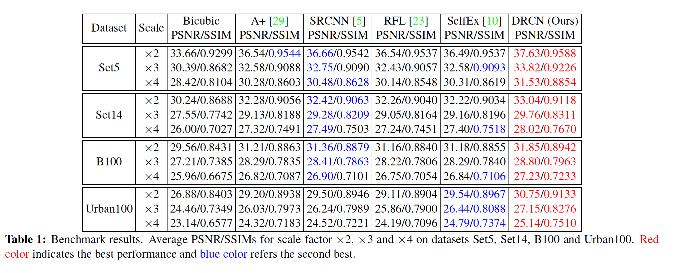
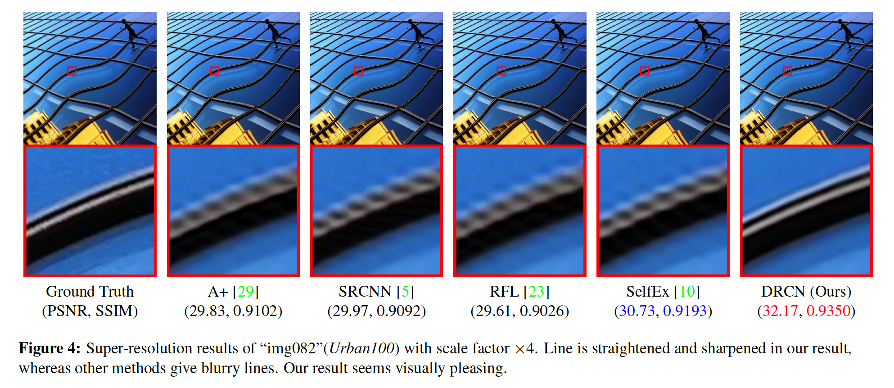
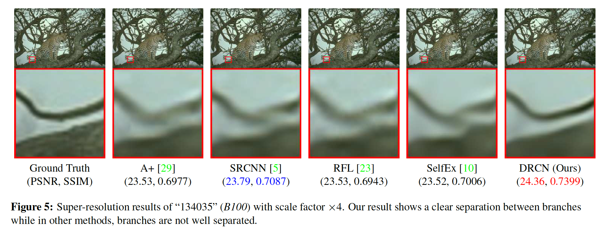
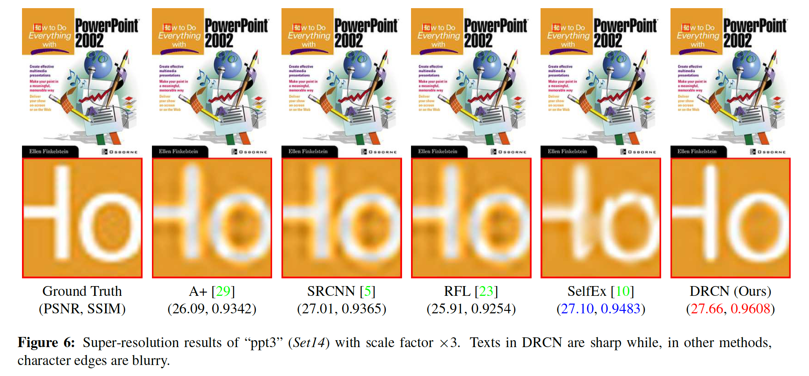
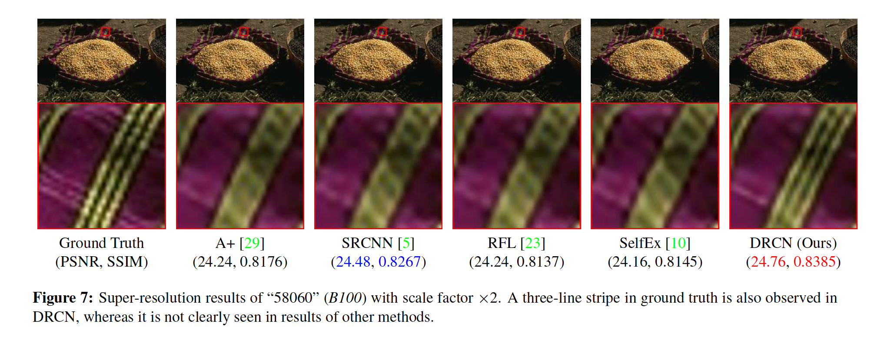

## Deeply-Recursive Convolutional Network for Image Super-Resolution

### 摘要

​		我们提出了一种使用深度递归卷积网络（DRCN）的图像超分辨率方法（SR）。我们的网络具有非常深的递归层（最多16个递归）。递归深度的增加可以提高性能，而无需为其他卷积引入新参数。尽管有优势，但由于存在梯度爆炸/消失，因此使用标准梯度下降方法学习DRCN非常困难。为了减轻训练的难度，我们提出了两个扩展：递归监督和跳过连接。 我们的方法大大优于以前的方法。

### 1. 引言

​		对于图像超分辨率，卷积网络的感受野决定上下文的数量，这种上下文可以用于推理丢失的高频部分。例如，例如，如果在感受野中存在具有平滑边缘的模式，则可以认为该模式被识别并且边缘被适当地锐化。由于SR是一个不适定的逆问题，因此收集和分析更多的相邻像素可能会提供更多有关下采样损失的线索。

​		在各种计算机视觉任务中成功完成的深卷积网络（DCN）通常使用非常大的感受野（ImageNet分类中常见的$224 \times 224$ [13、24]）。在扩大感受野的许多方法中，增加网络深度是一种可能的方式：可以使用滤波器大小大于$1\times1$的卷积（conv.）层或减小中间表示维度的池化（pool.）层。两种方法都有缺点：conv.层引入更多参数，而pool.层通常丢失一些逐像素信息。

​		对于例如超分辨率和去噪的图像恢复问题，图像细节非常重要。因此，用于如此问题的大多数深度学习方法没有使用池化。通过添加新权重层增加的深度基本上引入更多参数。可以引起两个问题。第一，过拟合的可能性更高。现在需要更多数据。第二，模型变得太大而无法存储和检索。

​		为了解决这些问题，我们使用深度递归卷积网络（deeply-recursive convolutional network：DRCN）。DRCN根据需要多次重复应用同一卷积层。参数量没有增加，同时进行更多递归。我们的网络的感受野味$41 \times 41$，这比SRCNN（$13 \times 13$）大。虽然DRCN有良好的属性，我们发现利用广泛采用的SGD优化DRCN不能轻松收敛。这是由于梯度爆炸/消失。利用单个权重层学习像素之间的远程依赖关系非常困难。

​		我们提出两种方法来简化训练难度（图3（a））。第一，所有递归都有监督。每次递归后的特征图用于重建目标高分辨率图像（HR）。重建方法（专用于重建的层）对于所有递归都是相同的。因为每次递归都产生不同HR预测，因此我们结合不同递归层得出的所有预测，以提供更准确的最终预测。第二，使用从输入到重建层的skip-connection。在SR中，低分辨率图像（输入）和高分辨率图像（输出）很大程度上共享相同的信息。但是，在许多前向传递中，输入的精确副本可能会被削弱。我们将输入显式连接到图层以进行输出重建。 当输入和输出高度相关时，这特别有效。

​		**共享**	总之，我们提出了一种本质上是递归的图像超分辨率方法。与仅具有单个递归层的以前的SR方法相比，它利用了很大的上下文。我们通过两种方式改进简单的递归网络：递归监督和跳过连接。 我们的方法展示了通用基准测试中的最新性能。

### 2. 相关工作

#### 2.1. Single-Image Super-Resolution

​		我们使用DRCN来进行单图像的超分辨[11、7、8]。计算机视觉社区已提出许多SR方法。早期方法使用快速插值，但是产生较差的结果。一些更强大的方法利用统计图像先验[27、12]或内部补丁复发[8、10]。最近，复杂的学习方法已被广泛用于建模从LR到HR补丁的映射。从LR到HR图像找到更好的回归函数的方法已经引起人们的注意。这可以通过各种技术实现：邻居嵌入[4、19]、稀疏编码[31、32、28、29]、卷积神经网络（CNN）[5]和随机森林[23]。

​		在最近的一些基于学习的成功中，卷积神经网络（SRCNN）[5]证明了端到端SR方法的可行性。改进SRCNN的一种可能性是简单地尽可能多地堆叠更多的权重层。但是，这会显著增加参数量，并需要更多的数据来防止过拟合。本文中，我们寻求设计一种卷积网络，以有限的能力对长范围像素依赖性进行建模。 我们的网络递归地扩大了接收范围，而没有增加模型容量。

#### 2.2. Recursive Neural Network in Computer Vision

​		适用于时序数据的递归神经网络在对单个静态图像进行操作的算法上使用有限。Socher等人[25] 在层次融合之前，在单独的阶段使用卷积网络首先学习RGB深度数据的特征。 在这些模型中，输入维数是输出维数的两倍，而递归卷积仅应用两次。在用于语义分割的递归卷积神经网络中也发生了类似的降维[22]。 由于SR方法可预测全尺寸图像，因此无法缩小尺寸。

​		在Eigen等[6]中，递归层油相同的输入和输出维度，但是，由于过拟合，递归层产生的性能比单个卷积层差。为了克服过拟合，Liang和Hu[17]使用循环层，将前馈输入带入所有展开的层。他们证明性能最多可提高三个卷积。 其用于对象识别的网络结构与现有的CNN架构相同。

​		在递归或循环层与卷积一起使用的意义上，我们的网络与上述网络相似。我们进一步增加了递归深度，并证明了非常深的递归可以显着提高超分辨率的性能。我们将相同的卷积最多应用16次（之前的最大值是3次）。

### 3. 所提出的方法

#### 3.1. Basic Model

​		我们的第一个模型（图1）包含三个子网络：嵌入、推理和重建网络。嵌入网络用于将给定图像表示为准备进行推理的特征图。接着，推理网络解决这个任务。一旦推理完成，推理网络中的最终的特征图被馈入重建网络以生成输出处图像。

​		**嵌入网络**获取输入图像（灰度或RGB）并将其表示为一组特征图。用于将信息传递到推理网络的中间表示很大程度上取决于推理网络在内部如何在其隐藏层中表示其特征图。学习这种表示形式与学习其他子网络是端到端的。**推理网络**时解决超分辨率任务的主要组件。通过单个递归层完成大型图像区域的分析。每个递归应用相同的卷积，接着是修正线性单元（图2）。使用大于$1\times1$的卷积滤波器时，每次递归都会使感受野变大。虽然来自递归层中最终应用的特征图表示高分辨率图像，但有必要将它们（多通道）转换回原始图像空间（1或3通道）这在**重建网络**中完成。

​		每个子网都有一个隐藏层。仅推理网络中的层是递归的。其他子网与具有单个隐藏层的标准多层感知器（MLP）极为相似。对于MLP，$F$个神经元的全连接等价于$1\times1\times F \times F$的卷积。在我们的子网络中，我们使用$3 \times 3 \times F \times F$的滤波器。对于嵌入网络，我们使用$3 \times 3$的滤波器，因为对于超分辨率，图像梯度比原始强度更具信息性。对于推理网络，$3 \times 3$卷积表示隐藏状态仅传递给相邻像素。重建网络也考虑直接邻居。

​		**数学公式**	网络以插值输入图像（期望大小）作为输入$\mathbf{x}$，并如SRCNN[5]一样预测目标图像$\mathbf{y}$。我们的目标是学习模型$f$，其预测值$\hat{\mathbf{y}}=f(\mathbf{x})$，其中$\hat{\mathbf{y}}$是其ground-truth输出$\mathbf{y}$的估计。令$f_1$、$f_2$、$f_3$表示子网络函数：嵌入、推理和重建。我们的模型由三个函数组成：$f(\mathbf{x})=f_3(f_2(f_1(\mathbf{x})))$。

​		嵌入网络$f_1(\mathbf{x})$输入向量$\mathbf{x}$并计算矩阵输出$H_0$，这是推理网络$f_2$的输入。用$H_{-1}$表示隐藏层的值。嵌入网络的公式如下：

$$H_{-1}=\max(0, W_{-1} \ast \mathbf{x} + b_{-1}) \tag{1}$$

$$H_0 = \max(0, W_0 \ast H_{-1} + b_0) \tag{2}$$

$$f_(\mathbf{x}) = H_0, \tag{3}$$

其中操作$\ast$表示卷积，$\max(0,\cdot)$对应ReLU。权重和偏置项为$W_{-1}$、$W_0$和$b_{-1}$、$b_0$。

​		推理网络$f_2$输入矩阵$H_0$，并计算矩阵输出$H_D$。这里，我们为所有操作使用相同的权重和偏置矩阵$W$和$b$。令$g$由递归层的单个递归建模的函数：$g(H) = \max(0, W \ast H + b)$。递归关系为：

$$H_d = g(H_{d-1}) = \max(0, W \ast H_{d-1} + b), \tag{4}$$

其中$d = 1,\cdots,D$。推理网络$f_2$等价于由相同的基本元素$g$组成：

$$f_2(H)=(g \circ g \circ \cdots \circ)g(H) = g^D(H),\tag{5}$$

其中操作$\circ$表示函数复合，$g^d$表示$g$的$d$倍乘积。

​		重建网络$f_3$输入隐藏状态$H_D$，并输出目标图像（高分辨率）。大致上讲，重建网络是嵌入网络的逆运算。公式如下：

$$H_{D+1} = \max(0, W_{D+1} \ast H_D + b_{D+1}) \tag{6}$$

$$\hat{\mathbf{y}} = \max(0, W_{D+2} \ast H_{D+1} + b_{D+2})\tag{7}$$

$$f_3(H) = \hat{\mathbf{y}}.\tag{8}$$

​		**模型特性**	现在我们有四个模型的所有组件。递归模型有其优势和劣势。虽然递归模型简单而强力，我们发现训练深度递归网络非常困难。这是根据目标为止使用最多的三种递归方法很少获得成功。在许多原因中，两种严格问题是梯度消失和梯度爆炸。

​		训练过程中，梯度爆炸会造成梯度范数极大增加。这样的情况是由于链式梯度的乘法本质造成的。对于深度递归，长期组件可能指数增长。梯度消失问题有相反的行为。长期组件方法快速变到零向量。由于这种原因，学习远距离像素之间的关系非常困难。另一个已知的问题是，存储许多递归的信息的精确副本不容易。在SR中，输出输出于输入非常相似，递归层需要为许多递归保留输入图像的精确副本。当我们训练基础递归模型，我们也观察到这些问题，并且我们在训练深度递归网络时没有取得成功。

​		除了梯度问题，也存在寻找最优递归数的问题。对于给定的任务，如果递归太深，我们需要减小递归的数量。找到最优数量需要训练不同递归深度的大量网络。

#### 3.2. Advanced Model

​		**Recursive-Supervision**	为了解决梯度和优化递归问题，我们提出一种改进模型。为了缓解梯度消失/爆炸，我们监督所有梯度。正如我们假设的，在推理网络中，相同的表示可以在训练卷积期间重复使用，相同的重建网络用语预测所有递归的HR图像。现在，训练期间，我们的重建网络输出$D$个预测，并且所有预测被同时监督。我们使用$D$个中间预测来计算最终输出。测试时，平均所有预测。训练期间，自动学习最优权重。

​		卷积网络使用的一种相似但不同的监督中间层的概念在Lee等[16]中使用。每个隐藏层关联相同的分类器。对于新添加的附加层，不得不引入新分类器以及新参数。如果使用这种方法，我们的修改版网络为图3（b）的集成。然后，我们需要$D$个不同的重建网络。这与我们使用递归网络的最初目的相反，最初目的是避免引入新参数，同时堆叠更多层。此外，使用不同的重建网络不再高效的正则化网络。第二种差异是，Lee等[16]在测试期间丢弃所有中间分类器。但是，所有中间分类器的集成明显提高性能。集成的最终输出也被监督。

​		我们的递归监督自然简化训练递归网络的难度。如果监督信号从损失层直接到早期递归，那么反向传播通过少量层。不同预测损失的梯度之和给出平滑的影响。避免沿着反向传播路径的梯度消失/爆炸的负面影响。

​		此外，选择最优的递归数量的重要性随着监督减小，因为我们的监督保证利用所有中间层的预测。对于给定的任务，如果递归太深，我们其他后面预测权重较低，而早期预测接受较高权重。

​		通过预测的权重，我们可以绘制出附加递归的边缘增益。在图3（c）中，我们介绍扩展的CNN结构。如果不允许共享参数，CNN链变化它们的深度，自由参数的数量会快速增加（立方级）。

​		**Skip-Connection**	现在，我们描述我们的第二个扩展：skip-connection。对于SR，输入和输出图像高度相关。承载大部分甚至全部输入值，直到网络结束是不可避免的，但效率非常低下。由于梯度问题，如果输入和输出之间存在许多递归，那么学习它们之间的简单线性关系非常困难。

​		我们添加层从输入跳到重建网络。添加layer skip在语义分割网络中成功使用，我们采用相似的思想。注意，无论递归期间是否使用，输入图像都直接馈入重建网络。我们的skip-connection有两个优势。第一，节省了在递归过程中存储输入信号的网络容量。第二，在目标预测期间可以使用输入信号的精确副本。

​		我们的skip-connection简单而且非常高效。在超分辨率中，LR和eHR图像很相似。在大多数区域中，差值为零，仅少量位置有非零值。为此，几种超分辨率方法[28、29、19、2]仅预测图像细节。相似地，我们返现这种域特定的知识显著改进我们的学习过程。

​		**数学公式**	在递归监督之下的每个中间预测（图3（a））为：

$$\hat{\mathbf{y}}_d = f_3(\mathbf{x}, g^{(d)}(f_1(\mathbf{x}))), \tag{9}$$

其中$d = 1,2,\cdots,D$，$f_3$采用两个输入，其中之一一来自skip-connection。具有skip-connection的中间网络可以有不同函数形式。例如，输入可以与特征图$H_d$拼接。由于输入是插值的输入图像（大致上讲，$\hat{\mathbf{y}} \approx \mathbf{x}$），我们发现$f_3(\mathbf{x}, H_d) = \mathbf{x} + f_3(H_d)$足以用于我们的目的。可以在未来探索融合两个输入到$f_3$的更复杂的融合函数。

​		现在，最终输出为所有中间预测的加权平均：

$$\hat{\mathbf{y}} = \sum_{d=1}^D w_d \cdot\hat{\mathbf{y}}_d.\tag{10}$$

其中$w_d$表示递归期间从每个中间隐藏状态重建的预测的权重。 这些权重是在训练期间学习的。

#### 3.3. 训练

​		**目标**	现在，我们描述用于找出我们模型最优参数的训练目标。给定训练数据集$\{\mathbf{x}^{(i)}, \mathbf{y}^{(i)}\}_{i=1}^N$，我们的目标是找出准确预测值$\hat{\mathbf{y}}=f(\mathbf{x})$的最佳模型。

​		在SR中典型的最小二乘回归设置中，对训练集求平均的均方误差 $\frac{1}{2}\|\mathbf{y} - f(\mathbf{x})\|^2$ 最小。这偏向高Peak Signal-to-Noise Ratio（PSNR），它是一种广泛使用的评估标准。

​		利用递归监督，我们有$D+1$个目标需要最小化：监督来自递归的$D$个输出和最终输出。对于中间输出，我们有损失函数：

$$l_1(\theta) = \sum_{d=1}^D\sum_{i=1}^N\frac{1}{2DN}\|\mathbf{y}^{(i)} - \hat{\mathbf{y}}_d^{(i)}\|^2,\tag{11}$$

其中$\theta$表示参数，$\hat{\mathbf{y}}_d^{(i)}$为第$d$个递归的输出。对于最终输出，我们有

$$l_2(\theta)=\sum_{i=1}^N\frac{1}{2N}\|\mathbf{y}^{(i)} - \sum_{d=1}^Dw_d\cdot \hat{\mathbf{y}}_d^{(i)}\|^2\tag{12}$$

​		现在，我们给出最终的损失函数$L(\theta)$。训练受权重衰减的正则化（$L_2$惩罚乘以$\beta$）：

$$L(\theta) = \alpha l_1(\theta) + (1-\alpha)l_2(\theta) + \beta\|\theta\|^2,\tag{13}$$

其中$\alpha$表示伴随目标在中间输出上的重要性，并$\beta$表示权重衰减的乘数。将$\alpha$设置得较高会使训练过程稳定，因为早期递归很容易收敛。 随着训练的进行，$\beta$衰减会增强最终输出的性能。通过使用基于反向传播的小批量梯度下降优化回归目标来进行训练（LeCun等人[15]）。 我们使用MatConvNet软件包[30]来实现我们的模型。

### 4. 实验结果

​		本节中，我们在几种数据集上评估我们方法的性能。我们首先描述用于训练和测试模型的数据集。接着，给出训练设置。我们进行了一些实验以了解我们的模型属性。 研究了增加递归数量的效果。最后，我们将我们的方法与集中最先进方法比较。

#### 4.1. 数据集

​		对于训练，我们使用Yang等[31]提出的91张图像。数据集_Set5_和_Set14_常用于基准测试。数据集B100包含Berkeley Segmentation Dataset中的自然图像。最后，由Huang等人[10]最近提供的城市图像数据集Urban100非常有趣，因为它包含许多因现有方法而失败的具有挑战性的图像。

#### 4.2. 训练设置

​		除非其他说明，我们使用16个递归。当展开时，从输入到输出的最长链传过20个conv.层（感受野味$41 \times 41$）。我们将momentum参数设置为0.9，权重衰减设置为0.0001。所有权重层使用大小为$3 \times 3$的256个滤波器。训练图像以步长21划分为$41 \times 41$的补丁，64个补丁用作随机梯度下降的mini-batch。

​		对于初始非递归层中的权重，我们使用He等[9]描述的方法。对于递归卷积，我们将除自连接（与下一层中的同一神经元的连接）之外的所有权重都设置为零[26、14]。 偏差设置为零。

​		最初将学习率设置为0.01，然后如果验证错误在5个时期内没有降低，则将学习率降低10倍。如果学习率小于$10^{-6}$，那么训练过程终止。在使用Titan X GPU的机器上的训练大致需要6天。

#### 4.3. Study of Deep Recursions

​		我们研究增加递归深度的影响。我们训练具有不同递归数量的4个模型：1、6、11和16。四个模型使用相同数量的参数，但用于集合的权重除外。图8中，它展示，随着更多递归的进行，PSNR度量增加。递归深度越大，图像上下文越大，非线性越多，性能就会得到提高。 还研究了集成的效果。我们首先评估由递归得出的中间预测（图9）。 集成输出显着提高了单个预测的性能。

#### 4.4. 与最先进方法的比较

​		我们提供定量和定性比较。 对于基准测试，我们使用A + [29]、SRCNN [5]，RFL [23]和SelfEx [10]的公开代码。我们只处理亮度分量，就像在其他方法中一样，因为人类视觉对细节强度的敏感度要比对颜色敏感得多。

​		由于某些方法（例如A + [29]和RFL [23]）无法预测图像边界，因此它们需要在边界附近裁剪像素。对于我们的方法，此过程是不必要的，因为我们的网络可以预测完整尺寸的图像。为了公平比较，我们也将像素裁切为相同的数量。 由于现有方法使用略有不同的评估框架，因此PSNR与原始论文可能会略有不同。 我们使用[10]中使用的公开评估代码。

​		在表1中，我们提供了对几个数据集的定量评估的摘要。我们的方法优于所有数据集和尺度因子（PSNR和SSIM）中的所有现有方法。 在图4、5、6和7中，给出了示例图像。 我们的方法产生与图案相对应的相对尖锐的边缘。 相反，其他图像的边缘模糊。 我们的方法需要花费一秒钟的时间在GPU Titan X上处理288×288图像。

