## Image Super-Resolution via Deep Recursive Residual Network

### 摘要

​		最近，基于CNN的模型已在单图像超分辨率（Single Image Super-Resolution：SISR）上获得极大成功。由于深度网络的强大，这些CNN模型学习了从低分辨率输入图像到高分辨率目标图像的有效非线性映射，但需要大量参数。本文提出非常深的CNN模型（增加到52个卷积层），称为Deep Recursive Residual Network（DRRN），其致力于建立深度而简洁的网络。具体而言，采用残差学习，以全局和局部的方式来缓解训练非常深度网络的难度；递归学习用于控制模型参数，同时增加深度。大量基准评估证明DRRN明显优于SISR中最先进的方法，同时参数量远少于这些方法。代码见https://github.com/tyshiwo/DRRN_CVPR17。

### 引言

​		SISR是经典的计算机视觉问题，其旨在从低分辨率图像恢复高分辨率图像。由于SISR存储了高频信息，所以它广泛用于诸如医学成像[26]、卫星成像[29]、安防[37]等应用，其中非常期望高频细节。

​		几年来，由于强力的学习能力，深度学习模型（特别是CNN）广泛用于处理超分（SR）ill-posed逆问题，并且已证明其在基于重建方法[4、35]或其他学习范式[20、22、23、31]上的优越性。正如SR的先驱工作，SRCNN通过全卷积网络预测非线性的LR-HR映射，并明显优于经典的非DL方法。然而，SRCNN没有考虑考虑任何自相似属性。为了处理这个问题，Deep Joint Super Resolution（DJSR）联合利用了大量外部示例和输入所独有的自示例的力量。受学习的迭代收缩和阈值算法[5]的启发，Cascade Sparse Coding Network（CSCN）[32]被端到端训练以充分利用图像的自然稀疏性。Shi等[25] 观察到先前的模型[2、32]在CNN学习之前通过双三次插值来提高LR图像的分辨率，从而增加了计算成本。Efficient Sub-Pixel Convolutional Neural Network（ESPCN）减小计算和内存复杂度，这通过仅在网络末端增加LR到HR的分辨率来实现。

​		上述CNN模型之间的共同点是它们的网络包含少于5层，例如SRCNN [2]使用3个卷积层。具有4或5层的更深结构没有获得更好的性能，这归因于训练更深层网络的难度，并导致观察到在SR中可能不是“越深越好”。受ImageNet上非常深网络的成功的启发，Kim等分别从训练效率和存储的观点提出两种非常深的网络进行SR，二者都堆叠2层卷积。一方面，为了加速非常深网络的收敛，VDSR[13]利用非常大的学习率（$10^{-1}$，而不是SRCNN的$10^{-4}$）进行训练，并且作者进一步使用残差学习和可调整的梯度裁剪来解决梯度爆炸问题。另一方面，为了控制模型参数，Deeply-Recursive Convolutional Network（DRCN）[14]通过具有多达16个递归的链结构（chain structure）引入了非常深的递归层。为了缓解训练DRCN的难度，作者使用递归监督和skip-connection，并采用一种集成策略来进一步提高性能。最近，Mao等[17]提出30层卷积的自编码器网络（称为RED30）进行图像恢复，其在残差分支的输入插值LR（ILR）图像和ground-truth图像之间使用对称的skip连接。然后，使用从恒等分支将残差图像加到ILR图像以估计HR图像。这三种模型大幅领先先前的DL和非DL方法，这表明“更深更好”在SR中仍成立。

​		尽管非常深的网络获得令人兴奋的性能，但是它们需要大量参数。与紧凑的模型相比，大型模型要求更多的存储空间，并且不能适用于移动系统[6]。为了处理这个问题，我们提出新颖的Deep Recursive Residual Network（DRRN）来高效构建非常深的网络结构，其获得更好的性能。参数分别比VDSR、DRCN和RED30少2、6和14倍。简而言之，DRRN通过更深入、更简洁的网络提高SR性能。 具体而言，DRRN具有两个主要的算法新颖性：

（1）**DRRN中引入了全局和局部残差学习**。在VDSR和DRCN中，从网络的输入和出处估计残差图像，称为Global Residual Learning（GRL）。由于SR的输出与输入非常相似，因此GRL可有效缓解训练深度网络的难度。因此，我们还在我们的恒等分支（identity branch）中使用GRL。此外，非常深的网络可能遭遇性能衰减问题，如视觉识别[8]和图像恢复[17]中观察到的。原因可能是经过这么多层后大量的图像细节丢失了。为了处理这个问题，我们引入增强的残差单元结构，称为multi-path mode Local Residual Learning（LRL），其中恒等分支不仅将丰富的图像细节带给后一层，还有助于梯度流动。GRL和LRL的主要区别在于LRL在每几个堆叠的层中执行，而GRL在输入和输出图像之间执行，即DRRN具有很多LRL，而只有1个GRL。

（2）在DRRN中提出了残差单元的**递归学习**，以保持模型的紧凑性。在DRCN[14]中，学习深度递归层（增加到16层卷积），并且在16个卷积递归中共享权重。与DRCN相比，我们的DRRN有两个主要差异：（a）与在卷积层中共享权重的DRCN不同，DRRN具有递归块（recursive block），其包含几个残差单元（residual unit），并且权重在这些残差单元中共享。（b）为了处理非常深模型的梯度消失/爆炸问题，DRCN监督每一个递归使得早期递归的监督有助于反向传播。通过设计具有多路径结构（multi-path structure）的递归块，可以减轻DRRN的负担。即使使用52个卷积层，也可以轻松训练我们的模型。最后但并非最不重要的一点是，通过递归学习，DRRN可以通过增加深度而不增加任何权重参数来提高准确性。

​		为了整个DRRN中使用的两种策略的有效性，图1显示了针对SR [2、13、14、17、25、32]的几种最新CNN模型的峰值信噪比（Peak Signal-toNoise Ratio：PSNR）性能与参数数量（表示为$k$）的关系。与先前的CNN模型，DRRN以更少的参数获得最好的性能。

### 2. 相关工作

​		由于第一节回顾了基于DL的SISR，这一节关注与我们的方法最相关的3钟工作：ResNet、VDSR和DRCN。图2通过仅具有6个卷积层的简化网络结构说明了这些模型，为清楚起见，省略了激活函数、批标准化（BN）[11]和ReLU [19]。

#### 2.1. ResNet

​		ResNet的主要思想是使用残差学习框架来简化非常深网络的训练。作者没有希望所有堆叠的层都直接适合所需的基础映射，而是明确让这些层适合残差映射，这被认为更易于优化。将输入表示为$\mathbf{x}$，潜在的映射表示为$\mathcal{H}(\mathbf{x})$，残差映射定义为$\mathcal{F}(\mathbf{x}):=\mathcal{H}(\mathbf{x}) - \mathbf{x}$，因此，残差单元的结构为：

$$\hat{\mathbf{x}}=\mathcal{U}(\mathbf{x})=\sigma(\mathcal{F}(\mathbf{x}, W) + h(\mathbf{x})),\tag{1}$$

其中$\hat{\mathbf{x}}$为残差单元的输出，$h(\mathbf{x})$为恒等映射：$h(\mathbf{x})=\mathbf{x}$，$W$为权重集（为了简化符号，省略偏置项），函数$\sigma$表示为ReLU，$\mathcal{F}(\mathbf{x}, W)$为学习的残差映射。对于堆叠两层的基本残差单元，$\mathcal{F}(\mathbf{x}, W)=W_2\sigma(W_1\mathbf{x})$。通过堆叠如此的结构来构建非常深的152层网络，ResNet赢得ILSVRC2015分类竞赛。由于ResNet中的残差学习在每几个堆叠的层中都采用，因此该策略是局部残差学习的一种形式，其中残差单元以链模式堆叠。

#### 2.2. VDSR

​		与ResNet不同，ResNet在每几个堆叠的层中使用残差学习，VDSR [13]引入了GRL，即在输入ILR图像和输出HR图像之间的残差学习。对于VDSR，有三个值得注意的：（1）不同与仅使用3层的SRCNN[2]，VDSR在残差分支中堆叠20层（每层为$3 \times 3$），其产生明显更高的感受野（$41 \times 41$ vs. $13 \times 13$）。（2）GRL和可调整的梯度裁剪确保VDSR收敛非常快（在Titan Z GPU上大约为4小时）。（3）通过采用尺度增强，VDSR的单网络对于不同尺度的图像鲁棒。后面，我们将证明，当我们的递归块中没有残差单元时，VDSR世界上是DRRN的特例。

#### 2.3. DRCN

​		DRCN[14]受添加更多权重层引入更多参数的观察的启示，其中模型可能过拟合，而且也很耗存储空间。为了处理这些问题，作者将递归层引入网络，使得模型参数没有增加，同时在递归层中进行更多递归。DRCN包含三个部分：嵌入网络、推理网络和重建网络，在图2（c）中分别被示为第一、中间4和最后一个卷积层。嵌入网络$f_1(\mathbf{x})$表示给定图像$\mathbf{x}$作为特征图$H_0$。推理网络在递归层中堆叠$T$个递归（[14]中，$T=16$）。最后，重建网络$f_{Rec}(H_T)$（其中$H_T$为推理网络的输出）生成中间HR图像。但是，由于训练如此的深度网络很难，作者进一步提出两种缓解措施——递归监督和skip-connection。具体而言，对于递归层中第$t$个中间递归，重建网络之后的输出表示为：

$$\mathbf{y}_t=f_{Rec}(f_2^{(t)}(f_1(\mathbf{x}))) + \mathbf{x}, \tag{2}$$

其中$\mathbf{x}$为skip-connection，并且基本上是一个GRL。每个中间预测$\mathbf{y}_t$利用监督学习。最后，采用集成策略，并且输出为所有预测的加权平均$\mathbf{y}=\sum_{t=1}^Tw_t\cdot\mathbf{y}_t$，并且权重$w_t$在训练期间学习。

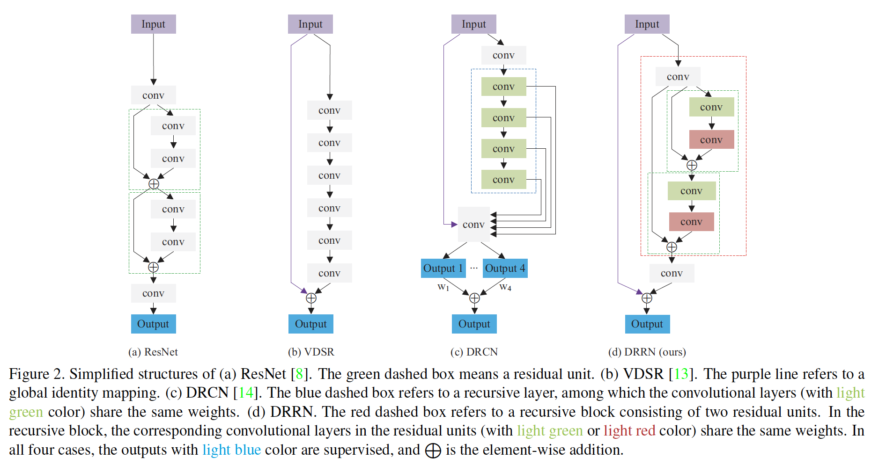

### 3. 深度递归残差网络

​		本节中，我们介绍我们所提出的DRRN的技术部分。具体而言，我们在恒等分支中采用全局残差学习，并通过构建递归块结构将递归学习引入残差分支，其中堆叠几个残差单元。注意，在ResNet[8]中，不同的残差单元为恒等分支使用不同的输入（图2（a）中的绿色虚线框）。但是，**在我们的递归块，使用多路径结构，并且所有残差单元为恒等分支（图2（d）中的绿色虚线框）使用相同的输入**，其进一步促进学习[16]。我们在表1中突出显示了DRRN与相关模型之间的网络结构差异。 现在，我们将逐步介绍模型的更多细节，从残差单元到递归块，再到整个网络结构。

#### 3.1. 残差单元

​		在ResNet[8]中，基本残差单元为式（1），在权重层之后执行激活函数（BN [11]和ReLU [19]）。与“后激活”结构相比，He等[9]提出“预激活”结构，其在权重层之前执行激活。它们认为预激活版更容易训练，并生成比后激活版更好的性能。具体而言，具有预激活结构的残差单元为：

$$H^u=\mathcal{F}(H^{u-1},W^u) + H^{u-1},\tag{3}$$

其中$u=1,2,\cdots,U$，$U$为递归块中的残差单元的数量，$H^{u-1}$和$H^u$为第$u$个残差单元的输入和输出，并且$\mathcal{F}$表示残差函数。

​		与其直接使用上述残差单元，我们修改式（3）使得恒等分支和残差分支的输入是不同的。如第3节中开始处描述的，一个递归块中残差单元的所有恒等分支的输入均保持不变，即图3中的$H^0$。结果，在我们的递归块的输入和输出之间有多个路径，如图4所示。残差路径有助于学习高度复杂的特征，并且恒等路径有助于训练期间梯度的反向传播。与链模式相比，这种多路径模式促进学习，并且很少发上过拟合。因此，我们的残差单元为：

$$H^{u} = \mathcal{G}(H^{u-1}) = \mathcal{F}(H^{u-1},W) + H^0, \tag{4}$$

其中$\mathcal{G}$表示我们残差单元的函数。$H^0$为递归块中的第一个卷积层的结果。由于递归地学习残差单元，**权重集$W$在递归块内的残差单元之间共享，但在不同的递归块之间不同**。

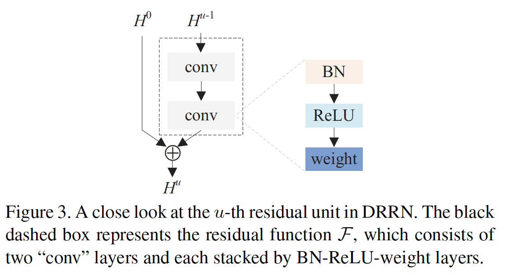

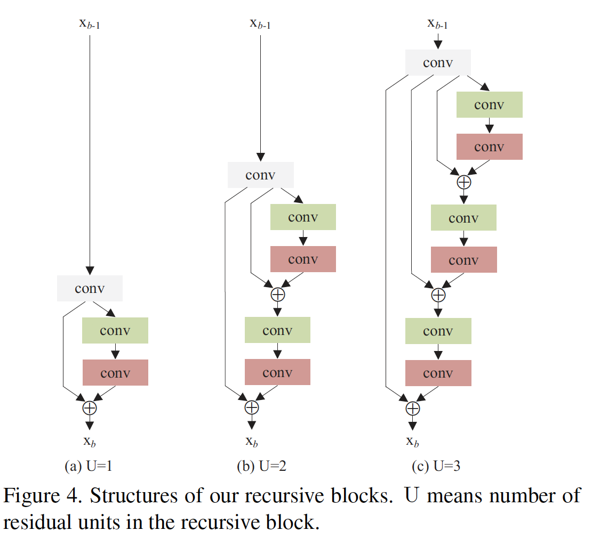

#### 3.2. 递归块

​		现在，我们介绍我们的递归块的细节。首先，我们在图4中展示递归块的结构。受[16]的启发，我们在递归块的开始处引入了卷积层，然后堆叠了第3.1节中提到的几个残差单元。我们用$B$表示为递归块的数量，$\mathbf{x}_{b-1}$和$\mathbf{x}_b$（$b=1,2,\cdots,B$）为第$b$个递归块的输入和输出，而$H_b^0=f_b(\mathbf{x}_{b-1})$为将$\mathbf{x}_{b-1}$传递给第一个卷积层后的结果，它的函数为$f_b$。根据式（4），第$u$个残差单元的结果为：

$$H_b^u=\mathcal{G}(H^{u-1})=\mathcal{F}(H_b^{u-1},W_b) + H_b^0.\tag{5}$$

因此，第$b$个递归块的输出$\mathbf{x}_b$为：

$$\mathbf{x}_b H_b^U=\mathcal{G}^{(U)}(f_b(\mathbf{x}_{b-1})) =\mathcal{G}(\mathcal{G}(\cdots(\mathcal{G}(f_b(\mathbf{x}_{b01})))\cdots)),\tag{6}$$

其中$\mathcal{G}_b$进行$U$折操作。

#### 3.3. 网络结构

​		最后，我们简单堆叠几个递归块，接着是重建LR和HR图像之间的卷积层。然后，将残差图像加到来自输入LR图像的全局恒等映射。DRRN的整个网络结构如图5所示。事实上，VDSR[13]可以视为DRRN的特例，即当$U=0$是，DRRN变为VDSR。 

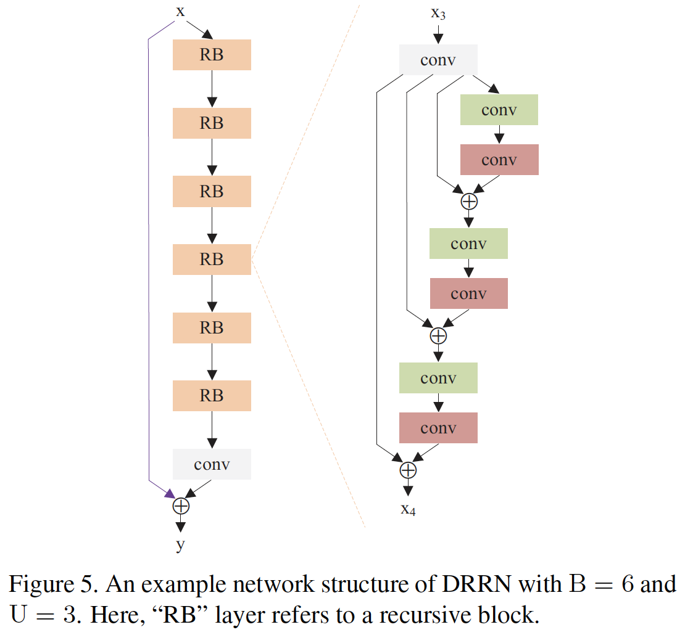

​		DRRN有两个参数：递归块的数量$B$和每个递归块中的残差单元的数量$U$。给定不同的$B$和$U$，我们可以学习不同深度（卷积层的数量）的DRRN。具体而言，DRRN的深度$d$计算为：

$$d = (1 + 2 \times U) \times B + 1. \tag{7}$$

​		$\mathbf{x}$和$\mathbf{y}$表示为DRRN的输入和输出，$\mathcal{R}$为第$b$个递归块的函数，我没有：

$$\mathbf{x}_b = \mathcal{R}_b(\mathbf{x}_{b-1}) = \mathcal{G}^{(U)}(f_b(\mathbf{x}_{b-1})).\tag{8}$$

当$b=1$时，我们定义$\mathbf{x}_0 = \mathbf{x}$。然后，DRRN可以表示为：

$$\mathbf{y} = \mathcal{D}(\mathbf{x}) = f_{Rec}(\mathcal{R}_B(\mathcal{R}_{B-1}(\cdots(\mathcal{R}_1(\mathbf{x}))\cdots))) + \mathbf{x}, \tag{9}$$

其中$f_{Re}$为DRRN中最后的卷积层，其用于重建残差。表1中列出ResNet、VDSR、DRCN和DRRN的数学公式。

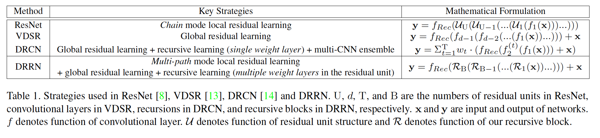

​		给定训练集$\{\mathbf{x}^{(i)},\tilde{\mathbf{x}}^{i}\}_{i=1}^{N}$，其中$N$为训练补丁的数量，$\mathbf{\tilde{x}^{(i)}}$为LR补丁$\mathbf{x}^{(i)}$的ground-truth HR补丁，DRRN的损失函数为：

$$\mathcal{L}(\Theta) =\frac{1}{2N}\sum_{i=1}^N\|\tilde{\mathbf{x}}^{(i)} - \mathcal{D}(\mathbf{x}^{(i)})\|^2,\tag{10}$$

其中$\Theta$表示参数集。通过mini-batch随机梯度下降（SGD）优化目标函数。我们通过Caffe实现DRRN。

### 4. 实验

#### 4.1. 数据集

​		遵循[13、23]，我们使用291张图像的训练数据集，其中来自Yang等的91张图像和来自Berkeley Segmentation Dataset[18]的200张图像。对于测试，我们使用四种广泛使用的基准测试：Set5、Set14、BSD100和Urban100，它们分别包含5、14、100和100张图像。

#### 4.2. 实现细节

​		在291张图像的训练集上进行数据增强。受[30]启发，考虑翻转和旋转。具体而言，我们将图像旋转$90^\circ$、$180^\circ$、$270^\circ$，并水平翻转它们。之后，对于每张原始图像，我们有7种额外的数据增强版本。此外，受VDSR的启发，我们还使用尺度增强，训练集中包含不同尺度的图像（$\times 2$、$\times 3$ 和 $\times 4$）。因此，对于所有不同尺度，我们仅需要训练单模型。

​		训练图像划分为$31 \times 31$的补丁，步长为21，这同时考虑了训练时间和存储复杂度。我们将SGD的mini-batch大小设置为128，momentum设置为0.9，权重衰减设置为$10^{-4}$。每个权重层有128个大小为$3 \times 3$的滤波器。

​		对于权重初始化，我们使用与He等相同的方法，其被证明非常适合使用ReLU的网络。初始学习率设置为0.1，然后每10个epoch减半。由于我们工作中使用大学习率，我们采用可调整的梯度裁剪[13]来提高收敛速率，同时抑制梯度爆炸。具体而言，将梯度裁剪到$[-\frac{\theta}{\gamma}, \frac{\theta}{\gamma}]$，其中$\gamma$为当前学习率，$\theta=1$为梯度裁剪参数。在2张 Titan X GPU上训练$d=20$的DRRN大致花费4天。

#### 4.3. Study of $B$ and $U$

​		本节中，我们探索$B$和$U$的各种组合，以构造具有不同深度的不同DRRN结构，并了解这两个参数如何影响性能。图6中，我们构建了$B$和$U$的网格，并从8到52层深度范围内的网格中采样几个点。当在一个递归块中使用更多残差单元时，参数量保持相同，并且在堆叠残差块时，参数线性增加。

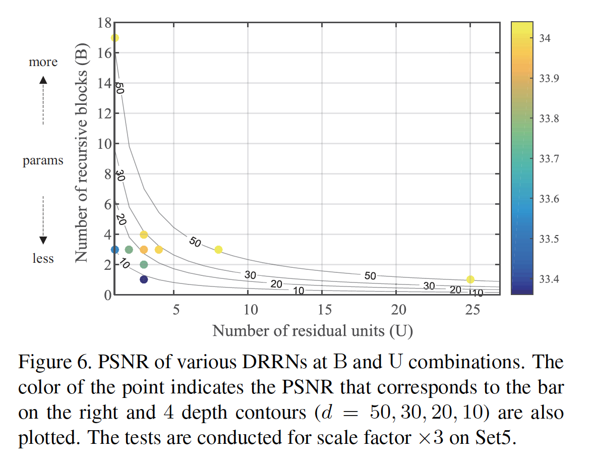

​		首先，为了清晰的展示单个参数是如何影响DRRN，我们将一个参数固定为3，而其他参数从1到4变化。图6展示在更深模型中增加$B$和$U$的结果，并获得更好的性能，这表明更深仍然更好。尽管结构不同，但只要它们的深度相似，这些模型是可比较的，例如B2U3（$d = 15$，$k = 784K$）和B3U2（$d = 16$，$k = 1182K$）分别达到33.76dB和33.77 dB。

​		上述提到的结构都是用递归学习策略。接着，我们测试不同的结构来证明如此策略的有效性。具体而言，我们将一个参数固定为1，而改变另一个参数一个偶见$d=52$网络。这产生两种极端的结构：B1U25（$k=297K$）和B17U1（$k=7375K$）。对于B1U25，仅使用一个递归块，其中递归地学习25个残差单元。对于B17U1，堆叠17个递归块，而没有残差学习。我们还构建一种标准结构B3U8（$d=52,k=1182K$）。图6展示，尽管有不同的结构，但是三种网络获得相当的性能（B17U1 34.03 dB, B3U8 34.04 dB以及B1U25 34.03 dB），并且比前面的浅层网络好。由于递归学习策略，B1U25可使用更少的参数，获得最佳结果。

#### 4.4. 与最先进模型的比较

​		现在，我们提供定量和定性比较。考虑性能和参数量，我们选择DRRN_B1U25（$d=52,k=297K$）作为我们的最佳模型。为了公平比较，我们还构建DRRN_B1U9（$d=20,k=297K$）结构，其与VDSR和DRCN有相同的深度，但是参数更少。最近几年的DL[2、13、14]和非DL[10、20、23]方法用做基准测试。实验设置与这些先前方法保持相同。具体而言，我们首先将bicubic插值用于图像侧彩色部分，并且所有模型仅用于其luminace部分。因此，输入和输出图像有相同的大小。为了公平比较，与[2、13、14、23]相似，在评估之前，裁剪掉图像边界附近的像素，尽管这对于DRRN来说不是必须的。

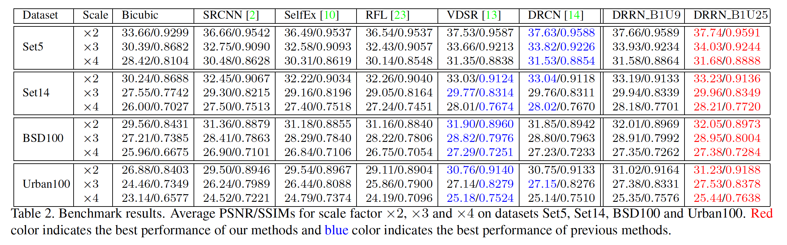

​		表2总结了四个测试集上的定量结果，这引用了[13、14]的方法的结果。在PSNR和SSIM方面，两种DRRN模型在所有数据集和尺度因子上都比已有的方法好。特别是在最近困难的Urban100数据集上，DRRN明显超越最先进方法，在2、3和4倍尺度因子上分别提高0.47、0.38和0.26dB。

​		此外，我们还使用另一种度量：Information Fidelity Criterion（IFC）进行比较，该指标声称与SR评估的感知分数具有最高的相关性[34]。结果见表3。注意，[2、10、20、23]的结果引用自[20]，而VDSR的结果来自我们的重新实现。与DRRM相似，VDSR重新实现也使用BN和ReLU，而原始的VDSR没有使用BN。这些结果是可靠的，因为我们的VDSR重新实现实现了与表2中报告的[13]相似的基准性能。由于[20]仅使用Set5、Set14和Urban100，我们在测试时省略BSD100。显然，DRRN在所有数据集和尺度因子中仍然优于所有现有方法。 关于速度，我们的20层B1U9网络需要0.25秒才能在Titan X GPU上处理$288 \times 288$图像。

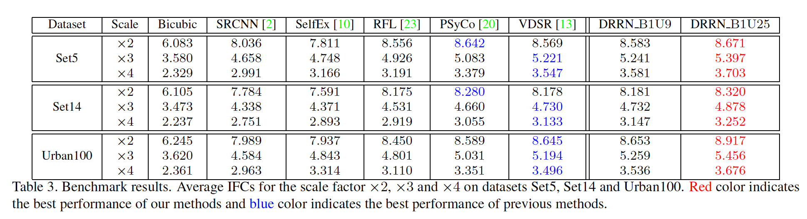

​		SRCNN、SelfEx、VDSR和DRRN之间的定性比较见图7。对于SRCNN和SelfEx，我们使用它们的公开代码。对于VDSR，我们使用我们的重实现。如我们所见，我们的方法相对于模式产生相对较锐利的边缘，而其他方法可能会产生模糊的结果。

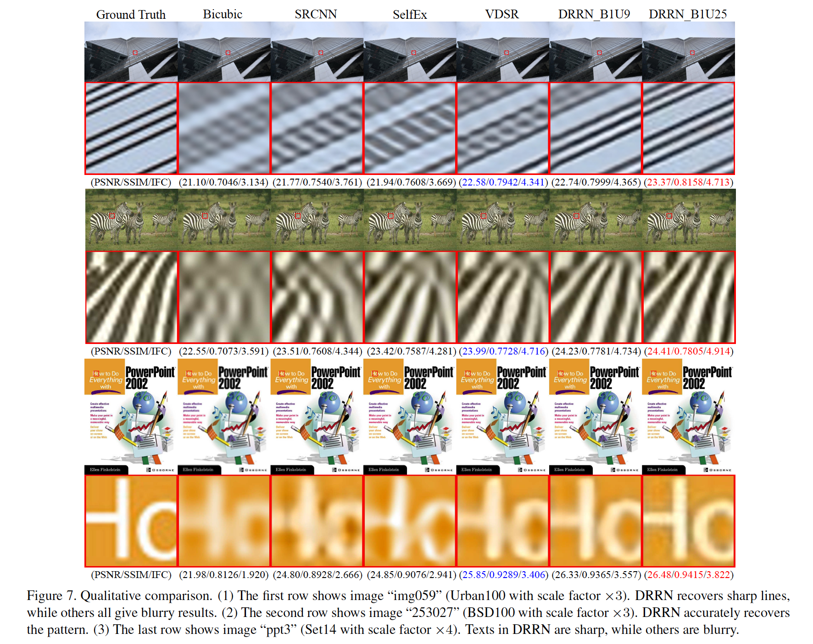

#### 4.5. 讨论

​		由于[13]中已讨论全局残差学习，本节中，我们主要关注局部残差学习（local residual learning：LRL）、递归学习和多路径结构。

​		**Local Residual Learning**	为了证明LRL的有效性，将DRRN与VDSR进行比较，其中VDSR没有LRL。为了公平比较，两个方法深度和参数量保持相同，我们评估三种深度：16（B3U2）、22（B3U3）和28（B3U4）。每个卷积层有128个大小为$3 \times 3$的滤波器。为了保持参数量相同，这这一测试中，我们没用在一个递归块中共享权重，并将这种DRRN结构表示为DRRN_NS。图8展示不同深度的两种方法的PSNR。我们看到，LRL策略始终在所有深度上提高了VDSR。

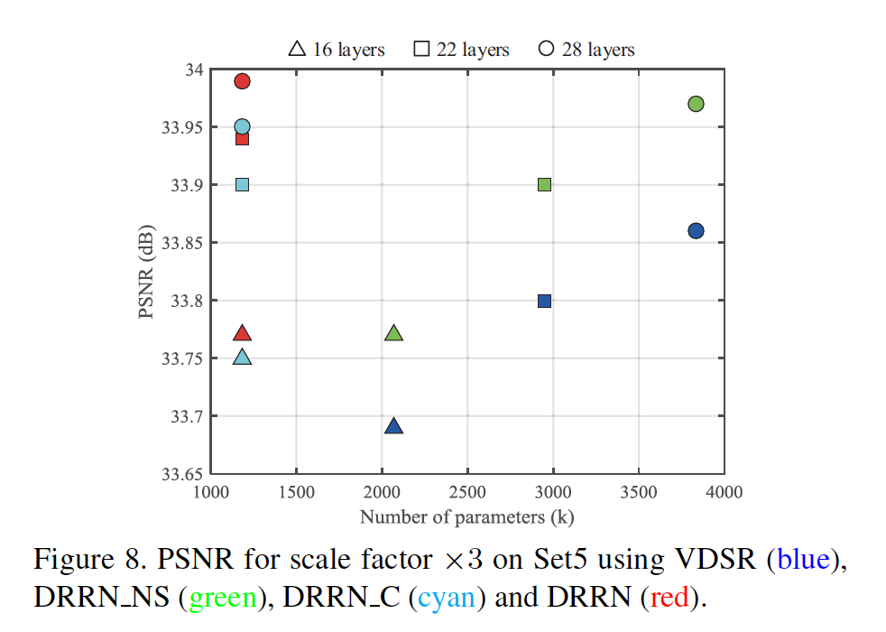

​		**Recursive Learning**	为了对比我们的递归学习策略，将三个DRRN_NS版本与三个权重共享版本进行了比较（图8）。在构建深度模型时，存储是我们考虑的重要因素。递归学习策略可以减小存储要求以及保持精确的模型，同时增加它的深度。有趣的是，权重共享的DRRN版获得与DRRN_NS版相当甚至比DRRN_NS更好的性能，同时仅使用少部分参数，这表明，当使用的训练集有限时，在相同的结构下，递归学习确实有效，并且不太容易过拟合[16]。

​		**多路径结构**	为了证明多路径结构的有效性，我们将DRRN与链式结构进行比较，将其表示为DRRN_C。如图8所示，利用相同的深度和参数量，在所有三种情况下，多路径结构获得比对应的链式结构更高的PSNR。此外，表4以网络B3U4为例，对性能提升进行了全面的研究。 它显示了与基准VDSR相比，不同的技术部件如何提高性能。

​		**Deep vs. Shallow**	最后，我们对深度和浅层SISR模型进行了比较，这些模型在最近三年（2014年至2016年）发布，报告了数据集Set5和Set14上尺度因子3的PSNR。浅层（非DL）模型包括A + [31]、SelfEx [10]、RFL [23]、NBSRF [22]、PSyCo [20]和IA [30]。 深度模型（$d \le 8$）包括SRCNN [2]、DJSR [33]、CSCN [32]、ESPCN [25]和FSRCNN [3]。 非常深的模型（$d \ge 20$）包括VDSR [13]、DRCN [14]、RED [17]和DRRN，其中$d = 20$和52。图9显示：1）非常深的模型明显优于浅层模型； 2）DRRN_B1U9（$d = 20$，$k = 297K$）在相同深度但参数较少的情况下已经超越了现有技术； 3）更深的DRRN_B1U25（$d = 52$，$k = 297K$）进一步提高了性能，而无需添加任何参数。

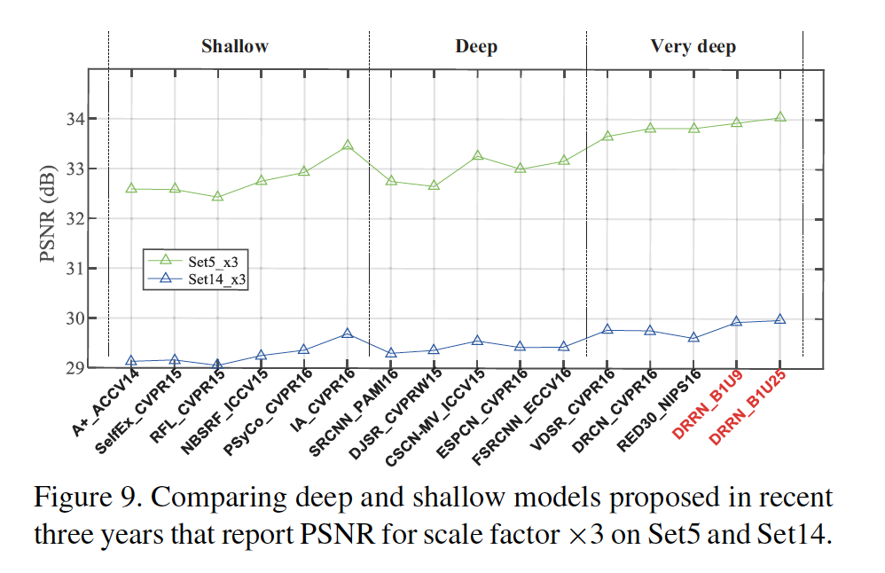

