## Enhanced Deep Residual Networks for Single Image Super-Resolution

### 摘要

​		随着深度卷积神经网络（DCNN）的发展，有关超分辨率的最新研究也不断发展。特别地，残差学习技术表现出改进的性能。在本文中，我们开发了性能超过当前最先进的SR方法的enhanced deep super-resolution network（EDSR）。我们模型的显着性能改进是由于通过删除常规残差网络中不必要的模块进行了优化。在稳定训练过程的同时，通过扩展模型大小进一步提高了性能。我们还提出一种新的多尺度深度超分辨率系统（MDSR）和训练方法，其可以在单模型中重建不同放大倍数的高分辨率图像。所提出的方法在基准数据集上显示出优于最新方法的性能，并通过赢得NTIRE2017超级分辨率挑战赛[26]证明了其卓越性。

### 1. 引言

​		最近十年来，图像超分辨率（SR）问题（特别是单图像超分辨率（SISR））获得越来越多的注意力。SISR旨在从单幅低分辨率图像$I^{SR}$重建高分辨率图像$I^{SR}$。一般而言，$I^{LR}$和原始的高分辨率图像$I^{HR}$之间的关系在不同场景下变化。许多假设$I^{LR}$为$I^{HR}$的bicubic下采样版，但是实际应用中也可以考虑其他衰减因素，例如模糊、抽取或噪声。

​		最近，SR问题中，深度神经网络在PSNR方法提供明显改进的性能。但是，这样的网络在架构优化方面表现出局限性。首先，神经网络模型的重建性能对最小的架构变化也很敏感。同时，相同的模型通过不同的初始化和训练获得不同水平的性能。因此，仔细设计的模型架构和复杂的优化方法是训练神经网络的关键。

​		其次，大多数现有的SR算法将不同尺度因子的超分辨率视为独立问题，而不考虑和利用SR中不同尺度之间的相互关系。这样，那些算法需要许多尺度特定的网络，这些网络需要独立训练以应对各种尺度。例外地，VDSR [11]可以在单个网络中共同处理多个尺度的超分辨率。训练具有多个尺度的VDSR模型可以显着提高性能，并且胜过尺度特定的训练，这意味尺度特定模型之间隐含冗余。然而，VDSR式的架构需要bicubic插值的图像作为输入，与尺度特定的上采样方法相比，其导致严重的计算时间和内存消耗。

​		尽管SRResNet [14]以良好的性能成功解决了那些时间和内存问题，但它只是采用了He等[9]的ResNet架构而没有做太多修改。然而，原始的ResNet是用于解决如图像分类和检测的更高级的计算机视觉问题。因此，直接将ResNet架构用于如超分辨率的低级视觉问题是次优的。

​		为了解决这些问题，基于SRResNet架构，我们首先通过分析和移除不必要的模块来改进网络架构，从而优化它。当模型复杂时，训练网络变得不平凡。因此，我们在训练时训练具有恰当损失函数和仔细模型修改的网络。我们通过实验表明，修改后的方案可产生更好的结果。

​		接下来，我们研究模型训练方法，该方法从其他尺度的模型中迁移知识。为了在训练期间利用尺度独立的信息，我们从预训练的低尺度模型训练高尺度模型，此外，我们提出新的多尺度架构，其共享不同尺度的大多数参数。与多个单尺度模型相比，所提出的多尺度模型利用明显更少的参数，但是表现出相当的性能。

​		我们在标准基准测试数据集和新提供的DIV2K数据集上评估我们的模型。对于PSNR和SSIM，所提出的单尺度和多尺度超分辨率网络在所有数据集上展现出最佳性能。我们的模型在NTIRE 2017 Super-Resolution Challenge[26]上排名第一和第二。

### 2. 相关工作

​		为了解决超分辨率问题，早期方法使用基于采样理论[1、15、34]的插值技术。但是，这些方法在预测细节、真实纹理方面有局限性。先前研究[25、23]采用将自然图像的统计量用于这个问题一重建更好的高分辨率图像。

​		高级工作旨在学习$I^{LR}$和$I^{HR}$图像对之间的映射函数。这些学习方法依赖从近邻嵌入[3、2、7、21]到稀疏编码[31、32、27、33]等技术。Yang等[30]引入另一种技术，该技术聚合补丁空间，并学习对应的函数。一些方法利用图像的自相似性来避免使用外部数据库[8、6、29]，并通过补丁的几何变换来增加有限内部字典的大小[10]。

​		最近，深度神经网络的强大功能已导致SR的显着改善。自从Dong[4、5]首先提出基于深度学习的SR方法，已研究多种CNN架构用于SR。Kim等[11、12]首先引入残差网络用语训练更深的网络架构，并获得更好的性能。特别地，他们表明，跳过连接和递归卷积减轻了超分辨率网络中承载恒等信息的负担。与[20]相似，Mao等[16]利用编码器-解码器网络和对称的跳过连接来处理通用图像恢复问题。在[16]中，它们认为这些嵌套的跳过连接提供快速而改进的的收敛。

​		在许多基于学习的超分辨率算法中，输入图像在馈入网络之前[4、11、12]，通过bicubic插值上采样输入图像。除了使用插值图像作为输入之外，还可以在网络的最末端训练上采样模块，如[5、22、14]所示。这样一来，可以减少很多计算而不会损失模型容量，因为特征的大小会减小。但是，这种方法有一个劣势：它们不能像VDSR [11]那样在单个框架中处理多尺度问题。在这项工作中，我们解决多尺度训练和计算效率的难题。我们不仅利用每种尺度的学习特征之间的相互关系，而且提出一种新的多尺度模型，该模型可以有效地重建各种尺度的高分辨率图像。此外，我们开发了一种适当的训练方法，该方法将多尺度用于单尺度和多尺度模型。

​		几项研究还关注更好训练网络的损失函数。均方误差（MSE）或L2损失是用于一般图像恢复的最广泛使用的损失函数，也是解决这些问题的主要性能指标（PSNR）。但是，赵等人[35] 报告指出，与其他损失函数相比，在PSNR和SSIM方面，具有L2损失的训练不能保证更好的性能。在他们的实验中，与使用L2训练的网络相比，使用L1训练的网络实现了更高的性能。

### 3. 所提出的方法

​		在本节中，我们描述所提出的模型架构。我们首先分析最近发布的超分辨率网络，并提出具有更简单结构的残差网络体系结构的增强版本。我们证明了我们的网络在表现出更高的计算效率的同时胜过原始网络。在以下各节中，我们提出处理单个超分辨率尺度的单尺度体系结构（EDSR）和在单个模型中重建各种尺度的高分辨率图像的多尺度体系结构（MDSR）。

#### 3.1. Residual blocks

​		最近，残差网络[11、9、14]在从低级任务到高级任务的计算机视觉问题中表现出出色的性能。尽管Ledig等[14] 成功地将ResNet架构应用于SRResNet的超分辨率问题，我们通过采用更好的ResNet结构进一步提高了性能。

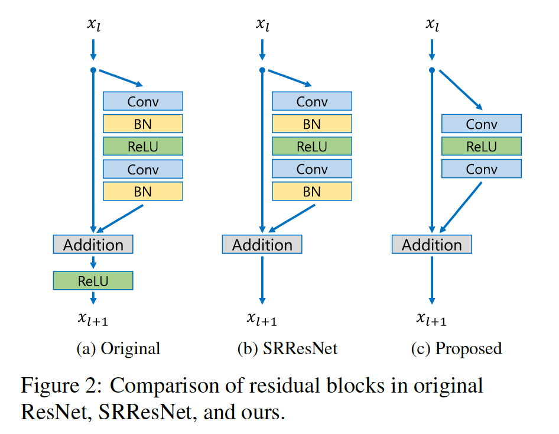

​		在图2中，我们比较原始ResNet、SRResNet和所提出网络的构建块。正如Nah等[19]在他们的图像去模糊工作中介绍的那样，我们从网络中删除了批量归一化层。因为批归一化层归一化特征，所以它们通过归一化特征摆脱了网络的范围灵活性，最好删除它们。我们通过实验表明，这种简单的修改实质上提高了性能，如第4节中所述。

​		此外，由于批处理归一化层消耗的内存量与前面的卷积层相同，因此GPU内存的使用也得到了充分降低。训练期间，与SRResNet相比，没有批归一化的基线模型节约大约40%的内存。因此，我们可以在有限的计算资源下建立一个比常规ResNet结构具有更好性能的更大模型。

#### 3.2. 单尺度模型

​		增强网络模型性能的最简单方式是增加参数量。在卷积神经网络中，模型的性能可以通过堆叠许多层或增加滤波器数量得到增强。深度（层数）为$B$、宽度（特征通道数）$F$的一般CNN架构占据大致$O(BF^2)$参数的$O(BF)$内存。因此，当考虑到有限的计算资源时，增加$F$而不是$B$可以最大小模型容量。

​		但是，我们发现，将特征图的数量增加到一定水平以上将使训练过程在数值上不稳定。Szegedy等[24]报告了相似的现象。我们的使用因子为0.1的残差尺度解决这个问题。在每个残差块中，将常数尺度层放在最后的卷积层之后。当使用大量滤波器时，这些模型可以稳定训练过程。在测试阶段，为了计算效率，这些模块可以集成到前面的卷积层。

​		我们利用图2中所提出的残差块构建我们的**baseline（single-scale）**模型。结构与SRResNet相似，但是我们的模型在残差块之外没有ReLU激活层。同时，我们的基线模型没有残差尺度层，因为我们仅在每个卷积层中使用64个特征图。在最终的单尺度模型（**EDSR**）中，我们通过设置尺度因子0.1的$B=32$、$F=256$扩展基线模型。模型架构如图3所示。

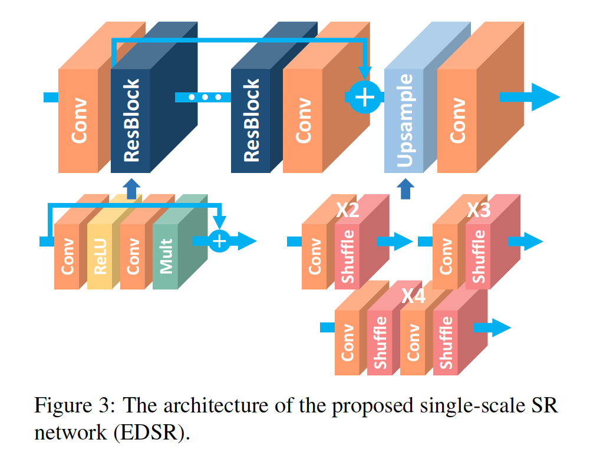

​		当训练上采样因子为3和4的模型时，我们使用预先训练的因子为2的网络初始化模型参数。这种预训练策略加速训练，并改进最终的性能，如图4所示。对于4倍放大因子，如果我们使用预训练尺度为2的模型（蓝线），训练收敛远快于从随机初始化开始训练（绿色）。

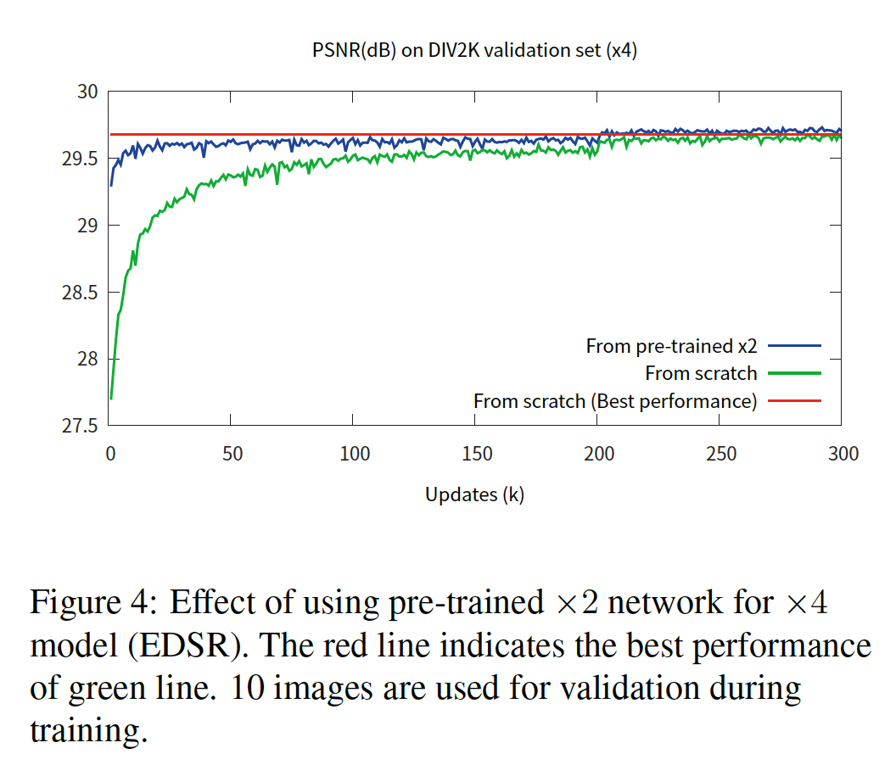

#### 3.3. 多尺度模型

​		根据图4的观察，我们得出的结论是，多尺度的超分辨率是内部关联的任务。我们将通过构建多尺度体架构（如VDSR [11]）充分利用尺度间相关性的优势，进一步探索这一想法。我们将基线（多尺度）模型设计为具有一个$B = 16$个残差块的单一主分支，以便大多数参数在不同尺度上共享，如图5所示。

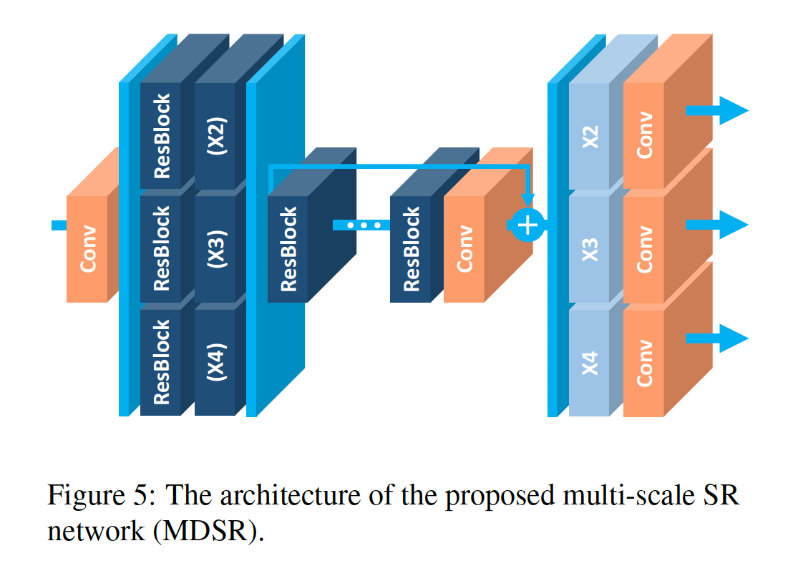

​		在我们的多尺度架构中，我们引入了特定于尺度的处理模块来处理多尺度的超分辨率。首先，预处理模块位于网络的头部，以减少来自不同尺度的输入图像的差异。每个预处理模块包含两个$5\times5$核的残差块。通过在预处理模块中采用更大的核，我们可以使特定于尺度的部分保持较浅，而在网络的早期阶段则覆盖了较大的感受野。在多尺度模型的末端，尺度特定的上采样模块并行放置以处理多尺度重建。上采样模块的架构与前一节中描述的单尺度模型中的上采样模块相似。

​		我们构建最终的$B=80$和$F=64$多尺度模型（**MDSR**）。虽然我们针对3个不同尺度的单尺度基线模型每个都有约150万个参数，总计450万个参数，但我们的基线多尺度模型只有320万个参数。然而，多尺度模型表现出与单尺度模型相当的性能。此外，我们的多尺度模型在深度方面是可伸缩的。尽管最终的MDSR的深度是基线多尺度模型的5倍，但仅需要2.5倍的参数，因为残差块比尺度特定的部分更轻。注意，MDSR也表现出与尺度特定的EDSR相当的性能。所提出模型的详细性能比较见表2和表3。

### 4. 实验

#### 4.1. 数据集

​		DIV2K数据集是新提出的用于恢复任务的高质量（2K分辨率）图像数据集。DIV2K数据集包含800张训练图像，100张验证图像和100张测试图像。因为测试数据集的ground-truth没有释放，我们报告并比较验证数据集上的性能。我们还在4个标准测试数据集：Set5、Set14、B100和Urban100上的性能。

#### 4.2. 训练细节

​		对于训练，我们将LR图像中大小为$48 \times 48$的RGB输入补丁与相应的HR补丁一起使用。我们利用随机水平翻转和90度旋转增强训练数据。我们通过减去DIV2K数据集的平均RGB值来预处理所有图像。我们利用$\beta_1=0.9$、$\beta_2 = 0.999$和$\epsilon=10^{-8}$的Adam优化器训练模型。我们将minibatch大小设置为16。学习率初始化为$10^{-4}$，并在每$2 \times 10^5$的minibatch更新减半。

​		对于单尺度模型（EDSR），我们训练3.2节中描述的网络。从头训练$\times2$的模型。在模型收敛后，我们使用它作为其他尺度的预训练网络。

​		训练多尺度模型（MDSR）的每次更新中，我们在$\times2$、$\times3$和$\times4$中随机选择尺度构建minibatch。仅启用和更新与所选尺度对应的模块。因此，与所选尺度之外的不同尺度相对应的尺度特定的残差块和上采样模块不被启用或更新。

​		我们使用L1损失而不是L2损失训练网络。通常优选最小化L2，因为它可使PSNR最大化。但是，基于一系列实验，我们凭经验发现L1损失提供的收敛性优于L2。 第4.4节提供了对这种比较的评估。

​		我们利用Torch7框架实现所提出的网络，并使用NVIDIA Titan X GPU训练它们。训练EDSR和MDSR分别需要8天和4天。

#### 4.3. Geometric Self-ensemble

​		为了最大化模型潜在性能，我们采用与[28]相似的self-ensemble策略。测试期间，我们翻转和旋转输入图像$I_{LR}$以为每个样本生成7中增强输入$I_{n,i}^{LR} = T_i(I_n^{LR})$，其中$I_i$表示包含恒等的8中几何变换。利用这些增强的低分辨率图像，我们使用网络生成相应的超分辨率图像$\{I_{n,1}^{SR},\cdots,I_{n,8}^{SR}\}$。然后，我们将逆变换用于这些输出图像已得到原始的几何$\tilde{I}_{n,i}^{SR}=T_i^{-1}(I_{n,i}^{SR})$。最后，我们将变换后的输出平均在一起，以得出如下self-ensemble结果。$$I_n^{SR} = \frac{1}{8}\sum_{i=1}^8 \tilde{I}_{n,i}^{SR}$$。

​		这种自集成方法有一个优势，因为它不需要单独训练独立的模型。当模型大小或训练时间很重要时，这尤其有益。尽管self-ensemble策略保持参数总量相同，但我们注意到，与需要单独训练模型的常规模型集成方法相比，该方法可提供大约相同的性能增益。我们通过在方法名称后添加“ +”后缀来表示使用自集成方法，即EDSR+/MDSR+。注意，geometric self-ensemble仅对于对称下采样方法（例如bicubic下采样）有效。

#### 4.4. 在DIV2K数据集上评估

​		我们在DIV2K数据集上测试所提出的网络。从SRResNet开始，我们逐渐改变不同的设置以进行消融测试。首先，我们将损失函数从L2改为L1，然后如上一节所述对网络体系结构进行了改革，并在表1中进行了总结。

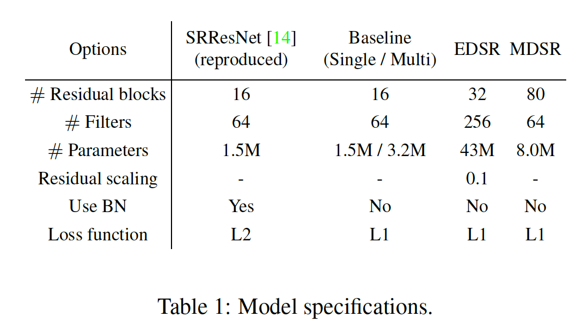

​		在这个实验中，我们训练这些模型$3 \times 10^5$次迭代。利用PSNR和SSIM标准，在DIV2K数据集上的10张图像上进行评估。对于评估，我们使用完整的RGB通达，并忽略边界上（6+scale）像素。

​		表2给出了量化结果。对于所有尺度因子，使用L1训练的SRResNet的结果要比使用L2训练的原始结果更好。网络的修改带来更大的改进余地。表2的最后两列显示了采用几何自集成技术的最终更大模型EDSR+和MDSR+的显着性能提升。请注意，由于我们的模型没有批归一化层，因此它们需要的GPU内存要少得多。

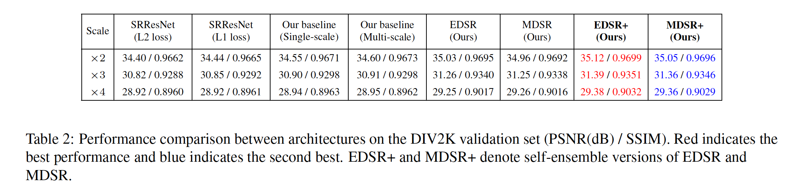

#### 4.5. 基准测试结果

​		我们在表3中提供了基于公共基准数据集的最终模型（EDSR+、MDSR+）的定量评估结果。self-ensemble的评估也在最后两列中提供。我们以批大小16训练模型$10^6$次。其他设置与基线模型相同。定性结果见图6。

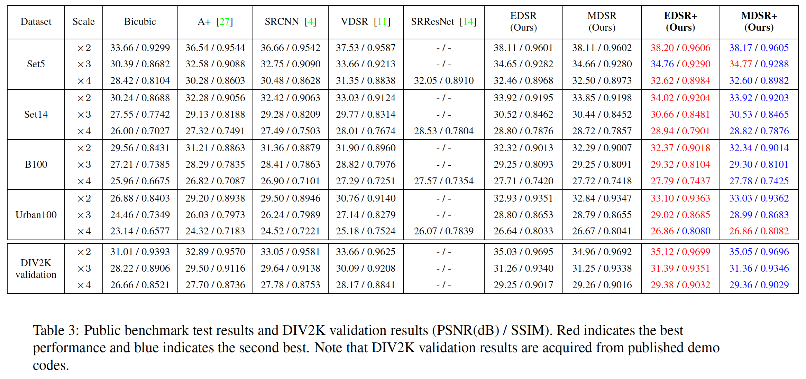

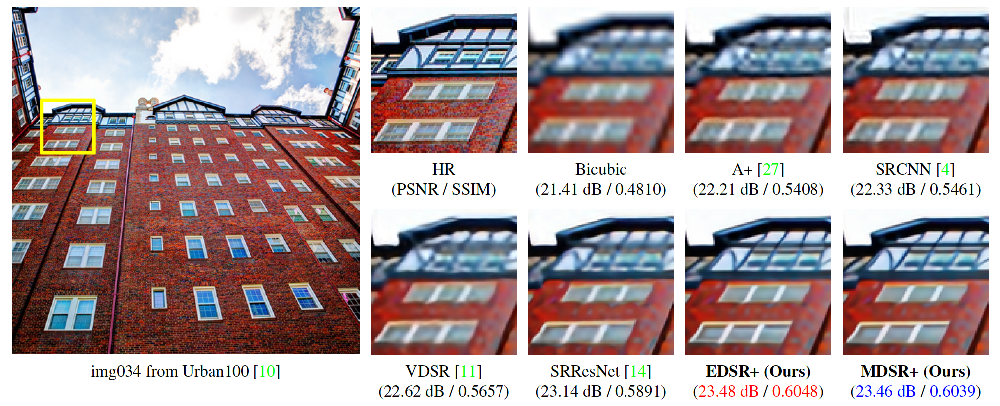

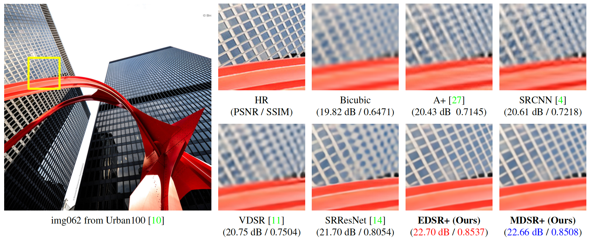

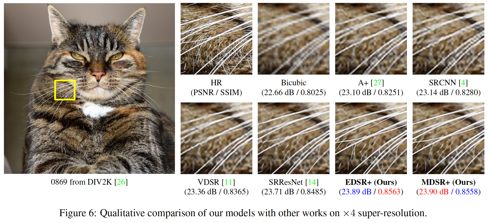

### 5. NTIRE2017 SR挑战

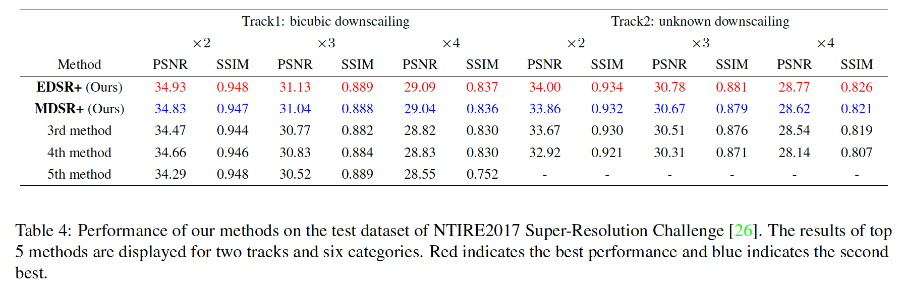

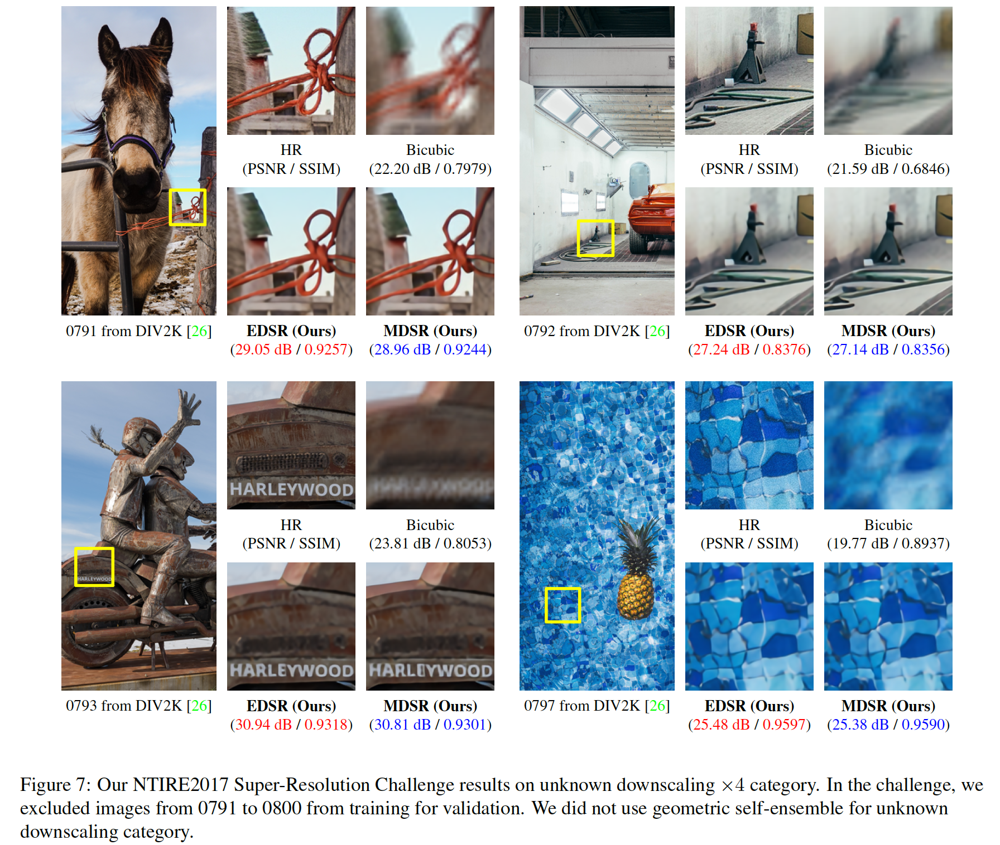