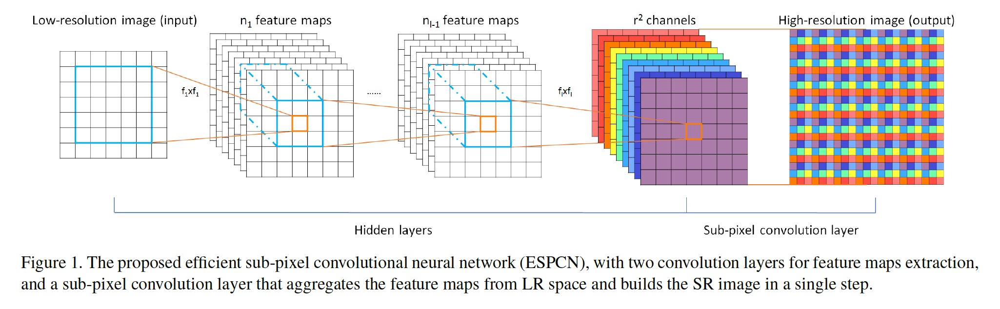
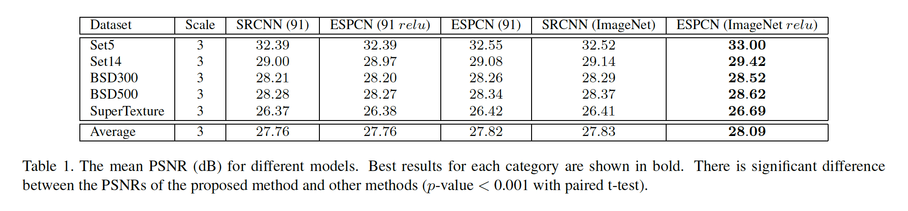
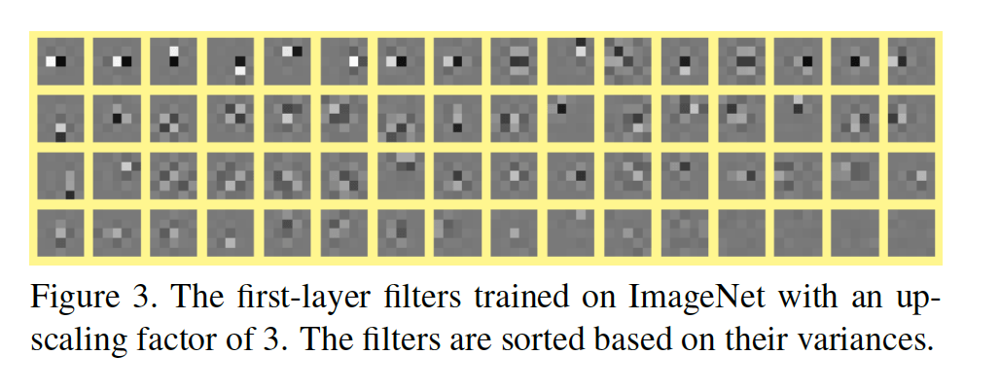
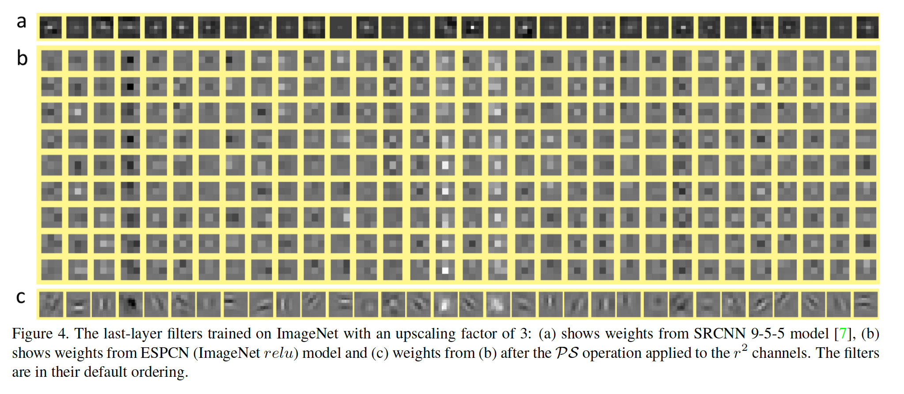
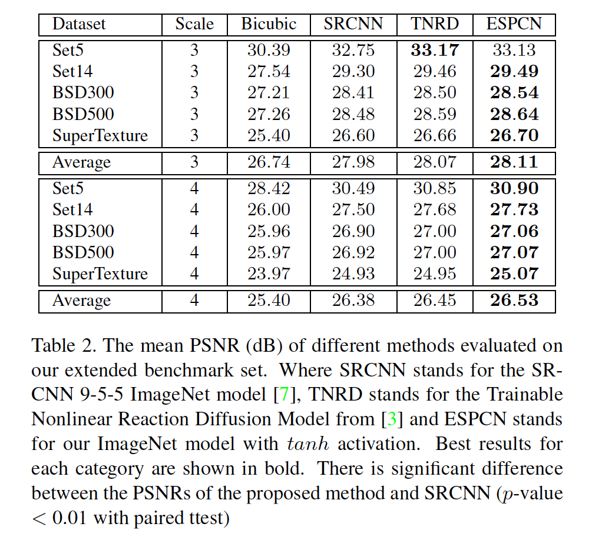
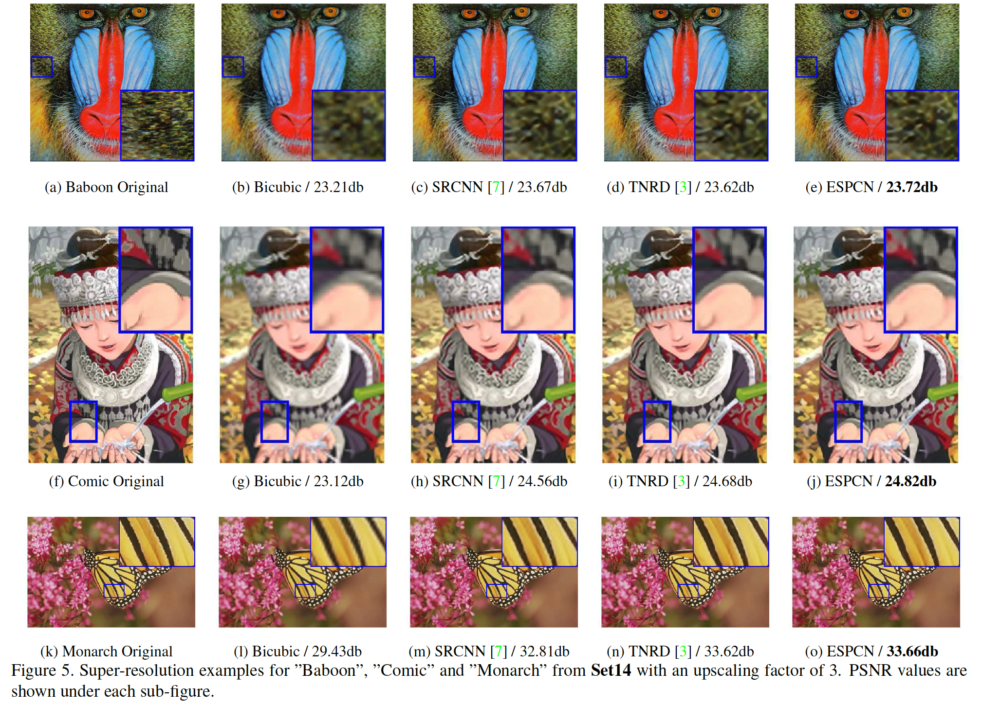
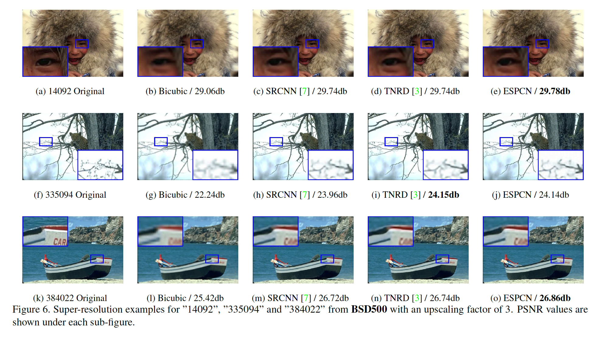
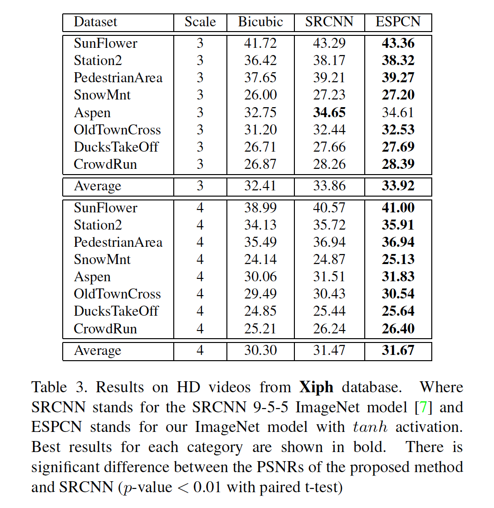
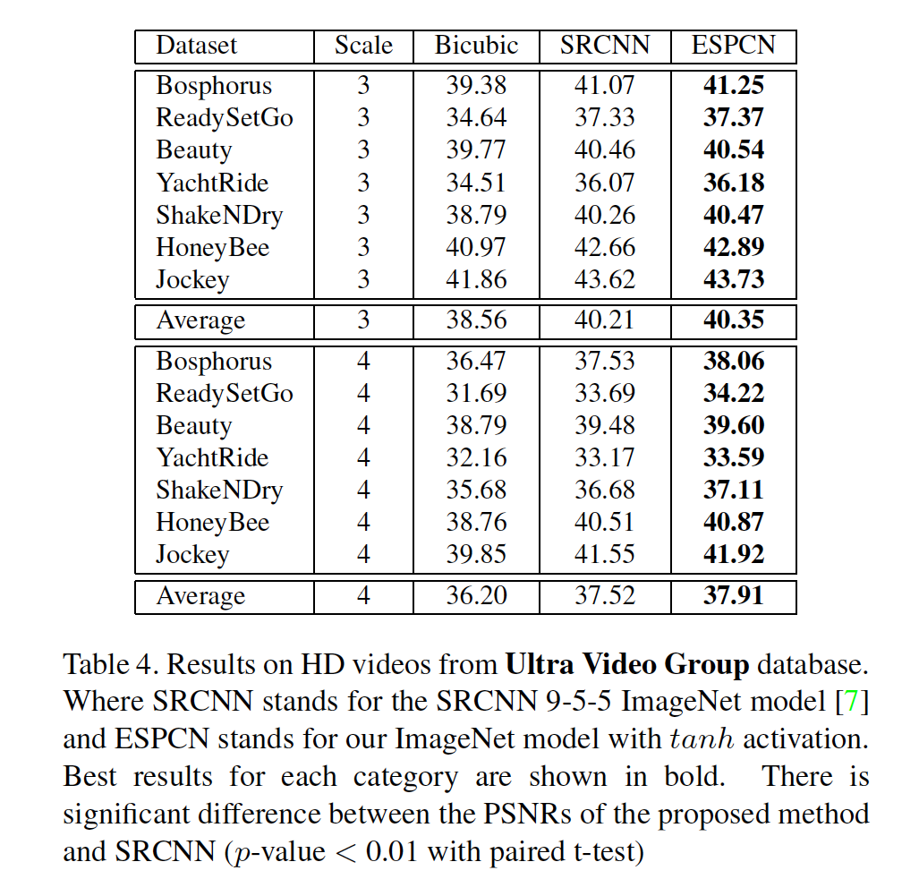

## Real-Time Single Image and Video Super-Resolution Using an Efficient Sub-Pixel Convolutional Neural Network

### 摘要

​		最近，基于深度神经网络的几种模型在单图像超分辨率的重建准确率和计算性能方面都取得巨大成功。在这些方法中，在重建之前，使用单个滤波器将低分辨率（Low Resolution：LR）输入图像放大到高分辨率（High Resolution：HR）空间，通常使用的是bicubic插值。这意味着SR操作在HR空间完成。我们证明这是次优的，并增加了计算复杂度。在本文中，我们提出了第一个能够在单个K2 GPU上对1080p视频进行实时SR的卷积神经网络（CNN）。为了实现这一点，我们提出了一种新颖的CNN架构，其中在LR空间中提取了特征图。此外，我们引入高效亚像素卷积层（efficient sub-pixel convolution layer），该层学习一系列的放大滤波器，以将最终的LR特征图升放大HR输出中。这样一来，我们便用更复杂的针对每个特征图训练的更复杂的放大滤波器（upscaling filters）有效地替换了SR流水线中的手工双三次（bicubic）滤波器，同时还降低了整个SR操作的计算复杂性。我们使用公开数据集上的图像和视频评估我们所提出的方法，并表明该方法的效果明显更好（图像上+0.15dB，视频上+0.39dB），比以前的基于CNN的方法快一个数量级。

### 1. 引言

​		从低分辨率（LR）对应部分恢复高分辨率（HR）图像或视频是数字图像处理中非常感兴趣的主题。这项任务被称为超分辨率（SR），可在许多领域直接应用，例如HDTV [15]、医学成像[28、33]、卫星成像[38]、面部识别[17]和监视[53]。 全局SR问题假设LR数据是HR数据的低通滤波（模糊）、下采样和噪声版本。**由于在不可逆的低通滤波和二次采样操作过程中会发生高频信息的丢失，因此这是一个病态严重的问题。**此外，SR操作实际上是从LR到HR空间的一对多映射，可以具有多个解决方案，其中确定正确的解决方案并非易事。许多SR技术背后的一个关键假设是，许多高频数据是冗余的，因此可以从低频分量中准确地重建出来。因此，SR是一个推理问题，并因此依赖于我们所讨论图像统计的模型。

​		许多方法都假定可以使用多个图像作为具有不同视角的同一场景的LR实例，即具有唯一的先验仿射变换。这些方法可以分类为多图像SR方法[1、11]，并通过使用其他信息约束不适定问题并尝试反转下采样过程来利用显式冗余。但是，这些方法通常需要计算复杂的图像配准和融合阶段，其准确性直接影响结果的质量。另一种替代方法是单图像超分辨率（SISR）技术[45]。这些技术试图学习自然数据中存在的隐式冗余，以从单个LR实例中恢复丢失的HR信息。这通常以图像的局部空间相关性和视频中其他时间相关性的形式出现。在这种情况下，需要以重建约束形式的先验信息来限制重建的解空间。

#### 1.1. 相关工作

​		SISR方法的目标是从单个LR输入图像中恢复HR图像[14]。最近流行的SISR方法可以分为基于边缘、基于图像统计量和基于补丁的方法。更一般的SISR方法的详细回顾见[45]。基于稀疏性的技术是最近在解决SISR问题上蓬勃发展的一种方法。稀疏编码是一种有效机制，其假设任何自然图像可以在变换域中被稀疏表示。该变换域通常是图像原子的字典[25、10]，可以通过尝试发现LR和HR补丁之间的对应关系的训练过程来学习。该字典能够嵌入必要的先验知识，以约束超分辨看不见数据的不适定问题。这种方法在[47、8]中提出。基于稀疏性的技术的缺点在于，通过非线性重构引入稀疏性约束通常在计算上是昂贵的。

​		通过神经网络[21、49、34]导出的图像表示最近也显示出对SISR的希望。这些方法采用反向传播算法[22]在大型图像数据库（例如ImageNet [30]）上训练，以学习LR和HR图像斑块的非线性映射。在[4]中使用堆叠的协作式局部自动编码器来逐层超解析LR图像。Osendorfer等人[27] 提出了一种基于预测卷积稀疏编码框架的扩展的SISR方法[29]。文献[7]提出了一种基于稀疏编码方法的多层卷积神经网络。Chen等[3] 提出使用多阶段可训练的非线性反应扩散（TNRD）替代权重和非线性可训练的CNN。受LISTA启发，Wang等[44]端到端地训练级联稀疏编码网络来充分利用图像的自然系属性。网络结构不受神经网络的限制，例如随机森林也成功用于SISR。

​		随着CNN的发展，算法的效率，尤其是其计算和存储成本，变得越来越重要[36]。与以前的手工模型相比，深度网络模型学习非线性关系的灵活性已显示出更高的重建精度[27、7、44、31、3]。为了将LR图像超分解为HR空间，有必要在某些点增加LR图像的分辨率以匹配HR图像的分辨率。

​		在Osendorfer等[27]中，图像分辨率在网络的中间逐渐增加。另一种流行的方法是在网络的之前或第一层增加分辨率[7、444、3]。但是，这些方法有大量缺点。首先，在图像增强步骤之前增加LR图像的分辨率会增加计算复杂性。对于处理速度直接取决于输入图像分辨率的卷积网络而言，这尤其成问题。其次，通常用于完成任务的插值方法（例如双三次插值[7、44、3]）不会带来其他信息来解决ill-posed的重建问题。

​		在Dong等人的脚注中简要提出了学习upscaling滤波器的建议[6]。但是，将其集成到CNN作为SR操作的一部分的重要性没有被充分识别，并且这种选项未被探索。此外，如Dong等[6]提到的，没有卷积层的有效实现，该卷积层输出大小大于输入大小，并且良好优化的实现（例如convnet [21]）不会轻易允许这种行为。

​		本文中，与先前的工作相反，我们提出仅在网络非常末端的地方增加LR到HR的分辨率，并且从LR特征图中超分辨HR数据。对于这个目的，我们提出高效亚像素卷积层（efficient sub-pixel convolution layer）来学习图像和视频超分辨率的upscaling操作。

​		这些贡献有两方面：

- 在我们的网络中，通过网络的最后一层处理upscaling。这意味着每个LR图像直接馈入网络，并通过LR空间的非线性卷积进行特征提取。由于减小输入分辨率，我们可以有效地使用更小滤波器大小来集成相同的信息，同时维持给定的上下文区域。分辨率和滤波器大小的减小大大降低了计算和内存的复杂度，足以实现对高清（HD）视频的实时超分辨率，如第3.5节所示。
- 对于具有$L$层的网络，我们学习了$n_{L-1}$个特征图的$n_{L-1}$个放大滤波器，而不是一个输入图像的一个放大滤波器。此外，不使用显式的插值滤波器意味着网络隐式学习SR所需的过程。因此，与第一层的单个固定滤波器upscaling相比，网络能够学习LR到HR的更好更复杂的映射。如第3.3.2节和第3.4节所示，这将在模型的重建精度方面带来额外的收益。

​        我们使用来自公开基准数据集的图像和视频验证了所提出的方法，并将我们的性能与以前的工作进行了比较，包括[7、3、31]。我们表明，所提出的模型达到了最先进的性能，比以前发布的图像和视频方法快了近一个数量级。

### 2. 方法

​		SISR任务是根据对应的原始HR图像$\mathbf{I}^{HR}$下采样后的LR图像$\mathbf{I}^{LR}$，估计HR图像$\mathbf{I}^{SR}$。下采样操作是确定性的，并且是已知的：要从$\mathbf{I}^{HR}$生成$\mathbf{I}^{LR}$，我们首先使用高斯滤波器对$\mathbf{I}^{HR}$进行卷积——从而模拟相机的点扩散函数——然后将图像下采样$r$倍。我们称$r$为upscaling因子。通常，$\mathbf{I}^{LR}$和$\mathbf{I}^{HR}$可以有$C$个颜色通道，因此它们被分别表示为大小$H \times W \times C$和$rH \times rW \times C$的实数向量。

​		为了解决SISR问题，[7]中提出的SRCNN从$\mathbf{I}^{LR}$的放大和插值版而不是$\mathbf{I}^{LR}$恢复。为了恢复$\mathbf{I}^{SR}$，使用3层卷积网络。本节中，我们提出新颖的网络架构（如图1所示）以避免在将其馈入网络之前以进行upscaling。在我们的架构中，我们首先将$l$层卷积神经网络直接用于LR图像，然后使用亚像素卷积层，该卷积层将LR特征图放大以产生$\mathbf{I}^{SR}$。

​		对于由$L$层组成的网络，前$L-1$层可以表示如下：

$$f^1(\mathbf{I}^{LR};W_1,b_1) = \phi(W_1 \ast \mathbf{I}^{LR} + b_1), \tag{1}$$

$$f^l(\mathbf{I}^{LR};W_{1:l},b_{1:l}) = \phi(W_l \ast f^{l-1}(\mathbf{I}^{LR}) + b_l), \tag{2}$$

其中$W_l,b_l,l \in (1,L-1)$分别为科学习的网络权重和偏置项。$W_l$为大小为$n_{l-1} \times n_l \times k_l \times k_l$的卷积张量，其中$n_l$为层中的特征数量，$n_0 = C$，$k_l$为层$l$的滤波器大小。偏置$b_l$为长度为$n_l$的向量。非线性函数（或激活函数）$\phi$逐像素使用，并且被固定。最后一层$f^L$将LR特征图转换为HR图像$\mathbf{I}^{SR}$。

#### 2.1. 反卷积层

​		反卷积层的添加是从最大池化和其他图像下采样层恢复分辨率的普遍选择。该方法已成功用于可视化层激活[49]和使用来自网络的高级特征生成语义分割[24]。可以很轻松地证明SRCNN中使用的双三次插值是反卷积层的一种特殊情况，正如[24、7]中已提出的那样。[50]中提出的反卷积层可以视为每个输入像素乘以步长为$r$的滤波器，并在结果输出窗口上求和，也称为向后卷积[24]。但是，卷积后的任何reduction（求和）都是昂贵的。

#### 2.2. Efficient sub-pixel  convolution layer

​		放大LR图像的另一种方法是，如[24]所述，在LR空间中以步长为$\frac{1}{r}$的卷积进行卷积，可以通过从LR空间到HR的插值，打孔[27]或分拆[49]来简单地实现 HR空间中的步长为1的卷积。这些实现将计算成本增加$r^2$倍，因为卷积在HR空间进行。

​		相反，在LR空间中具有步长$\frac{1}{r}$的卷积具有大小为$k_s$的滤波器$W_s$且权重间隔为$\frac{1}{r}$的卷积将激活$W_s$的不同部分以进行卷积。落在像素之间的权重根本不会被激活，不需要计算。激活模式的数量恰好是$r^2$。根据每种激活模式的位置，最多有$\lceil\frac{k_s}{r}\rceil^2$个权重需要激活。根据不同的子像素位置，滤波器在图像上的卷积过程中会定期激活这些模式：$\mod(x, r)$，$\mod(y,r)$，其中$x,y$是HR空间中的输出像素坐标。本文中，我们提出一种简单而有效的方式来实现上述操作，当$\mod(k_s,r)=0$时，

$$\mathbf{I}^{SR} = f^L(\mathbf{I}^{LR}) = \mathcal{PS}(W_L \ast f^{L-1}(\mathbf{I}^{LR}) + b_L), \tag{3}$$

其中$\mathcal{PS}$是periodic shuffling算子，其将$H \times W \times C\cdot r^2$张量的元素重新排列为形状为$rH \times rW \times C$的张量。这种操作的影响见图1。数学上这种操作可以以如下方式描述：

$$\mathcal{PS}(T)_{x,y,c} = T_{\lfloor x/ r\rfloor, \lfloor y/r\rfloor, c \cdot r \cdot\mod(y,r) + c \cdot\mod(x,r)} \tag{4}$$

因此，卷积算子$W_L$的形状为$n_{L-1} \times r^2 C \times k_L \times k_L$。注意，在最后一层的卷积输出上没有使用非线性层。容易看出，当$k_L = \frac{k_s}{r}$和$\mod(k_s,r)=0$时，它等价于LR空间中具有滤波器$W_s$的亚像素卷积。我们称新的层为sub-pixel convolution layer，称我们的网络的为efficient sub-pixel convolutional neural network （ESPCN）。最后一层直接从LR特征图生成HR图像，每个特征图使用一个放大滤波器，如图4所示。

​		给定包含HR图像示例$\mathbf{I}_n^{HR}, n = 1,\cdots,N$，我们生成对应的LR图像$\mathbf{I}_n^{HR},n=1,\cdots,N$，计算重建的逐像素平均均方误差（pixel-wise mean. squared error: MSE）作为训练网络的目标函数：

$$l(W_{1:L},b_{1:L}) = \frac{1}{r^2HW}\sum_{x=1}^{rH}\sum_{x=1}^{rW}(\mathbf{I}_{x,y}^{HR} - f_{x,y}^L(\mathbf{I}^{LR}))^2, \tag{5}$$

值得注意的是，与HR空间中的减少或卷积相比，上述周期性改组的实现可以非常快，因为每个操作都是独立的，因此可以在一个周期内平凡地并行化。因此，我们提出的层比前向传播中的反卷积层快$\log_2 r^2$倍，比使用卷积之前的不同形式的upscaling实现快$r^2$倍。

### 3. 实现

​		补充材料中提供了定量评估的详细报告，其中包扩包含图像和视频的原始数据、下采样数据、超分辨数据、K2 GPU上的总体和个人分数以及运行时间。

#### 3.1. 数据集

​		评估期间，我们使用公开的基准测试数据集，包含SISR论文广泛使用的Timofte数据集[40]，其包含91张训练图像，以及提供5和14张图像的**Set5**和**Set14**的测试集；Berkeley segmentation dataset [26] **BSD300**和**BSD500**分别提供100和200张图像进行测试，super texture数据集提供136张纹理图像。对于我们的最终模型，我们使用从**ImageNet**中随机选择的50000张图进行训练。遵循先前的工作，我们仅考虑YCvCr颜色空间中的亮度通道，因为人类对亮度变化更加敏感。对于每个放大因子，我们训练特定的网络。

​		对于视频实验，我们使用来自公开提供的**Xiph**数据库的1080p高清视频，该数据库已被用于以以前的方法报告视频SR结果[37、23]。数据库包含8个大约10秒的HD视频，其宽度和高度为$1920 \times 1080$。此外，我们还使用**Ultra Video Group**数据库，其包含分辨率为$1920 \times 1080$的7个视频，长度为5秒。

#### 3.2. 实现细节

​		对于ESPCN，我们设置$l=3$、$(f_1,n_1) = (5, 64)$、$(f_2,n_2) = (3, 32)$以及$f_3=3$。参数选择受SRCNN的3层9-5-5模型和2.2节中的公式启发。在训练阶段，从训练ground-truth图像$\mathbf{I}^{HR}$上提取$17r \times 17r$像素的子图像，其中$r$为放大因子。为了生成低分辨率样本$\mathbf{I}^{LR}$，我们使用Gaussian滤波器模糊$\mathbf{I}^{HR}$，并通过放大因子下采样。从原始图像中提取子图像，其$\mathbf{I}^{HR}$的步长为$(17- \sum \mod(f,2)) \times r$，$\mathbf{I}^{LR}$步长为$17- \sum \mod(f,2)$。这样可以确保原始图像中的所有像素作为训练数据的ground-truth一次出现一次。对于实验结果所激发的最终模型，我们选择$tanh$而不是$relu$作为激活函数。

​		在100个周期后未观察到成本函数的改善后，训练停止。初始学习率设置为0.01，最终学习率设置为0.0001，当成本函数的改进小于阈值$\mu$时，逐渐更新学习率。最后一层的学习率比[7]慢10倍。在K2 GPU上对91幅图像进行的训练大约需要3个小时，而对ImageNet [30]的图像放大3倍需要训练7天。我们使用PSNR作为性能度量来评估我们的模型。SRCNN的PSNR和我们扩展基准集上的Chen模型是根据[7、3]提供的Matlab代码和模型计算的。

#### 3.3. Image super-resolution results

##### 3.3.1  亚像素卷积层的好处

​		本节中，我们证明亚像素卷积层与$tanh$激活函数的正影响。我们首先通过与SRCNN的标准9-1-5模型进行比较评估亚像素卷积层的能力。这里，我们遵循[6]中的方法，在本实验中将$relu$用作模型的激活函数，并用91个图像训练一组模型，并使用ImageNet的图像训练另一个模型。结果见表1。与SRCNN模型相比，在ImageNet图像上训练的具有$relu$的ESPCN在统计上取得了明显更好的性能。 值得注意的是，ESPCN（91）的表现与SRCNN（91）非常相似。 与具有类似数量参数（+0.33 vs +0.07）的SRCNN相比，利用更多图像训练的ESPCN对PSNR的影响要大得多。

​		为了在带有亚像素卷积层的模型和SRCNN之间进行可视化比较，我们在图3和图4中的[7]可视化了ESPCN（ImageNet）模型与SRCNN 9-5-5 ImageNet模型的权重。我们的第一层和最后一层滤波器的权重与设计的特征非常相似，包括log-Gabor滤波器[48]、小波[20]和Haar特征[42]。值得注意的是，尽管每个滤波器在LR空间是独立的，但我们的独立滤波器实际上在$\mathcal{PS}$后的HR空间中是平滑的。与SRCNN的最后一层滤波器相比，我们的最后一层的滤波器对于不同的特征图有复杂的模式，它也有更丰富、更有意义的表示。

​		

​		我们还基于上述在91张图像和ImageNet上训练的模型，评估$tanh$激活函数的影响。对于SISR，表1中结果认为$tanh$函数比$relu$好。表2显示了具有$tanh$激活的ImageNet图像的结果。

#### 3.3.2  Comparison to the state-of-the-art

​		本节中，我们展示了在ImageNet上训练的ESPCN与SRCNN [7]和TNRD [3]的结果相比，后者是目前发布的效果最好的方法。为简单起见，我们没有展示已知结果比[3]差的结果。 对于感兴趣的读者，可以在[31]中找到其他先前方法的结果。 在本节中，我们选择与最佳SRCNN 9-5-5 ImageNet模型进行比较[7]。 对于[3]，基于$7 \times 7$ 5级模型计算结果。

​		表2的结果明显好于SRCNN 9-5-5 ImageNEt模型，但与TNRD接近，在某些情况下甚至优于TNRD [3]。尽管TNRD使用单个双三次插值将输入图像放大到HR空间，但它可能会受益于可训练的非线性函数。这种可训练的非线性函数并非我们的网络之外，并且将来会引起人们的兴趣。超分辨图像的视觉比较在图5和图6中给出，CNN方法创建了更清晰和更高对比度的图像，ESPCN明显优于SRCNN。

#### 3.4. 视频超分辨率结果

​		在本节中，我们将ESPCN训练的模型与单帧双三次插值和SRCNN [7]在两个流行的视频基准上进行比较。我们的网络的一个巨大优势是速度。这使其成为视频SR的理想候选者，它使我们能够逐帧超级解析视频。 表3和表4中显示的结果优于SRCNN 9-5-5 ImageNet模型。这种改进比图像数据的结果更明显，这可能是由于数据集之间的差异。可以在图像基准的不同类别（如Set5与SuperTexture）中观察到类似的差异。

#### 3.5. 运行时间评估

​		本节中，我们评估我们的具有4倍放大因子的最佳模型在**Set14**上的运行时间。我们根据[40]和[31]提供的Matlab代码评估其他方法[2、51、39]的运行时间。对于使用包括我们自己的卷积的方法，基于[7，3]中提供的Matlab代码，使用python / theano实现来提高效率。结果见图2。我们的模型运行速度比迄今发布的最快方法快。与SRCNN 9-5-5 ImageNet 模型相比，超分辨一张图像所需的卷积数少于 $r\times r$ 倍，模型的总参数数少2.5倍。因此，超分辨率操作的全部复杂度低$2.5 \times r \times r$倍。在K2 GPU上超分辨**Set14**中的一张图像时，我们达到了4.7ms的惊人平均速度。 利用网络的惊人速度，使用[36]中讨论的经过独立训练的模型来探索整体预测，以在将来获得更好的SR性能将是很有趣的。

​		我们还使用**Xiph**和**Ultra Video Group**数据库中的视频评估了1080HD视频超分辨率的运行时间。放大系数为3时，SRCNN 9-5-5 ImageNet模型每帧仅需0.435s，而我们的ESPCN模型每帧仅需0.038s。放大系数为4时，SRCNN 9-5-5 ImageNet模型每帧需要0.434s，而ESPCN模型仅需要每帧0.029s。