## EnhanceNet: Single Image Super-Resolution Through Automated Texture Synthesis

### 摘要

​		单图像超分辨率是从单个低分辨率输入中推断出高分辨率图像的任务。传统上，使用诸如峰值信噪比（PSNR）之类的像素重建测量来测量用于此任务的算法的性能，这些测量已表现出与人类对图像质量的感知之间的相关性很差。因此，算法最小化这些度量会倾向于过度平滑的图像，这种图像缺乏高频纹理，并且尽管产生高PSNR值，但是看起来不自然。

​		我们提出了一种结合纹理损失的自动纹理生成的新颖应用，该损失集中在创建逼真的纹理上，而不是针对训练过程中针对像素真值的地面真实图像再现进行优化。通过在对抗训练中使用前馈全卷积神经网络，我们可以在高放大倍率下显着提高图像质量。在大量数据集上的广泛实验证明了我们的方法的有效性，它在定量和定性基准测试上都产生最先进结果。

### 1. 引言

​		从低分辨率（LR）对应对象中增强和恢复高分辨率（HR）图像是科幻电影和科学文献的主题。在后者中，它被称为单图像超分辨率（SISR），这是近年来受到很多关注和进步的主题。这个问题本质上是病态的，因为不存在唯一解：当进行下采样后，大量不同的HR图像会产生相同的LR图像。对于高放大比例，这种一对多映射问题变得更糟，使SISR成为一个非常复杂的问题。尽管SISR的重建精度和速度都取得了长足进步，但目前的最新方法仍远未达到像图像增强器那样的效果，例如由Harrison Ford别名Rick Deckard在1982年的标志性《银翼杀手》电影中使用的图像增强器。一个关键问题是由于大量下采样因子而导致的高频信息丢失，从而导致超分辨图像中的纹理区域变得模糊，过于光滑且外观不自然（请参见图1，左，PSNR（ ENet-E）的最新技术）。

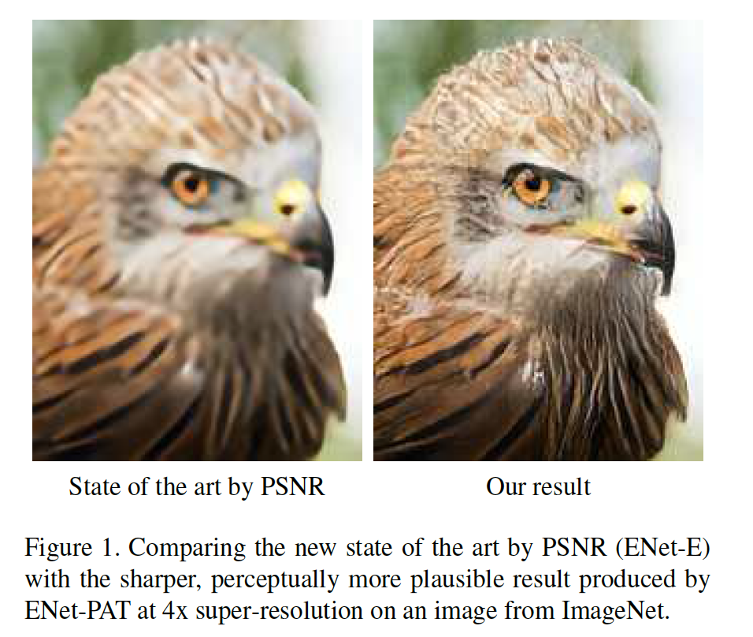

​		出现这种现象的原因在于，选择当前最先进的方法所采用的目标函数：大多数系统最小化HR ground-truth图像与其从LR观察重建图像之间的像素平均均方误差（MSE）。 然而，LR观察与人类对图像质量的感知之间的相关性很差[28、54]。尽管易于最小化，但最佳MSE估计器返回许多可能解的均值，这使SISR结果看起来不自然且难以置信（参见图2）。在超分辨率的情况下，这种回归均值的问题是众所周知的事实，但是，对自然图像的高维多峰分布进行建模仍然是一个具有挑战性的问题。

​		在这项工作中，我们采用了不同的策略来提高SISR结果的感知质量。使用全卷积神经网络架构，我们提出了一种新的修改方法，结合最近的纹理生成网络以及对抗训练和感知损失，以大倍率产生逼真的纹理。该方法可同时在所有RGB通道上工作，并以有竞争力的速度为自然图像产生清晰的结果。经过适当的损失组合训练，我们在PSNR方面和使用感知指标均达到了最新的结果。

### 2. 相关工作

​		SISR任务已被研究数十年[23]。诸如bicubic和Lanczos的插值方法是基于采样理论，但通常会在自然图像中产生带有锯齿伪影的模糊结果。此后，已经提出了许多高性能算法[35]，另请参见Nasrollahi和Moeslund [37]和Yang等人[57]的最新调查。

​		最近几年，流行的方法包括基于示例的模型，这些模型可以利用单个图像中不同尺度的循环补丁[13、17、22、56]或学习外部数据库中的图像补丁的低分辨率对和高分辨率对之间的映射[3、5、14、27、51、58、63]。它们还包括基于字典的方法[33、40、52、59、61、64]，该方法可将图像块的稀疏表示学习为字典原子的组合，以及基于神经网络的方法[4、8、9、24、25、26、47、48、62]，这些方法将卷积神经网络（CNN）应用于SISR的任务。一些方法专门设计用于快速推理[40、42、47]。到目前为止，只有通过用户指导的方法才能实现高倍放大SISR情况下的逼真的纹理[19、50]。

​		更具体地说，通过反向传播训练CNN学习从LR输入的bicubic插值到高分辨率图像的映射，Dong等[8]将浅层网络用于SISR任务。后面的工作成功使用更深的网络，而通过PSNR测量的SISR的当前技术水平是基于深度CNN [25、26]。

​		由于这些模型是通过最小化MSE进行训练的，因此，由于上述均值回归问题，结果往往会变得模糊且缺少高频纹理。已经为CNN提出了替代的感知损失[10、24]，其思想是将损失从图像空间迁移到像VGG [49]这样的对象识别系统的更高级的特征空间，尽管PSNR较低，但结果更清晰。

​		还发现了CNN对于纹理合成[15]和风格迁移[16、24、53]有用，但是，这些方法仅限于设置单个网络学习以仅生成单个纹理的设置，迄今为止尚未应用于SISR。对抗网络[18]最近已显示出在许多图像生成任务[7、39、41、66]中产生清晰的结果，但是到目前为止，仅在超分辨率环境中应用于人脸hallucination觉任务[62]。Ledig等[29]在未发表的论文中同时独立于我们的研究，开发了一种与我们类似的方法：受Johnson等[24]的启发，他们使用感知损失结合对抗网络来训练前馈CNN。但是，与我们的工作相比，他们没有明确鼓励对纹理统计信息进行局部匹配，因为我们发现这是产生更逼真的纹理并进一步减少视觉上难以置信的伪像的有效手段，而无需其他正则化技术。

### 3. 单图像超分辨率

​		将高分辨率图像$I_{HR} \in [0, 1]^{\alpha w \times \alpha h \times c}$下采样到低分辨率图像

$$I_{LR} = \mathbf{d}_\alpha(I_{HR}) \in [0, 1]^{w \times h \times c} \tag{1}$$

对于固定的放大因子$\alpha > 1$、图像宽$w$、高$h$和颜色通道$c$，这用到一些下采样算子

$$\mathbf{d}_\alpha: [0, 1]^{\alpha w \times \alpha h \times c} \rarr [0, 1]^{w \times h \times c} \tag{2}$$

SISR任务是提供从$I_{LR}$估计$I_{HR}$的近似逆$f \approx d^{-1}$：

$$f(I_{LR}) = I_{est} \approx I_{HR}.\tag{3}$$

这个问题是高度病态的（ill-posed），因为下采样操作$\mathbf{d}$是非注入式的，并且存在大量可能图像$I_{est}$，使$\mathbf{d}(I_{est}) = I_{LR}$成立。

​		最近的学习方法旨在通过最小化当前估计和ground-truth图像之间的欧式损失$\|I_{est} - I_{HR}\|$的多层神经网络近似$\mathbf{f}$。虽然这些模型通过PSNR可以得出出色的结果，但所得图像往往看起来模糊并且缺少原始图像中存在的高频纹理。这是SISR模棱两可的直接结果：由于下采样会从输入图像中去除高频信息，因此没有方法希望以像素为单位精确地再现所有精细的细节。因此，即使是最先进的模型也要学习在那些区域中生成所有可能纹理的均值，以使输出图像的欧几里得损失最小化。

​		为了说明这种效果，我们在图2中设计了一个简单的玩具示例，其中所有高频信息都因下采样而丢失。关于欧几里得损失的最佳解决方案只是所有可能图像的平均值，而更高级的损失函数可产生更逼真的效果，尽管不是像素完美的再现。

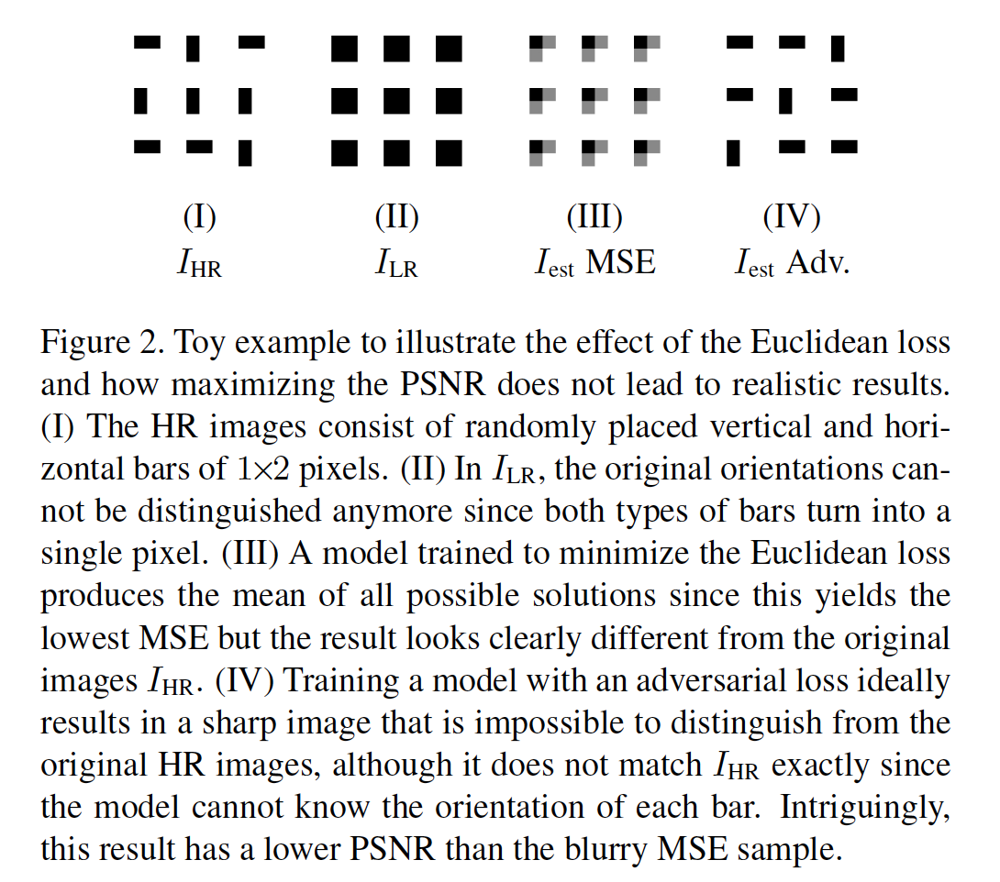

### 4. 方法

#### 4.1. 架构

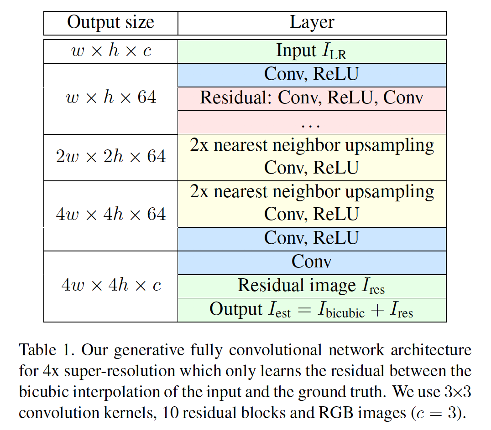

​		表1中的网络体系结构受到Long等人[32]和Johnson等人[24]的启发，因为前馈全卷积神经网络表现出许多对SISR有用的特性。卷积层的专有使用可以在给定的缩放因子下针对任意大小的输入图像训练单个模型，而前馈架构会在推理时生成有效的模型，因为LR图像只需通过网络传递一次即可获得结果。$3\times3$滤波器的专有使用受到VGG架构的启发[49]，并允许在网络中使用较少参数的情况下进行更深层次的建模。

​		因为LR输入小于输出图像，它需要在一些点上采样以产生高分辨率图像估计。仅将LR图像的bicubic插值简单馈入网络看起来很自然。但是，这将冗余引入到输入图像，并导致更高的计算成本。对于卷积神经网络，Long等[32]使用卷积转置层，该层上采样网络内部的特征激活。这避免了必须将具有附加冗余的大图像馈入CNN的麻烦，并允许大多数计算在LR图像空间中完成，从而导致相对于输出图像而言，较小的网络和较大的滤波感受野。

​		但是，据报导，卷积转置层会在输出中产生棋盘状伪像，从而需要在输出中使用其他正则化项，例如总变化[43]。Odena等[38]将卷积转置层替换为网络中的激活特征的最近邻上采样，接着是一个卷积层。在我们的网络架构中，队医一些特定损失函数，这种方法仍产生棋盘伪影，但是它消除了在我们更复杂的模型中对附加正则项的需要。为了进一步减少伪影，我们在HR图像空间的所有上采样块之后添加卷积层，因为这有助于避免输出的规则模式。

​		训练深度网络时，我们发现残差块[20]与堆叠的卷积层相比，对于更快的收敛是有好处的。Kim等[25]提出的类似动机是通过将输入bicubic插值添加到模型的输出中来仅学习残差图像，从而无需学习$I^{LR}$的恒等函数。虽然构成我们网络主要部分的残差块只添加了残差信息，但我们发现，应用此思想有助于稳定训练并减少训练期间输出中的颜色偏移。

#### 4.2. 训练和损失函数

​		本节中，我们引入用于训练网络的损失项。这些损失的不同组合和它们的效果在3.1节中讨论。

##### 4.2.1	图像空间的逐像素损失

​		作为一个基线，我们利用逐像素MSE训练模型：

$$\mathcal{L}_E = \|I_{est} - I_{HR}\|_2^2, \tag{4}$$

其中

$$\|I\|_2^2 = \frac{1}{whc} \sum_{w,h,c}(I_{w,h,c})^2.\tag{5}$$

##### 4.2.2	特征空间的感知损失

​		Dosovitskiy和Brox[10]以及Jonson等[24]提出_perceptual similarity measure_。与其在图像空间计算损失，不如在计算$I_{est}$和$I_{HR}$的距离之前，首先通过一个可微函数$\phi$将它们映射到特征空间。

$$\mathcal{L}_p =\|\phi(I_{est}) - \phi(I_{HR})\|_2^2\tag{6}$$

这使模型能够生成可能与逐像素准确率不匹配ground-truth图像的输出，而是鼓励网络生成具有相似特征表示的图像。

​		对于特征图$\phi$，我们使用流行的VGG-19网络的预训练实现。它由堆叠的卷积和池化层组成，以逐渐减小图像的空间尺寸并提取更高层的高层特征。为了补货低级和高级特征，我们使用第二和第五个池化层的组合，并计算它们的特征激活的MSE。

##### 4.2.3	纹理匹配损失

​		Gatys等[15、16]介绍了卷积神经网络是如何用于创建高质量纹理。给定目标纹理图像，通过将从预训练网络中提取的统计量与目标纹理进行匹配，来迭代生成输出图像。作为统计量，使用给定VGG层上长度为$m$的$n$个特征的特征激活$\phi(I)\in \mathbb{R}^{n \times m}$之间的相关性：

$$\mathcal{L}_T = \|G(\phi(I_{est})) - G(\phi(I_{HR}))\|_2^2,\tag{7}$$

其中Gram矩阵$G(F) = FF^T \in \mathbb{R}^{n \times n}$。由于它是基于迭代优化的，所以这种方法很慢，并且仅当测试时提供目标纹理才会起作用。随后的工作训练了一个前馈网络，该网络能够将全局纹理（例如，给定的绘画样式）合成到其他图像上[24、53]，但是单个网络再次仅生成单个纹理，并且所有输入图像中的纹理替换为训练网络的单一样式。

​		我们提出为SISR使用风格迁移损失：与其在推理过程中向我们的网络提供匹配的高分辨率纹理，不如在训练期间逐块计算纹理损失$\mathcal{L}_T$，以在$I_{est}$和$I_{HR}$之间实施局部相似的纹理。因此，训练期间，网络学习产生与高分辨率图像相同的局部纹理。尽管生成任意纹理的任务比单纹理合成的要求更高，但是LR图像和高级上下文线索为我们的网络提供了更多可使用的信息，从而使其能够生成变化的高分辨率纹理。根据经验，我们发现补丁大小为$16 \times 16$像素，可以在忠实的纹理生成与图像的整体感知质量之间达到最佳平衡。对于具有不同补丁大小的结果以及有关实现的更多详细信息，我们请读者阅读补充说明。

##### 4.2.4	对抗训练

​		对抗训练[18]是一种最新技术，已被证明是产生逼真的图像的有用机制。在原始设置中，训练生成网络$G$来学习随机向量$z$到由所选训练数据集决定的图像$x$的数据集空间的映射。同时，训练判别网络$D$对真实图像$x$和生成样本$G(x)$进行区分。这种方法产生一个最小-最大游戏，其中训练生成器以最小化

$$\mathcal{L}_A = -\log(D(G(z))) \tag{8}$$

同时判别器最小化

$$\mathcal{D} = -\log(D(x)) - \log(1- D(G(z))).\tag{9}$$

在SISR设置中，$G$为如图1中的生成网络，即，现在，输入到$G$的是LR图像$I_{LR}$，而不是噪声向量$z$，并且它的期望输出是合适的真实高分辨图像$I_{est}$。

​		遵循常用的实践[41]，我们使用Leaky ReLU和带步长的卷积来逐渐减小判别网络中图像的空间维度，因为我们发现更深的架构产生更高质量的图像。或许令人吃惊的是，我们发现dropout并不能有效防止判别器使生成器过载。相反，接下来的学习率策略产生更好的结果和更稳定的训练：我们会在前一个训练批次中跟踪判别器在真实图像和生成图像上的平均性能，并且仅在后两个步骤中的判别器在这两个样本中的性能低于阈值时才对其进行训练。完整的架构和进一步的细节在补充材料中描述。

### 5. 评估

​		在第5.1节中，我们研究了使用先前引入的损失函数的不同组合训练的体系结构的性能。确定最佳性能模型后，第5.2节对我们的方法进行了全面的定性和定量评估。 补充中给出了各种尺度因子下的其他实验、比较和结果。

#### 5.1. 不同损失的影响

​		我们将训练后的网络与表2中列出的损失函数组合进行比较。结果显示在图4和表3中，而补充说明中给出了使用不同参数训练的Enet-EA，ENet-EAT和ENet-PAT的更多结果。

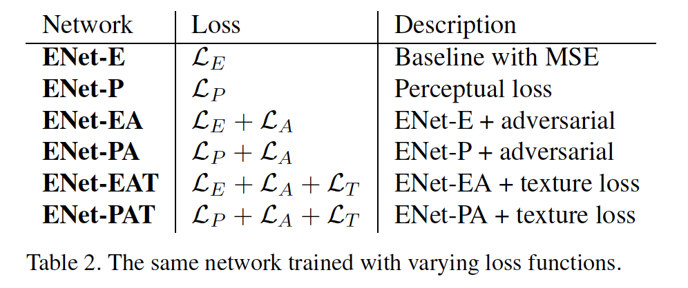

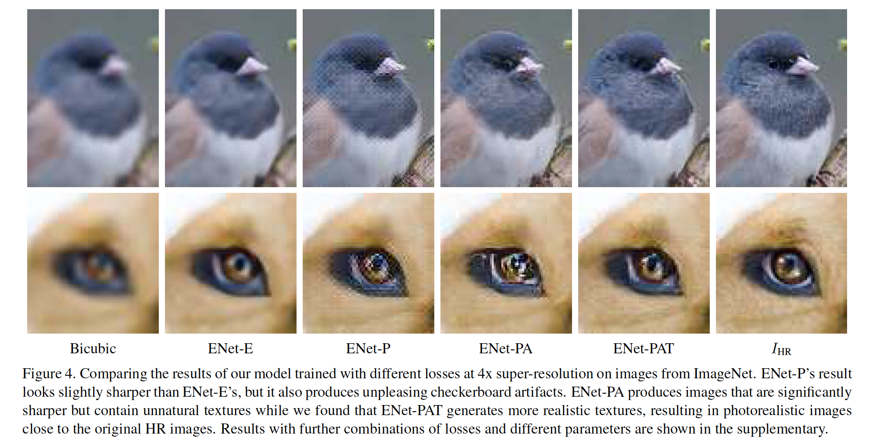

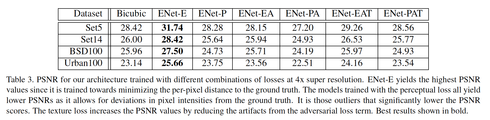

#### 5.2	与其他方法的比较

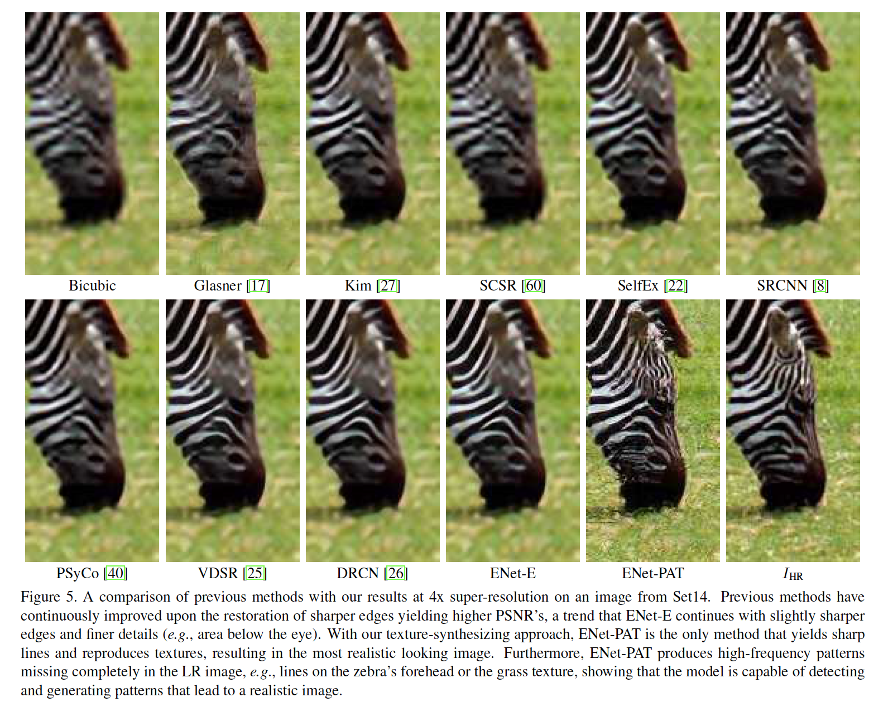

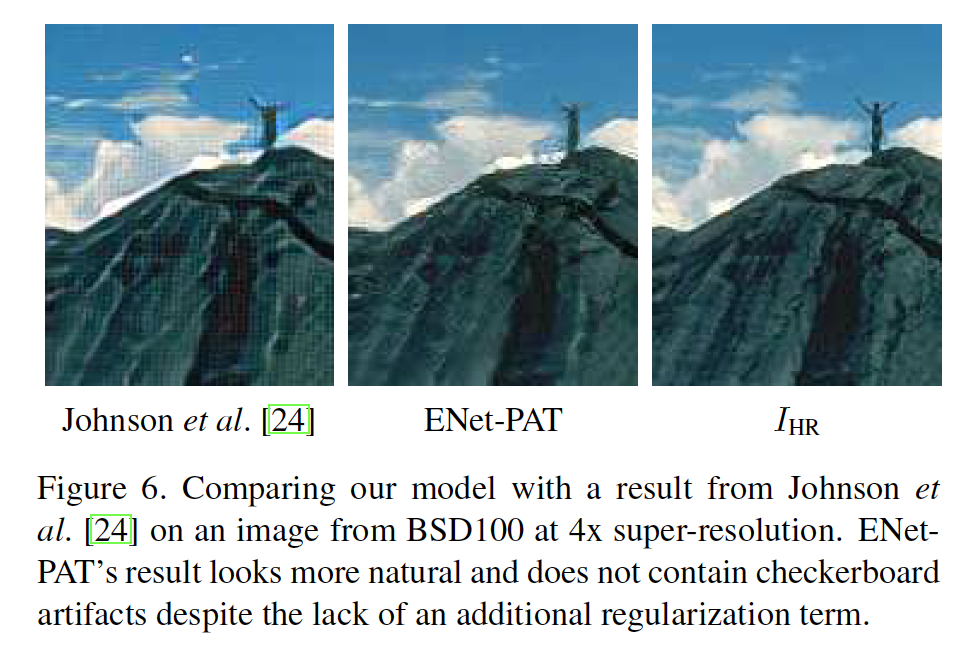

##### 5.2.1  PSNR结果

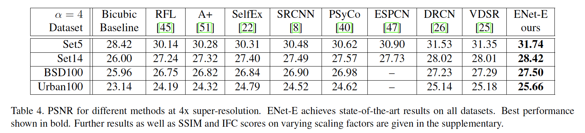

### 6	补充材料

#### 6.1	纹理匹配损失的补丁大小

​		我们计算逐补丁的纹理损失，从而迫使$I_{est}$和$I_{HR}$之间的纹理局部相似。我们发现补丁大小为$16\times16$像素，可以在忠实的纹理生成与图像的整体感知质量之间达到最佳平衡。图1展示了使用大小为$4 \times 4$像素的补丁进行纹理匹配损失训练（ENet-PAT-4）以及在$128\times128$像素的更大补丁上进行计算的ENet-PAT（ENet-PAT-128）。

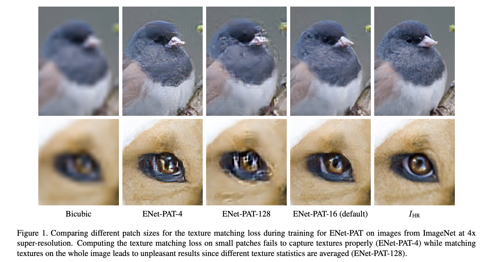

#### 6.2	对抗网络的架构

​		表1展示用于损失项$\mathcal{L}_A$的判别网络的架构。我们遵循常见的设计模式[13]，仅使用卷积层，这些卷积层的大小为$3×3$，步幅长度不同，以将输入的空间尺寸减小到$4×4$像素，在此我们沿其添加两个完全连接的层 在输出端具有S型激活，以产生0到1之间的分类标签。

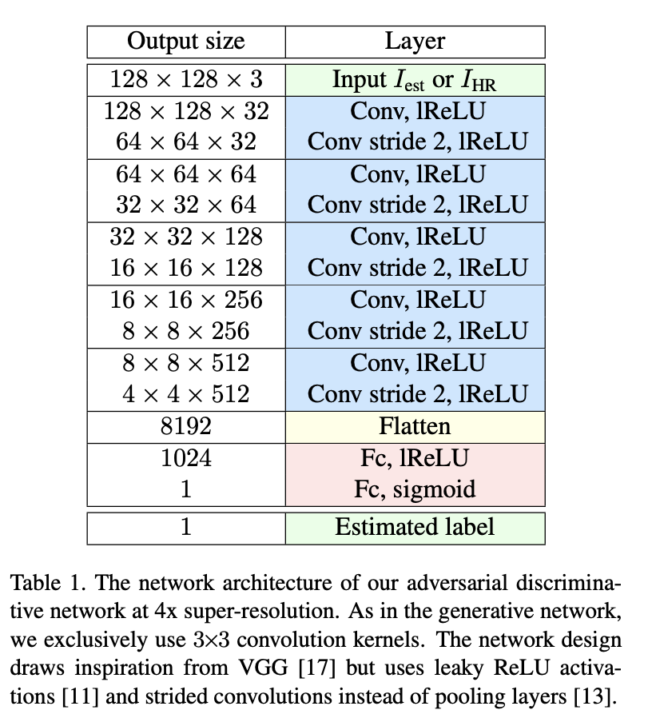