## Accelerating the Super-Resolution Convolutional Neural Network

### 摘要

​		随着深度学习用于超分辨率（SR）的成功，Super-Resolution Convolutional Neural Network（SRCNN）在速度和恢复质量方面都表现出比先前手工特征模型更优越。但是，高计算成本仍妨碍其实际要求实时性能的（4fps）应用。本文中，我们旨在加速当前的SRCNN，并提出沙漏形状的CNN结构进行更快、更好的SR。我们主要在三个方面重新设计SRCNN结构。第一，我们在网络的末端加入反卷积层，然后直接从低分辨率图像（没有插值）到高分辨率图像之间学习映射。第二，我们通过在映射之前缩小输入特征的尺寸并在之后再扩展，来重新构造映射层。第三，我们采用较小的滤波器尺寸，但采用更多的映射层。 所提出的模型可实现40倍以上的速度，甚至具有卓越的恢复质量。 此外，我们介绍了可以在通用CPU上实现实时性能并同时保持良好性能的参数设置。 还提出了一种相应的迁移策略，用于跨不同的放大因子进行快速训练和测试。

### 1	引言

​		单图像超分辨率（SR）旨在从给定的低分辨率（LR）恢复高分辨率（HR）图像。最新的SR算法主要是基于学习（或基于补丁）的方法，其学习LR和HR图像之间的映射。在它们之中，超分辨率卷积神经网络（SRCNN）[1,2]由于其简单的网络结构和出色的恢复质量而备受关注。尽管SRCNN已比先前基于学习的方法快，但是在大型图像上的处理速度依然不能令人满意。例如，为了将$240 \times 240$的图像上采样3倍，原始的SRCNN的速度大约为1.32fps，这远不足以达到实时（24fps）。为了达到实时性，我们应当加速SRCNN至少18倍，同时保持先前的性能。乍一看这听起来是难以置信的，因为仅通过减小参数来加速将严重影响性能。但是，当我们深入研究网络结构时，会发现两个固有的限制，它们会限制其运行速度。

​		首先，作为预处理步骤，原始的LR图像需要使用bicubic插值上采样到期望的大小以构成输入。因此，SRCNN的计算复杂度随HR图像（而不是原始LR图像）的空间大小呈平方增长。对于放大因子$n$，具有插值LR图像的卷积的计算复杂度是原始LR卷积的$n^2$倍。这也是大多数基于学习的SR方法局限。如果直接从原始的LR图像学习网络，那么加速很明显，即大约快$n^2$倍。

​		第二个局限是昂贵的非线性映射步骤。在SRCNN中，输入图像补丁被映射到高维HR特征空间。Dong等[2]证明通过采用更宽的映射层可以显着提高映射精度，但是要花费运行时间。例如，大型SRCNN（SRCNN-Ex）有57184个参数，它的参数量是SRCNN（8032）的6倍。然后，问题是如何缩小网络尺度，并仍能保持先前的准确率。

​		根据上面的观察，我们研究了一种更简洁有效的网络结构，可实现快速准确的图像SR。为了解决第一个问题，我们采用反卷积层来替换bicubic插值。为了进一步缓解计算负担，我们在网络的末端放置反卷积层，然后计算复杂度仅与原始LR图像的空间大小成正比。值得注意的是，反卷积层不等于像FCN [13]那样的传统插值内核的简单替代，也不像[14]那样等于“ unpooling + convolution”。相反，它包含多样的自动学习的上采样核（见图3），这些核联合工作产生最终的HR输出，并且使用统一的插值核替换掉这些反卷积滤波器将导致剧烈的PSNR下降（例如，在**Set5**数据集上至少0.9dB）。

​		对于第二个问题，我们在映射层的开头和结尾分别添加了一个缩小和扩展层，以限制在低维特征空间中的映射。此外，我们将单个宽映射层分解为具有固定滤波器大小$3 \times 3$的的几层。新结构的整体形状如“沙漏”，它是整体上是对称的，两端厚、中间薄。实验结果表明所提出的模型（称为Fast Super-Resolution Convolutional Neural Networks （FSRCNN））获得超过40倍的加速，并且性能比SRCNN-Ex更好。在这项工作中，我们还提出一种小型的FSRCNN网络（FSRCNN-s），其获得与SRCNN相似的恢复质量，但是在通用CPU上，快了17.36倍，并能实时运行（24fps）。如图1所示，FSRCNN网络比现代SR模型快得多，但仍具有出色的性能。

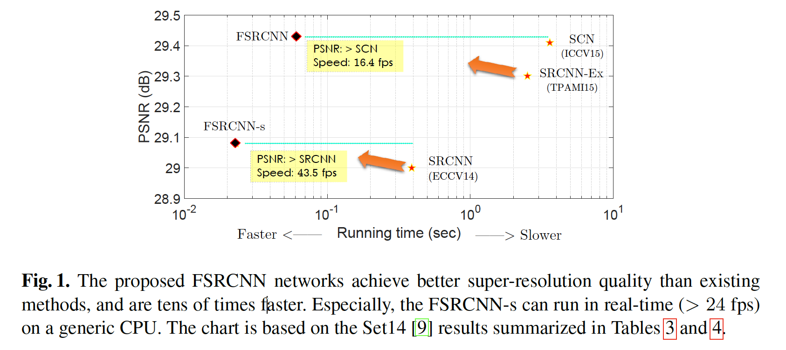

​			除了速度上显著的改进外，FSRCNN还具有另一个吸引人的特性，可以促进对不同放大因子的快速训练和测试。具体而言，在FSRCNN中，不同放大因子的网络可以共享所有卷积层（反卷积层除外）。在训练过程中，通过训练好的网络，我们仅需对反卷积层进行微调，以获得另一个放大因子，而几乎不会丢失映射精度。测试期间，我们仅需要一次卷积操作，并使用对应的反卷积层将图像上采样到不同尺度。

​		我们的贡献有三个方面：1）我们制定了紧凑的沙漏形CNN结构，以实现快速的图像超分辨率。借助一组反卷积滤波器的协作，网络无需进行预处理即可谢谢原始LR和HR图像之间的端到端映射。2）所提出的模型获得接近SRCNN-Ex 40倍的速度，同时仍能保持其期望的性能。小尺寸版的FSRCNN可以在一般CPU上实时运行，并且比SRCNN的恢复质量更好。3）我们将所提出的网络的卷积层转移到不同的放大因子上，以进行快速训练和测试，而不会损失恢复质量。

### 2	相关工作

​		**Deep Learning for SR：**最近，深度学习技术已成功用于SR。先驱工作是Dong等[1、2]提出的超分辨率卷积神经网络。受SRCNN的启发，诸如face hallucination[16]和深度图超分辨率[17]之类的一些问题已取得了最新的成果。[18]和[19]中也探索更深的结构。与传统基于学习的方法不同，SRCNN直接学习LR和HR图像之间的端到端映射，产生快速而准确推理。SRCNN和基于稀疏编码的方法之间的固有关系确保了其良好的性能。基于相同的假设，Wang等人[8]进一步用一组稀疏编码子网络代替了映射层，并提出了一种基于稀疏编码的网络（SCN）。凭借传统的基于稀疏编码的方法的领域专业知识，它以较小的模型尺寸胜过SRCNN。但是，由于严格模拟稀疏编码求解器，因此很难在不损失映射精度的情况下缩小稀疏编码子网。此外，所有这些网络需要处理bicubic-放大的LR图像。所提出的FSRCNN不仅在原始的LR图像上进行，还包含更简单、更高效的映射层。此外，先前的方法必须针对特定的放大因子训练完全不同的网络，而FSRCNN仅需要不同的反卷积层。这也为我们提供了一种将图像放大到几种不同尺寸的更快方法。

​		**CNN加速：**许多研究调查了CNN的加速。Denton等[20]首先研究目标检测中CNN设计的冗余。然后，Zheng等[21]尝试为图像分类加速非常深的CNN。他们还考虑了非线性单位，并通过非对称重建减少了累积误差。我们的模型还旨在以不同的方式加速CNN。首先，他们关注近似现有训练好的模型，而我们重新制定了以前的模型并获得了更好的性能。其次，以上方法都是针对高级视觉问题（例如图像分类和物体检测）而设计的，而我们的方法是针对低级视觉任务的。由于SR的深度模型不包含全连接层，因此卷积滤波器的近似值将严重影响性能。

### 3	Fast Super-Resolution by CNN

​		我们首先简要描述SRCNN [1,2]的网络结构，然后详细介绍如何逐层重新构造网络。 FSRCNN和SRCNN之间的差异将在本节末尾介绍。

#### 3.1	SRCNN

​		SRCNN旨在学习bicubic插值LR图像$Y$与HR图像$X$之间的端到端映射函数$F$。网络仅包含卷积层，因此输出的大小与输入图像相同。如图2描述的，整体结构包含与基于稀疏编码的方法类似的三个部分。补丁提取和表示部分是指第一层，它从输入中提取补丁并将每个补丁表示为高维特征向量。非线性映射部分为中间层，其将特征向量非线性映射到另一组特征向量，或者成为HR特征。然后，最后的重建部分聚合这些特征以构成最终的输入图像。

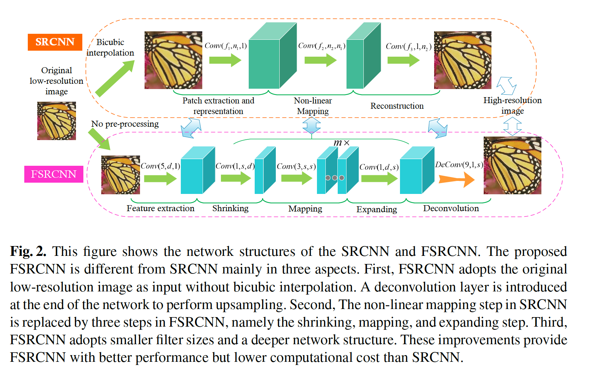

​			网络的计算复杂度可以计算如下：

$$O\{(f_1^2n_1 + n_1f_2^2n_2 + n_2f_3^2)S_{HR}\},\tag{1}$$

其中$\{f_i\}_{i=1}^3$和$\{n_i\}_{i=1}^3$分别为滤波器的大小和滤波器的数量。$S_{HR}$为HR图像的大小。我们观察到复杂度与HR图像的大小成比例，并且中间层对网络参数量的贡献最多。在下一节中，我们通过特别关注这两个方面来介绍FSRCNN。

#### 3.2	FSRCNN

​		如图2所示，FSRCNN可以分解为5个部分——特征提取、shrinking、mapping、expanding和deconvolution。前四个部分为卷积层，而最后一层是反卷积层。为了更好的理解，我们将卷积层表示为$Conv(f_i,n_i,c_i)$，将反卷积层表示为$DeConv(f_i,n_i,c_i)$，其中变量$f_i,n_i,c_i$分别表示滤波器大小、滤波器数量和通道数量。

​		由于网络包含数十个变量（即$\{f_i,n_i,c_i\}_{i=1}^6$），研究它们中的每一个是不可能的。因此，我们预先为不敏感变量分配了一个合理的值，而未设置敏感变量。当变量的微小变化会严重影响性能时，我们将其称为敏感变量。这些敏感变量始终代表SR中一些重要的影响因素，这些将在以下说明中显示。

​		**Feature extraction：**这一部分与SRCNN的第一部分相似，但是输入图像存在不同。FSRCNN在原始的LR图像进行特征提取，而没有插值。为了与SRCNN区别，我们将小型的LR输入表示为$Y_s$。通过与第一组滤波器进行卷积，输入的每个补丁（1像素重叠）都表示为高维特征向量。

​		关于参数$f_1, n_1, c_1$的选择，我们参考SRCNN。在SRCNN中，第一层的滤波器大小设置为0.9。注意，这些滤波器在放大的图像$Y$上进行。$Y$中的大多数像素来自$Y_s$的插值，$Y_s$上的$5 \times 5$补丁可以覆盖$Y$上的$9 \times 9$补丁中几乎所有信息。因此，我们可以采用更小的滤波器尺寸$f_1=5$，而几乎没有信息损失。对于通道的数量，我们遵循SRCNN，设置$c_1 = 1$。然后，我们仅需要确定滤波器的数量$n_1$。从另一个角度，$n_1$可以视为LR特征维度的数量，表示为$d$——第一个敏感变量。最后，第一层可以表示为$Conv(5,d,1)$。

​		**Shrinking：**在SRCNN中，映射步骤一般在特征提取步骤之后，然后将高维LR特征直接映射到HR特征空间。但是，因为LR特征维度$d$通常很大，所以映射步骤的计算复杂度很高。在一些用于高级视觉任务的深度模型也观察到这种现象。[22]的作者使用$1 \times 1$层来节约计算成本。

​		本着相同的考虑，我们在特征提取层之后添加shrinking层来减小LR特征维度$d$。我们将滤波器的大小固定为$f_2=1$，然后如LR特征中的线性组合一样进行滤波。通过使用更小的滤波器数$n_2 = s \ll d$，LR特征维度从$d$减小到$s$。这里，$s$为第二个敏感变量，其确定shrinking的级别，第二层可以表示为$Conv(1,s,d)$。这种策略极大减小参数量（详细计算见3.3节）。

​		**Non-linear mapping：**非线性映射步骤是影响SR性能的最重要部分，影响最大的因素是映射层的宽度（即一层中的滤镜数量）和深度（即层数） 。如SRCNN[2]指出的，$5 \times 5$层获得的结果远好于$1 \times 1$层。但是，他们缺乏在非常深的网络上的实验。上述经验有助于为FSRCNN构建更高效的映射层。首先，作为性能和网络规模之间的权衡，我们采用中间滤波器大小$f_3 = 3$。然后，为了维持与SRCNN相同的性能，我们使用多个$3 \times 3$层来替换单一宽度层。映射层的数量是另一个敏感变量（表示为$m$），这决定映射准确率和复杂度。为了一致，所有映射层包含相同的滤波器数$n_3 = s$。然后，非线性映射部分可以表示为$m \times Conv(3,s,s)$。

​		**Expanding：**expanding层作为shrinking层的逆过程。为了计算效率，shrinking操作减少了LR特征维数。但是，如果我们直接从这些地位特征山生成HR图像，最终的恢复质量将很差。因此，我们在映射部分后添加expanding层来放大HR特征维度。为了保持与shrinking层的一致，我们使用$1 \times 1$滤波器，其数量与LR特征提取层相同。与shrinking层$Conv(1,s,d)$相反，expanding层为$Conv(1,d,s)$。实验表明，没有expanding层，在Set5测试集上的性能会小将0.3dB。

​		**Deconvolution：**最后一部分是反卷积层，其利用一组反卷积滤波器上采样和聚合先前的特征。反卷积可以视为卷积侧逆操作。对于卷积，滤波器以步长$k$卷积图像，并且输出为输入的$1/k$。相反，如果我们改变输入和输出的位置，输出为输入的$k$倍，如图4所示。我们利用这种属性，将步长设置为$k=n$，其为期望的放大因子。然后，输出直接是重建的HR图像。

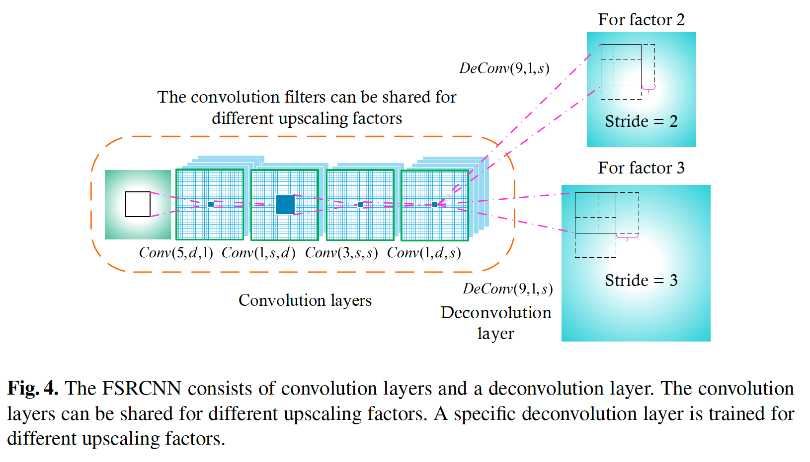

​		当我们确定反卷积滤波器的大小时，我可以从另一个角度看待网络。有趣的是，反向网络就像一个缩小运算，它接受HR图像并输出LR图像。然后，反卷积层变为步长为$n$的卷积层。因为从HR图像提取特征，所以我们应当采用$9 \times 9$的滤波器，其与SRCNN的第一层一致。相似地，如果反转回来，反卷积滤波器的应当有空间尺寸$f_5 = 9$。实验也证明这种假设。图3展示学习到的反卷积滤波器，这些滤波器的模式与SRCNN的第一层非常相似。最后，我们可以将反卷积层表示为$DeConv(9,1,d)$。

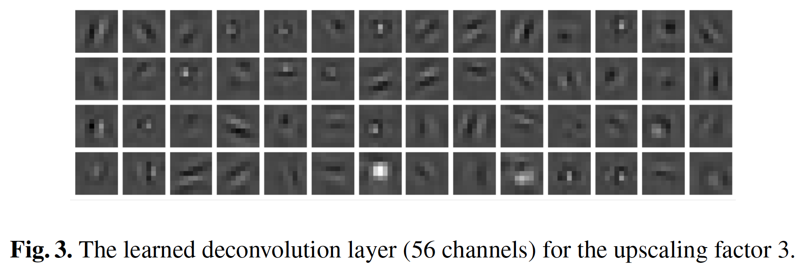

​		与在网络中插入传统插值核（例如，双三次或双线性）[13]或使用“unpooling+convolution” [14]不同，反卷积层为输入特征图学习了一组上采样核。如果我们迫使这些核相同，则将无法有效地使用参数（等于将输入特征图合计为一个），并且Set5的性能将下降至少0.9 dB。

​		**PReLU：**对于每个卷积层后的激活函数，我们建议使用PReLU，而不是常用的ReLU。它们在负数部分的系数上有所不同。对于ReLU和PReLU，我们可以将通用激活函数定义为$f(x_i) = \max(x_i,0) + a_i \min(0, x_i)$，其中$x_i$为激活函数$f$在第$i$通道上输入信号，$a_i$为负部分的系数。对于ReLU，固定参数$a_i$为零，而对于PReLU为可学习参数。我们选择PReLU以避免由ReLU中的零梯度引起的“dead features”。然后，我们充分利用所有参数来测试不同网络设计的最大容量。实验表明，PReLU激活网络的性能更稳定，并且可以看作是ReLU激活网络的上端。

​		**整体结构：**我们可以连接上述五个部分以形成完整的FSRCNN网络，$Conv(5,d,1)-PReLU-Conv(1,s,d)-PReLU-m \times Conv(3,s,s)-PReLU-Conv(1,d,s)-PReLU-DeConv(9,1,d)$。整体上，有三个控制性能和速度的敏感变量（即LR特征维度$d$、shrinking滤波器的数量$s$和映射深度$m$）。为了简单起见，我们将FSRCNN网络表示为$FSRCNN(d,s,m)$。计算复杂度计算为：

$$O\{(25d + sd + 9ms^2 + ds + 81d)S_{LR}\} = O\{(9ms^2 + 2sd + 106d)S_{LR}\}.\tag{2}$$

我们排除PReLU的参数，PReLU引入可忽略的计算成本。有趣的是，新结构看起来像沙漏，其在整体上是对称的，两端厚，中间薄。这三个敏感变量只是沙漏外观的控制参数。实验表明，这种沙漏设计对于图像超分辨率非常有效。

​		**Cost function：**遵循SRCNN，我们采用MSE作为成本函数，优化目标表示为

$$\min_{\theta}\frac{1}{n}\sum_{i=1}^n\|F(Y_s^i;\theta) - X^i\|_2^2,\tag{3}$$

其中$Y_s^i$和$X^i$为训练数据中第$i$个LR和HR子图像对，$F(Y_s^i;\theta)$为具有参数$\theta$的$Y_s^i$的输出。所有参数使用SGD优化。

#### 3.3	Differences against SRCNN: From SRCNN to FSRCNN

​		为了更好理解我们是如何加速SRCNN，我们在三个步骤中将SRCNN-Ex转换为另一个FSRCNN（56,12,4），并展示每个步骤获得了多少加速和PSNR增益。我们使用代表性的放大因子$n=3$。SRCNN、FSRCNN和两个过渡状态的配置见表1。我们还展示它们在91张图像数据集[10]上训练的性能（在Set5上的平均PSNR）。

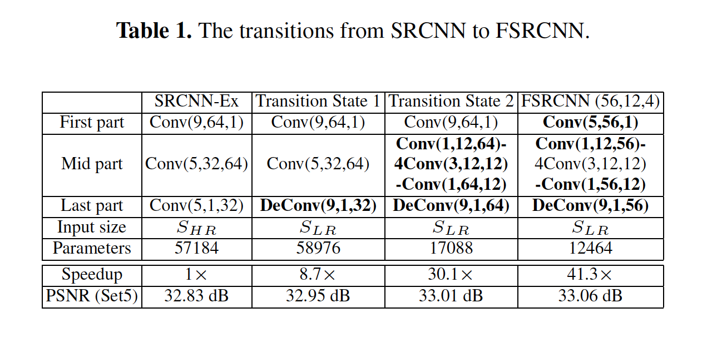

​		首先，我们将SRCNN-Ex的最后一层卷积替换为反卷积层，然后整个网络在原始的LR图像执行，并且计算复杂度与$S_{LR}$（而不是$S_{HR}$）成正比。这一步扩大网络尺度，但是获得8.7倍的加速（即$57184/58976 \times 3^2$）。因为学习到的反卷积核比单一bicubic核好，性能大致增加0.12dB。第二，将单个映射层替换为shrinking层、4个映射层和expanding层的组合。总体而言，还有5层，但参数从58976减少到17088。另外，此步骤之后的加速度是最明显的——$30.1$倍。广泛观察到深度是影响性能的关键因素。这里，我们使用四个“narrow”层来替换单个“wide”层，因此在更少参数的情况下，获得更好的结果（33.01dB）。最后，我们采用更小的滤波器大小和更少的滤波器（例如从$Conv(9,64,1)$到$Conv(5,56,1)$），并获得最终的41.3倍加速。因为我们删除一些冗余参数，网络训练更有效，并获得另外0.05dB的改进。

​		值得注意的是，这种加速并非以性能下降为代价。相反，FSRCNN（56，12，4）大幅领先SRCNN-Ex。在上面的分析中已经介绍了高性能的主要原因。 这是我们的方法与其他CNN加速工作之间的主要区别[20,21]。 但是，在保证良好性能的情况下，更容易与其他加速方法配合使用以获得更快的模型。

#### 3.4	SR for Different Upscaling Factors

​		与以前的基于学习的方法相比，FSRCNN的另一个优势在于，FSRCNN可以在不同的提升因素之间实现快速的训练和测试。我们发现，总体上所有卷积层的行为都类似于LR图像的复杂特征提取器，只有最后一个反卷积层包含放大系数的信息。实验也证明了这一点，其中对于不同的放大因子，卷积滤波器几乎相同。 借助此属性，我们可以迁移卷积滤波器以进行快速训练和测试。

​		在实践中，我们预先训练了一个用于放大因子的模型。然后，在训练过程中，我们仅需对反卷积层进行微调以获得另一个放大系数，而使卷积层保持不变。这种微调很快，并且性能与从头训练一样好（见4.4节）。在测试期间，我们执行一次卷积运算，并使用相应的反卷积层将图像上采样到不同大小。如果我们需要同时应用多个放大系数，则此属性可以导致更快的测试（如图4所示）。

### 4	实验

#### 4.1	实验细节

​		**训练数据集**	91-图像数据集被广泛用作基于学习的SR方法的训练集[10、5、1]。由于深度模型通常受益于大数据，因此研究发现91张图像不足以将深度模型推向最佳性能。Yang等[24]和Schulter等[7]使用BSD500数据集。但是，BSD500中的图像是JPEG格式，这对于SR任务不是最优的。因此，我们贡献新的Genera-100数据集，该数据集包含100张bmp格式图像（没有压缩）。新引入的100张图像的尺寸范围从$710 \times 704$到$131 \times 112$。它们的质量都很好，边缘清晰，但光滑区域（例如天空和海洋）较少，因此非常适合SR训练。在接下来的实验中，除了使用91-图像数据进行训练外，我们还将评估General-100数据集和91图像数据集的联合集对训练网络的适用性。为了充分利用数据集，我们还采用[8]中的数据增强。我们使用两种方式增强数据，1）Scaling：每张图像以0.9、0.8、0.7和0.6的因子缩小，2）Rotation：每张图像以90、180和270的度数旋转。然后，我们有$5 \times 4 - 1 = 19$倍的图像进行训练。

​		**测试和验证数据集**	遵循SRCNN和SCN，我们使用Set5、Set14和BSD200数据集进行测试。选择来自BSD500验证集的20张图像进行验证。

​		**训练样本**	为了准备训练数据，我们首先以所需的尺度因子$n$对原始训练图像进行降采样以形成LR图像。然后，我们以步长$k$将LR训练图像裁剪为一组$f_{sub} \times f_{sub}$像素的子图像。也要冲ground-truth图像裁剪相应的HR子图像（具有尺寸$(xf_{sub})^2$）。这些LR/HR图像对是基本训练数据。

​		对于填充问题，我们通过实验发现填充输入或输出图对最终性能几乎没有影响。因此，我们根据滤波器尺寸在所有层中采用零填充。使用这种方法，不需要为不同的网络设计改变子图像的尺寸。另一影响子图大小的问题是反卷积层。因为我们利用_Caffe_训练我们的模型，它的反卷积滤波器会生成大小为$(nf_{sub} - n +1)^2$（而不是$(nf_{sub})^2$）的输出。因此，我们在HR子图像上还要裁剪$(n-1)$像素的边界。最终，对于2、3和4倍尺度因子，我们将LR/HR子图像分别设置为$10^2/19^2$、$7^2/19^2$和$6^2/21^2$。

​		**训练策略**	为了与最先进方法比较，我们使用91-image数据集训练。此外，我们还探索两步训练策略。首先，我们利用91-image数据集从头训练网络。然后，当训练饱和时，我们添加General-100数据集进行微调。利用这种策略，与从一开始就使用两个数据集进行训练相比，训练收敛的时间要早得多。

​		当利用91-image数据集训练时，卷积层的学习率设置为$10^{-3}$，反卷积层的学习率设置为$10^{-4}$。然后，微调期间，所有层的学习率减半。对于初始化，卷积滤波器的权重利用为PReLU的设计的方法初始化。因为我们在网络末端没有激活函数，通过与SRCNN相同的方法初始化反卷积滤波器（即服从均值为0、标准差为0.001的高斯分布）。

#### 4.2	不同设置的研究

​		为了测试FSRCNN结构的特性，我们设计了一组控制实验，其中使用了三个敏感变量（LR特征维度$d$、shrinking滤波器的数量$s$和映射深度$m$）的不同值。具体而言，我们选择$d=48,56$、$s=12,16$以及$m=2,3,4$，因此我们进行具有不同组合的共计$2 \times 2 \times 3=12$组实验。

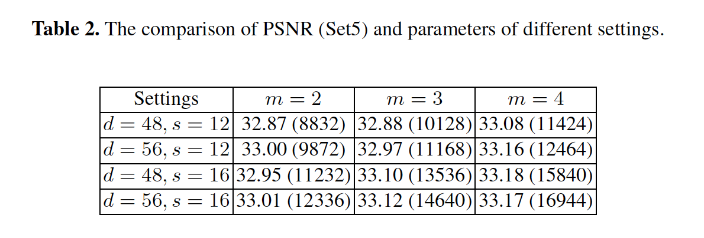

​		这些实验的Set5数据上的平均PSNR值如表2所示。我们在两个方向分析结果，即表中水平和垂直方向。首先，我们固定$d,s$，并测试$m$的影响。显然，$m=4$产生比$m=2$和$m=3$更好的结果。从图5（a）所示的收敛曲线也可以观察到这种趋势。其次，我们固定$m$，实验$d$和$s$的影响。一般而言，更好的结果通常需要更多的参数（例如更大的$d$或$s$），但是更多参数不能始终保持更好的结果。图5（b）中也反应了这种趋势，其中我们可以看出三个最大的网络一起收敛。根据所有结果，我们找到性能和参数之间的最好平衡——FSRCNN（56，12，4），其获得具有合适参数量的最高结果之一。

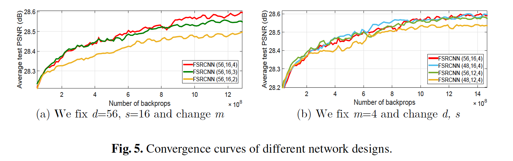

​		值得注意的是，最小网络FSRCNN（48，12，2）获得32.87dB的平均PSNR，这已经高于[2]中报告的SRCNN-Ex（32.75dB）。FSRCNN（48，12，2）仅包含8832个参数，然后是SRCNN-Ex的$57184/8832 \times 9 = 58.3$倍加速。

#### 4.3	Towards Real-Time SR with FSRCNN

​		现在，我们想要找出更精准的FSRCNN网络，其可以实时SR，同时仍保持良好性能。首先，我们计算多少个参数可以满足实时实现（24 fps）的最低要求。 如引言提到的，SRCNN将图像上采样到$760 \times 760$的速度是1.32fps。放大因子为3，SRCNN有8032个参数。然后，根据公式1和公式2，期望的FSRCNN网络最多有$9032 \times 1.32/24 \times 3^2 \approx 3976$个参数。为了达到这一目标，我们找出合适的配置——FSRCNN（32，5，1）包含3937个参数。利用我们的C++测试代码，FSRCNN（32，5，1）的速度达到24.7fps，满足实时要求。此外，FSRCNN（32，5，1）甚至好于SRCNN（9-1-5）（见表3和表4）。

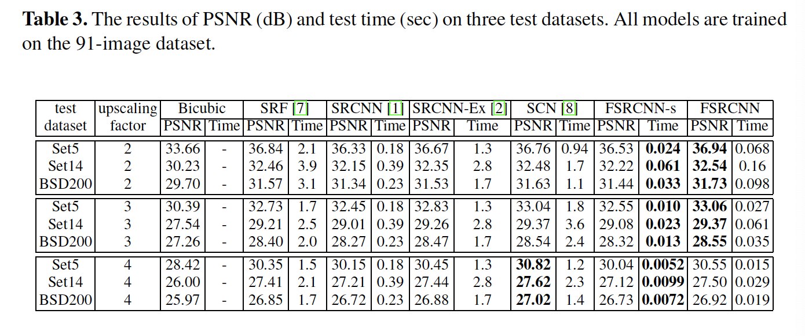

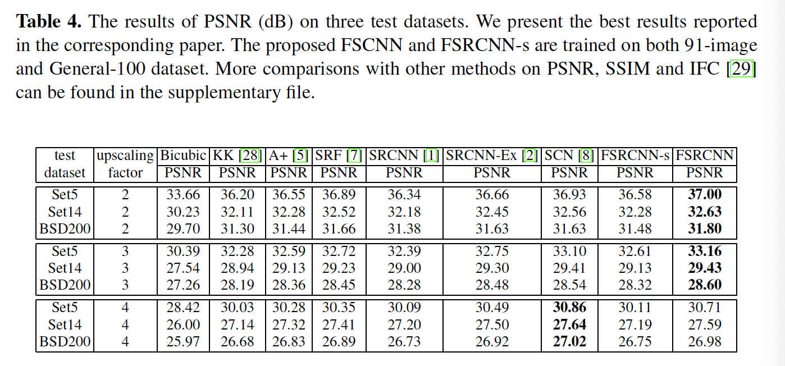

#### 4.4	Experiments  for Different Upscaling Factors

​		与已有的需要为不同放大因子从头训练网络的方法不同，提出的FSRCNN通过迁移卷积滤波器，可以在各种放大因子之间灵活地学习和测试（第3.4节）。我们证明在本节中展示这种灵活性。我们选择FSRCNN（56，12，4）作为默认网络。因为我们在放大因子3下获得训练好的模型，然后，我们基于3倍放大因子的网络训练2倍放大因子的网络，训练好的网络中所有卷积滤波器的参数被迁移到2倍放大因子的网络。训练期间，我们仅在91-image和General-100数据集上微调2倍放大因子网络的反卷积层。为了公平比较，我们还从头训练另外一个2倍放大因子的网络。这两个网络的收敛曲线见图6。显然，利用迁移的参数，网络可以非常快速地收敛（仅几个小时），并且具有与训练表相同的良好性能。在接下来的实验中，我们仅从头训练3倍放大因子的网络，并为2倍和4倍放大因子的网络微调相应的反卷积层。

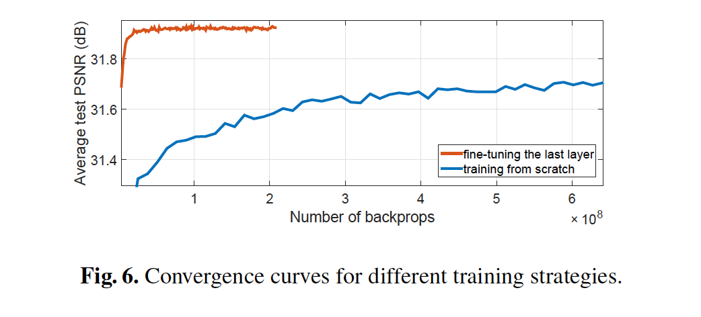

#### 4.5	Comparison with State-of-the-Arts

​		**使用相同的训练集比较**	首先，我们将我们的方法与四种基于外部学习的基于学习的最新SR算法进行比较，即超分辨率随机森林（SRF）、SRCNN、SRCNN-Ex以及基于稀疏编码的网络（SCN）。这些方法的实现全是基于它们的释放的源代码。由于它们使用不同程序语言编写，测试时间比较可能不公平，但仍反应主要的趋势。为了在恢复质量上进行公平比较，在增强的91-image数据集上训练所有模型，因此结果与其论文中对应的结果略有不同。我们选择两种代表性的FSRCNN网络——FSRCNN（FSRCNN（56，12，4）的简称）和FSRCNN-s（FSRCNN（32，5，1）的简称）。推理时间使用C++实现，在Intel i7 CPU 4.0GHz上测试。不同放大因子的量化结果（PSNR和测试时间）见表3。我们首先关注测试时间，这是我们工作最关注的。所提出的FSRCNN毫无疑问是最快的方法，它至少是SRCNN-Ex、SRF和SCN（上采样因子为3）的40倍，同时最快的FSRCNN-s可以在几乎所有有测试图像上获得实时性能（$> 24 \mbox{fps}$）。此外，FSRCNN在PSNR值上仍然优于先前的方法，尤其是对于2倍和3倍放大因子。我们还注意到，FSRCNN在4倍因子上获得略低的PSNR。这主要是因为SCN采用两个3倍上采样的模型将图像上采样4倍。我们还尝试这种策略，并获得相当的结果。但是，因为我们更关注速度，所以我们仍介绍单网络的结果。

​		**使用不同训练集（遵循文献）进行比较**	为了遵循文献，我们还将比较相应论文中报告的最佳PSNR结果，如表4所示。我们还添加另外两种比较方法——KK[28]和A+[5]。注意，这些方法使用不同数据集获得，我们的方法在91-image和General-100数据集上训练。根据表4，我们可以看到，在大多数放大因子和数据集上，所提出的FSRCNN仍然优于其他方法。我们还根据表5和表6中的SSIM和IFC [29]进行了全面比较，我们观察到了相同的趋势。FSRCNN的重建图像（如图7和8所示）、更多示例（可在项目页面上找到）比其他结果更锐利、更清晰。另一方面，小型模型（FSRCNN-s和SRCNN）的恢复质量比大型模型（SRCNN-Ex、SCN和FSRCNN）略差。在图7中，我们可以在FSRCNN-s和SRCNN的结果中观察到一些“锯齿”或振铃效应。

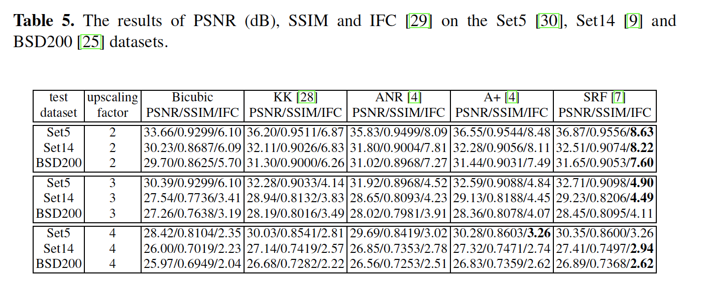

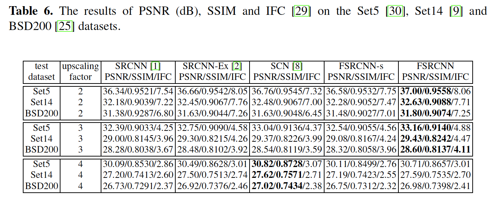

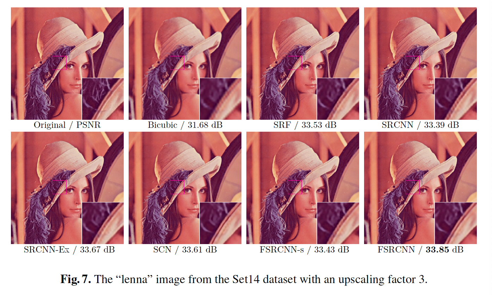

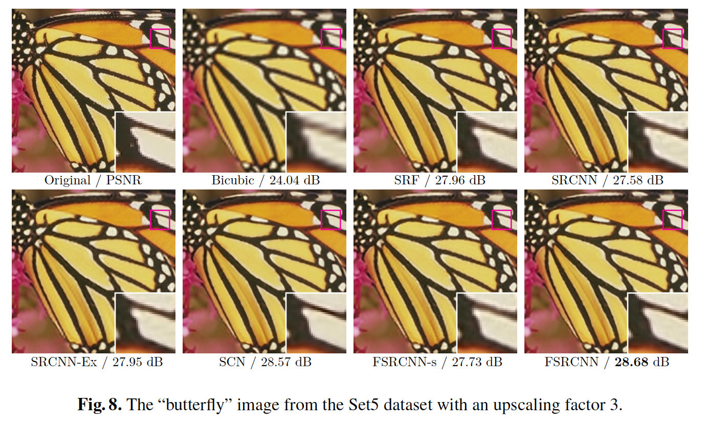