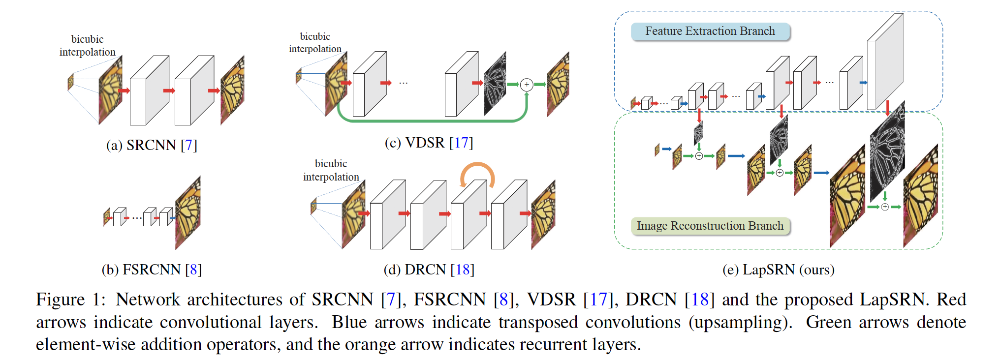
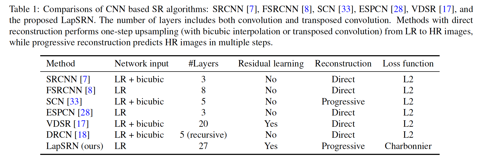
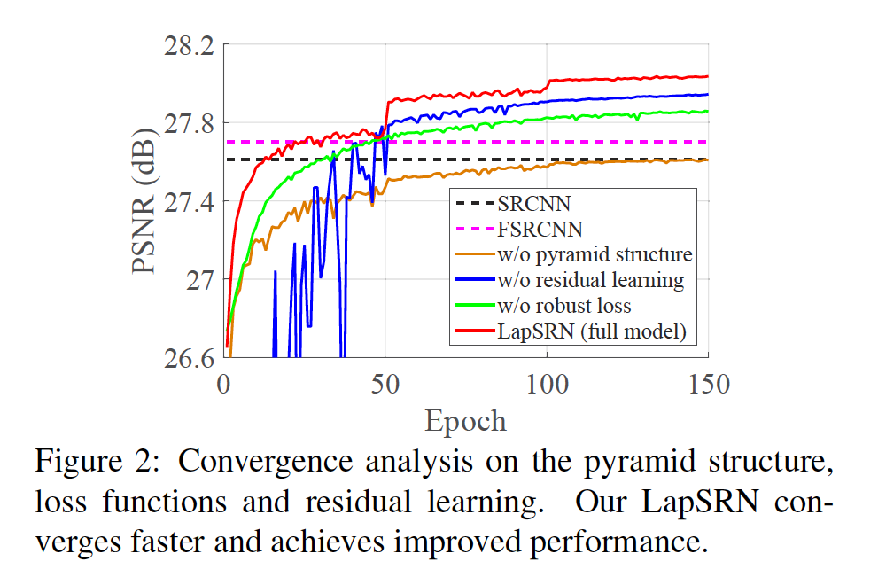
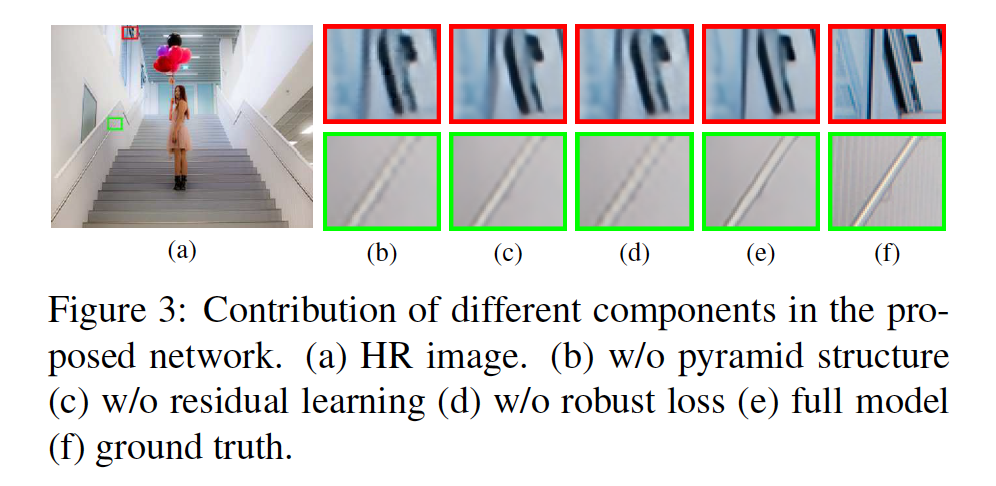
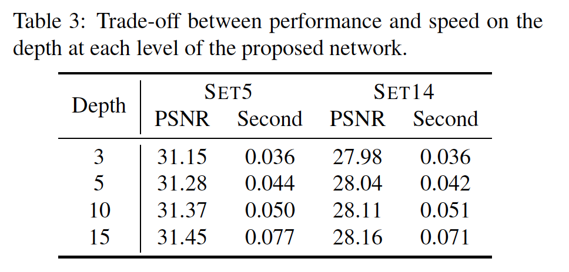
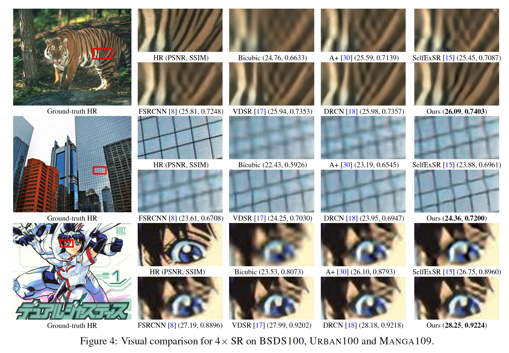
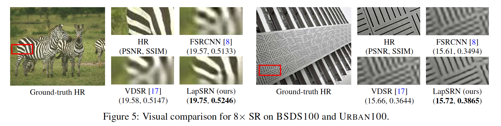
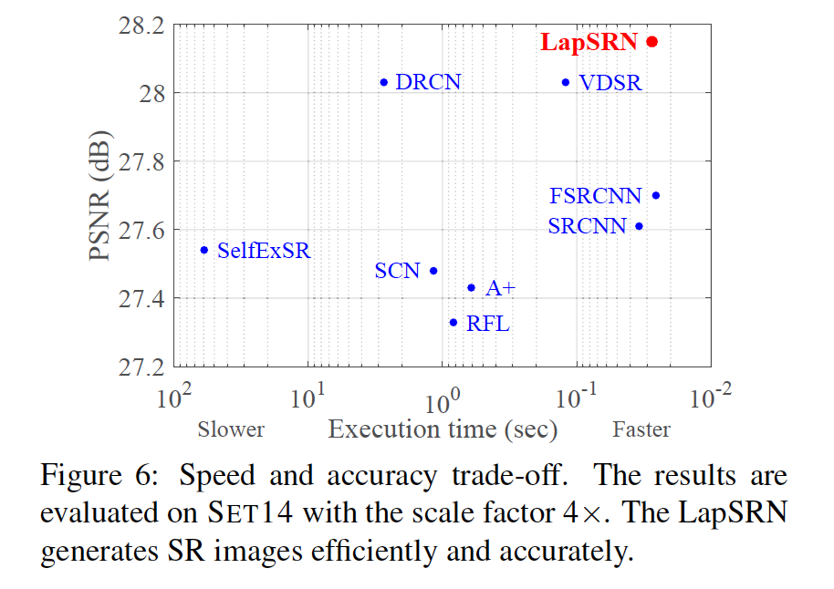
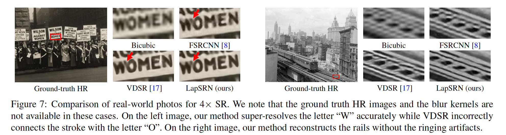
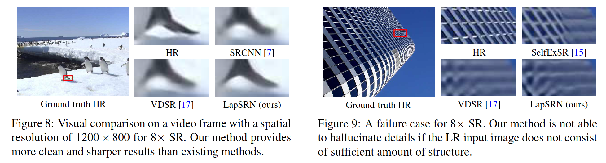

## Deep Laplacian Pyramid Networks for Fast and Accurate Super-Resolution

### 摘要

​		卷积神经网络最近证明了单图像超分辨率的高质量重建。在这篇论文中，我们提出Laplacian Pyramid Super-Resolution Network（LapSRN），以逐步重建高分辨率图像的子带残差（sub-band residual）。在每个金字塔层，我们的模型采用粗糙分辨率的特征图作为输入预测高频残差，并使用转置卷积上采样到更精细的级别。我们的方法不需要bicubic插值作为预处理步骤，并因此极大地减小计算复杂度。我们使用鲁棒的Charbonnier损失函数在深度监督下训练提出的LapSRN，并实现高质量的重建。此外，我们的网络通过渐进式重建在一次前馈中生成多尺度预测，从而促进了资源感知型应用。对基准数据集的大量定量和定性评估表明，在速度和准确性方面，所提出的算法在性能方面优于最新方法。

### 1. 引言

​		单图像超分辨率（SR）旨在从单幅低分辨率（LR）输入图像中重建高分辨率（HR）图像。近年来，基于示例的SR方法通过使用大型图像数据库学习从LR到HR图像补丁的映射，展示了最新的性能。许多学习算法已被用于学习这种映射，包括字典学习[37、38]、局部线性回归[30、36]和随机森林[26]。

​		最近，Dong等[7]提出Super-Resolution Convolutional Neural Network 

（SRCNN）来学习LR到HR的非线性映射。网络被扩展为嵌入基于稀疏编码的网络[33]或使用更深的结构[17]。虽然这些模型显示出令人鼓舞的结果，但存在三个主要问题。第一，已有的方法，在使用网络进行预测之前，使用预定义的上采样操作（bicubic插值）来将输入图像放大到期望的空间分辨率。这种预处理步骤增加不必要的计算成本，并通常产生可见的重建伪像。几种算法通过在LR图像进行卷积以及利用亚像素卷积或转置卷积（也称为反卷积）来替换预定义的上采样操作，从而加速SRCNN。但是，这些方法使用相对较小的网络，由于有限的网络容量，并不能很好地学习复杂的映射。第二，已有的方法利用$l_2$损失优化网络，因此不可避免地生成模糊预测。因为$l_2$损失无法捕获HR补丁的潜在多模态分布（即同一LR补丁可能具有许多对应的HR补丁），因此重建的HR图像通常过于平滑，并且与自然图像上的人眼视觉不接近 。第三，大多数方法在一步上采样中重建HR图像，这加大大尺度因子（例如8倍）的训练难度。此外，已有的方法不能生成多个分辨率的中间SR预测。结果，需要针对具有不同期望上采样尺度和计算负荷的各种应用来训练各种各样的模型。

​		为了处理这些问题，我们提出了基于级联的卷积神经网络（CNN）的拉普拉斯金字塔超分辨率网络（LapSRN）。我们的网络采用LR图像作为输入，并以粗糙到精细的形式、渐近地预测sub-band残差。在每层中，我们首先应用级联的卷积层来提取特征图。然后，我们使用转置卷积将特征图上采样到更精细的层。最后，我们使用卷积层来预测sub-band残差（相应层中上采样图像和ground-truth HR图像之间的差异）。每层的预测残差用于通过上采样和加法操作有效地重建HR图像。虽然所提出的LapSRN包含一组级联的子网络，我们利用鲁棒的Charbonnier损失函数以端到端的形式训练网络（即没有逐阶段的优化）。正如图1（e）描述的，我们的网络架构自然可以进行深度监督（即可以在金字塔的每个级别上同时应用监督信号）。

​		我们的方法与已有的基于CNN方法的不同之处有三个方面：

（1）**准确率**	所提出的LapSRN直接从LR图像提取特征图，并与深度卷积层联合优化以预测sub-band 残差。由于能够更好地处理离群值，对Charbonnier损失进行了深入的监督，从而提高了性能。 结果，我们的模型具有学习复杂映射的能力，并有效地减少了不需要的视觉伪像。

（2）**速度**	我们的LapSRN拥有快速的处理速度和高容量的深度网络。实验结果表明，我们的方法比几个基于CNN的超分辨率模型更快，例如SRCNN [7]、SCN [33]、VDSR [17]和DRCN [18]。与FSRCNN [8]相似，我们的LapSRN在大多数评估数据集上都实现了实时速度。 另外，我们的方法提供了明显更好的重建精度。

（3）**Progressive reconstruction**	我们的模型使用拉普拉斯金字塔通过渐进式重建在一次前馈中生成多个中间SR预测。这一特性使我们的技术适用于需要资源感知适应性的广泛应用。例如，根据可用的计算资源，可以使用同一网络来增强视频的空间分辨率。对于计算资源有限的情况，我们的8倍模型仍然可以通过简单地绕过更精细级别的残差计算来执行2倍或4倍SR。 但是，现有的基于CNN的方法不提供这种灵活性。

### 2. 相关工作和问题背景

​		文献中已经提出了许多单图像超分辨率方法。 在这里，我们将讨论的重点放在最近的基于示例的方法上。

​		**基于内部数据库的SR**	几种方法[9、12]利用自然图像中的自相似性，并基于低分辨率输入图像的比例空间金字塔构造LR-HR补丁对。尽管内部数据库比外部图像数据库包含更多相关的训练补丁，但LR-HR补丁对的数量可能不足以覆盖图像中的较大纹理变化。Singh等[29]将补丁分解为定向频率sub-band，并独立确定每个sub-band金字塔中的更好匹配。Huang等[15] 扩展补丁搜索空间，以适应仿射变换和透视变形。 基于内部数据库的SR方法的主要缺点是，由于尺度空间金字塔中补丁搜索的大量计算成本，它们通常很慢。

​		**基于外部数据库的SR**	许多SR方法使用监督学习算法从外部数据库收集的图像对中学习LR-HR映射，例如最近邻居[10]，流形嵌入[2、5]，核岭回归[19]和稀疏表示[37、 38、39]。除了直接在整个数据库上对复杂的补丁空间进行建模外，还有几种方法通过K-均值[36]、稀疏字典[30]或随机森林[26]对图像数据库进行分区，并为每个聚类学习局部线性回归。

​		**基于卷积神经网络的SR**	与在补丁空间中建模LR-HR映射相比，SR-CNN联合优化所有这些步骤，并在图像空间学习非线性映射。VDSR网络[17]通过将网络深度从3个卷积层增加到20个，证明比SRCNN [7]有显着改进。为了便于以更快的收敛速度训练更深的模型，VDSR训练网络以预测残差而不是实际像素值。Wang等[33] 将稀疏编码的域知识与深度CNN相结合，并训练级联网络（SCN），以将图像逐步上采样到所需的尺度因子。 Kim等人[18] 提出了一种具有深度递归层（DRCN）的浅层网络，以减少参数的数量。

​		为了获得实时性能，EPCN网络在LR空间提取特征图，并利用高效的亚像素卷积替换bicubic上采样操作。FSRCNN网络[8]采用相似的思想，并使用具有沙漏形的CNN，它的参数量比ESPCN少。以上所有基于CNN的SR方法都优化了具有$l_2$损失函数的网络，这通常会导致结果过于平滑，并且与人的感知没有很好的关联。 在SR的背景下，我们证明$l_2$损失对于学习和预测稀疏残差不太有效。

​		我们在图1中比较SRCNN、FSRCNN、VDSR、DRCN和我们的LapSRCN的结构，并在表1中列出已有的基于CNN的方法和所提出的框架之间的主要差异。我们的方法以现有的基于CNN的SR算法为基础，具有三个主要区别。第一，我们通过卷积和转置卷积层共同学习残差和上采样滤波器。使用学习的上采样滤波器不仅有效地抑制有bicubic插值引起的伪像，还极大地降低计算复杂度。第二，我们使用鲁棒的Charbonnier损失函数（而不是$l_2$损失）优化深度网络，从而处理异常点，并提高重建准确率。第三，因为所提出的LapSRN渐近式地重建HR图像，通过将网络截断到一定级别，可以将同一模型用于需要不同尺度因子的应用程序。

​		**Laplacian pyramid**	拉普拉斯金字塔已被广泛使用，例如图像融合[4]、纹理生成[14]、边缘感知滤波[24]和语义分割[11、25]。Denton等提出基于Laplacian金字塔框架的生成模型（LAPGAN）来生成真实图像[6]，这与我们的工作最相关。但是，所提出的LapSRN与LAPGAN有三个不同之处。

​		第一，LAPGAN是生成模型，其设计用于从随机噪声和样本输入合成多样的自然图像。相反，我们的LapSRN是超分辨率模型，其预测基于给定的LR图像预测特定的HR图像。LAPGAN使用交叉熵损失函数来鼓励输出图像服从训练数据集的数据分布。相比之下，我们使用Charbonnier惩罚函数来惩罚预测与ground-truth sub-band残差的偏差。

​		第二，LAPGAN的子网络是独立的（即没有权重共享）。因此，网络能力受限于每个子网络的深度。与LAPGAN不同，LapSRN中每个级别的卷积层连接到多通道转置卷积层。因此，较高层的残差图像是由具有较低层上的共享特征表示的更深网络预测的。在更低层上的特征共享增加更精细卷积层的非线性以学习复杂的映射。同时，LAPGAN的子网络是独立训练的。另一方面，在LapSRN中，用于特征提取、上采样和残差预测层以端到端、深度监督的形式联合训练。

​		第三，LAPGAN在上采样图像上使用卷积，所以速度依赖HR图像的大小。相反，LapSRN的设计有效增加了感受野的大小，并通过从LR空间提取特征起到加速。我们在补充材料中提供了与LAPGAN的比较。

​		**Adversarial training**	SRGAN方法[20]使用逼真的SR的感知损失[16]和对抗性损失来优化网络。我们注意到，我们的LapSRN可以轻易地扩展到对抗训练框架。由于这不是我们的贡献，因此我们提供了补充材料中对抗性损失的实验。

### 3. Deep Laplacian Pyramid Network for SR

​		本节中，我们描述所提出的Laplacian金字塔网络的设计方法、使用具有深度监督的鲁棒损失函数和网络训练细节。

#### 3.1. Network architecture

​		我们提出基于Laplacian金字塔框架构建我们的网络，如图1（e）所示。我们模型采用LR图像作为输入（而不是LR图像的放大版），并渐近地预测$\log_2 S$层的残差图像，其中$S$是尺度因子。该网络由3个子网组成，用于以8的尺度因子超分辨率LR图像。我们的模型有两个分支：（1）特征提取和（2）图像重建。

​		**Feature extraction**	在层$s$上，特征提取分支包含$d$个卷积层，以及一个转置卷积来上采样由3倍因子提取的特征。每个转置卷积层的输出连接到两个不同层：（1）一个是层$s$中用于重建残差图像的卷积层，和（2）用在更精细层$s+1$提取特征的卷积层。注意，我们在粗糙分辨率上进行特征提取，并仅在用一个转置卷积层生成更精细分辨率上的特征图。与以高分辨率执行所有特征提取和重建的现有网络相比，我们的网络设计显着降低了计算复杂性。注意，更低层的特征表示与更高层贡献，因此可以增加网络的非线性，以学习更精细层的复杂映射。

​		**图像重建**	在层$s$上，输入图像利用转置卷积（上采样）层上采样两倍。我们利用双线性核初始化这一层，并允许它与所有其他层联合优化。然后将上采样的图像与特征提取分支中的预测残差图像合并（使用逐元素求和），以生成高分辨率的输出图像。然后将层$s$的输出HR图像馈送到层$s + 1$的图像重建分支中。 整个网络是在每层具有相似结构的CNN级联。

#### 3.2. 损失函数

​		令$x$伪输入LR图像，$\theta$为需要优化的网络参数。我们的目标是学习用于生成高分辨率图像的映射函数$f$，学习到的高分辨率图像$\hat{y} = f(x;\theta)$接近ground-truth HR图像。我们将层$s$中的残差图像表示为$r_s$，$x_s$表示放大的LR图像，$y_s$表示相应的HR图像。层$s$中的期望输出的HR图像通过$y_s = x_s + r_s$建模。在每级别中，我们使用bicubic下采样将ground-truth图像$y$下采样到$y_s$。我们提出使用鲁棒损失函数来处理异常点，而不是最小化$y_s$和$\hat{y}_s$之间的均方误差。整体损失函数定义为：

$$\begin{align}\mathcal{L}(\hat{y},y;\theta) &=\frac{1}{N}\sum_{i=1}^N\sum_{s=1}^L \rho(\hat{y}_s^{(i)} - y_s^{(i)}) \\ &=\frac{1}{N}\sum_{i=1}^N\sum_{s=1}^L \rho((\hat{y}_s^{(i)} - x_s^{(i)}) - r_s^{(i)}), \end{align}\tag{1}$$

其中$\rho(x) = \sqrt{x^2 + \varepsilon^2}$为Charbonnier惩罚函数（$l_1$范数的可微变体），$N$为每个batch中的训练样本，$L$为金字塔中的级别数。我们经验上设置$\varepsilon$为$1e-3$。

​		在所提出的LapSRN中，每个级别$s$有其损失函数，以及对应的ground-truth HR图像$y_s$。这种多损失的结构类似于用于分类[21]和边缘检测[34]的深层监督网络。但是，[21、34]中用于监督中间层的标签在整个网络中是相同的。在我们的模型中，我们使用相应的级别使用不同尺度的HR图像作为监督。深度监督引导网络训练以预测不同级别上的sub-band残差图像，并产生多尺度输出图像。例如，我们的8倍模型可以在一次前向传播中产生2、4和8倍的超分辨率结果。此属性对于资源感知应用程序（例如移动设备或网络应用程序）特别有用。

#### 3.3. 实现和训练细节

​		在所提出的LapSRN中，每个卷积层包含64个大小为$3 \times 3$的滤波器。我们使用He等[13]使用的方法初始化权重。转置卷积滤波器的大小为$4 \times 4$，使用双线性滤波器初始化它的权重。所有卷积和转置卷积层后都使用LeakyReLU，负斜率为0.2。在使用卷积之前对特征图进行零填充，使其每层的输出大小与输入相同。卷积滤波器的大小为$3 \times 3$。但是，我们获得高非线性，并利用深度结构增加感受野的大小。

​		我们使用91-image和BSD200作为训练数据。在每个训练batch中，我们随机选择64个$128 \times 128$的补丁。一个epoch有1000次反向传播迭代。我们使用三种方式增强训练数据：（1）_Scaling_：$[0.5,1.0]$之间的随机缩小；（2）_Rotation_：随机$90^\circ$、$180^\circ$和$270^\circ$的随机旋转；（3）_Flipping_：以0.5概率随机水平或垂直翻转图像。遵循已有方法[7、17]的协议，我们使用bicubic下采样生成LR训练补丁。我们利用MatConvNet toolbox[31]训练我们的模型。我们将momentum设置为0.9、weight decay设置为$1e-4$。所有层的学习率初始化为$1e-5$，并且每50个epoch减小3倍。

### 4. 实验结果

​		我们首先分析所提出网络的不同组件的攻心啊。然后，我们在五中基准测试数据集上比较我们的LapSRN和最先进的算法，并展示我们的方法在超分辨真实相片和视频上的应用。

#### 4.2. 模型分析

​		**Residual learning**	为了展示残差学习的效果，我们一出图像重构分支，并直接在每个级别预测HR图像。图2展示针对4倍SR的SET14上的PSNR收敛曲线。“non-residual”网络（蓝色曲线）的性能收敛缓慢且波动很大。 另一方面，建议的LapSRN（红色曲线）在10个周期内优于SRCNN。

​		**损失函数**	为了验证Charbonnier损失函数的效果，我们利用$l_2$损失函数训练所提出的网络。由于$l_2$损失的梯度更小，我们使用更大的学习率（$1e-4$）。如图所示，利用$l_2$损失优化的网络（绿色曲线）需要更多迭代才能达到与SRCNN相当的性能。在图3（d）中，我们展示经过$l_2$损失训练的网络会生成带有更多振铃伪像的SR结果。相反，通过所提出的算法（图3（e））重建的SR图像包含相对干净和清晰的细节。

​		**Pyramid structure**	通过删除金字塔结构，我们的模型可以退回到类似于FSRCNN的网络，但具有残差学习能力。为了使用与LapSRN相同数量的卷积层，我们训练具有10层卷积以及一个转置卷积层的网络。表2的量化结果表明金字塔结构可带来适度的性能改进（例如，SET5上为0.7 dB，SET14上为0.4 dB）。

​		**网络深度**	我们训练在每个级别具有不同深度（d=3、5、10、15）的模型，并在表3中给出性能和速度上的平衡。一般而言，通常，深层网络比浅层网络更好，但会增加计算成本。我们为2倍和4倍SR模型选择$d = 10$，以在性能和速度之间取得平衡。我们证明，$d = 10$的LapSRN的速度比大多数现有的基于CNN的SR算法要快（见图6）。 对于8倍模型，我们选择$d = 5$，因为我们没有通过使用更多的卷积层观察到显着的性能增益。

#### 4.2. Comparisons with the state-of-the-arts

​		我们将LapSRN与8中最先进的方法进行比较：A+ [30]、SRCNN [7]、FSRCNN [8]、SelfExSR [15]、RFL [26]、SCN [33]、VDSR [17]和DRCN [18]。我们使用5个数据集进行了广泛的实验：SET5 [2]、SET14 [39]、BSDS100 [1]、URBAN100 [15]和MANGA109 [23]。在这些数据集中，SET5、SET14和BSD100包含自然场景图像，URBAN100包含具有挑战性的城市场景图像，其中包含不同频段的细节； MANGA109是日本漫画的数据集。 我们训练LapSRN直到学习率降到$1e-6$，在Titan X GPU上的训练时间大约为3天。

​		我们用三种常用的图像质量指标评估SR图像：PSNR，SSIM [32]和IFC [27]。表4给出2倍、4倍和8倍SR的量化比较。我们的LapSRN与大多数数据集上的现有方法相比，表现出色。特别地，我们的算法获得更高的IFC值，已被它与人类对图像超分辨率的感知密切相关[35]。我们注意到，通过使用特定尺度因子（Ours 2x和Ours 4x）进行训练可以达到最佳效果。由于训练了中间卷积层以最小化相应级别和更高级别的预测误差，因此我们的8倍模型的中间预测稍逊于我们的2倍和4倍模型。然而，我们的8倍模型提供了与2倍和4倍SR中最先进方法相当的性能。

​		在图4中，我们展示在4倍放大因子下，URBAN100、BSD100和MANGA109上的视觉比较。我们的方法准确地重建平行直线和网格模式，例如窗户和老虎身上的条纹。我们观察到使用bicubic上采样进行预处理生成的具有明显伪像的结果[7、17、26、30、33]。相比之下，我们的方法通过渐近重建和鲁棒损失函数有效地抑制这样的伪像。

​		对于8倍SR，我们使用公开可用的代码重新训练A+、SRCNN、FSRCNN、RFL和VDSR模型。SelfExSR和SCN方法使用渐近重建可以处理不同尺度因子。图5中，我们展示BSD100和URBAN100上的8倍SR的结果。对于8倍SR，从双三次上采样图像[7、17、30]或使用一步上采样[8]来预测HR图像是一项挑战。最新的方法不能很好地超分辨精细结构。 相反，LapSRN以相对较快的速度重建高质量的HR图像。 我们在补充材料中介绍了通过所有评估方法生成的SR图像。

#### 4.3. 执行时间

​		我们使用最先进方法的原始代码在相同机器（3.4 GHz Intel i7 CPU (64G RAM) 和 NVIDIA Titan X GPU）上评估运行时间。因为SRCNN和FSRCNN的代码基于CPU实现测试，我们在MatConvNet中利用相同的网络权重来重建这些模型以测量GPU上的运行时间。针对4倍SR，图6给出SET14上的运行时间和性能（PSNR项）的平衡。所提出的LapSRN的速度比所有已有方法（除FSRCNN）快。我们在补充材料中介绍所有评估数据集的运行时间。

#### 4.4. Super-resolving real-world photos

​		我们展示了具有JPEG压缩伪像的超分辨率历史照片的应用。在这种情况下，真实图像和下采样内核均不可用。如图7所示，与最新技术相比，我们的方法可以重建更清晰，更准确的图像。

#### 4.5. Super-resolving video sequences

​		我们对[22]的两个视频序列进行基于帧的SR实验，这些视频序列的空间分辨率为 $1200 \times 800$ 像素。我们将每一帧下采样8倍，然后逐帧使用2倍、4倍和8倍超分辨率。计算成本独立于输入图像的大小，因为我们从LR空间提取特征。相反，SRCNN和VDSR的速度受输入图像大小限制。FSRCNN和我们的方法在所有上采样尺度上都获得实时性能（即每秒超过30帧）。相反，对于8倍SR，SRCNN为8.43FPS、VDSR为1.98FPS。图8给出代表帧上8倍SR的结果。

#### 4.6. 局限

​		尽管我们的模型能够以较大的比例（例如8倍）生成清晰的HR图像，但它并不能“精细化”细节。如图9所示，在8倍缩小的LR图像中，建筑物的顶部明显模糊。除SelfExSR [15]以外，所有SR算法均无法恢复精细结构，SelfExSR [15]可以明确检测3D场景几何并使用自相似性使规则结构产生幻觉。这是参数SR方法都有的常见限制[7、8、17、18]。 所提出的网络的另一个限制是相对较大的模型大小。 为了减少参数的数量，可以用递归层替换每个级别的深度卷积层。

