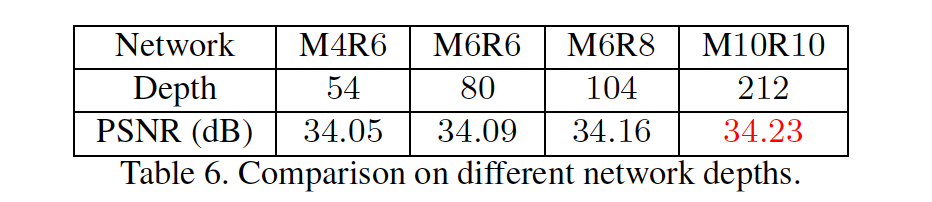

## MemNet: A Persistent Memory Network for Image Restoration

### 摘要

​		最近，非常深的卷积神经网络（CNN）在图像恢复中引起了相当大的关注。但是，随着深度的增加，这些非常深的模型很少意识到长期依赖问题，这导致先前状态/层对后续状态/层的影响很有限。受人类思想是持续的启发，我们提出非常深的持续记忆网络（MemNet），其引入一种memory block（该块包含一个递归单元（recursive unit）和一个门单元（gate unit））来显示地挖掘贯穿自适应学习过程的持续记忆。递归单元在不同感受野下学习当前状态的多级表示（multi-level representation）。这种表示和前一memory block的输出被拼接到一起，并传递给门单元，门单元自适应地控制有多少前一状态得到保留，以及决定有多少当前状态得到存储。我们将MemNet用于三种恢复任务，即图像去噪、超分辨率和JPEG deblocking。大量实验证明MemNet的必要性，以及在是三个任务上比最佳方法更好的性能。代码见 https://github.com/tyshiwo/MemNet 。

### 1. 引言

​		图像恢复是低级计算机视觉中的经典问题，其从噪声或模糊图像中估计未衰退图像。衰退的低质量图像$\mathbf{x}$可以表示为：$$\mathbf{x} = D(\tilde{\mathbf{x}}) + \mathbf{n}$$，其中$\tilde{\mathbf{x}}$是$\mathbf{x}$的高质量版，$D$为衰退函数，$\mathbf{n}$为附加噪声。利用这种数学模型，在许多图像恢复任务中进行大量研究，例如图像去噪、单图像超分辨率和JPEG deblocking。

​		作为三种经典的图像恢复任务，图像去噪旨在从噪声观察中国恢复清晰图像，其通常假设添加标准差为$\sigma$的高斯白噪声；单图像超分辨率从低分辨率图像恢复高分辨率图像；JPEG deblocking移除有JPEG压缩引起的blocking伪影。

​		最近，由于强力的学习能力，非常声的卷积神经网络广泛用于处理图像恢复任务。Kim等构建一个20层的CNN结构（称为VDSR）用于SISR，并采用残差学习来简化训练难度。为了控制非常深模型的参数，作者进一步引入递归层，并提出Deeply Recursive Convolutional Network（DRCN）。为了缓解训练难度，Mao等[27]向30层卷积自编码器网络（称为RED）引入对称的skip连接，以进行图像去噪和SISR。此外，Zhang等提出去噪卷积神经网络（DnCNN）来同时处理图像去噪、SISR和JPEG deblocking。

​		传统的朴素CNN（例如VDSR、DRCN和DnCNN（图1（a）））采用单路径前向架构，其中一个状态受其前一直接状态影响，称为_short-term memory_。一些CNN的变体（RED和ResNet（图1（b））利用skip连接以跨层传递信息。在这些网络中，与短期记忆不同，它的一种状态受特定的先验状态影响，称为_restricted long-term memory_。本质上，最近的证据认为哺乳动物在神经回路中会保护先前获取的知识。但是，上述CNN模型都没有这种机制来获得持续记忆。随着深度的增加，它们面临缺乏长期记忆的问题。

​		为了处理这个问题，我们提出一种非常深的持续记忆网络（MemNet），其在自适应学习过程中，引入记忆模块来显示地挖掘持续记忆。在MemNet中，Feature Extraction Net（FENet）首先从低质量图像中提取特征。然后，以_densely connected structure_的方式堆叠几个记忆块来解决图像恢复任务，而不是通过直接映射解决该任务，从而降低训练难度。

​		作为MemNet的关键概念，记忆块包含_recursive unit_和_gate unit_。受神经科学的启发[6，25]，新皮层中普遍存在递归连接，递归单元学习不同感受野（图1（c）中的蓝色圆圈）下当前状态的多级表示，这可以视为短期记忆（short-term memory）。递归单元生成的短期记忆，和前一记忆块生成的长期记忆（图1（c）中的绿色箭头）被连接到一起，并传给门单元，这是维持持续记忆的非线性函数。此外，我提出扩展的多监督MemNet，其融合所有记忆块的中间预测提升性能。

​		总之，这项工作的主要贡献包括：

- 一个用于完成门控机制（gating mechanism）以帮助桥接长期依赖关系的记忆块。在每个记忆块中，门单元自适应地学习不同记忆的不同权重，这控制有多少长期记忆得到保留，并决定多少短期记忆得到存储。
- 非常深的持续记忆网络（80层卷积）用于图像恢复。紧密连接的结构有助于补偿中/高频信号，并确保最大的信息在记忆块之间流动。据我们所知，它是迄今为止图像恢复最深的网络。
- 相同的MemNet结构在图像去噪、超分辨率和JPEG deblocking方面获得最佳性能。由于强大的学习能力，即使使用单一模型，我们的MemNet都可以接受训练以处理不同级别的衰退。

### 2. 相关工作

​		AlexNet在ImageNet上的成功开启视觉深度学习时代，并且流行的网络GoogLeNet[33]、Highway网络[32]、ResNet[12]反应出网络的深度至关重要。

​		作为早期尝试，Jain等[17]提出简单的CNN来从噪声观察中恢复清晰的自然图像，并获得与小波方法相当的性能。作为SISR的先驱工作，SRCNN通过完全深度卷积网络预测非线性的LR-HR映射，其明显好于经典的的浅层方法。作者进一步提出了一个扩展的CNN模型，称为伪像减少卷积神经网络（Artifacts Reduction Convolutional Neural Networks：ARCNN）[7]，以有效处理JPEG压缩伪像。

​		为了处理任务特定的先验，Wang等采用级联稀疏编码网络来充分利用图像的自然稀疏性。在[35]中，提出了一种深度对偶域（dual-domain）方法，以结合JPEG压缩方案中的先验知识和对偶域稀疏编码的实践。Guo等[10]还提出对偶域卷积网络，其在DCT和像素域联合学习非常深的网络。

​		最近，图像恢复中，非常深的CNN越来越流行。Kim等[20]堆叠20个卷积层来探索大型上下文信息。残差学习和可调整的梯度裁剪用于加速训练。Zhang等[40]将BN引入到DnCNN模型以联合处理几种图像恢复任务。为了减小模型的复杂度，DRCN模型引入递归监督和skip-connection来缓解训练难度[21]。使用对称skip connection，Mao等提出非常深的卷积自编码器网络进行图像去噪和SISR。最近，Lai等[23]提出LapSRN来处理SISR的速度和准确率问题，其直接在LR图像上运行，并渐近地重构HR图像的sub-band残差。Tai等[34]提出深度递归残差网络（DRRN）来处理模型参数和准确率问题，其在多路径模型中递归地学习残差单元。

### 3. MemNet for Image Restoration

#### 3.1. Basic Network Architecture

​		MemNet包含3个部分：特征提取网络FENet、多个堆叠的记忆块和最终的重建网络ReconNet（图2）。令$\mathbf{x}$和$\mathbf{y}$分别表示MemNet的输入和输出。具体而言，FENet中使用的卷积层从噪声或模糊的输入图像中提取特征：

$$B_0 = f_{ext}(\mathbf{x}), \tag{1}$$

其中$f_{ext}$表示特征提取函数，$B_0$为传递给第一个记忆块的提取到的特征。假设堆叠$M$个记忆块扮演特征映射，我们有：

$$B_m = \mathcal{M}_m(B_{m-1})=\mathcal{M}_m(\mathcal{M}_{m-1}(\cdots(\mathcal{M}_1(B_0))\cdots)),\tag{2}$$

其中$\mathcal{M}$表示第$m$个记忆块函数，$B_{m-1}$和$B_m$分别为第$m$个记忆块的输入和输出。最后，与其直接学习从低质量图像到高质量图像的映射，不如使用ReconNet中的卷积层来重建残差图像[20、21、40]。因此，我们的基本MemNet可以表示为

$$\begin{align}\mathbf{y} &= \mathcal{D}(\mathbf{x}) \\&= f_{rec}(\mathcal{M}_M(\mathcal{M}_{M-1}(\cdots(\mathcal{M}_1(f_{ext}(\mathbf{x})))\cdots))) + \mathbf{x}\end{align}, \tag{3}$$

其中$f_{rec}$表示重建函数，$\mathcal{D}$表示我们的基础MemNet的函数。

​		给定训练集$\{\mathbf{x}^{(i)},\tilde{\mathbf{x}}^{(i)}\}_{i=1}^N$，其中$N$为训练补丁的数量，$\tilde{\mathbf{x}}^{(i)}$为低质量补丁$\mathbf{x}^{(i)}$的ground-truth高质量补丁，我们的具有参数集$\Theta$的基础MemNet的损失函数为

$$\mathcal{L}(\Theta)=\frac{1}{2N}\sum_{i=1}^N\|\tilde{\mathbf{x}}^{(i)} -\mathcal{D}(\mathbf{x}^{(i)})\|^2,\tag{4}$$

#### 3.2. Memory Block

​		现在，我们表示记忆块的细节。记忆块包含递归单元和门单元。

​		**Recursive Unit**用于建模非线性函数，其如大脑中的递归突触[6、25]。这里，我们使用_residual building block_，其在ResNet[12]中被引入，对于目标是吧展现出强壮的学习能力。第$m$个记忆块中的残差构建块为：

$$H_m^r = \mathcal{R}_m(H_m^{r-1})=\mathcal{F}(H_m^{r-1},W_m) + H_m^{r-1},\tag{5}$$

其中$H_m^{r-1}$、$H_m^r$分别为第$r$个残差构建块的输入和输出。当$r=1$时，$H_m^0=B_{m-1}$。$\mathcal{F}$表示残差函数，$W_m$为学习的权重集，$\mathcal{R}$表示残差构建块函数。具体而言，每个残差函数包含具有预激活结构[13]的两个卷积层：

$$\mathcal{F}(H_m^{r-1},W_m)=W_m^2\tau(W_m^1\tau(H_m^{r-1})),\tag{6}$$

其中$\tau$表示激活函数，包含BN+ReLU，$W_m^i,i=1,2$为第$i$个卷积层的权重。为了简便，省略掉偏置项。

​		然后，递归地学习几个递归，以在不同的感受野下生成多级表示。我们称这些表示为短期记忆。假设递归单元中有$R$个递归，递归单元中的第$r$个递归可以表示为：

$$H_m^r = \mathcal{R}_m^{(r)}(B_{m-1})\underbrace{\mathcal{R}_m(\mathcal{R}_m(\cdots(\mathcal{R}_m(B_{m-1}))\cdots))}_r,\tag{7}$$

其中执行$\mathcal{R}_m$的$r$折操作，$\{H_m^r\}_{r=1}^R$为递归单元的多级表示。这些表示被拼接到一起作为短期记忆：$B_m^{short} = [H_m^1,H_m^2,\cdots,H_m^R]$。此外，来自前一记忆块的长期记忆构建为：$B_m^{long}=[B_0,B_1,\cdots,B_{m-1}]$。然后，将记忆的两种类型拼接作为门单元的输入：

$$B_m^{gate} = [B_m^{short},B_m^{long}].\tag{8}$$

**Gate Unit**用于通过自适应学习过程获得持续记忆。本文中，我们采用一个$1 \times 1$卷积层来完成_门机制_，该机制可以为不同记忆学习自适应的权重：

$$B_m = f_m^{gate}(B_m^{gate})=W_m^{gate}\tau(B_m^{gate}),\tag{9}$$

其中$f_m^{gate}$和$B_m$分别表示$1 \times 1$卷积层（参数为$W_m^{gate}$）和第$m$个记忆块的函数。因此，长期记忆的权重控制有多少先前状态得到保留，而短期记忆决定有多少当前状态得到存储。因此，第$m$个记忆块的公式可以写为：

$$\begin{align}B_m &= \mathcal{M}_m (B_{m-1}) \\ &=f_{gate}([\mathcal{R}_m(B_{m-1}), \cdots, \mathcal{R}_m^{(R)}(B_{m-1}), B_0, \cdots, B_{m-1}])\end{align}.\tag{10}$$

#### 3.3. Multi-Supervised MemNet

​		为了进一步探索不同状态的特征，受[21]启发，我们将每个记忆块的输出送入相同的重建网络$\hat{f}_{rec}$以生成：

$$\mathbf{y}_m = \hat{f}_{rec}(\mathbf{x}, B_m) = \mathbf{x} + f_{rec}(B_m), \tag{11}$$

其中$\{\mathbf{y}_m\}_{m=1}^M$为中间预测。训练期间，所有预测都被监督，并通过加权平均用于计算最终输出：$\mathbf{y} = \sum_{m=1}^M w_m \cdot \mathbf{y}_m$（图3）。训练期间自动学习最优权重$\{w_m\}_{m=1}^M$，来自集成的最终输出也被监督。我们的多监督MemNet的损失函数为：

$$\begin{align} \mathcal{L}(\Theta) &= \frac{\alpha}{2N}\sum_{i=1}^N\|\tilde{\mathbf{x}}^{(i)} - \sum_{m=1}^Mw_m\cdot \mathbf{y}_m^{(i)}\|^2 \\ &+\frac{1-\alpha}{2MN}\sum_{m-1}^M\sum_{i=1}^N\|\tilde{\mathbf{x}}^{(i)} - \mathbf{y}_m^{(i)}\|^2\end{align}, \tag{12}$$

其中$\alpha$表示损失权重。

#### 3.4. Dense Connections for Image Restoration

​		现在，我们分析为什么MemNet中的长期密集连接（long-term dense connections）可能对图像恢复有益。在非常深的网络中，在典型的前向CNN过程中，一些中/高频信息可能会在后面层中丢失，而前一层的秘籍连接可以补偿如此的丢失，并进一步增强高频信号。为了验证我们的直觉，我们训练了80层的没有长期连接的MemNet，并与原始的MemNet比较。两个网都有6个记忆块，从而产生6个中间输出，并且每个记忆块包含6个递归。图4（a）给出两个网络的第4和第6个输出。我们计算它们的功率谱，将它们居中，通过放置同心圆来估计从低到高的连续频率范围的频谱密度，并在图4（b）中绘制四个输出的密度。

​		在图4（c）中，我们进一步绘制这些密度的差异。从左到右，第一个案例表示早期层中包含后面层中丢失的中频信息。第二个案例验证，利用密集连接，后一层吸收前一层携带的信息，甚至产生更多的中频信息。第三个案例认为，在更早层中，两个模型之间的频率相似。最后一个案例证明，MemNet恢复的频率比没有长期连接版的频率跟高。

### 4. 讨论

​		**Difference to Highway Network**	首先，我们讨论记忆块是如何完成门限机制，并介绍MemNet和Highway Network（一个非常深的CNN模型，它使用门单元来调节信息流[32]）之间的差异。

​		为避免在非常深的平坦网络中受到LSTM的启发而造成的信息衰减，Highway Network引入了旁路层以及闸门单元，即：

$$\mathbf{b} = \mathcal{A}(\mathbf{a}) \cdot \mathcal{T}(\mathbf{a}) + \mathbf{a} \cdot (1 - \mathcal{T}(\mathbf{a})), \tag{13}$$

其中$\mathbf{a}$和$\mathbf{b}$为输入和输出，$\mathcal{A}$和$\mathcal{T}$为两个非线性变换函数。$\mathcal{T}$是转换门（transform gate），用于控制$\mathcal{A}$产生的信息应存储到输出中的数量；而$1-\mathcal{T}$为进位门（carry gate），用于决定应保留多少输入到输出。

​		在MemNet中，拼接短期和长期记忆。然后，使用$1 \times 1$卷积层自适应地学习不同记忆的权重。与学习每个像素的特定权重的Highway Network相比，我们的门单元学习每个特征图的特定权重，其有两个优势：（1）为了减小模型的参数和复杂度；（2）为了减轻过拟合。

​		**与DRCN的差异**	MemNet与DRCN[21]之间有三个主要差异。第一个是网络中基本块的设计。在DRCN中，基本模块是卷积层；而在MemNet中，基本模块是记忆块以获得持续记忆。第二个是，在DRCN中，基本块（即卷积层）的权重是共享的；而在MemNet中，记忆块中的权重是不同的。第三个是，DRCN中的基本块之间没有密集连接，其产生链式结构；而在MemNet中，记忆块之间的长期密集连接导致多路结构，其不仅有助于跨网络的信息流，还促进训练期间的梯度反向传播。受益于良好的信息流动能力，MemNet无需多监督策略即可轻松进行训练，这对于训练DRCN是必不可少的[21]。

​		**与DenseNet的差异**	与MemNet相关的工作是DenseNet[14]，其也是基于密集连接准则构建的。通常，DenseNet处理目标识别，而提出MemNet用于图像恢复。此外，DenseNet以局部形式（即在一个密集块中）使用密集连接，而MemNet以全局形式（即跨记忆块）使用密集连接结构。在3.4节和5.2节中，我们分析和证明了MemNet中的长期密集连接确实在图像恢复任务中起着重要作用。

### 5. 实验

#### 5.1. 实现细节

​		**数据集**	对于图像去噪，我们遵循[27]，使用来自Berkeley Segmentation Dataset （BSD） [28]的300张图像来生成图像补丁作为训练集。评估使用了两个流行的基准，一个包含14个普通图像的数据集和一个包含200张图像的BSD测试集。通过将具有三个噪声级别（$\sigma = 30、50和70$）之一的高斯噪声添加到干净的补丁中，从而生成输入噪声补丁。

​		对于SISR，遵循[20]中的实验设置，我们使用291张图像的训练集，其中来自Yang等[38]的91张图像和来自BSD训练集的另外200张图像。对于测试，使用四种基准数据集（Set5、Set14、BSD100和Urban100）。评估三种尺度，包含2、3和4倍。输入的LR图像是通过首先以一定尺度对HR图像进行bicubic下采样然后再进行bicubic上采样而生成的。

​		对于JPEG deblocking，使用图像去噪相同的训练集。与[7]相同，采用Classic5和LIVE1作为测试集。使用两种JPEG质量因子（即10和20），并且通过使用MATLAB JPEG编码器以一定的质量因子压缩图像来生成JPEG解块输入。

​		**训练设置**	遵循[27]的方法，对于图像去噪，使用灰度图像；而对于SISR和JPEG deblocking，亮度（luminance）分量被输入到模型中。由于全卷积架构，输入图像的尺寸是任意的。考虑到训练时间和存储复杂度，以补偿21将训练图像划分为$31 \times 31$的补丁。MemNet的输出为与输入低质量补丁相同分辨率的估计的高质量补丁。我们遵循[34]进行数据增强。对于每个任务，我们针对所有不同级别的衰退训练一个模型。 例如，对于图像降噪，使用噪声增强。具有不同噪声水平的图像都包含在训练集中。 类似地，对于超分辨率和JPEG deblocking，分别使用缩放和质量增强。

​		我们使用Caffe[19]来实现两个80层的MemNet网络，即基本和多监督版。在两个架构由6个记忆块构成，每个记忆块包含6个递归，即M6R6。具体而言，在多监督MemNet中，生成6个预测，并用于计算最终的输出。$\alpha$平衡不同的正则，并且根据经验设置为$\alpha = 1/(M+1)$。

​		通过mini-batch SGD优化公式（4）和公式（12）中的的目标函数。我们将SGD的mini-batch设置为64，momentum参数设置为0.9，权重衰减设置为$10^{-4}$。所有卷积都有64个滤波器。除了门单元中的$1 \times 1$卷积层外，其他卷积层的核大小为$3 \times 3$。我们使用[11]中的权重初始化。初始学习率设置为0.1，并每20个epoch除以10。使用1个Tesla P40 GPU，使用91张图像[38]训练80层基本MemNet进行SISR大约需要5天。由于空间限制和最近的基线，我们在第5.2、5.4和5.6节中关注SISR，而在第5.3和5.5节中则关注所有三个任务。

#### 5.2. 消融研究

​		表1介绍长期和短期连接上的笑容研究。与MemNet相比，MemNet_NL移除长期连接（图3中绿色曲线），而MemNet_NS移除短期连接（从第一个$R-1$递归到图1中的门单元的黑色曲线。 保留从最后一次递归到门单元的连接，以避免递归单元和门单元之间的交互中断）。三种网络由相同的深度（80）和滤波器数量（64）。我们可以看出，因为MemNet明显由于MemNet_NL，所以长期密集连接非常重要。此外，MemNet获得比MemNet_NS更好的性能，其反应短期连接对于图像恢复也有用，但是比短期连接更无力。原因是长期连接跳过的层比短期连接要多得多，后者可以将某些中/高频信号从很早的层传送到后面的层，如第3.4节所述。

#### 5.2. 门单元分析

​		现在，我们展示我们的门单元是如何影响不同种类的记忆。受[14]启发，我们采用权重范数作为当前层对其先前层的依赖性的近似值，其通过与每个特征图相关的相应滤波器计算：$v_m^l = \sqrt{\sum_{i=1}^64(W_m^{gate}(1,1,l,i))^2}, l=1,2,\cdots,L_m$，其中$L_m$为第$m$个门单元的输入特征图的数量，$l$表示特征图索引，$W_m^{gate}$存储$1 \times 1 \times L_m \times 64$的权重，$v_m^l$为第$m$个门单元的第$l$个特征图的权重范数。基本上，范数越大，对该特定特征图的依赖性就越大。为了更好可视化，我们将范数归一化到0～1之间。图5展示滤波器权重$\{v_m^l\}_{m=1}^6$的范数 vs. 特征图索引$l$。我们有三种观察：（1）不同任务有不同的范数分布，（2）随着记忆块的数量增加，权重范数的均值和方差变得更小，（3）通常，递归单元中最后一次递归的短期记忆（每条曲线的最后64个元素）比其他两个记忆贡献最大，长期记忆似乎比后期$R-1$递归中的短期记忆在后期记忆块中恢复有用信号方面起着更重要的作用。

#### 5.4. 与非持续CNN模型的比较

##### 5.5. 与最佳模型的比较

**图像去噪**

**超分辨率**

**JPEG Deblocking**

#### 5.6. 与不同网络深度的比较

