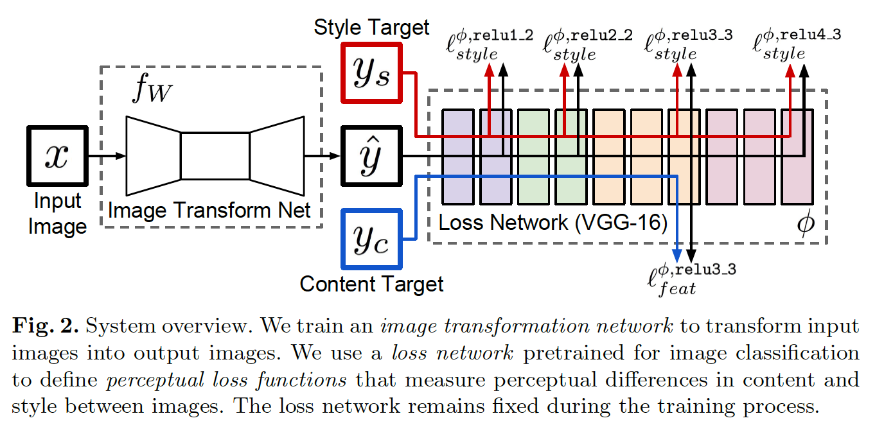
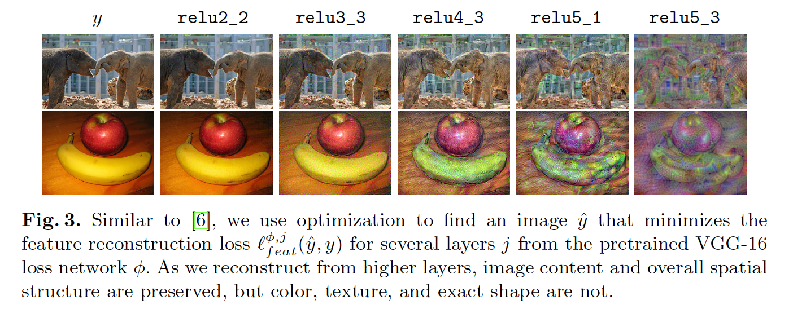
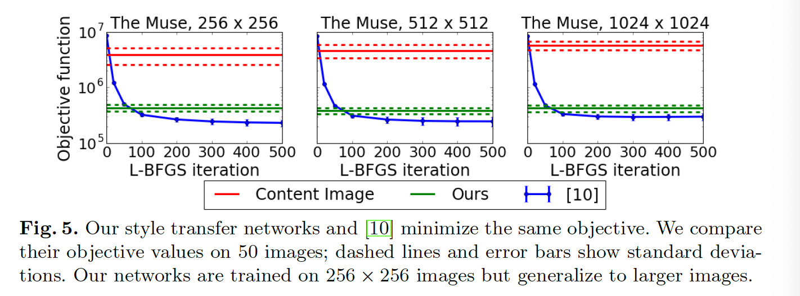

## Perceptual Losses for Real-Time Style Transfer and Super-Resolution

### 摘要

​		我们考虑图像变换问题，其中将输入图像转换到输出图像。针对此类问题的最新方法通常使用输出图像与真实图像之间的每像素损失来训练前馈卷积神经网络。并行工作表明，可以根据从预训练网络中提取的高级特征来定义和优化感知（perceptual）损失函数，从而生成高质量图像。我们结合两种方法的优势，并提出使用perceptual损失函数来训练前馈网络，从而进行图像变换任务。我们显示了图像样式转换的结果，其中训练了前馈网络以实时解决Gatys等人提出的优化问题。与基于优化的方法相比，我们的网络给出了相似的定性结果，但速度快了三个数量级。我们还尝试了单图像超分辨率，其中用感知损失替换每像素损失会带来视觉上令人欣喜的结果。

### 1	引言

​		许多经典问题都可以作为图像变换任务来描述，其中系统会接收一些输入图像并将其转换为输出图像。图像处理的示例包括去噪、超分辨率和着色，其中输入是衰弱图像（噪声、低分辨率或灰度），而输出是高质量彩色图像。计算机视觉示例包括语义分割和深度估计，其中输入图像是彩色图像，输出编码关于场景语义或几何信息的图像。

​		解决图像转换任务的一种方法是以监督的方式训练前向卷积神经网络，其使用每像素损失函数来衡量输出和ground-truth图像之间的差异。例如，Dong等人已将这种方法用于超分辨率[1]，Cheng等人将其用于着色[2]，Long等人将其用于分割[3]，Eigen等人将其用于深度和表面法线预测 [4、5]。这样的方法在测试时是有效的，仅需要经过训练网络的前向传递。

​		但是，这些方法使用的每像素损失不能捕获输出和ground-truth图像之间的perceptual。例如，考虑彼此相距一个像素的两个相同图像； 尽管它们在感知上相似，但按每像素损失来衡量，它们还是非常不同的。

​		同时，最近的工作表明，可以使用感知损失函数生成高质量图像，而不是基于像素之间的差异，而是基于从预训练卷积神经网络提取的高级图像特征表示之间的差异。通过最小化损失函数生成图像。该策略已应用于Mahendran等人的特征反转[6]，Simonyan等人[7]和Yosinski等人[8]的特征可视化，以及Gatys等人的[9、10]进行纹理合成和样式转换。这些方法产生高质量图像，但是由于推理需要解决优化问题，因此很慢。

​		本文中，我们结合这两种方法的优势。我们训练前馈变换网络来执行图像变换任务，而不是仅使用低级像素信息来使用每像素损失函数，而是使用依赖于预训练损失网络中高级特征的感知损失函数来训练网络 。训练期间，perceptual损失衡量图像的相似性比每像素损失更鲁棒，在测试时，变换网络实时运行。

​		我们在两个任务上进行实验：风格迁移和单图像超分辨率。两者都是天生的病态。 对于样式转换，没有单个正确的输出，对于超分辨率，有许多高分辨率图像可能会生成相同的低分辨率输入。任何一项任务的成功都需要有关输入图像的语义推理。对于风格迁移，尽管颜色和纹理发生了巨大变化，但输出在语义上必须与输入相似。 对于超分辨率，必须从视觉上模糊的低分辨率输入中推断出精细的细节。原则上，为每项任务训练的高容量神经网络都可以隐式学习推理相关语义的能力； 但是在实践中我们不需要从头学习：感知损失函数的使用允许将语义知识从损失网络转移到变换网络。

​		对于风格迁移，我们训练前馈网络来解决[10]中的优化问题；我们的结果在质量和目标函数值上均与[10]相似，但生成速度快了三个数量级。对于超分辨率，我们证明用感知损失替换每个像素的损失会为4倍和8倍的超分辨率带来视觉上令人愉悦的结果。

### 2	相关工作

​		**Feed-forward image transformation**	近年来，通过训练具有每像素损失函数的深度卷积神经网络，解决了各种各样的前馈图像变换任务。

​		语义分割方法[3,5,12,13,14,15]通过在输入图像上以完全卷积的方式运行网络并训练每个像素的分类损失来产生密集的场景标签。[15]通过将CRF推论作为与网络其余部分一起训练的循环层，其超越了每像素的损失。我们的变换网络的架构受[3]和[4]启发，它们使用网络内下采样来减少特征图的空间范围，然后使用网络内上采样来生成最终的输出图像。

​		深度[5,4,16]和表面法线估计[5,17]的最新方法相似之处在于，它们使用每像素损失或分类损失训练的钱馈卷积网络将彩色输入图像转换到具有几何意义的输入后图像。一些方法通过惩罚图像梯度[5]或使用CRF损失层[16]来增强输出图像的局部一致性，从而超越了每个像素的损失。在[2]中，使用每像素损失训练前馈模型，以将灰度图像转换为彩色图像。

​		**Perceptual optimization**	根据从卷积网络提取的高级特征，许多最新论文已使用优化来生成目标是可感知的图像。为了理解训练网络中编码的功能，可以生成图像以最大化类别预测分数[7,8]或单个特征[8]。类似的优化技术也可以用于生成高置信度的欺骗图像[18,19]。

​		Mahendran和Vedaldi [6]通过最小化特征重建损失来反转卷积网络的特征，以了解不同网络层保留的图像信息；以前曾使用过类似的方法来反转局部二进制描述符[20]和HOG特征[21]。

​		Dosovitskiy和Brox [22]的工作与我们的工作特别相关，因为他们训练了前馈神经网络来反转卷积特征，从而快速逼近[6]提出的优化问题的解决方案。但是，它们的前馈网络利用每像素的重建损失来训练，而我们的网络直接优化[6]的特征重建损失。

​		**Style Transfer**	Gatys等人[10]进行艺术风格转移，通过联合最小化[6]的特征重构损失和基于从预训练卷积网络提取的特征的风格重构损失，将一幅图像的内容与另一幅图像的风格结合起来； 类似的方法以前已经用于纹理合成[9]。他们的方法产生高质量的结果，但是由于最优化问题的每个步骤都需要向前和向后经过预先训练的网络，因此计算量很大。为了克服此计算负担，我们训练了前馈网络以快速近似解决其优化问题的解决方案。

​		**图像超分辨率**	图像超分辨率是一个经典的问题，为此已经开发了各种各样的技术。Yang等人[23]在卷积神经网络被广泛采用之前，对现有技术进行了详尽的评估。它们将超分辨技术分为基于预测的方法（bilinear、bicubic、Lanczos、[24]）、基于边缘的方法、统计方法、基于补丁的方法和稀疏字典方法。最近[1]使用经过逐像素欧几里得损失训练的三层卷积神经网络在单图像超分辨率上实现了出色的性能。 其他最近的最先进的方法包括[39、40、41]。

### 3	方法

​		如图2所示，我们的系统包含两个部分：图像转换网络$f_W$和用于定义几个损失函数$l_1,\cdots,l_k$的损失网络$\phi$。图像转换网络是由权重$W$参数化的深度残差卷积神经网络；它通过映射$\hat{y} = f_W(x)$将输入图像$x$转换为输出图像$\hat{y}$。每个损失函数计算一个标量值$l_i(\hat{y},y_i)$，其衡量输出图像$\hat{y}$和目标图像$y_i$之间的差异。使用随机梯度下降训练图像转换网络以最小化损失函数的加权组合：

$$W^\ast = \arg\min_W \mathbf{E}_{x,\{y_i\}}\Big[\sum_{i=1}\lambda_il_i(f_W(x), y_i)\Big]\tag{1}$$

​		为了处理每像素损失的缺点，并运行我们的损失更好衡量图像之间的感知和语义，我们从最近的工作中汲取了灵感，这些工作是通过优化来生成图像的[6,7,8,9,10]。这些方法的关键见解是，针对图像分类进行预训练的卷积神经网络已经学会在损失函数中测量的感知和语义信息进行编码。为了定义我们的损失函数，我们利用网络$\phi$（其已预训练用于图像分类）作为固定的损失网络。然后使用也是深层卷积网络的损失函数来训练我们的深层卷积变换网络。

​		损失网络$\phi$用于定义衡量图像之间内容和风格上差异的特征重建损失（feature reconstruction loss）$l_{feat}^\phi$和格重建损失（style reconstruction loss）$l_{style}^\phi$。对于每个输入图像$x$，我们有内容目标（content target）$y_c$和风格目标（style target）$y_s$。对于风格迁移，内容目标$y_c$为输入图像$x$，输出图像$\hat{y}$应当与$x=y_c$的内容与$y_s$的风格结合；我们每个风格目标训练一个网络。对于单图像超分辨率，输入图像$x$为低分辨率输入，内容目标$y_c$为ground-truth 高分辨率图像，此时没有用到风格重建损失；每个超分辨率因子训练一个网络。

#### 3.1	图像转换网络

​		我们的图像转换网络大致遵循Radford等[42]提出的架构指导。我们没有使用任何池化层，而是在网络下采样和上采样的网络内部使用步长和小数步长的卷积。我们的网络主体包含五个[44]中使用的残差块。所有非残差卷积后是BN和ReLU，但输出层除外，输出层使用tanh来确保输出图像的像素在$[0,255]$之间。除了使用$9\times9$核的第一层和最后一层之外，所有卷积层都使用$3\times3$核。 在补充材料中可以找到我们所有网络的确切架构。

​		**输入和输出**	对于风格迁移，输入和输出都是$3 \times 256 \times 256$的彩色图像。对于上采样因子为$f$的超分辨率，输出是$3 \times 288 \times 288$的高分辨率图像补丁，输入为$3 \times 288/f \times 288/f$的低分辨率补丁。因为图像转换网络是全卷积的，在测试时，它们可以用于仍和分辨率的图像。

​		**下采样和上采样**	对于上采样因子为$f$的超分辨率，我们使用几个残差块，后面是补偿为$1/2$的$\log_2f$个卷积层。这与[1]不同，[1]在将低分辨率图像传入网络之前，使用bicubic插值上采样低分辨率输入。小数步长卷积不依赖固定的上采样函数，而是可以与网络的其余部分一起学习上采样函数。

​		对于风格迁移，我们的网络使用步长为2的卷积来下采样输入，接着是几个残差块，然后使用两个步长为$1/2$的卷积层来上采样。尽管输入和输出有相同的大小，但先进行降采样再进行上采样的网络有多种好处。

​		第一个是计算。利用朴素的实现，在大小为$C \times H \times W$上具有$C$个滤波器的$3 \times 3$卷积需要$9HWC^2$次multiply-add操作，这与在$DC \times H/D \times W/D$的输入上的具有$DC$个滤波器的$3\times 3$的卷积的计算成本相同。在下采样之后，对于相同的计算成本，我们可以使用更大的网络。

​		第二个好处是有效感受野大小。高质量风格迁移需要以一致的方式改变输入的大部分。因此，对于输出中的每个像素在输入中具有大的有效感受野是有利的。没有下采样，每个额外的$3 \times 3$卷积层将有效感受野提高两倍。在因子为$D$的下采样之后，每个$3 \times 3$卷积将有效感受野提高$2D$倍，相同层数下具有更大的有效感受野。

​		**残差连接**	He等[43]使用残差连接训练非常深的网络以进行图像分类。他们认为残差连接使网络更容易学习恒等函数；这是图像转换网络的一个吸引人的属性，因为在大多数情况下，输出图像应与输入图像共享结构。因此，我们的网络主体包含几个残差块，每个块包含两个$3 \times 3$卷积。我们使用[44]设计的残差块，见补充材料。

#### 3.2	Perceptual Loss Functions

​		我们定义两个感知损失函数（perceptual loss function），他们衡量图像之间的高级感知和语义差异。他们充分利用为图像分类预训练的损失网络$\phi$，这意味着这些感知损失函数本事是深度卷积神经网络。在我们的所有实验中，$\phi$是ImageNet预训练的16层的VGG网络。

​		**Feature Reconstruction Loss**	与其鼓励输出图像$\hat{y} = f_W(x)$的像素与目标图像$y$的像素完全匹配，不如鼓励它们具有通过损失网络$\phi$计算的相似特征表示。在处理图像$x$时，令$\phi_j(x)$为网络$\phi$的第$j$层的激活；如果$j$为卷积层，那么$\phi_j(x)$为形状为$C_j \times H_j \times W_j$的特征图。特征重构损失特征表示之间的（均方、规范化）欧式距离：

$$l_{feat}^{\phi,j}(\hat{y}, y) = \frac{1}{C_j H_j W_j}\|\phi_j(\hat{y}) - \phi_j(y)\|_2^2 \tag{2}$$

如[6]中所示和图3所示，找到最小化早期图层特征重建损失的图像 $\hat{y}$ 往往会产生与$y$在视觉上无法区分的图像。由于我们从更高层重建，所以图像内容和整体空间结构得到保留，但是颜色、纹理和确切的形状没得到保留。使用特征重构损失训练，我们的图像转换网络鼓励输出图像$\hat{y}$在感知上与目标图像$y$相似，但是不会强迫他们精确匹配。

​		**Style Reconstruction Loss**	当输出图像 $\hat{y}$ 的内容偏离目标 $y$ 时，特征重建损失会惩罚输出图像$\hat{y}$。我们还希望惩罚风格（颜色、纹理、一般模式等）中的差异。为了获得这种效果，Gatys等[9、10]提出遵循风格重建损失。

​		如上所述，对于输入$x$，令$\phi_j(x)$为网络$\phi$第$j$层的激活，其为$C_j \times H_j \times W_j$的特征图。定义_Gram matrix_ $G_j^\phi(x)$为$C_j \times C_j$的矩阵，它的元素为：

$$G_j^\phi(x)_{c,c'} = \frac{1}{C_jH_jW_j}\sum_{h=1}^{H_j}\sum_{w=1}^{W_j}\phi_j(x)_{h,w,c}\phi_j(x)_{h,w,c'} \tag{3}$$

如果我们将$\phi_j(x)$解释为$H_j \times W_j$网格上每个点提供的$C_j$为特征，那么$G_j^\phi(x)$与$C_j$维特征的uncentered covariance，将每个网格位置视为独立的样本。因此，它捕获有关哪些特征倾向于一起激活的信息。通过将$\phi_j(x)$变为形状为$C_j \times H_j \times W_j$的矩阵$\psi$可以高效地计算Gram矩阵；然后$G_j^\phi(x) = \psi\psi^T/C_jH_jW_j$。

​		风格重建损失为输入和目标图像的Gram矩阵之差的平方Frobenius范数：

$$l_{style}^{\phi,j}(\hat{y},y)=\|G_j^\phi(\hat{y}) - G_j^\phi(y)\|_F^2.\tag{4}$$

即使 $\hat{y}$ 和 $y$ 的大小不同，风格重构损失也是可以定义的，因为它们的Gram矩阵都将具有相同的形状。

​		如[10]中所示和图5所示，生成将风格重建损失最小化的图像 $\hat{y}$ 保留了目标图像的风格特征，但不保留其空间结构。从较高层进行重建会从目标图像迁移更大尺度的结构。

​		为了进行从层集合$J$（而不是单层$j$）上进行重建，我们将$l_{style}^{\phi,J}(\hat{y},y)$定义为每个$j \in J$的损失之和。

#### 3.3	Simple Loss Functions

​		除了上述定义的感知损失外，我们还定义两个仅依赖低级像素信息的简单损失函数。

​		**Pixel Loss**	_Pixel Loss_为输出图像$\hat{y}$与目标$y$之间的（归一化）欧式距离。如果有形状 $C \times H \times W$，那么像素损失定义为$l_{pixel}(\hat{y},y)=\|\hat{y} - y\|_2^2 / CHW$ 。仅当我们有一个预期目标网络可以匹配的真实目标$y$时，才可以使用此方法。

​		**Total Variation Regularization**	为了鼓励输出图像$\hat{y}$在空间上平滑性，我们遵循关于特征反演[6,20]和超分辨率[48,49]的先前工作，并使用 _total variation regulariz_ $l_{TV}(\hat{y})$。

### 4	实验

​		我们在两种图像转换任务上进行实验：风格迁移和单图像超分辨率。风格迁移的先前工作使用优化来生成图像；我们的钱馈网络给出相似的定性结果，但是快了三个数量级。利用卷积神经网络的单图像超分辨率中先前工作使用每像素损失；而我们展示使用感知损失促进定性结果。