## Learning a Deep Convolutional Network for Image Super-Resolution

### 摘要

​		我们提出用于单幅图像超分辨率（Super Resolution：SR）的深度学习方法。我们的方法直接学习低/高分辨率图像之间的端到端映射。这种映射表示为深度卷积神经网络，该网络采用低分辨率图像作为输入，并输出高分辨率图像。我们进一步证明传统基于稀疏编码的SR方法以可以视为深度卷积网络。但是，与单独处理每个组件的传统方法不同，我们的方法联合优化所有层。我们的深度CNN具有轻量化结构，同时展现了最先进的恢复质量，并为实际在线使用提供快速的速度。

### 1	引言

​		单图像超分辨率（SR）是计算机视觉中的经典问题。用于单图像超分辨率的最新技术大多基于示例。这些方法要么利用同一图像的内部相似性[7、10、23]，要么从外部低分辨率和高分辨率示例对中学习映射函数[2、4、9、13、20、24、25、26、28] 。基于外部示例的方法通常提供大量样本，但受到有效而紧凑地建模数据的困难的挑战。

​		基于稀疏编码的方法[25,26]是基于外部示例的图像超分辨率的代表性方法之一。这种方法设计其流水线中的几个步骤。第一，从图像和预处理（例如减去均值）上密集提取重叠补丁。然后，通过低分辨率字典编码这些补丁。将稀疏稀疏传入高分辨率字典以重构高分辨率补丁。重叠的重构补丁被聚合（或平均）以产生输出。先前的SR方法特别关注学习和优化字典或者见面它们的替代方法。然后，流水线中的其他步骤很少优化或在统一的优化框架中考虑。

​		本文中，我们证明先前的流水线等价于深度神经网络（更多细节见第3.2节）。受这一事实的启发，我们直接考虑卷积神经网络，其为低和高分辨率图像之间的端到端映射。我们的方法从根本上不同于现有的基于外部示例的方法，因为我们的方法没有明确学习用于建模补丁空间的字典[20、25、26]或manifold[2、4]。这些通过隐藏层隐式获得。此外，补丁提取和聚合也被形式化为卷积层，因此涉及优化。在我们的方法中，整个SR流水线是通过学习完全获得的，几乎不需要预处理。

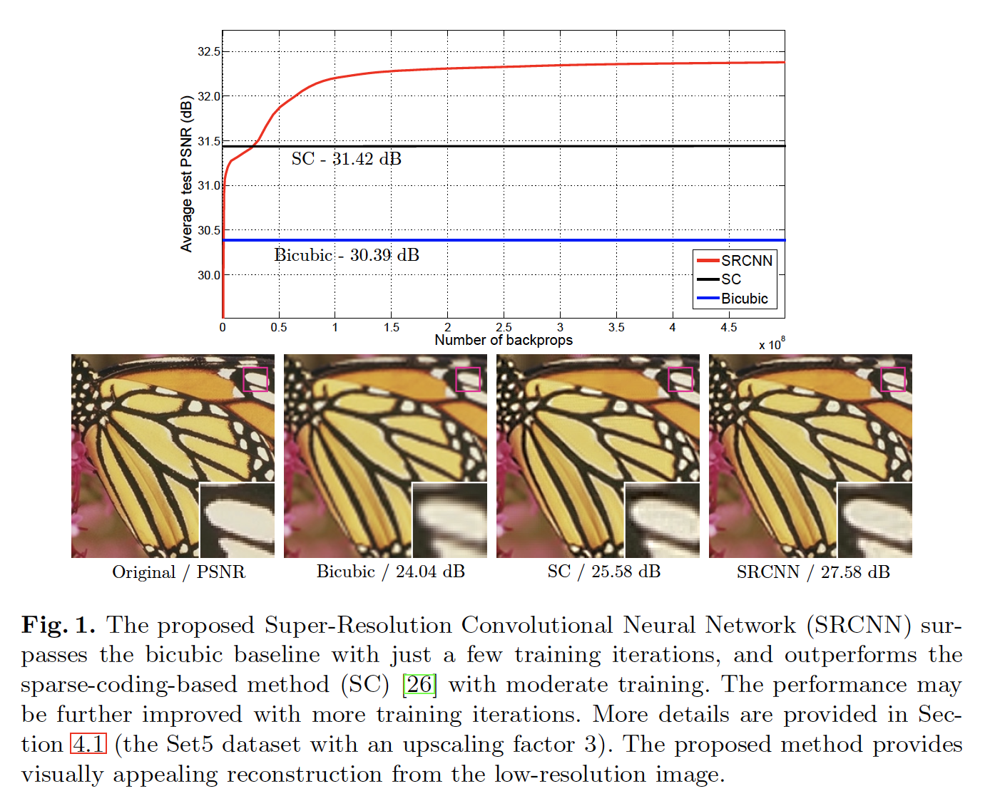

​		我们称所提出的模型为 Super-Resolution Convolutional Neural Network

（SRCNN）。所提出的SRCNN有几个吸引人的特性。第一，其结构经过精心设计，同时考虑了简单性，但与基于最新示例的方法相比，仍提供了更高的准确性。表1展示了示例的比较。第二，通过适度的滤波器和层数，即使在CPU上，我们的方法也可以实现实际在线使用的快速速度。我们的方法比一系列基于示例的方法要快，因为它是完全前馈的，不需要解决使用上的任何优化问题。第三，当（i）更大的数据集可用时，和/或（ii）使用更大的模型时，实验结果表明网络的恢复质量可以进步得到改进。相反，更大的数据集/模型可能会给现有的基于示例的方法带来挑战。

​		整体上来说，这项工作的贡献主要有三个方面：

1. 我们提出用于图像超分辨率的卷积神经网络。网络直接学习低和高分辨率之间的端到端映射，而无需进行优化即可进行很少的前/后处理。
2. 我们在基于深度学习的SR方法和传统的基于稀疏编码的SR方法之间建立了联系。 这种关系为网络结构的设计提供了指导。
3. 我们证明深度学习在经典的超分辨率计算机视觉问题中很有用，并且可以实现良好的质量和速度。

### 2    相关工作

**Image Super-Resolution**	一类最新的SR方法[9,4,25,26,24,2,28,20]了解低/高分辨率补丁之间的映射。这些研究在如何学习紧凑的字典或流形空间以关联低/高分辨率补丁以及如何在此类空间中执行表示方案方面有所不同。在Freeman等[8]的先驱工作中，字典可以直接表示为低/高分辨率补丁，在低分辨率空间寻找最近邻（Nearest Neighbour：NN），并使用其对应的高分辨率补丁进行重构。Chang等[4]引入流行嵌入技术作为NN的替代方案。在Yang等[25、26]的工作中，上述NN对应的发展为更复杂的稀疏编码公式。这种基于稀疏编码的SR方法及其改进[24、20]是当前最先进的SR方法。在这些方法中，补丁是优化的重点； 补丁提取和聚合步骤被视为预处理/后处理，并分别进行处理。

**Convolutional Neural Networks**	卷积神经网络（CNN）可以追溯到几十年[15]，最近由于其在图像分类中的成功[14]而显示出爆炸性的普及。在此过程中，有几个至关重要的因素：（i）在功能强大的现代GPU上实现高效训练，（ii）ReLU使其收敛更快，同时仍保持良好的质量，以及（iii）轻松访问大量数据（例如ImageNet [5]）来训练较大的模型。我们的方法也得益于这些进步。

**Deep Learning for Image Restoration**	已经有一些使用深度学习技术进行图像恢复的研究。所有层都是全连接的MLP用于自然图像去噪和去模糊后去噪。与我们的工作更紧密相关的是，卷积神经网络被用于自然图像去噪[12]和消除噪声模式（污垢/雨水）[6]。这些恢复问题或多或少是由去噪驱动的。 相反，就我们所知，图像超分辨率问题尚未见证深度学习技术的使用。

### 3	Convolutional Neural Networks for Super-Resolution

#### 3.1	Formulation

​		考虑单幅低分辨率的图像。我们首先使用bicubic插值将其放大到期望的大小，这仅是我们进行的预处理。将插值图像表示为$\mathbf{Y}$。我们的目标是从$\mathbf{Y}$中恢复图像$F(\mathbf{Y})$，该图像与ground-truth高分辨率图像$\mathbf{X}$尽可能相似。为了便于表达，我们仍称$\mathbf{Y}$为“低分辨率”图像，尽管它与$\mathbf{X}$有相同的大小。我们希望学习映射$F$，其概念上包含三种操作：

1. **Patch extraction and representation：** 该操作从低分辨率图像$\mathbf{Y}$上提取（重叠）的补丁，并将每个补丁表示为高维向量。这些向量组成一组特征图，它的数量等于向量的维度。	
2. **Non-linear mapping：** 该操作将每个高维向量非线性地映射到另一个高维向量。从概念上讲，每个映射向量都是高分辨率补丁的表示。这些向量组成另一组特征图。
3. **Reconstruction：** 此操作汇总了上面的高分辨率逐块表示，以生成最终的高分辨率图像。预期该图像与ground-truth $\mathbf{X}$相似。

​        我们将展示所有这些操作形成一个卷积神经网络。 图2概述了网络。接下来，我们详细介绍每个操作的定义。

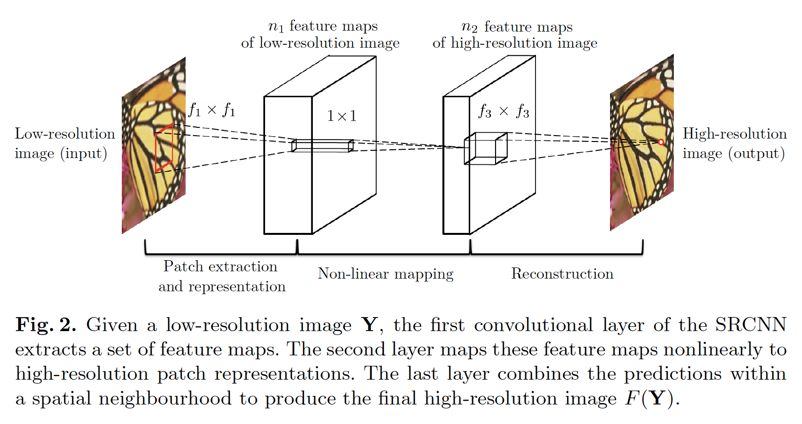

**Patch Extraction and Representation**	图像恢复的流行策略是密集地提取补丁，然后通过一组预训练的base（例如PCA、DCT、Haar等）表示他们。这等价于通过一组滤波器卷积图像，其中每个滤波器是一个基。在我们的形式中，我们将这些base的优化纳入网络的优化。形式上，我的第一层表示为操作$F_1$：

$$F_1(\mathbf{Y}) = \max(0, W_1 \ast \mathbf{Y} + B_1), \tag{1}$$

其中$W_1$和$B_1$分别表示滤波器和偏置项。这里，$W_1$的大小为$c\times f_1 \times f_1\times n_1$，其中$c$为输入图像的通道数，$f_1$为滤波器的大小，$n_1$为滤波器的数量。直觉上，$W_1$在图像上使用$n_1$个卷积，每个卷积有的核大小为$c \times f_1 \times f_1$。输出包含$n_1$个特征图。$B_1$为$n_1$维向量，它的每个元素于一个滤波器关联。在滤波器响应上使用ReLU。

**Non-linear Mapping**	第一层为每个补丁提取$n_1$维的特征向量。在第二个操作中，我们将$n_1$维向量中的每一个映射到$n_2$维向量。这等价于使用$n_2$个滤波器，它的核大小为$1\times1$。第二层的操作为：

$$F_2(\mathbf{Y})=\max(0, W_2 \ast F_1(\mathbf{Y}) + B_2).\tag{2}$$

这里，$W_2$的大小为$n_1 \times 1 \times 1 \times n_2$，$B_2$为$n_2$维。输出的$n_2$维向量的每一概念上是用于重构的高维补丁的表示。

​		增加更多卷积层（它的核大小为$1\times1$）来增加非线性是可能的。但是这会显著增加模型的复杂度，因此需要更多训练数据和事件。本文中，我们选择在这个操作中使用单个卷积层，因为它已提供吸引人的质量。

**Reconstruction**	在传统方法中，通常平均预测的高分辨率补丁以生成最终的完整图像。平均可以视为一组特征图（其中每个位置为高分辨率补丁的“flattened”向量形式）上预定义的滤波器。受此启发，我们定义一个卷积层来生成最终的高分辨率图像：

$$F(\mathbf{Y})=W_3 \ast F_2(\mathbf{Y}) + B_3.\tag{3}$$

其中，$W_3$的大小为$n_2 \times f_3 \times f_3 \times c$，$B_3$为$c$维向量。

​		如果高分辨率补丁的表示位于图像域中（即我们可以简单地对每个表示进行reshape以形成补丁），则我们希望这些滤波器的作用类似于平均滤波器； 如果高分辨率补丁的表示位于其他一些域中（例如，以某些基数表示的系数），则我们期望$W_3$的行为类似于首先将系数投影到图像域上然后进行平均。无论哪种形式，$W_3$都是一组先行滤波器。

​		有趣的是，尽管上述三种操作受不同的直觉启发，但它们都导致了与卷积层相同的形式。我们将三种操作放在一起，并构成卷积网络（图2）。在这个模型中，优化所有滤波器权重和偏置项。尽管整体结构简洁，但我们的SRCNN模型还是通过借鉴超分辨率的重大进展而积累的广泛经验而精心开发的[25、26]。 我们将在下一节中详细说明这种关系。

#### 3.2	Relationship to Sparse-Coding-Based Methods

​		我们证明基于稀疏编码的SR方法[25、26]可以视为一个卷积神经网络。图3显示了一个图示。

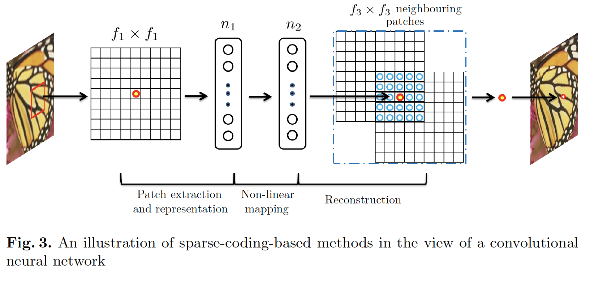

​		在基于稀疏编码的方法中，令我们考虑从输入图像提取的$f_1 \times f_1$的低分辨率补丁，这个补丁减去其均值，然后映射到（低分辨率）字典。如果字典的大小为$n_1$，这等价于在输入图像上使用$n_1$个线性滤波器（$f_1 \times f_1$）（平均减法也是线性运算，因此可以被吸收）。这如图3的左部分。

​		然后，稀疏编码solver用于映射的$n_1$个系数（例如Feature-Sign solver[17]）。这个solver的输出为$n_2$个系数，通常在稀疏编码案例中，$n_2 = n_1$。这$n_2$个稀疏是高维分辨率补丁的表示。在这个意义上，稀疏编码solver扮演一个非线性映射操作。见图3的中间部分。然而，稀疏编码solver不是前馈，即它不是迭代算法。相反，我们的非线性操作是完全反馈的，并可以高效计算。我们的非线性操作可以视为逐像素的全连接层。

​		然后，上述$n_2$个系数（稀疏编码之和）被映射到另一个（高分辨率）字典以生成高分辨补丁。然后，平均重叠的高分辨率补丁。如上讨论，这等价于$n_2$个特征图上的线性卷积。如果用于重构的高分辨率补丁的大小为$f_3 \times f_3$，然后线性滤波器有相等的空间核大小$f_3 \times f_3$。见图3的右部分。

​		上述讨论表明基于稀疏编码的SR方法可以视为一种卷积神经网络（具有不同的非线性映射）。但是，不是所有操作在基于编码的SR方法的优化中都被考虑。相反，在我们的卷积神经网络中，低分辨率字典、高分辨率字典、非线性映射以及平均减法和平均都涉及需要优化的滤波器。因此，我们的方法优化包含所有操作的端到端映射。

​		上面的类比也可以帮助我们设计超参数。例如，我们可以设置最后一层的滤波器大小小于第一层，因此，我们更依赖高分辨率补丁的中心部分（最极端的是，如果$f_3 = 1$，我们使用的是中心像素，没有求平均值）。我们还可以设置$n_2 < n_1$，因为它有望变得更稀疏。通常的设置是$f_1=9$、$f_3 = 5$、$n_1 = 64$以及$n_2=32$（我们在实验章节中评估更多设置）。

#### 3.3	Loss Function

​		学习端到端的映射函数$F$要求参数$\Theta = \{W_1, W_2,W_3,B_1,B_2,B_3\}$的估计。这通过最小化重构图像$F(\mathbf{Y};\Theta)$和相应ground-truth高分辨率图像$\mathbf{X}$之间的损失获得。给定一组高分辨率图像$\{\mathbf{X}_i\}$以及它对应的低分辨率图像$\{\mathbf{Y}_i\}$，我们使用Mean Squared Error（MSE）作为损失函数：

$$L(\Theta)=\frac{1}{n}\sum_{i=1}^n\|F(\mathbf{Y}_i;\Theta) - \mathbf{X}_i\|^2,\tag{4}$$

其中$n$为训练样本的数量。使用SGD最小化损失。

​		使用MSE作为损失函数有利于高PSNR。PSNR是用于定量评估图像恢复质量的广泛使用的度量，并且至少部分与感知质量有关。值得注意的是，如果仅可推导损失函数，则卷积神经网络并不排除使用其他种类的损失函数。如果在训练过程中给出了更好的感知动机指标，则网络可以灵活地适应该指标。我们将在以后研究此问题。 相反，通常对于传统的“手工”方法很难实现这种灵活性。

### 4	实验

**数据集**	为了与传统基于示例的方法比较，我们使用与[20]相同的训练集、测试集和协议。具体而言，训练集包含91张图像。**Set5**（5张图像）用于评估放大2、3、4倍时的性能，**Set14**（14张图像）用于评估方法3倍的性能。除了91张训练集外，我们还在5.2节中研究更大训练集的影响。

**比较**	我们将**SRCNN**与最先进的SR方法（Yang等[26]的SC（sparse coding）、基于K-SVD的方法[28]、NE+LLE (neighbour embedding + locally linear embedding) [4]、NE+NNLS (neighbour embedding + non-negative least squares) [2]和ANR (Anchored Neighbourhood Regression)比较。

**实现细节**	如3.2节，我们设置$f_1=9$、$f_3=5$、$n_1=64$以及$n_2=32$。我们将在第5节中评估替代设置。对于每个放大因子∈{2，3，4}，我们针对该因子训练一个特定的网络（对于放大因子3，输入大小为$33 \times 33$，因此可以被3整除）。

​		在训练阶段中，ground-truth图像$\{\mathbf{X}_i\}$准备为从训练图像上随机裁剪的$32 \times 32$像素的子图。所谓“子图像”，是指这些样本被视为小的“图像”而不是“补丁”，因为“补丁”是重叠的，并且需要一些平均后处理，而“子图像”则不需要。为了生成低分辨率样本$\{\mathbf{Y}_i\}$，我们通过适当的高斯核模糊子图，通过放大因子对其进行二次采样以及通过双三次（bicubic）插值以相同的因子进行采样。91张训练图像大约能提供24800张子图。从原始图像上以14的步长提取子图。我们还尝试更小的步长，但是没有观察到明显的性能提高。根据我们的观察，训练集足以训练所提出的深度网络。在GTX 770 GPU上，训练（$8 \times 10^8$次迭代）大约花费3天。

​		遵循[20]，我们在实验中仅考虑亮度通道（luminance channel）（在YCrCb颜色空间中），因此第一层/最后一层的$c = 1$。两个色度通道上使用双三次上采样，仅用于显示目的，而不用于训练/测试。注意，通过设置$c=3$，我们的方法可以扩展到直接训练彩色图像。本文中，我们使用$c=1$以与前面的方法进行公平比较，因为大多数方法仅考虑亮度通道。

​		训练过程中，为了避免边界框影响，所有卷积都不使用填充，并且网络产生较小的输出（$20 \times 20$）。MSE损失函数仅通过$\mathbf{X}_i$的中心$20 \times 20$裁剪与网络输出之间的差来评估。在处理测试图像时，卷积神经网络可以用于任意大小的图像。测试期间，所有卷积层被给定足够的零填充，使得输出与输入有相同的大小。为了处理边界影响，在每个卷积层中，每个像素的输出（在ReLU之前）通过有效输入像素的数量归一化，这个数量可以预先计算。

​		每一层的滤波器的数量有服从均值为零、标准差为0.001的高斯分布初始化。前两层的学习率设置为$10^{-4}$，最后一层的学习率设置为$10^{-5}$。从经验上我们发现，最后一层的较小学习速率对于网络收敛很重要（类似于去噪情况[12]）。

#### 4.1	定量评估

​		如表1和表2所示，在所有实验中，所提出的SRCNN产生最高的PSNR。

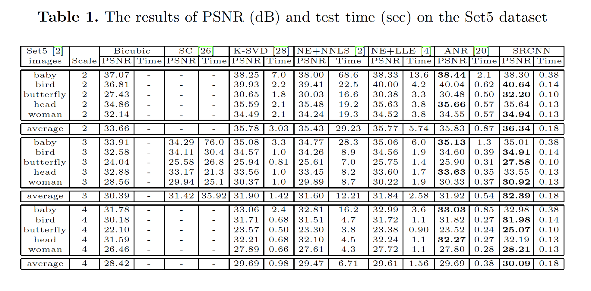

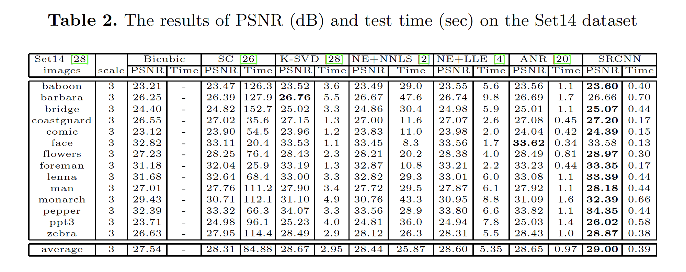

与已有的最先进方法的比较见图6。

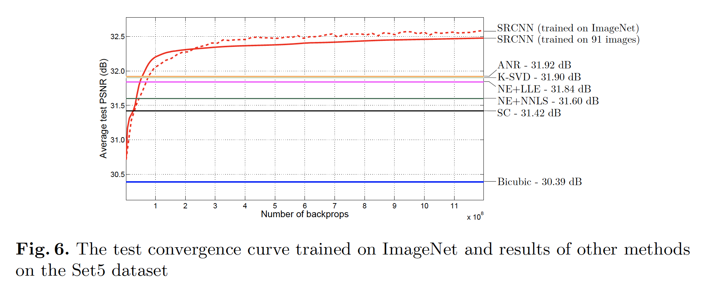

图7、8和9给出上采样3倍时，不同方法的超分辨率结果。可以看出，SRCNN产生的边缘比其他方法要清晰得多，而整个图像上没有任何明显的伪影。 尽管具有最佳平均PSNR值，但建议的SRCNN在Set5的“baby”和“head”图像上仍未实现最高PSNR。 尽管如此，我们的结果在视觉上仍然很吸引人（见图10）。

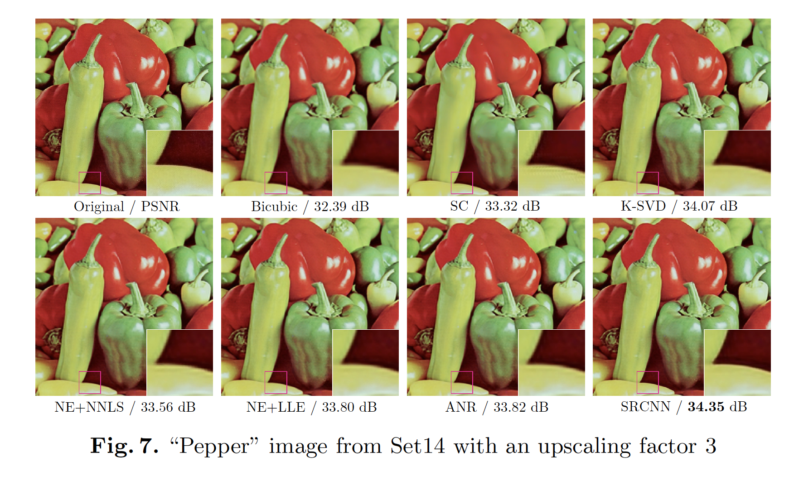

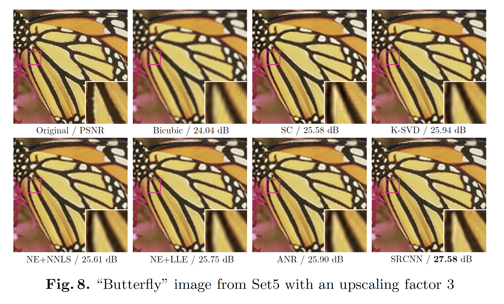

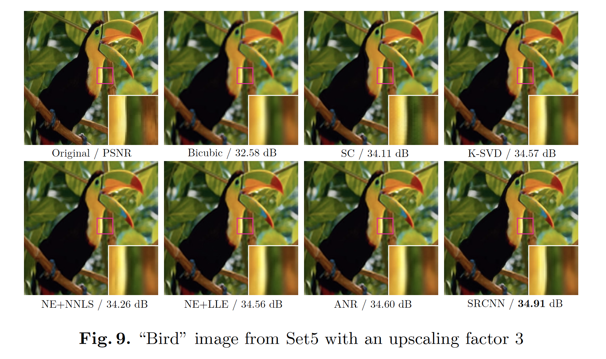

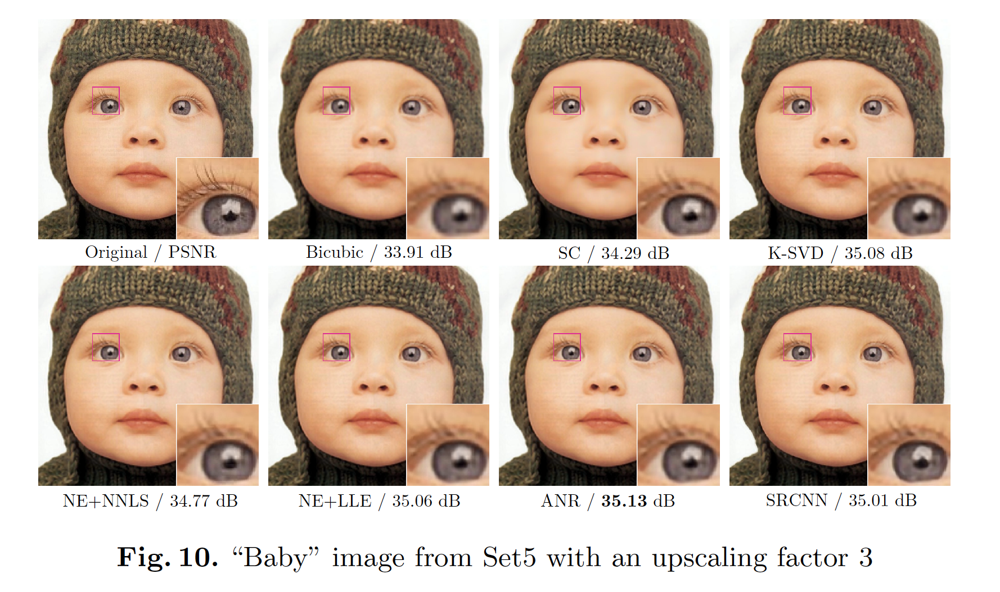

#### 4.2	运行时间

​		图4显示了几种最先进方法的运行时间比较，以及它们的恢复性能。

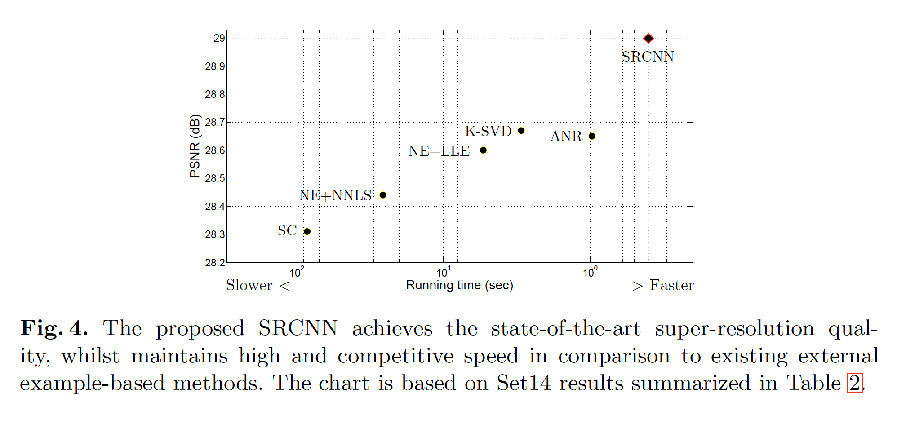

### 5	进一步分析

#### 5.1	Learned Filters for Super-Resolution

​		图5展示了学习的第一层滤波器的示例，该滤波器在按比例放大2的91幅图像（24,800个子图像）上训练。请参阅我们已发布的实现，以了解放大倍数3和4的模式。有趣的是，每个学习到的滤波器有其特定功能。例如，滤波器$a$和$f$与Laplacian/Gaussian滤波器相似，滤波器$b$、$c$和$d$与不同方向的边缘检测器相似，$d$像纹理提取器。我们观察到“dead”滤波器，它的权重全接近零，与[27]观察到的相似。然而，给定足够长的训练时间，这些死滤波器中的一些可能会出现模式。 我们将在以后的工作中对此现象进行调查。

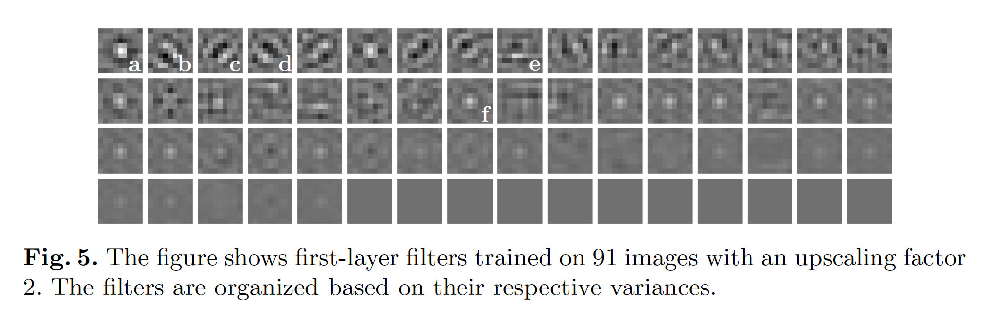

#### 5.2	Learning Super-Resolution from ImageNet

​		如文献所示，深度学习通常受益于大型训练数据。在上述实验中，我们使用包含91张图像的标准训练集以保证与已有方法进行公平比较。本节中，给定大型训练集时，我们证明我们的深度模型可以获得更好的性能。我们将来自ILSVRC 2013 ImageNet检测训练分区的共计395909张图像用于SRCNN学习。这些图像使用33的步长分解为5百万个子图。我们使用与上述实验相同的网络设置，即$f_1=9$、$f_3=5$、$n_1=64$以及$n_2=32$。在ImageNet上的训练时间与91张图像相同，因为反向传播数量相同。在具有放大因子3的Set5进行测试实验。在ImageNet上的测试收敛曲线和其他方法的结果见图6。可以观察到，在相同的反向传播次数（即$8 \times 10^8$）下，SRCNN+ImageNet获得32.52dB，比91张图像（或24800张子图）上训练的原始SRCNN产生的32.39dB高。结果肯定地表明，使用更大和更多样化的图像训练集可以进一步提高SRCNN的性能。

#### 5.3	滤波器的数量

​		与其他CNN结构相比，我们使用相对较小的网络尺度获得最佳性能。一般而言，如果我们扩大网络尺度（例如添加更多层和滤波器）性能会进一步提升。特别地，基于我们网络的默认设置$n_1=64$和$n_2=32$，我们进行两个附加实验：（i）使用$n_1=128$和$n_2=64$的更大网络，（ii）使用$n_1=32$和$n_2=16$的更小网络。与5.2节相似，我们还在ImageNet上训练模型，在具有3倍放大因子的Set5上测试。结果见表3。显然，使用更多的滤波器可以实现卓越的性能。 但是，如果需要快速的恢复速度，则首选较小的网络规模，这仍然可以实现比现有技术更好的性能。

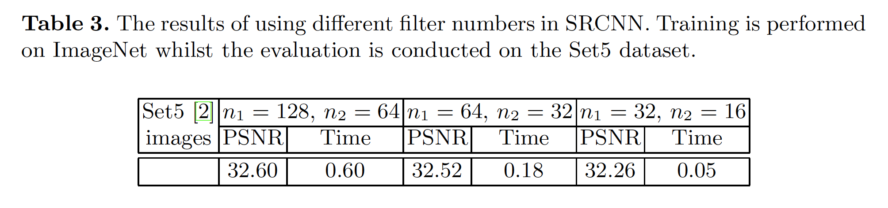