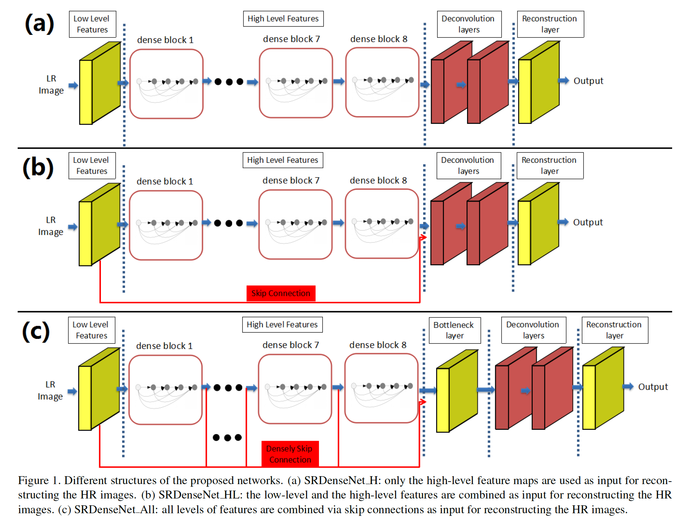
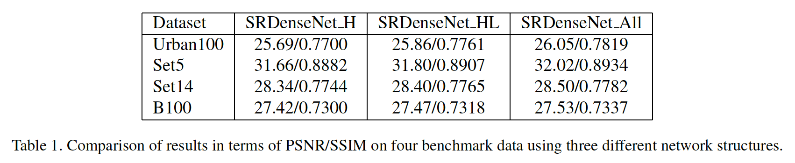
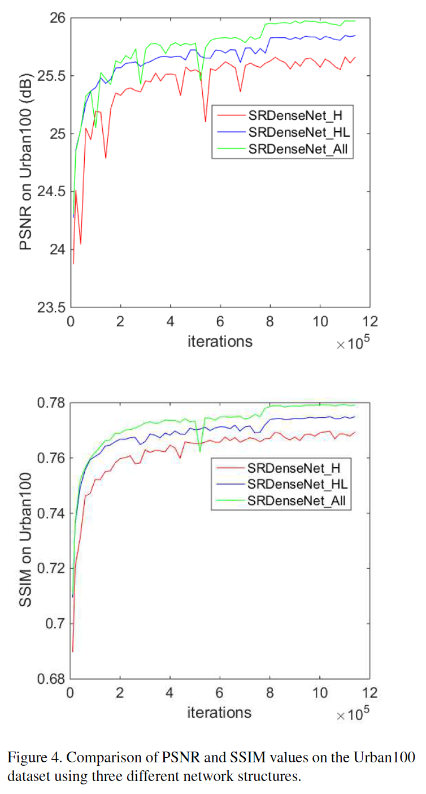
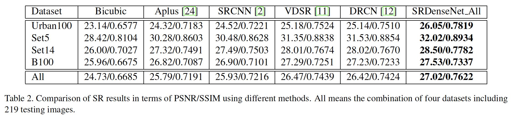
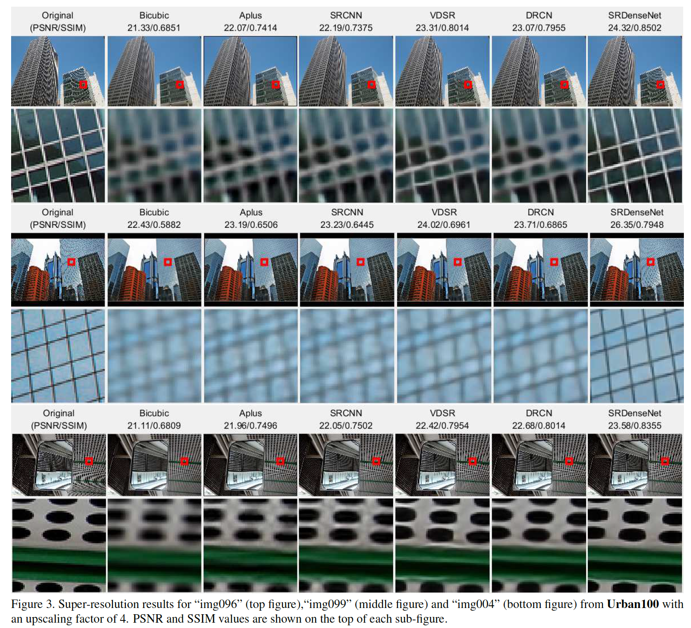

## Image Super-Resolution Using Dense Skip Connections

### 摘要

​		最近的研究表明使用深度卷积神经网络可以明显提升单图像超分辨率方法的性能。在这项研究中，我们通过在非常深的网络中引入密集skip连接而提出新颖的单图像超分辨率方法。在所提出的网络中，每层的特征图被传入所有后续层，这提供了组合低级特征和高级特征来提高重建性能的有效方式。此外，网络中密集的跳过连接使短路径可以直接从输出到每一层得到建立，从而缓解了非常深的网络消失的梯度问题。此外，将反卷积集成到网络以学习上采样滤波器，并加速重建过程。进一步地，所提出的方法实质上减小参数量，这增强计算效率。我们使用四个基准测试数据集的图像评估所提出的方法，并设置新的SOTA。

### 1.引言

​		由于从LR到HR空间的映射有多种解，所以从低分辨率（LR）版恢复高分辨率图像是高度病态的问题。当放大因子较大时，恢复图像超分辨率（SR）中的高频细节非常具有挑战。许多SR技术假设高分辨信息是冗余的，并且可以从低频数据准确地预测。因此，重要的是从LR图像中大范围收集有用的上下文信息，以便可以捕获足够的知识来恢复HR图像中的高频细节。

​		最新工作[11、12]成功使用非常深的卷积神经网络（CNN）来进行单图像超分辨率（single image super-resolution：SISR），并且观察到浅层CNN结构上的明显改进。使用更深网络的一个好处是较大的感受野会从LR图像中获取更多上下文信息，以预测HR图像中的数据。但是，由于梯度消失问题，高效训练非常深的CNN是一个挑战性任务。对于这个问题，一种好的解决方案是使用skip connection，其创建从top层到bottom层的短路径。这有助于通过网络进行信息流和梯度传递，使其易于训练。 另外，在以前的工作中[2、11]，仅高层的高层特征被用于HR图像的重建。底层特征可以潜在提供额外信息来重建HR图像中的高频细节。图像SR可能会受益于不同级别的特征的集体知识。此外，先前的研究[8、7]已表明在深度网络的不同层学习到冗余特征图。从底层重用特征图有助于减少特征冗余，从而学习更紧凑的CNN模型。

​		在这项工作中，我们提出新颖的超分辨率方法（称为SRDenseNet），其中采用密集连接的卷积网络。密集连接的引入改善通过网络的信息流，缓解梯度消失的问题。此外，它允许前面层的特征图的重使用。与先前的工作不同，我们利用密集skip连接来结合低级特征图和高级特征，从而提供丰富的信息进行SR重建。此外，集成反卷积以恢复图像细节，并加速重建过程。所提出的方法已在四个可公开获得的基准数据集上进行了评估，其性能优于当前的最新方法。

### 2. 相关工作

#### 2.1. 单图像超分辨率

​		计算机视觉社区已开发许多SISR方法。这项方法的详细回顾见[26]。它们之中，插值方法容易实现并被方法使用。但是，这些线性方法的表示能力非常有限，并且通常生成模糊的高分辨率输出。最近，已开发基于稀疏表示的技术[28、24]利用丰富的图像先验增强线性模型。这些技术假设任何自然图像补丁可以由原子字典稀疏表示。字典可由补丁数据库构成或者从数据库学习。这样的基于字典的方法获得可比的SOTA结果。这些方法的一个缺点是发现稀疏编码稀疏的解决方案通常在计算上是昂贵的。

​		除了基于稀疏的方法外，还开发其他复杂的学习技术来见面从LR到HR空间的映射，包括最近邻嵌入、随机森林和卷积神经网络。在它们之中，基于CNN的方法[11、12]最近设置SISR的SOTA。[2]首先开发具有三层的网络来学习SR的端到端映射。接着，[11]中提出具有20层的深度网络来改进CNN的重建准确率。[11]中使用HR图和插值LR图像之间的残差来加速训练中的收敛速度，并且还改进重建性能。与其使用[2、11]中的插值进行放大，最近的研究[3、21]表明SR性能可以通过学习放大滤波器以进一步改进准确率和速度。通过使用反卷积层[3]或亚像素卷积层[21]，可以有效地学习放大操作。在我们的工作中，我们采用非常深的网络，并且还集成反卷积层以进一步提升重建性能。

#### 2.2. Skip Connections

​		随着CNN逐渐加深，梯度消失问题妨碍网络训练。已提出许多方法处理这个问题。ResNets[6]和Highway Networks[22]使用层之间的旁路来高效训练超过100层的网络。Stochastic depth[8]随机丢弃层来改进深度残差网络的训练，其表明深度残差网络中存在非常大量的冗余。FractalNets[14]组合几种不同深度的网络，以及在网络中创建许多短路径。DenseNets[7]连接网络中的所有层，并尝试充分探索skip connection的优势。所有这些网络共享关键思想：在层之间构建许多skip connection对于高效训练非常深的网络至关重要。

​		[12]中使用的skip connection连接输入数据月最终的重建层。[12]中获得SOTA结果。但是，[12]仅采用一个skip connection，其可能没有充分利用skip connection。在编码-解码网络中引入许多对称的skip connection进行图像恢复任务。但是，与使用单个跳过连接的DRCN方法[12]相比，SR性能的提高是微不足道的。在非常深的CNN中使用合理数量的跳过连接的有效方法可能会提高SR重建性能。

#### 2.3. 贡献

​		Skip连接可以缓解梯度消失问题，并增强深度网络中的特征传播。在这些工作中，我们在深度网络中引入dense skip connection进行SISR。我们的主要贡献为：

- 我们证明具有denseNet的深度CNN框架作为基本块可以获得良好的重建性能，并且通过密集skip connection进行的不同层的特征融合可以进一步提高SISR的重建性能。
- 在四个基准数据集上实现新的SOTA，其放大倍数为4，并且在SR结果中很容易注意到视觉上的改进。所提出的框架不仅获得令人深刻的结果，还可以非常快速地实现。

### 3. 方法

​		所提出的网络旨在学习LR图像$I_L$和HR图像$I_H$之间的端到端映射函数$F$。如图1所示，SRDenseNet可以分解为几个部分：学习低级特征的卷积层、学习高级特征的DenseNet块、学习放大滤波器的反卷积层和生成HR输出的重建层。每个卷积或反卷积层+ReLU进行非线性映射，但重建层除外。按位使用ReLU激活函数。令$X_{i-1}$为输入，第$i$个卷积或反卷积层的输出表示为：

$$X_i = \max(0, w_i * X_{i-1} + b_i) \tag{1}$$

其中$W_i$和$B_i$为层中的权重和偏置项，为了公式方便，$*$表示卷积或反卷积操作。令$\Theta$表示网络中所有权重和偏置项$\Theta = \{W_i, B_i\}, i=1, \cdots, m$。给定一组训练图像对$\{I_L^k, I_H^k\}$，我们最小化如下的均方误差（Mean Squared Error：MSE）：

$$l(\Theta) = \frac{1}{N}\|F(I_L^k, \Theta) - I_H^k\|_2^2\tag{2}$$

Adam[13]用于在上述公式中找出最优的权重和偏置。接下来，我们将描述所提出网络结构的细节。

#### 3.1. DenseNet blocks

​		在将卷积层用于输入LR图像学习低级特征后，使用一组DenseNet块学习高级特征。[7]中最先提出DenseNet结构。与[6]中所提出的ResNets不同，DenseNet中拼接特征图，而不是直接将它们加起来。接着，第$i$层接受所有前面层的特征图作为输入：

$$X_i = \max(0, w_i * [X_1, X_2, \cdots, X_{i-1}] + b_i) \tag{3}$$

其中$[X_1, X_2, \cdots, X_{i-1}]$表示前面卷积层$1,2,\cdots,i-1$生成的特征图的拼接。在DenseNet的结构中，创建层与每个其他层之间的短路径。这加强深度网络的信息流，因此缓解梯度消失问题。此外，DenseNet可以通过特征重用大大减少参数的数量，因此需要较少的内存和计算量即可实现高性能[7]。这里，我们采用DenseNet结构作为我们的网络中的构建块。每个denseNet块的结构见图2。具体而言，在我们的工作中，一个DenseNet块有8个卷积层。如果每个卷积层产生$k$个特征图作为输出，一个DenseNet块生成的特征图的总数为$k * 8$，其中$k$称为_growth rate_。_growth rate_ $k$调节每一层为最终重建贡献多少新信息。为了阻止网络增长太快，在这项研究中，将_growth rate_ $k$设置为16。结果是一个DenseNet块产生128个特征图。

#### 3.2. 反卷积层

​		在诸如SRCNN[2]和VDSR[11]的先前SR方法中，使用bicubic 插值将LR图像放大到HR空间。之后，包括计算量大的卷积在内的SR过程是在HR空间中执行的。这增加SR的计算复杂度。此外，插值方法没有为解SR问题带来新信息。因此，最近的工作[3、17]采用反卷积层来学习放大滤波器，其还可以恢复图像细节。反卷积层可以视为卷积层的逆操作。它可以学习各种可共同用于预测HR图像的放大核。使用反卷积层进行放大有两个优势。第一，它加速SR重建过程。在网络的末端添加反卷积层后，整个计算过程在LR空间进行。如果放大因子为$r$，它会将计算成本减小$r^2$倍。此外，来自LR图像的大量上下文信息用于推断高频细节。使用相同的深度，在末端具有反卷积层的网络的感受野大约是在开始时使用插值网络的$r^2$倍。在我们的工作中，训练了两个连续的具有$3\times3$小核和256个特征图的反卷积层以进行放大。

#### 3.3. 特征图的组合

​		如图1所示，在我们的工作中研究并比较了三种不同类型的网络结构。与以前的方法[2、11]一样，仅将顶层的特征图用作重建HR输出的输入。我们将这种结构表示为SRDenseNet_H，其如图1（a）所示。此外，在网络中引入skip connection（如图1（b））来拼接低级和高级特征，其我们称为SRDenseNet_HL。然后，拼接的特征图用作反卷积层的输入。此外，我们使用密集skip connection来结合所有卷积层产生的特征图以进行SR重建，并且将这种方法表示为SRDenseNet_All。在实验部分将对使用不同网络结构的SR结果进行比较。

#### 3.4. Bottleneck and Reconstruction layers

​		在所提出的SRDenseNet_All（如图1（c）所示），拼接网络中的所有特征图，产生后续反卷积层的许多输入。如果将大量特征图直接馈入反卷积层，那么会明显增加计算成本和模型尺寸。因此，减小输入特征图数量以保持模型紧凑和改进计算效率是必要的。先前的研究也证明$1 \times 1$的卷积层可以用作瓶颈层以减少输入特征图的数量。为了提高模型紧凑性和计算效率，我们采用瓶颈层来减小将它们馈入反卷积层之前的特征数。使用$1\times1$瓶颈层将特征图的数量减少至256。之后，反卷积层将LR空间的256个特征图转换为HR空间。最后，HR空间中的特征图用于通过重建层生成HR图像。重建层是具有$3\times3$核和一个输出通道的卷积层。

### 4. 实验

​		在本节中，我们在四个基准测试数据集上评估所提出方法的性能。首先，描述所提出的数据集，接着是实现细节的介绍。然后，介绍使用不同级别的特征的好处。之后，介绍与SOTA结果的比较。

#### 4.1. 数据集和度量

​		在评估期间，我们使用公开可用的基准测试数据集进行训练和测试。具体而言，从ImageNet随机选择50000张图像进行训练。测试期间，数据集**Set5**和**Set14**常用于SR基准测试。来自Berkeley分割数据集的**B100**（包含100张自然图像）用于测试。此外，所提出的方法还使用**Urban100**数据集（包含100张挑战性图像）进行评估。所有实验均使用LR和HR图像之间的4倍放大因子进行。Peak Signal-to-Noise Ratio（PSNR）和Structural Similarity（SSIM）指数用作评估度量。因为SR在YCbCr颜色空间的亮度通道（luminance channel）进行，所以在图像的Y通道计算PSNR和SSIM。

#### 4.2. 实现细节

​		在HR空间裁剪大小为$100 \times 100$的非重叠子图像。使用4倍放大因子的bicubic核下采样获得LR图像。如先前工作所建议的，每幅图像已被转换到YCbCr空间，仅使用Y通道用于训练。在所有网络中，使用9个DenseNet块，产生64个卷积层。在每个块中，将growth rate设置为16。每个块生成128个特征图的输出。所以权重层中的滤波器大小设置为$3 \times 3$。使用[5]中所提出的方法初始化权重，偏置项初始化为0。将ReLU作为激活函数。使用Adam优化所有网络。学习率最初设置为0.0001，在30个周期后减小10倍。训练期间，将mini-batch大小设置为32。在60个周期后，没有观察到损失的改进，所以停止训练。使用NVIDIA Titan X GPU进行训练和测试。

#### 4.3. 特征组合的好处

​		比较使用如图1所示的三种网络结果的重建性能。表1展示四个数据集上获得PSNR和SSIM值。正如期望的，在添加skip connection后，SRDenseNet_HL获得比SRDenseNet_H更好的结果。这表明低级特征和高级特征的组合可以改进SR的重建性能。这表明在不同级别的SR特征图之间存在补充信息。通过组合不同级别的特征获得的改进也可以在图4中看到。

#### 4.4. 与SOTA方法的比较

​		我们比较了使用提出的方法和使用其他SISR方法的结果，包括双三次、Aplus [24]、SRCNN [2]、VDSR [11]和DRCN [12]。这些方法的实现已在线发布，因此可以在相同的数据集上进行公平比较。对于SRCNN，在这节中，使用9-5-5图像模型进行比较。至于Aplus方法[24]，它没有预测图像边界。为了保证公平比较，裁剪HR图像边界是的所有结果有相同的区域。使用[9]中的公开代码来计算评估指标。表2展示四个基准测试数据集上的平均PSNR和SSIM值。在PSNR方面，与不同数据集上的SOTA结果相比，所提出的方法实现了0.2dB-0.8dB的改进。平均而言，使用所提出的方法，在具有3层CNN的SRCNN [2]上实现了约1.0 dB的提高，在具有20层CNN的VDSR [11]上实现了约0.5 dB的提高。应该提到的是，在极富挑战性的数据集Urban100上获得了最大的改进。

​		使用不同方法的视觉比较见图3和图5。在图3中，只有所提提出的方法才能很好地重建线条和轮廓，而其他方法则产生模糊的结果。此外，在使用现有方法（即图5中图）的一些重建结果中发现严重变形，而我们的方法可以重建纹理图案并避免变形。

### 5. 讨论和未来的工作

​		当所提出的SRDenseNet_All展开后，最长的链有69个权重层和68个激活层。SR任务在两方面可以得益于使用这种非常深的网络：（a）因为感受野的大小与深度成比例，所以可以利用LR图像中的大量上下文信息来推理HR图像中的高频信息；（b）由于许多ReLU层的使用，所以可以利用非常深网络的高度非线性来见面LR图像和HR图像之间的复杂映射函数。非常深网络的一个挑战性问题是梯度消失问题。在这项工作中，我们利用DenseNet结构作为构建块来缓解这个问题。DenseNets允许层使用它们前面层的特征图。这提供了一种有效的方法来重用已经学习的特征图，并迫使当前层学习补充信息，从而避免了学习冗余特征。此外，每层都有与所提出网络中损失连接的短路径，这产生一种隐式的深度监督[16]。这可以帮助训练非常深的网络并提高SR中的重建性能[12]。

​		提出了几种技术来提高准确性和加快SR过程，从而为所提出的框架提供了新颖性。为了提高重建精度，提出并整合了三种技术。（a）第一，DenseNet被用作我们网络中的基本模块。 这是第一项使用denyNet进行SR的工作。 使用DenseNet块的好处之一是避免了梯度消失的问题，使我们可以训练非常深的CNN。（b）第二，低级特征和高级特征通过跳过连接融合在一起。特征的不同级别的融合可以提供丰富的信息，以重构高分辨率图像中的高频信息。我们已经证明，融合过程极大地提高了精度，如图4所示，表明了不同级别特征之间的互补信息。（c）连续反卷积层的使用也提高了重建性能。反卷积层可以学习放大的滤波器，从而避免使用先前算法（例如VDSR和DRCN）中采用的双三次插值。因此，DenseNet块的使用只是所提出的框架中提高准确性的部分贡献。

