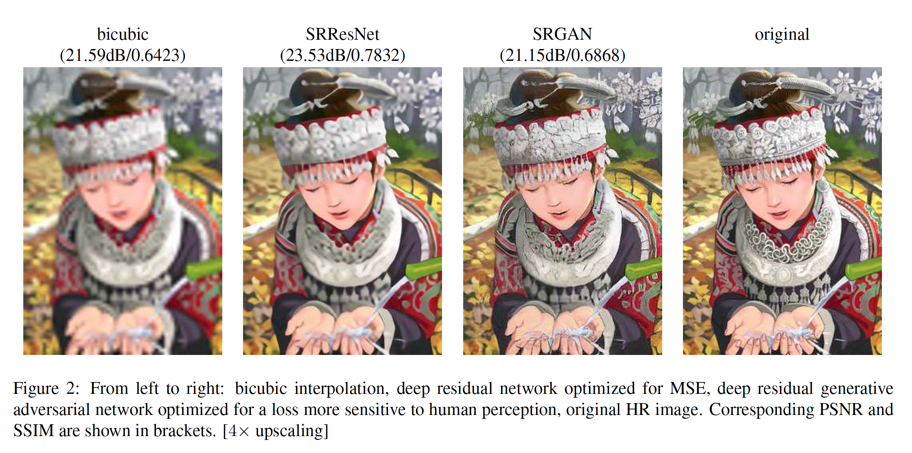
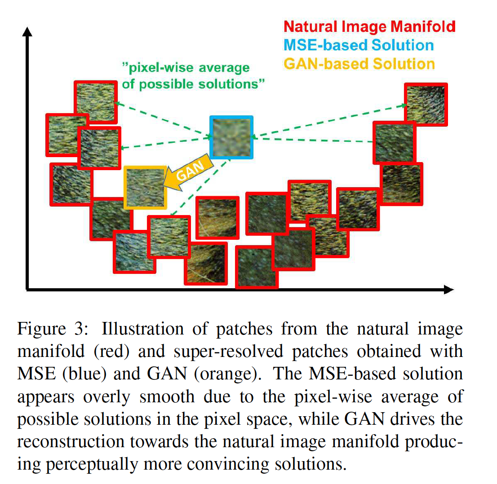
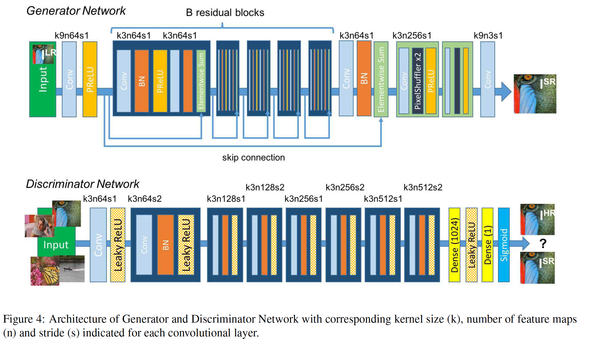
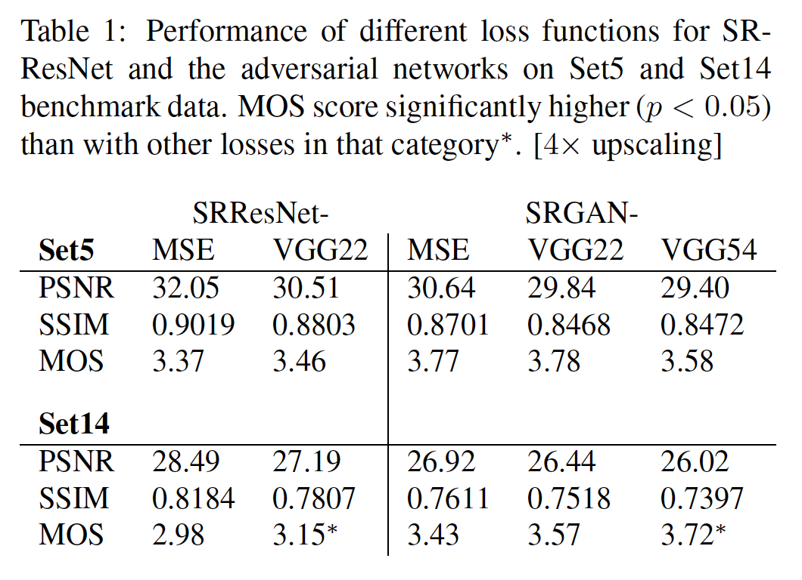
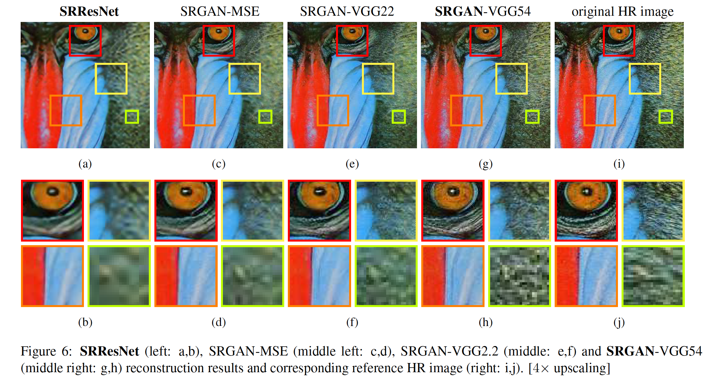
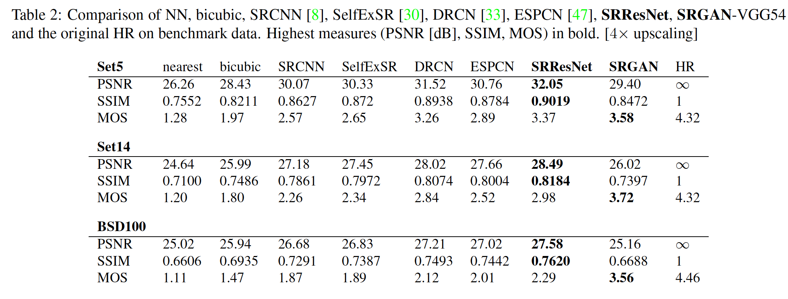
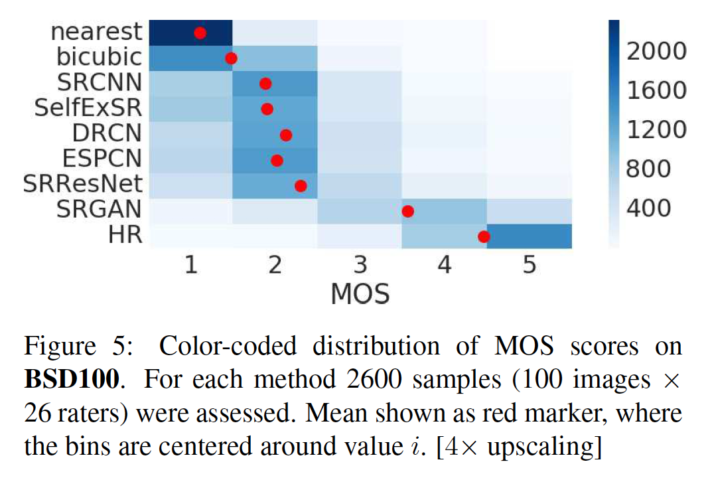

## Photo-Realistic Single Image Super-Resolution Using a Generative Adversarial Network

### 摘要

​		尽管使用更快、更深的卷积神经网络在单图像超分辨率的准确性和速度方面取得了突破，但仍然存在一个主要问题仍未解决：当我们在较大的放大尺度下进行超分辨时，如何恢复更精细的纹理细节？基于优化的超分辨率方法的行为原则上受目标函数选择驱动。最近的工作主要关注最小化均方重建误差。得出的估计值具有很高的峰值信噪比（peak signal-to-noise ratio），但是它们通常缺少高频细节，并且在某种意义上说，它们无法满足较高分辨率下的保真度（fidelity），因此在感觉上并不令人满意。本文中，我们提出SRGAN，一种用于图像超分辨率（SR）的生成式对抗网络（generative adversarial network：GAN）。据我们所知，它是第一个能够针对4倍放大因子推断出逼真的自然图像的框架。为了达到这一目的，我们提出perceptual loss函数，其包含一个对抗损失和一个内容损失。对抗损失使用判别器网络将我们的解决方案推向自然图像流形，该判别器网络经过训练以区分超分辨图像和原始逼真的图像。此外，我们使用感知相似性而不是像素空间相似性引起的内容损失。我们的深度残差网络能够从公开基准测试上严重下采样的图像中恢复逼真的纹理。广泛的均值评分（Mean-Opinion-Score：MOS）测试表明，使用SRGAN可以显着提高感知质量。用SRGAN获得的MOS得分比使用任何最新方法获得的MOS得分更接近原始高分辨率图像的MOS得分。

### 1. 引言

​		从低分辨率（LR）副本估计高分辨率（HR）图像的极富挑战性的任务称为超分辨率（SR）。SR在计算机视觉研究界得到了广泛的关注，并具有广泛的应用[62、70、42]。

​		未确定的SR问题的ill-posed本质对于高放大缩放因子特别明显，因为通常不存在重构SR图像中的纹理细节。监督SR算法的优化目标通常是最小化恢复的HR图像和ground-truth之间的均方误差。这是方便的，因为最小化MSE也会使峰值信噪比（PSNR）最大化，这是用于评估和比较SR算法的常用方法[60]。但是，MSE（和PSNR）捕获感知相关差异（例如高纹理细节）的能力非常有限，因为它们是基于像素级图像差异定义的[59、57、25]。这展示在图2中，其中最高的PSNR不一定反映出感知上更好的SR结果。超分辨和原始图像之间的感知差异意味着恢复的图像不是Ferwerda [15]定义的真实感。

​		在这项工作中，我们提出超分辨率生成对抗网络（SRGAN），为此，我们采用了具有残差连接的深度残差网络（ResNet），并与MSE分开作为唯一的优化目标。与以前的工作不同，我们使用VGG网络的高级特征图[48、32、4]结合判别器来定义一种新颖的感知损失，该判别器会鼓励解决方案在感知上难以与HR参考图像区分开。在图1中显示了一个示例照片级逼真的图像，该示例具有4倍的放大尺度超分辨率。

### 1.1. 相关工作

#### 1.1.1  图像超分辨率

​		最近有关图像SR的概述文章包括Nasrollahi和Moeslund [42]或Yang等[60]。这里，我们关注单图像超分辨率，并且不会进一步讨论从多幅图像中恢复HR图像。

​		基于预测的方法是解决SISR的首批方法之一。虽然这些滤波方法（例如线性、双三次或Lanczos [13]滤波）可能非常快，但它们过分简化了SISR问题，通常会产生纹理过于平滑的解决方案。已经提出了特别关注边缘保留的方法[1、38]。

​		更强的方法只在建立低分辨率和高分辨图像变换之间的复杂映射，并且通常依赖训练数据。许多基于示例对的方法都依赖于LR训练补丁，这种补丁为已知相应的HR对应者。早期工作由Freeman等[17、16]提出。有关SR问题的相关方法源自压缩感知[61、11、68]。在Glasner等[20]中， 作者利用图像中各个尺度的补丁冗余来驱动SR。这种自相似的范式也在黄等人[30]中采用，通过进一步允许小的变换和形状变化扩展了自字典。Gu等[24]提出卷积稀疏编码方法，该方法通过处理整幅图像（而不是重叠的补丁）来改进一致性。

​		为了重建逼真的纹理细节，同时避免伪影，Tai等[51]结合了基于梯度轮廓先验的边缘导向SR算法[49]和基于学习的细节合成的好处。张等[66]提出多尺度字典来捕获不同尺度的相似图像补丁的冗余。为了超分辨标志图像，Yue等[66]从网上检索具有相似内容的相关HR图像，并提出一种结构感知的匹配标准进行对齐。

​		邻域嵌入法是通过在低维流形中找到相似的LR训练补丁并将其相应的HR补丁组合以重建来对LR图像补丁进行升采样[53，54]。在Kine和Kwon[34]中，作者强调了邻域方法过度拟合的趋势，并使用核岭回归建立了更通用的示例对图。回归问题也可以通过高斯过程回归[26]、决策树[45]或随机森林[46]解决。在戴等[5]学习了许多特定于补丁的回归器，并在测试期间选择了最合适的回归器。

​		最近，基于CNN的SR算法已表现出令人兴奋的性能。在Wang等[58]中，作者基于学习到的迭代收缩和阈值算法（LISTA），将稀疏表示编码到其前馈网络体系结构中[22]。Dong等[8、9]使用bicubic插值来放大输入图像，并端到端地训练3层深度全卷积网络来获得最佳的SR性能。后来，结果表明，使网络能够直接学习放大滤波器可以进一步提高准确性和速度方面的性能[10、47、56]。利用深层递归卷积网络（DRCN），Kim等[3]提出高性能架构，其允许长范围的像素依赖，同时保持模型的参数量较小。与我们的论文特别相关的是约翰逊等 [32]和Bruna等[4]，他们依靠更接近于感知相似性的损失函数来恢复视觉上更具说服力的HR图像。

#### 1.1.2	卷积神经网络的设计

​		同时，随着Krizhevsky等人[36]的工作取得成功，专门设计的CNN架构设定了许多计算机视觉问题的最新技术水平。

​		研究表明，较深的网络架构可能难以训练，但有可能大大提高网络的准确性，因为它们允许建模非常复杂的映射[48、50]。为了高效地训练这些更深的网络架构，通常使用BN来处理内部协方差偏移。更深的网络架构还证明可以提高SISR的性能，例如Kim等[33]构建了递归CNN，并得到最佳结果。另一种促进深度CNN训练的强力设计选项是最近引入的残差块和skip-connection的概念。Skip-connection缓解对恒等映射建模的网络架构的工作，该恒等映射本质上是微不足道的，但是对于用卷积核表示则可能是不平凡的。

​		在SISR背景下，还证明学习放大滤波器在准确率和速度方面的收益[10、47、56]。这是对Dong等人的改进[9]， 其中使用bicubic插值法在将图像输入到CNN之前对LR观察进行放大。

#### 1.1.3	损失函数

​		MSE之类的像素级损失函数努力应对恢复丢失的高频细节（例如纹理）所固有的不确定性：最小化MSE鼓励找到合理解决方案的像素级平均值，这些解决方案通常过于平滑，因此感知质量较差[41、32、12、4]。图2中以相应的PSNR为例说明了感知质量变化的重构。图3中，我们展示最小化MSE的问题，其中对具有高纹理细节的多个潜在解决方案进行平均以创建平滑的重构。

​			在Mathieu等[41]中 和Denton等[6]中，作者通过使用生成对抗网络（GAN）[21]解决图像生成的问题。Yu和Porikli[65]利用辨别器损失增强逐像素的MSE损失来训练具有大型放大因子（8倍）的超分辨人脸图像。在Radford等[43]中，GAN还用于无监督表示学习。使用GAN学习一个流行到另一个流行的思想由用于风格迁移的Li与Wand[37]等和用于修复的Yeh等[63]描述。Bruna等[4] 最小化VGG19 [48]和散射网络的特征空间中的平方误差。

​		Dosovitskiy与Brox[12]结合基于对抗性训练的神经网络特征空间中计算出的欧几里得距离的损失函数。结果表明，所提出的损失可以产生视觉上优越的图像，并且可以用于解决解码非线性特征表示的ill-posed逆问题。与这项工作相似，Johnson等[32]和Bruna等[4]提出使用预训练的VGG网络提取的特征，而不是低级的逐像素误差测量。具体而言，作者构建基于VGG19提取的特征图之间的欧式距离的损失函数。在超分辨率和艺术风格转移方面，都获得了更具说服力的结果[18、19]。最近，Li和Wand[37]还研究了在像素或VGG特征空间中比较和混合补丁的效果。

### 1.2. 贡献

​		GAN提供一个强大的框架，可以生成具有高感知质量的看起来合理的自然图像。GAN程序鼓励重建向搜索空间区域移动，从而很有可能包含照片级逼真的图像，从而更接近自然图像流形，如图3所示。

​		在本文中，我们描述了第一个非常深的ResNet [28、29]架构，该架构使用GAN的概念来形成逼真的SISR的感知损失函数。 我们的主要贡献是：

- 在PSNR和SSIM方面，MSE优化的16个块的深度ResNet（SRResNet）在高放大倍数（4倍）上获得最先进的图像SR性能。
- 我们提出SRGAN，其为使用新感知损失优化的基于GAN的网络。这里，我们利用VGG网络的特征图上计算的损失替换基于MSE的内容损失，其对于像素空间的变化更具不变性。
- 我们对来自三个公共基准数据集的图像进行了广泛的Mean Opinion Score（MOS）测试，证实SRGAN是能大幅改进具有高放大倍数（4倍）的逼真的SR图像的最新技术。

### 2. 方法

​		SISR旨在估计从低分辨率输入图像$I^{LR}$估计高分辨率图像$I^{SR}$。高分辨率图像仅在训练期间可用。在训练时，$I^{LR}$通过将高斯滤波器用于$I^{HR}$获得，接着是下采样因子$r$的下采样操作。对于具有$C$个颜色通道的图像，我们使用大小为$W \times H \times C$的实数张量描述$I^{LR}$，$rW \times rH \times C$的实数张量分别描述$I^{HR}$、$I^{SR}$。

​		我们终极目标是训练生成函数$G$，其估计给定LR输入图像对应的HR副本。为此，我们将生成器网络训练为由$\theta_G$参数化的前馈CNN $G_{\theta_G}$。这里，$\theta_G = \{W_{1:L};b_{1:L}\}$表示L层深度网络的权重和偏置项，其通过优化特定于SR的损失函数$l^{SR}$获得。对于与$L_n^{LR}$对应的训练图像$I_n^{HR}, n = 1,\cdots, N$，我们解：

$$\hat{\theta}_G = \arg \min_{\theta_G} \frac{1}{N}\sum_{n=1}^N l^{SR}(G_{\theta_G}(I_n^{LR}), I_n^{HR}) \tag{1}$$

在这项工作中，我们专门设计感知损失$l^{SR}$作为几个损失部分的加权组合，其建模恢复SR图像的不同期望特性。单个损失函数在2.2节中更详细地描述。

#### 2.1. 对抗网络架构

​		遵循Goodfellow等[21]，我们进一步定义了一个判别器网络$D_{\theta_D}$，我们将它与$G_{\theta_G}$交替进行优化以解决对抗性的最小-最大问题：

$$\begin{align}\min_{\theta_G}\max_{\theta_D} &\mathbb{E}_{I^{HR}\sim p_{\mbox{train}}(I^{HR})}[\log D_{\theta_D}(I^{HR})] + \\ & \mathbb{E}_{I^{LR}\sim p_G(I^{LR})}[\log(1- D_{\theta_D}(G_{\theta_G}(I^{LR})))]\end{align} \tag{2}$$

这种公式背后的一般思想是，它允许人们训练生成模型$G$，其目的是欺骗具有区分性的判别器$D$，该判别器$D$被训练以区分超分辨图像和真实图像。通过这种方法，我们的生成器可以学习创建与真实图像高度相似的解决方案，因此很难用$D$分类。这鼓励了自然图像的子空间（流形）中存在感知上优越的解决方案。这与通过最小化逐像素误差测量（例如MSE）而获得的SR解决方案相反。

​		在图4中所示的非常深的生成器网络$G$的核心是具有相同布局的$B$残差块。受Johnson等[32]的启发，我们采用Gross和Wilber[23]提出的块布局。具体而言，我们使用两个$3 \times 3$核和64个滤波器的卷积层，接着是BN和PReLU。如Shi等[47]提出的，我们通过两个训练好的亚像素卷积层来提高输入图像的分辨率。

​		为了从生成的SR扬中辨别真实的HR图像，我们旋律辨别器网络。架构如图4所示。我们遵循Radford等人[43]总结的体系结构准则，并使用LeakyReLU激活（$\alpha = 0.2$）并避免整个网络的最大池化。判别器网络经过训练以解决式（2）中的最大化问题。它包含具有递增数量的$3 \times 3$滤波器核的9歌卷积层，如VGG网络[48]相同，以3倍因子，从64增加到512。使用带步长的卷积在加倍图像数量时减小图像分辨率。产生512个特征图，接着是两个全连接层和最后的sigmoid激活来获得样本类的概率。

#### 2.2. Perceptual loss function

​		我们的感知损失函数$l^{SR}$的定义对于生成器网络至关重要。虽然$l^{SR}$通常基于MSE[9、47]建模，但是在Johnson等[32]和Bruna等[4]上进行改进，并设计一种损失函数，该损失评估在感知上相关特征方面的解决方案。我们将感知损失公式化为内容损失（$l_X^{SR}$）和对抗损失的加权和：

$$l^{SR} = \begin{matrix} \underbrace{\begin{matrix} \underbrace{l_X^{SR}}\\{\mbox{content loss}}\end{matrix} + \begin{matrix} \underbrace{10^{-3}l_{Gen}^{SR}}\\{\mbox{adversarial loss}} \end{matrix}} \\{\mbox{perceptual loss (for VGG based content losses)}} \end{matrix} \tag{3}$$

接下来，我们描述内容损失$l_X^{SR}$和对抗损失$l_{Gen}^{SR}$的可能选择。

##### 2.2.1  Content loss

​		逐像素的**MSE loss**计算为：

$$l_{MSE}^{SR} = \frac{1}{r^2 WH}\sum_{x=1}^{rW}\sum_{y=1}^{rH}(I_{x,y}^{HR} - G_{\theta_G}(I^{LR})_{x,y})^2 \tag{4}$$

这是最先进的图像SR优化目标，许多最新技术都依赖于此[9、47]。但是，虽然获得特别高的PSNR，MSE优化问题的解决方案通常缺乏高频内容，这会导致纹理过分平滑的解决方案在感知上不令人满意（请参见图2）。

​		我们基于盖蒂斯等[18]、布鲁纳等[4]和约翰逊等[32]的思想，并使用了一种更接近于感知相似性的损失函数，而不是依赖逐像素损失。我们根据Simonyan和Zisserman [48]中所述的预训练19层VGG网络的ReLU激活层来定义VGG损失。用$\phi_{i,j}$表示由VGG19网络中的第$i$个最大池化层之前的第$j$个卷积（激活后）获得的特征图，我们认为是给定的。然后，我们将VGG损失定义为重建图像$G_{\theta_G}(I^{LR})$的特征表示和参考图像$I^{HR}$之间的欧式距离：

$$\begin{align} l_{VGG/i.j}^{SR} = \frac{1}{W_{i,j}H_{i,j}}\sum_{x=1}^{w_{i,j}}\sum_{y=1}^{H_{i,j}}&(\phi_{i,j}(I^{HR})_{x,y} \\ &-\phi_{i,j}(G_{\theta_G}(I^{LR}))_{x,y})^2\end{align} \tag{5}$$

这里，$W_{i,j}$和$H_{i,j}$描述VGG网络中相应特征图的维度。

##### 2.2.2	Adversarial loss

​		除了目前为止描述的内容损失外，我们还将GAN的生成部分添加到感知损失。通过鼓励欺骗判别器网络，这鼓励我们的网络偏向自然图像的解决方案。生成损失$l_{Gen}^{SR}$是基于所有训练样本上的判别器$D_{\theta_D}(G_{\theta_G}(I^{LR}))$的概率定义为：

$$l_{Gen}^{SR} = \sum_{n=1}^N -\log D_{\theta_D}(G_{\theta_G}(I^{LR})) \tag{6}$$

这里，$D_{\theta_D}(G_{\theta_G}(I^{LR}))$为重建图像$G_{\theta_G}(I^{LR})$为自然HR图像的概率。为了得到更好的梯度行为，我们最小化$- \log D_{\theta_D}(G_{\theta_G}(I^{LR}))$，而不是$\log[1 - D_{\theta_D}(G_{\theta_G}(I^{LR}))]$[21]。

### 3. 实验

#### 3.1. 数据与相似性测量

​		我们对三个广泛使用的基准数据集**Set5** [2]、**Set14** [68]和**BSD100**（BSD300 [40]的测试集）进行了实验。在低分辨率和高分辨率图像之间以4倍的尺度因子执行所有实验。这对应于图像像素减少16倍。为了公平比较，所有报告的PSNR [dB]和SSIM [57]度量均使用daala软件包在中心裁剪的y通道上计算，从每个边界去除4像素宽的条带图像。包括最近邻、bicubic、SRCNN和SelfExSR的参考方法的超分辨率图像从Huang等[30]的附加材料获得，DRC来自Kim等[33]。SRResNet（对于损失：$l_{MSE}^{SR}$和$l_{VGG/2.2}^{SR}$）和SRGAN变体获得的结果可用。统计测试以配对的两面Wilcoxon符号秩检验进行，显着性确定为$p <0.05$。

#### 3.2. 训练细节和参数

​		我们使用来自ImageNet数据库的35万张图像的随机样本在NVIDIA Tesla M40 GPU上训练了所有网络[44]。这些图像不同于测试图像。我们使用具有下采样因子$r=4$的bicubic核下采样HR图像而获得LR图像。对于每个mini-batch，我们裁剪16张随机训练图像的$96 \times 96$HR子图像。注意，我们可以将生成器模型用于任意大小的图像，因为它是全卷积的。对于优化，我们使用$\beta_1=0.9$的Adam。SRResNet网络利用$10^{-4}$的学习率训练，并进行$10^{6}$次更新迭代。在训练实际的GAN时，为了避免不期望的局部最优，我们训练基于MSE的SRResNet网络作为生成器的初始化。所有SRGAN变体在训练$10^5$次迭代前，学习率为$10^{-4}$，在另外$10^{5}$次迭代中学习率为$10^{-5}$。我们交替更新生成器和判别器网络，中等价于在Goodfellow等[21]中使用$k=1$。我们的生成器网络有16个相同（$B=16$）的残差块。测试期间，我们关闭批标准化更新，以获得确定性地仅取决于输入的输出[31]。我们的实现基于Theano和Lasagne。

#### 3.3. Mean opinion score（MOS）testing

​		我们已经执行了MOS测试，以量化不同方法重建可令人信服的图像的能力。具体而言，我们要求26个评估者为超分辨率图像分配从1（劣质）到5（优良）的积分。评估者对**Set5**、**Set14**和**BSD100**上每个图像的12个版本进行了评分：nearest neighbor (NN)、bicubic、SRCNN [8]、SelfExSR [30]、DRCN [33]、ESPCN[47]、SRResNet-MSE、SRResNet-VGG22 （未在BSD100上评估）SRGAN-MSE、SRGAN-VGG22、SRGAN-VGG54以及原始HR图像。因此，每个评估者对以随机方式呈现的1128个实例（12个版本的19张图像加上9个版本的100张图像）进行了评估。评估者在BSD300训练集中的20张图像的NN（得分1）和HR（5）版本上进行了校准。在一项初步研究中，我们通过将方法的图像两次添加到较大的测试集中，评估了BSD100的10张图像的子集上的26个评估者的校准程序和重新测试的可靠性。我们发现良好的可靠性，并且相同图像的等级之间没有显着差异。 评分者非常一致地将NN插值测试图像的评分为1，将原始HR图像的评分为5（参见图5）。

​		进行的MOS测试的实验结果总结在表1、表2和图5中。

#### 3.4. Investigation of content loss

​		我们调查了基于GAN的网络在感知损失中不同内容损失选择的影响。具体而言，我们针对如下内容损失$l_X^{SR}$研究$l^{SR} = l_X^{SR} + 10^{-3}l_{Gen}^{SR}$：

- SRGAN-MSE: $l_{MSE}^{SR}$，研究将标准MSR作为内容损失的对抗网络。
- SRGAN-VGG22: 具有$\phi_2,2$的 $l_{VGG/2.2}^{SR}$，在表示低级特征的特征图上定义的损失[67]。
- SRGAN-VGG54: 具有$\phi_{5,4}$的 $l_{VGG/5.4}^{SR}$，在来自较深网络层的更高级特征的特征图上定义的损失，更有可能关注图像的内容[67、64、39]。 在下文中，我们将此网络称为**SRGAN**。

​    我们还针对两个损失$l^{SR}_{MSE}$（**SRResNet-MSE**）和$l^{SR}_{VGG/2.2}$（SRResNet-VGG22）评估了没有对抗成分的生成器网络的性能。我们称SRResNet-MSE为**SRResNet**。量化结果见表1，可视化示例见图6。即使与对抗损失结合，MSE仍可提供具有最高PSNR值的解决方案，但是，与在视觉上较敏感的损失分量所获得的结果相比，MSE在感知上相当平滑且令人信服。这是由基于MSE的内容损失和对抗损失之间的竞争引起的。我们进一步将那些在基于SRGAN-MSE的最小重建中观察到的较小重建伪影归因于那些相互竞争的目标。关于**Set5**上的MOS评分，我们无法确定SRResNet或SRGAN的最佳损失函数。但是，对于**Set14**上，对于MOS方面，SRGAN-VGG54明显比其他SRGAN和SRResNet变体好。我们观察到一种趋势，当与$\phi_{2,2}$相比时，使用更高层的VGG特征图$\phi_{5,4}$产生更好的纹理细节（参考图6）。

#### 3.5. 最终网络的性能

​		我们对比**SRResNet**和**SRGAN**与NN、bicubic插值和最终最佳方法。量化结果见表2，并且**SRResNet**（在PSNR/SSIM方面）在三个基准测试数据集上得到新的SOTA。请注意，我们使用了可公开获取的评估框架（请参阅第3.1节），因此报告的值可能会与原始论文中报告的值略有不同。

​		我们进一步获得了**SRGAN的**MOS评估值以及**BSD100上**的所有参考方法。表2中显示的结果证实SRGAN大大优于所有参考方法，并为照片级逼真的图像SR设置了新的技术水平。除了SRCNN和SelfExSR之外，**BSD100**上MOS的所有差异（参见表2）都非常重要。 图5中汇总了所有收集的MOS评估值的分布。

