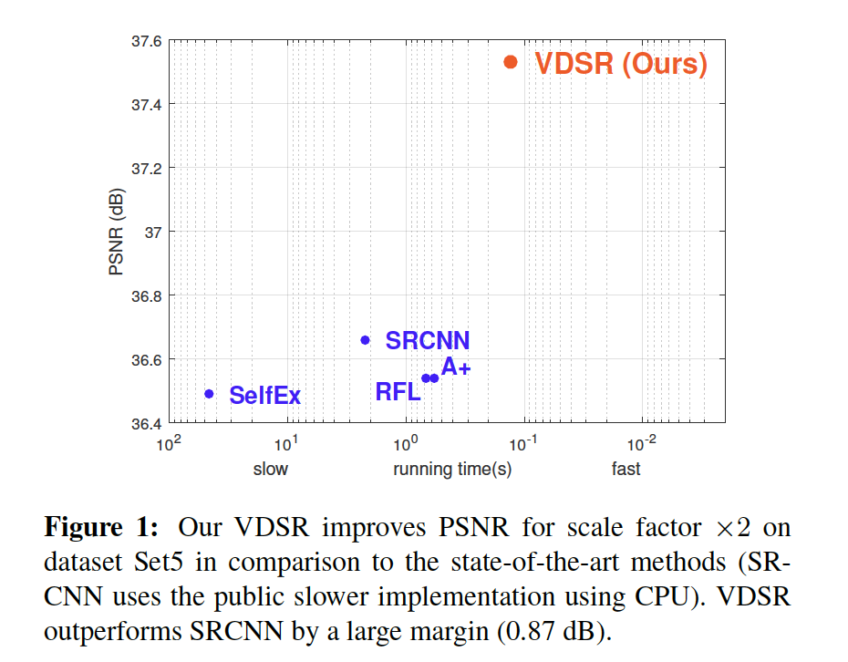
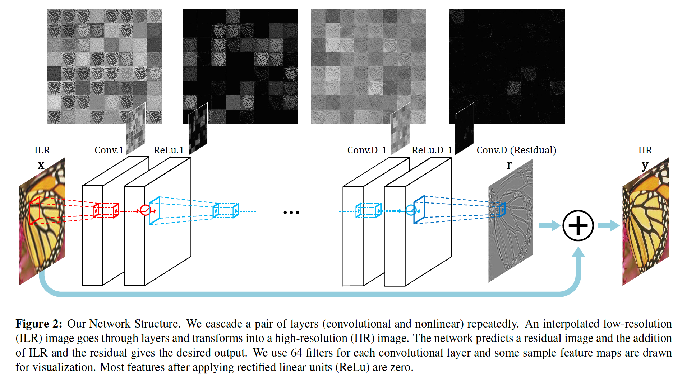
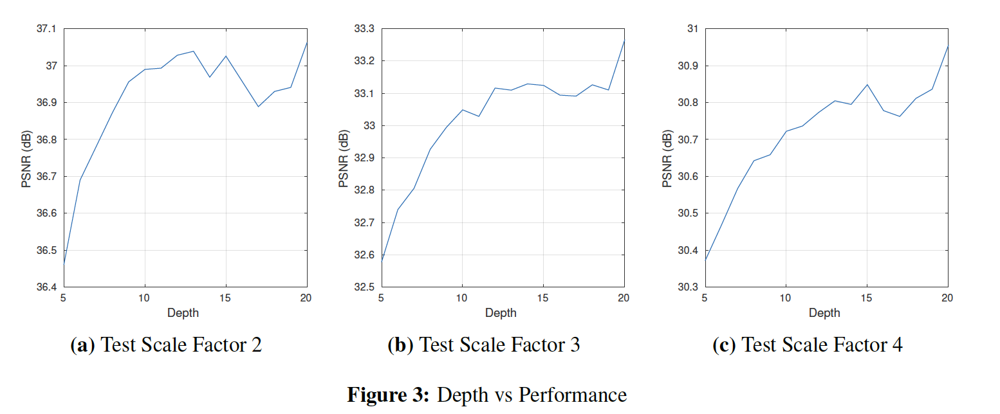
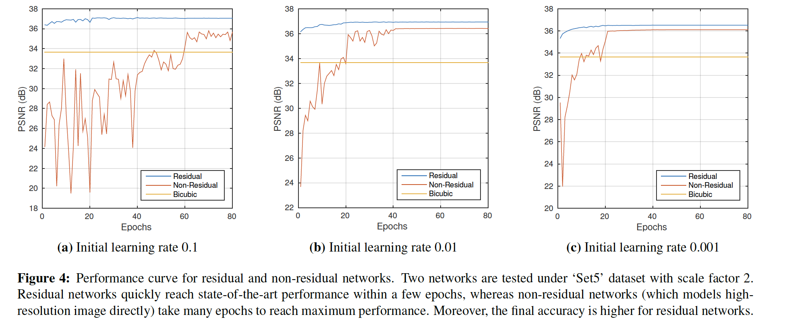
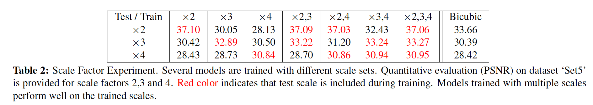
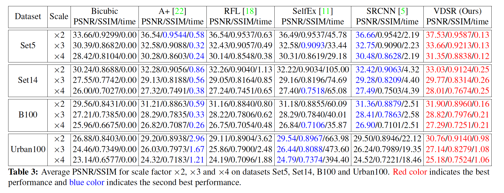
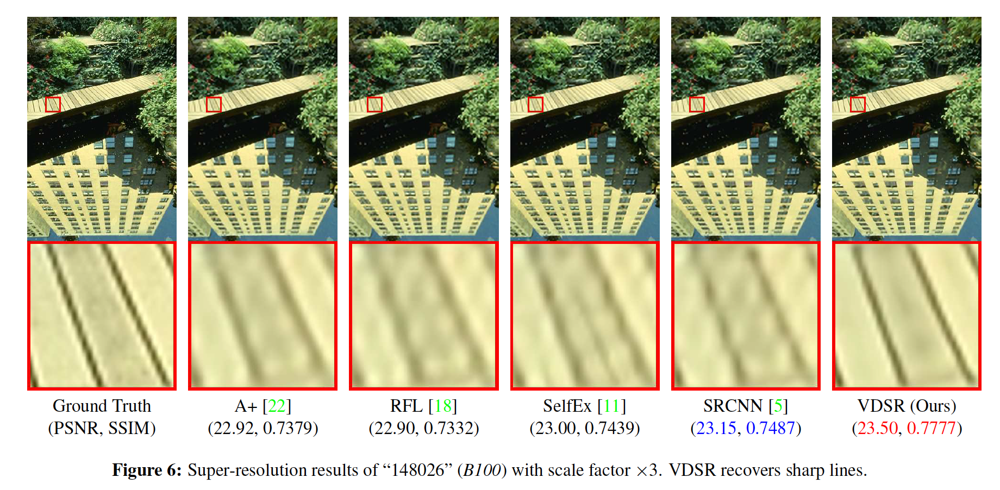
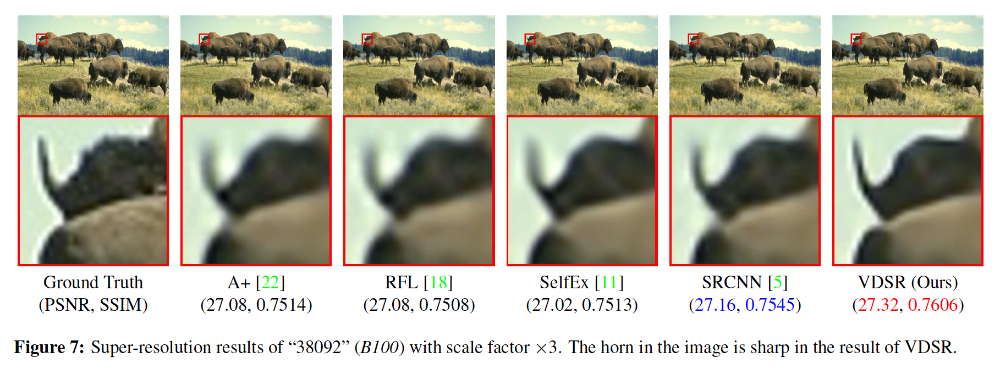

## Accurate Image Super-Resolution Using Very Deep Convolutional Networks

### 摘要

​		我们提出一种高度准确的单图像超分辨率方法。我们的方法使用非常深的卷积神经网络，该网络受用于ImageNet分类的VGG的启发。我们发现增加网络深度显示出准确性的显着提高。我们的最终模型使用29个权重层。通过在深度网络结构中多次层叠小型滤波器，可以有效利用大图像区域上的上下文信息。但是，对于非常深的网络，收敛速度成为训练期间的关键问题。我们提出简单而有效的训练过程。我们仅学习残差，并使用可调整的梯度裁剪实现极高的学习率（比SRCNN [6]高$10^4$倍）。我们提出的方法在准确性方面要比现有方法更好，并且视觉效果在视觉上也很明显。

### 1. 引言

​		我们处理给定低分辨率图像生成高分辨率图的问题，通常称为single image super-resolution（SISR）[12、8、9]。SISR被广泛用于计算机视觉应用，从安全和监控成像到医学成像，其中需要更多图像细节。

​		计算机视觉社区中已研究许多SISR方法。早期方法包括插值，例如双三次插值和Lanczos重采样[7]，而更强大的方法是利用统计图像先验[20，13]或内部补丁递归[9]。

​		当前，学习方法广泛用于建模从LR到HR补丁的映射。邻居嵌入[4、15]方法对补丁子空间进行插值。 稀疏编码[25、26、21、22]方法使用基于稀疏信号表示的学习型紧凑词典。 最近，随机森林[18]和卷积神经网络（CNN）[6]也已被使用，其准确性大大提高。

​		其中，Dong等[6] 已证明CNN可用于以端到端的方式学习从LR到HR的映射。他们的方法称为SRCNN，不需要其他方法[25、26、21、22]中通常必需的任何工程设计功能，并且显示了最新的性能。

​		虽然SRCNN成功地将深度学习技术引入超分辨率问题，但是我们发现它们在三个方法有局限：第一，它依赖小型图像区域的上下文；第二，训练收敛太慢；第三，网络仅对单个尺度起作用。

​		在这项工作中，我们提出了一种新方法来切实解决问题。

​		**Context**	我们利用分布在非常大的图像区域的上下文信息。对于大型尺度因子，通常，小补丁中包含的信息不足以进行详细信息恢复（ill-posed）。我们使用大感受野的非常深的网络考虑了大图像上下文。

​		**Convergence**	我们建议使用一种方式来加速训练：残差学习CNN和极高的学习率。由于LR图像和HR图像在很大程度上共享相同的信息，因此对HR和LR图像之间的差异（即残差图像）进行显式建模是有利的。当输入和输出高度相关时，我们提出了一种有效学习的网络结构。而且，我们的初始学习率是SRCNN的$10^4$倍[6]。 这是通过残差学习和梯度裁剪实现的。

​		**Scale Factor**	我们提出单模型SR方法。尺度通常是用户指定的，可以是任意的，包括分数。例如，可能需要在图像查看器中平滑放大或调整为特定尺寸。为准备所有可能的场景而训练和存储许多与尺度有关的模型是不切实际的。 我们发现单个卷积网络足以实现多尺度因子超分辨率。

​		**贡献**	总之，在这项工作中，我们提出了一种基于非常深的卷积网络的高精度SR方法。如果使用较小的学习率，则非常深的网络收敛太慢。通过提高学习率来提高收敛速度会导致梯度爆炸，我们通过残差学习和梯度裁剪解决了这一问题。此外，我们将工作扩展到在单个网络中处理多尺度SR问题。与图1所示的最新方法相比，我们的方法相对准确且快速。

### 2. 相关工作

​		SRCNN是基于深度学习SR方法的代表性最佳方法。因此，让我们将其与我们提出的方法进行分析和比较。

### 2.1. 用于图像超分辨率的卷积网络

​		**模型**	SRCNN包含三层：补丁提取/表示、非线性映射和重建。滤波器的空间大小分别为$9 \times 9$、$1 \times 1$和$5 \times 5$。

​		在[6]中，Dong等尝试更深的模型，但是训练一周后，没有观察到更好的性能。在一些场景中，更深的模型获得更好的性能。他们得出的结论是，更深的网络不会带来更好的性能（图9）。

​		但是，我们认为增加深度可以明显提高性能。我们成功使用20个权重层（每层都为$3 \times 3$）。我们的网络非常深（20 vs. 3），并且用于重建的信息（感受野）更大（$41 \times 41$ vs. $13 \times 13$）。

​		**训练**	对于训练，SRCNN直接建模高分辨率图像。高分辨率图像可以分解为低频信息（对应于低分辨率图像）和高频信息（残差图像或图像细节）。输入和输出图像共享相同的低频信息。这表明SRCNN具有两个目的：将输入传送到末端层和重建残差。从概念上讲，将输入传递到末端类似于自编码器的行为。训练时间可能花费在学习此自编码器上，因此学习其他部分（图像细节）的收敛速度会大大降低。 相比之下，由于我们的网络直接建模残差图像，所以我们可以具有更快的收敛速度和更高的精度。

​		**尺度**	如大多数已有的SR模型，SRCNN是针对单个尺度因子训练的，并且应该仅在指定尺度下工作。因此，如果需要一个新尺度，那么不得不训练新模型。为了处理多尺度SR（可能包含小数因子），我们需要针对每个感兴趣的尺度构建单独的单尺度SR系统。

​		但是，为所有可能的情况准备许多单独的机器以应对多种尺度是低效且不切实际的。在这项工作中，我们设计并训练单网络来高效地处理多尺度SR问题。结果证明效果很好。对于给定的子任务，我们的单台机器可与单尺度专家进行比较。 对于三个尺度因子（2、3、4），我们可以将参数数量减少三倍。

​		除了上述问题外，还存在一些细微差异。我们的输出图像与输入图像有相同的大小，方法是在训练期间每层填充零，而SRCNN的输出小于输入。最后，我们为所有层简单地使用相同的学习率，而SRCNN为了获得稳定收敛，不同层使用不同的学习率。

### 3. 所提出的方法

#### 3.1. 所提出的网络

​		对于SR图像重建，我们使用非常深的卷积网络，这受Simonyan和Zisserman[19]的启发。配置见图2。我们使用$d$层，其中除第一个和最后一个层以外的其他层属于同一类型：大小为$3 \times 3 \times 64$的64个滤波器，其中滤波器在64个通道（功能图）的 $3\times3$ 空间区域上运行。第一层在输入图像上运行。最后一层（用于图像重建）包含一个$3 \times 3 \times 64$的滤波器。

​		网络以插值低分辨率图像（到期望的大小）作为输入，并预测图像细节。对图像细节进行建模通常用于超分辨率方法中[21、22、15、3]，我们发现基于CNN的方法可以从该域特定的知识中受益。

​		在这项工作中，我们展示对图像细节（残差）进行显式建模具有多个优点。 这些将在后面的第4.2节中进一步讨论。

​		使用非常深的网络来预测密集输出的一个问题是，每次应用卷积运算时，特征图的大小都会减小。例如，当将大小为$(n+1) \times (n+1)$的输入用于感受野为$n \times n$的网络时，输出图像大小为$1 \times 1$。

​		这与其他超分辨率方法一致，因为许多方法都要求周围的像素正确推断中心像素。这种中心-环绕关系很有用，因为周围区域对这种ill-posed问题（SR）提供了更多约束。对于图像边界的附近的像素，这种关系无法得到充分利用，许多SR方法可以裁剪结果图像。

​		但是，如果所需的环绕区域很大，则此方法无效。 裁剪后，最终图像太小而无法从视觉上欣赏。

​		为了解决这个问题，我们在卷积之前填充零，以使所有特征图（包括输出图像）的大小保持不变。事实证明，零填充效果很好。 因此，我们的方法与大多数其他方法的不同之处在于，还可以正确预测图像边界附近的像素。

​		预测完图像细节后，会将它们添加回输入的ILR图像中，以提供最终图像（HR）。 我们将这种结构用于我们工作中的所有实验。

#### 3.2.  训练

​		现在，为了我们模型的最终参数，我们描述最小化的目标。令$\mathbf{x}$表示插值的低分辨率图像，$\mathbf{y}$为高分辨率图像。给定训练数据集$\{\mathbf{x}^{(i)},\mathbf{y}^{(i)}\}_{i=1}^N$，我们的目标是学习模型$f$，这个模型预测值$\hat{y} = f(\mathbf{x})$，其中$\hat{y}$为目标HR图像的估计。我们最小化在训练集上平均的均方误差 $\frac{1}{2}\| y-f(\mathbf{x})\|^2$。

​		**残差学习**	在SRCNN中，网络必须保留所有输入细节，因为图像将被丢弃，而仅从学习的特征中生成输出。利用许多权重层，这成为需要非常长期记忆的端到端关系。因此，消失/爆炸梯度问题[2]可能很关键。 我们可以通过残差学习简单地解决这个问题。

​		由于输入和输出图像非常相似，所以我们定义残差图像$\mathbf{r} = \mathbf{y} - \mathbf{x}$，其中大多数值为零或非常小。我们想要预测这种残差图像。现在，损失函数变为$\frac{1}{2}\|\mathbf{r} - f(\mathbf{x})\|^2$，其中$f(\mathbf{x})$为网络预测。

​		在网络中，这在损失层中反映如下。我们的损失层有三个输入：残差估计、网络输入（ILR图像）和ground-truth HR图像。损失为重建图像（网络输入和输出之和）和ground-truth之间的欧式距离。

​		通过使用基于反向传播的小批量梯度下降优化回归目标来进行训练（LeCun等人[14]）。我们将momentum设置为0.9。通过权重衰减（$L_2$惩罚乘以0.0001）来正则化训练。

​		**High Learning Rates for Very Deep Networks**    训练深度模型可能无法在现实的时间限制内收敛。 SRCNN [6]在三层以上的权重层中均未显示出优异的性能。尽管可能有多种原因，但一种可能性是他们在网络收敛之前就停止了训练过程。他们的学习率$10^{−5}$太小，以至于网络无法在一星期之内在通用GPU上收敛。从[6]的图9来看，很难说它们的更深层网络已经收敛并且其性能已达到饱和。虽然更多的训练最终可以解决问题，但是使用SRCNN将深度增加到20似乎并不实际。

​		提高学习率以促进训练是基本的经验法则。 但是，简单地将学习率设置得很高也可能导致梯度消失/爆炸[2]。 因此，我们建议使用可调整的梯度裁剪，以最大程度地提高速度，同时抑制爆炸梯度。

​		**Adjustable Gradient Clipping**	梯度裁剪是常用于训练循环神经网络的技术。但是，据我们所知，在训练CNN时，其使用受到限制。虽然存在许多方式来限制梯度，但是常用的策略是将单个梯度裁剪到预定义的范围$[-\theta,\theta]$。

​		利用裁剪，梯度位于特定的范围。通过通常用于训练的随机梯度下降，可以将学习速率乘以调整步长。如果使用高学习率，可能会将$\theta$调整为较小值，以避免在高学习率方案中爆炸梯度。但是，随着学习速率逐渐变小，有效梯度（梯度乘以学习速率）接近零，并且如果学习率呈几何下降，则训练可能需要成倍地进行多次迭代才能收敛。

​		为了最大化收敛速度，我们将梯度裁剪到$[-\frac{\theta}{\gamma},\frac{\theta}{\gamma}]$，其中$\gamma$表示当前的学习率。我们发现可调整的梯度裁剪使收敛过程变得极快。我们的20层网络训练在4小时内完成，而3层SRCNN需要几天训练。

​		**多尺度**	虽然非常深的模型可以提升性能，现在，需要更多参数来定义网络。通常，为每个尺度因子创建一个网络。考虑到通常使用小数尺度因子，我们需要经济的方式来存储和检索网络。

​		因此，我们还训练多尺度模型。通过这种方法，可以在所有预定义尺度因子之间共享参数。 训练多尺度模型非常简单。 几个指定尺度的训练数据集被合并为一个大数据集。

​		数据准备类似于SRCNN [5]，但有一些区别。现在，输入补丁大小等于感受野大小，而图像被划分为没有重叠的子图像。mini-batch包含64个子图像，其中同一batch中有不同尺度的子图像。

​		我们使用MatConvNet包实现模型。

### 4. Understanding Properties

​		本节中，我们研究所提出方法的三种特性。第一，我们证明较大的深度对于SR任务是必要的。非常深的网络利用图像中更多的上下文信息，并对具有许多非线性层的复杂函数进行建模。我们通过实验验证非常深的网络的性能比浅层网络更好。

​		第二，我们证明我们的残差学习网络收敛速度远快于标准的CNN。此外，我们的网络在性能上得到明显提升。

​		第三，我们证明使用单个网络的方法的效果与使用针对每个尺度训练的多个网络的方法的效果相同。 我们可以有效地减少多网络方法的模型容量（参数数量）。

#### 4.1. 更深、更好

​		卷积神经网络通过在相邻层的神经元之间执行局部连接模式来利用空间局部相关性[1]。换句话说，层$m$中的隐藏单元输入层$m-1$中隐藏单元的子集。它们构成空间上连续的感受野。

​		每个隐藏单元对于输入相对于感受野之外的变化均无响应。因此，这种架构保证学习到的滤波器产生对空间局部输入模式的强烈响应。

​		然而，堆叠许多这样的层导致滤波器变得越来越全局化（即，响应于更大的像素空间区域）。换句话说，具有很大支撑的滤波器可以有效地分解为一系列小的滤波器。

​		在这项工作中，对于所有层，我们使用相同大小（$3 \times 3$）的滤波器。对第一层，感受野大小为$3 \times 3$。对于接下来的层，感受野大小为大小在高度和宽度上都增加2。对深度为$D$的网络，感受野大小为$(2D + 1) \times (2D + 1)$。它的大小与深度成正比。

​		在SR任务中，这对应大量可以用于推理高频部分的上下文信息。大型感受野意味着网络可以使用更多的上下文来预测图像细节。由于SR是一个ill-posed的逆问题，因此收集和分析更多相邻像素可提供更多线索。例如，如果在感受恶意中完整包含一些图像模式，则可以认为该模式被识别并用于超分辨图像。

​		此外，非常深的网络可以利用高度非线性。我们使用19个非线性单元，并且我们的网络可以利用适当的通道（神经元）建模非常复杂的函数。Simonyan和Zisserman很好地解释了建立薄型深层网络的优势。

​		现在，我们通过实验表明，非常深的网络可以显着提高SR性能。我们训练和测试深度从5到20的网络（仅计算除非线性层外的权重层）。在图3中，我们展示这种结果。在大多数情况中，性能随深度增加而增加。随着深度增加，性能也得到增加。

#### 4.2.  残差学习

​		由于我们已经有一个低分辨率的图像作为输入，因此对于SR而言，预测高频分量就足够了。尽管预测残差的概念已用于先前方法[21、22、26]，但他们没有在基于深度学习的SR框架的背景中得到研究。

​		在这项工作中，我们提出一种学习残差图像的网络结构。现在，我们详细研究这种修改对标准CNN结构的影响。

​		首先，我们发现残差网络收敛速度更快。实验比较了两个网络：残差网络和标准非残差网络。我们使用深度10（权重层）和尺度因子2。不同学习率的性能曲线如图4所示。使用上面已经提到的相同的学习率调度机制。

​		第二，在收敛时，残差网络表现出优异的性能。在图4中，当训练完成时，残差网络给出更高的PSNR。

​		另一点是，如果使用较小的学习率，则网络不会在给定的时期内收敛。如果使用的初始学习率为0.1，残差学习网络的PSNR在10个周期内达到36.90。但是，如果使用的初始学习率为0.001，网络从没有达到相同水平的性能（在80个周期后，它的性能为36.52）。使用相同的形式，残差和非残差网络在10个周期后表现出极大的性能差距（对于学习率0.1，36.90 vs. 27.42）。

​		简而言之，对标准非残差网络结构的这种简单修改非常强大，可以在输入和输出图像高度相关的其他图像恢复问题中探索该思想的有效性。

#### 4.3.  Single Model for Multiple Scales

​		训练期间尺度增强是为网络配备多尺度超分辨率机器的一项关键技术。我们的多尺度机器可以执行许多不同尺度的SR过程，而其容量（参数）要比单尺度机器的总和小得多。

​		我们从一个有趣的实验开始，如下：我们利用单尺度因子$s_{train}$训练我们网络，并在另一个尺度因子$s_{test}$下测试。这里，考虑在SR比较中广泛使用的因子2、3和4。对于数据集“Set5”，尝试可能的对$(s_{train},s_{test})$。实验结果见表2。

​		如果$s_{train} \ne s_{test}$，那么性能会衰减。对于尺度因子2，利用因子2训练的模型给出37.10的PSNR，而利用因子3和4训练的模型分别给出30.05和28.13的PSNR。单尺度数据上训练的网络不能处理其他尺度。在许多测试中，它甚至比bicubic插值更差，这种方法用于生成输入图像。

​		现在，我们测试使用尺度增强训练的模型是否能够在多个尺度因子下执行SR。上面使用的相同网络利用多个尺度因子$s_{train} = \{2,3,4\}$训练。此外，我们实验$s_{train} = \{2,3\},\{2,4\},\{3,4\}$的情况进行更多比较。

​		训练期间，我们观察到网络可以处理任意尺度。当$s_{train}=\{2,3,4\}$（表2中为2、3、4倍），其每个尺度的PSNR与单尺度网络的相应结果相当：37.06 vs. 37.10 （2倍）、 33.27 vs. 32.89 （3倍）、30.95 vs. 30.86 （4倍）。

​		另一种模式是，对大型尺度（3、4倍），我们的多尺度网络比单尺度网络好：对于测试尺度3，我们的模型（2、3倍）、（3、4倍）和（2，3，4倍）得到的PSNR为33.22、33.24和33.27，而（3倍）模型给出32.89的PSNR。相似地，（2、4倍）、（3、4倍）和（2、3、4倍）得到30.86、30.94和30.95（vs. 4倍模型的30.84）。由此可见，训练多个尺度可以提高大型尺度的表现。

### 5.  实验结果

​		在本节中，我们在几种数据集上评估我们的方法的性能。首先，我们描述用于训练和测试的数据集。接着，给出必要的训练参数。

​		在概述了实验设置之后，我们将我们的方法与几种最新的SISR方法进行了比较。

#### 5.1.  训练和测试数据集

​		**训练数据集**	不同的基于学习的方法使用不同的训练图像。其中第一种使用Yang等人[25]的91张图像。 第二个使用291张图像，另外还添加了Berkeley Segmentation Dataset [16]中的200张图像。 SRCNN [6]使用非常大的ImageNet数据集。

​		我们使用[18]中的291张图像作为本节中其他方法的基准。 另外，使用数据增强（旋转或翻转）。 对于前面部分的结果，我们使用了91 image来快速训练网络，因此性能可能会略有不同。

​		**测试数据集**	对于基准测试，我们使用四种数据集。数据集“Set5”和“Set14”是常用的基准测试。数据集“Urban100”（由Huang等最近提高的提供的城市图像数据集）是非常有趣的，因为它包含许多因许多现有方法而失效的具有挑战性的图像。 最后，数据集“ B100”是Timofte等人使用的伯克利细分数据集中的自然图像。

#### 5.2. 训练参数

​		我们提供用于训练最终模型的参数。 我们使用深度为20的网络。训练使用的批大小为64。动量和权重衰减参数分别设置为0.9和0.0001。

​		对于权重初始化，我们使用He等[10]描述的方法。对于使用整流线性单元（ReLu）的网络，这是理论上合理的过程。

​		我们训练所有实验超过80个时期（批处理大小为64的9960次迭代）。 最初将学习率设置为0.1，然后每20个周期降低10倍。总之，学习率衰减3次，并且在80个周期后停止学习。在Titan Z GPU上训练大致需要4小时。

#### 5.3.  基准测试

​		作为基准，我们遵循Huang等人[21]的公开框架。 它可以使用相同的评估程序比较许多最新结果。

​		与其他方法[4、9、26]一样，该框架将双三次插值应用于图像的颜色分量，并将复杂模型应用于亮度分量。 这是因为人的视觉对强度的细节比对颜色的细节更敏感。

​		该框架在图像边界附近裁剪像素。 对于我们的方法，此过程是不必要的，因为我们的网络将输出完整尺寸的图像。 为了公平比较，我们也将像素裁切为相同的数量。

#### 5.4.  与最佳方法的比较

​		我们提供定量和定性比较。 比较的方法是A + [22]，RFL [18]，SelfEx [11]和SRCNN [5]。在表3中，我们提供了对几个数据集的定量评估的总结。 我们的方法优于这些数据集中的所有先前方法。 而且，我们的方法相对较快。 基于CPU实现的SRCNN的公共代码比Dong等人[6]在其基于GPU实现的论文中使用的代码慢。

​		在图6和7中，我们将我们的方法与性能最佳的方法进行了比较。 在图6中，只有我们的方法可以完美地重建中间的线。 类似地，在图7中，轮廓在我们的方法中是干净生动的，而在其他方法中则是严重模糊或失真的。

