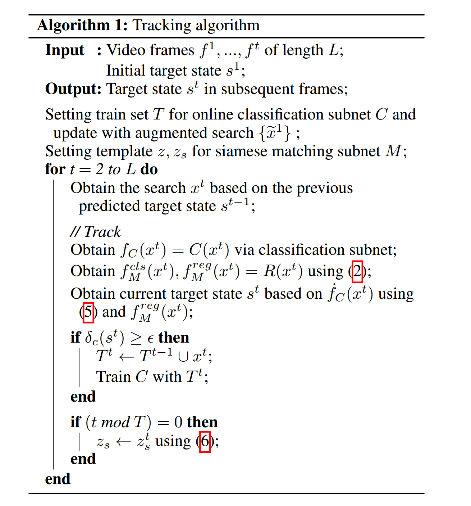
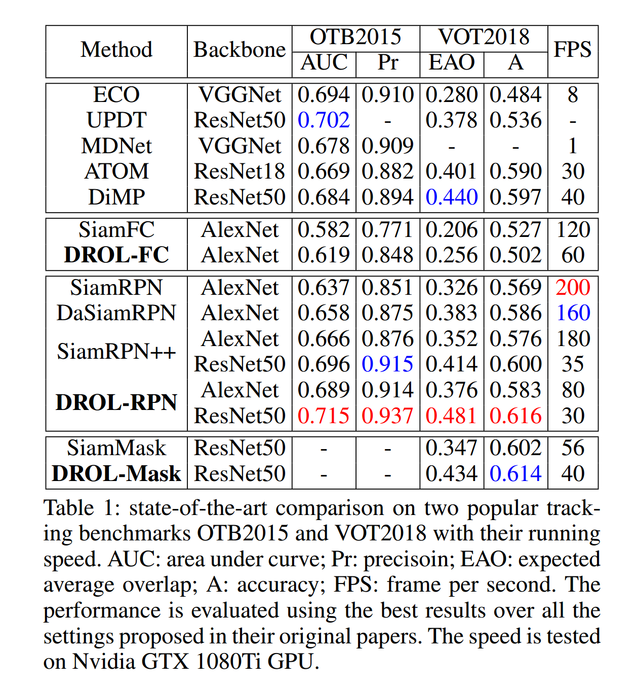
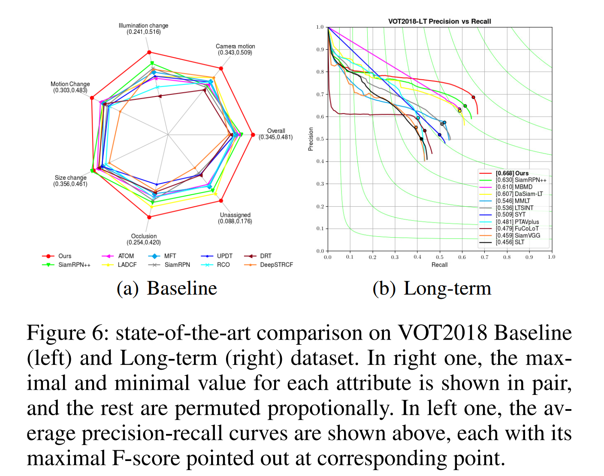
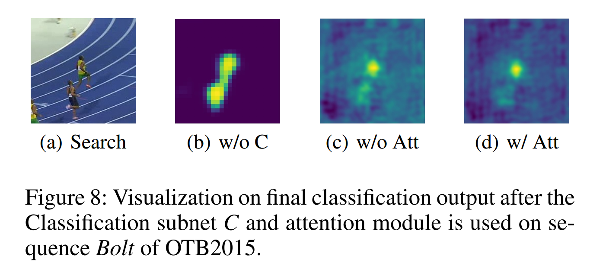
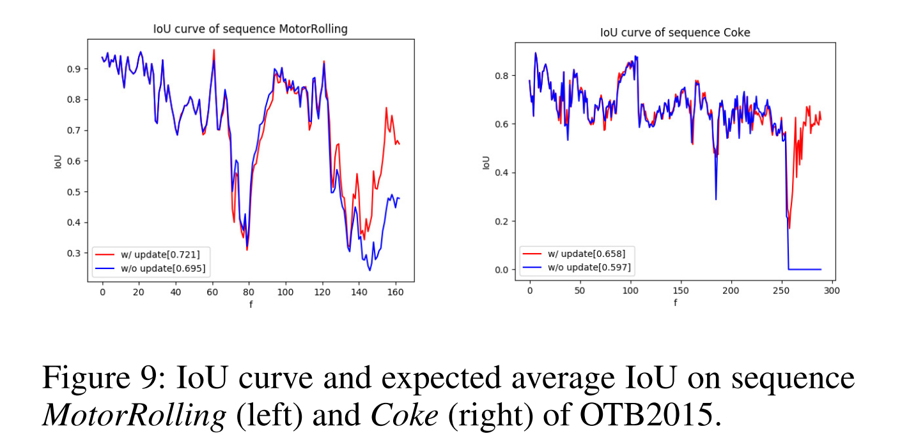

### Discriminative and Robust Online Learning for Siamese Visual Tracking

#### Abstract

​		视觉目标跟踪的问题传统上是由不同的跟踪范式处理的，要么在线学习对象的外观模型，要么在离线训练的嵌入空间中匹配对象和目标。尽管最近取得了成功，但每种方法都受到其内在约束的困扰。纯在线方法缺乏对模型的泛化，因此在目标回归中表现较差，而纯离线方法(例如，对流式暹罗跟踪器)缺乏特定目标的上下文信息，因此没有足够的辨别性来处理干扰物和足够的鲁棒性来处理形变。因此，我们为离线 Siamese 网络提出了一个具有注意机制的在线模块，用于在 $L2$ 误差下提取目标特定的特征。在此基础上，我们提出了一种针对背景噪声的滤波更新策略和一种针对大目标变形的模板更新策略。有效性可以通过以下三个 Siamese 基线的一致性改进来验证：SiamFC、SiamRPN++和SiamMask。除此之外，我们基于SiamRPN++的模型在6个流行的跟踪基准上获得了最好的结果，并且以超越实时的速度运行。

#### 1	Introduction

​		视觉对象跟踪是多种计算机视觉任务（例如汽车导航、自动驾驶、视觉监控和视频分析）中基本主题。简要地说，给定序列第一帧的感兴趣的任意目标的位置，视觉对象跟踪旨在估计所有后续帧中的这个目标的位置。

​		在视觉对象跟踪的背景下，几乎所有最先进的跟踪器都可以分为两类：辨别式（discriminative）跟踪器和生成式（generative）跟踪器。辨别式跟踪器训练分类器来从背景中区分目标，而生成式跟踪器通过计算目标和搜索候选之间的联合概率密度来找出最佳匹配目标的对象。

​		最近，Siamese 框架（Bertinetto 等 2016a）作为一个生成式跟踪器受到了越来越多的关注，因为它的性能在各种基准测试中都处于领先地位，同时还能以实时速度运行。通常，这些方法在后续帧之间获得相似嵌入空间，并直接回归到目标的真实状态（Li 等 2018；Wang 等 2019）。尽管它最近取得了成功，但是由于 Siamese 范式只接受在线训练，因此它存在严重的局限性：

​		（I） Siamese方法在跟踪过程中忽略了背景信息，导致目标在受到干扰时识别能力较差。

​		（II）Siamese方法只使用第一帧作为模板，或者仅仅通过对后续帧进行平均来更新它，因此其性能随着巨大的变形、旋转和运动模糊而下降，导致对目标回归的鲁棒性差。

​		为了探索由参数固定的 Siamese 跟踪内在性所引起的这些问题的统一解决方案，我们引入一种参考辨别式跟踪器的在线机制，它通常有一个辨别式分类器和一个有效的在线更新策略。由于 Siamese 网络的离线设置，其在线形式的独特优势，即动态视频特定信息的获取，长期以来一直未能实现。然而，直接在线更新 Siamese 网络可能是不恰当的，因为跟踪期间噪声的任意引入可能是离线训练的嵌入空间的辨别能力恶化。

​		基于上述直观的分析，提出了一个与 Siamese 网络系统化集成但相互独立的独立在线模块作为补充子网络。在线子网络设计了一种提取最具代表性目标特征的注意力机制，并根据时间需求进行了有效优化。在线模块的响应图分别用于前面提到的两个问题具体来说，局限（I）是通过将在线响应图与 Siamese 分类分数相融合来解决的，这种融合产生一个用于辨别式跟踪的自适应分类分数，而局限（II）是通过向 Siamese 网络提供高质量的帧来解决的，从而更新模板以实现鲁棒跟踪。

​		最后，我们开发了一个高效的视觉跟踪框架，并在鲁棒性和准确性方面建立了一个新的技术水平。这项工作工作的主要贡献罗列为如下四点：

- 针对 Siamese 视觉跟踪的分类问题，提出了一种基于注意力机制优化的在线模块，该模块能够充分利用背景信息提取目标特征。

- 我们提出了一种通过得分融合来利用目标特征的判别学习方法，从而帮助 Siamese 网络处理干扰和背景噪声。

- 我们提出通过模板更新来使用模板特定的特征的鲁棒性学校方法，从而改进 Siamese 网络处理变形、旋转和光照等的鲁棒性。

- 所提出的在线模块可以与各种 Siamese 跟踪器集成，而无需对它们进行再训练。我们的方法始终在OTB100、VOT2018、VOT2018- lt、UAV123、TrackingNet 和 LaSOT 6个流行基准上设置新的最先进的性能。

  

#### 2    Related Work

**Siamese visual tracking**   最近，由于繁重的离线训练，基于 Siamese 网络的跟踪方法极大地优于其他跟踪器，这极大丰富了目标的描述。接下来的工作包括高保真度（higher-fidelity）的对象表示、更深层次的特征提取主干以及多阶段或多分支网络设计。除此之外，另一个流行的优化是模板的更新，在面对巨大目标的外观变化时，可以使用融合帧（Choi、Kwon 和 Lee 2017a）或单独选择帧（Yang和Chan 2018）进行鲁棒性跟踪。然而，背景信息的缺乏衰减了它的在如干扰物、部分遮挡和巨大形变等挑战上的性能。事实上，这种刚性是固有的，因为来自 Siamese 框架的对象分类得分结果是混乱的，因此需要一个居中高斯窗口来确保稳定性。而许多工作倾向于通过干扰物感知的离线训练（Zhu 等 2018）、残差注意力学习（Wang 等 2018）、基于梯度学习（Choi、Kwon 和 Lee 2017b）等构建目标特定的嵌入空间，通过互相关得到的嵌入空间尚未明确考虑干扰物和外观变化。

**Online learning approach**    在线学习是辨别式跟踪器的一个主要特征，它是通过训练一个在线组件从背景中区分目标来实现的。特别地，基于相关滤波的跟踪器（Henriques 等 2014；Danelljan 等 2017）和基于分类器的跟踪器（Kalal、Mikolajczyk 和 Matas 2011；Nam 和 Han 2016）是其中最具代表性和最强大的方法。这些方法使用手工特征或对象分类与训练的深度特征来学习对象外观的在线模型。鉴于元学习框架最近的流行，（Bhat等，2019年；Park 和 Berg2018）在跟踪过程中进一步学习学习。相比之下，基于 Siamese 网络跟踪器的在线学习很少受到关注。而先前的方法直接插入一个相关滤波器作为前向传播中的一层，并在线更新这个滤波器，我们的工作关注 Siamese 与在线分类器以并行模式的结合，而不需要重新训练它们。

**Target regression and classification**    视觉对象跟踪需要同步目标回归和分类，这可以视为两个不同但相关的子任务。虽然对象跟踪通过辨别式方法成功处理，但是由于生成跟踪器嵌入丰富表示的内在优势，最近在 Siamese 网络中引入了区域建议网络（Li 等2018），从而升级了对象回归。然而，文献中的大多数跟踪器通常在一个子任务中表现突出，而在另一个子任务中表现出退化。为了设计高性能跟踪器，许多工作都集中在两个独立的部分来解决这两个需求。ATOM （Danelljan 等 2019）通过将一种简单而有效的在线辨别式分类器和具有重叠最大化的 IoUNet 的高效优化策略相结合，而在 Siamese 网络中，通过稀疏采样策略实现回归，而密集采样策略通过互关系实现回归。

#### 3    Proposed Method

​		视觉对象跟踪任务可以形式化为一个学习问题，它的主要任务通过最小化如下目标函数来找到最优的目标位置：

$$L(w) = \sum_{j=1}^{m}\gamma_j r(f(x_j;w), y_j) + \sum_k ||w_k||^2, \tag{1}$$

其中 $r(f, w)$ 在每个空间位置计算残差，而 $y_j \in \mathbb{R}^{W \times H}$ 为标注的标签。每个残差 $r$ 的影响设置为 $\gamma_j$ ，而 $w_k$ 上的正则化设置为 $\lambda_k$ 。

#### 3.1	Siamese Matching Subnet

​		在讲述我们的方法之前，首先，我们回归 Siamese 网络基线。基于 Siamese 网络的跟踪算法通过公式化为互相关问题 $f_R$ 来将式（1）作为模板匹配任务，并学习一个嵌入空间 $\varphi(\cdot)$，该空间计算搜索区域中最适合模板的位置，如下式：

$$f_M^{cls}(x, z) = \phi(x) \ast \phi(z) + b \ast \mathbb{1}, \tag{2}$$

其中一个分支学习目标 $z$ 的特征表示，而另一个学习搜索区域 $x$ 。

​		尽管使用暴力的尺度搜索来获得目标回归 $f_M^{reg}(x, z; w)$ 在准确率方面是不足够的，但 Siamese 网络的扩展版本通过充区域提议网络（RPN）头不或掩膜头部来互相补充，这两个头部通过编码一个边界框 $[\cdot]^{reg - box}$ 和 $[\cdot]^{reg-mask}$ 的子空间来独立回归目标的边界框和掩膜。目标回归的这三个变体可以公式化为：

$$\begin{align}f_M^{reg-fc}(x, z) &= \phi(x) \ast\phi(\hat{z}), \hat{z} \in \{z^i | i = 1, 2, 3\} \\ f_M^{reg-box} &= [\phi(x)]^{reg-box} \ast [\phi(z)]^{reg-box} \\ f_M^{reg-mask} &= [\phi(x)]^{reg-mask} \ast [\phi(z)]^{reg-mask}\end{align} \tag{3}$$

它们分别在我们选择的基线 _SiamFC_ 、_SiamRPN++_ 和 _SiamMask_ 使用。$\hat{z}$ 是具有最大响应值的缩放模板，$f_M^{reg-fc}$ （ _1d_ 向量）直接给出最大得分像素处的目标中心。$f_M^{reg-mask}(x,z)$ 为编码对象掩膜空间分布的 $(63 \times 63)d$ 向量。使用与（Bertinetto等 2016a； Li等2018； Li等2019a;；Wang等2019）中相同的策略获得最终的预测目标状态 $s$ 。此外，另外，暹罗网络通常将残差用于分类（如交叉熵损失）、边界框回归（如平滑L1损失）和掩码回归（如对数回归损失）。 

##### 3.2	Target-specific Features

​		由离线训练的 Siamese 匹配子网络提供特征并进行固定设置，以确保跟踪的稳定性和有效性。然而，它们不是目标特定的以及不适应目标域。受辨别式跟踪器的启发，在初始阶段（第一帧），我们建议通过将式（1）设置为 $L2$ 损失，以监督的方式在 Siamese 特征之上利用目标特定的特征，

$$r_C(f, y_1) = ||f_C - y_1||^2, \tag{4}$$

其中期望输出 $f_C$ 为每个位置属于目标区域的分类得分，并且综合表示为标签的空间分布。根据给定的目标边界框，将 $y_1$ 设置为高斯分布。

​		根据相关研究（Li 等 2019b； Yang 等2019），直接通过标准卷积拟合所有负背景像素的置信度得分拟合方式支配在线学习，因为在构造每个特征模式或对象类别中，只有少数卷积滤波器起着重要作用。前面提到的空间和通道方式的数据不平衡都会降低模型的判别能力。

​		为了解决这个问题，我们引入了对偶注意力机制来完整提取特定于目标的特征。 如图3所示，压缩模块和注意力模块一起形成了特定于目标的特征提取器。注意，这两个模块（灰色区域）仅利用给定序列的第一帧微调，并跟踪期间保持不变，从而确保稳定性。然后，利用特定于目标的特征来优化后续帧中的滤波器模块（白色区域）。

##### 3.3	Discriminative Learning via Filter Update

​		广泛的研究（Zhu 等 2018）证明，即使在具有干扰物感知（特定于目标）的特征下，Siamese 跟踪器在跟踪过程中也很容易被类似的对象干扰。这种劣势的一个更深层次的原因是，没有执行在线权重更新来抑制狡诈的背景噪音。

​		作为解决方案，通过将（4）中的 $y_1$ 更改为以预测位置为中心的 $y_i$ ，可以随着跟踪的进行迭代地优化滤波器模块的更新。为了进一步加速优化，将式（1）重新写为残差向量范数的平方 $L(w) = ||r(w)||^2$ ，其中 $r_j(w) = \sqrt{\gamma_j}(f(x_j) - y_j)$ ，$r_{m+k}(w) = \sqrt{\lambda_k}w_k$，这引起了正定二次（positive definite quadratic）问题。我们不使用 SGD 作为优化策略，遵循（Danelljan 等 2019），我们使用 Conjugate Gradient Descent （共轭梯度下降），因为这个方法在收敛速度方面更适合解决二次问题。该算法以迭代形式，在反向传播期间，允许自适应搜索方向 $p$ 和学习速率 $\alpha$。

​		使用三次插值将来自滤波器模块的在线分类得分的大小调整为与 Siamese 分类得分相同的空间大小，然后通过加权和将其与之融合，得出自适应分类得分，这可以公式化为：

$$\dot{f}_C(x, w) = \lambda f_C(x; w) + (1 - \lambda)f_M^{cls}(x, z; w), \tag{5}$$

其中 $\lambda$ 为在线置信度得分的影响。

##### 3.4	Robust Learning via Template Update

​		Siamese 跟踪器的关键部分是模板的选择，由于模板外观的变化通常给予糟糕的目标回归，甚至是模板漂移。因此，我们为 Siamese 网络设计了一个额外的模板分支，以保留最新帧上的目标信息。将这个分支模板表示为 $z_s$ ，表示短期记忆中的模板，而不是保留第一帧作为长期记忆。

​		值得注意的是，取得良好性能的关键主要取决于已识别模板的质量，因此，需要合理设计可能的模板候选的选择。我们使用在线分类器叔叔吃的最大得分 $\hat{f}_C(x;w)$ 作为衡量标准，以选择高质量模板，这可以公式化为：

$$z_s = \mbox{warp}(\arg\max_{x} \hat{f}_C(x;w) \ast \mathbb{1}_{\hat{f}_C > \tau_c}), \tag{6}$$

其中 $\mbox{warp}(\cdot)$ 是对模板特征尺寸的裁剪操作，而 $\tau_c$ 是过滤阈值，从而抑制面对遮挡、运动模糊和干扰的低质量模板。

​		通过平移短期目标，式（2）中的 $z$ 可以修改为 $z'$，其由如下公式决定：

$$z' = \begin{cases}z_s, & \begin{align}\mbox{IoU}(\hat{f}_M^{reg}(z_s), \hat{f}_M^{reg}(z^1)) &\ge v_r, \\ \hat{f}_M^{cls}(z_s) - \hat{f}_M^{cls}(z^1) &\ge v_c, \end{align}, \\ z^1, & \mbox{otherwise}, \end{cases} \tag{7}$$

其中 $\hat{f}_M^{cls}$ 表示具有最大得分的位置，$\hat{f}_M^{reg}$  为对应的边界框。这是为了避免使用短期目标造成的边界框漂移和不一致。我们的方法完整管道在算法 1 中描述。

#### 4	Experiments

##### 4.1	Implementation Details

​		我们的方法利用 PyToch 实现，并且完整的代码和视频演示将在 https://github.com/shallowtoil/DROL 上提供。

**Architecture**	对应于（3）中所述的回归变量，我们将我们的方法应用于三个 Siamese 基线SiamFC、SiamRPN ++和SiamMask，分别产生DROLFC、DROL-RPN 和 DROL-Mask 。在 DROL-FC 中，我们使用修改的 AlexNet 作为骨干和 up-channel 相关。在DROL-RPN 中，我们使用修改的 AlexNet 及 ResNet50 的 2、3、4 层和逐深度互相关。对于分类子网络，第一层为具有 ReLU 激活的 $1 \times 1$ 卷积层，它将特征维度减少到 64 。最后一层采用单个输出通道的 $4 \times 4$ 核。

**Training phase**	对于离线训练，由于我们直接使用即插即用的 Siamese 模型，整个框架不需要额外的离线训练阶段。因此，我们模型的训练数据与这些变体的基准完全相同。对于在线调整，我们使用第一帧的大小为 $255 \times 255$ 的区域来预训练整个分类器。与（Danelljan 等 2019）相似，我们还对第一帧执行平移、旋转和模糊的数据增强，从而产生 30 个厨师训练样本。

**Discriminative learning**	我们通过替换最旧的帧，将即将到来的帧添加到最大批量大小为 250 的初始训练样本中。每个样本利用以预测目标位置中心的高斯函数标注。我们丢弃出现干扰物或目标缺失的帧以进行滤波器更新。分类器每10帧更新一次，学习率设置为 0.01 ，一旦检测到邻近的干扰物，分类器学习率就会翻倍 。为了融合分类得分，在 DROL-FC 中，将 $\lambda$ 设置为 0.6；在 DROL-RPN 和 DROL-Mask 中，设置为 0.8 。

**Robust learning**	对于模板更新，为了进行跟踪时在稳定性和动态性之间取得平衡，我们每 $T = 5$ z帧更新短期模板，同时将 $\tau_c$、$v_r$ 和 $v_c$ 分别设置为 0.75、0.6 和 0.5 。以上超参数使用 VOT2018 作为验证集进行设置，并在第5节中进行进一步评估。

##### 4.2	Comparison with state-of-the-art

​		我们首先在两个流行的基准 OTB2015（Wu、Lim 和 Yang 2015）和VOT2018（Kristan 等 2018）上展示 DROL 与其基线的一致性改进，如表1所示。我们在其他四个基准上用骨干网 ResNet50 进一步验证了最佳模型DROL-RPN，这些数据集包括：VOT2018-LT、UAV123、TrackingNet 和 LaSOT。

**OTB2015**	我们在 OTB2015 数据集上验证所提出的跟踪器，这个数据集包含 100 个视频。尽管最新的作品 SiamRPN++ 揭示了深度神经网络的强大能力，如图1所示，但最佳的 Siamese 跟踪器仍会因干扰物、完全遮挡和变形（如棒球，酒和溜冰）而遭受困难。相对而言，我们的方法可以有效地区分上述挑战，从而通过在线学习在 Siamese 基线之上获得理想的增益。图5和表1展示了 AUC 和 Pr 上都获得了最高排名的结果。与先前的最佳跟踪器 UPDT 相比，我们将重叠提高了 1.3% 。而与 ATOM 和 SiamRPN++  跟踪器相比，我们的跟踪器在重叠上获得 4.6%、1.9% 的性能增益，在精确率上获得 5.5%、2.2%。

**VOT2018**	与 OTB2015 相比，VOT2018 基准测试包含更具挑战的因素，因此在准确性和鲁棒性方面都可以被视为更全面的测试平台。我们在 VOT2018 数据集上验证我们所提出的跟踪器，其包含60个序列。

​		如图6（a）所示，我们可以观察到，就 EAO 而言，我们的跟踪器 DROL-RPN 改善了 ATOM 和 SiamRPN++ 方法，绝对增益分别为 8.0％ 和6.6％ 。我们的方法在重叠和准确率方面比领导跟踪器 DiMP 分别高 4.8% 和 1.9% 。

**VOT2018-LT**	VOT2018长期数据集为鲁棒性提供了具有挑战性的衡量标准，因为目标可能会长时间离开视野或遇到完全遮挡。我们将这些指标与图6（b）和表 2 中的最新方法进行了比较。在我们的 Siamese 子网络中，我们直接采用与 SiamRPN++ （Li 等 2019a）相同的长期策略。当检测到目标缺失并且搜索区域扩大时，此时，我们不会在训练集中添加任何搜索来训练分类器。与基线 SiamRPN++ 相比，我们的方法在精确率方面获得 3.8% 的最大性能增益、召回率方面获得 3.8% 的增益、F-Score 方面获得 3.8% 的增益。结果证明，即使遭遇巨大形变和长期目标缺失，在线分类子网络仍然可以正常运行。

**UAV123**	我们在 UAV123 数据集上评估所提出的跟踪器。这个数据集包含超过 110K 帧，并且共计 123 个视频序列，每个序列平均包含从低空无人机捕获的915帧。表3展示了比较跟踪器的重叠和精确率。

**TrackingNet**	我们在 TrackingNet 测试集上验证所提出的跟踪器，其提供了具有 14M 密集边界框标注的超过 30K 的视频。如表4所示，我们的方法 DROL-RPN 优于所有先前的方法，并分别将重叠、精确率和归一化精确率提高了 0.6%、1.4% 和 1.6%。

**LaSOT**	结果见表7.

##### 4.3 Ablation Study

​		在这一部分中，我们进行消融研究来分组论证每个组件的影响，并展示了我们的方法（简单起见，我们仅使用具有骨干 ReNet50 的 DROL-RPN ）优越性。因为我们使用 VOT2018（验证集）来搜索超参数，所以我们报告 LaSOT 和 TrackingNet（测试集）上的性能。

**Classification score fusion（G1）**	数据显示，同步需要两个子网络的得分，因为两个极端（ $\lambda$ 为0或1）会导致结果不佳，而最佳系数在 0.8 左右。从理论上讲，可以部分解释为，尽管具有足够的区别性，但在线分类分数只能定位一个粗略的位置，而更细粒度的细节（用于区分峰区域周围密集边界框的质量）则需要通过 Siamese 分类得分加以充实。

**Target-specific feature learning（G2）**	在G1的最佳设置下，我们进一步研究了我们提出的注意力机制。如表5所示，注意力模块的存在进一步提高了跟踪器的性能。定量地讲，在图8（b）和图8（c）的比较中，在线分类得分在区分干扰物和遮挡物方面更具辨别性。

**Template update interval（G3）**	从表 5 可以看出，与通过设置 $T = 1$ 直接更新短期样本获得合格分类分数后，我们发现适当地延长更新间隔并在排序后旋转置信度最高的样本允许一个更值得信赖的目标。为了论证更新策略的有效性，我们提供了两个序列的 IoU 曲线。如图9（a）所示，短期模板改进性能，尤其是当推断框与 ground-truth 重叠得不好时，而图9（b）显示，这种策略从长远来看甚至可以避免目标漂移。

**Validity of update strategy（G4）**	为了评估我们的更新策略的有效性，G4 仅通过使用在线分类得分来指导模板更新而不会与 Siamese 分类得分融合来进行。与基线相比（见 G1 的第一列），可以更清楚地观察到更新的有效性。