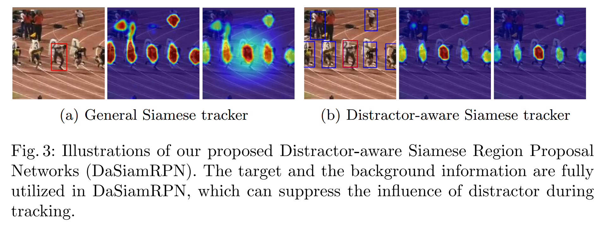
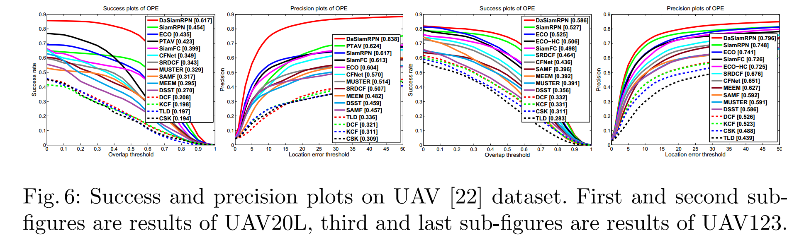
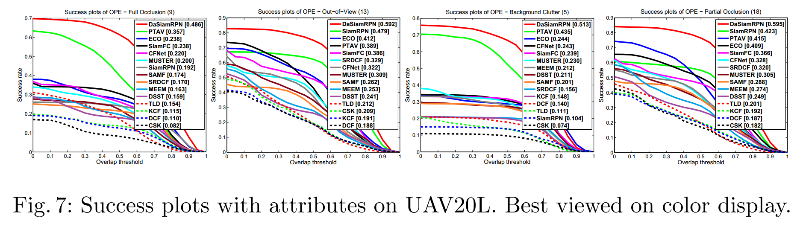
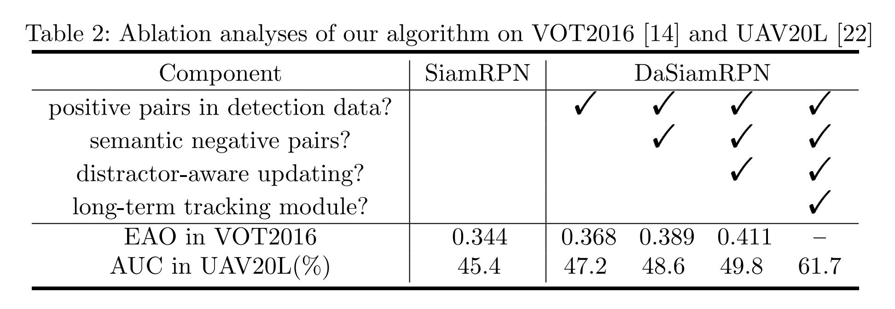

### Distractor-aware Siamese Networks for Visual Object Tracking

#### Abstract 

​		近来，Siamese网络因其平衡的准确性和速度而在视觉跟踪社区中引起了极大的关注。然而，大多数Siamese跟踪方法的特征仅能从非语义的背景中辨别前景。语义背景总是被视为干扰因素，这妨碍了Siamese跟踪器的鲁棒性。本文中，我们关注学习干扰因素感知的Siamese网络以进行准确而长期的跟踪。为此，首先分析传统Siamese跟踪器使用的特征。我们观察到训练数据的不平衡分布使得学习到的特征缺少辨别性。在离线训练阶段，引入了一种有效的采样策略来控制这个分布，并使模型关注语义干扰因素。推理期间，设计了一种新颖的干扰感知模块来执行累积学习，这可以将一般嵌入有效地迁移当前视频域。此外，我们通过简单而高效的局部到整体的搜索区域策略扩展所提出的方法以进行长期跟踪。基准测试上的广泛实验证明我们的方法明显优于历史最佳，其在VOT2016上产生了9.6%的增益，在UAV20L数据集上产生35.9%的增益。所提出的跟踪器在短期基准测试上以160FPS的速度执行，在长期基准测试上的速度是110FPS。

#### 1	Introduction

​		视觉跟踪——自动定位变化视频序列中的特定目标——是如视觉分析、自动驾驶和姿态估计等许多计算机视觉主题中的基础问题。跟踪的核心问题是如何在遮挡、视场外、形变、背景模糊和其他变化[38]下，准确而有效地检测和定位目标。

​		近来，遵循相似性比较策略进行跟踪的暹罗网络由于其良好的性能而在视觉跟踪社区中引起了极大的关注[31、8、2、36、33、7、37、16]。SINT[31]、GOTURN[8]、SiamFC[2]和RASNet[36]学习先验深度Siamese相似度函数，并以运行时固定的方式使用它们。CFNet[33]和DSiam[7]可以分别通过滑动平均模板和快速变换学习模块在线更新跟踪模型。SiamRPN[16]在Siamese网络后引入区域提议网络，因此将跟踪公式化为one-shot局部检测任务。

​		尽管这些跟踪方法获得平衡的准确率和速度，但仍有需要处理的三个问题：**首先，大多数Siamese跟踪方法中使用的特征仅能从非语义背景中辨别前景。总是将语义背景视为干扰因素，并且当背景模糊时，不能保证性能。其次，大多数Siamese跟踪器不能更新模型[31、8、2、36、16]。尽管它们简洁及固定模型的本质产生很高的速度，但是这些方法失去了在线更新外观模型的能力，这对于解决跟踪方案中的急剧外观变化通常至关重要。然后，最近的Siamese跟踪器采用局部搜索策略，这不能处理完全遮挡和视野外的问题。**

​		本文中，我们探索学习Distractor-aware Siamese Region Proposal Networks（DaSiamRPN）以进行准确及长期的跟踪。SiamFC使用加权损失函数来消除正负样本的类不平衡问题。然而，由于训练过程仍由容易分类的背景样本占据主导，所以它不是高效的。本文中，我们**识别出训练数据中非语义背景和语义干扰的不平衡是表示学习的主要障碍。**如图1所示，SiamFC的响应图不能区分人，甚至穿白色衣服的运动员也能与目标人具有高度相似性。高质量的训练数据是端到端学习跟踪器成功的关键。我们认为表示网络的质量严重依赖训练数据的分布。除了从已有的大尺度检测数据集中引入正类对外，我们在训练过程中显示生成多样的负类对。为了进一步鼓励辨别能力，开发了针对视觉跟踪定制的有效数据增强策略。

​		离线训练后，表示网络可以很好地泛化到大多数类别的目标，这使跟踪通用目标成为可能。推理期间，经典的Siamese跟踪器仅使用最近邻搜索来匹配正类目标，当目标发生明显外观变化和背景模糊时，这可能表现得很差。特别地，语境中相似外观的目标的存在使跟踪任务更加艰巨。为了处理这个问题，周围的上下文和序列信息可以提供关于目标的额外线索，并有助于最大化辨别能力。本文中，设计了新颖的干扰感知（distractor-aware）的模块，其可以将一般嵌入高效地迁移到当前视频域，并在推理期间，累积捕获目标外观变化。

​		此外，大多数最近的跟踪器为短期场景量身定制，这些场景中目标总是存在的。这些工作只专注于几十秒的短序列，这不足以反映从业者的需求。除短期跟踪的挑战场景外，严重超出视野和完全遮挡在长期跟踪中引入了额外的挑战。因为常用的Siamese跟踪器缺乏辨别性特征，并采用局部搜索区域，所以他们不能处理这些挑战。受益于DaSiamRPN中学习到的干扰感知的特征，我们通过引入简单而高效的局部到整体的搜索区域策略来扩展所提出的方法，从而进行长期跟踪。在超出视野和完全遮挡的挑战下，这种策略明显提高的跟踪器的性能。

​		我们在广泛的短期和长期跟踪基准上验证了所提出的DaSiamRPN框架的有效性，基准包括VOT2016 [14]、VOT2017 [12]、OTB2015 [38]、UAV20L和UAV123 [22]。在短期VOT2016数据集上，与最好的方法ECO[3]相比，DaSiamRPN在EAO方面获得9.6%的增益。在长期UAV20L数据集上，DaSiamRPN获得61.7%的AUC，其比当前最佳性能的跟踪器好35.9% 。除了出色的性能外，我们的跟踪器还可以远远超出实时速度：短期数据集为160 FPS、长期数据集为110 FPS。所有这些一致的改进表明，提出的方法在视觉跟踪方面建立了新的技术水平。

##### 1.1	Contributions

​		本文的贡献可以总结为如下三个方面：

1. 详细分析了传统Siamese跟踪器使用的特征。并且，我们发现，训练数据中非语义背景和语义干扰的不平衡是学习的主要障碍。

2. 在离线训练时，我们提出一种新颖的干扰感知的Siamese区域提议网络（DaSiamRPN）框架来学习干扰感知的特征，并且在离线跟踪推理期间，显示地抑制干扰。

3. 我们通过引入简单而高效的局部到整体的搜索区域策略来扩展DaSiamRPN以执行长期跟踪，这明显改进了在超出视野和完全遮挡挑战下的跟踪性能。在短期和长期视觉跟踪基准的综合实验中，提出的DaSiamRPN框架在以远远超出实时速度的速度运行时，可以获取最先进的精度。

   

#### 2 	Related Work

​		**Siamese Networks based Tracking.**  Siamese跟踪器遵循相似度比较策略的跟踪。先驱工作是SINT[31]，其简单搜索与开始帧给出的示例最相似的候选，它使用运行时固定，但学习先验深度Siamese相似度的函数。接下来的工作中，Bertinetto等人[2]提出全卷积的Siamese网络（SiamFC）来估计两帧之间的逐区域特征相似度。RASNet[36]通过利用Residual Attentional Network学习的注意力机制改进相似性度量。与SiamFC和RASNet不同，在GOTURN跟踪器中[8]，连续帧之间的运动使用深度回归网络预测。由于没有执行在线微调，这三个跟踪器在GPU的速度分别为86FPS、83FPS和100FPS。CFNet[33]将相关滤波解释为Siamese跟踪框架中的可微层，因此获得端到端的表示学习。但是与SiamFC相比，性能的提高是有限的。FlowTrack[40]Siamese架构的运动信息来改进特征表示和跟踪准确率。值得注意的是CFNet和FlowTrack可以高效地在线更新模型。最近，SiamRPN[16]通过在Siamese网络后，引入区域提议网络将跟踪公式化为one-shot局部检测任务，这是具有大尺度图像对的端到端学习。

​		**Features for Tracking.** 	在包含视觉跟踪的计算机视觉任务中，视觉特征扮演重要角色。Possegger等人[26]提出了一个可感知干扰因素的模型术，以抑制视觉干扰区域，而其框架中使用的颜色直方图特征却不如深度特征那么健壮。DLT [35]是使用多层自动编码器网络的开创性深度学习跟踪器。该特征以无人监督的方式在80M Tiny Image数据集的一部分上进行了预训练[32]。Wang等[34] 在视频存储库上学习两层神经网络，其中对特征学习施加了时间缓慢约束。DeepTrack[17]从二值样本上学习了两次CNN分类器，而不要求预训练过程。UCT [39]将特征学习和跟踪过程表述为一个统一的框架，使学习到的特征与跟踪过程紧密耦合。

​		**Long-term Tracking.**	传统的长期跟踪框架可以分为两组：较早的方法将跟踪视为与几何模型[25、24、21]匹配的局部关键点描述子、最近的方法是通过将短期跟踪器与检测器结合来执行长期跟踪。后一类的开创性工作是TLD[10]，其提出了一种无内存的流群作为短期跟踪器和一种并行运行的基于模板的检测器。Ma等[20]提出将KCF跟踪器和随机ferns分类器结合起来作为检测器，用于校正跟踪器。相似地，MUSTer[9]为长期跟踪框架，其将KCF跟踪器和基于SIFT的检测器组合，该检测器也用于检测遮挡。Fan and Ling [6]将DSST跟踪器[4]与CNN检测器[31]结合在一起，该CNN检测器可以验证并可能纠正短期跟踪器的提议。

#### 3	Distractor-aware Siamese Networks

##### 3.1	Features and Drawbacks in Traditional Siamese Networks

​		在详细讨论我们提出的框架之前，我们首先回顾基于一般Siamese网络检测[2,16]的特征。Siamese跟踪器的核心是使用度量学习。其目的是学习一种嵌入空间，该嵌入空间可以使不同对象之间的类间惯性（inertia）最大化，并使同一对象的类内惯性最小化。导致Siamese跟踪器的流行和成功的关键贡献是他们平衡的准确率和速度。

​		图1为SiamFC和SiamRPN响应图的可视化。可以看出，对于目标来说，背景差异较大的目标也能获得高分，甚至一些无关的物体也能获得高分。SiamFC获得的表示通常用于训练数据中类的判别性学习。**在SiamFC和SiamRPN中，训练数据对来自相同视频的不同帧，并且对于每个搜索区域，非语义背景占据主导，而语义实体和干扰较少。这种不平衡分布使训练模型难以学习实例级表示，而是倾向于学习前景和背景之间的差异。**

​		推理期间，使用最近邻来搜索搜索区域中最相似地目标，而在第一帧中标记的背景信息被消除。跟踪序列中的背景信息可以有效地利用以增加辨别能力，如图1e所示。

​		为了消除这些问题，我们建议在离线训练过程中主动生成更多语义对，并在在线跟踪中显式抑制干扰因素。

##### 3.2	Distractor-aware Training

​		高质量的训练数据对于视觉跟踪中端到端的表示学习的成功至关重要。我们介绍一系列策略来改进学习到的特征的表示，并消除训练数据的不平衡分布。

​		**Diverse categories of positive pairs can promote the generation ability.**	原始的SiamFC在？ILSVRC视频检测数据集上训练，该数据集仅包含大约4000个逐帧标注的视频[28]。最近，SiamRPN[16]探索使用稀疏标记的Youtube-BB[28]视频，其包含超过200000个视频，这些视频每30帧标注一次。在这两个方法中，训练数据的目标对来自相同视频中的不同帧。然而，这些视频检测数据集仅包含少量类别（VID[28]为20个类，Youtube-BB[27]为30个类），其对于训练Siamese网络的高质量和泛化特征是不够的。此外，当遭遇新的类别时，SiamRPN中的边界框回归分支可能得到低劣的预测。因为标注视频是耗时和昂贵的，因此，本文中，我们通过**引入大尺度的ImageNet Detection[28]和COCO Detection[18]数据集来扩展正类对的类别。如图2（a）所示，通过数据增强技术（平移、缩放、灰度化等），检测数据集中的静态图像可以用于生成图像对来训练。**正类对的多样性能够提高跟踪器的辨别能和回归准确率。

​		**Semantic negative pairs can improve the discriminative ability.**	我们将SiamFC [2]和SiamRPN [16]中的较少辨别性表示归因于两个水平的训练数据分布不均衡。**第一个不平衡时稀疏语义负类对。**因为SiamFC和SiamRPN的训练数据集中，背景占据主导，大多数负样本时**非语义的（非实际目标，仅仅是背景）**，并且它们不易于分类。也就是说，SiamFC和SiamRPN学习前景和背景之间的差异，并且语义目标之间的损失被大量的容易的负样本所淹没。**另一个不平衡来自类内干扰，其通常表现为跟踪过程中难负样本**。本文中，将语义负样本对添加到训练过程。构造的负样本对由相同类别和不同类别中的标记目标组成。**不同类的负样本对可以帮助跟踪器避免如超出视野和完全遮挡中任意目标的漂移，同时相同类的负样本对使跟踪器关注细粒度表示。**负样本如图2（b）和图2（c）所示。

​		**Customizing effective data augmentation for visual tracking.** 为了充分发挥Siamese网络的潜力，我们定制了几种数据增强策略进行训练。处理常用的平移、尺度变化和光照变化外，我们观察到，运动模式可以通过网络中的浅层轻松建模。我们在数据增强中显示地引入运动模糊。

##### 3.3	Distractor-aware Incremental Learning

​		上一节的训练策略可以显着提高离线训练过程中的识别能力。然而，它仍然难以区分如图3a中具有相似属性的两个目标。SiamFC和SiamRPN使用余玄窗口来抑制干扰因素。当遭遇快速运动或者背景模糊时，大多数已有的基于Siamese网络的方法给出了低劣的性能。总之，潜在的缺陷主要是由于一般表示域和特定目标域的未对齐。本节中，我们提出干扰感知模块来将一般表示有效地迁移到视频域。

​		Siamese跟踪器学习相似性度量 $f(z,x)$ 以将示例图像 $z$ 与嵌入空间 $\varphi$ 中的候选图像 $x$ 进行比较：

$$f(z,x) = \varphi(z) \star \varphi(x) + b \cdot \mathbf{1} \tag{1}$$

其中 $\star$ 表示两个特征图之间的互相关，$b \cdot \mathbf{1}$ 表示在每个位置都相等的偏置项。选择与示例最相似的目标（object）作为目标（target）。

​		为了充分利用标签信息，我们将目标背景下的困难负样本样本（干扰因素）整合到相似性指标中。在DaSiamRPN中，采用NMS来选择每帧中潜在的干扰因素 $d_i$ ，然后我们收集一个干扰因素集 $\mathcal{D} := \{\forall d_i \in \mathcal{D}, f(z, d_i) > h \cap d_i \ne z_t\}$，其中 $h$ 为预定义的阈值，$z_t$ 为帧 $t$ 中选择的目标，这个集合的数量设置为 $|\mathcal{D}| = n$ 。具体而言，我们首先在每帧中得到 $17 \ast 17 \ast 5$ 个提议，然后我们使用NMS来减少冗余的候选。选择具有最高得分的提议作为目标 $z_t$。对于余下的，选择得分大于阈值的提议作为干扰因素。

​		此后，我们引入了一种新颖的可感知干扰因素的目标函数，以重新排序与示例具有前 $k$ 个相似性的提议 $\mathcal{P}$。最终选择的目标表示为 $q$ :

$$q = \arg \max_{p_k \in \mathcal{P}} f(z, p_k) - \frac{\hat{\alpha}\sum_{i=1}^n \alpha_i f(d_i, p_k)}{\sum_{i=1}^{n} \alpha_i} \tag{2}$$

权重因子 $\hat{\alpha}$ 控制干扰学习的影响，权重因子 $\alpha_i$ 用于控制每个干扰 $d_i$ 的影响。值得注意的是，通过直接计算，计算复杂度和内存使用都增加了 $n$ 倍。因为式（1）中的互相关操作是线性运算，所以我们利用这一属性来加速干扰感知的目标：

$$q = \arg\max_{p_k \in \mathcal{P}} (\varphi(z) - \frac{\hat{\alpha}\sum_{i=1}^n \alpha_i \varphi(d_i)}{\sum_{i=1}^n \alpha_i}) \star \varphi(p_k) \tag{3}$$

它保证跟踪器可以与SiamRPN相当的速度运行。根据结合律，我们以学习率 $\beta_t$ 逐步学习目标模板和干扰项模板：

$$q_{T+1} = \arg\max_{p_k \in \mathcal{P}} (\frac{\sum_{t=1}^T \beta_t \varphi(z_t)}{\sum_{t=1}^T \beta_t} - \frac{\sum_{t=1}^T\beta_t \hat{\alpha} \sum_{i=1}^n \alpha_i \varphi(d_{i,t})}{\sum_{t=1}^T \beta_t \sum_{i=1}^n \alpha_i}) \star \varphi(p_k) \tag{4}$$

这种关注干扰的跟踪器可以将现有的相似性度量（常规）调整为新域（特定）的相似性度量。权重因子 $\alpha_i$ 可以视为稀疏正则化的对偶变量，并且示例和干扰因素可以视为相关滤波中的正类和负类样本。实际上，我们的框架建模了在线分类器。因此，期望采用的分类器比仅使用一般相似性度量的分类器表现更好。

##### 3.4	DaSiamRPN for Long-term Tracking

​		本节中，将DaSiamRPN扩展为长期跟踪。除了短期跟踪中的挑战性场景外，在长期跟踪中，还采用引入了视野之外和完全遮挡，如图4所示。当目标再出现时，短期跟踪（SiamRPN）的搜索区域不能覆盖目标，因此在接下来的帧中未能跟踪目标。我们在短期跟踪阶段和失败案例之间提出简单而高效的切换方法。**在失败的案例中，设计了一种迭代的局部到整体搜索策略来重新检测目标。**

​		为了进行切换，我们需要确定失败跟踪的开始和结束。因为干扰感知的训练和推理确保高质量的检测得分，所以可以用于指示跟踪结果的质量。图4给出了SiamRPN和DaSiamRPN中的检测得分和相应的跟踪重叠。SiamRPN的检测得分不具指示性，即使超出视野和完全遮挡，它的分数可能仍然很高。也就是说，SiamRPN在这些挑战中往往会发现一个任意的目标，这会导致跟踪漂移。在DaSiamRPN中，检测得分成功地表明了跟踪阶段的状态。

​		在失败案例中，我们通过局部到整体的策略逐渐增加搜索区域。具体而言，当指示失败跟踪时，搜索区域的大小以恒定的步长迭代增长。如图4所示，局部到全局的搜索区域覆盖了恢复正常跟踪的目标。值得注意的是，我们的跟踪器使用边界框回归来检测目标，因此可以省去费时的图像金字塔策略。在实验中，所提出的DaSiamRPN可以在长期跟踪基准上以100FPS的速度执行。

#### 4	Experiments

​		在广泛挑战的跟踪数据集上执行实验，数据集包括：VOT2015[13]、VOT2016[14]和VOT2017[12]（每个数据集包含60个视频）、20个长期视频的UAV20L[22]、123个视频的UAV123[22]和100个视频的OTB2015[38]。

##### 4.1 Experimental Details

使用SiamRPN[16]中的ImageNet预训练的修改的AlexNet[15]。固定前三个卷积层的参数，仅微调最后两个卷积层。共训练50个epoch，学习率在对数空间上从 $10^{-2}$ 减至 $10^{-4}$ 。我们通过选择间隔小于100的帧并按照3.2节中的描述执行裁剪程序，从VID [28]和Youtube-BB [27]中提取图像对。在ImageNet Detection[28]和COCO Detection[18]数据集上，通过增强静态图像来生成图像对。为例处理基准测试中的灰度视频，训练期间，将25%的图像对转换为灰度图。在12像素内随机平移图像，并采用0.85到1.15的随机缩放。

​		**推理阶段，式（2）中的干扰因子$\hat{\alpha}$设置为0.5，对于每个干扰物，$\alpha_i$ 设置为 1 ，式（4）中累积学习因子 $\beta_t$ 设置为 $\sum_{i=0}^{t-1}(\frac{\eta}{1 - \eta})^i$，其中$\eta = 0.01$**。在长期跟踪中，我们发现局部到全局的一步迭代式足够的。具体而言，短期阶段搜索区域的大小和定义的失败案例分别设置为255和767。进入和离开失败案例的阈值设置为0.8和0.95。我们的使用在装备Intel i7、48G RAM 、NVIDIA TITAN X的PC上使用使用PyTorch实现。所提出的跟踪器在短期基准上以160FPS执行，在长期基准测试上速度为 110 FPS。

##### 4.2	State-of-the-art Comparisons on VOT Datasets

​		本节中，使用最新版的Visual Object Tracking tookkit（VOT2017-challenge）。这个工具包使用基于重设的方法。无论什么时候检测到失败（与ground-truth的重叠为0），在失败后5帧重新初始化跟踪器。在准确率（A）、鲁棒性（R）和期望平均重叠（EAO）上测量性能。此外，VOT2017上也引入了实时实验。我们报告了所有这些指标，并与VOT2015、VOT2016和VOT2017上的许多最新的最新跟踪器进行了比较。

​		图5a给出了VOT2016评估上EAO曲线，该曲线包含本文方法与其他70中方法的比较。基线跟踪器SiamRPN在VOT2016上的EAO为0.3441，这已经比大多数历史最佳的跟踪器好。然而，它与排名最靠前的跟踪器ECO（0.375）有差距，ECO改进了多级特征图上连续卷积运算。最值得注意的是，所提出的DaSiamRPN获得了0.411的EAO，比最佳的跟踪器好9.6%。进一步，我们的跟踪器以160FPS的速度运行，这是C-COT的500倍，ECO的20倍。

​		图5b报告了VOT2017上评估结果，该结果为本文的方法与其他51种最佳跟踪器相对于EAO得分的比较。DaSiamRPN以0.326的EAO得分排名第一。图5b还反应了实时实验中EAO的值，用红色的点表示。我们的跟踪器显然是性能最高的实时EAO为0.326，并且比最新的最新实时跟踪器CSRDCF ++优越约53.8％。

​		VOT2015、VOT2016和VOT2017上的准确率（A）、鲁棒性（R）以及期望平均重叠（EAO）如表1所示。基线方法SiamRPN可以每秒处理200帧图像，同时仍能获得与最新技术相当的性能。我们发现SiamRPN的性能增益主要来自它们准确的多锚回归机制。我们提出干扰感知的模块来提高鲁棒性，这可以使我们的跟踪器更加均衡。因此，我们的方法（三个基准测试上的EAO为0.446、0.441和0.326）大幅领先其他已有的跟踪器。我们相信，不断的改进表明我们的方法通过训练过程和在线推理做出了真正的贡献。

##### 4.3	State-of-the-art Comparisons on UAV Datasets

​		UAV[3]视频是低空飞行的无人航空器捕获的视频。该数据集包含长期评估子集UAV20L和短期评估子集UAV123。它们记忆两个度量：准确率图和成功图评估。

**Results on UAV20L**	UAV20L为包含20个序列的长期跟踪基准测试，序列的平均长度为2934帧。除了短期挑战场景外，还添加了视野之外和完全遮挡。在这个实验中，所提出的方法与[22]中的最新跟踪器比较。此外，添加ECO[3]（最佳短期跟踪器）、PTAV[6]（最佳长期跟踪器）、SiamRPN（基线）、SiamFC[2]和CFNet[33]（代表性的Siamese跟踪器）进行比较。

​		包含成功图和准确率图的结果如图6所示。在成功图中，我们的方法获得了0.617的AUC得分，明显好于SiamRPN和ECO，相对它们的提高分别为35.9%和41.8%。与具备长期跟踪能力的PTAV [6]、MUSTer [9]和TLD [10]相比，拟议的DaSiamRPN相对于这些跟踪器的性能高出45.8％、87.5％和213.2％。在准确率图中，我们的方法获得了0.838的得分，比最佳的长期跟踪器（PTAV[6]）和短期跟踪器（SiamRPN[16]）分别高出 34.3%和35.8%。长期跟踪数据集中的DaSiamRPN的优越性能归功于干扰感知的特征局部到全局的搜索策略。

​		为了进行详细的性能分析，我们还报告了UAV20L中各种挑战属性的结果，即完全遮挡、视野外、背景模糊和部分遮挡。图7证明了我们的跟踪器能够有效地处理这些挑战，而其他跟踪器获得更低的得分。特别地，在完全遮挡和背景模糊属性上，所提出的DaSiamRPN比SiamRPN153.1%和393.2%。

​		**Results on UAV123**	UAV123数据集包含平均长度为915帧的123个序列。[22]、ECO[3]、PTAV[6]、SiamRPN[16]、SiamFC[2]、CFNet[33]和本文方法的比较结果见图6。本文所提出的DaSiamRPN在成功和准确率得分上比所有其他方法好。

##### 4.4	State-of-the-Art Comparisons on OTB Datasets

##### 4.5	Ablation Analyses

