## Activate or Not: Learning Customized Activation

### 摘要

​		我们提出一种简单、高效且通用的激活函数，我们称之为ACON，其学习激活神经元或不激活神经元。有趣的是，我们发现Swish（最近流行的NAS搜索的激活）可以解释为ReLU的平滑近似。直觉上，以相同的方式，我们将更加通用Maxout系列近似为我们的新颖ACON系列，其显著提高性能，并使Swish成为ACON的特例。接着，我们提出meta-ACON，其显式学习优化非线性（激活）和线性（不激活）之间的参数开关，并提供新的设计空间。通过简单改变激活函数，我们证明她在小模型和高度优化的大模型上的有效性（例如它分别将MobileNet-0.25和ResNet-152的ImageNet top-1准确率提高6.7%和1.8%）。此外，我们的新ACON可以自然而然地迁移到目标检测和语义分割，这表明ACON是多种任务中的有效替代。可以在https://github.com/nmaac/acon上找到代码。

### 1. 引言

​		Rectified Linear Unit（ReLU）[13、24、39]已成为神经网络中的高效组件和许多先进的计算机视觉算法的基础。通过一系列进步，神经结构搜索（NAS）技术搜索的Swish激活[41]在具有挑战性的ImageNet基准测试[9、42]上达到了最高的准确率。许多实践已经证明它可以简化优化并获得更好的性能[18、49]。我们的目的是解释这种搜索结果背后的机制，并研究更有效的激活函数。

​		尽管NAS在现代激活上取得成功，一个自然要问的问题是：_NAS搜索到的Swish实际上是如何起作用的？_尽管已广泛使用该激活功能，但仍知之甚少。我们证明，通过简单且通用的近似公式（公式2），Swish可以令人惊讶地表示为ReLU的平滑近似。

​		本文进一步推动了这一发展：我们的方法称为ACON，它遵循ReLU-Swish转换的精神，并通过通用近似公式将Maxout [12]系列与我们的新型ACON系列进行了近似。我们证明传唤函数（ACON-A、ACON-B、ACON-C）是平滑和可微的，其中Swish只是其中的一种情况（ACON-A）。ACON概念上简单，并且没有添加任何计算开销，但是它明显提高准确率。为了获得这个结果，我们将梯度中的固定上限/下限确定为阻碍提高准确性的主要障碍，并向ACON展示了可学习的上限/下限（见图3）。

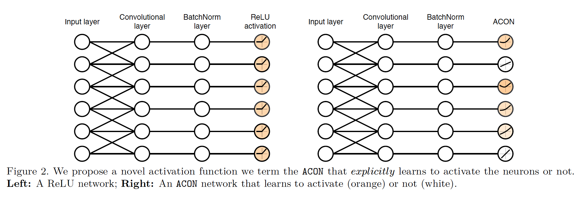

​		原则上，ACON是Swish的扩展，并且有动态的非线性度（non-linear degree），其中随着非线性函数变为线性，开关因子衰减为0。直观上，这种开关因子确保ACON能在激活与否之间开关。但是，证据[41]表明，仅通过使用梯度下降来优化因子就不能学习线性和非线性之间进行开关。因此，我们为了快速学习而显式优化开关因子，并提出meta-ACON，其通过学习来学习是否激活（见图2）。尽管看起来是最小的改变，但是meta-ACON有大影响：它非常稳定地对各种任务进行了重大改进（甚至是高度优化且深度极高的SENet-154），并在元学习器中提供了新的架构设计空间，可以逐层、逐通道或逐像素地进行。在提供的空间中的这种设计超越了本文的焦点，但是这对未来的研究很有启发性。

​		ACON可以很好地在各种任务中迁移。无论小型模型还是大型模型，我们的方法都明显比ReLU好：它分别提高MobileNet-0.25和ResNet-152的ImageNet top-1准确率分别提高6.7%和1.8%。我们展示其在目标检测和语义分割任务上的通用性。

​		我们将我们的贡献总结如下：（1）我们提出一种将Swish理解为平滑ReLU的新颖观点；（2）根据这种有价值的观点，我们将两种看似无关的形式（ReLU和Swish）联系起来，并将ReLU的Maxout系列与Swish的ACON系列平滑化；（3）我们提出meta-ACON，其显式激活神经元与否，并显式提高性能。

### 2. 相关工作

**激活函数**	Rectified Linear Unit（ReLU）[13、24、39]及其变体[37、15、7、35]是过去几年最广泛使用的激活函数。ReLU在零处不可微，在其他任何地方都可微。许多进步遵循[27、45、1、17、40、11、55]，softplus [10]是基于LogSumExp函数的最大函数ReLU的平滑近似。

​		MaxOut[12]可以任何非凸激活函数的分段线性近似。它泛化了Leaky-ReLU和ReLU，并且可以近似线性激活。Maxout是许多最新激活函数的一般形式。在这项工作中，我们提出一系列新的激活，其为Maxout系列的平滑近似。例如，最近的搜索技术通过结合一整套全面的一元函数和二元函数，为称为Swish [41]的新搜索标量激活做出了贡献。首先，搜索的结果表明SiLU[11、17]的形式（$y = x \cdot \mbox{Sigmoid}(x)$）在许多视觉任务上获得良好的性能，并比其他标量激活好。其次，这个方法也表明Swish的形式（$y = x \cdot \mbox{Sigmoid}(\beta x)$）也表现出巨大的潜能。但是，对于搜索到的Swish公式缺乏适当的解释。本文中，我们将Swish推广到ACON家族，这表明它是基于众所周知的称为$\alpha\mbox{-softmax}$的平滑变换的ReLU的平滑近似，该变换通常用于优化和神经计算[28、3、14]。

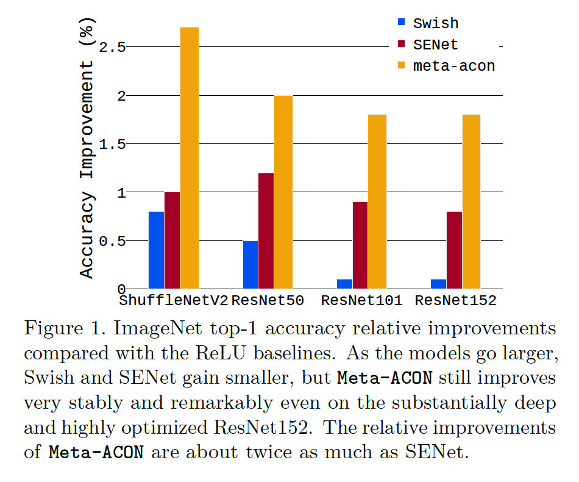

​		最近成为DY-ReLU[5]的激活将全局上下文编码到超函数，并采用对应的分段线性激活函数。该方法显着增加了参数数量，并显着提高了性能，尤其是在轻量化模型上。但是，当模型越来越大和越来越深时，这种改进变得很小。例如，尽管DY-ReLU从概念上概括了SENet，但ResNet50-DY-ReLU（仅提高1.0％，从76.2-> 77.2）不能超过ResNet50-SENet，但较大模型的改进却变小了。与DY-ReLU不同，第一，ACON学会确定激活是线性的还是非线性的。第二，我们的方法与ReLU网络有相当的参数。第三，即使在非常深和高度优化的ResNet-152上，性能的改进仍是非常显著的，这是SENet的两倍多（$\Delta \mbox{accurac}= 1.8 \mbox{ vs. } 0.8$，见图1）。

**Dynamic network**	对于所有的样本，标准的CNN[44、16、47、59、6、19、43、18]共享相同的网络结构和卷积核，而条件（或动态）CNN[29、32、54、58、26、34]使用以输入样本为条件的动态核、宽度或深度，其在准确率方面获得明显的增加。

​		一些动态网络学习动态核[56、34]，一些使用基于注意力的方法[50、33、2、51、20]来改变网络结构，另一系列工作[52、21]关注卷机网络的动态深度，其针对不同的样本跳过一些层。在我们的工作中，我们在激活函数中动态地学习非线性程度，其控制非线性层的程度是多少。

**Neural network design space**	神经网络架构的设计主要包含核级（kernel level）空间核特征级（feature level）空间。最常用的特征设计空间旨在通过通道维度[47、48、43、36、20]、空间维度[49、4、23]和特征组合[16、22]优化性能。在最近的流行核设计空间中，我们可以优化核的形状[46、57、25]和核计算[56、34]。在这项工作中，我们通过自定义没层中非线性程度提供非线性度级别上的新设计空间。

### 3. ACON

​		我们提出**Ac**tivate**O**r**N**ot（ACON）作为一种激活神经元与否的学习方式。本文中，我们首先证明我们如何使用通用的近似公式：_smooth maximum_[28、3、14]来进行ReLU-Swish的转换。接着，我们转换了一般Maxout [12]系列中的其他案例，这是一个自然而直观的想法，并使Swish成为ACON的特例。最后，ACON通过简单的维护一个开关因子学习激活（非线性）或不激活（线性），我们引入meta-ACON，其学习显式优化因子，并表现出明显的改进。

**Smooth maximum**	我们以简要回顾smooth maximum函数开始。考虑$n$个值的标准maximum函数$\max(x_1,\cdots,x_n)$，我们有其平滑和可微的近似：

$$S_\beta(x_1,\cdots,x_n) = \frac{\sum_{i=1}^n x_i e^{\beta_{x_i}}}{\sum_{i=1}^n e^{\beta_{x_i}}}\tag{1}$$

其中$\beta$为开关因子（switching factor）：当$\beta\rarr\infin$时，$S_\beta\rarr \max$；当$\beta \rarr 0$时，$S_\beta \rarr \mbox{arithmetic mean}$。

​		在神经网络中，许多常用激活函数为$\max(\eta_a(x), \eta_b(x))$函数（例如ReLU $max(x, 0)$及其变体）的形式，其中$\eta_a(x)$和$\eta_b(x)$表示线性函数。我们的目标是通过这个公式近似激活函数。因此，我们考虑$n=2$的情况，我们用$\sigma$表示Sigmoid函数，近似为：

$$\begin{align}&S_\beta(\eta_a(x), \eta_b(x))\\&=\eta_a(x)\cdot\frac{e^{\beta\eta_a(x)}}{e^{\beta\eta_a(x)}+e^{\beta\eta_b(x)}} + \eta_b(x)\cdot\frac{e^{\beta\eta_b(x)}}{e^{\beta\eta_a(x)}+e^{\beta\eta_b(x)}} \\ &=\eta_a(x)\cdot \frac{1}{1 + e^{-\beta(\eta_a(x) - \eta_b(x))}} + \eta_b(x)\cdot \frac{1}{1 + e^{-\beta(\eta_b(x) - \eta_a(x))}}\\ &= \eta_a(x)\cdot\sigma[\beta(\eta_a(x)-\eta_b(x))] + \eta_b(x)\cdot\sigma[\beta(\eta_b(x)-\eta_a(x))] \\&=(\eta_a(x) - \eta_b(x)) \cdot \sigma[\beta(\eta_a(x) - \eta_b(x))] + \eta_b(x)\end{align}\tag{2}$$

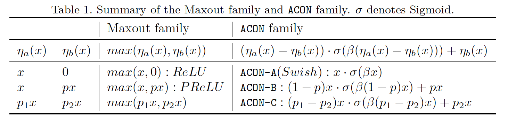

**ACON-A**	当$\eta_a(x)=x,\eta_b(x)=0$时，我们考虑ReLU的情况，然后$f_{\mbox{ACON-A}}(x)= S_{\beta}(x，0)= x\cdot\sigma(x)$，我们称之为ACON-A，并且恰好是Swish的公式[41]。Swish是最近新的激活，其是基于NAS的结果，尽管它最近得到广泛使用，但是缺乏它为什么能提高性能的合理解释。根据上述观点，我们观察到Swish是ReLU的平滑近似。

**ACON-B**	直观上，基于这种近似，我们可以将Maxout系列中其他基于最大的激活（例如Leaky ReLU、PReLU等）转换为ACON系列。接着，我们介绍PReLU的近似。它的原始形式为$f(x)=\max(x,0) + p \cdot \min(x, 0)$，其中$p$为可学习的参数，并且初始化为0.25。但是，在大多数情况$p < 1$中，在这种假设中，我们将它重写为$f(x) = \max(x, px)(p<1)$。因此，我们考虑式（2）中$\eta_a(x)=x,\eta_b(x=px)$的情况，并且得到如下的新激活，我们称为ACON-B：

$$f_{\mbox{ACON-B}}(x) = S_\beta(x, px) = (1-p)x\cdot\sigma[\beta(1-p)x]+px\tag{3}$$

**ACON-C**	直观上，我们介绍一种简单而通用的情况，我们称为ACON-C。我们采用两个参数的函数，以及额外的超参数。ACON-C遵循ACON-B的精神，其简单实用特征上的超参数缩放。形式上，令$\eta_a(x)=p(x)$、$\eta_b(x) = p_2x(p_1\ne p_2)$：

$$f_{\mbox{ACON-C}}(x) = S_\eta(p_1x,p_2x) = (p_1-p_2)x\cdot\sigma[\beta(p_1-p_2)x]+p_2x\tag{4}$$

​		与PReLU相同，$\beta$、$p_1$和$p_2$都是逐通道的。我们的ACON-C的定义非常简单和通用的情况（见图3和图4）。此外，在Maxout系列中可能有许多更复杂的情况（例如更复杂的$\eta_a(x)$和$\eta_b(x)$形式），其超出本文的范围。我们关注这种简单形式上的转换的特性。

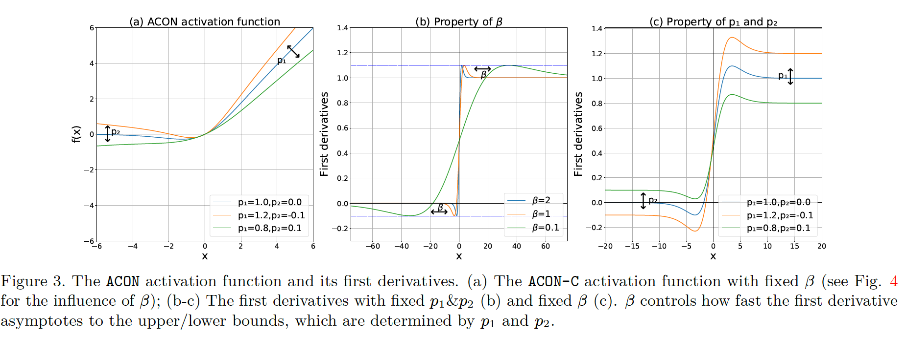

**Upper/lower bounds in the first derivative**	我们证明Swish有固定的上。下界（图3b），但是我们的ACON-C的定义允许梯度有可学习的上/下界（图3c）。形式上，我们计算ACON-C的一阶导数及其极限，如下所示：

$$\begin{align} &\frac{d}{dx}[f_{\mbox{ACON-C}}(x)] \\&= \frac{(p_1 - p_2)(1 + e^{-\beta(p_1x-p_2x)})}{(1+e^{-\beta(p_1x-p_2x)})^2} \\&+ \frac{\beta(p_1-p_2)^2e^{-\beta(p_1x-p_2x)}x}{(1+e^{-\beta(p_1x - p_2x)})^2} + p_2\end{align}\tag{5}$$

$$\lim_{x\rarr\infin}\frac{df_{\mbox{ACON-C}}(x)}{dx} = p_1, \lim_{x\rarr-\infin}\frac{df_{\mbox{ACON-C}}(x)}{dx} = p_2(\beta > 0)\tag{6}$$

​		为了计算上/下界，它们是最大/最小值，我们计算二阶导数：

$$\begin{align}&\frac{d^2}{dx^2}[f_{\mbox{ACON-C}}(x)]\\&=\beta(p_2-p_1)^2e^{\beta(p_1-p_2)x}\cdot\\&\frac{((\beta(p_2-p_1)x + 2)e^{\beta(p_1-p_2)x} + \beta(p_1 - p_2)x+ 2)}{(e^{\beta(p_1-p_2)x}+1)^3}\end{align}\tag{7}$$

我们设置$\frac{d^2}{dx^2}[f_{\mbox{ACON-C}}(x)]=0$，将其简化，并得到$(y-2)e^y=y+2$，其中$y = (p_1-p_2)\beta x$。解这个等式，我们得到$y \approx \pm 2.39936$。然后，当$\beta > 0$时，我们得到式（5）的最大和最小：

$$\begin{align}\mbox{maxima}(\frac{d}{dx}[f_{\mbox{ACON-C}}(x)]) &\approx 1.0998 p_1 - 0.0998 p_2, \\ \mbox{minia}(\frac{d}{dx}[f_{\mbox{ACON-C}}(x)]) &\approx 1.0998 p_2 - 0.0998p_1\end{align}\tag{8}$$

这与在一阶导中有固定上/下界$(1.0998,-0.0998)$的Swish不同。在Swish中，超参数$\beta$仅确定一阶导数渐近线到达上界和下界的速度，但是，这些界限是可学习的，并由ACON-C中的$p_1$和$p_2$确定（请参见图3c）。学习到的边界对于简化优化至关重要，并且我们通过实验表明，这些可学习的上界/下界是改善结果的关键。

#### 3.1. Meta-ACON		

​		ACON将激活切换为激活还是不激活，因为切换因子$\beta$将其控制为非线性或线性。具体而言，当$\beta\rarr\infin$时，$f_{\mbox{ACON-C}}(x)\rarr\max(p_1x,p_2x)$；当$\beta\rarr0$时，$f_{\mbox{ACON-C}}(x)\rarr\mbox{mean}(p_1x,p_2x)$。因此，与诸如ReLU的传统激活不同，ACON允许每个神经元自适应地激活与否（见图2）。这种自定义激活行为有助于提高泛化和迁移性能。这启发我们开发如下的meta-ACON，其在自定义激活中起着关键作用。

​		我们提出的概念很简单：显式学习以输入样本$x \in \mathbb{R}^{C \times H \times W}$为条件的开关因子$\beta$：$\beta = G(x)$。我们不打算提出一种特定的结构，我们在生成函数$G(x)$中提供了一个设计空间。

**Design space**	这种概念比特定的架构更为重要，后者可以是逐层、逐通道或逐像素的结构。我们的目标时提出一些简单的设计样例，其获得了显着提高的精度，并展现出这一新设计空间的重要性。

​		我们简要使用路由函数来计算以输入特征为条件的$\beta$，并提出一些简单的结构。首先，这种结构可以是逐层的，其意味着层中的元素共享相同的开关因子。形式上，我们有：$\beta = \sigma\sum_{c=1}^C\sum_{h=1}^H\sum_{w=1}^W x_{c,h,w}$。

​		其次，我们提出一种简单的逐通道结构，其表示通道中的元素共享相同的开关因子。形式上，我们将其表示为：$\beta_c = \sigma W_1W_2\sum_{h=1}^H\sum_{w=1}^W x_{c,h,w}$。我们使用$W_1 \in \mathbb{R}^{C \times C/4}$、$W_2 \in \mathbb{R}^{C/r\times C}$来保存参数（默认情况下$r=16$）。为了进一步减小大模型（Res152）的参数量，我们发现逐深度的全连接层也获得很好的结果。

​		然后，对于逐像素结构，所有元素使用不同的因子。尽管可能有许多结构设计方法，但我们只是简单地介绍了一个非常简单的结构，旨在介绍按像素的示例。形式上，我们有：$\beta_{c,h,w} = \sigma x_{c,h,w}$。

​		我们注意到，我们的meta-ACON有一种直接的结构。对于如下的meta-ACON实验，如果没有其他说明，我们使用逐通道的结构和ACON-C。更复杂的设计有潜力提高性能，但是不是这项工作的重点。

### 4. 实验

#### 4.1. 图像分类

​		我们对具有挑战性的ImageNet 2012分类数据集[9、42]进行了全面的实验比较，并进行了全面的笑容实验。 为了进行训练，我们遵循惯例，并使用$224\times224$的相同输入大小来训练所有模型，并报告标准的top-1错误率。

**ACON**	我们首先在轻量化的CNN（MobileNet和ShuffleNetV2）和深层CNN（ResNet）上评估我们的ACON。对于轻量化CNN，我们遵循[36]中的训练配置；对于更大的模型ResNet，我们使用从0.1的线性衰减学习时间表、1e-4的权重衰减、256的批大小和600K迭代。通过简单地更改各种网络结构和各种模型大小上的所有激活，我们运行了许多实验来分析ACON激活函数的行为。基线网络是ReLU网络，并且ACON中的额外参数可以忽略。

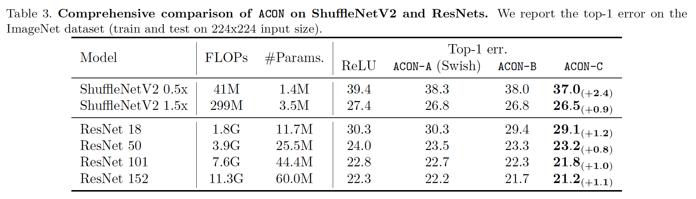

​		根据表3和图3，我们有两个主要观察：（i）相比基于max的函数，ACON-A、ACON-B、ACON-C都显著提高了准确率。这表明可微和平滑的转换的好处。（ii）得益于ACON-C的一阶导数的自适应上/下界，ACON-C的性能优于ACON-A（Swish）和ACON-B。（iii）尽管，随着模型变得更深和更大，ACON-A（Swish）表现出很小的改进（ResNet-101上为0.1%），但是我们从ACON-C上获得持续的准确率（ResNet-101上提高1.0%）。

**Meta-ACON**	接下来，我们评估meta-ACON函数。对于轻量化的CNN，我们将所有ReLU激活都改为meta-ACON，对于深层CNN（ResNet-50、ResNet-101），我们改变每个构建块中的一个ReLU（$3 \times 3$卷机之后）改为meta-ACON，以避免过拟合问题。

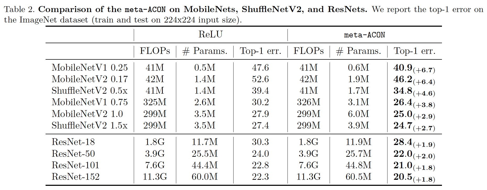

​		表2中的结果表明，我们设法在所有网络结构中获得了显着的性能提升。对于轻量化CNN，meta-ACON在MobileNetV1-0.25上提高6.7%，并且在300M级别模型上也获得约3%的准确率增益。对于更深的ResNet，meta-ACON仍表现出明显的改进，其在ResNet-50和ResNet-101上的增益分别为2.0%和1.8%。

​		为了揭示原因，在图5中，我们在最后一个瓶颈中选择了一个层，并比较了在ResNet-50中学习到的分布。ACON对于整个数据集中的所有不同样本共享相同的分布，但是，在meta-ACON中，不同的样本具有不同的非线性度，而不是在ACON中共享相同的非线性度。具体而言，一些方法倾向有更多值接近0，其意味着，对于如此的样本，网络倾向于有更多的值远离0，这意味着网络为如此的样本自适应地学习更高的非线性。这是直观上合理的结果，因为不同的样品通常具有完全不同的特征和特性。

#### 4.2. 消融研究

​		我们允许几个消融实验来分子所提出的ACON和meta-ACON激活。

**与其他激活的比较**	

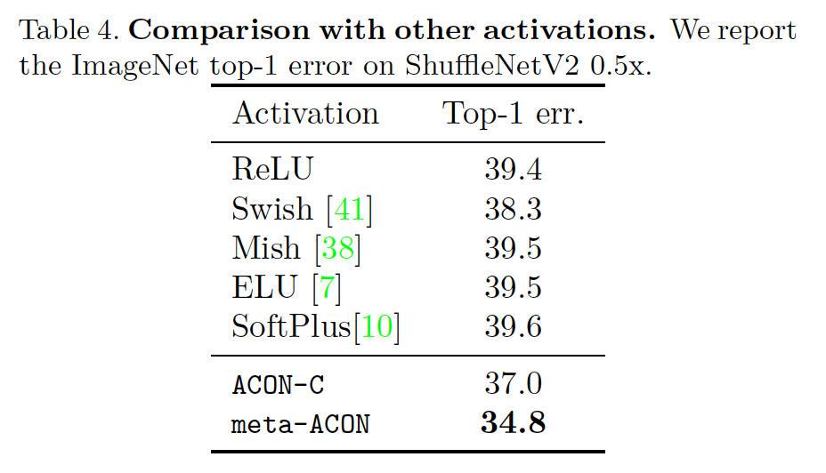

**meta-ACON中的设计空间**	我们提供meta-ACON（3.1节中$G(x)$）中的新架构设计空间。当开关因子决定激活中的非线性时，我们为每个样本在不同级别生成$\beta$值，这些值可以是逐像素的、逐通道的和逐层的。我们的目标是提出一种宽设计空间，其在未来神经网络设计中提供更多的可能性，我们不打算在本文中提出最有效的特定模块，值得进一步研究。我们将研究第3.1节中描述的每个级别最简单的模块。表5给出ShuffleNetV2 0.5x上的比较。结果表明，这三个级别均可以显着提高准确率，如果设计更仔细，则可能会有更有效的模块。

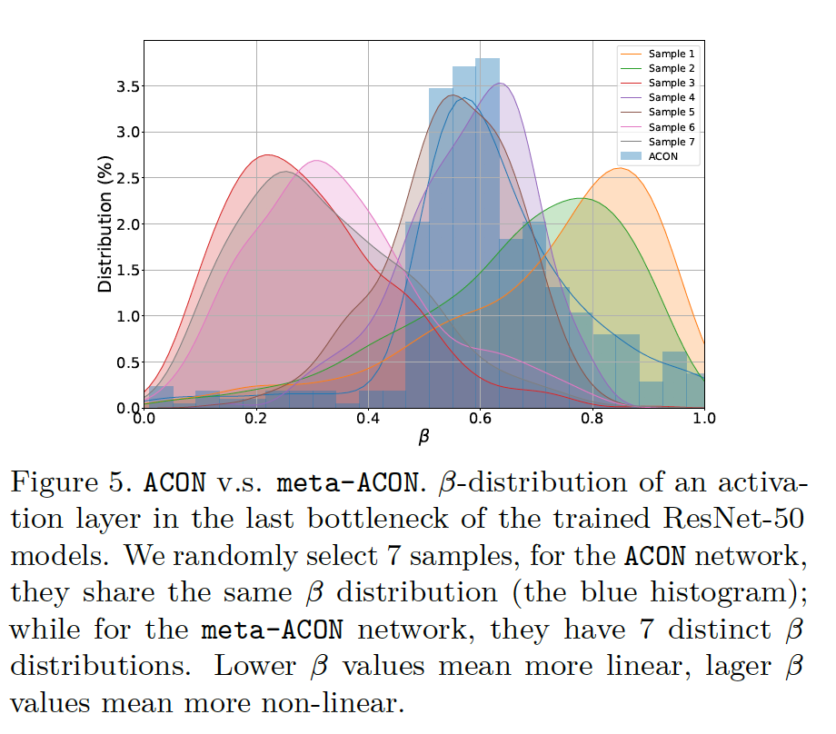

**开关因子分布**	在meta-ACON中，我们采用meta-learning模块来显式学习开关因子。图5显示了ResNet-50的最后一个激活层中学习因子的分布，我们将meta-ACON与ACON进行比较，并随机选择7个样本以展示结果。这种分布有三个结论：（1）meta-ACON学习到比ACON更广泛的分布；（2）每个有样本有其开关因子，而不是共享相同的因子；（3）一些样本有更多值接近0，这意味着一些神经元倾向不在这一层中激活。

**与SENet的比较**	我们已证明ACON有助于显著改进准确率。接下来，我们在不同结构上将逐通道的meta-ACON与高效模块SENet比较。我们在轻量化和深层CNN上进行全面的比较。表6表明meta-ACON在所有网络结构上明显比SENet好。

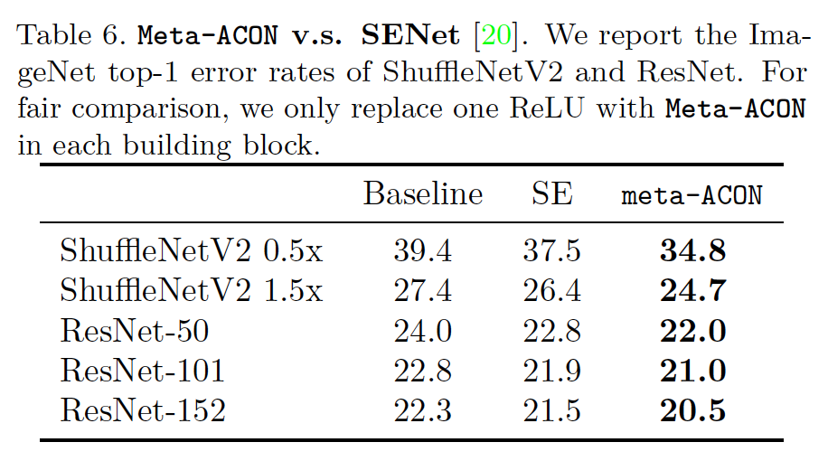

​		此外，我们在高度优化和极大的网络SENet-154上进行实验，这对于进一步提高准确性具有挑战性。我们重新实现SENet-154，并在相同实验环境下将激活改为ACON以进行比较。我们注意到SE与ACON-A或ACON-C一起是通道级meta-ACON结构的一种情况，它们之间的区别是可学习的上下边界（请参见第3节）。表7给出两种结果：第一，与ReLU激活相比，简单地将ACON-A（Swish）与SENet结合表现出相当甚至更糟的结果；第二，ACON-C在挑战性的ImageNet数据集上获得18.40的top-1错误率，其显著提高性能。

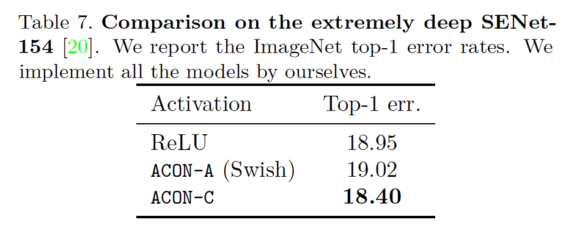

**更复杂的激活**	在前一节中，我们介绍了从一般的Maxout系列转换而来的$\{\mbox{ACON-A, ACON-B,ACON-C}\}$。最近，一种更强力的激活FReLU表现出视觉任务上的它的潜力。FReLU也属于Maxout系列。接着，我们通过根据FReLU的形式简单地修改$\eta_a(x)$和$\eta_b(x)$来评估ACON-FReLU。FReLU提升轻量化网络的准确率。但是，由于FReLU层和原始块都包含深度卷积，因此由于深度卷积的冗余利用，将ReLU函数直接更改为FReLU并不是最佳的。因此，为了评估性能，我们设计并训练了仅由逐点卷积和ACON-FReLU运算符构成的简单toy funnel网络（TFNet）。这种简单的块如附录的图2所示，附录的表1展示了整个网络结构。我们利用余弦学习时间表训练模型，其他设置遵循[36]中的工作。

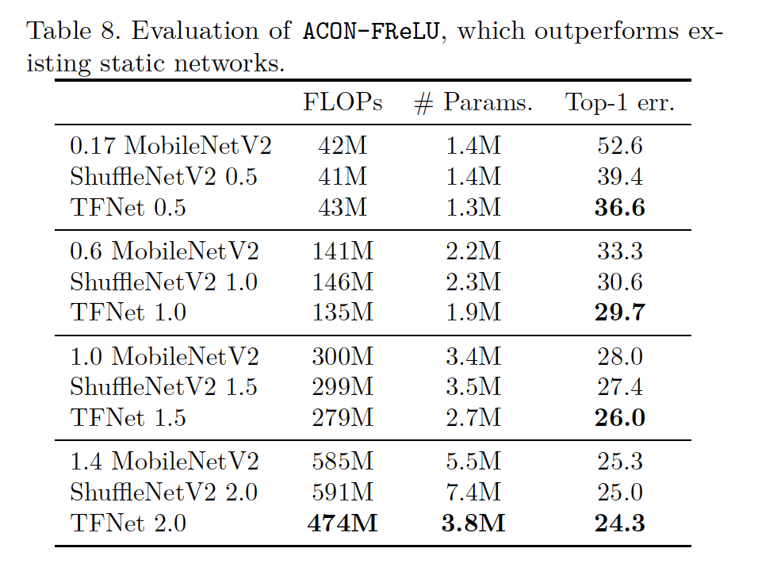

​		表8展示与SOTA轻量化网络的比较。尽管结构非常简单，TFNet表现出极大的改进。由于它的结构没有如SE模块的动态模块，我们根据WeightNet [34]将TFNet归类为静态网络。通过仔细地将动态模块添加到这个结构，我们可以得到最优的动态网络，其超出这项工作的重点。

#### 4.3. 泛化

​		我们的新激活可以轻松地扩展到其他任务，我们通过在目标检测和语义分割上的实验证明它的泛化。

**COCO 目标检测**	我们报告标准的COCO度量，包括$AP, AP_{50}, AP_{75},AP_{S},AP_{M},AP_{L}$。我们使用80k训练图像和35k验证图像的子集的并集来训练，并报告余下的5k验证图像（minival）上的结果。我们选择RetinaNet作为检测器，并使用ResNet-50作为主干。与常用的实践相同，我们使用的batch-size为2，1e-4的权重大小和0.9的momentum。我们使用3个尺度和3个宽高比的锚，并使600像素的训练和测试图像尺度。为了评估不同激活的结果，我们使用以不同激活作为骨干的ImageNet预训练的ResNet-50。表9表明，与其他激活相比，本文的激活有显著的性能改进。

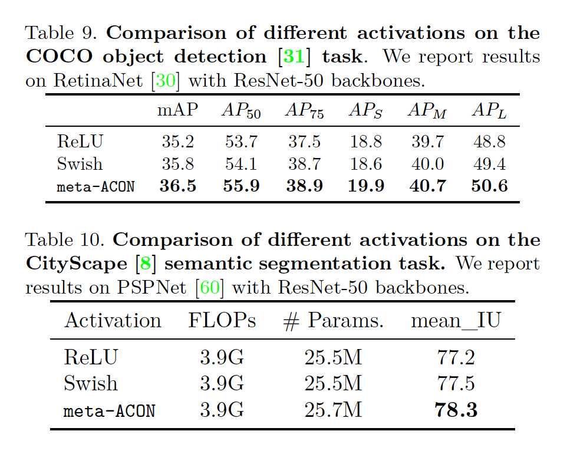

**语义分割**	我们进一步介绍在CityScape数据集上的语义分割结果。我们使用PSPNet作为语义分割框架，以及ResNet-50作为主干。正如常用的实践，我们使用多项式学习策略，其中基为0.01，指数为0.9、权重衰减为1e-4、批大小为16。表10展示了我们的结果（78.3），其比ReLU基线高1.1点，表现出比Swish更高的改进。鉴于帷幕的方法在不同任务上的有效性，我们希望它对于其他任务是一种强大而有效的激活方式。

### 附录

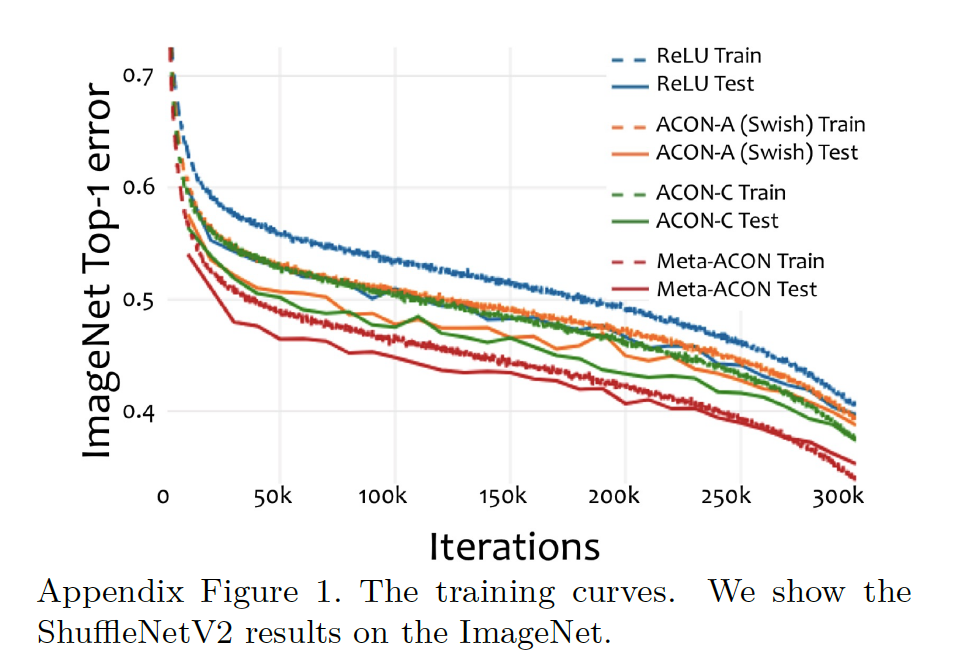

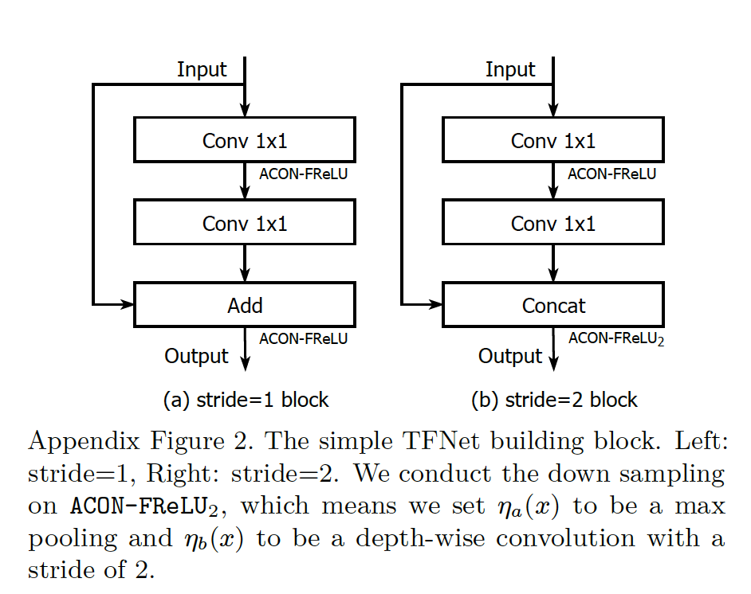

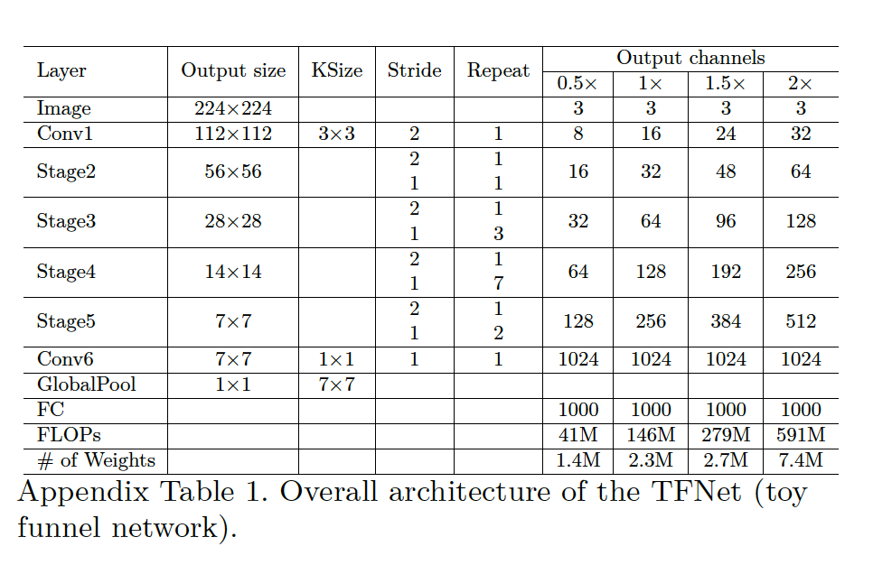

