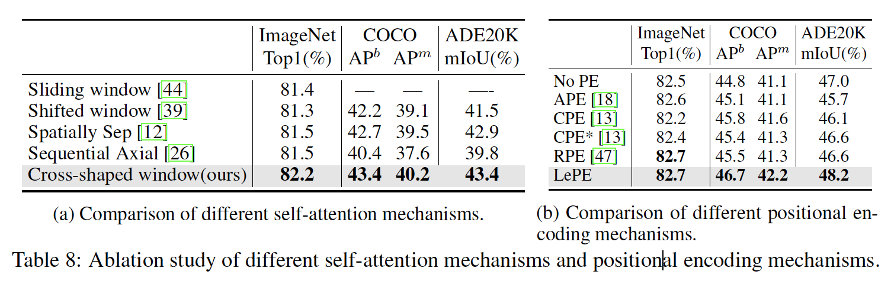

## CSWin Transformer: A General Vision Transformer Backbone with Cross-Shaped Windows

​		使用如halo和shift操作可以交换相邻窗口的信息，但是感受野增加非常缓慢，并且需要堆叠大量块来获得全局自注意力，这在计算上和内存上都是低效的。本文使用CSWin（Cross-Shaped Window：十字形窗口） self-attention，在水平和垂直条纹（stripe）中并行执行self-attention计算，每个条纹通过将输入特征拆分为等宽的条纹获得。条纹非常重要，它可以让模型获得强建模能力，同时限制计算成本。具体来说，根据网络深度调整条纹宽度：浅层有小宽度、深层有更大的宽度。更大的条纹宽度鼓励长范围元素之间的更强连接，并在减小计算成本的情况下获得更好的网络容量。

​		CSWin自注意力机制并行地计算水平和垂直条纹，它将multi-head划分为并行的组，并且在不同的组上使用不同的自注意力操作。这种并行测量没有引入额外计算成本，同时扩大每个Transformer块中计算自注意力的区域。这种策略本质上与已有的在多头上使用相同注意力操作（图1 b、c、d、e）和依次进行不同注意力操作（图1 c、e）的自注意力机制[57、39、70、26]不同。

​		基于CSWin自注意力机制，作者遵循层次设计，并提出一种新的用于通用视觉任务的transformer架构，称为“CSWin Transformer”。作者还引入Locally-enhanced Positional Encoding （LePE），其对于输入变化的位置编码方法特别有效。LePE在每个transformer块中施加位置信息，并直接在注意力结果上操作，而不是注意力计算。

​		基础变体 CSWin-B 在没有任何额外训练数据或标签的情况下在ImageNet-1K上达到了 85.4% 的 Top-1 准确率，在 COCO 检测任务上达到了 53.9 box AP 和 46.4 mask AP，在 ADE20K 语义分割任务上达到了 51.7 mIOU， 分别以 +1.2、+2.0、1.4 和 +2.0 超过之前最先进的 Swin Transformer。

### 3	方法

#### 3.1	整体架构

​			对于大小为$H \times W \times 3$的输入图像，遵循[61]以及利用重叠的卷积令牌嵌入（步长为4的$7 \times 7$卷积层）来获得$\frac{H}{4}\times\frac{W}{4}$的补丁令牌，并且每个令牌的维度为$C$。采用4个阶段的层次结构，相邻阶段使用步长为2的$3 \times 3$卷积来减小令牌的数量以及加倍通道维度。因此，第$i$阶段的特征图有$\frac{H}{2^{i+1}} \times \frac{W}{2^{i+1}}$个令牌。每个阶段包含$N_i$个序列CSWin Transformer Block。CSWin Transformer与朴素的多头自注意力Transformer块有两个差异：1）使用Cross-Shaped Window Self-Attention替换自注意力机制；2）为了引入局部归纳偏置（inductive bias），将LePE作为并行模块添加到自注意力机制中。

#### 3.2	Cross-Shaped Window Self-Attention

**Horizontal and Vertical Stripes**	根据多头自注意力机制，输入特征首先被线性映射到$K$个头，然后每个头在水平或垂直条纹中进行局部自注意力。

​		对于水平条纹自注意力，$X$被均匀划分为不同重叠的相等宽度$sw$的水平条纹$[X^1,\cdots,X^M]$，并且它们中的每个头包含$sw \times W$个令牌。这里，$sw$为条纹宽度，并且可以调整以平衡学习能力和计算复杂度。形式上，假设第$k$个头的查询、键和值的维度都为$d_k$，然后第$k$个头的水平条纹自注意力的输出定义为：

$$\begin{align}&X = \big[X^1,X^2,\cdots,X^M\big], \mbox{ where } X^i \in \mathbf{R}^{sw \times W\times C} \mbox{ and }M = H/sw\\&Y_k^i=\mbox{Attention}(X^iW_k^Q, X^iW_k^K, X^iW_k^V), \mbox{ where } i = 1, \cdots, M \\&\mbox{H-Attention}_k(X)=\big[Y_k^1,Y_k^2,\cdots,Y_k^M\big]\end{align}\tag{1}$$

其中$W_k^Q \in\mathbf{R}^{C \times d_k}$、$W_k^K \in \mathbf{R}^{C \times D_k}$、$W_k^V \in \mathbf{R}^{C \times d_k}$分别表示查询、键和值的投影矩阵，$d_k$设置为$C / K$。垂直条纹自注意力可以相似推导，并且第$k$个头的输出表示为$\mbox{V-Attention}_k(X)$。

​		假设自然图像没有方向偏差，将$K$个头平均划分为两个并行组（每个组有$K/2$个头，$K$通常是偶数）。头的第一组进行水平条纹自注意力，而头的第二组进行垂直条纹自注意力。最后，这两个并行组的输出又被串联到一起。

$$\begin{align}\mbox{CSWin-Attention}(X) &= \mbox{Concat}(\mbox{head_1}, \cdots, \mbox{head}_k)W^O\\\mbox{ where head}_k &=\begin{cases}\mbox{ H-Attention }_k(X) &k=1,\cdots,K/2\\ \mbox{V-Attention}_k(X) &k=K/2+1,\cdots,K\end{cases}\end{align}$$

其中$W^O \in \mathbf{R}^{C\times C}$为常用的投影矩阵，其将自注意力结果映射到目标输出维度（默认设置为$C$）。

**计算复杂度分析**	CSWin自注意力的计算复杂度为：

$$\Omega(\mbox{CSWin-Attention})=HWC\ast(4C + sw \ast H + sw \ast W) \tag{2}$$

对于高分辨率输入，考虑到早期阶段中$H,W$大于$C$，后面阶段小于$C$，所以早期阶段选择小$sw$，后面阶段选择更大的$sw$。换句话说，调整$sw$可以灵活地在后期以有效的方式扩大每个令牌的注意力区域。此外，为了使$224\times224$输入的中间特征图大小可以被$sw$整除，根据经验将四个阶段的$sw$分别默认设置为$1,2,7,7$。

**Locally-Enhanced Positional Encoding**	由于自注意力操作是排列不变的，它会忽略2D图像中重要的位置信息。为了将这些信息添加回来，在现有的视觉transformer中使用了不同的位置编码机制。图3给出一些典型的位置编码机制，并将它们与本文提出方法进行比较。APE和CPE在馈入Transformer块之前将位置信息添加到输入令牌，而RPE[47]和本文的LePE在每个transformer块中纳入位置信息。但与在注意力计算中添加位置信息的 RPE（即 Softmax(QKT)）不同，本文考虑了一种更直接的方式，并将位置信息强加到线性投影值（value）上。假设value元素$v_i$和$v_j$的边由向量$e_{ij}^V \in E$表示，那么

$$\mbox{Attention}(Q,K,V) = \mbox{SoftMax}(QK^T/\sqrt{d})V + EV,\tag{3}$$

但是，如果考虑$E$中的所有连接，那么需要巨大的计算成本。作者假设，对于特定的输入元素，最重要的位置信息来自其局部领域。所以提出locally-enhanced positional encoding（LePE），并利用用于value $V$的depth-wise卷积算子实现它：

$$\mbox{Attention}(Q,K,V) = \mbox{SoftMax}(QK^T/\sqrt{d})V + \mbox{DWConv}(V), \tag{4}$$

#### 3.3	CSWin Transformer Block

​		CSWin Transformer块的公式为：

$$\begin{align}\hat{X}^l &= \mbox{CSwin-Attention}(\mbox{LN}(X^{l-1})) + X^{l-1}, \\X^l &= \mbox{MLP}(\mbox{LN}(\hat{X}^l)) + \hat{X}^l,\end{align}\tag{5}$$

其中 $X^l$ 表示第$l$ 个 Transformer 块的输出或前一个卷积层（如果存在于每个阶段的开始）。

#### 3.4	Architecture Variants

### 4	实验

#### 4.1	ImageNet-1K Classification

对于$224 \times 224$的输入大小，训练300 epoch。使用AdamW优化器，对于CSWin-T/S的权重衰减为0.05，CSWin-B的权重衰减为0.1。默认批大小和初始学习率分别设置为1024和0.001，使用余弦学习率调度器，并且在前20个epoch中使用线性预热。对于CSWin-T、CSWin-S和CSWin-B使用递增的随机深度增强的最大比率分别为0.1、0.3和0.5。当报告$384\times384$输入的结果，使用权重衰减$1e-8$、学习率$1e-5$和batch size 512微调30 epoch。

#### 4.2	COCO Object Detection

#### 4.3	ADE20K Semantic Segmentation

​		采用Semantic FPN[33]和UperNet[62]作为基框架。训练Semantic FPN 80K迭代，批大小为16；训练UperNet训练160K迭代，批大小为16，更多细节见补充材料。

#### 4.4	消融研究

**组件分析**

**Attention Mechanism Comparison** 和 **Positional Encoding Comparison**

### 附录

**ImageNet-1K Classification**	遵循DeiT中的训练策略。所有模型以$224 \times 224$的输入大小训练300个epoch。使用AdamW优化器，对于CSWin-T/S的权重衰减为0.05，CSWin-B的权重衰减为0.1。模型批大小和初始学习率设置为1024和0.001，并且使用余弦学习率调度和20个epoch的预热。数据增强包括：RandAugment（rand-m9-mstd0.5-inc1）、Mixup（prob=0.8）、CutMix（prob=1.0）、Random Erasing（prob=0.25）和Exponential Moving Average（ema-decay = 0.99992）、递增的随机深度（对于CSWin-T、CSWin-S和CSWin-B使用递增的随机深度增强的最大比率分别为0.1、0.3和0.5）。

​		当在$384 \times 384$输入上微调时，遵循[39]微调30个epoch，权重衰减设置为$1e-8$、学习率为$1e-5$、批大小为512。注意，较大的随机深度比率有利于微调并使其与训练阶段保持一致。

**COCO目标检测和实例分割**	使用两个经典的目标检测框架：Mask R-CNN和Cascade Mask R-CNN，它们给予mmdetection。对于Mask R-CNN，使用ImageNet-1K的预训练模型，以及两个设置：$1\times$时间表和$3\times$+MS时间表。对于$1\times$时间表，利用单尺度输入训练模型（图像的短边为800像素，长边不超过1333像素）12个epoch。使用0.0001的学习率、0.05的权重衰减和16的批大小的AdamW优化器。学习率在8和11个epoch时乘以0.1。随机深度与ImageNet-1K设置相同。对于$3\times$+MS时间表，利用多尺度输入（图像的短边在480和800之间，长边不超过1333）训练模型300个epoch。其他设置与$1\times$相同，除了在27和33epoch时衰减学习率。当训练Cascade Mask R-CNN时，使用与Mask R-RCNN相同的$3\times$+MS。

**ADE20K语义分割**	考虑两种语义分割框架：UperNet和Semantic FPN，这两个模型基于mmsegmentaion。对于UperNet，遵循[39]的设置，并使用初始学习率为$6e-5$、权重衰减为0.01和批大小为16（8张GPU，每张GPU两幅图像）的AdamW优化器训练160K迭代。在开始时使用1500次迭代的预热，并且使用线性衰减策略素爱见学习率。使用mmsegmentation中的默认增强策略，包括随机水平翻转、随着缩放（比例范围为$[0.5,2.0]$）和随机广度畸变。所有模型的输入大小为$512\times512$。也适用ImageNet-1K中的随机深度。测试时，报告单尺度测试结果和多尺度（输入图像的$[0.5, 0.75, 1.0, 1.25, 1.5, 1.75]$）测试结果。

​		对于Semantic FPN，遵循[59]的设置，使用初始学习率为$1e-4$、权重衰减为$1e-4$和批大小为16（4张GPU，每张GPU4张图像）的AdamW优化器训练80K迭代。

**条纹宽度$sw$的更多分析**

